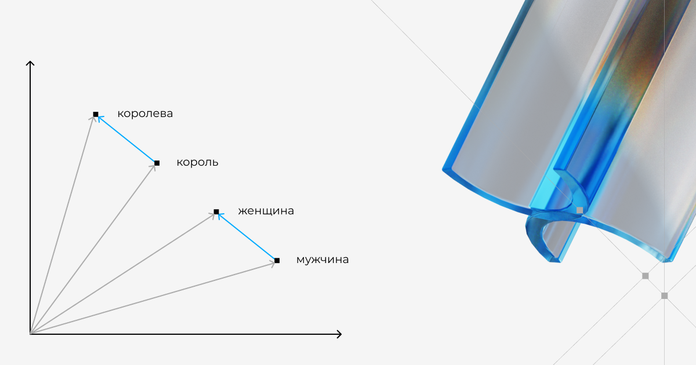
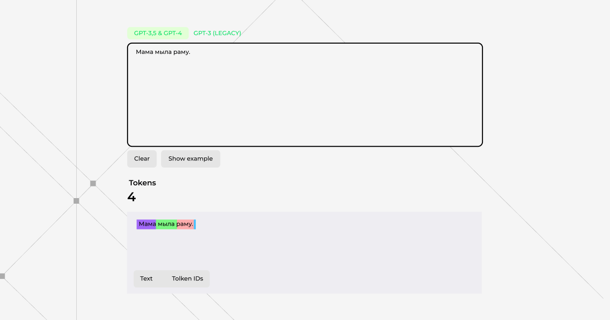
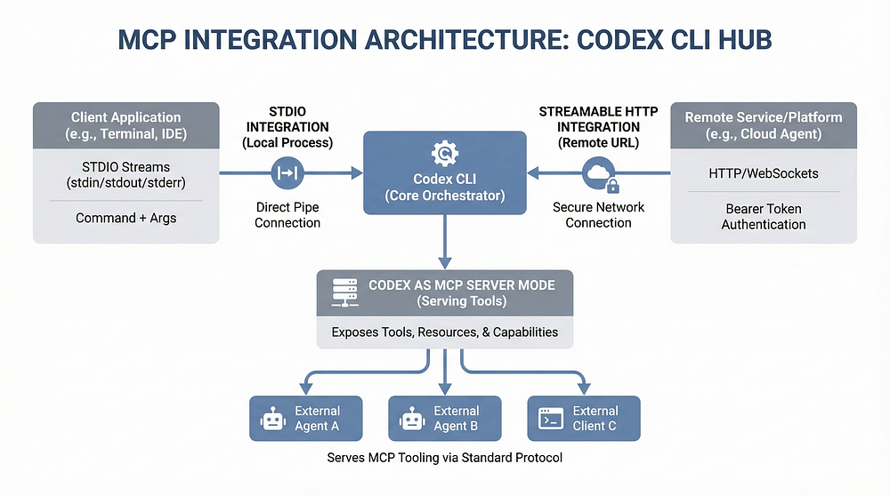

# Генеративный ИИ

Генеративный ИИ — это тип систем искусственного интеллекта, которые могут создавать новый контент, а не просто анализировать существующие данные.
Традиционный ИИ может, например, только классифицировать электронные письма как спам или не спам. А генеративный ИИ способен написать совершенно новое письмо. Первый подход анализирует и категоризирует, второй — создаёт нечто новое, чего раньше не существовало.

Для создания текстов лучше всего подходят большие языковые модели.

## LLM

Большие языковые модели (Large Language Model, LLM) — это вид генеративного ИИ, разработанный специально для работы с текстом. Эта программа понимает человеческий язык и генерирует на нём тексты. Программу обучают на больших объёмах данных: книгах, статьях, веб-сайтах и других текстовых ресурсах.

LLM обладают способностью не только понимать текст, но и генерировать его самостоятельно, вести диалог и отвечать на вопросы. Это делает их неоценимыми для разнообразных приложений, например, автоматизированных чат-ботов, или творческих задач, скажем, написания статей.

### Как работает LLM

LLM кодирует смысловую близость между словами. Слова кодиреются таким образом, чтобы учесть как они савязаны по смыслу. (Что это значит? для этого используется эмбеддинг (векторное представление слов). Эмбеддинг — это смысл токенов).Слова располагаем в неком «пространстве», где, например, рядом находятся слова «король» и «королева», «кошка» и «собака», «женщина» и «мужчина».




LLM работает так - она предсказывает, какое слово наиболее вероятно будет следующим, исходя из того, какие слова уже есть. Например, если мы начали с «Привет, как...», то скорее всего следующее слово будет «дела» или «прошёл» (твой день). 

Текст для модели — это токены — небольшие фрагменты слов, сами слова или знаки. Как будто предложение нарезали на кубики.



Большая языковая модель (LLM) генерирует текст шаг за шагом, каждый раз угадывая следующий маленький кусочек текста — токен — по тому, что уже написано. Этот выбор повторяется много раз подряд, и из цепочки угадываний получается цельный ответ.

Модель понимает следующий токен по статистике.

Для генерации текста используется контекст и механизм Attention.

**Контекст** — это вся информация, которую модель «знает» при генерации ответа, включая запрос пользователя (промпт), историю диалога, инструкции, подсказки, примеры.

**Attention** — это механизм внутри нейросети, который «смотрит» по всему тексту и взвешивает важность токенов. Его удобно представить как фонарик, подсвечивающий важные части уже увиденного текста: где-то важнее подлежащее, где-то — сказуемое или дополнение.


Итак, ключевые части генеративных нейросетей:

- эмбеддинг - выделение смысла слов (токенов)
- внимание - выделение выжности токенов
- вероятность  - на основе понимания смысла слов и их важности предугадывается следующее слово


# Claude

Семейство Claude 4 включает две основные модели: Claude Sonnet 4 и Claude Opus 4.1:

1. Claude Sonnet 4 — стандартный вариант, используется по умолчанию. Модель доступна бесплатно, но на платных тарифах выше лимиты и при необходимости [включается режим «размышления»](https://www.anthropic.com/news/claude-4) — так нейросеть дает более точные и обдуманные ответы.
2. Claude Opus 4.1 — более мощная модель для сложных задач, больших массивов данных и кода. Доступна только по подписке, но иногда дают бесплатно три запроса в месяц.

Обе модели умеют работать в гибридном режиме, то есть по умолчанию отвечают быстро, а на сложных задачах, если тариф позволяет, переключаются в «рассуждающий» режим.

Контекстное окно — то есть объем информации, который нейросеть помнит в рамках одной переписки — у обеих моделей составляет 200 тысяч токенов. Это примерно соответствует книге на 300—500 страниц. В контексте учитывается не только то, что загружаете вы, но и ответы нейросети, вложенные файлы, скриншоты и голосовые сообщения.

## Особенности

Модель [не забывает, о чем речь](https://www.reddit.com/r/ArtificialInteligence/comments/1kz1vv6/anyone_else_using_claude_4_for_longform_stuff), даже при долгом разговоре. Ее можно использовать для генерации кода, где результат зависит от предыдущих шагов.

## Четыре режима использования Claude

Claude предлагает четыре режима, но большинство людей пользовались только одним из них:

- Chat - самый знакомый интерфейс — в браузере или на мобильном. Подходит для вопросов, мозгового штурма, написания черновиков. Каждый разговор начинается с нуля, и вы всегда управляете процессом.

- Cowork - десктопный Agent. Может напрямую читать и изменять ваши локальные файлы, автоматически выполнять многошаговые задачи и выдавать результат прямо в вашу папку. Подходит для того, чтобы «отдать задачу», а не вести диалог туда-сюда.

- Code – режим для разработчиков, работает в терминале. Имеет доступ к кодовой базе, пишет код, выполняет команды, управляет Git.
- Projects – персистентное рабочее пространство. Достаточно один раз загрузить файлы и инструкции, и каждый новый разговор автоматически получит полный контекст. Подходит для повторяющихся задач: еженедельные отчёты, newsletter, клиентские поставки и т.д.


## Использование

### Базовая настройка

#### Первый запуск

При первом запуске Claude предложит пройти аутентификацию. Дальше всё сводится к двум шагам: перейти в нужную папку и запустить `claude`.

```bash
cd нужная_папка
claude
```

Ты внутри интерактивной сессии.

Необходимо создать именно папку, Claude Code работает в контексте текущей папки. Все настройки и «память» проекта живут внутри неё.

Идея простая: разные папки = разные проекты с разной логикой работы, разными файлами и разными настройками.

Можно отключить запросы разрешений командой:

```bash
claude --dangerously-skip-permissions
```

#### Конфигурирование Claude Code

Основные элементы конфигурации:

- `CLAUDE.md` – контекст и память проекта, что это за проект и как устроена работа
- `Output Style` – настраивает вывод Claude, как он должен отвечать
- `skills` – описывает типовые рабочие сценарии. Какие у тебя повторяющиеся процессы?

- `subagents` – делегирует отдельные задачи специализированным агентам, что требует отдельного фокуса?

#### Настройка

1 вариант. Для самого быстрого старта можно использовать команду `/init`

2 вариант. Стартовый промпт

> Я настраиваю Claude Code для [опиши свою задачу].
>
> Помоги мне спроектировать правильную конфигурацию:
> — Что должно быть в [CLAUDE.md](http://claude.md/)?
> — Какой output style лучше подойдёт?
> — Какие skills нужны?
> — Нужны ли subagents?
>
> Сначала задай мне вопросы, чтобы понять мой процесс.

### Claude.md

Это главный файл, который объясняет Claude, **что именно ты делаешь и как ты предпочитаешь работать**.

Claude читает этот файл в начале каждой сессии, поэтому именно здесь закладывается базовый контекст.

Местоположение по адресу `./CLAUDE.md` или `./.claude/CLAUDE.md`

В нем описывают:

- краткое описание проекта или направления работы;
- цели и ожидаемый результат;
- структуру файлов и папок;
- типовые рабочие процессы;
- правила оформления и шаблоны;
- терминологию, которую важно понимать правильно.

Для его создания можно указать команду:

```
Помоги мне создать [CLAUDE.md](http://claude.md/) для моего проекта. Задай вопросы, чтобы понять мой рабочий процесс и мои предпочтения.
```

Во время работы можно прямо в чате просить Claude запоминать твои предпочтения и добавлять их в память проекта.

```
Помни, что я предпочитаю маркированные списки вместо нумерованных.
```

### Skills

Skills — это под сути «модули экспертизы», которые Claude может подключать автоматически, когда понимает, что запрос подходит под определённый сценарий.

Идея простая: ты описываешь процесс один раз, а потом Claude узнаёт его и применяет сам.

Местоположение по адресу `.claude/skills/` и `~/.claude/skills/`. 

Пример создания:

```
Помоги создать навык для обработки заметок со встреч. Я хочу, чтобы они автоматически структурировались по темам, решениям, задачам и следующим шагам.
```

Пример использования:

```
У меня только что был звонок по бюджету на следующий квартал.
```

Claude:

- понимает, что это знакомый сценарий;
- подключает нужный skill;
- обрабатывает информацию по заданным правилам.

При необходимости он может даже писать вспомогательные скрипты, если это помогает сделать результат точнее.

### Subagents

Subagents — это отдельные агенты со своим собственным контекстом. Они полезны, когда разные типы задач лучше решать не в одном общем потоке, а в отдельных «ролях».

Цель использования:

- они не перегружают основной диалог;
- могут быть заточены под узкую область;
- помогают разделять исследование, планирование и исполнение;
- могут работать параллельно над разными аспектами задачи.

Местоположение по адресу `.claude/agents/` или `~/.claude/agents/`

Типы:

| Тип     | Что делает                                      | Когда использовать                                           |
| ------- | ----------------------------------------------- | ------------------------------------------------------------ |
| Explore | Быстрый просмотр и исследование в режиме чтения | Когда нужно найти файлы, понять структуру и собрать контекст |
| Plan    | Анализирует и продумывает подход                |                                                              |
|         |                                                 |                                                              |


# Codex

https://habr.com/ru/articles/1040296/

Полезные слэш-команды, которые стоит знать с первого дня:

- `/help` — показать все доступные команды.
- `/review` — запустить ревью последних изменений.
- `/skills` — список доступных навыков (если включены).
- `/debug-config` — показать активную конфигурацию и источники значений.
- `/compact` — запустить сжатие контекста вручную. Начиная с v0.98.0, компакция также **запускается автоматически** при достижении `auto_compact_limit`.
- `/clear` — очистить экран TUI, если он перегружен логами.
- `/statusline` — настроить отображение информации в нижней строке (токены, модель, время).
- `Ctrl + G` — открыть текущий промпт во внешнем редакторе (VS Code, Vim, Nano).


**Настройка многострочного ввода (Multiline TUI).**
По умолчанию `Enter` отправляет сообщение. Если вы хотите писать длинные блоки (аналог Heredoc прямо в TUI), добавьте это в `~/.codex/config.toml`:

```
[tui]
multiline_enter = true   # Enter делает перенос строки, а не отправку
# Отправка теперь по Cmd + Enter (macOS) или Ctrl + Enter (Win/Linux)
```

**Связка с внешним редактором:**
Если промпт становится слишком сложным, нажмите `Ctrl + G`. Codex откроет ваш `$EDITOR` (или то, что указано в `file_opener`), позволит комфортно отредактировать текст и вернет его в TUI после сохранения и закрытия файла. Это лучший способ "скармливать" агенту куски документации или сложные структуры.


## Стек конфигурации

Конфигурация Codex может быть описана на разных уровнях 

Где живут настройки:

- **System:** `/etc/codex/config.toml` (управляется админом, обычно в корпоративной среде).
- **User:** `~/.codex/config.toml` (ваши личные настройки по умолчанию; то, что вы будете править чаще всего).
- **Project:** `.codex/config.toml` (фиксируется в репозитории; общие правила для команды).
- **Флаги CLI:** переопределяют всё для конкретного вызова.


## AGENTS.md и каскадная система правил

`AGENTS.md` — это сердце системы инструкций Codex. Это файл в формате Markdown, в котором вы описываете правила игры для вашего проекта. В отличие от системных промптов, которые вы «зашиваете» в API, `AGENTS.md` живет в вашем репозитории. Он фиксируется в Git. Ваша команда может его редактировать.

Codex автоматически ищет `AGENTS.md` в текущей директории и всех родительских директориях. Это означает, что вы можете иметь:

- `~/projects/AGENTS.md` — правила для всех ваших проектов (например: «Всегда используй табуляцию, а не пробелы»).
- `~/projects/my-app/AGENTS.md` — правила для конкретного приложения (например: «Используй архитектуру портов и адаптеров»).
- `~/projects/my-app/src/components/AGENTS.md` — правила только для фронтенд-компонентов (например: «Только функциональные компоненты React с хуками»).

Codex объединяет эти правила перед началом работы. Если правила конфликтуют, побеждает то, которое находится ближе к редактируемому файлу.

**Бойлерплейт AGENTS.md:**

```
# Vision
Краткое описание проекта. Что мы строим? (Напр: "Быстрый API на Go для обработки платежей").

# Mandates
Жесткие запреты и обязательные правила.
- Никогда не используй глобальные переменные.
- Всегда используй интерфейсы для внешних зависимостей.

# Workflow
Как мы работаем.
- Сначала пиши тесты, потом реализацию (TDD).
- Коммиты только в формате Conventional Commits.

# Documentation
Требования к комментариям и документации.
- Все публичные методы должны иметь JSDoc/Godoc.
- Обновляй README.md при изменении API.
```

## Интеграция MCP (Model Context Protocol)

MCP позволяет Codex общаться с внешними инструментами и сервисами через стандартизованный интерфейс. 



MCP может использовать два типа транспорта:

- **STDIO серверы** запускаются как локальные процессы. Codex создает их и общается через stdin/stdout. Подойдет для большинства локальных штук: доступ к файлам, БД, Git, Jira.
- **Streamable HTTP серверы** работают удаленно через HTTP. Полезно для облачных инструментов, которым нужно сохранять состояние между сессиями.

Описание MCP в конфиге:

```toml
[mcp_servers]


[mcp_servers.node_repl]

args = []

command = "/Applications/ChatGPT.app/Contents/Resources/cua_node/bin/node_repl"

startup_timeout_sec = 120


[mcp_servers.openai-docs]

url = "https://developers.openai.com/mcp"
```


## Навыки (Skills)

Skill — это файл Markdown, который дает Codex специализированные знания для конкретных задач. Они основаны на открытом стандарте `agentskills.io`. Это значит, что навыки, написанные для Codex, также будут работать в Claude Code и других инструментах, поддерживающих стандарт.

**Зачем они нужны.** Ваш `AGENTS.md` всегда загружен. Каждый токен в нем «отъедает» место в контекстном окне на каждом ходу, вне зависимости от того, нужны эти инструкции сейчас или нет. Если в `AGENTS.md` прописаны правила миграции Laravel, они тратят ресурсы, даже когда вы правите Blade-компонент. Навыки решают это через **прогрессивное раскрытие**: Codex загружает только имя и описание при старте (всего пара токенов). Полный текст инструкций подгружается только при активации навыка — либо вами явно, либо автоматически.

Формат [`SKILL.md`](http://skill.md/):

```
---
name: laravel-migrations
description: Безопасная работа с миграциями БД в Laravel, включая откаты, изменение колонок и миграцию данных.
---
## Когда использовать этот навык
При работе с моделями Eloquent, миграциями или изменениями схемы БД.

## Инструкции
1. Всегда запускай `php artisan migrate:status` перед созданием новых миграций.
2. Проверяй сгенерированный файл на корректность перед запуском.
3. Никогда не меняй миграцию, которая уже была запущена. Создавай новую.
4. Для изменения колонок используй пакет `doctrine/dbal` и `$table->type()->change()`.
5. Всегда проверяй миграции через `php artisan migrate --pretend` перед применением.

## Частые ошибки
- Не редактируй миграции, уже примененные в продакшене.
- Следи за ограничениями внешних ключей при удалении/переименовании колонок.
- Используй `rollback --step=1` для отката последней пачки, а не `migrate:reset`.
```

YAML-заголовок — единственная обязательная часть. `name` — для явного вызова, `description` — для автоматического подбора.

### Структура skill

Agent Skills — это формат для расширения возможностей AI agent'ов за счет специализированных знаний и рабочих процессов. По сути, *skill* — это папка, содержащая `SKILL.md` файл. Skill также может содержать scripts, reference materials, templates и другие resources..

```
my-skill/
├── SKILL.md          # Required: metadata + instructions
├── scripts/          # Optional: executable code
├── references/       # Optional: documentation
├── assets/           # Optional: templates, resources
└── ...               # Any additional files or directories
```

Агенты осваивают навыки посредством **поэтапного раскрытия информации** в три этапа:

1. **Обнаружение** : При запуске *agent* загружает только *name* и *description* каждого доступного *skill*'а, чего достаточно, чтобы понять, когда он может быть актуален.
2. **Активация** : Когда задача соответствует описанию *skill*'а, *agent* считывает полные `SKILL.md` инструкции в контексте.
3. **Выполнение** : *Agent* следует инструкциям, при необходимости выполняя встроенный код или загружая указанные файлы.

Полные инструкции загружаются только тогда, когда этого требует задача, поэтому агенты могут держать под рукой множество навыков, используя лишь небольшой контекст.

### Обнаружение

Где хранить навыки (порядок поиска):

- **Repo:** `.agents/skills/` в вашем проекте (специфичные для проекта).
- **User:** `$HOME/.agents/skills/` (ваша личная библиотека).
- **Admin:** `/etc/codex/skills/` (на всю компанию). С v0.76.0+ поддерживаются **admin-scoped skills** — их нельзя переопределить на уровне проекта.
- **System:** в комплекте с Codex (встроенные).

**Активация.** Навыки включаются двумя способами:

- **Явно:** введите `/skills` для просмотра или используйте префикс `$` (например, `$laravel-migrations исправь миграцию`).
- **Неявно:** Codex сам подберет навык по описанию, если увидит подходящую задачу в вашем промпте.

Начиная с v0.97.0, Codex видит обновления навыков в реальном времени. Правите [`SKILL.md`](http://skill.md/) — и Codex тут же подхватывает изменения без перезапуска сессии. 

## Неинтерактивный режим для CI/CD

```
$ codex exec --skip-git-repo-check "Позови Васю на футбол"
```

Команда `exec` запускает Codex без UI. Он выполняет задачу и выходит со статус-кодом. Идеально для пайплайнов, крон-задач и любой автоматизации. 

## Ревью кода

**Ревью кода через** `/review`**:** Внутри интерактивной сессии введите `/review`. Codex проанализирует изменения и найдет то, что пропускают линтеры. Я делаю это перед каждым PR.

## Мульти-директории

Если несколько проектов лежат в разных папках, можно задать рабочую область и дать право на чтение дополнительных папок. 

```
codex --cd apps/frontend --add-dir ../backend --add-dir ../shared
Объяснить с
```

Флаг `--cd` задает рабочую область (где можно писать), `--add-dir` дает права на чтение дополнительных папок.

## Чтение изображений

Для чтения изображений используется флаг `-i` . Он прикрепляет изображение к начальному запросу.

```bash
codex -i "image.png" "Что означает эта ошибка в логах"
```

## Режим планирования

**Режим планирования (Plan mode):** Codex показывает структурированный план: что прочтет, что изменит, что запустит. Вы можете одобрить, дополнить или отклонить план. Это решает проблему «я попросил поправить опечатку, а Codex переписал полпроекта».

Для включения режима необходимо нажать `Shift+Tab`. 

## Установка плагинов (mcp)

```
codex plugin marketplace add /Users/paparshikov/repos/skills
codex plugin add dev@skills
```

Проверить подключение можно командами:

```
codex plugin list
codex plugin marketplace list
```

Плагин содержит конфигурацию запуска в `mcp.json`:

```
{
  "mcpServers": {
    "gitlab": {
      "command": "npx",
      "args": [
        "-y",
        "@zereight/mcp-gitlab@2.1.22"
      ],
      "env": {
        "GITLAB_API_URL": "https://...",
        "GITLAB_READ_ONLY_MODE": "false",
        "USE_GITLAB_WIKI": "false",
        "USE_MILESTONE": "false",
        "USE_PIPELINE": "true"
      },
      "env_vars": [
        "GITLAB_PERSONAL_ACCESS_TOKEN"
      ]
    },
    "yandex-tracker": {
      "timeout": 60,
      "command": "uvx",
      "args": [
        "yandex-tracker-mcp@0.7.1"
      ],
      "env": {
        "TRACKER_CLOUD_ORG_ID": "..."
      },
      "env_vars": [
        "TRACKER_TOKEN"
      ],
      "type": "stdio"
    },
    "yandex-wiki": {
      "command": "uvx",
      "args": [
        "ya-wiki-mcp@0.3.1"
      ],

      "env": {
        "YA_WIKI_ORG_ID": "...",
        "FASTMCP_MASK_ERROR_DETAILS": "true"
      },
      "env_vars": [
        "YA_WIKI_TOKEN"
      ]
    },
    "git": {
      "timeout": 60,
      "type": "stdio",
      "command": "uvx",
      "args": [
        "mcp-server-git@2026.6.4"
      ]
    }
  }
}
```
