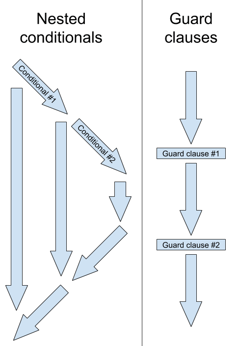

# Методология разработки

## ООП

### Абстракция и абстракция данных

Абстра́кция – способ управления сложностью системы, описывающий упрощенно объект на некотором уровне, не вдаваяся в детали реализации уровней ниже текущего. Это позволяет концентрироваться на небольшом количестве деталей одновременно. Т.е. программист работает с упрощенным интерфейсом и может добавлять дополнительные уровни функциональности. Например, при выполнении арифметических операций может не учитывать то, как они реализованы в железе, или при отправке email можно не учитывать нюансы взаимодействия по сети. Однако все абстракции «текут» (leaky abstraction), поэтому никогда не смогут полностью скрыть реализацию нижележащих слоев, однако это не отрицает полезности абстракции.

Абстракция данных – это структура данных, отделяющая *абстрактные* свойства типа данных от их реализации. Абстрактные свойства составляют *интерфейс* типа данных, контракт между типом данных и его клиентом, а конкретная реализация, не указанная в контракте, может изменяться. Эти изменения не должны оказывать никакого влияния на клиентский код.

### Инкапсуляция (encapsulation)

Происходит от латинского in capsula — размещение в оболочке, изоляция, обеспечение доступности главногоb и помезение второстепенного в условную капсулу (чёрный ящик). 

Используется для обозначения одного из двух или обоих сразу понятий:

·  сокрытие, механизм ограничения прямого доступа к некоторым компонентам [объекта](https://en.wikipedia.org/wiki/Object_(computer_science)). Например, для доступа к значениямиспользуются геттеры и сеттеры;

·  механизм объединения данных и методов их обработки.

Классическим является второе определение, но распространено заблуждение, что инкапсуляция неотрывна от [сокрытия](https://ru.wikipedia.org/wiki/Сокрытие_(программирование)).

## Типы архитектур

Задачей создания архитектуры программной системы является снижение сложности системы путём создания абстракций и разграничения полномочий между этими абстракциями.

Описание архитектуры выполняется на языке UML.

### Критерии хорошего и плохого дизайна

Хороший дизайн имеет код, обладающий характеристиками:

·  сопровождаемость

·  тестируемость

·  расширяемость

·  гибкость архитектуры при изменениях (flexibility)

·  низкое зацепление модулей

·  повторное использование (reuse)

Плохой дизайн имеет код, обладающий характеристиками (согласно Бобу Мартину):

#### Жесткость

Жесткость (Rigidity) – код тяжело изменить, поскольку любое изменение влияет на слишком большое количество других частей системы, стоимость изменений непредсказуема, сдерживает желание вносить изменения в код.

Примером проблемы является использование композиции при явном создании зависимости (смотреть Явное создание зависимости). Способом решения проблемы является следование DIP (т.е. доступ к зависимости через интерфейс, смотреть Фундаментальные шаблоны зависимостей

Следующая схема показывает силу зависимости между классами, возникающей при использовании разных шаблонов.

​                                

##### Ассоциация (association)

Базовый тип отношений: один класс знает о другом классе для того, чтобы работать совместно.

  

В самом слабом случае, класс получает ссылку на объект другого класса в методе:

class A
 {
   public function f(B $b) {}
 }

##### Делегирование

Отношение «является частью» (HAS-A Relationship). Объект внешне выражает некоторое поведение, но в реальности передаёт ответственность за выполнение этого поведения вложенному в него объекту. 

Как правило, вложенные объекты инджектируются через интерфейс (принцип DIP) и хранятся в private property. 

Преимущества: 

Можно инджектировать конкретный сервис через интерфейс в клиента в runtime и динамически изменять поведение клиента. Этот механизм используется в паттернах Strategy, Observer... Это обеспечивает большую гибкость по сравнению с наследованием. При наследовании устанавливаются статические зависимости, проверяемые на стадии компиляции.

Недостатки:

·  читабельностью кода хуже по сравнению с наследованием

·  отношения между классами не настолько предсказуемы, как в отношениях наследования. 

Пример:

*/** Делегируемый класс \*/
\* **class** A
 {
   **public function** f() {}
 }

 */** Делегирующий класс \*/
\* **class** B
 {
   **private** **$a**;

   **public function** __construct(A $a)
   {
     $this->**a** = $a;
   }

   **public function** f()
   {
     **return** $this->**a**->f();
   }
 }

 

*Пример, который потом переделать*

Предположим, что нужно хранить сведения о занятиях, причем занятия делятся на семинары/лекции и занятия с фиксированной оплатой/с повеременной оплатой. Наследование 

  

Потребуется дублирование кода по принципам оплаты в классах FixPriceЛекция/FixPriceСеминар и тд. Чтобы избавиться от дублирования потребуется логику оплаты из дерева наследования переместить в суперкласс *Занятие и* вставить условные операторы. Это позволит убрать из дерева наследования классы FixPriceЛекция/FixPriceСеминар. 

function cost () (

 switch ( $this->costtype ) { 

​    CASE self::TIMED: 

​    CASE self::FIXED:

}

Следует же стремиться наоборот, к замене условного оператора полиморфизмом. Этого можно достичь использованием делегирования и конкретно в данном случае паттерна Стратегия (Strategy). 

  

Здесь наследование (сильная связь) заменена делегированием (слабая связь). Этот паттерн является примером DIP: класс верхнего уровня Lesson получает через конструктор зависимость в виде абстрактного класса или интерфейса. 

Создается еще один абстрактный класс CostStrategy, в котором определен абстрактный метод cost (). Методу нужно передать экземпляр класса Lesson, который он будет использовать для расчета стоимости занятия. Конструктору иласса Lesson передается объект типа CostStrategy, который он сохраняет в виде свойства. Объект типа CostStrategy назвается делегатом иласса Lesson. Можно легко изменить способ расчета стоимости занятий, выполняемый объектом типа Lesson

*/** Класс Занятие \*/
\* **abstract class** Lesson {
   **private $duration**;
   **private $costStrategy**;

   **function** _construct (int $duration, CostStrategy $strategy)
   {
     $this->**duration** = $duration;
     $this->**costStrategy** = $strategy;
   }

   **function** cost()
   {
     **return** $this->**costStrategy**->cost($this);
   }

   **function** getDuration () 

  {
     **return** $this->**duration**;
   }

   **abstract function** charge();
 }

 */** Класс Лекция \*/
\* **class** Lecture **extends** Lesson
 {
   **function** charge()
   {
     **echo "Lecturing before the flow of students\n"**;
   }
 }

 */** Класс Семинар \*/
\* **class** Seminar **extends** Lesson {
   **function** charge()
   {
     **echo "Verification of laboratory works\n"**;
   }
 }

 */** Класс Стратегия Расчет стоимости \*/
\* **abstract class** CostStrategy
 {
   **abstract function** cost(Lesson $lesson);
 }

 */** Класс Повременная стоимость \*/
\* **class** TimedCostStrategy **extends** CostStrategy 
 {
   **function** cost(Lesson $lesson) 
   {
     **return** ($lesson->getDuration() * 5 );  
   }
 }

 */** Класс Фиксированная стоимость \*/
\* **class** FixedCostStrategy **extends** CostStrategy
 {
   **function** cost(Lesson $lesson)
   {
     **return** 30;
   }
 }

**new** Seminar(4, **new** TimedCostStrategy());
 **new** Lecture(4, **new** FixedCostStrategy());

Выделяют варианты делегирования:

###### Агрегация (aggregation, агрегирование по ссылке)

Объект-клиент хранит в свойстве ссылку на объект-сервис (как в примере выше). Оба объекта могут существовать независимо: если клиент будет уничтожен, то сервис продолжит существовать. 

**class** A
 {
   **private** **$b**;

   **public function** __construct(B $b)
   {
     $this->**b** = $b;
   }
 }

 

###### Композиция (composition, агрегирование по значению) 

Композиция – объект-клиент владеет объектом-сервисом, что означает, что он отвечает за его *создание* и *удаление*, т.е. он может существовать только как часть контейнера. Если контейнер будет уничтожен, то и объект-сервис тоже будет уничтожен. Композиция создает более сильно связанный дизайн, чем агрегация. Обилие композиции говорит о нарушении DIP, сформулированном Бобом Мартином, которую можно выразить в терминах агрегации и композиции: предпочитайте агрегацию (Dependency Injection) вместо композиции (явное создание сервиса внутри клиента через new), поскольку первая стимулирует использование абстракций, а не конкретных классов.

Строгая композиция в языках с автоматическим управлением памятью вообще невозможна, поскольку "часть" не может быть удалена во время удаления "целого".

**class** A
 {
   **private** **$b**;

   **public function** __construct()
   {
     $this->**b** = **new** B();
   }
 }

 

##### Наследование (Inheritance)

Отношение наследования (отношение «является», IS A Relationship) – самый сильный тип отношений зависимости, который может быть определен между двумя различными типами. Наследование также известно как повторное использование реализации . Количество кода, которое разделяется между двумя типами, огромно. Дочерний класс наследует и повторно использует все атрибуты и методы, которые содержит родительский класс и которые имеют public и protected видимость. 

Его невозможно разорвать во время исполнения (это отношение является статическим и, в строготипизированных языках определяется во время компиляции). Существуют ограничения единственного наследования.

Имеет смысл, если все, что справедливо для базового класса справедливо и для его наследника. 

Большие иерархии наследования говорят о сильно связанном дизайне. Как повторяется в книге «Банды Четырех», следует предпочесть агрегацию наследованию, поскольку первая дает большую гибкость и динамичность во время исполнения.

Наилучшей проверкой на то, стоит ли использовать наследование, является проверка на соответствие принципу Лисков, который также лежит в основе Контрактного программирования: Класс может наследовать от другого класса тогда и только тогда, когда он удовляет принципам контрактного программирования 

·  предусловия могут быть ослаблены (но не усилены) в подклассах;

·  постусловия могут быть усилены (но не ослаблены) в подклассах;

·  инварианты, могут быть усилены (но не ослаблены) в подклассах..

##### Примесь

элемент языка программирования (обычно класс), реализующий какое-либо поведение. Используется для уточнения поведения других классов, не предназначен для порождения самостоятельно используемых объектов. Преимуществом примесей является то, что повышая повторную используемость текстов программ, этот метод избегает многих проблем множественного наследования. Можно рассматривать как неполную реализацию множественного наследования, его частный вид

В PHP реализован через трейт:

**trait** SayWorld {

 **class** MyHelloWorld {
   **use** SayWorld;

можно также реализовать через магию __call

**abstract class** Base {
   /** Массив поведений */
   **private $behaviors** = [];

   /** Аттач поведения */
   **public function** attachBehavior(Behavior $behavior)
   {
     $this->**behaviors**[] = $behavior;
   }

   **public function** __call($name, $params)
   {
     **foreach** ($this->**behaviors as** $behavior) {
       **if** (method_exists($behavior, $name)) {
         **return** call_user_func_array([$behavior, $name], $params);
       }
     }
     **throw new** Exception(**'Calling unknown method: '** . get_class($this) . **"::**$name**()"**);
   }
 }

Принцип инверсии зависимостей (dependency inversion principle, DIP)) и внедрение зависимости (Внедрение зависимости (Dependency injection, DI)).

#### Хрупкость

Хрупкость (Fragility) – При внесении изменений неожиданно ломаются другие части системы. Является результатом признаков Жесткость, Плохая Читабельность, Ненужная повторяемость.

Пример: использование слишком сложных условий, которые легко поломать, добавляя новые условия:

if ($post_id == 1 || $post_id == 2 && $usergroup == 1) {…}

Лучше в свойстве класса хранить $post_ids и $usergroup и использовать их затем в условии:

$postIds = [];

 

$usergroup = 0;

 

public function addPostIds(int $post_id) : void

{

   $this->postIds[] = $post_id;

}

 

public function setUserGroup(int $usergroup) : void

{

   $this->usergroup = $usergroup;

}

#### Неподвижность

Неподвижность (Immobility) – Модули сильно связаны, код тяжело использовать повторно в другом приложении, поскольку его слишком тяжело «выпутать» из текущего приложения. Код лишен этого недостатка, если трудозатраты на его повторное использование меньше, чем стоимость разработки с нуля.

Наиболее явно эта проблема проявляется для монолитных приложений. Способ решения проблемы –делить сразу код на слабосвязанные модули. Идеальный вариант в пределе – микросервисная архитектура.

#### Вязкость

Выделяют:

·  Вязкость разработки – трудно вести разработку в архитектуре приложения, в то время как есть намного более удобный путь разработки в рамках другой архитектуры.

Например, у нас для вставки блока требуется передавать список аргументов виде URI, хотя более удобно было бы передавать аргументы в виде массива:

$this->block('controller/action/param1/param2/param3/param4/param5')

·  Вязкость окружения проявляется в неэффективности процесса deployment и тестирования приложения.

Например, если тестирование выполняется неудобно для разработчика и неавтоматизировано, то разработчик может систематически пренебрегать тестированием.

#### Ненужная Сложность

Встречается в виде:

·  наличие избыточной функциональности, которая была нужна когда-то или написана на будущее. Способ решения – соответствие принципу YAGNI (смотреть YAGNI (You aren't gonna need it, вам это не понадобится)). 

·  Выбор слишком сложной архитектуры. Например, на m.fishki.net вызов декоратора $tpl->decorator($path), который преобразует один массив в другой и вызывает формирование шаблона. Декоратор здесь лишний, шаблон можно вызывать напрямую.

#### Ненужная Повторяемость

Повторение одних и тех же кусков кода в разных местах. Зачастую, если дизайн обладает признаками жесткости/хрупкости, проще скопировать кусок кода, чем пытаться внести в него изменения. 

Недостатки: 

o  поправив что-то в одном месте, можно забыть сделать это в другом. 

o  как следствие, требуется больше сил и времени при внесении изменений

#### Плохая Читабельность

Примером является несоблюдение требований к оформлению кода:

·  несоблюдение отступов

·  отсутствие единообразия оформления кода

·  бессмысленное именование переменных, классов

Если код не обладает этими характеристиками (т.е. является гибким, надежным и повторноиспользуемым), то дизайн хороший. TDD позволяет на ранней стадии обнаруживать проблемы плохого дизайна.

 

## Общие понятия

 

### Текучий интерфейс

способ реализации [объектно-ориентированного](https://ru.wikipedia.org/wiki/Объектно-ориентированное_проектирование) [API](https://ru.wikipedia.org/wiki/API), нацеленный на повышение [читабельности](https://ru.wikipedia.org/wiki/Читабельность) исходного кода программы. Текучий интерфейс хорош тем, что упрощается множественный вызов методов одного объекта. Обычно это реализуется использованием [цепочки методов](https://ru.wikipedia.org/w/index.php?title=Цепочка_методов&action=edit&redlink=1), передающих контекст вызова следующему звену Такой стиль полезен повышением наглядности и интуитивности кода[]. 

$myCar->setSpeed(100)->setColor('blue')->setDoors(5);


 Посмотреть https://habrahabr.ru/company/mailru/blog/336788/

### Побочные эффекты

Побочные эффекты (side effects) – любые действия блока кода, изменяющие некоторое состояние вне локальной среды. Это наблюдаемый эффект, в дополнение к основному эффекту – возврат результата в точку вызова функции.

·  изменение нелокальной переменной

·  изменение статической локальной переменной

·  вызов других функций с побочными эффектами (операции ввода-вывода, взаимодействие с внешними сервисами)

·  вызов обработчиков исключений

·  изменение значения переменной, переданной по ссылке.

Исполнение функции с побочными эффектами зависеть от истории исполнения, порядок вызовов имеет значение. 

### Детерминированная функция

Детерминированная функция – которая для одного и того же набора входных значений возвращает одинаковый результат.

### Чистота функции

Чистая функция должна удовлетворять двум требованиям:

·  является детерминированной

·  не обладает побочными эффектами.

Наличие только одного из свойств недостаточно, для того чтобы функция была чистой.

функция rand, которая возвращает случайное число, или гипотетическая функция GetGlobalVarX, которая возвращает значение глобальной переменной X (и больше ничего не делает), не являются детерминированными, хотя они и не обладают побочными эффектами. А вот гипотетическая функция print, выводящая текст на экран и всегда возвращающая 0, наоборот — является детерминированной, но обладает побочным эффектом (вывод текста на экран). Ни одна из них не является чистой.

### Правило наименьшего удивления

Принцип (правило) наименьшего удивления (principle of least astonishment [ˈprɪnsəpl ɔv liːst əsˈtɔnɪʃmənt ]) – если назначение элемента неясно, то его поведение должно быть наиболее ожидаемым со стороны пользователя. Основная идея: использовать накопленные пользователем знания при использовании похожих элементов, знакомые паттерны, – для упрощения обучения. 

Примеры применения:

·  Выбор в программе таких имен переменных и методов, по которым пользователь интуитивно поймет смысл их работы

·  Выбор наиболее ожидаемых значений по умолчанию для параметров функции.

Например, в функции преобразования к int

***int\*** *intval* ( ***mixed\*** $var [, ***int\*** $base = 10 ] )

в качестве значения по умолчанию выбрана наиболее ожидаемая 10 система счисления.

### Технический долг

[https://ru.m.wikipedia.org/wiki/Технический_долг](https://vk.com/away.php?to=https%3A%2F%2Fru.m.wikipedia.org%2Fwiki%2F%D2%E5%F5%ED%E8%F7%E5%F1%EA%E8%E9_%E4%EE%EB%E3&cc_key=)

Технический долг (technical debt [ˈteknɪkəl det]) — накопившаяся стоимость дополнительной доработки кода, вызванной выбором простого решения, вместо того, чтобы использовать более эффективный подход, но который потребует больше времени

Причины возникновения:

·  выбор неверной начальной архитектуры

·  плохая архитектура

·  требования бизнеса по быстрому выпуску фич

·  отсутствие рефакторинга

Технический долг должен быть «погашен» в будущем путем выполнения незавершенной работы. 

Последствия непогашения технического долга

·  так же как и для финансового долга, начинают начислять проценты (пеня), технический долг растет и требует еще больших усилий для погашения. 

·  усложняет дальнейшее развитие проекта

·  превышаются сроки выполнения задач. В итоге проект начинает проигрывать своим конкурентам из-за низкой скорости доставки фич.

·  невозможно точно оценить сроки выполнения задачи

 

## SOLID (объектно-ориентированное программирование)

https://en.wikipedia.org/wiki/Coupling_(computer_programming)

https://en.wikipedia.org/wiki/Loose_coupling

http://sergeyteplyakov.blogspot.ru

http://blog.byndyu.ru

 

| **Инициал** | **Представляет**[**[1\]**](https://ru.wikipedia.org/wiki/SOLID_(объектно-ориентированное_программирование)#cite_note-ub-old-web-solid-1) | **Название**[**[4\]**](https://ru.wikipedia.org/wiki/SOLID_(объектно-ориентированное_программирование)#cite_note-:0-4)**, понятие** |
| ----------- | ------------------------------------------------------------ | ------------------------------------------------------------ |
|             |                                                              |                                                              |
| **O**       | OCP[[6\]](https://ru.wikipedia.org/wiki/SOLID_(объектно-ориентированное_программирование)#cite_note-6) | [**Принцип   открытости/закрытости**](https://ru.wikipedia.org/wiki/Принцип_открытости/закрытости) **(\*The Open  Closed Principle\*)**  «программные  сущности … должны быть открыты для расширения, но закрыты для модификации.» |
| **L**       | LSP[[7\]](https://ru.wikipedia.org/wiki/SOLID_(объектно-ориентированное_программирование)#cite_note-7) | [**Принцип   подстановки Барбары Лисков**](https://ru.wikipedia.org/wiki/Принцип_подстановки_Барбары_Лисков) **(\*The  Liskov Substitution Principle\*)**  «объекты в  программе должны быть заменяемыми на экземпляры их подтипов без изменения  правильности выполнения программы.» См. также [контрактное   программирование](https://ru.wikipedia.org/wiki/Контрактное_программирование). |
| **I**       | ISP[[8\]](https://ru.wikipedia.org/wiki/SOLID_(объектно-ориентированное_программирование)#cite_note-8) | [**Принцип** **разделения** **интерфейса**](https://ru.wikipedia.org/wiki/Принцип_разделения_интерфейса) **(\*The Interface Segregation  Principle\*)**  «много  интерфейсов, специально предназначенных для клиентов, лучше, чем один  интерфейс общего назначения.»[[9\]](https://ru.wikipedia.org/wiki/SOLID_(объектно-ориентированное_программирование)#cite_note-martin-design-principles-9) |
| **D**       | DIP[[10\]](https://ru.wikipedia.org/wiki/SOLID_(объектно-ориентированное_программирование)#cite_note-10) | [**Принцип** **инверсии** **зависимостей**](https://ru.wikipedia.org/wiki/Принцип_инверсии_зависимостей) **(\*The Dependency Inversion  Principle\*)**  «Зависимость на  Абстракциях. Нет зависимости на что-то конкретное.»[[9\]](https://ru.wikipedia.org/wiki/SOLID_(объектно-ориентированное_программирование)#cite_note-martin-design-principles-9) |

 

Все принципы описаны в статье Роберта Мартина.

Принципы направлены на соответствие приложения критериям хорошего дизайна (смотреть Критерии хорошего и плохого дизайна)

### Принцип единственной ответственности (SRP)

Принцип единственной ответственности (Single Responsibility Principle, SRP) – каждый объект должен иметь одну ответственность и эта ответственность должна быть полностью инкапсулирована в класс. Все его методы должны быть направлены исключительно на обеспечение этой ответственности. Класс требует разделения, если имеет более одной ответственности, и должен быть разделен на классы с единственной ответственностью.

Ответственность – это «причина изменения» класса, т.е. классы должны иметь только одну «причину для изменений». Под «причиной изменения» понимается потребность конкретного пользователя (заинтересованного лица). Т.е. класс не должен служить одновременно нуждам веб-пользователей и редакторов сайта. 

Пример нарушения:

**class** Post
 {
   *# Получить пост
\*   **public** **function** getPost()
   {
     $post = $this->selectPost();
     **return** $this->format($post);
   }

   *# Выбрать пост из базы данных
\*   **public** **function** selectPost()
   {
     **return** DB::*select*(**'****SELECT** **....'**);
   }

   *# Отформатировать вывод для* *HTML**
\*   **public** **function** format($post)
   {
     **return** **'<****p****>'**.$post[**'****title****'**].**'**p****>'**;
   }  
 }

В этом примере, в класс Post включены две лишние ответственности (причины для изменения):

·  ответственность за извлечение данных из БД. Класс Post придется измененять при изменении структуры таблиц или типа базы данных.

·   ответственность за форматирование данных. Класс Post придется изменять при изменении форматирования поста в HTML, а также невозможно без проблем добавить другие форматы, например, XML, JSON и т.д.

Способ исправления

Необходимо вынести отдельные ответственности в свои классы. Объекты классов отдельных ответственностей внедряются чере конструктор.

*# Ответственность класса - Пост
\* **class** Post
 {
   **private** **$db**;
   **private** **$fomatter**;

   **public function** __construct(Db $db, Formatter $formatter)
   {
     $this->**db** = $db;
     $this->**fomatter** = $formatter;
   }

   **public function** getPost()
   {
     $post = $this->**db**->selectPost();
     **return** $this->**formatter**->format($post);
   }
 }


 *# Ответственность класса - База данных
\* **interface** Db 
 {
   **public function** selectPost();
 }

 **class** DbMysql **implements** Db
 {
   **public function** selectPost()
   {
     **return** DB::*select*(**'SELECT ....'**);
   }
 }

 *# Ответственность класса - Форматирование вывода
\* **interface** Formatter
 {
   **public function** format($post);
 }

 **class** FormatterHtml **implements** Formatter
 {
   **public function** format($post)
   {
     **return** **''**.$post[**'title'**].**''**;
   }  
 }

Преимущества:

·  классы становятся более компактными, концентрированными, избегаем антипаттерна «Божественный объект». Повышается связность класса (смотреть Связность)

·  изменение некоторого поведения выполняется только в одном месте (классе), обладающем определенными знаниями. 

·  Позволяет тестировать какую-то ответственность приложения, инкапсулированную в класс, отдельно от остального кода (более того, даже если остальные классы пока не написаны).

Примеры ответственности:

·  взаимодействие с БД, 

·  верификация введенных данных, 

·  работа с куками.

Исключения

Принципу SRP не следует следовать строго, т.к. это может наоборот привести к усложнению архитектуры, усложнению поддержки. Если класс с несколькими ответственностями проще обслуживать, то лучше ответственности не делить по нескольким классам. 

### Принцип открытости/закрытости (OCP)

Принцип открытости/закрытости (The Open Closed Principle, OCP) *–*  Программные сущности (классы, модули, функции и т. п.) должны быть открыты для расширения, но закрыты для модификации. 

Расширение функциональности существующих классов должно выполняться путем создания новых классов, расширяющих возможности существующих, а не изменением уже существущих классов. Если требуется изменение реализации существующего класса (например, для исправления ошибок), то контракт (интерфейс) класса не должен нарушаться, т.е. не требуется вносить никаких изменений в клиентов этого класса. Это очень удобно в разработке, т.к. любые изменения никак не влияют на существующий код и не требуют регрессионного тестирования.

Интерпретации

Изначально соблюдение этого принципа предполагалось через использование наследования классов. Дочерний класс расширяет возможности родительского класса, при этом не изменяя существующий родительский класс. При этом допускается зацепление дочернего класса на нюансы реализации родительского класса.

Позже этот принцип был переосмыслен на реализацию интерфейсов. Перед созданием классов должен быть разработан интерфейс, закрытый для модификации. Класс должен реализовывать этот интерфейс и быть закрыт от модификации контракта, т.е. не нарушать работу клиентов при любый изменениях реалиации. 

Новые классы расширяют возможности существующего, но должны также реализовывать этот интерфейс. Т.е. реалиации этого интерфейса могут полиморфно замещаться одна другой. Способы расширения существующего класса: делегирование (предпочитетьней) или наследование. 

Делегирование – объект-клиент расширяет и комбинирует возможности включенных в него объектов-сервисов, при этом не изменяя сами объекты-сервисы. Для этого объект-клиент передает часть выполняемых им задач на обработку объектам-сервисам, вложенным в него. 

Преимущества:

·   гибкость приложения в условиях постоянно меняющихся требований.

### Принцип подстановки Барбары Лисков (LSP) 

Принцип подстановки Барбары Лисков (*Liskov Substitution Principle, LSP*) –  функции, которые используют ссылки на объекты базового класса (интерфейсы), должны иметь возможность использовать объекты дочерних классов (реализации интерфейсов), не зная об этом. Другими словами, дочерний класс (реализация интерфейса) должен быть взаимозаменяем с базовым классом (интерфейсом).

Принцип повторяет идеи контрактного программирования:

- предусловия могут быть ослаблены (но не усилены) в подклассах;

- постусловия могут быть усилены (но не ослаблены) в подклассах;

- инварианты, которые могут быть усилены (но не ослаблены) в подклассах. В частном случае – неизменяемые свойства базового класса не должны быть изменяемыми в подклассе. 

[Подробнее](#типы-контрактов) про предусловия, постусловия, инварианты.

Пример нарушения принципа – в родительском классе нет ограничений на тип параметра `$id`, в дочернем классе выполняется проверка `is_int($id)` (предусловие усилено в *subclass*'е):

```php
class Parent 
{
	public function calc($id) 
	{
		return $id+1;
	}
}

class Child extends Parent
{
	public function calc($id) 
	{
		assert(is_int($id));
        return $id+2;
	}
}

```

#### Ковариантность и контравариантность

(Мое) Термины ковариантность и контравариантность могут применяться в двух контекстах:

- как вариантность между типами (например, массивами, дженериками), образованными от базовых типов (классов), которые являются частью иерархии

- как вариантность типов аргументов и возвращаемых значений при переопределении методов в дочерних классах. В PHP эти термины обсуждают только в этом контексте. Подробнее в [1](PHP.md#lsp-в-php)

### Принцип разделения интерфейса (ISP) 

Принцип разделения интерфейса (Interface Segregation Principle, ISP) – классы не должны зависеть от тех методов в интерфейсе, которые они не используют. Т.е. интерфейс не должен включать методы, которые не будут использованы в классах, реализующих данный интерфейс. 

Это означает, что слишком «толстые» интерфейсы необходимо разделять на более маленькие и специфические,.

Преимущества:

·  низкое зацепление модулей

·  гибкость архитектуры при изменениях

Пример:

Здесь нарушен принцип ISP, т.к. класс BestComment вынужден реализовывать метод unfix, который он не использует. 

Решение: разделить интерфейс ITopComment на два интерфеса – IFixedComment и IBestComment.

interface ITopComment 

{

   \# Получить содержимое комментария

   public function get() : array;

   

   \# Открепить комментарий

   public function unfix(); 

}

 

class FixedComment implements ITopComment

{

   public function get() : array;

   {

​     return ['title' => ....];

   }

 

   public function unfix()

   {

​     $db->query("UPDATE ....");

   }

}

 

class BestComment implements ITopComment

{

   public function get() : array;

   {

​     return ['title' => ....];

   }

 

   public function unfix()

   {

​     \# Метод не используется в классе, т.к. невозможно открепить "Лучший комментарий"

   }

}

 

 

 

## GRASP

**GRASP** (*general responsibility assignment software patterns* — общие шаблоны распределения ответственностей; также существует английское слово *"grasp" — «контроль, хватка»*) — набор принципов для решения общих задач по назначению ответственностей [классам](https://ru.wikipedia.org/wiki/Класс_(программирование)) и [объектам](https://ru.wikipedia.org/wiki/Объект_(программирование)).

Всего 9 принципов.

- Информационный эксперт (Information Expert)

  Ответственность должна быть назначена тому, кто владеет максимумом необходимой информации для исполнения — информационному эксперту (аналог SRP). Локализует ответственность. 

- Создатель (Creator)

  Класс должен создавать экземпляры тех классов, которые он использует (по идее нарушение SRP). Лучшая альтернатива — [шаблон «Фабрика»]()

- Контроллер (Controller)

  Принимает запросы пользователя и делегирует исполнение другим компонентам (аналог [MVC]())

- Слабое зацепление (Low Coupling)

- Высокая связность (High Cohesion)

- Полиморфизм (Polymorphism) – аналог [полиморфизма в ООП]().

- Чистая выдумка (Pure Fabrication) – некий вспомогательный сервис, например, сервис для доступа к БД. Обеспечивает *Low Coupling* и *High Cohesion*, при этом сам не относится к предметной области. 

- Посредник (Indirection) – некоторый класс (сервис), который выступает посредником между двумя другими и обеспечивает их *Low Coupling*. 

  Пример: *controller* – посредник между *model* и *view*.

- Устойчивость к изменениям (Protected Variations) 

  Компоненты должны быть защищены от изменения других компонентов, с помощью их связывания через *interface*. 

## Паттерны программирования

Шаблон проектирования или паттерн (англ. design pattern) – архитектурная конструкция, представляющая собой решение проблемы проектирования в рамках некоторого часто возникающего контекста.

Основная литература: «Приёмы объектно-ориентированного проектирования. Паттерны проектирования» (англ. Design Patterns: Elements of Reusable Object-Oriented Software) — книга 1994 года о программной инженерии, описывающая шаблоны проектирования программного обеспечения. Авторами книги, которых прозвали «Бандой четырёх» (англ. Gang of Four, часто сокращается до GoF), являются Эрих Гамма, Ричард Хелм, Ральф Джонсон (англ.), Джон Влиссидес.

Плюсы: 

·  снижение сложности разработки за счёт готовых абстракций для решения целого класса проблем. 

·  Шаблон даёт решению своё имя, что облегчает коммуникацию между разработчиками, позволяя ссылаться на известные шаблоны.

Минусы:

·  слепое следование некоторому выбранному шаблону может привести к усложнению программы, у разработчика может возникнуть желание попробовать некоторый шаблон в деле без особых оснований.

 

### Цели использования паттернов

#### Борьба со сложностью

Основной способ борьбы со сложностью сводится к тому, чтобы в один момент времени мы могли сосредоточиться на минимальном количестве сущностей или абстракций. Связано с тем, что человек не в состоянии держать в голове одновременно слишком большое количество понятий (обычно говорится о цифре семь) и при увеличении их количества приходится свопить недостающую информацию и анализировать каждый из ее кусков повторно. Во-вторых, при увеличении количества сущностей, которыми мы оперируем в один момент времени, увеличивается и суммарная сложность их поведения. В итоге сложность растет экспоненциально, что приводит к невозможности удерживать задачу в голове даже при минимальном ее усложнение. Как следствие, это приводит к появлению ненужных ошибок.

#### Упрощение сопровождения

....

### Зависимости

Под зависимостями между модулями обычно подразумевают Зацепление (смотреть Зацепление)

#### История ослабления зависимостей

·  Традиционное процедурное программирование подразумевает написание процедур, которые сильно связаны между собой. 

·  ООП ввело понятие инкапсуляции , скрыв приватное поведение и открыв публичное, еще сильнее ослабив зависимости

·  Введено понятие интерфейса как границы взаимодействия между классами

·  Избавляются от двухсторонних зависимостей, убирают зависимости модулей нижнего уровня от модулей верхнего уровня (сервис ничего не знает о вызвавшем ее клиенте).

·  Разрыв односторонней связи использованием интерфейса. Клиент перестает зависеть от используемого сервиса, оба зависят от интерфейса. Особенно это эффективно, если удается разделить интерфейс у сервиса (ISP).

#### Термины

##### Интерфейс

https://ru.wikipedia.org/wiki/%D0%98%D0%BD%D1%82%D0%B5%D1%80%D1%84%D0%B5%D0%B9%D1%81_(%D0%BE%D0%B1%D1%8A%D0%B5%D0%BA%D1%82%D0%BD%D0%BE-%D0%BE%D1%80%D0%B8%D0%B5%D0%BD%D1%82%D0%B8%D1%80%D0%BE%D0%B2%D0%B0%D0%BD%D0%BD%D0%BE%D0%B5_%D0%BF%D1%80%D0%BE%D0%B3%D1%80%D0%B0%D0%BC%D0%BC%D0%B8%D1%80%D0%BE%D0%B2%D0%B0%D0%BD%D0%B8%D0%B5)

конструкция, определяющая зависимость между классами, общее поведение и не связаны никак иначе. Разработать интерфейс –разработать спецификацию (множества методов, которые каждый класс, использующий интерфейс, *должен* реализовывать). Реализация интерфейса классом – отношение **can-****do** (некоторые считают, что так же **is** **a**)

Интерфейсы (а также абстрактные классы), устанавливают взаимные обязательства между элементами программной системы, что является фундаментом концепции программирования по контракту (*design by contract*, DbC). 

Интерфейс определяет границу взаимодействия между классами, специфицируя определённую абстракцию, которую осуществляет реализующая сторона. Интерфейс помогает разорвать зависимость между клиентом и конкретной реализацией сервиса (т.е. позволяет реализовать DIP).

В PHP интерфейс позволяет преодолеть ограничение на один родительский класс. Реализация интерфейса , с точки зрения зацепления, более предпочтительна наследования классов (т.к. происходит зацепление по интерфейсу, а не по реализации).

Интерфейс в коде – строго формализованный элемент объектно-ориентированного языка, чистый абстрактный класс, в котором не определено ничего, кроме абстрактных методов. Например, в C++ нет понятия интерфейс, интерфейс реализуется через абстрактный класс.

 

  заменяет на   

Клиент зависел от сервиса, теперь оба зависят от интерфейса.

**Пример**: интерфейс батарейки, который поддерживает фонарик. Фонарик зависит от интерфейса батарейки, но не от ее реализации.

В имени класса НЕ НУЖНО использовать слово Interface или букву I. Т.к. интерфейс – это некоторая абстракция, которая должна иметь свое абстрактное имя (например, Animal). А уже конкретные реализации должны отражать свою специализацию в специализированных конкретных именах (например, Snake). Если необходимо слово Interface", т.к. имя интерфейса и реализации совпадают, то это запах кода, ошибка в архитектуре. 

##### Связность

Связность (cohesion [kəʊˈhiːʒən]) — сила взаимосвязанности элементов внутри модуля. В отношении ООП формулируется так: насколько хорошо все методы класса сфокусированы на главной цели.

Связность является порядковой величиной и обычно характеризуется как «высокая/сильная связность» (high/strong cohesion) или «низкая связность» (low cohesion). Критерием хорошего дизайна является «высокая связность». 

Преимущества высокой связности:

·  Сложность класса уменьшается, класс содержит меньшее количество методов. 

·  Упрощение обслуживания системы, так как изменения в одном классе влияют на малое количество других классов.

·  Высокое переиспользование модуля (подвижность) – т.к. легко найти модуль сфокусированный на решении требуемой задачи. 

Типы связности:

·  Случайная связность (худшая) – элементы модуля сгруппированы произвольно. К этому же варианту относится группировка элементов без их смысла, по типу (например, класс Utilities, класс ArrayHelper).

·  Функциональная сплоченность (лучшая) –  элементы модуля сгруппированы так, что они направлены на решение одной конкретной задачи.

##### Зацепление

Зацепление (coupling [ˈkʌplɪŋ]) – степень взаимосвязи между программными модулями. По сути под зацеплением и понимают зависимость между модулями.

Зацепление между двумя компонентами – мера вероятности того, что изменения одного компонента могут повлиять и на другой. Поэтому, если компоненты должны изменяться совместно, то сильное зацепление допустимо, если нет – то нет.

Связность и зацепление обычно противопоставляются друг другу: «высокая связность» часто означает в системе «низкое зацепление» и наоборот, «низкая связность» означается «высокое зацепление». 

Зацепление можут быть низким low (слабым weak, неплотным loose [ luːs ]) или высоким high (сильным strong).

Критерием хорошего дизайна является «низкое зацепление». 

Способом уменьшения зацепления (decoupling) является следование DIP, и его реалиации в виде принципа внедрение зависимости (DI).

Сильное зацепление обычно приводит к следующим признакам плохого дизайна:

·  хрупкость – изменения в одном модуле могут поломать другой модуль (смотреть Хрупкость)

·  неподвижность – модуль сложно переиспользовать, так как нужно за ним тянуть связанные модули (смотреть Неподвижность). 

·  нетестируемость – невоможно протестировать модуль изолированно от остальных.

·  если мы не владеем модулем, от которого зависим, то мы вынуждены при изменениях останавливать разработку и взаимодействовать с внешними разработчиками. 

Преимущества слабого зацепления:

·  Класс может быть легко заменен другим классом, реализующим тот же самый интерфейс. Этому способствует следование DIP. Например, это позволяет изменять используемую СУБД, место хранение сессий и т.д. просто заменяя соответствующие классы. 

·  возможность параллельно разрабатывать независимые компоненты

·  если компоненты взаимодействуют по сети – упрощается масштабирование. Пример – SOA архитектура, со слабосвязными компонентами взаимодействующими путем обмена сообщениями.

##### Закон Деметры

является специальным случаем [слабого зацепления](https://ru.wikipedia.org/wiki/Зацепление_(программирование))([англ.](https://ru.wikipedia.org/wiki/Английский_язык) *loose coupling*). Многоярусная архитектура может также рассматриваться как пример реализации закона Деметры в программной системе. В такой архитектуре код каждого яруса может вызвать только код своего и низшего яруса. Вызов «через ярус» является нарушением многоярусной архитектуры. код `a.b.Method()` нарушает Закон Деметры, а код `a.Method()` является корректным.

 

[https://ru.m.wikipedia.org/wiki/Закон_Деметры](https://vk.com/away.php?to=https%3A%2F%2Fru.m.wikipedia.org%2Fwiki%2F%C7%E0%EA%EE%ED_%C4%E5%EC%E5%F2%F0%FB&cc_key=)

Закон Деметры (Law of Demeter [ lɔː ɔv dɪˈmiːtər ], LoD) — набор ограничения на взаимодействие модулей с целью снижения «зацепления». 

Общее описание правила: Объект A не должен иметь возможность получить непосредственный доступ к объекту C, если у объекта A есть доступ к объекту B и у объекта B есть доступ к объекту C.

Более формально на языке PHP можно сформулировать так: «Используйте только одну стрелку ->». Т.е. обращение $b->method() является корректным, а $b->$c->method() – нет. 

Т.е. класс A не должен знать как устроен класс B. Как устроен класс B знает только сам класс B. Класс B должен инкапсулировать взаимодействие с клаcсом C и предоставлять в интерфейсе нужные методы для использования этих возможностей классом A. Другой вариант – внедрить ссылку на класс C напрямую в класс A (DI). 

Соблюдению этого принципа способствует отказу от использования глобальных объектов, типа Registry. 

Если архитектуру рассматривать как набор уровней, то закон Деметры гласит: «недопускается вызов «через уровень».

Преимущества:

·  снижение зацепления и поэтому следование критериям хорошего дизайна

Недостатки:

·  усложнение кода, т.к. требуется написать методы (иногда в одну строчку) для передачи вызовов с одного уровня на другой.

#### Управление зависимостями (разделение системы на классы с целью снижения связности)

##### Типы зависимостей

При управлении зависимостями класса необходимо учитывать тип зависимостей. С одной стороны, выделяют стабильные зависимости (stable dependencies), «абстрагироваться» от которых нет особого смысла, поскольку они доступны «из коробки», являются стандартом «де факто» в вашей команде и их поведение не меняется в зависимости от состояния окружения (к ним относят также типы стандартной библиотеки). С другой стороны, есть изменчивые зависимости (volatile dependencies) реализация (или даже публичный интерфейс) которых может измениться в будущем, либо их поведение может измениться «самостоятельно» без нашего ведома. Стабильные зависимости (например, TDateTime) можно использовать напрямую и в этом ничего страшного. От изменчивых зависимостей нужно абстрагироваться с помощью интерфейса, чтобы оградить весь остальной код от ненужных подробностей. 

##### Введение интерфейсов

Выделение зависимости в интерфейс добавляет в приложение «шов» (seam) благодаря которому мы можем «вклиниться» в существующее поведение. Подобные швы дают определенную гибкость, но делают это не бесплатно – если швов слишком много, то мы получаем слишком сложное решение, более сложное в понимании и сопровождении.

С точки зрения сложности класса, нет особой разницы, завязан наш класс на конкретный класс или интерфейс. Например, неверно в классе бизнес-логики взаимодействовать со слоем БД как напрямую, так и через интерфейс: 

class User {
   private $userData;

   public function __construct()
   {
     $this->userData = (new Repository)->getUserData();
   }
 }

 

class User {
   private $userData;

   public function __construct(IRepository $repository)
   {
     $this->userData = $repository->getUserData();
   }
 }

лучше исключить эту зависимость и весь аспект работы с «персистентностью» вынести на более высокий уровень:

class User {
   private $userData;

   public function __construct(UserData $userData)
   {
     $this->userData = $userData;
   }
 }

**Если класс может не знать о некотором аспекте системы и выполнять при этом свою работу хорошо, то избавьте его от лишних подробностей**.

##### Composition Root

Согласно DIP, ответственность за выбор конкретного сервиса и инстанцирование его перекладывается на какую-то фабрику более высокого уровня. Ссылка на экземпляр конкретного сервиса поступает при вызове от класса высокого уровня. Причем если этот класс более высокого уровня не может самостоятельно получить экземпляр сервиса, то он получает этот сервис с еще более высокого уровня и т.д. В конечном итоге какой-то компонент должен принять решение о том, какие конкретные классы соответствуют каким интерфейсам. В идеале, создание конкретных экземпляров должно происходить в одном месте – корне композиции (Composition Root), которое должно быть как можно ближе к точке входа в приложение. 

  

В Composition root должны создаваться конкретные экземпляры сервисов на основе информации из конфигурационных файлов и затем регистрироваться в DIC/ServiceLocator. Контейнер DI должен использоваться только в Composition root, а все остальные модули не должны напрямую взамодействовать с контейнером DI и должны получать экземпляры сервиса через DI.

В Composition Root явно инстанцируется экземпляр корневого объекта графа зависимостей (root object graph), в YII это объект YII::$app. 

Для веб-приложений такой механизм означает, что ВСЕ возможно требующиеся сервисы нужно инстанцировать в момент каждого запроса в точке входа в приложение. Если создавать ВСЕ возможные сервисы накладно, то можно использовать какой-нибудь механизм ленивой загрузки сервиса (смотреть здесь Ленивая загрузка сервисов).

 

##### Снижение количества зависимостей

При выделении классов следует руководствоваться правилом: **класс должно быть легко использовать правильно и сложно использовать неправильно**. Классом с большим количеством зависимостей правильно пользоваться невоможно. Факт наличия у класса большого количества зависимостей (можно понять по большому количеству параметров конструктора или set методов) говорит о проблемах с дизайном и, либо о нарушении SRP, нечетком контракте класса, либо неправильной группировке операций по интерфейсам. 

Способ снижения количества зависимостей: выделить несколько зависимость в один класс и передавать его в клиент целиком, а не по отдельности (также см. Сравнение методов). Минус при таком подходе - растет иерархия классов.

##### Перераспределение зависимостей

Объектная декомпозиция существенно снижает риск при создании сложной программной системы, так как она развивается из меньших систем, в которых мы уже уверены. Задача заключается в создании максимально стабильных и самостоятельных систем низкого уровня.

Боб Мартин указал, что *неустойчивость (нестабильность)* класса пропорциональна количеству связей класса.

Чем сложнее класс, тем меньше у него должно быть внешних связей. Борьба со сложностью не сводится к выделению интерфейсов, поскольку даже наличие интерфейса у класса подразумевает наличие зависимости. Борьба со сложностью сводится к устранению зависимостей из сложных классов и переносу этих зависимостей в другое место.

Лучше всего, когда сложные классы завязаны лишь на примитивные типы данных или на простые дата объекты, объявленные в том же модуле. При анализе этого класса вы сможете сосредоточиться на минимальном наборе классов, требуемых для решения этой задачи, не отвлекаясь на не нужные зависимости.

Если класс прост, то можно не уделять большое внимание зависимостям, т.к. логика работы очевидна. В случае усложнения класса необходимо делить его на более мелкие с уменьшением количества зависимостей. 

**Зависимости в сложных классах влекут к проблемам сопровождаемости, а зависимости в простых классах безвредны.**

#### Фундаментальные шаблоны зависимостей

Следующая схема показывает силу зависимости между классами, возникающей при использовании разных шаблонов.

  

##### Ассоциация (association)

Базовый тип отношений: один класс знает о другом классе для того, чтобы работать совместно.

  

В самом слабом случае, класс получает ссылку на объект другого класса в методе:

class A
 {
   public function f(B $b) {}
 }

##### Делегирование

Отношение «является частью» (HAS-A Relationship). Объект внешне выражает некоторое поведение, но в реальности передаёт ответственность за выполнение этого поведения вложенному в него объекту. 

Как правило, вложенные объекты инджектируются через интерфейс (принцип DIP) и хранятся в private property. 

Преимущества: 

Можно инджектировать конкретный сервис через интерфейс в клиента в runtime и динамически изменять поведение клиента. Этот механизм используется в паттернах Strategy, Observer... Это обеспечивает большую гибкость по сравнению с наследованием. При наследовании устанавливаются статические зависимости, проверяемые на стадии компиляции.

Недостатки:

·  читабельностью кода хуже по сравнению с наследованием

·  отношения между классами не настолько предсказуемы, как в отношениях наследования. 

Пример:

*/** Делегируемый класс \*/
\* **class** A
 {
   **public function** f() {}
 }

 */** Делегирующий класс \*/
\* **class** B
 {
   **private** **$a**;

   **public function** __construct(A $a)
   {
     $this->**a** = $a;
   }

   **public function** f()
   {
     **return** $this->**a**->f();
   }
 }

 

*Пример, который потом переделать*

Предположим, что нужно хранить сведения о занятиях, причем занятия делятся на семинары/лекции и занятия с фиксированной оплатой/с повеременной оплатой. Наследование 

  

Потребуется дублирование кода по принципам оплаты в классах FixPriceЛекция/FixPriceСеминар и тд. Чтобы избавиться от дублирования потребуется логику оплаты из дерева наследования переместить в суперкласс *Занятие и* вставить условные операторы. Это позволит убрать из дерева наследования классы FixPriceЛекция/FixPriceСеминар. 

function cost () (

 switch ( $this->costtype ) { 

​    CASE self::TIMED: 

​    CASE self::FIXED:

}

Следует же стремиться наоборот, к замене условного оператора полиморфизмом. Этого можно достичь использованием делегирования и конкретно в данном случае паттерна Стратегия (Strategy). 

  

Здесь наследование (сильная связь) заменена делегированием (слабая связь). Этот паттерн является примером DIP: класс верхнего уровня Lesson получает через конструктор зависимость в виде абстрактного класса или интерфейса. 

Создается еще один абстрактный класс CostStrategy, в котором определен абстрактный метод cost (). Методу нужно передать экземпляр класса Lesson, который он будет использовать для расчета стоимости занятия. Конструктору иласса Lesson передается объект типа CostStrategy, который он сохраняет в виде свойства. Объект типа CostStrategy назвается делегатом иласса Lesson. Можно легко изменить способ расчета стоимости занятий, выполняемый объектом типа Lesson

*/** Класс Занятие \*/
\* **abstract class** Lesson {
   **private $duration**;
   **private $costStrategy**;

   **function** _construct (int $duration, CostStrategy $strategy)
   {
     $this->**duration** = $duration;
     $this->**costStrategy** = $strategy;
   }

   **function** cost()
   {
     **return** $this->**costStrategy**->cost($this);
   }

   **function** getDuration () 

  {
     **return** $this->**duration**;
   }

   **abstract function** charge();
 }

 */** Класс Лекция \*/
\* **class** Lecture **extends** Lesson
 {
   **function** charge()
   {
     **echo "Lecturing before the flow of students\n"**;
   }
 }

 */** Класс Семинар \*/
\* **class** Seminar **extends** Lesson {
   **function** charge()
   {
     **echo "Verification of laboratory works\n"**;
   }
 }

 */** Класс Стратегия Расчет стоимости \*/
\* **abstract class** CostStrategy
 {
   **abstract function** cost(Lesson $lesson);
 }

 */** Класс Повременная стоимость \*/
\* **class** TimedCostStrategy **extends** CostStrategy 
 {
   **function** cost(Lesson $lesson) 
   {
     **return** ($lesson->getDuration() * 5 );  
   }
 }

 */** Класс Фиксированная стоимость \*/
\* **class** FixedCostStrategy **extends** CostStrategy
 {
   **function** cost(Lesson $lesson)
   {
     **return** 30;
   }
 }

**new** Seminar(4, **new** TimedCostStrategy());
 **new** Lecture(4, **new** FixedCostStrategy());

Выделяют варианты делегирования:

###### Агрегация (aggregation, агрегирование по ссылке)

Объект-клиент хранит в свойстве ссылку на объект-сервис (как в примере выше). Оба объекта могут существовать независимо: если клиент будет уничтожен, то сервис продолжит существовать. 

**class** A
 {
   **private** **$b**;

   **public function** __construct(B $b)
   {
     $this->**b** = $b;
   }
 }

 

###### Композиция (composition, агрегирование по значению) 

Композиция – объект-клиент владеет объектом-сервисом, что означает, что он отвечает за его *создание* и *удаление*, т.е. он может существовать только как часть контейнера. Если контейнер будет уничтожен, то и объект-сервис тоже будет уничтожен. Композиция создает более сильно связанный дизайн, чем агрегация. Обилие композиции говорит о нарушении DIP, сформулированном Бобом Мартином, которую можно выразить в терминах агрегации и композиции: предпочитайте агрегацию (Dependency Injection) вместо композиции (явное создание сервиса внутри клиента через new), поскольку первая стимулирует использование абстракций, а не конкретных классов.

Строгая композиция в языках с автоматическим управлением памятью вообще невозможна, поскольку "часть" не может быть удалена во время удаления "целого".

**class** A
 {
   **private** **$b**;

   **public function** __construct()
   {
     $this->**b** = **new** B();
   }
 }

 

##### Наследование (Inheritance)

Отношение наследования (отношение «является», IS A Relationship) – самый сильный тип отношений зависимости, который может быть определен между двумя различными типами. Наследование также известно как повторное использование реализации . Количество кода, которое разделяется между двумя типами, огромно. Дочерний класс наследует и повторно использует все атрибуты и методы, которые содержит родительский класс и которые имеют public и protected видимость. 

Его невозможно разорвать во время исполнения (это отношение является статическим и, в строготипизированных языках определяется во время компиляции). Существуют ограничения единственного наследования.

Имеет смысл, если все, что справедливо для базового класса справедливо и для его наследника. 

Большие иерархии наследования говорят о сильно связанном дизайне. Как повторяется в книге «Банды Четырех», следует предпочесть агрегацию наследованию, поскольку первая дает большую гибкость и динамичность во время исполнения.

Наилучшей проверкой на то, стоит ли использовать наследование, является проверка на соответствие принципу Лисков, который также лежит в основе Контрактного программирования: Класс может наследовать от другого класса тогда и только тогда, когда он удовляет принципам контрактного программирования 

·  предусловия могут быть ослаблены (но не усилены) в подклассах;

·  постусловия могут быть усилены (но не ослаблены) в подклассах;

·  инварианты, могут быть усилены (но не ослаблены) в подклассах..

##### Примесь

элемент языка программирования (обычно класс), реализующий какое-либо поведение. Используется для уточнения поведения других классов, не предназначен для порождения самостоятельно используемых объектов. Преимуществом примесей является то, что повышая повторную используемость текстов программ, этот метод избегает многих проблем множественного наследования. Можно рассматривать как неполную реализацию множественного наследования, его частный вид

В PHP реализован через трейт:

**trait** SayWorld {

 **class** MyHelloWorld {
   **use** SayWorld;

можно также реализовать через магию __call

**abstract class** Base {
   /** Массив поведений */
   **private $behaviors** = [];

   /** Аттач поведения */
   **public function** attachBehavior(Behavior $behavior)
   {
     $this->**behaviors**[] = $behavior;
   }

   **public function** __call($name, $params)
   {
     **foreach** ($this->**behaviors as** $behavior) {
       **if** (method_exists($behavior, $name)) {
         **return** call_user_func_array([$behavior, $name], $params);
       }
     }
     **throw new** Exception(**'Calling unknown method: '** . get_class($this) . **"::**$name**()"**);
   }
 }

#### Принцип инверсии зависимостей (dependency inversion principle, DIP)


Один из принципов soliD.Автор Боб Мартин. Цели: 

·  уменьшения зацепления. 

·  заменить композицию агрегацией.

##### Формулировка:

·  Модули верхних уровней не должны зависеть от модулей нижних уровней. Оба типа модулей должны зависеть от абстракций

·  Абстракции не должны зависеть от деталей. Детали должны зависеть от абстракций.

##### Классическая трехзвенная архитектура:

  

Любая сложная система является иерархичной: каждый более сложный верхний слой строится на базе проверенного и хорошо работающего слоя более низкого уровня. Это позволяет сосредоточиться в каждый момент времени на ограниченном наборе концепций, не задумываясь о том, как реализованы слои нижнего уровня. При этом модуль верхнего уровня напрямую использует модуль нижнего уровня.

**Нарушения:**

1 принцип. Модуль верхнего уровня зависит от модуля нижнего уровня.

2 принцип. Абстрактный класс ServiceA, принимает параметром ConcreteServiceB, а не абстрактный класс ServiceB. Любая реализация ServiceA становится завязанной на конкретную реализацию ConcreteServiceB.

interface ResponseFormat
 {
   public function format(WebResponse $webResponse);
 }

 

**Недостатки:**

·  Зависимость от компонентов более низкого уровня ограничивает возможности повторного использования компонентов более высокого уровня (неподвижность).

·  Изменение логики в слое доступа к данным может неожиданно привести к поломке в модуле отображения (хрупкость). Тестировать такую систему будет очень сложно

##### Преимущества:

**Цель принципа инверсии зависимостей** состоит в том, чтобы избежать распространения зацепления на верхние уровни с помощью абстрактного слоя. Уменьшение зависимости достигается с помощью абстрактного слоя между верхним и нижним уровнями. Абстракция (интерфейс) позволяет **разорвать** зависимость верхнего слоя (клиента) от конкретной реализации нижнего (зависимости, сервиса). Концепция «инверсии» не означает, что слои нижнего уровня зависят от уровней более высокого уровня. Оба слоя должны зависеть от абстракций, которые вызывают поведение, требуемое слоями более высокого уровня. Модули высокого уровня становятся независимыми от деталей реализации модуля низкого уровня.

·  Подвижность (mobility): возможность повторного использования слоев верхнего уровня с другой реализацией слоев низкого уровня. Если в нижнем слое невозможно реализовать нужный интерфейс, используется шаблон «Адаптер» между требуемым интерфейсом и нижним слоем.

##### Реализация:

**Пример:** в классическом варианте фонарик зависит от батарейки, которая необходима для работы. Использование DIP означает: фонарик объявляет интерфейс, которому должна соответствовать батарейка. Производители батареек выпускают их с любой реализацией, но соответствующей опубликованному интерфейсу.

  

**Особенности реализации.** Класс верхнего уровня обращается к слою нижнего уровня через абстрактный интерфейс. Абстракции объявляются и являются частью слоя верхнего уровня, который в них нуждается. Слои нижних уровней наследуются от этих интерфейсов, чтобы им удовлетворять. В таком случае слои нижнего уровня начинают зависеть от интерфейсов верхнего уровня, изменение на верхнем уровне заставляет меняться классам нижнего уровня: **зависимость инвертируется.** Также **инвертируется владение**: класс верхнего уровня «владеет» интерфейсом класса нижнего уровня. 

Пример реализации принципа – переход от Явного создания зависимости (смотреть Явное создание зависимости) к Инъекция через конструктор (constructor injection).

Зачастую классы нижнего уровня используются во множестве модулей высокого уровня, поэтому более гибкий вариант – выделить интерфейсы в отдельные файлы, что позволит повторно использовать слои нижнего уровня в комплекте с файлом интерфейса. 

  

**Последствия применения принципа**:

·  нет зависимостей от конкретных классов, все связи ведут на интерфейс;

·  Нет переменных и полей в классе, в которых хранятся ссылки на конкретные классы.

·  Нет классов, производных от конкретных классов.

##### Связь абстракции с конкретным сервисом

Фактически DIP предполагает, что мы не инстанцируем конкретный сервис в клиенте, а обращаемся к сервису через интерфейс, причем конкретный сервис с данным интерфейсом создается какой-то фабрикой более высокого уровня. Ответственность за выбор конкретного сервиса и инстанцирование его перекладывается на эту фабрику. Этой фабрикой должен быть паттерн, они отличаются местом принятия решения о выборе конкретного сервиса:

·  Порождающий паттерн (Simple Factory, Factory Method, Abstract Factory)

·  DIC

·  хранить реализацию в ServiceLocator.

##### Применимость:

Довольно часто нарушение принципа DIP практически безвредно. Чем выше вероятность того, что конкретный класс будет изменяться, тем вероятнее, что зависимость от него приведет к неприятностям, тем больше имеет смысл использовать DIP для ослабления связи. К таким классам относятся конкретные классы, являющиеся частью прикладной программы, которые пишем мы сами. И их изменчивость можно изолировать, скрыв их за абстрактным интерфейсом.

Марк Сииман (Mark Seeman) выделяет стабильные (stable) и изменчивые (volatile) зависимости. С учетом типа зависимости следует решать, выделять или нет интерфейс. 

**Интерфейс следует выделять**:

·  Сервис имеет несколько конкретных реализаций, например, является Strategy и будет использовать полиморфным образом.

·  Реализация класса работает с внешним окружением (файлами, сокетами, конфигурацией и т.п.).

·  Класс находится на стыке модулей, интерфейс позволяет распараллелить процесс разработки и упростить интеграцию независимых модулей.

**Интерфейс не нужно выделять:**

·  Класс является неизменяемым «объектом-значением» (Value Object) или объектом-данных (Data Object). Например, жесткая связь оправдана с сущностями предметной области (типа Post, Comment), т.к.они не являются абстракциями, а объекты вполне конкретного типа. Если используется наследование, то можно использовать зависимости на базовый класс. 

·  Класс обладает стабильным поведением (не работает с внешним окружением).

·  Сервис имеет одну реализацию и не предполагает создание новых в будущем. Лучше использовать класс напрямую, а позже сделать простой рефакторинг, когда появится необходимость в интерфейсе.

##### Связь с другими паттернами:

·  Яркий пример Паттерн Наблюдатель. Наблюдаемый объект верхнего уровня (observable) определяет интерфейс взаимодействия с наблюдателем (observer), который ему должен соответствовать. 

·  Примером реализации принципа является паттерн Адаптер. Класс highlevel публикует интерфейс, которому должны следовать классы lowlevel. Доступ к lowlevel может происходить через промежуточный адаптер, если код lowlevel недоступен. Для этого адаптер реализует нужный интерфейс и самостоятельно делает вызовы lowlevel.

#### Инверсия управления (Inversion of Control, IoC)

Инверсия управления (IoC) – принцип, согласно которому пользовательский код получает поток управления (flow of control) от фреймворка. В этом случае инвертируется управление по сравнению с традиционным процедурным программированием, где поток исполнения находится под управлением пользовательского кода, который вызывает библиотеки, функции и т.д. Преимущества – разделение кода на модули, расширяемость (extensible) скелета фреймворка.

  

Принцип лежит в основе событийно-ориентированного программирования (Event-driven programming), где пользовательский код состоит из обработчиков событий (callback, методы обратного вызова), тогда как цикл событий (event loop) и рассылка событий выполняется фреймворком. Примером реализации этого подхода является паттерн Наблюдатель.

В традиционном процедурном программировании приложение выводит на экран запросы исходных данных от пользователя и блокируется до тех пор, пока пользователь не выполнит действие. Пользовательский код делает вызовы библиотек для ввода/вывода, обработки данных.

В случае инверсии управления пользовательский код «заполняет пробелы» для фреймворка и регистрирует обработчики событий, фреймворк сам мониторит действия пользователя и вызывает обработчик по событию. И наоборот, фреймворк ничего не знает о нюансах обработки каждого события, предметной области, за эту реализацию отвечает пользовательский код. Это позволяет разделить переиспользуемый (reusable) код фреймворка и проблемно-ориентированный пользовательский код, разрабатывать их независимо, но при этом запускать в приложении совместно. Аналогом является голливудский принцип: «Не звоните нам, мы вам сами позвоним».

В традиционном программировании поток выполнения бизнес-логики определяется объектами, которые статически связаны друг с другом. При инверсии управления поток выполнения  определяется зависимостями между объектами, формируемыми во время выполнения программы. Динамический поток выполнения возможен, благодаря взаимодействию объектов, которые определяются посредством абстракций. Эта привязка конкретных реализацией объектов к абстракциям во время выполнения (позднее связывание, Late binding) достигается такими механизмами, как Dependency Injection или Service locator. Каждая такая конкретная реализация объекта (например, контроллера, модели в YII) является примером паттерна «Шаблонный метод». Возможно разместить описание этих связей в конфигурационном файле. 

Пример инверсии зависимости – фреймворк PHPUnit. Методы setUp и tearDown вызываются фреймворком. 

Методы реализации инверсии управления:

·  Service locator

·  Dependency injection

·  Contextualized lookup

·  Template method pattern

·  Strategy pattern

Иногда инжектор (контейнер) DI называют IoC-контейнером, хотя такое название спорно, т.к. DIC не предназначен для передачи потока управления фреймворку. 

#### Паттерны управления зависимостями

|        | Без контейнера                                               | С контейнером    |
| ------ | ------------------------------------------------------------ | ---------------- |
| Без DI | Спагетти-код (подробнее Запахи кода  Запахи кода (код с запашком, code  smell [kəʊd smel]) — какой-то явный признак в исходном коде,  который наверняка указывает на наличие скрытых глубоких проблем в архитектуре  системы, т.е.критериев плохого дизайна. Запахи кода свидетельствуют о наличии  технической задолженности и является основным признаком необходимости  рефакторинга. Некоторые из этих запахов хорошо формализуются (например,  дублирование кода), поэтому существуют автоматизированные инструменты поиска  проблемных участков кода.  Запахи уровня приложения  Application-level smels [æplɪˈkeɪʃn levl smelz]  Дублирование кода  Duplicate code [ˈdjuːplɪkɪt kəʊd]  Куски одного кода встречаются многократно. Возможно как точное  посимвольное совпадение, так и совпадение по выполняемым функциям.   Проблемы:  ·  Большое количество кода сложно понимать и  поддерживать  ·  Дублирование одной и той же логики в коде  приводит к аномалиям обновления, подобно нормальным формам БД.  Решение проблемы:  ·    Если один и тот же участок кода присутствует в  двух методах одного и того же класса: необходимо применить извлечение  метода и вызывать код созданного метода из обоих участков.  ·    Если один и тот же участок кода присутствует в  двух подклассах, находящихся на одном уровне:  o   Необходимо применить извлечение метода  одновременно с подъемом метода для обоих классов с последующим подъёмом  поля для полей, которые используются в поднятом методе.  o   Если общий код находится в конструкторе,  следует использовать подъём тела конструктора.  o   Если участки кода похожи, но не совпадают  полностью, нужно пользоваться созданием шаблонного метода.  o   Если оба метода делают одно и то же, но с  помощью разных алгоритмов, можно выбрать лучший из этих алгоритмов и  применить замещение алгоритма.  ·    Если дублирующийся код находится в двух разных  классах:  o   Если эти классы не являются частью какой-то  иерархии, следует использовать извлечение суперкласса, чтобы  создать для интересующих классов один суперкласс, содержащий всю общую  функциональность.  o   Если создание суперкласса нежелательно или  невозможно, следует применить извлечение класса в одном  классе, а затем использовать новый компонент в другом.  ·    Если присутсвует набор условных операторов,  которые исполняют один и тот же код и отличаются только условиями, следует  объединить эти операторы в один с общим условием с помощью объединения  условных операторов, а также применить извлечение метода,  чтобы вынести это условие в отдельный метод с понятным названием.  ·    Один и тот же код выполняется во всех ветках  условного оператора: необходимо вынести одинаковый код за пределы условного  оператора с помощью объединения дублирующихся фрагментов в условных  операторах.     [           ](https://vk.com/id2733257)  Павел 11:30  Длинный методПравить      Среди объектных программ дольше всего живут программы с короткими методами.  Чем длиннее процедура, тем труднее её понять. Если у метода хорошее название,  то не нужно смотреть его тело[4].      Следует придерживаться эвристического правила: если ощущается необходимость  что-то прокомментировать, нужно написать метод. Даже одну строку имеет смысл  выделить в метод, если она нуждается в разъяснениях[8].      Для сокращения метода достаточно применить «Выделение метода» (Extract  Method);Если локальные переменные и параметры препятствуют выделению метода,  можно применить «Замену временной переменной вызовом метода» (Replace Temp  with Query), «Введение граничного объекта» (Introduce Parametr Object) и  «Сохранение всего объекта» (Preserve Whole Object)[4];Условные операторы и  циклысвидетельствуют о возможности выделения в отдельный метод. Для работы с  условными выражениями подходит «Декомпозиция условных операторов» (Decompose  Conditional). Для работы с циклом — «Выделение метода» (Extract Method)[8].  Большой классПравить      Когда класс реализует слишком обширную функциональность, стоит подумать о  вынесении некоторой части кода в подкласс. Это избавит разработчиков от  чрезмерного количества имеющихся у класса атрибутов и дублирования кода[8].      Для уменьшения класса используется «Выделение класса» (Extract Class) или  «Выделение подкласса» (Extract Subclass). При этом следует обращать внимание  на общность в названии атрибутов и на то, использует ли класс их все  одновременно[4];  Длинный список  параметровПравить      В длинных списках параметров трудно разбираться, они становятся  противоречивыми и сложными в использовании. Использование объектовпозволяет,  в случае изменения передаваемых данных, модифицировать только сам объект.  Работая с объектами, следует передавать ровно столько, чтобы метод мог  получить необходимые ему данные[9].      «Замена параметра вызовом метода» (Replace Parameter with Method)  применяется, когда можно получить данные путём вызова метода объекта. Этот  объект может быть полем или другим параметром.«Сохранение всего объекта»  (Preserve Whole Object) позволяет взять группу данных, полученных от объекта,  и заменить их самим объектом.  Посмотреть там их ещё многг  https://en.m.wikipedia.org/wiki/Code_smell  [           ](https://vk.com/id2733257)  Павел 20:48  https://en.m.wikipedia.org/wiki/Anti-pattern     Типы антипаттернов  Спагетти-код) | ServiceLocator   |
| DI     | Ручное DI                                                    | DI с  инжектором |

##### Основные понятия

·  Сервис, зависимость (service, dependency) – объект, который используют

·  Описание сервиса (service definition) – логика инициализации сервиса.

·  Клиент (client) – объект, который использует сервис

·  Интерфейсы – определяет интерфейс, который клиент использует для доступа к сервису. Это могут быть как интерфейсы, так и абстрактные классы, а также возможно конкретные сервисы, хотя это противоречит DIP. 

·  Контейнер (service container) – центральный объект который хранит все описания и умеет по ним создавать сервисы. Контейнером является ServiceLocator, DIC, Factory of factories.

##### Глобальные сущности

К ним относятся глобальные переменные (в том числе суперглобальные $_SERVER, $_POST), статические поля классов. Также см. 

###### Недостатки:

·  Скрывает зависимости классов, использующих их.

·  Провоцируют программиста на спагетти-код, нарушение SRP, например, обращение к базе данных внутри шаблонов.

###### Применение:

·  Хелперы – простые функции, не привязанные ни к какому объекту, не использующие поля класса, результат которых зависит только от переданных аргументов. Например, функция перевода градусов в радианы, функция, генерирующая случайный пароль или определяющая расширение по имени файла.

 

##### Явное создание зависимости

Для управления сервисом используется **композиция**. Явный контроль времени жизни приводит к более высокой связанности между целым и частью, используется конкретный тип, связывающий клиент и сервис (нарушение DIP).

public class Client 
 {
   private $service;

   public function __construct()
   {
     $service = new ConcreteService();
   }
 }

  

В PHP, как динамическом языке, можно при явном создании зависимости динамически подставлять конкретный тип сервиса, передавая этот тип через параметр конструктора:

**class** Client {
   **private** **$service**;

   **public function** __construct(**array** $config)
   { 
     *# тип конкретного сервиса передается через строку в конфиге
\*     $serviceClass = $config[**'serviceClass'**] ?? **'Service1'**;
     $this->**service** = **new** $serviceClass;
   }
 }

 *# клиент используется в качестве сервиса Mock-объект
\* $client = **new** Client([
     **'serviceClass'** => ServiceMock::***class\***,
 ]);

 

###### Недостатки

·  Зависимости неявные.

·   Нарушение DIP. Жестко закодированная зависимость, клиент зависит как от интерфейса, так и от реализации. Лучше если зависимость только от интерфейса

·   Нарушение OCP. Сервис прописывается напрямую в коде клиента и его невозможно изменить без замены сервиса в коде клиента или изменения кода самого сервиса.

·   Невозможно повторно использовать с другими конкретными сервисами. 

·  Нарушение SRP – класс отвечает и за использование сервиса и за его инстанцирование.

·  Невозможно разделять один экземпляр ConcreteService между несколькими Client.

###### Тестирование

·  Т.к. зависимости неявные, непонятно по каким сервисам создавать Mock.

·  Практически невозможно в исходном классе подменить конкретный сервис mock-объектом. Только через хаки вроде Reflection API.

·  Приемлемый вариант – унаследовать от Client и переопределить его конструктор на инстанцирование *MockService*. Возможно, если область видимости поля *$**service* *protected* или *public.*

 

##### Внедрение зависимости (Dependency injection, DI)

Процесс предоставления внешней зависимости одним объектом другому объекту. Для управления сервисом используется **агрегация** (клиент не контролирует время жизни сервиса).

Инъекция – это передача зависимости зависимому объекту (**клиенту**), который будет его использовать. Ключевая особенность шаблона – передача сервиса клиенту, а не создание сервиса клиентом (через new) или поиск сервиса (через ServiceLocator, или static методы). Является разновидностью IoC.  

Поддерживает DIP: внедрение зависимости может происходить через интерфейс. Клиент ничего не знает о конкретных сервисах, не знает, как они создаются, какой конкретно сервис инжектирован. Клиент сам не создает конкретные сервисы и не делегирует их создание фабрикам (например, AbstractFactory). Клиент только знает интерфейс сервиса и то, что сервис соответствует интерфейсу (1 принцип DIP).

За создание сервисов и их инжекцию в клиенты может отвечать специализированный инжектор (контейнер, injector, DIC, assembler, container). Может также создавать самого клиента. Может проводить сложную работу по рекурсивному созданию объекта, когда для одного сервиса требуется создать набор сервисов, для которых он будет клиентом.

###### Преимущества:

·  Явные зависимости. При использовании внедрения через конструктор – четкое разделение ответственностей и явность (explicitness) интерфейса. Обеспечен четкий контракт между классом и его клиентами.

·  Убирает зацепление объектов (снижает связность). Поведение клиента фиксировано, но он может взаимодействовать с любым сервисом, поддерживающим интерфейс. Код клиента не изменяется при изменении сервиса на другой 

·  Позволяет вынести описание используемых сервисов в конфигурацию и менять используемые сервисы без изменения кода системы

·  При тестировании зависимости класса очевидны, понятно какие сервисы нужно заменить на stub и mock объекты 

·  Клиент может легко повторно использоваться, он отделен от изменений в остальной части системы.

·  Применение инжектора позволяет сократить дублирование кода по инстанцированию сервисов

·  Снижение зацепления позволяет параллельно разрабатывать клиента и сервисы, достаточно лишь иметь контракт о интерфейсах сервисов.

·  позволяет реализовать дисциплину, при которой создание сервисов отделено от их использования. Вплоть до запрета использовать new и инстанцировать только через DI-контейнер.

  

Client требует сервисы с интерфейсом ServiceA и ServiceB, но не создает их сам. Injector создает конкретные сервисы ServiceA1 и ServiceB1 и вводит их в Client, что делает Client независимым от того, как создаются объекты

Рассмотрим способ предоставлению клиенту зависимости (сервиса). Согласно DIP клиент должен зависеть не от ConncreteService, а от абстракции, поэтому выделим интерфейс.

interface Service
 {
   public function use();
 }

 class ConcreteService implements Service
 {
   public function use() {}
 }

###### Способы создания зависимостей

Ручная инъекция зависимости

Инъекция без использования контейнера, также называется Pure DI – чистый DI и Poor Man’s DI – бедный человек. 

Недостаток: не позволяет разделять один экземпляр ConcreteService между несколькими Client.

Constructor injection устанавливает *статические* зависимости, которые не изменяются в течении времени жизни клиента. Остальные injection позволяют менять зависимости динамически. 

Constructor injection устанавливает *обязательные* зависимости. Остальные injection используется для задания необязательных зависимостей, которые имеют реализацию по умолчанию и могут быть переопределены.

Инъекция через конструктор (constructor injection)

Клиент предоставляет параметр конструктора для инджекции

**class** Client {
   **private $service**;

   **public function** __construct(Service $service)
   {
     $this->**service** = $service;
   }
 }

Пример инъекции в конструктор необязательной зависимости

**class** Client {
   **private** **$service**;

   **public function** __construct(Service $service = **null**)
   {
     $this->**service** = $service ?? **new** DefaultService();
   }
 }

 

Пример инъекции DBConfig в DBConnection

*/**
 \* Пример внедрения зависимости через конструктор без интерфейса, напрямую
 \*/

\* **class** DbConfig {
   **private $host**;
   **private $port**;
   **private $username**;
   **private $password**;

   **public function** __construct(string $host, string $username, string $password, string $dbname)
   {
     $this->**host** = $host;
     $this->**username** = $username;
     $this->**password** = $password;
     $this->**dbname** = $dbname;
   }

   **public function** getHost()
   {
     **return** $this->**host**;
   }

   **public function** getDbname()
   {
     **return** $this->**dbname**;
   }

   **public function** getUsername()
   {
     **return** $this->**username**;
   }

   **public function** getPassword()
   {
     **return** $this->**password**;
   }
 }

 */**
 \* Класс соединение с базой данных
 \*/
\* **class** DbConnection{
   **private $dbConfig**;

   **public function** __construct(DbConfig $dbConfig)
   {
     $this->**dbConfig** = $dbConfig;
   }

   **public function** connect()
   {
     $mysqli = **new** mysqli($this->**dbConfig**->getHost(), $this->**dbConfig**->getUsername(), $this->**dbConfig**->getPassword(), $this->**dbConfig**->getDbname());

     **return** $mysqli;
   }
 }

 

$dbConfig = **new** DbConfig(**'localhost'**, **'root'**, **'root'**, **'fishki'**);

$connection = (**new** DbConnection($dbConfig))->connect();

 

Инъекция через сеттер (setter injection)

Client предоставляет setter для инджекции. 

**class** Client {
   **private $service**;

   **public function** setService(Service $service)
   {
     $this->**service** = $service;
   }
 }

Часто зависимость нужно разрешить устанавливать только один раз (например, стратегия сортировки не меняется в процессе).

**class** Client {
   **private** **$service**;

   **public function** setService(Service $service)
   {
     **static** $changed = **false**;
     **if**($changed)
       **throw new** Exception();

     $this->**service** = $service;
     $changed = **true**;
   }
 }

 

Инъекция через свойство

**class** Client
 {
   **public** **$service**;

   **public function** __construct()
   {
     $this->**service** = **new** ConcreteService1;
   }
 }

 $client = **new** Client;
 $client->**service** = **new** ConcreteService2;

Такой тип инъекции может потребоваться, если два класса зависят друг от друга:

**class** ServiceA
 {
   **private** **$serviceB**;

   **public function** __construct(ServiceB $serviceB)
   {
     $this->**serviceB** = $serviceB;
   }
 }

 **class** ServiceB
 {
   **public** **$serviceA**;
 }

 $serviceB = **new** ServiceB;
 $serviceA = **new** ServiceA($serviceB);
 $serviceB->**serviceA** = $serviceA;

Инъекция в метод (method injection)

Передача зависимости в метод, который будет ее использовать в вычислениях, и не будет сохранять в private свойстве для использования другими методами. Используется для задания динамических зависимостей, которые меняются от вызова к вызову. 

Недостаток: невозможно использовать DIC, вызывающий код самостоятельно создаеь сервис и внедряет в клиента. Также применение method injection может означать низкую внутреннюю связность (low cohesion) класса и нарушение SRP: точно ли зависимость нужна лишь одному методу, может здесь скрыто два класса.

Примеры применения инъекции в метод.

Метод является статическим и другие варианты не подходят.

**interface** DateFormat
 {
   **public function** __toString();
 }
 **class** YMD **implements** DateFormat
 {
   **public function** __toString()
   {
     **return** **'Y-m-d'**;

  }
 }
 **class** DateHelper
 {
   **public static function** formatDate(DateTime $date, DateFormat $format)
   {
     **return** $date->format((string)$format);
   }
 }

Стратегия требуется только одному методу, меняется от вызова к вызову и не передается через конструктор

Например, передача стратегии стортировки в класс-итератор массива:

***/\* Передача стратегии сортировки классу-итератору массива \*/
\* **interface** SortStrategy
 {
   **public function** compare(int $a, int $b) : int;
 }
 **class** SimpleSortStrategy **implements** SortStrategy
 {
   **public function** compare(int $a, int $b) : int
   {
     **return** $a <=> $b;
   }
 }
 **class** ArrayClass **implements** IteratorAggregate
 {
   **protected** **$array** = [3,2,1];

   **public function** getIterator(): Traversable
   {
     **return new** ArrayIterator($this->**array**);
   }

   **public function** sort(SortStrategy $sortStrategy) : **self
**   {
     *usort*($this->**array**, [$sortStrategy, **'compare'**]);
     **return** $this;
   }
 }

 *var_dump*(*iterator_to_array*((**new** ArrayClass())->sort(**new** SimpleSortStrategy())));
 *# array(3) {
 \#  [0] => int(1)
 \#  [1] => int(2)
 \#  [2] => int(3)
 \# }*

Передача локального контекста, известного вызывающему коду

*/\* Передача в метод клиента ссылку на контекст \*/
\* **class** Client
 {
   **public function** method(Context $context)
   {
     *var_dump*($context);
   }
 }

 **class** Context {}

 (**new** Client)->method(**new** Context);

Также паттерны Command, State используют дополнительный внешний контекст для выполнения операции.

Инъекция через интерфейс (interface injection)

Под Service создается interface ServiceSetter, объявляющий setter для ввода service. Этот интерфейс реализуют клиенты этого сервиса, чтобы получить зависимости во время выполнения. Interface позволяет указать инжектору, как следует внедрять этот сервис в клиенты, реализующие ServiceSetter. 

*/\* Сервис (service**) \*/
\* **interface** Service { }

 */\* Интерфейс для ввода зависимости \*/
\* **interface** ServiceSetter {
   **public** **function** setService(Service $service);
 }

 */\* Клиент (client**) \*/
\* **class** Client **implements** ServiceSetter {
   **private** **$service**;

   **public** **function** setService(Service $service)
   {
     $this->**service** = $service;
   }
 }

 *//регистрируется конкретный сервис
\* $container->set(Service::***class\***, ConcreteService::***class\***);
 *// потом регистрируется класс-инджектор, который контейнер вызовет для внедрения зависимости и передаст его методу inject* *ссылку на клиента
\* $container->setInjector(

ServiceSetter::***class\***, 

*/** *сам* *класс ConcreteService \*/* $container->get(Service::***class\***) */** *или* *специальный ServiceInjector::class\*/*

);
 *//* *класс-**инджектор* *должен* *реализовывать* *интерфейс Injector
\* **interface** Injector {
   **public function** inject($client);
 }
 *//* *если* *инджектируется* *класс-**конкретный* *сервис,* *к* *коду* *которого* *есть* *доступ
 //* *то* *в* *качестве* *класса* *инжектором* *лучше* *использовать* *сам* *конкретный* *сервис
\* **class** ConcreteService **implements** Service, Injector {
   **public function** inject($client)
   {
     $client->setService(***this\***);
   }
 }
 *//* *если* *инджектируется* *класс,* *к* *коду* *которого* *нет* *доступа (**здесь* *для* *примера* *взят ConcreteService)
 //* *или* *инджектируется* *строка,* *массив...,* *надо* *использовать* *отдельный* *класс-**инджектор
\* **class** ServiceInjector **implements** Injector {
   **public function** inject($client)
   {
     $client->setSevice($container->get(Service::***class\***));
   }
 }
 */** *Получение* *инициализированного* *полностью* *клиента \*/
\* $container->get(Client::***class\***);

  

Преимущество: ConcreteService может управлять своим внедрением, он получает ссылку на Client и через нее внедряет ссылку на себя $this в $client. ConcreteService сам становится инжектором. Для этого метода требуется инжектор (контейнер).

Чтобы внедрение через интерфейс имело смысл, service должен не просто внедрять ссылку на себя, но и выполнять какое-то побочное действие. Например, service может вызывать некоторым образом внедрять самостоятельно зависимости в client, абстрагируя некоторые детали от основного инжектора (контейнера). Или вести подсчет ссылок клиентов и их типы, хранить массив клиентов и позже инжектировать в них другой экземпляр service. 

Сравнение методов

Наиболее популярной и предпочтительной является инъекция через конструктор, т.к. это гарантирует, что Client полностью инициализирован и находится в правильном состоянии, позволяется обеспечить четкий контракт между классом и его клиента.

Проблема –  возможное чрезмерное увеличение параметров конструктора. Однако это же является отличным индикатором хорошего дизайна. Как только количество параметров переваливает определенную границу (скажем, 4 параметра), то это говорит о проблемах дизайна. Например, несколько зависимостей можно объединить в одну абстракцию. Вместо:

**class** CustomService {
   **public function** __construct(IDependency1 $d1, IDependency2 $d2, IDependency3 $d3, IDependency4 $d4) { } 
 }

выделить 4 зависимости в абстракцию LowLevelService:

**class** CustomService {
   **public function** __construct(ILowLevelService $lowLevelService) { }
 }

Инъекция через setter/свойство обладает большей гибкостью, можно инициализировать Client разными комбинациями Service, позволяет менять сервисы в течении ЖЦ клиента, но сложно гарантировать, что все зависимости внедрены. Через setter/свойства имеет смысл устанавливаться лишь необязательные зависимости (обычно, инфраструктурные), для которых существует значение по умолчанию (например, Logger по умолчанию). Передачи обязательной зависимости через setter/свойство означает, что объект до установки зависимости находится в невалидном состоянии, нарушает инвариант класса, класс становится легко использовать неправильно. Для Setter удобно использовать осмысленные имена методов, в отличии от позиции параметра в конструкторе. Промежуточным вариантом является использование простой фабрики (Factory), которая может объединить вместе вызовы setter и construct. 

Внедрение посредством интерфейса более затратно, потому что вам необходимо написать множество интерфейсов и реализовать отдельный инджектор или внутри сервиса.

Через инжектор (контейнер, DIC)

В соответствии с SRP объект отдаёт заботу о построении требуемых ему зависимостей внешнему контейнеру на основе предоставленной конфигурации. Доступ к контейнеру может производиться через ServiceLocator или статическое свойства Registry (Yii::$container).

Независимо от того, выполняете ли вы инъекцию вручную или через инжектор, код класса-клиента не изменяется, инжектор не влияет на архитектуру кода клиента. Класс-клиент получает зависимости, не задумываясь о том, кто их предоставил, в том числе класс-клиент не зависит от фреймворка и его инжектора.

Технически инжектор хранит реестр, соответствия «интерфейс (абстракция) – конкретный сервис (или его экземпляр). Т.е. технически DIC схож с ServiceLocator по принципам хранения описаний сервисов, но отличается по принципам предоставления этих сервисов клиентам (pull или push)

Самый простой вариант инжектора – ручное создание Service и Client и внедрение:

**public class** Container {
   **public function** getClient()
   {
     $service = $this->getService();
     **return new** Client($service);
   }
 }

Однако удобней использовать не ручные инжекторы, а универсальные контейнеры из фреймворков. Такие контейнеры могут строит сложные графы (иерархии) объектов, которые внедряются друг в друга.  При этом, как правило описание зависимостей выносится в конфигурацию.

Инжектор фреймворка каким-то образом уведомляется о том, какие сервисы нужны классу (например, через тайп-хинт параметров конструктора, через конфигурацию, через аннотацию). Процесс автоматического внедрения сервисов в клиента называется autowiring. 

Пример инджектора в YII

Контейнер внедрения зависимостей доступен через Yii::$container, как конкретное статическое свойство ServiceLocator.

Autowiring возможен через tipehynt параметра конструктора: 

**HotelController **extends** Controller
 {
   **public function** __construct($id, $module, BookingInterface $bookingService, $config = []) {}
 }

Внедрение зависимости через сеттер и свойство поддерживается через конфигурации. При регистрации зависимости или при создании нового объекта можно предоставить конфигурацию, которая будет использована контейнером для внедрения зависимостей через соответствующие сеттеры или свойства.

/*
 \* Регистрация клиента LinkPager в контейнере с регистрацией 

 \* зависимости maxButtonCount через свойство
 */ 
 \Yii::$container->set(**'yii\widgets\LinkPager'**, [**'maxButtonCount'** => 5]);

Composition Root является входной скрипт приложения, где должны регистрироваться зависимости. ServiceLocator в Yii реализует инстанцирование сервисов через контейнера внедрения зависимостей. 

 

###### Сравнение с другими паттернами

·  Используется для организации делегирования (агрегирования)

·  Декоратор использует внедрение зависимости через конструктор

·  Стратегия предполагает Construct injection или Setter Injection но шаблон Стратегия позволяет заменять зависимости после создания объекта, в DI не подразумевает замены сервиса после создания клиента.

·  Command может передаваться в качестве параметра, или же может принимать через конструктор окружающий контекст. 

·  Фабрика Factory Method, Abstract Factory зачастую передается через конструктор и по определению реализуется через интерфейс или абстрактный класс; 

·  State принимает в качестве зависимости необходимый контекст

##### Factory

Factory может быть удобным дополнением к DI для более гибкого управления зависимостями. Может применяться любой тип фабрики: SimpleFactory, FactoryMethod, Abstract Factory. Client получает путем инъекции непосредственно SimpleFactory, или через интерфейс FactoryMethod и Abstract Factory, далее Client вызывает фабричный метод этих фабрик для создания Service.

SimpleFactory не реализует абстракцию (интерфейс). В Client инъектируется непосредственно объект класса SimpleFactory. Гибкость достигается за счет создания разных ConcreteService в зависимости от параметра, передаваемого методу SimpleFactory. 

FactoryMethod и Abstract Factory предполагают наличие набора фабричных классов, реализующих общий интерфейс. Через интерфейс в Client инъектируется конкретная фабрика, отвечающая за создание ConcreteService. 

###### Преимущества:

·  Сервис создается только при обращении к методу фабрики

·  Общие преимущества:

###### Недостатки:

·  Отсутствие централизованного управления фабриками. Решается с помощью ServiceLocator.

###### Способы передачи фабрики клиенту

·  Статический метод у фабрики

·  Фабрика-синглтон

·  Клиент сам создает фабрику (нарушение DIP).

$service = (**new** Factory())->getService();

·   Самый лучший вариант – DI фабрики. Явно показывает зависимость клиента от фабрики сервиса.

Хотя клиент напрямую не зависит от конкретного сервиса, остается зависимость от ServiceFactory.  Убрать эту зависимость может DIC.

###### Примеры реализации

Simple Factory

**class** SimpleFactory
 {
   */\* Сервис-синглтон \*/
\*   **private** **$service**;

   **public function** getService()
   {
     **if**(**null** === $this->**service**)
       $this->**service** = **new** Service();
     **return** $this->**service**;
   }
 }

 **class** Client
 {
   **private** **$simpleFactory**;

   **public function** __construct(SimpleFactory $simpleFactory)
   {
     $this->**simpleFactory** = $simpleFactory;
   }
 }

 

Simple Factory с созданием абстракций

  

*/** Product \*/
\* interface Db
 {
   function connect(string $dsn);
 }

 */** ConcreteProduct1 \*/
\* class MysqlDb implements Db
 {
   function connect(string $dsn) {}
 }

 */** ConcreteProduct2 \*/
\* class PostgresDb implements Db
 {
   function connect(string $dsn) {}
 }

 */** SimpleFactory \*/
\* class DbFactory
 {
   function createDb(string $providerName): Db
   {
     if($providerName=='Mysql')
       return new MysqlDb();
     elseif($providerName=='Postgres')
       return new PostgresDb();
   }
 }

 

 

FactoryMethod и сравнение с ServiceLocator

Factory и ServiceLocator имеют похожий механизм получения сервиса ‒ необходимо внедрить в клиента ссылку на фабрику (либо обратиться к статическому экземпляру), а затем вытягивать из нее экземпляр сервиса. Разница только в месте, где указывается создаваемый сервис. Для Factory тип создаваемого сервиса определяется параметром фабричного метода (для Simple Factory) или типом Factory (для Factory Method). ServiceLocator может возвращать сервисы любого типа, в зависимости от того, что запрошено через get(). 

*// Паттерн FactoryMethod**
 // Под сервис создается класс-фабрика
\* **class** Factory
 {
   **public** **function** get() : object {}
 }*
\* 
 **class** ServiceFactory **extends** Factory
 {
   **public** **function** get() : Service {}
 }*
\* *// В ServiceLocator* *сервис указывается при получении экземпляра
 // в параметре метода
\* **class** ServiceLocator
 {
   **public** **function** get($service) : object {}
 }

DI в конструктор класса Factory Method

**Задача:** Требуется создать класс *Client* в допустимом состоянии без нарушения инвариантов. Одна зависимость *Service* может быть разрешена в точке входа через конфигурацию и установлена через DIC (например, Serializer), другая зависимость *DomainObject* (объект предметной области, например, Employee) должна быть разрешена в runtime при инстанцировании Client 

**Решение:** когда невозможно разрешить зависимости для класса в точке входа (конфигурационном файле) необходимо внедрить не сами зависимости этого класса, а фабрику по созданию класса (simple factory, factory method, abstract factory). Зависимость *Service* разрешается через Constructor injection фабрики, а зависимость *DomainObject* передается в *FactoryMethod**.*  Обеспечивается существование класса в корректном состоянии без нарушения инвариантов.

**interface** ClientFactory
 {
   **public function** factoryMethod(DomainObject $domainObject);
 }

 **class** ConcreteClientFactory **implements** ClientFactory
 {
   **private** **$service**;
   **public function** __construct(Service $service)
   {
     $this->**service** = $service;
   }
   **public function** factoryMethod(DomainObject $domainObject)
   {
     **return new** ConcreteClient($this->**service**, $domainObject);
   }
 }

 

##### Service Locator (Registry, Ambient Context)

**Локатор служб** (***service locator\***) – шаблон проектирования на основе центрального реестра (registry), который знает, как получить сервис по его интерфейсу (абстракции), централизованный контейнер сервисов. Можно рассматривать, как улучшенный механизм создания зависимостей через Factory – ServiceLocator это централизованный механизм управления фабриками сервисов. Для управления сервисом используется **агрегация** (клиент не контролирует время жизни сервиса). Некоторые (Марк Сииман, Mark Seeman) считают его анти-шаблоном.

**Registry** (реестр, введен Фаулером) – простой сервис локатор с набором статических методов без порождения объектов. 

**Ambient Context** – является аналогом сервис-локатора, однако управляет только одним сервисом, должен содержать только один статический метод для получения только одного сервиса. 

###### Преимущества: 

·  Управление сервисами в одном месте, доступ клиентов приложения к сервисам через центральный реестр с помощью pull метода ($serviceLocator->get(‘service’)). 

·  Согласно DIP, позволяет разорвать жесткую связь между клиентом сервиса и конкретной реализацией сервиса. Дает заменять конкретные сервисы на другие.

·  Сервис существует в единственном экземпляре, что гарантирует его повторное использование

·  Делает код тестируемым (за счет реализации DIP) и модульным

·  Не нужно инжектировать объект через все вышестоящие уровни, а можно обратиться к ServiceLocator напрямую в нижнем уровне из любой точки кода

###### Основные функции локатора: 

·  добавления описания сервиса (config, definition) или конкретного экземпляра в локатор (метод $container->set);

·  если локатор может хранить описания сервисов, то он отвечает и за их создание. Инстанцировать сервис можно через new, либо с помощью Factory или DIC. Если локатор не инстанцирует сервисы, то они должны создаваться заранее и регистрироваться и соответственно невозможно lazyload.

·  получение конкретного сервиса по его интерфейсу (идентификатору) (метод $container->get)

·  удаления сервиса из локатора.

Пример сервиса – библиотека чтения изображений JPG, механизм отправки отчетов (IReportSender ®EmailReportSender, SmsReportSender).

###### Способы реализации

Более простые варианты (1 и 2) без инстанцирования называют паттерном Registry. Также Registry может быть реализован через ArrayObject.

$registry = **new** ArrayObject();

 $registry[**'service'**] = **new** Service();

 

Варианты 1.2 и 2.2 (с массивом сервисов) более гибкие, но сложно понять какие сервисы присутствуют в локаторе, 1.1 и 2.1 (c конкретными методами) более явные и позволяют выявить доступные сервисы по сигнатурам методов.

**1 вариант**. Статические методы класса.

1.1. Класс с набором конкретных статических методов

**class** ServiceLocator
 {
   **private static** *$service*;

   **public static function** getService($service)
   {
     **return self**::*$service*;
   }

   **public static function** setService($service)
   {
     **self**::*$service* = $service;
   }
 }

1.2. Класс со статическими методами get/set и массивом сервисов

class ServiceLocator
 {
   private static *$services* = [];

   public static function get($id)
   {
     return self::*$services*[$id];
   }

   public static function set($id, $service)
   {
     self::*$services*[$id] = $service;
   }
 }

**2 вариант**. Синглтон

**2.1.** Класс с набором конкретных методов

**class** ServiceLocator {
   **private static** *$_instance*;
   */** **@var** Service \*/
\*   **private** **$_service**;
   **final private function** __construct() {} *// Защищаем от создания через new Singleton
\*   **final private function** __clone()  {} *// Защищаем от создания через клонирование
\*   **final private function** __wakeup()  {} *// Защищаем от создания через unserialize

\*   **public static function** getInstance() : ServiceLocator {
     **if** ( **empty**(**static**::*$_instance*) ) {
       **static**::*$_instance* = **new static**();
     }
     **return static**::*$_instance*;
   }

   **public function** getService() : Service
   {
     **return** $this->**_service**;
   }

   **public function** setService(Service $service)
   {
     $this->**_service** = $service;
   }
 }

**2.2.** Класс с методами get/set и массивом сервисов. 

**class** ServiceLocator {
   **private static** *$_instance*;

   **private** **$_instances**;

   **final private function** __construct() {} *// Защищаем от создания через new Singleton

\*   **public static function** getInstance() : ServiceLocator {
     **if** ( **empty**(**static**::*$_instance*) ) {
       **static**::*$_instance* = **new static**();
     }
     **return static**::*$_instance*;
   }

   **public function** get($id) : object
   {
     **return** $this->**_instances**[$id] ?? **null**;
   }

   **public function** set(string $id, object $instance)
   {
     $this->**_instances**[$id] = $instance;
   }
 }


 (ServiceLocator::*getInstance*())->get('service');

###### Способы использования

Лучше организовать сервис-локатор как нестатический класс и показать зависимость от локатора, выполнив DI в конструкторе или сеттере сервиса. Можно инжектить не класс, а интерфейс. Использование статического локатора очень плохо, т.к. любой класс приложения может быть завязан на любой «сервис».

1 вариант. Инъекция локатора и сохранение ссылки в клиенте

После сохранения ссылки на локатор можно вытягивать сервисы по мере необходимости.

  */*** *ServiceLocator**-фабрика* *c* *описаниями сервисов через* *Closure* **/*

**class** ServiceLocator {
   **private** **$_callables**;

   **public function** get($id) : object
   {
     **return isset**($this->**_callables**[$id]) ? *call_user_func*($this->**_callables**[$id]) : **null**;
   }

   **public function** set(string $id, **callable** $callable)
   {
     $this->**_callables**[$id] = $callable;
   }
 }

 

**class** Client
 {
   **private** **$serviceLocator**;
   **private** **$service**;

   **public function** __construct(ServiceLocator $serviceLocator)
   {
     $this->**serviceLocator** = $serviceLocator;
   }

 *
\*   **public function do**()
   {
     $this->service = $this->**serviceLocator**->get(**'service'**);
   }
 }

 

$sl = **new** ServiceLocator();
 $sl->set(**'service'**, **function**(){**return new** ConcreteService();});

 **new** Client($sl);

Однако и третий вариант плох, т.к. контракт (предусловия, предусловия) класса неясный, ведь неизвестно какие из сервисов локатора используются. Чтобы понять требования клиента придется проанализировать исходный код этого класса, что может быть непросто или невозможно.

2 вариант. Инъекция локатора и вытаскивание зависимостей в конструкторе

Улучшенный вариант – вытянуть нужные зависимости в конструкторе класса без сохранения ссылки на локатор. В этом случае мы жертвуем «ленивостью» получения дорогостоящих зависимостей, но требуемые зависимости класса (и его сложность) становятся более очевидными. Кроме того, такой подход упрощает переход к передаче зависимостей через конструктор, поскольку это требует изменение лишь одного метода.

**class** Client
 {
   **private** **$service**;

   **public function** __construct(ServiceLocator $serviceLocator)
   {
     $this->**service** = $serviceLocator->get(**'service'**);
   }
 }

 

  

###### Недостатки:

·  скрывает зависимости классов, сложно при рефакторинге определить какие клиенты зависят от сервиса, читая «заголовок класса» (его публичный интерфейс) невозможно определить сложность его поведения, меняем зависимость от сервисов на зависимость от всего ServiceLocator (клиенты становятся  Container Aware), стабильность класса неопределенная (см. Перераспределение зависимостей). Для этого нужно проанализировать реализацию этого класса со всеми его методами. 

·  Ошибки отсутствия сервисов или неправильного их использования выявляются на этапе исполнения, а не семантического анализа. 

·  дизайн плохой (хрупкий, жесткий, неподвижный)

·  использование локатора дает видимость простоты дизайна даже в том случае, когда дизайн класса начинает «протухать». Локатор не показывает явно, что класс имеет большое количество зависимостей. В результате мы можем упустить момент для переделки архитектуры, а когда мы осознаем существование проблемы с дизайном, ее решение может оказаться слишком дорогостоящим.

·  При использовании Registry (1 и 2 вариант) нельзя ограничить доступ только определенными классами-клиентами.

·  Проблемы с тестированием: зависимости от локатора неявные, непонятно для каких сервисов нужно делать Mock.

###### Разделение интерфейса (ISP)

В классическом варианте клиент, использующий один сервис из ServiceLocator, зависит от целого класса ServiceLocator. В случае использования реестра сервисов, клиент зависит от всего реестра, нарушается принцип ISP. Исправить ситуацию можно, выделив нужный сервис в интерфейс:

**interface** ServiceInterface
 {
   **public function** getService() : Service;  
 }


 **class** ServiceLocator **implements** ServiceInterface {
   ...
   **public function** getService() : Service
   {
     **return** (**static**::*getInstance*())->**_service**;
   }
   ...
 }

*ServiceLocator* через *ServiceInterface* может быть введен в клиент через конструктор:

**class** Client
 {
   **private** **$service**;
   **public function** __construct(ServiceInterface $serviceLocator)
   {
     $this->**service** = $serviceLocator->getService();
   }
 }

###### Тестирование

Возможные варианты использования ServiceLocator с mock-объектами:

·  Использовать реальный ServiceLocator, в который поместить экземпляры mock или definition mock. Противоречит принципам модульного тестирования.

·  Можно унаследоваться от ServiceLocator и переопределить методы, возвращающие сервисы, или реализовать тестовый вариант ServiceLocator. 

Например, в случае Singleton подключение дочернего класса MockServiceLocator:

**class** MockServiceLocator **extends** ServiceLocator {}

**class** ServiceLocator {
 *
\*   **public static function** getInstance() : ServiceLocator {
     **if** (**empty**(**static**::*$_instance*) ) {
       **if**(**static**::*$testmode*)
         **static**::*$_instance* = **new** MockServiceLocator();
       **else
         static**::*$_instance* = **new static**();
     }
     **return static**::*$_instance*;
   }
 }

·   Если использовано разделение интерфейсов, можно сделать mock-объект, по ServiceInterface.

##### Общее сравнение

###### Общие преимущества:

·  Позволяют заменить зависимость от ConcreteService на зависимость от абстракции. 

·  Позволяют выполнять конфигурирование объектов приложения один раз и в одном месте. Для этого DIC и ServiceLocator хранят реестр соответствия «абстракция – конкретный сервис». 

·  В соответствии с SRP, позволяет вынести логику управления сервисами из классов и переложить организацию связи между клиентом и сервисами на DIC/Service Locator/Factory.

·  Позволяют реализовать инстанцирование сервиса и организовать существование сервиса в единственном экземпляре, т.е. его повторное использование

Отличие в способе предоставления ConcreteService клиенту:

·  ServiceLocator: клиент явно делает ->get(‘service’) – pull подход. 

·  DI: ConcreteService инжектируется в Client – push подход. Описа

·  Factory: Client явно создает Service через Factory, вместо непосредственного инстанцирования ConcreteService через new.

 

###### Dependency Injection

Плюсы: 

·  простое выявление зависимостей по параметрам конструктора/set методам. 

·  При использовании ServiceLocator необходимо в коде клиента искать вызовы локатора.

###### ServiceLocator и Factory

Плюсы: 

·  не нужно инжектировать объект через все вышестоящие уровни, а можно обратиться к ServiceLocator напрямую в нижнем уровне. 

·  можно изменять зависимости централизованно и в одном месте в runtime без воздействия на клиенты.

Самый худший вариант, когда обращение идет к синглтону-сервис локатору, лучше когда сервис-локатор инжектируется в клиента и он вытягивает требуемую зависимость самостоятельно. Клиент должен знать о системе и ServiceLocator для поиска зависимостей.

###### Выбор паттерна

На практике для инфраструктурных зависимостей (например, логирование LoggerInterface ® FileLogger, DbLogger) используется ServiceLocator (Ambient Context), т.к. инфраструктурная зависимость не является состоянием класса бизнес-логики. Также при DI инфраструктурных зависимостей класс начинает пухнуть еще не начав ничего делать.

Для бизнес-зависимостей – DI. Для совмещения DI и ручного внедрения можно использовать Фабрику (см.DI в конструктор класса Factory Method).

Объекты предметной области (domain object) как правило внедряются напрямую вызывающим кодом через интерфейс. Контейнер при работе с domain object как правило не используется, например, не стоит помещать в контейнер отдельный пост (Post) и инджектить его в комментарий (Comment).

Классы, которые не следуют SRP, например, Controller, который инкапсулирует набор Action, невозможно использовать с чистым DI, т.к. для выполнения конкретного Action не требуются все зависимости Controller. Поэтому для Controller логичней использовать ServiceLocator, желательно с явным внедрением (3 и 4 подход).

Советы Фаулера: если зависимость между классами одного приложения, то использование ServiceLocator/Factory предпочтительней, т.к. упрощает разработку и понимание. Если класс выносится из приложения и используется в других приложениях, то невозможно организовать зависимость от неизвестного стороннего ServiceLocator/Factory, непонятно как зарегистрировать свои зависимости в ServiceLocator и взаимодействовать с factory других модулей. В этом случае более удобен DI. Для сторонних приложений возможен сложный вариант с ServiceLocator: вместе с Client поставлять interface, реализация которого должна быть адаптером ServiceLocator стороннего приложения, однако все равно нужно сделать инъекцию реализации этого адаптера. 

В действительности оба паттерна могут использоваться с одинаковым успехом, если ServiceLocator изначально разрабатывался так, чтобы мог легко подменяться.

##### Ленивая загрузка сервисов

Если требуется хранить экземпляры тяжелых сервисов и заранее не известно, понадобятся ли они при обработке запроса, нужно использовать lazyload. Возможные варианты:

·  Загрузить конфигурацию сервиса (definition) в DIC и инстанцировать сервис при первом запросе

·  Сделать декоратор к сервису, который будет хранить экземпляр сервиса. Этот вложенный экземпляр сервиса можно создавать внутри декоратора при первом запросе. 
 Также можно переложить создание экземпляра сервиса на вызывающий код. Т.е. в контейнере хранится пустой декоратор, который нужно заполнить экземпляром сервиса при первом вызове:

**class** LazyService **implements** Service
 {
   **private** **$service**;

   **public function** __construct(Service $service)
   {
     $this->**service** = $service;
   }


   */\* Вызов методов декорируемого класса \*/
\*   **public function** __call($name, $arguments)
   {
     **return** [$this->**service**, $name](...$arguments);
   }
 }

·  Использовать фабрику для lazyload, которую сохранить в ServiceLocator или DIC или Factory (Factory of factories, FoF).

**interface** ServiceFactory
 {
   **public function** getInstance() : Service;
 }

 **class** ServiceLocator
 {
   **private** **$factories** = [];

   **public function** setFactory(string $id, ServiceFactory $factory) {}

   **public function** getFactory(string $id) : ServiceFactory {}
 }

 

##### Конфигурационные файлы

Конфигурационные файлы очень удобны для описания конкретных реализацией, соответствующих интерфейсам. Это позволяет разделить конфигурирование классов и их использование, интерфейсы и реализацию.  В Yii2 используются PHP-файлы с конфигурационным массивом, в Symphony – YAML или XML

По аналогии с тем как условная логика решает какой класс инстанцировать, что бы затем в будущем вызывать нужные действия без дублирования кода условия, а на основе полиморфизма.

 

### Порождающие

#### Singleton (одиночка)

##### Преимущества

По сравнению с глобальными переменными и статическими членами класса

·  гарантирует, что в рамках процесса существует единственный экземпляр класса, нельзя случайно его стереть. Сам класс является глобальной точкой доступа к этому экземпляру.

·  Т.к. глобально доступ осуществляется к экземпляру, а не статическим элементам класса, возможна большая функциональность: внедрение экземпляра, ослабление связи через интерфейс и DIP.

 

бывает нужен:

·    если интерфейс объекта (например, игрового мира) слишком сложен и не стоит засорять основное пространство имён большим количеством функций;

·    если, в зависимости от каких-нибудь условий и настроек, создаётся один из нескольких объектов. Например, в зависимости от того, ведётся [лог](https://ru.wikipedia.org/wiki/Файл_журнала) или нет, создаётся или настоящий объект, пишущий в файл, или «заглушка», ничего не делающая.

Такие объекты можно создавать и при инициализации программы. Это может приводить к следующим трудностям:

·    Если объект нужен уже при инициализации, он может быть затребован раньше, чем будет создан.

·    Бывает, что объект нужен не всегда. В таком случае его создание можно пропустить.

**Плюсы****[**[**править**](https://ru.wikipedia.org/w/index.php?title=Одиночка_(шаблон_проектирования)&veaction=edit&section=2) **|** [**править вики-текст**](https://ru.wikipedia.org/w/index.php?title=Одиночка_(шаблон_проектирования)&action=edit&section=2)**]**

·    контролируемый доступ к единственному экземпляру.

**Минусы****[**[**править**](https://ru.wikipedia.org/w/index.php?title=Одиночка_(шаблон_проектирования)&veaction=edit&section=3) **|** [**править вики-текст**](https://ru.wikipedia.org/w/index.php?title=Одиночка_(шаблон_проектирования)&action=edit&section=3)**]**

·    глобальные объекты могут быть вредны для объектного программирования, в некоторых случаях приводят к созданию немасштабируемого проекта;

·    усложняет написание модульных тестов и следование [TDD](https://ru.wikipedia.org/wiki/Разработка_через_тестирование).

**Применение****[**[**править**](https://ru.wikipedia.org/w/index.php?title=Одиночка_(шаблон_проектирования)&veaction=edit&section=4) **|** [**править вики-текст**](https://ru.wikipedia.org/w/index.php?title=Одиночка_(шаблон_проектирования)&action=edit&section=4)**]**

·    должен быть ровно один экземпляр некоторого класса, легко доступный всем клиентам;

·    единственный экземпляр должен расширяться путём порождения подклассов, и клиентам нужно иметь возможность работать с расширенным экземпляром без модификации своего кода.

#### Простая фабрика (Simple Factory)

https://en.wikipedia.org/wiki/Factory_(object-oriented_programming)

Фабрика – объект, создающий другие объекты. Как правило, реализуется в виде класса с порождающим (фабричным) методом, использующим new. 

##### Задача

Создание объекта предполагает сложную инициализацию

##### Решение

делегировать ответственность создания и инициализации объекта классу-фабрике.

##### Преимущества:

·  Отсутствует дублирование кода инициализации объекта.

##### Пример

###### Простая фабрика для создания абстракций (factory method через simple factory)

См. Simple Factory

**class** SimpleFactory
 {
   */\* Сервис-синглтон \*/
\*   **private** **$service**;

   **public function** getService()
   {
     **if**(**null** === $this->**service**)
       $this->**service** = **new** Service();
     **return** $this->**service**;
   }
 }

 **class** Client
 {
   **private** **$simpleFactory**;

   **public function** __construct(SimpleFactory $simpleFactory)
   {
     $this->**simpleFactory** = $simpleFactory;
   }
 }

 

Simple Factory

#### Фабричный метод

**Фабричный метод** ([англ.](https://ru.wikipedia.org/wiki/Английский_язык) *Factory Method* также известен как Виртуальный конструктор ([англ.](https://ru.wikipedia.org/wiki/Английский_язык) *Virtual Constructor*)) — [порождающий шаблон проектирования](https://ru.wikipedia.org/wiki/Порождающие_шаблоны_проектирования), предоставляющий подклассам интерфейс для создания экземпляров некоторого класса. В момент создания наследники могут определить, какой класс создавать. Иными словами, данный шаблон [делегирует](https://ru.wikipedia.org/wiki/Делегирование_(программирование)) создание объектов наследникам родительского класса. Это позволяет использовать в коде программы не специфические классы, а манипулировать абстрактными объектами на более высоком уровне.

  

  

Определяет [интерфейс](https://ru.wikipedia.org/wiki/Интерфейс_(объектно-ориентированное_программирование)) для создания объекта, но оставляет подклассам решение о том, какой класс инстанцировать. Фабричный метод позволяет классу делегировать создание подклассов. Используется, когда:

·    классу заранее неизвестно, объекты каких подклассов ему нужно создавать.

·    класс спроектирован так, чтобы объекты, которые он создаёт, специфицировались подклассами.

·    класс делегирует свои обязанности одному из нескольких вспомогательных подклассов, и планируется локализовать знание о том, какой класс принимает эти обязанности на себя

**Достоинства****[**[**править**](https://ru.wikipedia.org/w/index.php?title=Фабричный_метод_(шаблон_проектирования)&veaction=edit&section=3) **|** [**править вики-текст**](https://ru.wikipedia.org/w/index.php?title=Фабричный_метод_(шаблон_проектирования)&action=edit&section=3)**]**

·    позволяет сделать код создания объектов более универсальным, не привязываясь к конкретным классам (ConcreteProduct), а оперируя лишь общим интерфейсом (Product);

·    позволяет установить связь между параллельными иерархиями классов.

**Недостатки****[**[**править**](https://ru.wikipedia.org/w/index.php?title=Фабричный_метод_(шаблон_проектирования)&veaction=edit&section=4) **|** [**править вики-текст**](https://ru.wikipedia.org/w/index.php?title=Фабричный_метод_(шаблон_проектирования)&action=edit&section=4)**]**

·    необходимость создавать наследника Creator для каждого нового типа продукта (ConcreteProduct).

·    **Когда использовать?**

·    

 

·    Этот шаблон полезен для каких-то общих обработок в классе, но требуемые подклассы динамически определяются в ходе выполнения (runtime). То есть когда клиент не знает, какой именно подкласс может ему понадобиться.

##### Пример

###### DI в конструктор класса Factory Method

См. DI в конструктор класса Factory Method

#### Абстрактная фабрика

**Вкратце**
 Это фабрика фабрик. То есть фабрика, группирующая индивидуальные, но взаимосвязанные/взаимозависимые фабрики без указания для них конкретных классов.

**Абстрактная фабрика** ([англ.](https://ru.wikipedia.org/wiki/Английский_язык) *Abstract factory*) — [порождающий шаблон проектирования](https://ru.wikipedia.org/wiki/Порождающие_шаблоны_проектирования), предоставляет интерфейс для создания семейств взаимосвязанных или взаимозависимых объектов, не специфицируя их конкретных классов. Шаблон реализуется созданием абстрактного класса Factory, который представляет собой интерфейс для создания компонентов системы (например, для оконного интерфейса он может создавать окна и кнопки). Затем пишутся [классы](https://ru.wikipedia.org/wiki/Класс_(программирование)), реализующие этот интерфейс[[2\]](https://ru.wikipedia.org/wiki/Абстрактная_фабрика_(шаблон_проектирования)#cite_note-2).

**Плюсы****[**[**править**](https://ru.wikipedia.org/w/index.php?title=Абстрактная_фабрика_(шаблон_проектирования)&veaction=edit&section=3) **|** [**править вики-текст**](https://ru.wikipedia.org/w/index.php?title=Абстрактная_фабрика_(шаблон_проектирования)&action=edit&section=3)**]**

·    изолирует конкретные классы;

·    упрощает замену семейств продуктов;

·    гарантирует сочетаемость продуктов.

**Минусы****[**[**править**](https://ru.wikipedia.org/w/index.php?title=Абстрактная_фабрика_(шаблон_проектирования)&veaction=edit&section=4) **|** [**править вики-текст**](https://ru.wikipedia.org/w/index.php?title=Абстрактная_фабрика_(шаблон_проектирования)&action=edit&section=4)**]**

·    сложно добавить поддержку нового вида продуктов.

**Применение****[**[**править**](https://ru.wikipedia.org/w/index.php?title=Абстрактная_фабрика_(шаблон_проектирования)&veaction=edit&section=5) **|** [**править вики-текст**](https://ru.wikipedia.org/w/index.php?title=Абстрактная_фабрика_(шаблон_проектирования)&action=edit&section=5)**]**

·    Система не должна зависеть от того, как создаются, компонуются и представляются входящие в неё объекты.

·    Входящие в семейство взаимосвязанные объекты должны использоваться вместе и вам необходимо обеспечить выполнение этого ограничения.

·    Система должна конфигурироваться одним из семейств составляющих её объектов.

·    Требуется предоставить библиотеку объектов, раскрывая только их интерфейсы, но не реализацию.

Так что дает нам шаблон Abstract Factory?

• Во-первых. мы отделили нашу систему от деталей реализации. Мы можем добавлять

или удалять любое количество кодирующих форматов в нашем примере,

не опасаясь каких-либо проблем.

• Во-вторых, мы ввели в действие группировку функционально связанных элементов

нашей системы. Поэтому при использовании B l oggsCommsManager есть

гарантия, что мы будем работать только с классами, связанными с BloggsCal .

• В-третьих, добавление новых продуктов может представлять проблему. Мы

должны будем не только создать конкретные реализации новых продуктов, но

и внести изменения в абстрактный класс создателя, а также создать каждый

конкретный реализатор. чтобы его поддержать.   

  

 

**Что нам даёт такая реализация?**

 

\1.  Нам предоставляется гибкость в создании объектов-репозиториев — инстанцируемый класс может быть заменён на любой, который мы сами пожелаем. Например, MySQLOrderRepository для DBOrderRepositoryfactory может быть заменён на OracleOrderRepository. И это будет сделано в одном месте

\2.  Код становится более очевидным, поскольку объекты создаются в специализированных для этого классах

\3.  Также имеется возможность добавить для выполнения какой-либо код при создании-объектов. Код будет добавлен только в 1 месте


 **Какие проблемы данная реализация не решает?**

 

\1.  Код перестал зависеть от низкоуровневых модулей, но тем не менее зависит от класса-фабрики, что всё равно несколько затрудняет тестирование

 

#### Фабрика фабрик (Factory of factories)

 

 

#### Строитель

**Строитель** ([англ.](https://ru.wikipedia.org/wiki/Английский_язык) *Builder*) — [порождающий шаблон проектирования](https://ru.wikipedia.org/wiki/Порождающие_шаблоны_проектирования) предоставляет способ создания составного объекта.

  

  

Отделяет конструирование сложного объекта от его представления, так что в результате одного и того же процесса конструирования могут получаться разные представления.

**Плюсы****[**[**править**](https://ru.wikipedia.org/w/index.php?title=Строитель_(шаблон_проектирования)&veaction=edit&section=2) **|** [**править вики-текст**](https://ru.wikipedia.org/w/index.php?title=Строитель_(шаблон_проектирования)&action=edit&section=2)**]**

·    позволяет изменять внутреннее представление продукта;

·    изолирует код, реализующий конструирование и представление;

·    дает более тонкий контроль над процессом конструирования.

**Применение****[**[**править**](https://ru.wikipedia.org/w/index.php?title=Строитель_(шаблон_проектирования)&veaction=edit&section=3) **|** [**править вики-текст**](https://ru.wikipedia.org/w/index.php?title=Строитель_(шаблон_проектирования)&action=edit&section=3)**]**

·    алгоритм создания сложного объекта не должен зависеть от того, из каких частей состоит объект и как они стыкуются между собой;

·    процесс конструирования должен обеспечивать различные представления конструируемого объекта.

Аналогия

Допустим, вы пришли в забегаловку, заказали бургер дня, и вам выдали его без вопросов. Это пример «Простой фабрики». Но иногда логика создания состоит из большего количества шагов. К примеру, при заказе бургера дня есть несколько вариантов хлеба, начинки, соусов, дополнительных ингредиентов. В таких ситуациях помогает шаблон «Строитель».


 Вкратце

Шаблон позволяет создавать разные свойства объекта, избегая загрязнения конструктора (constructor pollution). Это полезно, когда у объекта может быть несколько свойств. Или когда создание объекта состоит из большого количества этапов.

 

Википедия

Шаблон «Строитель» предназначен для поиска решения проблемы антипаттерна Telescoping constructor.

Поясню, что такое антипаттерн Telescoping constructor. Каждый из нас когда-либо сталкивался с подобным конструктором:

public function __construct($size, $cheese = true, $pepperoni = true, $tomato = false, $lettuce = true)

{

}

Как видите, количество параметров может быстро разрастись, и станет трудно разобраться в их структуре. Кроме того, этот список параметров будет расти и дальше, если в будущем вы захотите добавить новые опции. Это и есть антипаттерн Telescoping constructor.

**Когда использовать?**


 

Когда у объекта может быть несколько свойств и когда нужно избежать Telescoping constructor. Ключевое отличие от шаблона «Простая фабрика»: он используется в одноэтапном создании, а «Строитель» — в многоэтапном.

 

#### Прототип

**Прототип**, **(**[**англ.**](https://ru.wikipedia.org/wiki/Английский_язык) ***Prototype\*)** — [порождающий шаблон проектирования](https://ru.wikipedia.org/wiki/Порождающие_шаблоны_проектирования). шаблон Prototype . который позволяет заменить наследование (в абстрактной фабрике) композцией

Задаёт виды создаваемых объектов с помощью экземпляра-прототипа и создаёт новые объекты путём копирования этого прототипа. Возвращаемый тип – абстрактный класс, а классы-наследники могут подставить туда наследника, реализующего этот тип.

Проще говоря, это паттерн создания объекта через клонирование другого объекта вместо создания через конструктор.

Паттерн используется чтобы:

·    избежать дополнительных усилий по созданию объекта стандартным путём (имеется в виду использование конструктора, так как в этом случае также будут вызваны конструкторы всей иерархии предков объекта), когда это непозволительно дорого для приложения.

·    избежать наследования создателя объекта (object creator) в клиентском приложении, как это делает паттерн [abstract factory](https://ru.wikipedia.org/wiki/Абстрактная_фабрика_(шаблон_проектирования)).

Используйте этот шаблон проектирования, когда системe безразлично как именно в ней создаются, компонуются и представляются продукты:

·    инстанцируемые классы определяются во время выполнения, например с помощью динамической загрузки;

·    избежать построения иерархий классов или фабрик, параллельных иерархии классов продуктов;

·    экземпляры класса могут находиться в одном из нескольких различных состояний. Может оказаться удобнее установить соответствующее число прототипов и клонировать их, а не инстанцировать каждый раз класс вручную в подходящем состоянии.

  

  

**Когда использовать?**


 

Когда необходимый объект аналогичен уже существующему или когда создание с нуля дороже клонирования.

В его реализации создается класс фабрики, хранящий конкретные продукты и размножающий их во время инициализации. Это позволяет избавиться от нескольких классов фабрик как в Абстрактной фабрике.

Если вам не нужны параллельные иерархии наследования и нужна максимальная гибкость во время выполнения программы, можно использовать шаблон Prototype в более мощном варианте шаблона Abstract Factory

Создается класс фабрики, хранящий конкретные продукты и размножающий их во время инициализации. Можно при этом в процессе клонирования использовать настройку в __clone и можно в конструкторе прототипа указать значения по умолчанию, которое будет копироваться всем.

#### Registry

Системный реестр (Registry) - это просто класс, который предоставляет доступ

к данным (как правило, но не исключительно к объектам) с помощью статических

методов (или с помощью реализации методов шаблона Singleton). П оэтому каждый

объект в системе имеет доступ к этим объектам.: Этот шаблон предназначен для того, чтобы предоставлять доступ к объектам по

всей системе. Объекты системного реестра также можно использовать как фабрики для общих

объектов в системе. Вместо того чтобы сохранять предоставленный объект. классреестр

создает экземпляр. а затем сохраняет в кеш-памяти ссылку на него. Кроме

того, можно незаметно осуществить некоторую настройку, например извлечь данные

из файла конфигурации и настроить объект.

#### Объектный пул

[порождающий шаблон проектирования](https://ru.wikipedia.org/wiki/Порождающие_шаблоны_проектирования), набор инициализированных и готовых к использованию объектов. Когда системе требуется объект, он не создаётся, а берётся из пула. Когда объект больше не нужен, он не уничтожается, а возвращается в пул.

Объектный пул применяется для повышения производительности, когда создание объекта в начале работы и уничтожение его в конце приводит к большим затратам. Особенно заметно повышение производительности, когда объекты часто создаются-уничтожаются, но одновременно существует лишь небольшое их число.

#### Пул одиночек (Multiton)

Содержит список именованных созданных экземпляров классов, которые в итоге используются как

Singleton-ы, но в заданном заранее N-ном количестве. является «реестром» содержащий несколько «одиночек», каждый из которых имеет своё «имя» по которому к нему можно получить доступ.

### Структурные

#### Компоновщик (Composite)

Шаблон «Компоновщик» описывает общий порядок обработки группы объектов, словно это одиночный экземпляр объекта. Суть шаблона — компонование объектов в древовидную структуру для представления иерархии от частного к целому. Шаблон позволяет клиентам одинаково обращаться к отдельным объектам и к группам объектов.

Паттерн определяет иерархию классов, которые одновременно могут состоять из примитивных и сложных объектов, упрощает архитектуру клиента, делает процесс добавления новых видов объекта более простым.

Иерархии наследования представляют собой деревья, корнем которых является суперкласс, а ветвями – специализированные подклассы. Дерево наследования классов, созданных с помощью шаблона Composite, предназначено для того. чтобы разрешить просrую генерацию объектов и их обход по дереву.

Поскольку объекты-контейнеры совместно используют интерфейс с объектами, которые они содержат, вполне естественно. что они должны принадлежать к одному семейству типов. Классы Army и T roopCa r r i e r - это композиты; они предназначены для того, чтобы содержать объекты типа Uni t . Классы A r c h e r и L a s er C annon - это листья, предназначенные для того, чтобы поддерживать операции с объектами типа Uni t: в них не могут содержаться другие объекты типа Uni t.

  

  

Преимущества:

Поскольку во всех элементах шаблона Composite используется общий супертип, очень просто добавлять к проекту новые объекты-композиты или "листья", не меняя более широкий контекст программы. Клиентский код. использующий структуру Composite. имеет простой интерфейс. Клиентскому коду не нужно делать различие между объектом. состоящим из других объектов. и объектом-"листом" (за исключением случая добавления новых компонентов). потому, что набор по своей сути такой же, кан номпонент (например, армии и лучнини), либо потому, что контенст придает набору такие же характеристики, как и компоненту (например, строки в счете-фактуре).

##### Примеры

###### Логические выражения (логическаие операторы-composite и операнды-leaf)

/**
 \* Абстрактный класс для компонуемых выражений-условий и их значений
 \* Предлагает абстрактный метод, для получения строкового выражения компонента
 \* Реализует через него магический метод __toString()
 */
 **abstract** **class** Component
 {
  /**
   \* Получить строковое представление компонента
   \* **@****return** string
   */
  **abstract** **protected** **function** getString() : string;

  /**
   \* **@****return** string
   */
  **public** **function** __toString() {
    **return** $this->getString();
  }
 }

 /**
 \* Leaf, Класс операнда-значения, не включающего выражения
 */
 **class** Operand **extends** Component
 {
  **private** **$****value**;

  **public** **function** __construct($value)
  {
    $this->**value** = $value;
  }

  **protected** **function** getString() : string
  {
    **return** (string)$this->**value**;
  }
 }

 /**
 \* Composite, Абстрактный класс оператора
 */
 **abstract** **class** Operator **extends** Component
 {
  **protected** **$****components**;

  **abstract** **protected** **function** getOperator() : string;
 }

 /**
 \* Composite, Абстрактный класс унарного оператора
 */
 **abstract** **class** UnaryOperator **extends** Operator
 {
  **public** **function** __construct(Component $component)
  {
    $this->**components** = $component;
  }

  **protected** **function** getString() : string
  {
    **return** **'('**.$this->getOperator().**"** $this->**components****)"**;
  }
 }

 /**
 \* Composite, Абстрактный класс бинарного оператора
 */
 **abstract class** BinaryOperator **extends** Operator
 {
  **public function** __construct(Component $component1, Component $component2)
  {
    $this->**components** = [$component1, $component2];
  }

  **protected function** getString() : string
  {
    **return** **"(**{$this->**components**[0]} **"**.$this->getOperator().**"** {$this->**components**[1]}**)"**;
  }
 }

 /**
 \* Конкретные классы Composite c операторами
 */
 **class** AndOperator **extends** BinaryOperator
 {
  **protected function** getOperator() : string
  {
    **return** **'AND'**;
  }
 }

 **class** OrOperator **extends** BinaryOperator
 {
  **protected function** getOperator() : string
  {
    **return** **'OR'**;
  }
 }

 **class** NotOperator **extends** UnaryOperator
 {
  **protected function** getOperator() : string
  {
    **return** **'NOT'**;
  }
 }

 

Использование:

**class** CompositeTest **extends** TestCase 
 {
  **public function** test1() 
  {
    $expr = **new** AndOperator(**new** Operand(**'x'**),**new** Operand(**'y'**));
    $this->assertEquals(**'(x AND y)'**, (string)$expr);
  }

  **public function** test2() 
  {
    $expr = **new** OrOperator(**new** AndOperator(**new** Operand(**'x'**),**new** Operand(**'y'**)), **new** NotOperator(**new** Operand(**'z'**)));
    $this->assertEquals(**'((x AND y) OR (NOT z))'**, (string)$expr);
  }
 }

#### Декоратор (Decorator)

  

Задача:

Требуется заменить наследование композицией. Как и в случае наследования нужно добавить функциональность к исходному классу (объекту).

При этом мы получаем возможности наследования:

·  без модификации исходного класса (объекта). 

·  функциональность может быть добавлена до, после или вместо функциональности исходного класса.

·  класс с добавленной функциональностью должен реализовывать тот же интерфейс, что и исходный класс

И плюс еще дополнительные преимущества:

·  функциональность добавляется динамически и гибко. 

Классы в архитектуре:

·  Component – интерфейс исходного класса. 

·  Component1 (implements Component) – исходный класс.

·  Decorator (extends Component) – интерфейс для декораторов. Часто этот интерфейс не нужен, т.к. он не добавляет ничего нового к Component и конкретные декораторы реализуют напрямую Component.

·  Decorator1 (implements Decorator) – конкретный декоратор, который добавляет функциональность к исходному классу.

Принцип работы:

Каждый декоратор, используя композицию, хранит в себе исходный объект, оборачивает (декорирует) его. Декоратор реализует все методы интерфейса Component и динамически изменяет поведение методов исходного объекта: 

·  в простейшем случае, оставляет поведение как есть – просто делает вызов метода декорируемого объекта.

·  добавляет поведение – вызывает метод исходного объекта и добавляет к нему еще что-то

·  заменяет поведение – вообще не вызывает метод исходного объекта

Преимущества:

·  значительная гибкость по сравнению с наследованием. Поддерживает рекурсивную композицию, т.е. несколько декораторов могут накладываться друг на друга (и даже сами на себя), каждый раз добавляя новую функциональность. В случае статического наследования пришлось бы заранее создавать массу классов для каждой возможной комбинации функциональности (для примера ниже SortJsonArray, FilterObjectArray,...)

·  позволяет соблюдать SRP, т.к. основная функциональность находится в исходном классе, дополнительная функциональность – разделена между множеством декораторов. Т.е. дополнительная функциональность не засоряет класс Component, а находится в отдельных декораторах.

·  следование OCP, т.к. класс Component закрыт от изменений, но доступно его расширение через Decorator

Сравнение с другими паттернами:

·  *Компоновщик (Composite)**.* Декоратор можно рассматривать как вырожденный композит только с одним компонентом. Цель Decorator состоит в том, чтобы декорировать один компонент, тогда как цель Composite состоит в том, чтобы группировать Components в композите. Цель Decorator – добавить функциональность с помощью ConcreteDecorators, тогда как Composite нацелен на сбор компонентов

·  *Адаптер (**Adapter).* Адаптер имеет интерфейс, отличный от интерфейса оборачиваемого объекта, и используется именно для стыковки разных интерфейсов. Декоратор же имеет точно такой же интерфейс как у исходного объекта, и используется для добавления функциональности.

·  *Стратегия (**Strategy)*. Cтратегии инъектируются внутрь объекта через интерфейс, их может быть несколько, они имеют отличающийся интерфейс.Декоратор сам оборачивает другой объект.

·  *Цепочка* *ответственности* *(Chain of responsibility)*. В Chain of responsibility только один из классов обрабатывает запрос, в то время как в Decorator – все декорирующие классы обрабатывают запрос.

·  *Фасад (**Facade).* Обеспечивает упрощенный интерфейс к вложенным в него объектам.

Примеры

Декорирование компонентов по приведению типов (объектов, json-строк) к массиву

Удобно реализовывать цепочку фильтров, конвейер обработчиков (так сделано для потоковой обработки в Java)

 

/**
 \* Component, Абстрактный базовый класс обработки массива
 */
 **abstract class** ArrayProcessing
 {
  /**
   \* Абстрактная функция обработки массива
   */
  **abstract public function** process() : **array**;
 }

 /**
 \* ConcreteComponent, Конкретный класс извлечения массива из строки в формате JSON
 */

 **class** JsonArray **extends** ArrayProcessing
 {
  **private** **$string**;

  **public function** __construct(string $string)
  {
    $this->**string** = $string;
  }

  **public function** process() : **array
**  {
    **return** json_decode($this->**string**, **true**);
  }
 }

 /**
 \* ConcreteComponent, Конкретный класс для передачи объекта с целью его преобразования в массив
 */
 **class** ObjectArray **extends** ArrayProcessing
 {
  **private** **$object**;

  **public function** __construct($object)
  {
    $this->**object** = $object;
  }

  **public function** process() : **array
**  {
    **return** (array)$this->**object**;
  }
 }
 /**
 \* Decorator, Абстрактный класс декоратора, добавляющего функциональность к базовым возможностям
 */
 **abstract class** ArrayDecorator **extends** ArrayProcessing
 {
  **protected** **$arrayProcessing**;

  **public function** __construct(ArrayProcessing $arrayProcessing)
  {
    $this->**arrayProcessing** = $arrayProcessing;
  }
 }
 /**
 \* ConcreteDecorator, Cортировщик массива
 */
 **class** SortDecorator **extends** ArrayDecorator
 {
  **public function** process() : **array
**  {
    $array = $this->**arrayProcessing**->process();
    asort($array);
    **return** $array;
  }
 }
 /**
 \* ConcreteDecorator, меняющий порядок элементов на обратный
 */
 **class** ReverseDecorator **extends** ArrayDecorator
 {
  **public function** process() : **array
**  {
    **return** array_reverse($this->**arrayProcessing**->process());
  }
 }

 /**
 \* ConcreteDecorator, фидьтрующий все элементы, приводимые к FALSE
 */
 **class** FilterDecorator **extends** ArrayDecorator
 {
  **public function** process() : **array
**  {
    **return** array_filter($this->**arrayProcessing**->process());
  }
 }

 

**class** DecoratorTest **extends** TestCase 
 {
  **public function** test1() 
  {
    $array = (**new** ReverseDecorator(**new** SortDecorator(**new** JsonArray(**'[2,3,1]'**))))->process();
    $this->assertEquals([3,2,1], $array);
  }

  **public function** test2() 
  {
    $object = **new** stdClass();
    $object->**a** = 1;
    $object->**b** = 0;
    $object->**c** = 2;
    $array = (**new** FilterDecorator(**new** ReverseDecorator(**new** ObjectArray($object))))->process();
    $this->assertEquals([**'c'**=>2,**'a'**=>1], $array);
  }
 }

Добавление сквозного функционала (cross cutting concern) в класс вывода информации из БД через Decorator (кеширование, мониторинг)

Имеется интерфейс для доступа к информации о продуктах ProductModel и его реализация под Mysql MysqlProductModel:

/*
 \* Component, Интерфейс для модели некоторого хранилища с информацией о продуктах
 */
 **interface** ProductModel
 {
   \# Функция выбора лучших продавцов
   **public** **function** selectTopSellers() : **array**;
 }
 /*
 \* ConcreteComponent, Реализация интерфейса хранилища под управлением Mysql
 */
 **class** MysqlProductModel **implements** ProductModel
 {
   **public** **function** selectTopSellers() : **array****
**   {
     mysql_query(**'****SELECT** **...'**);
   }
 }

 требуется добавить функционал кеширования результатов выбора из базы данных и регистрации времени начала и окончания выполнения запроса, не нарушая SRP и OCP для классов-конкретных компонентов (MysqlProductModel).

*/\*
 \* Decorator, Абстрактный класс декоратора модели ProductModel
 \*/
\* **abstract class** DecoratorProductModel **implements** ProductModel
 {
   **protected** **$productModel**;

   **public function** __construct(ProductModel $productModel)
   {
     $this->**productModel** = $productModel;
   }
 }

 */\*
 \* Интерфейс для классов, кеширующих данные
 \*/
\* **interface** Cache
 {
   **public function** set(string $key, **array** $data);

   **public function** get(string $key) : ?**array**;
 }

 */\*
 \* ConcreteDecorator, Декоратор для добавления функционала кеширования
 \*/
\* **class** CachingProductModel **extends** DecoratorProductModel
 {
   **private const** ***key\*** = **'topSellers'**;
   **private** **$cache**;

   **public function** __construct(ProductModel $productModel, Cache $cache)
   {
     **parent**::*__construct*($productModel);
     $this->**cache** = $cache;
   }

   **public function** selectTopSellers() : **array
**   {
     **if**(**null** === ($data = $this->**cache**->get(**self**::***key\***))) {
       $data = $this->**productModel**->selectTopSellers();
       $this->**cache**->set(**self**::***key\***, $data);
     }

     **return** $data;
   }
 }

 */\*
 \* Интерфейс для классов, логирующих строки
 \*/
\* **interface** Logger
 {
   *# Логгирование строки
\*   **public function** log(string $str);
 }


 */\*
 \* ConcreteDecorator, Декоратор для добавления функционала логирования времени начала и окончания выполнения запроса
 \*/
\* **class** LoggerProductModel **extends** DecoratorProductModel
 {
   **private** **$logger**;

   **public function** __construct(ProductModel $productModel, Logger $logger)
   {
     **parent**::*__construct*($productModel);
     $this->**logger** = $logger;
   }

   **public function** selectTopSellers() : **array
**   {
     $this->**logger**->log(**'Begin: '**.*time*());
     $data = $this->**productModel**->selectTopSellers();
     $this->**logger**->log(**'End: '**.*time*());
     **return** $data;
   }
 }

Однако добавление сквозной функциональности через декораторы требует создание отдельного декоратора под каждый класс, что нарушает принцип DRY (смотреть Don’t repeat yourself, DRY (не повторяйся)). Поэтому удобней использовать Аспектно-ориентированный подход (смотреть Аспектно-ориентированное программирование (АОП)).

#### Фасад (Facade)

Шаблон фасад (англ. Facade) — структурный шаблон проектирования, позволяющий скрыть сложность системы путём сведения всех возможных внешних вызовов к одному объекту, делегирующему их соответствующим объектам системы.

Фасадный объект, обеспечивающий общий интерфейс с подсистемой, и возложить на него обязанность по взаимодействию с её )компонентами. Фасад — это внешний объект, обеспечивающий единственную точку входа для служб подсистемы. Реализация других компонентов подсистемы закрыта и не видна внешним компонентам. Фасадный объект обеспечивает реализацию GRASP паттерна [Устойчивый к изменениям](https://ru.wikipedia.org/wiki/GRASP#Protected_Variations_.28.D0.A1.D0.BE.D0.BA.D1.80.D1.8B.D1.82.D0.B8.D0.B5_.D1.80.D0.B5.D0.B0.D0.BB.D0.B8.D0.B7.D0.B0.D1.86.D0.B8.D0.B8.29) (Protected Variations) с точки зрения защиты от изменений в реализации подсистемы.

Это всего лишь вопрос создания одной точки входа для уровня или подсистемы в целом. В результате мы получаем ряд преимуществ, поскольку отдельные части проекта отделяются одна от другой. Программистам клиентского кода полезно и удобно иметь доступ к простым методам. которые выполняют понятные и очевидные вещи. Это позволяет сократить количество ошибок, сосредоточив обращение к подсистеме в одном месте, так что изменения в этой подсистеме вызовут сбой в предсказуемом месте. Классы Facade также минимизируют ошибки в комплексных подсистемах. где клиентский код, в противном случае, мог бы некорректно использовать внутренние функции.

предоставить простой интерфейс к сложной подсистеме, изолирует клиентов от компонентов подсистемы, уменьшая тем самым чиcло объектов, с которыми клиентам приходится иметь дело, и упрощая работу с подсистемой

  

  

##### Примеры

###### Фасад для инкапсуляции работы с базой, с StringHelper и HtmlHelper

*/**
 \* Helper удаления множественных пробелов
 \*/
\* **class** StringHelper
 {
   **public function** removeMultipleSpaces($string)
  {
    **return** *preg_replace*(**'|((?: ){2,})|'**,**' '**,$string);
  }
 }

 */**
 \* Класс базы данных для получения описания
 \*/
\* **class** Database
 {
  **public function** getDescription($id) 
  {
    
  }
 }

 */**
 \* Helper с функцией заворачивания текста в 
 \*/
\* **class** HtmlHelper
 {
  **public function** textarea($text)
  {
    **return** **"**$text**"**;
  }
 }

 */**
 \* Фасад с методом textareaDescription - инкапсулирует получение строки из базы, удаление пробелом и обертку в тег
 \*/
\* **class** Facade
 {
  **private** **$database**;
  **private** **$stringHelper**;
  **private** **$htmlHelper**;

  **public function** __construct(Database $database, StringHelper $stringHelper, HtmlHelper $htmlHelper)
  {
    $this->**database** = $database;
    $this->**stringHelper** = $stringHelper;
    $this->**htmlHelper** = $htmlHelper;
  }

  **public function** textareaDescription($id = **null**)
  {
    $description = $this->**database**->getDescription($id);
    $description = $this->**stringHelper**->removeMultipleSpaces($description);
    **return** $this->**htmlHelper**->textarea($description);
  }
 }

 

**class** FacadeTest **extends** TestCase
 {
  **public function** testDescription() 
  {
    $database = $this->createMock(Database::***class\***);
    $database->expects($this->once())
       ->method(**'getDescription'**)
       ->willReturn(**'This  description  is extracted from the  database and used  for the test'**);
    
    $stringHelper = **new** StringHelper();
    $htmlHelper = **new** HtmlHelper();
    
    $facade = **new** Facade($database, $stringHelper, $htmlHelper);
    
    $this->assertEquals(**'This description is extracted from the database and used for the test'**, $facade->textareaDescription());
  }

  **public function** testDescription1() 
  {
    $map = [
     [10, **'  This  description '**],
    ];
    $database = $this->createMock(Database::***class\***);
    $database->expects($this->once())
       ->method(**'getDescription'**)
       ->will($this->returnValueMap($map));
    
    
    $stringHelper = **new** StringHelper();
    $htmlHelper = **new** HtmlHelper();
    
    $facade = **new** Facade($database, $stringHelper, $htmlHelper);
    
    $this->assertEquals(**' This description '**, $facade->textareaDescription(10));
  }

  **public function** testDescription2() 
  {
    $callback = **function**($id) {
     **return** **"This   description No.** $id**"**;
    };
    
    
    $database = $this->createMock(Database::***class\***);
    $database->expects($this->once())
       ->method(**'getDescription'**)
       ->will($this->returnCallback($callback));


​    
​    $stringHelper = **new** StringHelper();
​    $htmlHelper = **new** HtmlHelper();
​    
​    $facade = **new** Facade($database, $stringHelper, $htmlHelper);
​    
​    $this->assertEquals(**'This description No. 10'**, $facade->textareaDescription(10));
  }

 }

 

#### Адаптер (Adapter)

Адаптер (англ. Adapter) — структурный шаблон проектирования, предназначенный для организации использования функций объекта, недоступного для модификации, через специально созданный интерфейс.

Система поддерживает требуемые данные и поведение, но имеет неподходящий интерфейс. Адаптер предусматривает создание класса-оболочки с требуемым интерфейсом.

Класс Adapter приводит интерфейс класса Adaptee в соответствие с интерфейсом класса Target (наследником которого является Adapter). Это позволяет объекту Client использовать объект Adaptee (посредством адаптера Adapter) так, словно он является экземпляром класса Target.

Таким образом Client обращается к интерфейсу Target, реализованному в наследнике Adapter, который перенаправляет обращение к Adaptee

  

  

нормализовать данные нескольких различных веб-сервисов, в одинаковую структуру, как будто вы работаете со стандартным сервисом (например при работе с API соцсетей)

##### Примеры

###### Адаптер для классов API социальных сетей

*/**
 \* ConcreteAdaptee, Класс API фейсбук
 \*/
\* **class** FacebookApi
 {
  **public function** getFriendFromApi($id) : string
  {
  }

  **public function** getMessageFromApi($id) : string
  {
  }
 }
 */**
 \* ConcreteAdaptee, Класс API Вконтакте
 \*/
\* **class** VkontakteApi
 {
  **public function** getFriends() : **array
**  {
  }

  **public function** getMessages() : **array
**  {
  }
 }
 */**
 \* Target, Целевой интерфейс, к которому нужно привести классы API
 \*/
\* **interface** ApiAdapter
 {
  **public function** getFriend($id) : string;
  **public function** getMessage($id) : string;
 }

 */**
 \* ConcreteAdapter фейсбука
 \*/
\* **class** FacebookAdapter **implements** ApiAdapter
 {
  **private** **$facebookApi**;

  **public function** __construct(FacebookApi $facebookApi)
  {
    $this->**facebookApi** = $facebookApi;
  }

  **public function** getFriend($id) : string 
  {
    **return** $this->**facebookApi**->getFriendFromApi($id);
  }

  **public function** getMessage($id) : string 
  {
    **return** $this->**facebookApi**->getMessageFromApi($id);
  }
 }

 */**
 \* ConcreteAdapter вконтакта
 \*/
\* **class** VkontakteAdapter **implements** ApiAdapter
 {
  **private** **$vkontakteApi**;

  **public function** __construct(VkontakteApi $vkontakteApi)
  {
    $this->**vkontakteApi** = $vkontakteApi;
  }

  **public function** getFriend($id) : string 
  {
    **return** $this->**vkontakteApi**->getFriends()[$id][**'name'**];
  }

  **public function** getMessage($id) : string 
  {
    **return** $this->**vkontakteApi**->getMessages()[$id][**'text'**];
  }
 }
 */**
 \* Client, класс пользователя - клиент интерфейса ApiAdapter
 \*/
\* **class** User
 {
  **private** **$api**;

  **public function** setApi(ApiAdapter $api)
  {
    $this->**api** = $api;
  }

  **public function** getFriendName($id)
  {
    **return** $this->**api**->getFriend($id);
  }

  **public function** getMessageText($id)
  {
    **return** $this->**api**->getMessage($id);
  }
 }

 

**class** AdapterTest **extends** TestCase 
 {
  **public function** testDescription() 
  {
    $facebookApi = $this->createMock(FacebookApi::***class\***);
    $facebookApi->expects($this->once())
       ->method(**'getFriendFromApi'**)
       ->willReturn(**'Vasya Pupkin'**)
       ->with($this->equalTo(123));
    
    $user = **new** User;
    $user->setApi(**new** FacebookAdapter($facebookApi));
    
    $this->assertEquals(**'Vasya Pupkin'**, $user->getFriendName(123));
  }
 }

 

#### Заместитель (Proxy)

структурный шаблон проектирования, который предоставляет объект, который контролирует доступ к другому объекту, перехватывая все вызовы (выполняет функцию контейнера).

##### Проблема

Необходимо контролировать доступ к объекту, не изменяя при этом поведение клиента. 

Необходимо иметь доступ к объекту так, чтобы не создавать реальные объекты непосредственно, а через другой объект, который может иметь дополнительную функциональность.

##### Решение

Создать суррогат реального объекта. «Заместитель» хранит ссылку, которая позволяет заместителю обратиться к реальному субъекту (объект класса «Заместитель» может обращаться к объекту класса «Субъект», если интерфейсы «Реального Субъекта» и «Субъекта» одинаковы). Поскольку [интерфейс](https://ru.wikipedia.org/wiki/Интерфейс) «Реального Субъекта» идентичен интерфейсу «Субъекта», так, что «Заместителя» можно подставить вместо «Реального Субъекта», контролирует доступ к «Реальному Субъекту», может отвечать за создание или удаление «Реального Субъекта». «Субъект» определяет общий для «Реального Субъекта» и «Заместителя» интерфейс так, что «Заместитель» может быть использован везде, где ожидается «Реальный Субъект». При необходимости запросы могут быть переадресованы «Заместителем» «Реальному Субъекту».

  

##### Виды реализации

·    **Протоколирующий прокси**: сохраняет в лог все вызовы «Субъекта» с их параметрами.

·    **Удалённый заместитель** ([англ.](https://ru.wikipedia.org/wiki/Английский_язык) *remote proxies*): обеспечивает связь с «Субъектом», который находится в другом адресном пространстве или на удалённой машине. Также может отвечать за кодирование запроса и его аргументов и отправку закодированного запроса реальному «Субъекту»,

·    **Виртуальный заместитель** ([англ.](https://ru.wikipedia.org/wiki/Английский_язык) *virtual proxies*): обеспечивает создание реального «Субъекта» только тогда, когда он действительно понадобится. Также может кэшировать часть информации о реальном «Субъекте», чтобы отложить его создание,

·    **Копировать-при-записи**: обеспечивает копирование «субъекта» при выполнении клиентом определённых действий (частный случай «виртуального прокси»).

·    **Защищающий заместитель** ([англ.](https://ru.wikipedia.org/wiki/Английский_язык) *protection proxies*): может проверять, имеет ли вызывающий объект необходимые для выполнения запроса права.

·    **Кэширующий прокси**: обеспечивает временное хранение результатов расчёта до отдачи их множественным клиентам, которые могут разделить эти результаты.

·    [**Экранирующий**](https://ru.wikipedia.org/wiki/Firewall) **прокси**: защищает «Субъект» от опасных клиентов (или наоборот).

·    **Синхронизирующий прокси**: производит синхронизированный контроль доступа к «Субъекту» в асинхронной [многопоточной](https://ru.wikipedia.org/wiki/Многопоточность) среде.

·    **«Умная» ссылка** ([англ.](https://ru.wikipedia.org/wiki/Английский_язык) *smart reference proxy*): производит дополнительные действия, когда на «Субъект» создается ссылка, например, рассчитывает количество активных [ссылок](https://ru.wikipedia.org/wiki/Ссылка_(программирование)) на «Субъект».

##### Сравнение с другими шаблонами

·  Адаптер обеспечивает отличающийся интерфейс к объекту.

·  Прокси обеспечивает тот же самый интерфейс.

###### Decorator vs Proxy

·  Декоратор обеспечивает расширенный интерфейс, а Proxy тот же самый интерфейс.

·  Proxy использует композицию, а Decorator агрегацию

·  **Цель Decorator –** динамическое добавлении функций к объекту, цель **Proxy** – контроль доступа к объекту.

·  Proxy всегда знает ConcreteComponent (конкретного делегата), а Decorator взаимодействует с компонентом через интерфейс Component (не знает конкретного делегата)

·  Decorator поддерживает рекурсивную агрегацию

/// Subject - субъект

 /// определяет общий для Math и "Proxy" интерфейс, так что класс
 /// "Proxy" можно использовать везде, где ожидается 
 **interface** IMath
 {
   **function** Add($x, $y);
   **function** Sub($x, $y);
   **function** Mul($x, $y);
   **function** Div($x, $y);
 }

 

 /// RealSubject - реальный объект
 /// определяет реальный объект, представленный заместителем

 **class** Math **implements** IMath
 {
   **public** **function** __construct()
   {
     **print** (**"****Create** **object** **Math****.** **Wait****..."**);
     sleep(5);
   }

   **public** **function** Add($x, $y){**return** $x + $y;}
   **public** **function** Sub($x, $y){**return** $x - $y;}
   **public** **function** Mul($x, $y){**return** $x * $y;}
   **public** **function** Div($x, $y){**return** $x / $y;}
 }


 /// Proxy - заместитель
 /// хранит ссылку, которая позволяет заместителю обратиться к реальному
 /// субъекту. Объект класса "MathProxy" может обращаться к объекту класса
 /// "Math", если интерфейсы классов "Math" и "IMath" одинаковы;
 /// предоставляет интерфейс, идентичный интерфейсу "IMath", так что заместитель
 /// всегда может быть предоставлен вместо реального субъекта;
 /// контролирует доступ к реальному субъекту и может отвечать за его создание 
 /// и удаление;
 /// прочие обязанности зависят от вида заместителя:
 /// удаленный заместитель отвечает за кодирование запроса и его аргументов
 /// и отправление закодированного запроса реальному субъекту в
 /// другом адресном пространстве;
 /// виртуальный заместитель может кэшировать дополнительную информацию
 /// о реальном субъекте, чтобы отложить его создание.
 /// защищающий заместитель проверяет, имеет ли вызывающий объект 
 /// необходимые для выполнения запроса права;
 **class** MathProxy **implements** IMath
 {
   **protected** **$****math**;

   **public** **function** __construct()
   {
     $this->**math** = **null**;
   }
   /// Быстрая операция - не требует реального субъекта
   **public** **function** Add($x, $y)
   {
     **return** $x + $y;
   }

   **public** **function** Sub($x, $y)
   {
     **return** $x - $y;
   }


   /// Медленная операция - требует создания реального субъекта
   **public** **function** Mul($x, $y)
   {
     **if** ($this->**math** == **null**)
       $this->**math** = **new** Math();
     **return** $this->**math**->Mul($x, $y);
   }

   **public** **function** Div($x, $y)
   {
     **if** ($this->**math** == **null**)
       $this->**math** = **new** Math();
     **return** $this->**math**->Div($x, $y);
   }
 }
 $p = **new** MathProxy;

 // Do the math
 **print**(**"4 + 2 = "**.$p->Add(4, 2));
 **print**(**"4 - 2 = "**.$p->Sub(4, 2));
 **print**(**"4 \* 2 = "**.$p->Mul(4, 2));
 **print**(**"4 / 2 = "**.$p->Div(4, 2));

 

### Поведенческие

#### Стратегия (Strategy)

 предназначенный для определения семейства [алгоритмов](https://ru.wikipedia.org/wiki/Алгоритм), [инкапсуляции](https://ru.wikipedia.org/wiki/Инкапсуляция_(программирование)) каждого из них и обеспечения их взаимозаменяемости. Это позволяет выбирать алгоритм путём определения соответствующего класса. Шаблон Strategy позволяет менять выбранный алгоритм независимо от [объектов](https://ru.wikipedia.org/wiki/Объект_(программирование))-клиентов, которые его используют.

  

  

·    [Класс](https://ru.wikipedia.org/wiki/Класс_(программирование)) `*Strategy*` определяет, как будут использоваться различные алгоритмы.

·    Конкретные классы `ConcreteStrategy` реализуют эти различные алгоритмы.

·    Класс `Context` использует конкретные классы `ConcreteStrategy` посредством ссылки на конкретный тип [абстрактного класса](https://ru.wikipedia.org/wiki/Абстрактный_класс) `*Strategy*`. Классы `*Strategy*` и `Context` взаимодействуют с целью реализации выбранного алгоритма (в некоторых случаях классу `*Strategy*` требуется посылать запросы классу `Context`). Класс `Context` пересылает классу `*Strategy*` запрос, поступивший от его класса-клиента.

Класс, который использует алгоритм (`Context`), включает абстрактный класс (`*Strategy*`), обладающий абстрактным методом, определяющим способ вызова алгоритма. Каждый производный класс реализует один требуемый вариант алгоритма.

Когда классы должны поддерживать несколько реализаций интерфейса (например. несколько механизмов оценки). то наилучший подход - это, как правило, выделить эти реализации и поместить их в собственный тип, а не расширять первоначальный класс. чтобы работать с ними

  

Question – текстовые и аудиовидео вопросы Marker – способы их проверки (сопоставление, регулярное выражение, логика). Здесь позволяет избежать множественного наследования. Если например нужны текствоые вопросы с проверкой по регулярному выражению.

в классе определено много поведений, что представлено разветвленными условными операторами. В этом случае проще перенести код из ветвей в отдельные классы стратегий.

#### Наблюдатель (Observer)

Также известен как «издатель-подписчик» (Publisher-Subscriber).

Создает механизм у класса, который позволяет получать экземпляру объекта этого класса оповещения от других объектов об изменении их состояния, тем самым наблюдая за ними

Определяет зависимость типа «один ко многим» между объектами таким образом, что при изменении состояния одного объекта все зависящие от него оповещаются об этом событии.

  

При реализации шаблона «наблюдатель» обычно используются следующие классы:

·    **Observable** — интерфейс, определяющий методы для добавления, удаления и оповещения наблюдателей;

·    **Observer** — интерфейс, с помощью которого наблюдатель получает оповещение;

·    **ConcreteObservable** — конкретный класс, который реализует интерфейс Observable;

·    **ConcreteObserver** — конкретный класс, который реализует интерфейс Observer.

Шаблон «наблюдатель» применяется в тех случаях, когда система обладает следующими свойствами:

·    существует, как минимум, один объект, рассылающий сообщения;

·    имеется не менее одного получателя сообщений, причём их количество и состав могут изменяться во время работы приложения;

·    нет надобности очень сильно связывать взаимодействующие объекты, что полезно для повторного использования.

Данный шаблон часто применяют в ситуациях, в которых отправителя сообщений не интересует, что делают получатели с предоставленной им информацией.

Обладает признаком ортогональности – слабая взаимосвязь между компонентами.

Этот паттерн используется в YII для реализации обработчиков событий.

  

#### Шаблонный метод (Template method)

Определяет основу алгоритма, оставляя реализацию некоторых шагов дочерним классам. Это позволяет дочерним классам переопределить некоторые шаги алгоритма, не изменяя его структуру в целом.

##### Задача

Необходимо разделить код на две части:

·  Некоторую неизменную часть, которая должна быть однократно написано для избегания дублирования кода. 

·  Изменяющаяся в каждом наследнике часть. Наследники могут расширять общую структуру класса только в этих, строго определенных местах.

##### Решение

*Abstract class* (абстрактный класс) - определяет абстрактные операции, замещаемые в наследниках для реализации шагов алгоритма; реализует шаблонный метод, определяющий скелет алгоритма. Шаблонный метод вызывает замещаемые и другие, определенные в Abstract class, операции.

*Concrete class* (конкретный класс) - реализует замещаемые операции необходимым для данной реализации способом.

*Concrete class* предполагает, что инвариантные шаги алгоритма будут выполнены в *AbstractClass*.

  

  

Допустим, у нас есть программный инструмент, позволяющий тестировать, проводить контроль качества кода (lint), выполнять сборку, генерировать отчёты сборки (отчёты о покрытии кода, о качестве кода и т. д.), а также развёртывать приложение на тестовом сервере.


 

Сначала наш базовый класс определяет каркас алгоритма сборки.


 

**abstract class** Builder
 {

   *// Шаблонный метод
\*   **final public function** build()
   {
     $this->test();
     $this->lint();
     $this->assemble();
     $this->deploy();
   }

   **abstract public function** test();
   **abstract public function** lint();
   **abstract public function** assemble();
   **abstract public function** deploy();
 }


 

Теперь создаём реализации:


 

class AndroidBuilder extends Builder
 {
   public function test()
   {
     echo 'Running android tests';
   }

   public function lint()
   {
     echo 'Linting the android code';
   }

   public function assemble()
   {
     echo 'Assembling the android build';
   }

   public function deploy()
   {
     echo 'Deploying android build to server';
   }
 }

 class IosBuilder extends Builder
 {
   public function test()
   {
     echo 'Running ios tests';
   }

   public function lint()
   {
     echo 'Linting the ios code';
   }

   public function assemble()
   {
     echo 'Assembling the ios build';
   }

   public function deploy()
   {
     echo 'Deploying ios build to server';
   }
 }

#### Команда (Command)

поведенческий шаблон проектирования, представляющий действие. Объект команды заключает в себе само действие и его параметры. В шаблоне «Команда» объект используется для инкапсуляции всей информации, необходимой для выполнения действия либо для его инициирования позднее. Информация включает в себя имя метода; объект, владеющий методом; значения параметров метода.

  

  

##### Цель

Создание структуры, в которой класс-отправитель и класс-получатель не зависят друг от друга напрямую. Организация обратного вызова к классу, который включает в себя класс-отправитель.  

Шаблон «Команда» позволяет инкапсулировать действия в объекты. Ключевая идея — предоставить средства отделения клиента от получателя

Четыре термина всегда связанны с шаблоном Команда: команды (command), приёмник команд (receiver), вызывающий команды (invoker) и клиент (client). Объект Command знает о приёмнике и вызывает метод приемника. Значения параметров приёмника сохраняются в команде. Вызывающий объект (invoker) знает, как выполнить команду и, возможно, делает учёт и запись выполненных команд. Вызывающий объект (invoker) ничего не знает о конкретной команде, он знает только об интерфейсе. Оба объекта (вызывающий объект и несколько объектов команд) принадлежат объекту клиента (client). Клиент решает, какие команды выполнить и когда. Чтобы выполнить команду он передает объект команды вызывающему объекту (invoker).


 */**
 ** *Абстрактый* *класс* *"**команды**"
 \* **@abstract
** \*/ 
\* **abstract class** Command
 {
   **public abstract function** Execute();
   **public abstract function** UnExecute();
 }

 */**
 ** *Класс* *конкретной* *"**команды**"
 \*/ 
\* **class** CalculatorCommand **extends** Command
 {
   */**
    ** *Текущая* *операция* *команды**
    \*
    \* **@var** string
    \*/
\*   **public** **$operator**;

   */**
    ** *Текущий* *операнд**
    \*
    \* **@var** mixed
    \*/
\*   **public** **$operand**;

   */**
    ** *Класс**,* *для* *которого* *предназначенна* *команда**
    \*
    \* **@var** object of class Calculator
    \*/
\*   **public** **$calculator**;

   */**
    ** *Конструктор**
    \*
    \* **@param** object $calculator
    \* **@param** string $operator
    \* **@param** mixed $operand
    \*/
\*   **public function** __construct($calculator, $operator, $operand)
   {
     $this->**calculator** = $calculator;
     $this->**operator** = $operator;
     $this->**operand** = $operand;
   }

   */**
    ** *Переопределенная* *функция* *parent::Execute()
    \*/
\*   **public function** Execute()
   {
     $this->**calculator**->Operation($this->**operator**, $this->**operand**);
   }

   */**
    ** *Переопределенная* *функция* *parent::UnExecute()
    \*/
\*   **public function** UnExecute()
   {
     $this->**calculator**->Operation($this->Undo($this->**operator**), $this->**operand**);
   }

   */**
    ** *Какое* *действие* *нужно* *отменить**?
    \*
    \* **@private
**    \* **@param** string $operator
    \* **@return** string
    \*/
\*   **private function** Undo($operator)
   {
     *//**каждому* *произведенному* *действию* *найти* *обратное**
\*     **switch**($operator)
     {
       **case** **'+'**: $undo = **'-'**; **break**;
       **case** **'-'**: $undo = **'+'**; **break**;
       **case** **'\*'**: $undo = **'/'**; **break**;
       **case** **'/'**: $undo = **'\*'**; **break**;
       **default** : $undo = **' '**; **break**;
     }
     **return** $undo;
   }
 }

 */**
 ** *Класс* *получатель* *и* *исполнитель* *"**команд**"
 \*/
\* **class** Calculator
 {
   */**
    ** *Текущий* *результат* *выполнения* *команд**
    \*
    \* **@private
**    \* **@var** int
    \*/
\*   **private** **$curr** = 0;

   **public function** Operation($operator,$operand)
   {
     *//**выбрать* *оператора* *для* *вычисления* *результата**
\*     **switch**($operator)
     {
       **case** **'+'**: $this->**curr**+=$operand; **break**;
       **case** **'-'**: $this->**curr**-=$operand; **break**;
       **case** **'\*'**: $this->**curr***=$operand; **break**;
       **case** **'/'**: $this->**curr**/=$operand; **break**;
     }
     **print**(**"****Текущий** **результат** **=** $this->**curr** **(****после** **выполнения** $operator **c** $operand**)"**);
   }
 }

 */**
 ** *Класс**,* *вызывающий* *команды**
 \*/
\* **class** User
 {
   */**
    ** *Этот* *класс* *будет* *получать* *команды* *на* *исполнение**
    \*
    \* **@private
**    \* **@var** object of class Calculator
    \*/
\*   **private** **$calculator**;

   */**
    ** *Массив* *операций**
    \*
    \* **@private
**    \* **@var** array
    \*/
\*   **private** **$commands** = **array**();

   */**
    ** *Текущая* *команда* *в* *массиве* *операций**
    \*
    \* **@private
**    \* **@var** int
    \*/
\*   **private** **$current** = 0;

   **public function** __construct()
   {
     *//**создать* *экземпляр* *класса**,* *который* *будет* *исполнять* *команды**
\*     $this->**calculator** = **new** Calculator();
   }

   */**
    ** *Функция* *возврата* *отмененных* *команд**
    \*
    \* **@param** int $levels* *количество* *возвращаемых* *операций**
    \*/
\*   **public function** Redo($levels)
   {
     **print**(**"****\n****----** **Повторить** $levels **операций** **"**);

     *//* *Делаем* *возврат* *операций**
\*     **for** ($i = 0; $i < $levels; $i++)
       **if** ($this->**current** < *count*($this->**commands**) - 1)
         $this->**commands**[$this->**current**++]->Execute();
   }

   */**
    ** *Функция* *отмены* *команд**
    \*
    \* **@param** int $levels* *количество* *отменяемых* *операций**
    \*/
\*   **public function** Undo($levels)
   {
     **print**(**"****\n****----** **Отменить** $levels **операций** **"**);

     *//* *Делаем* *отмену* *операций**
\*     **for** ($i = 0; $i < $levels; $i++)
       **if** ($this->**current** > 0)
         $this->**commands**[--$this->**current**]->UnExecute();
   }

   */**
    ** *Функция* *выполнения* *команд**
    \*
    \* **@param** string $operator
    \* **@param** mixed $operand
    \*/
\*   **public function** Compute($operator, $operand)
   {
     *//* *Создаем* *команду* *операции* *и* *выполняем* *её**
\*     $command = **new** CalculatorCommand($this->**calculator**, $operator, $operand);
     $command->Execute();

     *//* *Добавляем* *операцию* *к* *массиву* *операций* *и* *увеличиваем* *счетчик* *текущей* *операции**
\*     $this->**commands**[]=$command;
     $this->**current**++;
   }
 }


   $user = **new** User();

   *//* *Произвольные* *команды**
\*   $user->Compute(**'+'**, 100);
   $user->Compute(**'-'**, 50);
   $user->Compute(**'\*'**, 10);
   $user->Compute(**'/'**, 2);

   *//* *Отменяем* *4* *команды**
\*   $user->Undo(4);

   *//* *Вернём* *3* *отменённые* *команды**.
\*   $user->Redo(3);

#### Null object ()

это объект с определенным нейтральным («null») поведением 

[https://ru.wikipedia.org/wiki/Null_object_(%D1%88%D0%B0%D0%B1%D0%BB%D0%BE%D0%BD_%D0%BF%D1%80%D0%BE%D0%B5%D0%BA%D1%82%D0%B8%D1%80%D0%BE%D0%B2%D0%B0%D0%BD%D0%B8%D1%8F)](https://ru.wikipedia.org/wiki/Null_object_(шаблон_проектирования))

### Другие

#### Plugin (Фаулер)

#### Текучий интерфейс (Fluent Interface)

##### Задача

Повышение читабельности исходного кода программы за счет упрощения множественных вызовов методов одного объекта. 

##### Решение

Использование цепочки методов (method chaining), передающих контекст вызова следующему методу в цепочке. Контекстом является значение, возвращаемое методом, зачастую это текущий объект. 

Технически это означает, что в сеттерах нужно возвращать текущий объект:

class User

{

  protected $name;

  protected $surname;

  protected $password;

 

  public function setName($name)

  {

​    $this->name = $name;

​    return $this;

  }

}

Это позволяет организовать цепочку вызовов, избегая множественного указания объекта:

$user = new User;

$user->setName('John')->setSurname('Doe')->setPassword('root');

#### Pattern matching

*Pattern matching* (сопоставление с образцом) – паттерн обработки данных, основанный на выполнение некоторой логики в зависимости от совпадения исследуемого значения с тем или иным образцом (константой, типом данных...).

Как правило, pattern matching реализуется через оператор `if/elseif/else` или `switch/case`. Например, вычисление логического отрицания.

```php
if ($x === true) {
  $neg = false;
}
else {
  $neg = true;
}
```

```php
switch ($x) {
  true: 
  	$neg = false;
  break;
  false: 
    $neg = true;
  break;  
}
```

Сопоставление типа данных:

```php
if ($x instanceof 'X') {
  ...
}
else {
  ...
}
```

#### Guard clause

*Guard clause* (охранное, охраняющее выражение) – *boolean expression*, которое должно быть `true`, чтобы выполнение программы продолжалось по ветке, которую охраняет этот *guard*. 

Примеры:

- проверить, что объект `!== null`, чтобы избежать ошибок при обращении к `null` с использованием оператора `->`:

  ```php
  if ($object !== null) {
    $object->property = ...;
  }
  ```

Часто *guard clause* – это фрагмент кода в начале функции или метода, который делает ранний выход (*early exit*) до выполнения основного кода функции, чтобы избежать объемных блоков `if() {}`:

```php
function f($object) 
{
	if ($object === null) {
  	return; 
	}
}
```

```php
function f($username) {
    if ($username === null) {
        throw new Exception(...));
    }
    ...
}
```


##### Замена вложенных условий на guard clause's

Если есть группа вложенных условных операторов, среди которых сложно выделить нормальный ход выполнения кода.

```php
public double getPayAmount() {
  double result;
  if (isDead){
    result = deadAmount();
  }
  else {
    if (isSeparated){
      result = separatedAmount();
    }
    else {
      if (isRetired){
        result = retiredAmount();
      }
      else{
        result = normalPayAmount();
      }
    }
  }
  return result;
}
```

Можно выделите все проверки в отдельные условия и поместите их перед основным кодом. В итоге получаем «плоский» список условных операторов, идущих один за другим.

```php
public double getPayAmount() {
  if (isDead){
    return deadAmount();
  }
  if (isSeparated){
    return separatedAmount();
  }
  if (isRetired){
    return retiredAmount();
  }
  return normalPayAmount();
}
```





## Рефакторинг

Рефакторинг – это процесс улучшения исходного кода без создания новой функциональности. 

Задачи:

·  сохранять код SOLID, DRY

·  сократить техдолг и упростить дальнейшую поддержку.

### Запахи кода

Запахи кода (код с запашком, code smell [kəʊd smel]) — какой-то явный признак в исходном коде, который наверняка указывает на наличие скрытых глубоких проблем в архитектуре системы, т.е.критериев плохого дизайна. Запахи кода свидетельствуют о наличии технической задолженности и является основным признаком необходимости рефакторинга. Некоторые из этих запахов хорошо формализуются (например, дублирование кода), поэтому существуют автоматизированные инструменты поиска проблемных участков кода.

#### Запахи уровня приложения

Application-level smels [æplɪˈkeɪʃn levl smelz]

##### Дублирование кода

Duplicate code [ˈdjuːplɪkɪt kəʊd]

Куски одного кода встречаются многократно. Возможно как точное посимвольное совпадение, так и совпадение по выполняемым функциям. 

Проблемы:

·  Большое количество кода сложно понимать и поддерживать

·  Дублирование одной и той же логики в коде приводит к аномалиям обновления, подобно нормальным формам БД.

Решение проблемы:

·  Если один и тот же участок кода присутствует в двух методах одного и того же класса: необходимо применить извлечение метода и вызывать код созданного метода из обоих участков.

·  Если один и тот же участок кода присутствует в двух подклассах, находящихся на одном уровне:

o  Необходимо применить извлечение метода одновременно с подъемом метода для обоих классов с последующим подъёмом поля для полей, которые используются в поднятом методе.

o  Если общий код находится в конструкторе, следует использовать подъём тела конструктора.

o  Если участки кода похожи, но не совпадают полностью, нужно пользоваться созданием шаблонного метода.

o  Если оба метода делают одно и то же, но с помощью разных алгоритмов, можно выбрать лучший из этих алгоритмов и применить замещение алгоритма.

·  Если дублирующийся код находится в двух разных классах:

o  Если эти классы не являются частью какой-то иерархии, следует использовать извлечение суперкласса, чтобы создать для интересующих классов один суперкласс, содержащий всю общую функциональность.

o  Если создание суперкласса нежелательно или невозможно, следует применить извлечение класса в одном классе, а затем использовать новый компонент в другом.

·  Если присутсвует набор условных операторов, которые исполняют один и тот же код и отличаются только условиями, следует объединить эти операторы в один с общим условием с помощью объединения условных операторов, а также применить извлечение метода, чтобы вынести это условие в отдельный метод с понятным названием.

·  Один и тот же код выполняется во всех ветках условного оператора: необходимо вынести одинаковый код за пределы условного оператора с помощью объединения дублирующихся фрагментов в условных операторах.

 

[     ](https://vk.com/id2733257)

[Павел](https://vk.com/id2733257) [11:30](https://vk.com/im?sel=2733257&msgid=46498)

Длинный методПравить

 Среди объектных программ дольше всего живут программы с короткими методами. Чем длиннее процедура, тем труднее её понять. Если у метода хорошее название, то не нужно смотреть его тело[4].

 Следует придерживаться эвристического правила: если ощущается необходимость что-то прокомментировать, нужно написать метод. Даже одну строку имеет смысл выделить в метод, если она нуждается в разъяснениях[8].

 Для сокращения метода достаточно применить «Выделение метода» (Extract Method);Если локальные переменные и параметры препятствуют выделению метода, можно применить «Замену временной переменной вызовом метода» (Replace Temp with Query), «Введение граничного объекта» (Introduce Parametr Object) и «Сохранение всего объекта» (Preserve Whole Object)[4];Условные операторы и циклысвидетельствуют о возможности выделения в отдельный метод. Для работы с условными выражениями подходит «Декомпозиция условных операторов» (Decompose Conditional). Для работы с циклом — «Выделение метода» (Extract Method)[8].

Большой классПравить

 Когда класс реализует слишком обширную функциональность, стоит подумать о вынесении некоторой части кода в подкласс. Это избавит разработчиков от чрезмерного количества имеющихся у класса атрибутов и дублирования кода[8].

 Для уменьшения класса используется «Выделение класса» (Extract Class) или «Выделение подкласса» (Extract Subclass). При этом следует обращать внимание на общность в названии атрибутов и на то, использует ли класс их все одновременно[4];

Длинный список параметровПравить

 В длинных списках параметров трудно разбираться, они становятся противоречивыми и сложными в использовании. Использование объектовпозволяет, в случае изменения передаваемых данных, модифицировать только сам объект. Работая с объектами, следует передавать ровно столько, чтобы метод мог получить необходимые ему данные[9].

 «Замена параметра вызовом метода» (Replace Parameter with Method) применяется, когда можно получить данные путём вызова метода объекта. Этот объект может быть полем или другим параметром.«Сохранение всего объекта» (Preserve Whole Object) позволяет взять группу данных, полученных от объекта, и заменить их самим объектом.

Посмотреть там их ещё многг

[https://en.m.wikipedia.org/wiki/Code_smell](https://vk.com/away.php?to=https%3A%2F%2Fen.m.wikipedia.org%2Fwiki%2FCode_smell&cc_key=)

[     ](https://vk.com/id2733257)

[Павел](https://vk.com/id2733257) [20:48](https://vk.com/im?sel=2733257&msgid=46595)

[https://en.m.wikipedia.org/wiki/Anti-pattern](https://vk.com/away.php?to=https%3A%2F%2Fen.m.wikipedia.org%2Fwiki%2FAnti-pattern&cc_key=)

 

### Типы антипаттернов

#### Спагетти-код

Плохо структурированный, трудный для понимания код, с отсутствием механизмов (DI, ServiceLocator, Factory) управления зависимостями. В структурном программировании характерно много операторов GOTO, поэтому называется также «кенгуру-код» (kangaroo code) из-за множества инструкций «jump». В ООП применяется к любому коду с неструктурированными зависимостями, в котором один фрагмент кода (т.е. зависимость) вплетен во множество частей системы, выполняет много различных логических функций и его невозможно выделить в независимый модуль. Если в процедурном программировании спагетти рассматривается с точки зрения сложности потока управления, то в ООП – с точки зрения сложности графа зависимостей между объектами. При этом высокая связность (high-coupling) между объектами приводит в итоге и к сложности потока управления в объектно-ориентированной программе. 

Недостатки: 

·  все критерии плохого дизайна, поэтому рефакторинг (главное лекарство от спагетти) становится неизбежным.

#### Лазанья-код

Код, в котором слишком много для данной задачи слоёв абстракции. Например, одна реализация интерфейса свидетельствует о лишнем слое абстракции. 

Существуют высказывания относительно избыточности лишних слов в архитектуре: «Нет проблем, которые невозможно решить, добавив еще один промежуточный слой, за исключением того, что у вас слишком много слоев» и «Если вы знаете, что делаете, достаточно трех слоев, а если нет, то даже семнадцать слоев не помогут».

 

 


 

## Аспектно-ориентированное программирование (АОП)

Парадигма, основанная на идее разделения основной (core concern, бизнес-логика) и сквозной (cross cutting concern, дополнительная) функциональности для улучшения разбиения программы на [модули](https://ru.wikipedia.org/wiki/Модульность_(программирование)). Во время исполнения приложения cross cutting concern вплетается (weaves) в core concern. Это еще один уровень структурирования функциональности над ООП. 

Аспект (aspect) изменяет поведение основной функциональности, путем внедрения дополнительного поведения к существующему коду (советов (advice) и межклассовых объявлений (inter-type declarations)) во множестве точек соединения (join point) без изменения исходного кода. Множество точек соединения описывается с помощью среза точек (pointcut). Всякий раз, когда выполнение программы достигает одной из join point, описанных в pointcut, выполняется advice, связанный с pointcut (называемый советом). Реализация в PHP основана на ReflectionClass.

Избежать использования АОП можно, если явно вызывать советы из точек соединения с помощью явного вызова метода. Такой вариант лучше чем дублирование сквозной функциональности, но также приводит к рассеиванию (scattering) по коду однотипных вызовов методов.

### Преимущества:

·  повышение модульности, выделение сквозной функциональности в советы позволяет соблюсти SRP, что невозможно в ООП

·  делает код проще для понимания, позволяет избежать повторений кода, не нужно инджектить в объект логгеры и кешеры, т.е. соблюсти DRY и KISS и избежать WET («мокрый» код)

·  обеспечить loose coupling

·  улучшить метрики кода: Lines of Code (LOC), Weighted Method Count (WMC), Cyclomatic Complexity (CCN)

·  код проще тестировать, т.к. моки для логера, кешера подставляются в одном месте

·  код быстрее разрабатывать, проще обслуживать, т.к. сквозная функциональность описана в одном месте и соответственно изменяется она также в одном месте, что уменьшает количество ошибок при правке.

·  АОП может быть использовано для тестирования с целью внедрения в код отладочных advice, без необходимости изменения основного кода.

·  переносимость, повторное использование модулей, из которых убрана сквозная функциональность

### Недостатки:

·  проблемы с пониманием кода, т.к. порядок выполнения инструкций неявный из-за скрытых внедряемых действий

·  ошибка в advice приводит к проблемам в работе множества классов

·  описание pointcut чувствительно к изменениям в классе (хрупкость), особенно если срез включает множество точек. 

·  Если описание pointcut явно указывает на одну точку, то теряется смысл АОП и проще вписать код явно в эту точку.

### Другие паттерны для решения проблемы cross-cutting concern

#### Decorator

Недостатки:

·  Нужно создавать отдельный класс-декоратор на каждую проблему (cross-cutting concern) для каждого декорируемого класса (нужно N*M декораторов)

#### Модифицированный Decorator

Можно отойти от классического паттерна Decorator и создать класс, который не будет наследовать интерфейс Component. В этом случае можно написать один ConcreteDecorator (например, кеширующий декоратор) сразу на все классы. Т.е. он будет содержать ссылку на делегата, но не знать его типа. 

Недостатки:

·  необходимо для доступа к методам делегата использовать magic method (__call, __get), из-за этого падает скорость

·  ломается TipeHinting, т.к. Decorator не является наследником Component

#### Observer

Наблюдаемым (издателем, observable) становится расширяемый класс, а наблюдателями (подписчиками, observer) классы с cross-cutting concern. В местах расширений класса добавляется срабатывание события, по которому происходит вызов подписчиков –классов с cross-cutting concern. Пример реализации расширяемого класса:

**class** Post **extends** Observable
 {
   **public function** addComment()
   {
     $this->notify(**self**::***EVENT_BEFORE\***);
     *#* *Какая**-**то* *обработка**
\*     $this->notify(**self**::***EVENT_AFTER\***);
   }
 }

Недостатки:

·  нужно явно в коде прописывать срабатывание событий

·  нужно заранее знать места в коде, где должны будут срабатывать события

### Терминология

#### Сквозная функциональность (горизонтальная функциональность, cross-cutting concern)

Функциональность, которая включена во множество методов, при этом не связана с основной фунциональностью (core concern) методов, но должна быть внедрена в эти методы. Эта функциональность «пересекает» выделенные в приложении абстракции и нарушает принципы SRP и DRY.

Для соблюдения SRP и DRY эта функциональность инкапсулируется в отдельный класс, аспект. Наличие сквозной функциональности является основной причиной использования АОП. 

Примеры:

·  кэширование

·  логирование

·  обработка исключений

·  транзакции 

·  разграничения прав доступа (проверка доступности действия для текущего пользователя)

·  поддержка ограничений

·  синхронизация данных

·  валидация данных

·  контроль предусловий, постусловий, инвариантов в контрактном программировании

·  трассировка

#### Аспект (aspect)

Класс, который инкапсулирует сквозную функциональность. Этот класс состоит и набора методов-советов и какого-то описания срезов точек соединения. Т.е.аАспект связывает вместе срезы точек с теми советами, которые нужно применить. 

Аспект изменяет поведение остального кода, применяя advice в join point, определённых pointcut. Этот процесс композиции основной функциональности (core concern) и сквозной функциональности (cross-cutting concern) также называется вплетение (weaving).

#### Совет (advice)

Метод, который должен быть вызван из точки соединения. Совет может быть выполнен до, после или вместо точки соединения. Совет может изменять ввод/вывод метода, например, совет по кешированию может вернуть значение из кеша и прервать выполнение метода. Совет описывается методом класса или замыканием.

#### Межклассовые объявления (inter-type declarations)

Позволяют изменять статическую структуру программы: внедрять члены классов и изменять иерархию классов. 

#### Точка соединения (join point)

Место в основном коде, в которое следует внедрить совет. Этим местом может быть момент до (before), после (after) выполнение некоторого действия или вместо действия (around).

Примеры действий: 

·  выполнение метода, 

·  доступ к свойству, 

·  создание нового объекта.

#### Срез точек (pointcut)

Описание набора точек соединения, в которые внедряется совет, аналог SELECT из SQL. Хороший pointcut может предвидеть последующие изменения программы. Pointcut задает шаблон сигнатур методов для внедрения и место внедрения совета: до, после или вокруг точки внедрения.

Примеры срезов: все публичные методы в классе; все статические методы, имеющие название *init(); все методы с определенной аннотацией и т.д. 

#### Внедрение, вплетение (weaving) 

Вплетение кода советов в исходный код. Этот механизм разбирает исходный код с помощью рефлексии и применяет советы в точках внедрения.

### Библиотека Go! AOP

Исходный класс:

*# Demo/ExampleClass.php

\* **namespace** Demo;


 **class** ExampleClass
 {
   **public function** a() {}
   **public function** b() {}
   **public function** c()
   {
     **return** **'Im method c()'**;
   }
 }

 

Порядок подключения библиотеки:

#### Создание ядра аспекта и регистрация в нем аспекта

Необходимо отнаследоваться от класса AspectKernel и зарегистрировать будущий аспект в методе configureAop():

*# Demo\ExampleAspectKernel.php

\* **namespace** Demo;

 **use** Go\Core\AspectKernel;
 **use** Go\Core\AspectContainer;

 */**
 \* Пример создания класса Aspect Kernel для приложения
 \*/
\* **class** ExampleAspectKernel **extends** AspectKernel
 {
   */**
   \* Метод для регистрации аспектов
   \*/
\*   **protected function** configureAop(AspectContainer $container)
   {
     $container->registerAspect(**new** ExampleAspect());
   }
 }

#### Настройка ядра аспекта

Необходимо передать конфигурацию методу init классу наследнику AspectKernel: 

*# index.php
\* **include** ***__DIR__\*** . **'/../vendor/autoload.php'**;

 **use** Demo\ExampleAspectKernel;
 **use** Demo\ExampleClass;
 **use** Go\Aop\Features;

 */**
 \* Инициализация класса Aspect Kernel для приложения
 \*/
\* ExampleAspectKernel::*getInstance*()->init([
   **'debug'**  => **true**,          *# Режим отладки
\*   **'appDir'**  => ***__DIR__\*** . **'/../demos'**, *# Директория приложения
\*   **'cacheDir'** => ***__DIR__\*** . **'/cache'**,   *# Директория для кеширования weaves classes
\*   **'features'** => Features::***INTERCEPT_FUNCTIONS\***, *# Перехват системных функций
\* ]);

 *# Создание класса, в которые внедряются аспекта и вызовы методов
\* $example = **new** ExampleClass();
 $example->a();
 $example->b();
 $example->c();

 *# Здесь используется внедренный интерфейс Countable и трейт CountableImpl
\* **echo** *count*($example);

#### Создание аспекта

Необходимо реализовать в классе интерфейс Aspect, каждый метод класса это advice, перед которым может быть указано в аннотации через @Before, @After, @AfterTrowing или @Around куда он внедряется:

*# Demo/ExampleAspect.php

\* **namespace** Demo;

 **use** Go\Aop\Aspect;
 **use** Go\Lang\Annotation\Before;
 **use** Go\Lang\Annotation\After;
 **use** Go\Lang\Annotation\Around;
 **use** Go\Lang\Annotation\Pointcut;
 **use** Go\Aop\Intercept\MethodInvocation;
 **use** Go\Lang\Annotation\DeclareParents;

 **class** ExampleAspect **implements** Aspect
 {
   */**
   \* Совет, который выполняется перед всеми публичными методами класса
   \* **@Before**("execution(public Demo\ExampleClass->\*(*))")
   \*/
\*   **protected function** beforeAdvice(MethodInvocation $invocation)
   {
     **echo** **"Before method: "** . $invocation->getMethod()->getName() . ***PHP_EOL\***;
   }

   */**
   \* Совет, который выполняется вместо функции c(), но вызывает ее внутри себя
   \* **@Around**("execution(public Demo\ExampleClass->c(\*))")
   \*/
\*   **protected function** aroundAdvice(MethodInvocation $invocation)
   {
     **echo** **"Before method c()"** . ***PHP_EOL\***;
     **echo** $invocation->proceed() . ***PHP_EOL\***; *# Вызов оригинального метода
\*     **echo** **"After method c()"** . ***PHP\******_\******EOL\***;
   }

 }

Ниже приведен пример совета для функции, возвращающей кешируемую выборку. Также можно дополнительно реализовать совет cacheInvalidatorAdvice для метода update($id, $value) для сбора кэша.

/**
 \* Аспект кеширования данных, возвращаемых методом
 \* Срез **@****execution** относится ко всем методам
 \* с Demo\Annotation\Cacheable в аннотации
 *
 \* **@****param** MethodInvocation $invocation Invocation
 \* **@****Around**("@execution(Demo\Annotation\Cacheable)")
 */
 **public** **function** aroundCacheable(MethodInvocation $invocation)
 {
   **static** $memoryCache = **array**();

   $obj  = $invocation->getThis();
   $class = is_object($obj) ? get_class($obj) : $obj;
   $key  = $class . **':'** . $invocation->getMethod()->**name**;
   **if** (!**isset**($memoryCache[$key])) {
     $memoryCache[$key] = $invocation->proceed();
   }
   **return** $memoryCache[$key];
 }

 

#### Создание pointcut

Можно объявить pointcut – функция с пустым телом и аннотацией @Pointcut . После такого объявления на pointcut можно ссылаться в функциях-advice:

**# Demo/ExampleAspect.php

 

...


 **class** ExampleAspect **implements** Aspect
 {
   ...


   /**
   \* Pointcut для метода a()
   *
   \* **@Pointcut**("execution(public Demo\ExampleClass->a(*))")
   */
   **protected function** pointcutFunc() {}

   /**
   \* Совет, который выполняется в join point, соответствующих срезу pointcutFunc()
   \* **@After**("$this->pointcutFunc")
   */
   **protected function** afterAdviceByPointcut(MethodInvocation $invocation)
   {
     **echo** **"After method: "** . $invocation->getMethod()->getName() . **PHP_EOL**;
   }

 

   ...
 }

#### Создание inter-type declarations

Позволяют добавить к классу дополнительный интерфейс и обеспечить реализацию этого интерфейса через трейт. В аспекте используется аннотация @DeclareParents, которая указывается перед свойством в классе аспекта.   

*# Demo/ExampleAspect.php

\* **...**

 **class** ExampleAspect **implements** Aspect
 {
   ...

   */**
   \* Внедрение в класс интерфейса Countable, функция из которого реализуется
   \* в трейте CountableImpl
   \* **@DeclareParents**(
   \*  value="within(Demo\ExampleClass)",
   \*  interface="Countable",
   \*  defaultImpl="Demo\CountableImpl"
   \* )
   \*
   \* **@var** null
   \*/
\*   **protected** **$introduction** = **null**;

 }

 

*# Demo/CountableImpl.php

\* **namespace** Demo;

 */**
 \* Трейт, который реализует интерфейс
 \*/
\* **trait** CountableImpl
 {
   **public function** count() {
     **return** 666;
   }
 }

 

#### Возможные pointcut

##### Выполнение метода

Синтаксис:

execution(MemberModifiers ClassFilter[::|->]NamePattern(*))

Выполнение public метода с именем “method” в классе “Example”

execution(public Example->method(*))

Выполнение любого public статического метода «staticMethods» в любом пространстве имен (кроме глобального)

execution(public **::staticMethods(*))

##### Доступ к свойству

Синтаксис:

access(MemberModifiers ClassFilter->NamePattern)

Доступ (чтение и запись) к свойству «fieldName» (как защищенному, так и общедоступному), которое принадлежит классам внутри пространства «Example\Aspect».

access(* Example\Aspect\*->fieldName)

##### Выполнение функции

Синтаксис:

execution(NamespacePattern(*))

Каждое выполнение любой системной функции «array_ *» в пространстве имен «Example\Aspect»:

execution(Example\Aspect\array_*(*))

##### Инициализация

Синтаксис:

initialization(NamespacePattern)

staticinitialization(NamespacePattern)

Каждая инициализация объекта «Demo\Example» когда вызывается «new Demo\Example()»

initialization(Demo\Example)

Первое время загрузки любого класса в пространстве Demo в память PHP

staticinitialization(Demo\**)

##### Любой доступ

Синтаксис:

within(ClassFilter)

Каждый доступ к свойствам, выполнение метода, инициализация в классе «Demo\Example»

within(Demo\Example)

##### Логические комбинации

Синтаксис:

!Pointcut

Pointcut && Pointcut

Pointcut || Pointcut

(Pointcut)

Доступ к свойствам классов Demo и Another, которые public:

(access(* Demo->*) || access(* Another->*)) && access(public **->*)

## Контрактное программирование

Контрактное программирование (программирование по контракту, design by contract (DbC), programming by contract, contract-based programming) –это установление отношений между классом и его клиентами в виде контракта, формального соглашения, включающего:

·  требования к вызывающему классу

·   гарантии для вызывающего класса.

Контрактами называются предусловия, постусловия и инварианты. Контрактное программирование лежит в основе защитного программирования,

### Преимущества

·  Повышение уровевня повторного использования кода, поскольку обязательства модуля чётко документированы

·  Раннее обнаружение ошибок, прежде чем они проявят себя как недействительные результаты, наблюдаемые клиентом. 

### Корректность

Корректность – это согласованность программных элементов с заданной спецификацией. Сам по себе код не является ни корректным, ни некорректным. Понятие корректности приобретает смысл только в контексте ожидаемого результата. Этот ожидаемый результат должен быть описан в спецификации, которая описывает проект и какие задачи он призван решать. Без подобной спецификации можно лишь выявить явную некорректность кода: утечки памяти или ресурсов, синтаксические и семантические ошибки. Термин “корректность” не применим к программному элементу, он имеет смысл лишь для пары – “программный элемент и его спецификация”

Сигнатура метода не несет достаточно информации для определения корректности и семантики метода. Часто название метода может помочь в определении семантики метода, однако это определено не формально и может быть ошибочным. Также помогают в выявлении семантики комментарии к методу, но комментарии часто устаревают, семантика методов меняется таким образом, что имя перестает отражать суть метода. Поэтому сигнатура метода+комментарии не могут надежно обеспечить корректность использования метода.

### Формула корректности

Пусть A – это некоторая операция, тогда формула корректности (correctness formula) – это выражение вида:

  

Формула корректности, называемая также тройка Хоара, говорит следующее: любое выполнение А, начинающееся в состоянии, где Р истинно, завершится и в заключительном состоянии будет истинно Q, где A обозначает операцию, P и Q – это утверждения, при этом P является предусловием, а Q – постусловием.

Пример тройки Хоара:

  

Эта триада корректна, т.к. если перед выполнением операции   , предусловие   выполняется, то после выполнения этой операции, постусловие   будет гарантировано выполняться. Приведенное постусловие не является самым сильным, самым сильным постусловием при заданном предусловии является   . а самым слабым предусловием при заданном постусловии является {x > 0}. 

### Техническая реализация

Технически необходимо иметь инструмент для формальных утверждений корректности (assertions) и верификации предусловий, постусловий и инвариантов. 

При нарушении контракта организуют жёсткое падение: исключение или Fatal Error. Для реализации предусловий в PHP существует специальная конструкция для проверки утверждений — assert() (подробное описание assert). Большое ее преимущество в том, что проверки можно отключать в боевом режиме через конфиг в php.ini.

Продвинутый вариант – использование фреймворка PhpDeal для контрактного программирования в PHP. Все контракты описываются в виде аннотаций внутри DocBlock. Преимущество: не нужно менять оригинальный исполняемый код класса, он остается таким же чистым, как и код без контрактов. Построен на основе фреймворка Go! AOP для аспектно-ориентированного программирования (АОП) в PHP. Разработан Go! AOP Framework plugin под PhpStorm для подсветки синтаксиса. 

### Типы контрактов

Выделяют контракты:

·  типы входных данных и их значение;

·  типы возвращаемых данных и их значение;

·  предусловия, которые могут быть ослаблены (но не усилены) в подклассах;

·  постусловия, которые могут быть усилены (но не ослаблены) в подклассах;

·  инварианты, которые могут быть усилены (но не ослаблены) в подклассах.

Эти правила также пересекаются с LSP.

#### Предусловия

Предусловия — требования, которые должны быть выполнены перед конкретным действием. Предусловия применяются к методами, а их проверка происходит в момент вызова метода, но до выполнения самого тела метода. Очевидное использование — проверка валидности переданных параметров в метод, их структуры и корректности. То есть с помощью предусловий мы описываем в контракте все то, с чем мы точно работать не будем. 

##### Стандартный способ

**deposit($amount)
 {
   **if** ($amount <= 0 || !*is_numeric*($amount)) {
     **throw new** \InvalidArgumentException(**"Invalid amount of money"**);
   }
   *# Обработка
\* }

Недостатки: 

·  проверки перемешаны с кодом обработки данных

·  невозможно без анализа функции понять существуют ли предусловия и в чем они заключаются

·  проверки выполняются всегда, как в режиме разработки, так и боевом режиме работы приложения, что незначительно влияет в отрицательную сторону на скорость работы приложения.

##### Через assert

**function** deposit($amount)
 {
   *assert*($amount>0 && *is_numeric*($amount));
   *# Обработка
\* }

##### Через PhpDeal

Предусловия задаются с помощью аннотации Verify и определяют те проверки, которые будут выполнены в момент вызова метода, но до выполнения самого тела метода. Предусловия работают в области видимости метода класса, поэтому имеют доступ ко всем свойствам, включая приватные, а также имеют доступ к параметрам метода. 

**class** Account
 {
   **protected** **$balance** = 0.0;

   */**
   \* **@Contract\Verify**("$amount>0 && is_numeric($amount)")
   \*/
\*   **public function** deposit($amount)
   {
     $this->**balance** += $amount;

  }
 }

 

#### Постусловия

Проверки выполняется после того, как было выполнено тело метода, но до момента возврата управления в вызывающий код.

Пример: постусловие баланс счета после вызова метода должен равняться предыдущему значению баланса плюс величина пополнения. 

##### Через assert

Для доступа к старому значению баланса в постусловии необходимо вначале метода полностью клонировать объект:

**class** BankAccount
 {
   **protected** **$balance** = 0.0;

   **public function** deposit($amount)
   {
     $__old = **clone** $this;
     *assert*($amount>0 && *is_numeric*($amount));

     $this->**balance** += $amount;
     
     *assert*($this->**balance** == $__old->**balance**+$amount);
   }
 }

Если в постусловии необходимо проверить возвращаемое методом значение, то нужно использовать переменную:

**class** BankAccount
 {
   **protected** **$balance** = 0.0;

   **public function** getBalance()
   {
     $__result = $this->**balance**;

     *assert*($__result == $this->**balance**);
     
     **return** $__result;
   }
 }

##### Через PhpDeal

Постусловия задаются аннотацией, имеющей стандартное название Ensure в терминах контрактного программирования. Код имеет аналогичную область видимости, что и сам метод, помимо этого, доступны переменные $__old с состоянием объекта до выполнения метода и переменная $__result, содержащая в себе то значение, которое было возвращено из данного метода.

**class** Account 
 {

   **protected** **$balance** = 0.0;

   */**
   \* **@Contract\Ensure**("$this->***balance** *== $__old->***balance***+$amount")
   \*/
\*   **public function** deposit($amount)
   {
     $this->**balance** += $amount;
   }

   */**
   \* **@Contract\Ensure**("$__result == $this->***balance***")
   \*/
\*   **public function** getBalance()
   {
     **return** $this->**balance**;
   }
 }

#### Инварианты

Инварианты — это специальные условия, которые описывают целостное состояние объекта. Инварианты проверяются всегда после вызова любого публичного метода в классе и после вызова конструктора, т.к. это единственная возможность изменить состояние извне. Пример инвариант: баланс счета никогда не должен быть меньше нуля.

В PHP нет никакой возможности легко добавить проверку во все публичные методы класса, чтобы после вызова любого публичного метода можно было проверить необходимое условие в инварианте. 

##### Через PhpDeal

Описываются в виде аннотаций Invariant в DocBlock класса и ведут себя аналогично постусловиям, но для конструктора и всех public методов класса.

/**
 \* **@Contract\Invariant**("$this->**balance** > 0")
 */
 **class** Account 
 {
   \# Реализация
 }

 

### Контракт и валидация

Предусловия в рамках контрактов служат для проверки логки работы программы и не отвечают за валидность параметров, переданных от клиента. Контракты отвечают только за взаимодействие внутри самой системы. Нарушение контракта означает ошибку логики, ошибку этапа разработки, непредвиденное разработчиком поведение. Близкий аналог — это нарушение тайп-хинтинга. Тайп-хинтинг является простейшим неотключаемым предусловием.

Валидация же означает проверку входных данных приложения от пользователя, с файлов, баз и т. п. Поэтому пользовательский ввод должен всегда фильтроваться с помощью фильтров, так как утверждения могут быть отключены.

## Разные методологии

### Предметно-ориентированное проектирование (проблемно-ориентированное, англ. Domain-driven design, DDD)

Предполагает создание программных абстракций, которые называются моделями предметных областей. В эти модели входит бизнес-логика, устанавливающая связь между реальными условиями области применения продукта и кодом. 

DDD — это набор правил, которые позволяют принимать правильные проектные решения. Подход DDD особо полезен в ситуациях, когда разработчик не является специалистом в области разрабатываемого продукта. К примеру: программист не может знать все области, в которых требуется создать ПО, но с помощью правильного представления структуры, посредством проблемно-ориентированного подхода, может без труда спроектировать приложение, основываясь на ключевых моментах и знаниях рабочей области.

### Don’t repeat yourself, DRY (не повторяйся)

Нацелен на снижение повторения информации различного рода. Каждая часть знания должна иметь единственное представление в рамках системы. Когда принцип DRY применяется успешно, изменение единственного элемента системы не требует внесения изменений в другие элементы.

### WET 

Нарушение принципа DRY. Расшифровывают «Write Everything Twice» (Пиши всё по два раза) или «We enjoy typing» (Нам нравится печатать) или «Waste everyone's time» (тратить время каждого). Это игра английских слов «dry» (сухой) и «wet» (влажный). Например, название поля формы может вынесено в одно место с помощью фреймворка (в YII метод yii\base\Model::attributeLabels() и не повторяться многократно.

 

### KISS (keep it simple, stupid, будь попроще, дурачок)

Большинство систем работают лучше всего, если они остаются простыми, а не усложняются. Запрещено использовать более сложные средства, чем необходимо. Аналог бритва Оккама. Принципы:

·  Разбивайте задачу на множество более маленьких задач

·  Сохраняйте ваши методы маленькими

·  Каждый метод должен решать одну маленькую задачу

·  Сохраняйте ваши классы маленькими.

### YAGNI (You aren't gonna need it, вам это не понадобится)

Отказ от избыточной функциональности, в которой нет непосредственной надобности. Недостатки предварительно написанных без необходимости функций:

·  Новые функции должны быть отлажены, документированы и сопровождаться, т.е. требуют ресурсов для поддержки.

·  Новая функциональность ограничивает то, что может быть сделано в будущем

·   Пока новые функции действительно не нужны, трудно полностью предугадать, что они должны делать, и протестировать их. 

·  Неотлаженные новые функции создают риски безопасности.

## Метрики кода

### Количество строк кода (Source Lines of Code, SLOC, LOC)

Как правило используется для прогноза трудозатрат на разработку программы. Выделяют два методики подсчета: подсчёт физических и логических строк. Физическими строками считаются все непустые строки текстового файла. Количество логических строк кода равно количеству операторов в коде, которое можно определить по числу точек с запятой после операторов. 

Физические строки кода интуитивно понятнее и их проще считать. Однако, результаты подсчета существенным образом зависят от правил оформления и форматирования исходного кода, чему логические строки кода не подвержены.

Эту метрику для оценки производительности программиста нельзя применить, т.к.:

·  Опытные программисты пишут более компактный код, достигая того же результата.

·  Современные средства разработки предоставляют возможность автоматически создавать большие объёмы кода всего лишь несколькими кликами мыши.

### Цикломатическая сложность (cyclomatic complexity)

Cтруктурная (или топологическая) мера сложности компьютерной программы. При вычислении используется граф потока управления программы. Узлы графа соответствуют неделимым группам команд, ориентированные рёбра – потокам исполнения. 

  

Цикломатическая сложность — количество линейно независимых маршрутов через программный код. Например, если исходный код не содержит никаких точек ветвления или циклов, то сложность равна 1, поскольку есть только единственный маршрут через код. Если код имеет единственный оператор IF, содержащий простое условие, то существует 2 пути через код: один если условие оператора IF имеет значение TRUE и один — если FALSE. 

Цикломатическую сложность   можно рассчитать:

  

где:

  – количество рёбер в графе

  – количество узлов в графе

  – количество компонент связности. Равно количеству максимальных связных подграфов графа потока управления, например, ниже на рисунку граф с тремя компонентами связности:

  

Для отдельного метода   . Для нескольких методов   равно числу методов, так как каждый метод – отдельная компонента связности.

Для рисунка графа потока управления выше, цикломатическая сложность:

  

Цикломатическая сложность программы с одной точкой входа и одной точкой выхода равна числу точек ветвления (т.е. условных операторов, условных циклов, if, case, for, foreach, while, ?:) плюс 1. Т.е. каждая условная инструкция увеличивает сложность на 1.

Также цикломатическая сложность может быть рассчитана по другому виду графа, в котором каждая точка выхода соединена с точкой входа. 

  

В этом случае цикломатическая сложность программы равна цикломатическому числу этого графа (также известному как первое число Бетти), которое определяется как:

  

Эта величина равна числу линейно независимых циклов (т.е. которые не содержат в себе других циклов). Для линейной программы существует один такой цикл и цикломатическая сложность равна 1. 

Применение:

·  дает аналитическую оценку сложности метода. Рекомендация –разделять метод на несколько, когда цикломатическая сложность превысит десять. Сложность уменьшается путем выделения подграфов в отдельный метод и заменой в графе на один узел.

·  цикломатическая сложность   является оценкой количество необходимых тестов.   является верхней границей для количества тестов по покрытию всех ветвей и нижней границей количества всех возможных путей через граф потока управления. Например для 

  

2 (тестов для покрытия всех ветвей)   3 (цикломатическая сложность)   4 (всего путей через граф)

·  чем выше цикломатическая сложность, тем больше багов в методе

### Взвешенная сложность методов класса (Weighted methods per class, WMC)

  , где   – сложность i-го метода, вычисленная по какой либо из метрик, чаще всего это:

·  цикломатическая сложность

·  SLOC

·  самый простой вариант   , тогда WMC — количество методов в классе, или говорят что это невзвешенный WMC.


# Конфигурирование

Конфигурации приложения можно хранить: 

- в файлах `ini`
- `json`
- `yml`
- в PHP коде
- во внешних системах, которые могут по запросу прислать конфиг. 
  - разновидность: конфиг пишется в *master* ноду, на каждом сервер динамики поднята *slave* нода, куда реплицируется конфиг. 

# Code review

Основная задача *code review* – не проверка качества кода или стиля кода, а шаринг знаний между участниками команды. Знаний о новый возможностях кода, новых фичах, кто чем занимается.

Из процесса *code review* убирается все, что может быть сделано автоматически инструментами:

- контроль *code style*
- статический анализ кода

*Code review* не должен выполняться одним человеком, тимлидом команды. Это должно быть *cross review*.

