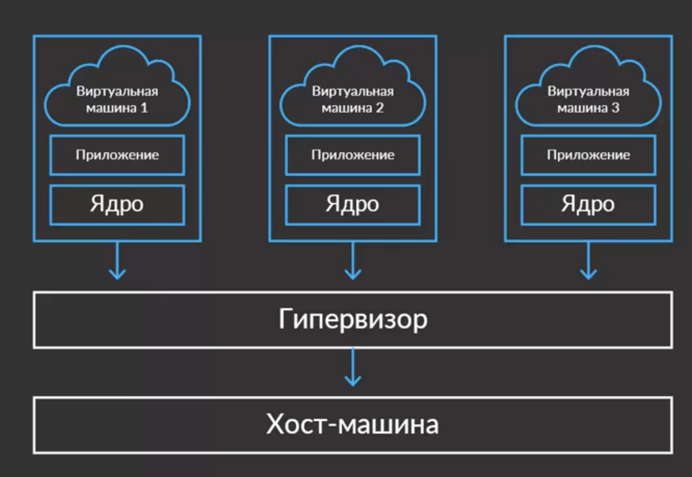
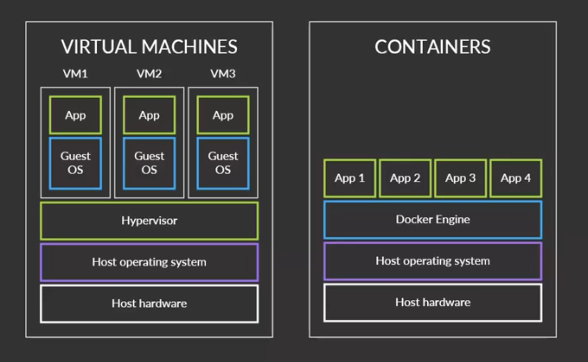
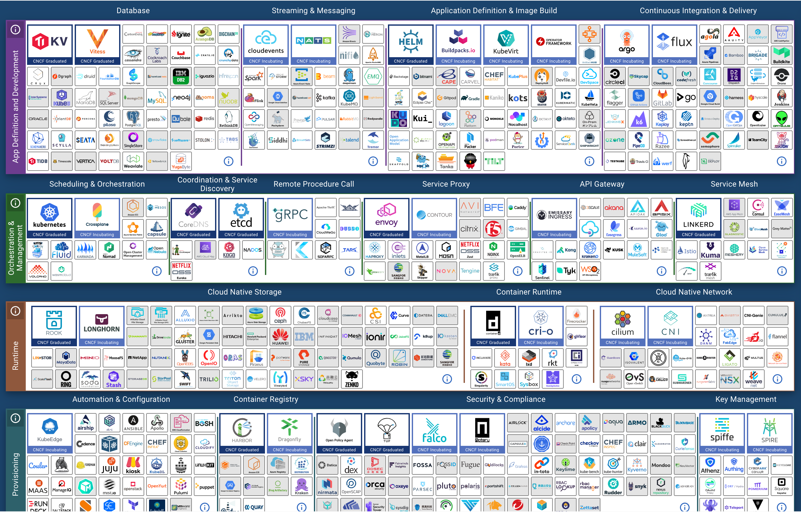
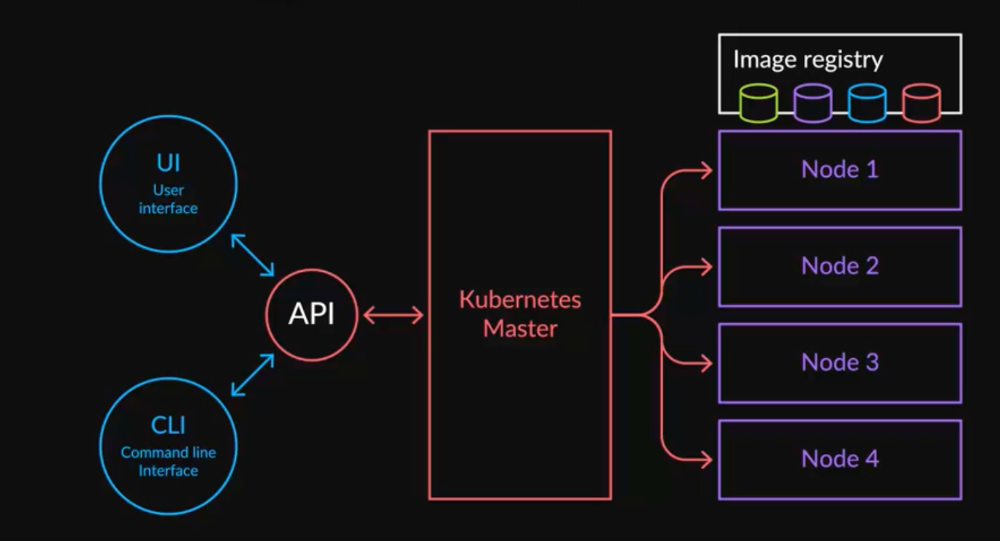

https://go.dev/blog/docker

https://golangdocs.com/golang-docker

https://habr.com/ru/post/460535/

https://docs.docker.com/get-started/overview/

https://habr.com/ru/post/310460/

https://en.wikipedia.org/wiki/Docker_(software)

# Docker

## Виртуальные машины и Docker

- Запуск на хостовой ОС. Теоретически можно запускать микросервисы прямо на хостовой ОС. Но мы не можем зарезервировать для приложения некоторое количество ресурсов (CPU, памяти). У нас будут всегда коммунальные ресурсы.

- Каждый инстанс микросервиса в виртуальной машине. 

  

  это изолированная программная среда, эмулирующая аппаратное обеспечение некоторой платформы. Они занимают много ресурсов и содержат не только ОС, но и необходимое для работы виртуальное оборудование (это отнимает memory и cpu). Для маленького Go приложения приходится подниматься ядро ОС. Получаем не просто изолированные программы, а изолированные ОС.

  Гипервизор – это процесс, который отделяет ОС и приложение от аппаратного оборудования. Т.е. позволяет физическому компьютеру (хосту) управлять множеством гостевых виртуальных машин.

- контейнеризация

  

  контейнеризация – метод виртуализации, при котором ядро ОС поддерживает несколько изолированных экземпляров пространства пользователя (userspace) вместо одного. Эти экземпляры, называемые контейнерами, с точки зрения пользователя полностью идентичны отдельному экземпляру ОС. Программы из разных контейнеров не могут взаимодействовать друг с другом. Контейнер - запущенное приложение на базе image (образа), совокупность процесса и образа. Образ – immutable шаблон, который используется для создания контейнеров, он представляет собой слепок файловой системы.

## Инструменты

Фонд Cloud native computer foundation – фонд, который занимается стандартизацией компонентнов облачных вычислений. Фонд спонсируют google, rad hat, twitter,... Фонд выделяет группы инструментов и интерфейсы к ним. Выделяют модули в облачной инфраструктуре. 

На сайте фонда есть карта иструментов для построения контейнеризированных приложений https://landscape.cncf.io/?category=container-runtime&grouping=category



 Отдельные компоненты должны стремиться к тому, чтобы нативно встраиваться и быть взаимозаменяемыми.

## Kubernetes

Существует ряд инструментов оркестрации


Самый популярный из них Kubernetes.

Kubernetes – проект с открытым исходным кодом на GoLang. Он предназначен для управления кластером контейнеров Linux, как единой системой. Он запускает и управляет множеством контейнеров docker на множестве host'ов.



Kubernetes master – машина, которая занимается управлением кластера и предоставляет API. УТилита kubectl позволяет работать с кластером, отправляя gRPC вызовы на master-ноды. NodeN – это сервера, на которых работают микросервисы. Kubernetes сам распределяет сервисы по node's. 

Kubernetes оркестрирует pod'ами. Pod – это группа контейнеров с общими разделами, запускаемая как единое целое. Pod - одна реплика сервиса.

Управляя количеством реплик, мы горизонтально масштабируем сервис. 

Структура kubernetes:


- etcd – distributed key-value storage. Хранит данные о состоянии кластера kubernetes. 

- controller manager – служба, которая отслеживает состояние кластера через api серверов и изменяет его, чтобы перейти к нужному состоянию

- scheduler – решает задачу наполнения рюкзака (NP-полная задача с полным перебором). Сервисы – имеют разные требования по потреблению ресурсов (сеть, память, CPU).  Нужно максимально эффективно разложить сервисы по нодам кластера. Также возможен ряд ограничений:

  - один сервис должен лежать вместе с другими (политика афинити)
  - одни сервисы нельзя класть вместе с другими (политика антиафинити)
  - нельзя на одну ноду класть два одинаковых элемента
  - 

  В любой момент ноды могут выйти из строя и scheduler все перераспределяет.

- worker node – node, где запускаются сервисы. Включает:
  
  - kubelet (кюплет) – агенты, которые на входе принимает манифест, по нему запускает реплику и следит за тем, чтобы она работала, рестартит в случае необходимости
  
  - kubernetes поддерживает несколько *container runtime* – containerd, crio, rocket. 
  
    [containerd](https://containerd.io/) — это бывшая часть Docker, а ныне самостоятельное решение, реализующее **исполняемую среду для запуска контейнеров**. «Физически» это демон на хост-системе, который управляет всем жизненным циклом контейнера: от получения и хранения образа до запуска контейнера и контролирования его работы. С демоном containerd можно взаимодействовать по низкоуровневому **gRPC API** через локальный UNIX-сокет, а для экспериментов и отладки также доступна консольная утилита **ctr**.


- ingress - ?????


## Docker

Docker предоставляет возможность упаковывать и запускать приложение в слабо изолированной среде, называемой *container*. 

Аналог Docker — контейнер для транспортировки на корабле. 

**Преимущества:**

- позволяет отделить приложения от инфраструктуры
- изоляция приложений
- Быстрый процесс разработки. Нет нужды в установке сторонних программ вроде PostgreSQL, Redis, Elasticsearch. Они могут быть запущены в контейнерах.
- Удобная инкапсуляция приложений. Вы можете предоставить свое приложение как единое целое.
- Одинаковое поведение на локальном компьютере и тестовом/производственном сервере, т.к. это везде один образ. Этот образ может быть положен в архив.
- Легко масштабируется. Если вы сделали свое приложение правильно, то оно будет готово к масштабированию не только в Docker.
- Позволяет производить атомарно операцию деплоя, избежать смены пакетов во время выкладки.

Предоставлянт схожий с виртуальными машинами уровень изоляции, но благодаря правильному задействованию низкоуровневых механизмов основной операционной системы делают это с в разы меньшей нагрузкой. Разделяет ядро между всеми контейнерами, которые работают как отдельные процессы основной ОС.

## Архитектура Docker

Docker использует архитектуру клиент-сервер. *Docker client* общается с *Docker daemon* , который выполняет работу по созданию, запуску и распространению *Docker container*'ов. *Docker client* и *Docker daemon* могут работать в одной системе, или вы можете подключить *Docker client* к удаленному *Docker daemon*'у. *Docker client* и *Docker daemon* взаимодействуют с помощью REST API, через *UNIX socket*'s или *network interface*. 

В качестве *Docker client* может выступать *Docker Compose*, который позволяет работать с приложениями, состоящими из набора контейнеров.


- *Docker daemon* (`dockerd`) прослушивает *Docker API request*'ы и управляет *Docker object*'ами, такими как *images, containers, networks и volumes*.

- *Docker client* ( `docker`) – это основной способ взаимодействия пользователей *Docker* с самим *Docker*. Когда вы используете такие команды, как `docker run`, *client* отправляет эти команды в `dockerd`, который выполняет их. Команда `docker` использует *Docker API*. 

- *Docker Desktop* – это простое в установке приложение для среды Mac или Windows, которое позволяет *build* и *share* контейнеризованные приложения и *microservice*'s. *Docker Desktop* включает в себя *Docker daemon* ( `dockerd`), *Docker client* ( `docker`), *Docker Compose*, *Docker Content Trust*, *Kubernetes* и *Credential Helper*. 

  

 

 Терминология

Docker-образ — это read-only шаблон. Например, образ может содержать операционку Ubuntu c Apache и приложением на ней. Образы используются для создания контейнеров. 

Контейнер — создаются из образов, являются надстройкой над образами, позволяют изменять образы. 

Сервис – часть распределенного приложения, контейнер в продакшене. Сервис использует только один образ. Можно указать используемые порты, количество реплик

Приложение -  состоит из сервисов, каждый сервис описывает количеством реплик, используемым ЦП, памятью

Порт — TCP/UDP-порт в своем обычном представлении. 

Том — может быть описан как общая папка.

Реестр — сервер, который хранит образы Docker.

Docker Hub — реестр с веб-интерфейсом, созданный Docker Inc.

Настройки контейнера в файле Dockerfile

Сборка контейнера. 

docker build -t friendlyhello .

Реестр образов

docker images

REPOSITORY      TAG         IMAGE ID

friendlyhello     latest       326387cea398

или

docker image ls

Запуск образа с пробросом внешнего порта 4000 на внутренний порт 80

docker run -p 4000:80 friendlyhello

Подключение к серверу из командной строки

curl http://localhost:4000

Запуск контейнера в фоновом detached режиме. Возвращает ID контейнера

docker run -d -p 4000:80 friendlyhello

Список запущенных контейнеров:

$ docker container ls

CONTAINER ID    IMAGE        COMMAND       CREATED

1fa4ab2cf395    friendlyhello    "python app.py"   28 seconds ago

Список всех контейнеров, вклюая те, которые не работают:

$ docker container ls -a

CONTAINER ID    IMAGE          COMMAND       CREATED       STATUS           PORTS         NAMES

57794a762683    parshikovpavel/begin:2  "python app.py"   9 days ago     Exited (255) 8 days ago  0.0.0.0:4000->80/tcp  boring_williams

Остановка контейнера

docker container stop 1fa4ab2cf395

Удалить контейнер

$ docker container rm 3780dfe312a4

Авторизация в docker

docker login

Подготовка образа к отправке в облако:

docker tag image username/repository:tag

Пуш образа в облако:

docker push username/repository:tag

Запуск образа из dockerhub

$ docker run -p 4000:80 parshikovpavel/begin:2

 

### Сервис

Создание сервиса (service):

```
docker stack deploy -c docker-compose.yml getstartedlab
```

docker-compose.yml – описание структуры сервиса, getstartedlab – название сервиса. Формат docker-compose.yml:

version: "3"

services:

 web:

  \# replace username/repo:tag with your name and image details

  image: parshikovpavel/begin:2

  deploy:

   replicas: 5

   resources:

​    limits:

​     cpus: "0.1"

​     memory: 50M

   restart_policy:

​    condition: on-failure

  ports:

   \- "80:80"

  networks:

   \- webnet

networks:

 webnet:

Список сервисов

docker service ls

ID         NAME        MODE        REPLICAS      IMAGE          PORTS

689yx2w6cl8s    getstartedlab_web  replicated     5/5         parshikovpavel/begin:2  *:80->80/tcp

Каждый контейнер внутри сервиса называет задачей (task), количество задач в сервисе определяется значением *replicas*.

Получить список задач для сервиса:

docker service ps getstartedlab_web

ID         NAME           IMAGE          NODE        DESIRED STATE    CURRENT STATE        ERROR               PORTS

88tmzhyzspd8    getstartedlab_web.1    parshikovpavel/begin:2  pavel-Virtualbox  Running       Running about an hour ago   

Также задачи отображаются в списке контейнеров (container ls).


## LXC-контейнер

LXC (Linux container) – способ виртуализации на системном уровне для запуска нескольких изолированных Linux-систем (контейнеров) на одном физическом сервере с использованием одного ядра Linux

