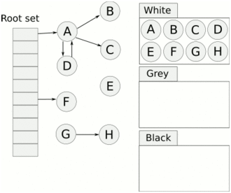

https://go.dev/blog/go15gc

https://www.ardanlabs.com/blog/2018/12/garbage-collection-in-go-part1-semantics.html

https://www.geeksforgeeks.org/mark-and-sweep-garbage-collection-algorithm/

https://codengineering.ru/q/what-kind-of-garbage-collection-does-go-use-14388

http://espressocode.top/mark-and-sweep-garbage-collection-algorithm/

https://qastack.ru/programming/7823725/what-kind-of-garbage-collection-does-go-use

https://go.dev/blog/ismmkeynote

https://habr.com/ru/post/262335/

https://habr.com/ru/company/otus/blog/487934/?mobile=no


https://dev.to/deepu105/visualizing-memory-management-in-golang-1apa

https://golang-blog.blogspot.com/2019/02/go-faq-garbage-collection.html

https://russianblogs.com/article/3396205378/

https://medium.com/a-journey-with-go/go-how-does-the-garbage-collector-mark-the-memory-72cfc12c6976

https://medium.com/invalid-memory/golang-cost-of-using-the-heap-e70363469754

https://hub.packtpub.com/implementing-memory-management-with-golang-garbage-collector/


https://agrim123.github.io/posts/go-garbage-collector.html

https://www.codetd.com/en/article/12325399

https://stackoverflow.com/questions/1318631/learning-garbage-collection-theory

https://www.educative.io/courses/a-quick-primer-on-garbage-collection-algorithms/jy6v

https://www.mo4tech.com/go-garbage-collection-three-color-algorithm.html


# Основные термины GC

**Object** – некоторый *block* в *memory*, образующий единую логическую структуру. Такими *block*'ами выполняется *allocation* и *deallocation*.

**Live object** – это *object*, который программа все еще использует.

# Принципы GC

## Ручное *memory management*

В таком языке, как C, программист вызывает функции, вроде, `malloc()` или `calloc()`, для записи объекта в *memory*. Эти функции возвращают *pointer* на расположение этого объекта в *heap*.  Когда этот объект больше не нужен, программист вызывает функцию `free()` для очистки блока *memory*. Этот метод *memory management* называется **явным *deallocation***. Он дает программисту больший контроль над используемой *memory*. Однако это приводит к двум типам ошибок программирования:

1. Преждевременный вызов `free()` который создает **висячий *pointer*** . Висячие *pointer*'ы — это *pointer*'ы, которые больше не указывают на допустимые объекты в *memory*. При этом программа ожидает, что некоторое значение будет находиться в памяти по этому *pointer*'у. Когда позже обращаются по этому *pointer*'у, нет никакой гарантии того, что какое-то значение все еще существует в этом месте в *memory*. Там может быть ничего или совсем другое значение. 
2. Нужно вообще не забыть вызвать `free()`. Если программист забудет освободить объект, он может столкнуться с *memory leak*. Так как память заполняется все большим количеством объектов, это может привести к замедлению работы программы или сбою, если произойдет *out of memory*. Когда используется ручное *memory management*, в программе часто появляются непредсказуемые баги.

## Автоматическое *memory management*

Многие языки (в том числе Go) предлагают **автоматическое динамическое *memory management*** или ***garbage collection***. 

*Garbage collection* приводит к *overhead*'у по *performanc*'у, но не так сильно, как часто предполагается. Зато программист может сосредоточиться на бизнес-логике своей программы, вместо забот о *memory management*.

Программа сохраняет объекты в двух местах в *memory*: в *heap* и в *stack*'е. *Garbage collection* работает с [*heap*](OS.md#) и не работает со [*stack*'ом](OS.md#stack) (детально про *heap* и *stack* по ссылкам)


# Типы GC

Выделяют следующие типы GC:

- очистка в конце *request*'а
- reference count GC
- tracing GC

## Очистка в конце *request*'а (без GC)

Самый простой способ GC — просто подождать, пока *task* (или *request*) не будет завершен, и освободить всю *memory* сразу. Это возможно, если есть ряд независимых *task* (*request*'ов). Например, веб-сервер Apache создает небольшой пул *memory* для каждого *request*'а и освобождает весь пул, когда *request* завершается.


Показана анимация запущенной программы:

- все изображение – это *memory* программы.

- цвета на картинке:
  - черный цвет – *memory* не используется
  - ярко-желтый цвет – область, над которой выполняется операция *write*
  - ярко-зеленый цвет – область, над которой выполняется операция *read*
  - бледно-желтый и бледно-зеленый цвет – область, над которыми давно выполнялись операции *read/write*. Т.е цвет со временем тускнеет и переходит от яркого к бледному, если *memory* не используется.
- *memory* изначально окрашена в черный цвет, т.е. она не используется.
- через некоторое время большая часть блоков становится бледного цвета – т.е. программа к ним не обращается, они скорее всего стали *garbage* – они не используются и стали *unreacheable* для программы. 
- все остальное, что не является *garbage*, называется "*live*" (живым).

## С выявлением *live object*'s

 Для выявления *live object*'s – GC как правило используют следующие алгоритмы:

- Для *tracing garbage collection* (*mark/sweep*) – *object* является *live*, если он *reachable*. 
- Для *reference count GC* – объект является *live*, если на него есть *reference*. 


### Reference Count GC (на основе счетчиков ссылок)

Еще одно простое решение — подсчитывать, сколько раз вы используете *object*, и когда `counter = 0` – удалять *object*. Это наиболее распространенный прием, который разработчики используют при добавлении *garbage collection* в существующую систему — это единственный *garbage collector*, который легко интегрируется с другими *resource manager*'ами (которые отвечают за работу с памятью) и существующими кодовыми базами. 


На анимации:

- черный, зеленый, желтый цвета – аналогично как и раньше
- красные вспышки – активность по *reference counting* (странно почему так мало вспышек???)

Преимущества:

- *garbage* обнаруживается сразу — иногда можно увидеть вспышку красного цвета, сразу за которой область становится черной.

Недостатки:

- самое плохое, что этот алгоритм не может обрабатывать циклические структуры. Все *struct*, которые хранят *reference* на *parent struct*, создают цикл, который приводит к *leak memory*.
- имеет очень большой *overhead* — по анимации видно, что красные вспышки происходят постоянно, даже когда использование *memory* не увеличивается. *Memory* работает гораздо медленнее CPU, и для *counter*'ов часто происходится *read/write*. Обновление *counter*'ов создает проблемы при конкурентном доступе (*thread-safe* данные).

# Tracing GC

***Tracing GC*** – это GC, работа которого основана на выявлении ***reachable*** *object*'ов. 

*Tracing GC* опирается на то, что если *object* – не *reachable*, то *mutator* не сможет получить к нему доступ, и поэтому *object* не может быть *live* . В каждом *collection cycle*, некоторые или все *object*'ы включаются в *condemned set*, и *graph* обходится (*trace*) по цепочке *reference*'s начиная с *root set*, чтобы определить, какие из *condemned object*'ов являются *reachable*. Те, которые не были *reacheable*, считаются *garbage* и могут быть освобождены (*reclaim*).

Преимущества *tracing GC* над *reference count*:

- он может легко обрабатывать циклические структуры
- имеет меньший *overhead*, т.к. не нужно вести *counting*.


*Tracing GC* детектирует *garbage* не немедленно, а через какой-то период времени. На анимации видно, что есть периоды *read/write* без *garbage collection*.

*Unreachable object* скорее всего в конце концов будет *reclaim*, но нет никакой гарантии, когда (и что обязательно) это произойдет.

Недостатки *tracing GC*:

- В *mark phase* необходимо обойти все *reachable object*'ы данные. Т.е. сложные *object*'ы (*struct, interface*,...) должны реализовывать обход содержимого. 


## Trace

*Trace* – это процесс прохода по *graph*'у от всех *root*'s ко всем *reachable object*'s.

## Reachable

*Object* является *reachable* , если на него есть *reference* из *root* или из какого-то *reachable object*'а. Другими словами, *object* является *reachable* из *root*, если двигаться по *reference*'s.

## Reference

*Reference* — это некоторая ссылка из одного *object*'а на другой. В терминах теории GC, понятия *pointer* и *reference* являются взаимозаменяемыми. 

## Root

*Root* – *object*, которые *априори* считается *reachable*. 

*Root set* – коллекция *root*'s, которую *mutator* определяет для *collector*'а. *Root set* используется в качестве стартовой точки при определении *reachable object*'s.

В *root set* входят все *object*'ы, на которые есть *reference* в любом месте *call stack* (стека вызовов):

- любые *global variable*'s.

- *variable*'s в *stack*'е (*local variable*'s, *parameter*'ы в  *function*'s)

  


## Типы tracing GC

### Stop the world

Простые GC полностью останавливают выполнение программы для запуска *collection cycle*, тем самым гарантируя, что новые объекты не будут *allocate* или *mutate*, и *collector* не пропустит *reachable object*'ы (как это описано [здесь](#сильный-tri-color-invariant))

Недостатки:

- программа не может выполнять никакой полезной работы во время выполнения *collection cycle*. Поэтому *Stop-the-world GC* в основном подходит для неинтерактивных программ. Это неприемлемо, когда система должна гарантировать низкий *latency* (*response time*); например, в системах с *user interface*.

Преимущества:

- проще в реализации
- быстрее, чем *incremental GC*.

*Incremental* и *concurrent GC* предназначены для преодоления этих недостатков, чередуя свою работу с активностью *mutator*'а.

### Incremental GC

***Incremental GC*** может выполнять *collection cycle*'s в отдельных дискретных *incremental phase*'s, т.е. делать *pause* в середине *collection cycle*, в то время как *mutator* продолжает работу, не получая при этом *inconsistent data* (неконсистентных данных). *Collection cycle* может чередоваться или выполняться одновременно с активностью *mutator*'а. Т.к. *collector* работает инкрементально, он подходит для использования в интерактивной системе.

Недостатки:

- сумма *incremental phase*'s занимает больше времени, чем один пакетный *collection cycle*, поэтому *Incremental GC* дает меньшую *throughput* (пропускную способность).


#### Алгоритм *incremental update*

Алгоритм *incremental update* используется *tracing* и *incremental GC*. Этот алгоритм учитывает изменения, внесенные *mutator*'ом в *graph object*'ов , и изменяет *color* для *node*, чтобы *collector* правильно выполнял *trace* для *graph*'а (связано с [tri-color invariant](#tri-color-invariant))

Чтобы *collector* пропустил *reachable object* (и оставил его в *white color*) должны выполниться два условия:

- *Mutator* сохраняет *reference* на *white object* в *black object* (т.е. появляется *edge* от *black node* к *white node*.)

- Все *edge*'s от *gray object*'ов к этому *white object*'у удаляются


Алгоритм *incremental update* гарантирует невозможность выполнения первого условия, окрашивая *black* или *white object* в *gray color*.


### Parallel (concurrent) GC

*Parallel (concurrent) collector* –  вообще не останавливают выполнение программы, выполняется одновременно с *mutator*'ом, обычно на многопроцессорной машине.

*Parallel (concurrent) GC* должен справляться с изменением *object*'ов во время *collection cycle*. Это чем-то похоже на  *incremental GC* (т.к. для *incremental GC* также конкурентное выполнение), но сложнее (как?? что сложнее??). В алгоритме обычно используются [*barrier*'ы](#barrier) (НЕ механизм синхронизации).


## Barrier

*Barrier* — это *lock* на *read* или *write* в определенные области *memory*, поставленный некоторыми *thread*'ами или *process*'ами.

*Barrier*'ы могут быть реализованы как на уровне *software*, так и *hardware*. *Software barrier*'ы включают в себя дополнительные инструкции для `load` и `store` операций, которые добавляются компилятором. *Hardware barrier*'ы не требуют поддержки компилятора и реализованы в  операционных системах с помощью *memory protection*.

## Collection cycle

*Collection cycle* — это одно полное выполнение алгоритма *tracing GC*.

Каждый *collection cycle* включает в себя (не обязательно в указанном порядке):

- выбор *condemned set*;
- *scanning root*'s (сканирование) и *object*'ов, которые не были включены в *condemned set* (??? почему не были).
- *trace* для *object graph*, чтобы попытаться найти *condemned object*'ы, которые являются *reachable*
- *reclaim* те *object*'ы, которые не были *reachable*.

Для *non-incremental* GC, *mutator* делает *pause* в начале *collection cycle* и не может продолжать, до тех пор пока *collection cycle* не завершится. При использовании *incremental GC*, *collection cycle* может чередоваться или выполняться одновременно с активностью *mutator*'а.

Обычно *collection cycle* запускается, когда *memory manager*'у не хватает свободной *memory* для удовлетворения запроса на *allocation*.

## Condemned set

*Condemned object*'ы (`[kənˈdemd]`, осужденные, приговоренные) – это кандидаты на *reclaim* в рамках *collection cycle*.

В начале *collection cycle*, *collector* формирует *condemned set*. Остальные object'ы считают *non-condemned* (*immune set*, невосприимчивое множество). *Non-condemned* считаются *live* и ведут себя как *root*'s во время текущего *collection cycle*.

Простые *tracing GC*  алгоритмы включают в *condemned set* все *object*'ы. Но *generational GC* включают в *condemned set* только некоторые *generation*'s, часто *young generation*. Потому что у *young generation* гораздо больше шансов стать *unreachable*, чем у *older generation*.

*Tri-color GC* в начале *collection cycle*, включают в *condemned set* – те *object*'ы, который *collector* окрасил в *white color*.

## Graph

*Graph* используются для представления связей между *object*'ами и поиска *reachable object*'ов в *tracing GC*. Узлы *graph*'а – это *object*'ы, а ребра graph'а – это *reference*'s от одного *object*'а к другому. Обычно существует единственный выделенный *root*, к которому *mutator* имеет *прямой* доступ, а узлы, связанные с ним, являются *reachable*.

## Reclaim

*Reclaim* – освобождение *object*'а или освобождение *memory*, занимаемой им, чтобы сделать их доступными для повторного использования после того, как *object* больше не нужен.


## Части tracing GC

### Mutator

*Mutator* – выполняет код приложения и *allocate* новые *object*'ы в *heap*. Он также модифицирует (или *mutate*) существующие *object*'ы в *heap* по мере выполнения программы, в том числе делает некоторые *object*'ы *unreachable* (недостижимыми), когда они больше не нужны.

### Collector

*Collector* – выполняет логику *garbage collection*. Он находит неиспользуемые *object*'ы, и освобождает *memory* для них.


## Mark-sweep

*Mark-sweep* – это разновидность *tracing GC*

### Наивный mark-sweep

*Mark/sweep GC* реализует две основные *phase*:

- *mark* (отмечать, маркировать) *phase* — *collector* обходит *graph* (*object*'ов в *heap*) и *mark* (помечает, делает какую-то пометку) *reachable object*'ы (т.е. выполняет *trace*). Каждый *object*, *reachable* из *root set* будет *mark*. На анимации видно, что появляется множество красных вспышек на *reachable object*'ах.  

  Каждый *object* в *memory* имеет флаг, *mark bit* (обычно один бит), зарезервированный только для использования при *garbage collection*. Этот флаг всегда *сбрасывается*, за исключением *collection cycle*.

  *Marking* реализуется путем установки *mark bit* (бита метки) в *object*'е, хотя можно использовать любое представление на расположение *object*'а в *memory*. Однако хранение *mark bit* внутри *object*'а может привести к ухудшению *reference locality* (локальности ссылок, обращение происходит к удаленным местам в *memory*) и ухудшению *cache performance* (поскольку многие *page*'s становятся *dirty* (на эти *page* устанавливается *dirty bit*) и должны быть записаны в *memory*). 

  Лучший вариант – хранение *mark bit* отдельно. Для этого используется *bitmap marking* – сохранение *mark bit*'ов для *object*'ов в непрерывном диапазоне *memory* в отдельном *bitmap*.

- *sweep* (подметать) *phase* — после того как *mark phase* завершена, все *unreachable, non-marked object*'ы освобождаются. Для этого *collector* последовательно (в порядке адресов) проходит по *memory* . На анимации – большие области *memory* становятся черными одновременно. 

  Для *reachable object*'ов – *mark bit* сбрасывается для подготовки к следующему *collection cycle*.


Наивный *mark-sweep* имеет недостатки:

- во время *collection cycle* вся система должна быть остановлена (*stop the world*); никакая [mutation](#mutator) для *working set* не допускается. Это приводит к периодическому и непредсказуемому «зависанию» программ, что делает невозможным выполнение *real-time* и *time-critical* приложений
- Кроме того, вся *working memory* должна быть просмотрена, большая ее часть дважды, что может вызвать проблемы в системах со [страничной памятью](https://en.wikipedia.org/wiki/Paged_memory) (*paged memory*).

### Tri-color marking

*Tri-color marking* преодолевает эти недостатки наивного *mark-sweep*. 

*Tri-color marking* — это алгоритм для реализации *mark* (для *mark/sweep GC*, *tracing GC*, *incremental GC*). 

Алгоритм назначает следующие *color* каждой *node* в *graph*'е и создается три *set*'а – *white*, *gray* и *black set*.

1. изначально все *condemned node*'s окрашены в *white color*. *Black* и *gray set* – пустые. *Root set* окрашивается в *gray color*. 
2. *Collector* выполняет поиск *reachable node*'s, для этого он ищет *edge* от *gray node* к *white node* и окрашивает *white node* в *gray color*. Т.е. на каждом шаге [trace](#trace), выбирается *gray node* и все ее *white child*'s окрашиваются в *gray color*. *Gray node* – это *reachable node*, но *collector* должен ее еще посетить, чтобы обработать *child node*'s. Поскольку известно, что они *reachable* из *root set*, они не должны быть *reclaim* и после *trace* окажутся в *black set*.
3. После того как выполнен предыдущий шаг для *gray node*, т.е. все *edge*'s из *gray node* ведут только к другим *gray* или *black node*'s, эта *node* окрашивается в *black color*. После этого *collector* больше не выбирает эту *black node* во время *tracing*. Они *reachable* из *root set* и не должны быть *reclaim* 

Шаги 2 и 3 повторяются до тех пор, пока *gray set* не станет пустым. Значит все *reachable node*'s в *graph*'е были найдены и они имеют *black color*. *Node*'s, которые все еще остались *white*, являются *unreachable* и могут быть *reclaim*.

На этой анимации:

- *white node* – светло-серый цвет
- *gray node* – желтый цвет
- *black node* – синий цвет



#### Tri-color invariant

*Tri-color invariant* означает поддержание каких-то свойств *reference graph*'а, которые сохраняются на протяжении всего выполнения алгоритма *tri-color marking*, чтобы гарантировать его корректность.

Сильный *tri-color invariant*  — это свойство *reference graph*'а, заключающееся в том, что нет *edge* от *black node* к *white node*.

Выполняя алгоритм *tri-color marking* без конкурентного *mutator*'а этот *invariant* поддерживается автоматически. Т.к. *node* окрашивается в *black color* тогда, когда  все *edge*'s из нее ведут только к *gray* или *black node*'s.

Во время работы *mutator*'а может потребоваться изменить *color* затронутых *node*'s, чтобы поддержать *invariant*. Поддерживая этот *invariant* во время *tri-color marking*, алгоритм *tracing* может гарантировать:

- что *collector* не пропустит *reachable object*'ы, даже если *mutator* манипулирует *graph*'ом во время *collection cycle*
- что *white object*'ы могут быть *reclaim*, когда *gray set* станет пустым.

Если не поддерживать *tri-color invariant*, то *collector* может пропустить *reachable object*, если во время *tracing* – *mutator* выполнит следующие действия:

1. *Mutator* создаст *reference* из *black object* на *white object*.
2. При этом не будет *edge* из *gray object*'ов в этот *white object*, либо они будут удалены.

Этот *invariant* используется алгоритмами *incremental GC*.

#### Преимущества *tri-color marking*

Алгоритм можно выполнять «на лету», не останавливая систему на значительные промежутки времени. *Mutator* может получить доступ к любой части *graph*'а и *allocate* новые *node*'s в то время как *collector* выполняет *mark phase* (т.е. определяет *reachable node*'s). Чтобы это было возможно, *mutator* должен поддерживать [tri-color invariant](#tri-color-invariant), изменяя *color* затрагиваемых *node*'s, если это необходимо.


# Generational GC

## Generation

***Generation*** – это множество *object*'ов одного *возраста* .


## Generational hypothesis

*Generational hypothesis* (гипотеза поколений) – это эмпирическое наблюдение, в том что в большинстве случаев у *young*, недавно *allocated* *object*'ов (они формируют *young generation*) гораздо выше вероятность быстрее стать *unreachable*, чем у *older* (старых). Т.е. короткоживущие *object*'ы, такие как временные *variable*, чаще всего умирают (становятся *garbarge*).


## Generational GC

***Generational GC*** – это *tracing GC*, который использует *generational hypothesis*. *Generational GC* делит *object*'ы на *generation*'s и добавляет в *condemned set* – *object*'ы из одного *generation*. Новые *object*'ы он *allocate* в *young generation* (молодом поколении). *Collector* перемещает *object*'ы из его текущего *generation* в более *старое* (*older*, в котором предполагается, что они проживут дольше) по мере того, как они выживают в последовательных *collection cycle*'s. 

*Generational GC* в большинстве *collection cycle* помещает только *object*'ы из *young generation* в начальный *white, condemned set*. *Object*'ы из *old generation* используются реже качестве *condemned set*, что экономит *CPU time*, но при этом GC все еще *reclaim* большинство *unreachable object*'ов.


TODO!!!

https://en.wikipedia.org/wiki/Tracing_garbage_collection#Tri-color_marking


- тратят основное время на просмотр *young generation*
- сокращают продолжительность *pause* на *garbage collection* (но не всех), т.к. просматривается только *young generation*. 

Но у таких сборщиков есть и недостатки:

- *Heap overhead* – необходимо хранить служебные данные
- хотя многие *GC paus*'ы очень коротки, иногда всё же требуются *Stop-the-world* c *mark/sweep* в рамках всей *heap*.
- Производительность сильно зависит от размера *young generation*

Однако, Go использует NON-generational (!!!) GC. Как упоминалось ранее,  многие *object*'ы (особенно временные) размещаются в *stack*'е программы. А значит большая часть *young generation*, будет размещена в *stack*, а не в *heap*, а значит не требует сбора GC. Поэтому *generational GC* не даст существенных преимуществ, и на данный момент, в Go не используется *generational GC*. 

Также в Go используется *concurrent GC*, и поэтому время *pause* в Go не так сильно зависит от размера *youngest generation* или любого другого *generation*. Go предпочитает потратить немного больше общего *CPU time* на GC, запустив GC параллельно на другом ядре, чем минимизировать *GC time*, но сделав *Stop The World* на более длительный срок.

Программы на Go обычно реализуют обработку обработку *request/response* на HTTP-сервере. Т.е. они часто *allocate memory* на каждый *request*. В качестве идеи предложено создание [request oriented GC](https://docs.google.com/document/d/1gCsFxXamW8RRvOe5hECz98Ftk-tcRRJcDFANj2VwCB0/edit) (сборщик, ориентирующийся на запросы). В целом, это – [просто переименованный generational GC](https://news.ycombinator.com/item?id=11969740), с настроенными политиками формирования *generation* на основе *request*'а. 


# Настройка GC

Первые алгоритмы сборки мусора разработали для однопроцессорных компьютеров и программ с маленькими *heap*. К *paus*'ам в работе программ относились лояльно. Чтобы минимизировать потребление ресурсов, сборщик ничего не делал до тех пор, пока программа могла размещать в памяти данные. Затем она вставала на *pause* полной остановки (Stop-the-world, STW) до полного выполнения пометки (*mark*) и очистки (*sweep*) для *heap*.

В различных системах – различные требования к GC. Например, на серверах, обслуживающих биржевые транзакции или поисковые запросы, важно нужно сделать *pause* как можно короче. И тогда предпочтительнее алгоритмы, в целом замедляющие работу программ за счёт фонового *garbage collection*, но зато с очень короткими по времени *paus*'ами.

На системах, которые выполняют пакетные задания (*batch job*'s), важны не *paus*'ы, а только общее время выполнения. В таких случаях лучше использовать алгоритм, который максимизирует **пропускную способность** (*throughput*), то есть отношение выполненной полезной работы ко времени, потраченному на *garbage collection*.

*Runtime* ни одного языка не может определить, является ли ваша программа *batch job* или интерактивной программой, чувствительной к *latency*. Поэтому существуют *GC tuning* (настройки сборщика мусора). 


# Размещение объектов в *stack* и *heap* в Go

Go (в отличии от многих языков c GC) предпочитает *allocate* объекты в *stack*'е, поэтому большая часть объектов оказывается там. В Go у каждой *goroutine* есть *stack*, и, когда это возможно, Go будет *allocate* объекты в этом *stack*'е. 

Компилятор Go пытается доказать, что *variable* не используется вне *function* и не "убегает" (*escape*) за ее пределы, используя *escape analysis*. Если компилятор может определить время жизни *variable*, то он размещает ее в *stack*'е, а не в *heap*. Однако, если время жизни *variable* неизвестно, она будет размещена в *heap*. Обычно, если программа использует *pointer* на *object*, этот *object* хранится в *heap*. Взгляните на этот пример кода:

```go
type myStruct struct {
  value int
}

var testStruct = myStruct{value: 0}

func addTwoNumbers(a int, b int) int {
  return a + b
}
func myFunction() {
  testVar1 := 123
  testVar2 := 456
  testStruct.value = addTwoNumbers(testVar1, testVar2)
}
func someOtherFunction() {
  // some other code
  myFunction()
  // some more code
}
```

Будем считать, что это часть работающей программы (??? библиотека). Потому что если бы этот код – был целой программой, то компилятор Go оптимизировал бы ее и разместил *variable*'s в *stack*'е. 

Итак:

1. Переменной `testStruct` присваивается значение и она помещается в *heap*.

2. При вызове `myFunction()` выполняется *push* в *stack* нового *stack frame*. Переменные `testVar1` и `testVar2` сохраняются в этом *stack frame*.

3. При вызове `addTwoNumbers()` выполняется *push* в *stack* нового *stack frame* с двумя аргументами `a` и `b`.

4. Когда завершается выполнение функции `addTwoNumbers()`, результат возвращается в функцию `myFunction()`, для *stack frame* функции `addTwoNumbers` выполняется *pop* из *stack*'а, соответствующий блок *memory* освобождается.

5. Обращаемся по адресу переменной `testStruct` в *heap*, и изменяем значение поля `value`

6. Когда завершается выполнение функции `myFunction()`, аналогично, для *stack frame* выполняется *pop* и *memory* освобождается. 
7. Переменная `testStruct` остается в *heap* до тех пор, пока не произойдет *garbage collection*.

Переменная `testStruct` осталась лежать в *heap*, и без специального анализа *Go runtime* не знает, нужна ли она еще. Чтобы понять это Go использует *garbarge collector*.

# Реализация GC в Go

GC состоит из:

- [mutator](#mutator)
- [collector](#collector)

*Mutator* и *collector* – это отдельные *thread*'ы.


*Garbage collector* в Go имеет следующие характеристики:

- *non-generational*
- *tracing*
- *incremental*
- *concurrent*
- *mark* и *sweep*
- [*tri-color*](#tri-color-marking)


## Mark/sweep в Go

[Подробно про mark/sweep](#mark-sweep)

https://medium.com/safetycultureengineering/an-overview-of-memory-management-in-go-9a72ec7c76a8

Go реализует *mark/sweep* в несколько шагов:

- Все *goroutine*'s достигают *garbage collection safe point* с помощью *process*'а, который называется ***Stop the world***. Это временно останавливает выполнение программы и включает [***write barrier***](#barrier) для поддержания данных в *heap* в целостном согласованном состоянии. Это обеспечивает *concurrency*, позволяя исполнять *goroutine*'s (*mutator*???) и *collector* одновременно.

- Как только все *goroutine*'s включили *write barrier*, *Go runtime* делает ***Start the world*** и запускает *worker*'ы *collector*'а. Т.е. *concurrent mark phase* выполняет поиск используемой *memory*, одновременно с выполнением приложения.

- выполняет *tri-color marking*
- как только все *gray node*'s станут *black*, *collector* снова делает *Stop the world* и *reclaim* все *white node*'s (*sweep phase*). 
- выполняется *Start the world* и программа продолжает работу


## Параметр `GOGC`

Существует много параметров, которые можно настраивать у алгоритма GC:

- насколько большой должна быть *heap*?
- ... (их много)

Они влияют на производительность алгоритма в конкретном случае. 

В Go для настройки алгоритма используется только одна ручка – параметр `GOGC`. Ее значение определяет общий размер *heap* относительно размера *reachable object*'ов. Значение по умолчанию, `GOGC = 100`, означает, что общий размер *heap* больше на 100% (т.е. в два раза) размера *reachable object*'ов после последнего *collection cycle*. `GOGC = 200` означает, что общий размер *heap* больше на 200% (т.е. в три раза) размера *reachable object*. Если вы хотите уменьшить общее время, проведенное в GC, увеличьте `GOGC` (тем самым будет больше сводной памяти в *heap*).

 Если `GOGC=100` и мы используем 4MB, мы снова проведем GC, когда доберемся до 8MB. Как часто мы запускаем GC линейно зависит от количества *allocated memory* в *heap*. Настройка `GOGC` изменяет линейную константу. Процесс GC запускается снова, как только программа заполнит *heap*, который пропорционален уже используемой памяти c *reachable object*'ами. Например, удвоение `GOGC` в два раза сократит количество циклов GC. 


- *sweep*:
  - приложение делает *pause*, ожидая завершения предыдущей *mark phase*;
  - затем *concurrent sweep phase* (точно concurrent???) постепенно подготавливает все неиспользуемые *memory allocation* к повторному использованию, одновременно с выполнением приложения.


# Улучшение производительности по версиям

При использовании Go 1.1 в Twitch и 1.5 млн *goroutine*, они столкнулись с большой продолжительность *GC pause*. Приложение останавливалось на десятки секунд при каждом запуске GC, а это было недопустимо для интерактивного приложения. При этом GC запускался по несколько раз в минуту. 

При переходе на Go 1.2 паузы сократились «всего» до нескольких секунд.

Начиная с Go 1.5 в августе 2015-го Go garbage collector стал работать по большей части concurrent (конкурентно) и incremental (инкрементально). Это означает, что почти вся работа выполняется без полной остановки приложения. Кроме того что *setup phase* (фазы подготовки) и termination phase (фаза прерывания) короткие, программа продолжает работать в то время, как процесс *garbage collection* уже идёт. Переход на Go 1.5 моментально привёл к 10-кратному уменьшению *GC pause*: при большой нагрузке в тестовом окружении с двух секунд до приблизительно 200 мс.


# Это посмотреть в конце материал из go101

https://go101.org/article/memory-block.html

Текущий стандартный компилятор Go (версия 1.18) использует параллельный трехцветный сборщик мусора с очисткой по меткам. Здесь в этой статье будет сделано простое объяснение алгоритма.

Процесс сборки мусора (GC) делится на две фазы: фазу маркировки и фазу очистки. На этапе маркировки сборщик (фактически группа горутин) использует трехцветный алгоритм для анализа того, какие блоки памяти не используются.

Следующая цитата взята из [статьи блога Go](https://blog.golang.org/go15gc) , в которой ***объектами\*** являются либо части значений, либо блоки памяти.

>  В начале цикла GC все объекты белые. GC посещает все корни, которые являются объектами, непосредственно доступными для приложения, такими как глобальные переменные и вещи в стеке, и окрашивает их в серый цвет. Затем GC выбирает серый объект, затемняет его и сканирует в поисках указателей на другие объекты. Когда это сканирование находит указатель на белый объект, оно окрашивает этот объект в серый цвет. Этот процесс повторяется до тех пор, пока не останется серых объектов. На данный момент известно, что белые объекты недоступны и могут использоваться повторно.

*О том, почему алгоритм использует три цвета вместо двух, читайте в поиске «запись барьера на голанге». Здесь приведены только две ссылки: [устранение повторного сканирования стека STW](https://github.com/golang/proposal/blob/master/design/17503-eliminate-rescan.md) и [mbarrier.go](https://golang.org/src/runtime/mbarrier.go) .*

На этапе очистки будут собраны помеченные неиспользуемые блоки памяти.

Алгоритм GC не является сжимающим, поэтому он не будет перемещать блоки памяти для их перестановки.


### 

The current standard Go compiler (version 1.18) uses a concurrent, tri-color, mark-sweep garbage collector. Here this article will only make a simple explanation for the algorithm.

A garbage collection (GC) process is divided into two phases, the mark phase and the sweep phase. In the mark phase, the collector (a group of goroutines actually) uses the tri-color algorithm to analyze which memory blocks are unused.

The following quote is taken from [a Go blog article](https://blog.golang.org/go15gc), in which an ***objects\*** is either value parts or memory blocks.

>  At the start of a GC cycle all objects are white. The GC visits all roots, which are objects directly accessible by the application such as globals and things on the stack, and colors these grey. The GC then chooses a grey object, blackens it, and then scans it for pointers to other objects. When this scan finds a pointer to a white object, it turns that object grey. This process repeats until there are no more grey objects. At this point, white objects are known to be unreachable and can be reused.

*About why the algorithm uses three colors instead of two colors, please search "write barrier golang" for details. Here only provides two references: [eliminate STW stack re-scanning](https://github.com/golang/proposal/blob/master/design/17503-eliminate-rescan.md) and [mbarrier.go](https://golang.org/src/runtime/mbarrier.go).*

In the sweep phase, the marked unused memory blocks will be collected.

The GC algorithm is a non-compacting one, so it will not move memory blocks to rearrange them.