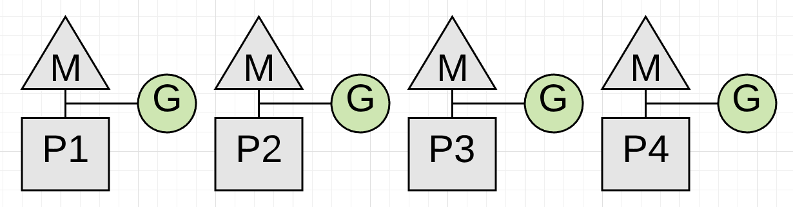
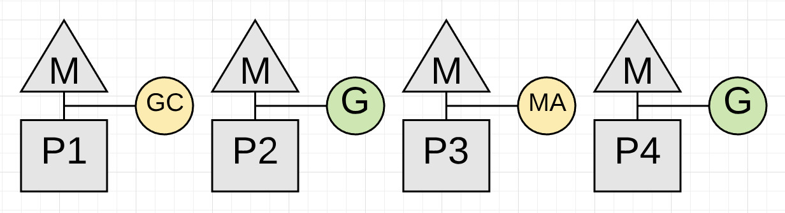
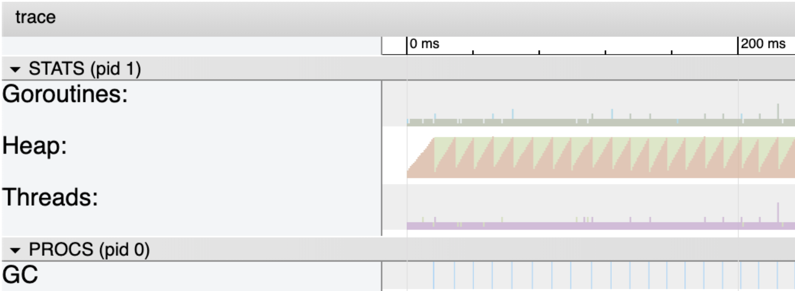

# Основные термины GC

**Object** – некоторый *block* в *memory*, образующий единую логическую структуру. Такими *block*'ами выполняется *allocation* и *deallocation*.

**Live object** – это *object*, который программа все еще использует.

# Принципы GC

## Принцип работы с heap

По мере *allocate memory* в *heap* в какой-то момент *heap memory* будет исчерпана и при *allocate* мы будем получать в ответ ошибку – *Out Of Memory*. В этом случае нужно очистить *heap memory*, удалив *unreachable object*'ы. Память можно освободить вручную или использовать автоматическое освобождение объектов, которые теперь *unreachable*, с помощью Garbage collector. 

Примерный алгоритм следующий:

```python
def memory_allocator(n):
    # Allocate и вернуть 'n' байт в heap.
    ref = allocate(n)
    if not ref:
        # heap memory исчерпана, вызываем GC
        gc()
        # повторная попытка allocation
        ref = allocate(n)
        if not ref:
            # Выбрасываем out of memory
            # Caller может самостоятельно что-то сделать
            # например почистить heap, cache
            raise OutOfMemory
    return ref
```


## Ручное *memory management*

В таком языке, как C, программист вызывает функции, вроде, `malloc()` или `calloc()`, для записи объекта в *memory*. Эти функции возвращают *pointer* на расположение этого объекта в *heap*.  Когда этот объект больше не нужен, программист вызывает функцию `free()` для очистки блока *memory*. Этот метод *memory management* называется **явным *deallocation***. Он дает программисту больший контроль над используемой *memory*. Однако это приводит к двум типам ошибок программирования:

1. Преждевременный вызов `free()` который создает **висячий *pointer*** . Висячие *pointer*'ы — это *pointer*'ы, которые больше не указывают на допустимые объекты в *memory*. При этом программа ожидает, что некоторое значение будет находиться в памяти по этому *pointer*'у. Когда позже обращаются по этому *pointer*'у, нет никакой гарантии того, что какое-то значение все еще существует в этом месте в *memory*. Там может быть ничего или совсем другое значение. 
2. Нужно вообще не забыть вызвать `free()`. Если программист забудет освободить объект, он может столкнуться с *memory leak*. Так как память заполняется все большим количеством объектов, это может привести к замедлению работы программы или сбою, если произойдет *out of memory*. Когда используется ручное *memory management*, в программе часто появляются непредсказуемые баги.

## Автоматическое *memory management*

Многие языки (в том числе Go) предлагают **автоматическое динамическое *memory management*** или ***garbage collection***. 

*Garbage collection* приводит к *overhead*'у по *performanc*'у, но не так сильно, как часто предполагается. Зато программист может сосредоточиться на бизнес-логике своей программы, вместо забот о *memory management*.

Программа сохраняет объекты в двух местах в *memory*: в *heap* и в *stack*'е. *Garbage collection* работает с [*heap*](OS.md#) и не работает со [*stack*'ом](OS.md#stack) (детально про *heap* и *stack* по ссылкам)


# Типы GC

Выделяют следующие типы GC:

- очистка в конце *request*'а
- reference count GC
- tracing GC

## Очистка в конце *request*'а (без GC)

Самый простой способ GC — просто подождать, пока *task* (или *request*) не будет завершен, и освободить всю *memory* сразу. Это возможно, если есть ряд независимых *task* (*request*'ов). Например, веб-сервер Apache создает небольшой пул *memory* для каждого *request*'а и освобождает весь пул, когда *request* завершается.


Показана анимация запущенной программы:

- все изображение – это *memory* программы.

- цвета на картинке:
  - черный цвет – *memory* не используется
  - ярко-желтый цвет – область, над которой выполняется операция *write*
  - ярко-зеленый цвет – область, над которой выполняется операция *read*
  - бледно-желтый и бледно-зеленый цвет – область, над которыми давно выполнялись операции *read/write*. Т.е цвет со временем тускнеет и переходит от яркого к бледному, если *memory* не используется.
- *memory* изначально окрашена в черный цвет, т.е. она не используется.
- через некоторое время большая часть блоков становится бледного цвета – т.е. программа к ним не обращается, они скорее всего стали *garbage* – они не используются и стали *unreacheable* для программы. 
- все остальное, что не является *garbage*, называется "*live*" (живым).

## С выявлением *live object*'s

 Для выявления *live object*'s – GC как правило используют следующие алгоритмы:

- Для *tracing garbage collection* (*mark/sweep*) – *object* является *live*, если он *reachable*. 
- Для *reference count GC* – объект является *live*, если на него есть *reference*. 


### Reference Count GC (на основе счетчиков ссылок)

Еще одно простое решение — подсчитывать, сколько раз вы используете *object*, и когда `counter = 0` – удалять *object*. Это наиболее распространенный прием, который разработчики используют при добавлении *garbage collection* в существующую систему — это единственный *garbage collector*, который легко интегрируется с другими *resource manager*'ами (которые отвечают за работу с памятью) и существующими кодовыми базами. 


На анимации:

- черный, зеленый, желтый цвета – аналогично как и раньше
- красные вспышки – активность по *reference counting* (странно почему так мало вспышек???)

Преимущества:

- *garbage* обнаруживается сразу — иногда можно увидеть вспышку красного цвета, сразу за которой область становится черной.

Недостатки:

- самое плохое, что этот алгоритм не может обрабатывать циклические структуры. Все *struct*, которые хранят *reference* на *parent struct*, создают цикл, который приводит к *leak memory*.
- имеет очень большой *overhead* — по анимации видно, что красные вспышки происходят постоянно, даже когда использование *memory* не увеличивается. *Memory* работает гораздо медленнее CPU, и для *counter*'ов часто происходится *read/write*. Обновление *counter*'ов создает проблемы при конкурентном доступе (*thread-safe* данные).

# Параметры GC

Алгоритм GC имеет три показателя производительности: 

- пропускная способность
- максимальное время паузы (максимальное время STW)
- использование памяти.

# Tracing GC

***Tracing GC*** – это GC, работа которого основана на выявлении ***reachable*** *object*'ов. 

Алгоритм *tracing GC* должен выполнять 2 основные операции:

- обнаружение *unreachable object*'ов
- *reclaim* для *object*'ов в *heap*

Эти шаги выполняет алгоритм mark-and-sweep. 

*Tracing GC* опирается на то, что если *object* – не *reachable*, то *mutator* не сможет получить к нему доступ, и поэтому *object* не может быть *live* . В каждом *collection cycle*, некоторые или все *object*'ы включаются в *condemned set*, и *graph* обходится (*trace*) по цепочке *reference*'s начиная с *root set*, чтобы определить, какие из *condemned object*'ов являются *reachable*. Те, которые не были *reacheable*, считаются *garbage* и могут быть освобождены (*reclaim*).

Преимущества *tracing GC* над *reference count*:

- он может легко обрабатывать циклические структуры
- имеет меньший *overhead*, т.к. не нужно вести *counting*.

Недостатки:

- выполнение программы должно приостанавливаться на время работы алгоритма *garbage collection*.

  


*Object*'ы не сразу *reclaim*, а остаются в памяти до тех пор, пока не будет достигнут определенный порог или пройдет некоторое время. На анимации видно, что есть периоды *read/write* без *garbage collection*.

*Unreachable object* скорее всего в конце концов будет *reclaim*, но нет никакой гарантии, когда (и что обязательно) это произойдет.

Недостатки *tracing GC*:

- В *mark phase* необходимо обойти все *reachable object*'ы данные. Т.е. сложные *object*'ы (*struct, interface*,...) должны реализовывать обход содержимого. 


## Trace

*Trace* – это процесс прохода по *graph*'у от всех *root*'s ко всем *reachable object*'s.

## Reachable

*Object* является *reachable* , если на него есть *reference* из *root* или из какого-то *reachable object*'а. Другими словами, *object* является *reachable* из *root*, если двигаться по *reference*'s.

## Reference

*Reference* — это некоторая ссылка из одного *object*'а на другой. В терминах теории GC, понятия *pointer* и *reference* являются взаимозаменяемыми. 

## Root

*Root* – *object*, которые *априори* считается *reachable*. 

*Root set* – коллекция *root*'s, которую *mutator* определяет для *collector*'а. *Root set* используется в качестве стартовой точки при определении *reachable object*'s.

В *root set* входят все *object*'ы, на которые есть *reference* в любом месте *call stack* (стека вызовов):

- любые *global variable*'s.
- *variable*'s в *stack*'е (*local variable*'s, *parameter*'ы в  *function*'s)


## Типы tracing GC

### Stop the world

Первые алгоритмы сборки мусора разработали для однопроцессорных компьютеров и программ с маленькими *heap*. Большие *paus*'ы в работе программ не были проблемой. 

*Collector* ничего не делал до тех пор, пока программа могла размещать в памяти данные. *Collector* не замедлял работу программы, если они не выполняла *garbage collection*, и не приводил к *memory overhead* (например, на хранение *counter*'ов).

Затем программа вставала на *pause* полной остановки (*Stop-the-world, STW*) до полного выполнения пометки (*mark*) и очистки (*sweep*) для *heap*. Тем самым гарантируя, что новые объекты не будут *allocate* или *mutate*, и *collector* не пропустит *reachable object*'ы (как это описано [здесь](#сильный-tri-color-invariant))

Этот вариант реализовать проще всего, т.к. *pointer*'ы не изменяются во время *collection*.

Недостатки:

- программа не может выполнять никакой полезной работы во время выполнения *collection cycle*. Поэтому *Stop-the-world GC* в основном подходит для неинтерактивных программ. Это неприемлемо, когда система должна гарантировать низкий *latency* (*response time*); например, в системах с *user interface*. Например, на серверах, обслуживающих биржевые транзакции или поисковые запросы, важно нужно сделать *pause* как можно короче. И тогда предпочтительнее алгоритмы, в целом замедляющие работу программ за счёт фонового *garbage collection*, но зато с очень короткими по времени *paus*'ами.
- *Stop-the-world GC* очень плохо масштабируются, когда вы добавляете ядра и увеличиваете размер *heap*.

Преимущества:

- проще в реализации
- быстрее, чем *incremental GC*. На системах, которые выполняют пакетные задания (*batch job*'s), важны не *paus*'ы, а только общее время выполнения. В таких случаях лучше использовать алгоритм, который максимизирует **пропускную способность** (*throughput*), то есть отношение выполненной полезной работы ко времени, потраченному на *garbage collection*.

*Incremental* и *concurrent GC* предназначены для преодоления этих недостатков, чередуя свою работу с активностью *mutator*'а.


### Incremental GC

***Incremental GC*** может выполнять *collection cycle*'s в отдельных дискретных *incremental phase*'s, т.е. делать *pause* в середине *collection cycle*, в то время как *mutator* продолжает работу, не получая при этом *inconsistent data* (неконсистентных данных). *Collection cycle* может чередоваться или выполняться одновременно с активностью *mutator*'а. Т.к. *collector* работает инкрементально, он подходит для использования в интерактивной системе.

Недостатки:

- сумма *incremental phase*'s занимает больше времени, чем один пакетный *collection cycle*, поэтому *Incremental GC* дает меньшую *throughput* (пропускную способность).


#### Алгоритм *incremental update*

Алгоритм *incremental update* используется *tracing* и *incremental GC*. Этот алгоритм учитывает изменения, внесенные *mutator*'ом в *graph object*'ов , и изменяет *color* для *node*, чтобы *collector* правильно выполнял *trace* для *graph*'а (связано с [tri-color invariant](#tri-color-invariant))

Чтобы *collector* пропустил *reachable object* (и оставил его в *white color*) должны выполниться два условия:

- *Mutator* сохраняет *reference* на *white object* в *black object* (т.е. появляется *edge* от *black node* к *white node*.)

- Все *edge*'s от *gray object*'ов к этому *white object*'у удаляются


Алгоритм *incremental update* гарантирует невозможность выполнения первого условия, окрашивая *black* или *white object* в *gray color*.


### Parallel (concurrent) GC

*Parallel (concurrent) collector* –  вообще не останавливают выполнение программы, выполняется одновременно с *mutator*'ом, обычно на многопроцессорной машине.

*Parallel (concurrent) GC* должен справляться с изменением *object*'ов во время *collection cycle*. Это чем-то похоже на  *incremental GC* (т.к. для *incremental GC* также конкурентное выполнение), но сложнее (как?? что сложнее??). В алгоритме обычно используются [*barrier*'ы](#barrier) (НЕ механизм синхронизации).


## Barrier

*Barrier* — это *lock* на *read* или *write* в определенные области *memory*, поставленный некоторыми *thread*'ами или *process*'ами.

*Barrier*'ы могут быть реализованы как на уровне *software*, так и *hardware*. *Software barrier*'ы включают в себя дополнительные инструкции для `load` и `store` операций, которые добавляются компилятором. *Hardware barrier*'ы не требуют поддержки компилятора и реализованы в  операционных системах с помощью *memory protection*.

### Write barrier

Для того чтобы решить проблему с постоянно изменяющимися *pointer*'ами, Go использует *write barrier*. *Write barrier* позволит Go отслеживать любые изменения *pointer*'ов. На практике *write barrier* может давать результат хуже, чем STW.

## Collection cycle

*Collection cycle* — это одно полное выполнение алгоритма *tracing GC*.

Каждый *collection cycle* включает в себя (не обязательно в указанном порядке):

- выбор *condemned set*;
- *scanning root*'s (сканирование) и *object*'ов, которые не были включены в *condemned set* (??? почему не были).
- *trace* для *object graph*, чтобы попытаться найти *condemned object*'ы, которые являются *reachable*
- *reclaim* те *object*'ы, которые не были *reachable*.

Для *non-incremental* GC, *mutator* делает *pause* в начале *collection cycle* и не может продолжать, до тех пор пока *collection cycle* не завершится. При использовании *incremental GC*, *collection cycle* может чередоваться или выполняться одновременно с активностью *mutator*'а.

Обычно *collection cycle* запускается, когда *memory manager*'у не хватает свободной *memory* для удовлетворения запроса на *allocation*.

## Condemned set

*Condemned object*'ы (`[kənˈdemd]`, осужденные, приговоренные) – это кандидаты на *reclaim* в рамках *collection cycle*.

В начале *collection cycle*, *collector* формирует *condemned set*. Остальные object'ы считают *non-condemned* (*immune set*, невосприимчивое множество). *Non-condemned* считаются *live* и ведут себя как *root*'s во время текущего *collection cycle*.

Простые *tracing GC*  алгоритмы включают в *condemned set* все *object*'ы. Но *generational GC* включают в *condemned set* только некоторые *generation*'s, часто *young generation*. Потому что у *young generation* гораздо больше шансов стать *unreachable*, чем у *older generation*.

*Tri-color GC* в начале *collection cycle*, включают в *condemned set* – те *object*'ы, который *collector* окрасил в *white color*.

## Graph

*Graph* используются для представления связей между *object*'ами и поиска *reachable object*'ов в *tracing GC*. Узлы *graph*'а – это *object*'ы, а ребра graph'а – это *reference*'s от одного *object*'а к другому. 

Существует *root set*, к которому *mutator* имеет *прямой* доступ, а узлы, связанные с ним, являются *reachable*.

При формировании *graph*'а – *root set* проверяется на наличие *reference*'s на другие *object*'ы в *heap*, затем эти *object*'ы также проверяются на наличие *reference*'s и т.д.

## Reclaim

*Reclaim* – освобождение *object*'а или освобождение *memory*, занимаемой им, чтобы сделать их доступными для повторного использования после того, как *object* больше не нужен.


## Части tracing GC

### Mutator

*Mutator* – выполняет код приложения и *allocate* новые *object*'ы в *heap*. Он также модифицирует (или *mutate*) существующие *object*'ы в *heap* по мере выполнения программы, в том числе делает некоторые *object*'ы *unreachable* (недостижимыми), когда они больше не нужны.


### Collector

*Collector* – выполняет логику *garbage collection*. Он находит неиспользуемые *object*'ы, и освобождает *memory* для них.


## Mark-sweep

*Mark-sweep* – это разновидность *tracing GC*

### Наивный mark-sweep

В наивном mark-sweep, каждый *object* в *memory* имеет флаг, *mark bit* (обычно один бит), зарезервированный только для использования при *garbage collection*. Во время *mark* устанавливаем *mark bit* для всех *reachable object*'ов в `1`. 

*Mark/sweep GC* реализует две основные *phase*:

- *mark* (отмечать, маркировать) *phase* — *collector* обходит *graph* (*object*'ов в *heap*) и *mark* (помечает, делает какую-то пометку) *reachable object*'ы (т.е. выполняет *trace*). Каждый *object*, *reachable* из *root set* будет *mark*. На анимации видно, что появляется множество красных вспышек на *reachable object*'ах.

  *Marking* реализуется путем установки *mark bit* (бита метки) в *object*'е, хотя можно использовать любое представление на расположение *object*'а в *memory*. Однако хранение *mark bit* внутри *object*'а может привести к ухудшению *reference locality* (локальности ссылок, обращение происходит к удаленным местам в *memory*) и ухудшению *cache performance* (поскольку многие *page*'s становятся *dirty* (на эти *page* устанавливается *dirty bit*) и должны быть записаны в *memory*). 

  Лучший вариант – хранение *mark bit* отдельно. Для этого используется *bitmap marking* – сохранение *mark bit*'ов для *object*'ов в непрерывном диапазоне *memory* в отдельном *bitmap*.

- *sweep* (подметать) *phase* — после того как *mark phase* завершена, все *unreachable, non-marked object*'ы, у которых *mark bit* установлен в `0`, будут *reclaim*. Для этого *collector* последовательно (в порядке адресов) проходит по *memory* . На анимации – большие области *memory* становятся черными одновременно. 

  Для *reachable object*'ов – *mark bit* сбрасывается для подготовки к следующему *collection cycle*.


Наивный *mark-sweep* имеет недостатки:

- во время *collection cycle* вся система должна быть остановлена (*stop the world*); никакая [mutation](#mutator) для *working set* не допускается. Это приводит к периодическому и непредсказуемому «зависанию» программ, что делает невозможным выполнение *real-time* и *time-critical* приложений
- Кроме того, вся *working memory* должна быть просмотрена, большая ее часть дважды, что может вызвать проблемы в системах со [страничной памятью](https://en.wikipedia.org/wiki/Paged_memory) (*paged memory*).

### Tri-color marking

*Tri-color marking* преодолевает эти недостатки наивного *mark-sweep*. 

*Tri-color marking* — это алгоритм для реализации *mark* (для *mark/sweep GC*, *tracing GC*, *incremental GC*). 

Алгоритм назначает следующие *color* каждой *node* в *graph*'е и создается три *set*'а – *white*, *gray* и *black set*.

1. изначально все *condemned node*'s окрашены в *white color*. *Black* и *gray set* – пустые. *Root set* окрашивается в *gray color*. 
2. *Collector* выполняет поиск *reachable node*'s, для этого он ищет *edge* от *gray node* к *white node* и окрашивает *white node* в *gray color*. Т.е. на каждом шаге [trace](#trace), выбирается *gray node* и все ее *white child*'s окрашиваются в *gray color*. *Gray node* – это *reachable node*, но *collector* должен ее еще посетить, чтобы обработать *child node*'s. Поскольку известно, что они *reachable* из *root set*, они не должны быть *reclaim* и после *trace* окажутся в *black set*.
3. После того как выполнен предыдущий шаг для *gray node*, т.е. все *edge*'s из *gray node* ведут только к другим *gray* или *black node*'s, эта *node* окрашивается в *black color*. После этого *collector* больше не выбирает эту *black node* во время *tracing*. Они *reachable* из *root set* и не должны быть *reclaim* 

Шаги 2 и 3 повторяются до тех пор, пока *gray set* не станет пустым. Значит все *reachable node*'s в *graph*'е были найдены и они имеют *black color*. *Node*'s, которые все еще остались *white*, являются *unreachable* и могут быть *reclaim*.

На этой анимации:

- *white node* – светло-серый цвет
- *gray node* – желтый цвет
- *black node* – синий цвет


#### Tri-color invariant

*Tri-color invariant* означает поддержание каких-то свойств *reference graph*'а, которые сохраняются на протяжении всего выполнения алгоритма *tri-color marking*, чтобы гарантировать его корректность.

Сильный *tri-color invariant*  — это свойство *reference graph*'а, заключающееся в том, что нет *edge* от *black node* к *white node*.

Выполняя алгоритм *tri-color marking* без конкурентного *mutator*'а этот *invariant* поддерживается автоматически. Т.к. *node* окрашивается в *black color* тогда, когда  все *edge*'s из нее ведут только к *gray* или *black node*'s.

Во время работы *mutator*'а может потребоваться изменить *color* затронутых *node*'s, чтобы поддержать *invariant*. Поддерживая этот *invariant* во время *tri-color marking*, алгоритм *tracing* может гарантировать:

- что *collector* не пропустит *reachable object*'ы, даже если *mutator* манипулирует *graph*'ом во время *collection cycle*
- что *white object*'ы могут быть *reclaim*, когда *gray set* станет пустым.

Если не поддерживать *tri-color invariant*, то *collector* может пропустить *reachable object*, если во время *tracing* – *mutator* выполнит следующие действия:

1. *Mutator* создаст *reference* из *black object* на *white object*.
2. При этом не будет *edge* из *gray object*'ов в этот *white object*, либо они будут удалены.

Этот *invariant* используется алгоритмами *incremental GC*.

#### Преимущества *tri-color marking*

Алгоритм можно выполнять «на лету», не останавливая систему на значительные промежутки времени. *Mutator* может получить доступ к любой части *graph*'а и *allocate* новые *node*'s в то время как *collector* выполняет *mark phase* (т.е. определяет *reachable node*'s). Чтобы это было возможно, *mutator* должен поддерживать [tri-color invariant](#tri-color-invariant), изменяя *color* затрагиваемых *node*'s, если это необходимо.


# Generational GC

## Generation

***Generation*** – это множество *object*'ов одного *возраста* .


## Generational hypothesis

*Generational hypothesis* (гипотеза поколений) – это эмпирическое наблюдение, в том что в большинстве случаев у *young*, недавно *allocated* *object*'ов (они формируют *young generation*) гораздо выше вероятность быстрее стать *unreachable*, чем у *older* (старых). Т.е. короткоживущие *object*'ы, такие как временные *variable*, чаще всего умирают (становятся *garbarge*).


## Generational GC

***Generational GC*** – это *tracing GC*, который использует *generational hypothesis*. *Generational GC* делит *object*'ы на *generation*'s и добавляет в *condemned set* – *object*'ы из одного *generation*. Новые *object*'ы он *allocate* в *young generation* (молодом поколении). *Collector* перемещает *object*'ы из его текущего *generation* в более *старое* (*older*, в котором предполагается, что они проживут дольше) по мере того, как они выживают в последовательных *collection cycle*'s. 

*Generational GC* в большинстве *collection cycle* помещает только *object*'ы из *young generation* в начальный *white, condemned set*. *Object*'ы из *old generation* используются реже качестве *condemned set*, что экономит *CPU time*, но при этом GC все еще *reclaim* большинство *unreachable object*'ов.


Но у таких сборщиков есть и недостатки:

- *Heap overhead* – необходимо хранить служебные данные
- хотя многие *GC paus*'ы очень коротки, иногда всё же требуются *Stop-the-world* c *mark/sweep* в рамках всей *heap*.
- Производительность сильно зависит от размера *young generation*

Однако, Go использует NON-generational (!!!) GC. Как упоминалось ранее,  многие *object*'ы (особенно временные) размещаются в *stack*'е программы. А значит большая часть *young generation*, будет размещена в *stack*, а не в *heap*, а значит не требует сбора GC. Поэтому *generational GC* не даст существенных преимуществ, и на данный момент, в Go не используется *generational GC*. 

Также в Go используется *concurrent GC*, и поэтому время *pause* в Go не так сильно зависит от размера *youngest generation* или любого другого *generation*. Go предпочитает потратить немного больше общего *CPU time* на GC, запустив GC параллельно на другом ядре, чем минимизировать *GC time*, но сделав *Stop The World* на более длительный срок.

Программы на Go обычно реализуют обработку обработку *request/response* на HTTP-сервере. Т.е. они часто *allocate memory* на каждый *request*. В качестве идеи предложено создание [request oriented GC](https://docs.google.com/document/d/1gCsFxXamW8RRvOe5hECz98Ftk-tcRRJcDFANj2VwCB0/edit) (сборщик, ориентирующийся на запросы). В целом, это – [просто переименованный generational GC](https://news.ycombinator.com/item?id=11969740), с настроенными политиками формирования *generation* на основе *request*'а. Однако эта идея не дала существенных результатов и не внедрена.


# Moving (compacting) GC

Как только *unreachable set* определен, *garbage collector* может:

- для *non-moving* (*non-compacting GC*) – просто *reclaim unreachable object*'ы и оставить все остальное как есть
- для *moving (compacting) GC* – он может скопировать некоторые или все *reachable object*'ы в новую область *memory*, обновив все *reference*'s на эти объекты. 

Поначалу *moving GC* может показаться неэффективным по сравнению с *non-moving*, поскольку в каждом *collection cycle* может потребоваться гораздо больше работы. Но *moving GC* алгоритм приводит к нескольким преимуществам в производительности, как во время самого *collection cycle*, так и во время выполнения программы:

- устраняет фрагментацию
- ...


# Размещение объектов в *stack* и *heap* в Go

Go (в отличии от многих языков c GC) предпочитает *allocate* объекты в *stack*'е, поэтому большая часть объектов оказывается там. В Go у каждой *goroutine* есть *stack*, и, когда это возможно, Go будет *allocate* объекты в этом *stack*'е. 

Компилятор Go пытается доказать, что *variable* не используется вне *function* и не "убегает" (*escape*) за ее пределы, используя *escape analysis*. Если компилятор может определить время жизни *variable*, то он размещает ее в *stack*'е, а не в *heap*. Однако, если время жизни *variable* неизвестно, она будет размещена в *heap*. Обычно, если программа использует *pointer* на *object*, этот *object* хранится в *heap*. Взгляните на этот пример кода:

```go
type myStruct struct {
  value int
}

var testStruct = myStruct{value: 0}

func addTwoNumbers(a int, b int) int {
  return a + b
}
func myFunction() {
  testVar1 := 123
  testVar2 := 456
  testStruct.value = addTwoNumbers(testVar1, testVar2)
}
func someOtherFunction() {
  // some other code
  myFunction()
  // some more code
}
```

Будем считать, что это часть работающей программы (??? библиотека). Потому что если бы этот код – был целой программой, то компилятор Go оптимизировал бы ее и разместил *variable*'s в *stack*'е. 

Итак:

1. Переменной `testStruct` присваивается значение и она помещается в *heap*.

2. При вызове `myFunction()` выполняется *push* в *stack* нового *stack frame*. Переменные `testVar1` и `testVar2` сохраняются в этом *stack frame*.

3. При вызове `addTwoNumbers()` выполняется *push* в *stack* нового *stack frame* с двумя аргументами `a` и `b`.

4. Когда завершается выполнение функции `addTwoNumbers()`, результат возвращается в функцию `myFunction()`, для *stack frame* функции `addTwoNumbers` выполняется *pop* из *stack*'а, соответствующий блок *memory* освобождается.

5. Обращаемся по адресу переменной `testStruct` в *heap*, и изменяем значение поля `value`

6. Когда завершается выполнение функции `myFunction()`, аналогично, для *stack frame* выполняется *pop* и *memory* освобождается. 
7. Переменная `testStruct` остается в *heap* до тех пор, пока не произойдет *garbage collection*.

Переменная `testStruct` осталась лежать в *heap*, и без специального анализа *Go runtime* не знает, нужна ли она еще. Чтобы понять это Go использует *garbarge collector*.

# Реализация GC в Go

GC состоит из:

- [mutator](#mutator)
- [collector](#collector)

*Mutator* и *collector* – это отдельные *thread*'ы.


*Garbage collector* в Go имеет следующие характеристики:

- *non-generational*
- *non-compacting* (без уплотнения) – *heap* со временем фрагментируется.
- *tracing*
- *incremental*
- гибридный *stop-the-world/concurrent*
- *mark* и *sweep*
- [*tri-color*](#tri-color-marking)


## История GC в Go

Развитие GC:

- v1.1 STW
- v1.3 Mark STW, Sweep parallel
- v1.5 Tricolor notation
- v1.8 hybrid write barrier – чтобы устранить повторное сканирование стека и глобальных переменных,

При использовании Go 1.1 в Twitch и 1.5 млн *goroutine*, они столкнулись с большой продолжительность *GC pause*. Приложение останавливалось на десятки секунд при каждом запуске GC, а это было недопустимо для интерактивного приложения. При этом GC запускался по несколько раз в минуту. 

При переходе на Go 1.2 паузы сократились «всего» до нескольких секунд.

Начиная с Go 1.5 в августе 2015-го *Go garbage collector* стал *concurrent* и *incremental*. Почти вся работа выполняется без Stop The World. Кроме того что *setup phase* (фазы подготовки) и termination phase (фаза прерывания) короткие, программа продолжает работать в то время, как процесс *garbage collection* уже идёт. Переход на Go 1.5 моментально привёл к 10-кратному уменьшению *GC pause*: при большой нагрузке в тестовом окружении с двух секунд до приблизительно 200 мс.

По [данным Go разработчиков](https://go.dev/blog/ismmkeynote):

- на 2014 год – 10 мс пауз STW каждые 50 мс
- на 208 год – две 500 мкс паузы STW на *collection cycle*. 


## Принцип работы GC

*Collector* выполняет 3 *phase*'s:

- ***mark setup*** – реализует *Stop The World (STW) latency* (задержку)
- ***marking*** – *concurrent*
- ***mark termination*** – реализует *Stop The World (STW) latency* (задержку)
- ***sweep*** – *concurrent*

*Collector* делает 2 раза STW за один *collection cycle*.

Общая схема:


### Mark Setup

В *mark setup phase* происходит включение [write barrier](#barrier). *Write barrier* позволяет *collector*'у поддерживать данные в *heap* в целостном согласованном состоянии во время *collection*, поскольку *collector* и *application goroutine*'s (??? *mutator*) будут выполняться конкурентно.

Чтобы включить *write barrier*, каждая *application goroutine* должна быть остановлена (*Stop-the-world*). Эта активность обычно очень быстрая, в среднем от 10 до 30 микросекунд, если *application goroutine*'s ведут себя правильно.

Допустим в приложении запущены 4 *goroutine*'s. Каждая из них должна быть остановлена. Единственный способ сделать это — наблюдать и ждать, пока каждая *goroutine* сделает *function call*. *Function call* гарантирует, что *goroutine* находится в *safe point* (безопасной точке) для остановки. ([Подробнее про эти схемы](https://www.ardanlabs.com/blog/2018/08/scheduling-in-go-part1.html))



Если. например, *goroutine*, работающая на P4, долго не делает *function call*, т.к. перебирает *slice* большого размера:

```go
func add(numbers []int) int {
02     var v int
03     for _, n := range numbers {
04         v += n
05     }
06     return v
07 }
```

То она не может быть остановлена до завершения *function*, а значит не может быть запущен *garbage collection*. Что еще хуже, другие P (*processor*'s) не могут обслуживать какие-либо другие *goroutine*, пока *collector* ждет (возможно исправлено в Go 1.14 через добавление *[preemptive](https://github.com/golang/go/issues/24543) technique* (упреждающие техники) в *scheduler*.


### Scan

Формирование *root set* – сбор *pointer*'ов из *global variable*'s и *goroutine stack*.

### Mark

Выполняется *concurrent*. 

Как только все *goroutine*'s включили *write barrier*, *Go runtime* делает ***Start the world*** и начинает *Marking phase*. Т.е. *concurrent mark phase* выполняет поиск используемой *memory*, одновременно с выполнением приложения.

Первое, что делает *collector* — забирает себе 25% доступной *CPU capacity*. *Collector* запускается в *goroutine*'s (в нескольких???), и они работают на тех же самых `P` и `M`, что и *goroutine*'s приложения. Это означает, что для программы в 4-thread'а – один `P` будет выделен для выполнения GC.


В примере GC забрал P1 и выполняет на нем *marking phase* – поиск *root set*, обход *graph*'а, *mark reachable object*'ов, ... (как описано в [mark-sweep](#mark-sweep)). Пока GC выполняет *marking* на `P1`, *application goroutine*'s продолжают конкурентно выполняться на `P2`, `P3` и `P4`. Возможности GC ограничены в 25% от *CPU capacity*.

Если во время *garbage collection* будет установлено, что *marking* не будет завершено до того, как используемая *heap memory* достигнет своего предела, то *collector* замедлит *allocation* и заберет *application goroutine*'s для помощи (*assist*) с *marking*. Такие *goroutine*'s исполняют ***Mark assist***. Количество времени, в течение которого *application goroutine* будет исполнять *mark assist*, пропорционально количеству данных, которые она *allocate* в *heap memory*. 



На рисунке, *application goroutine* на `P3` выполняет *mark assist* и помогает в *garbage collection*. Также другие *application goroutine*'s могут при необходимости участвовать в *garbage collection*. 

<u>Пример:</u>

Трассировка на компьютере с 12 *processor*'s:


Синяя полоска GC вверху – период работы *collector*'а. Три из двенадцати `P`  исполняют `GC (dedicted)`. Некоторые *goroutine*'s выполняют *mark assist*, а не *application*. В конце *collection* только один `P` исполняет `GC (dedicted)`  и  `STW (Mark Termination)`.


### Mark Termination

Поскольку *mark* и пользовательские программы выполняются параллельно, во время *mark* могут возникать новые *object allocation*, необходимо повторить *scan*, чтобы выполнить проверку еще раз.

В этой *phase* выполняется *stop the world* и выключается *write barrier* (+разные служебные операции). Аналогично *mark setup phase*, *goroutine*'s, которые заблокированы в длительном цикле, могут привести к увеличению времени *stop the world*.


На рисунке – в *mark termination phase* для всех *goroutine*'s сделан *stop*. В среднем STW занимает от 60 до 90 микросекунд. Эту *phase* можно было бы выполнить без STW (??? т.к. это снятие *lock*'а, а не установка), но тогда код требует усложнения и это не приводит к ускорению.

По окончанию, выполняется *Start the world* и *application goroutine*'s продолжают работу, приложение возвращается к полной мощности.


### Sweep

В этой *phase* (как указано в [mark-sweep](#mark-sweep)): все *unreachable, non-marked object*'ы будут *reclaim*. *Sweep* выполняется, когда *application goroutine*'s пытаются *allocate* новые значения в *heap memory*. *Sweep latency* добавляется к стоимости *allocation* в *heap memory*, и поэтому не влияет на *GC latency*.

<u>Пример:</u>

После завершения *collection* – все *goroutine*'s продолжают выполнять *application*. 

Но на рисунке, в работе *goroutine*'s появляются розовые участки – моменты, когда *goroutine* выполняет *sweep*, а не *application*. 


Если посмотреть детальней *stack trace* для *goroutine* в этот момент:


то видно, что:

- в момент, когда *goroutine* пытается *allocate* новые значения в *heap memory* (вызов `runtime.mallocgc()`).
- сразу же вызывается *sweep* (вызов `runtime.(*mcache).nextFree`)


### Стоимость *collection*

Таким образом, *collection* приводит к двум типам *latency*'s (задержек):

1. Использование ресурсов CPU (25% ресурсов на GC + *Mark Assist*)
2. STW – 2 раза за *collection cycle*.


## Трассировка

[link](https://www.ardanlabs.com/blog/2019/07/garbage-collection-in-go-part3-gcpacing.html)

Если посмотреть через инструмент *trace* – потребление heap memory и время работы GC:



Здесь:

- `Heap` (зеленую и оранжевую области). Оранжевая область — это текущее используемое пространство в *heap* в любой момент времени. Зеленый — это объем используемого пространства в *heap*, который вызовет следующую *collection*. 
-  `GC` (синие линии внизу) – моменты *garbage collection*. Каждый раз, когда оранжевая область достигает вершины зеленой области, происходит *garbage collection*.


## Параметр `GOGC`

Существует много параметров, которые теоретически можно было бы настраивать у алгоритма GC:

- насколько большой должна быть *heap*?
- ... (их много)

Они влияют на производительность алгоритма в конкретном случае. 

В Go для настройки алгоритма используется только одна ручка – параметр `GOGC` (*GC percentage*). 

Он устанавливается:

- через [GOGC environment variable](https://golang.org/pkg/runtime/#hdr-Environment_Variables)
- в *run time* путем вызова функции [`runtime/debug.SetGCPercent()`](https://golang.org/pkg/runtime/debug/#SetGCPercent)

Ее значение определяет общий размер *heap memory* относительно размера *reachable object*'ов (*live memory*). И соответственно, после исчерпания этой *heap memory* будет повторно запущен *collection*.

Значение по умолчанию, `GOGC = 100`, означает, что общий размер *heap* не может быть больше чем на 100% (т.е. в два раза) размера *reachable object*'ов после последнего *collection cycle*. Т.е. следующий *collection* будет запущен, когда (или заранее до того когда) еще 100% от текущего размера *reachable object*'ов будет *allocate* в *heap memory*. Если `GOGC=100` и мы используем 4MB, мы снова проведем GC, когда доберемся до 8MB. Т.е. как часто мы запускаем GC, линейно зависит от количества *allocated memory* в *heap*. 

`GOGC = 200` означает, что общий размер *heap* больше на 200% (т.е. в три раза) размера *reachable object*. Если вы хотите сократить количество циклов GC, увеличьте `GOGC` (тем самым будет больше свободной памяти в *heap*). Например, удвоение `GOGC` в два раза сократит количество циклов GC. 

Хотя увеличение значения `GOGC` и приводит к увеличению *heap* и более редким запускам *collection cycle*, но при этом снижает *performance*. Частые *collection cycle* повышают *performance*.

Поэтому сократить нагрузку, которую оказывает GC на систему, лучше уменьшив *stress* (скорость, с которой *application* выполняет *allocation* в *heap*), а не увеличив *heap* через параметра `GOGC`. Например, оптимизировать программу по *allocate memory*. В этом случае приложение будет успевать обработать больше *request*'ов между *collection cycle*, не используя больший размер *heap* через параметр `GOGC`.

`GOGC` также имеет 2 специальных значения:

1. `off` – выключение GC
2. `0`  – непрерывная GC, только для отладки.


## Pacer

Для определения момента начала *collection cycle* используется *pacing* алгоритм и за его реализацию отвечает *pacer* (часть *collector*'а). *Pacing* алгоритм основан на цикле обратной связи –  для принятия решения он использует знания о результатах предыдущих циклов.

Алгоритм использует следующие значения для определения момента начала *collection cycle*:

- Размер *heap*
- Информация о запущенном *application* и *stress* (нагрузке), которую *application* оказывает на кучу. *Stress* вычисляется как скорость, с которой *application* выполняет *allocation* в *heap* в течение заданного промежутка времени. 
- Прежде чем *collector* начнет *collection cycle*, он вычисляет количество времени, которое, по его мнению, потребуется для завершения *collection*. Э


## Ручной и автоматический запуск GC

Можно вручную запускать GC вызовом функции `runtime.GC()`. Но такой вызов может заблокировать вызывающую *goroutine* или даже всю программу.

Для Go1.18 новый *collection cicle* запустится [автоматически](https://github.com/golang/go/blob/895b7c85addfffe19b66d8ca71c31799d6e55990/src/runtime/proc.go#L4481-L4486), если GC не выполнялась в течение двух минут


