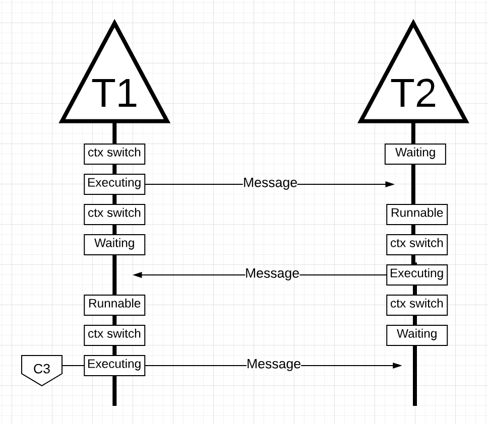
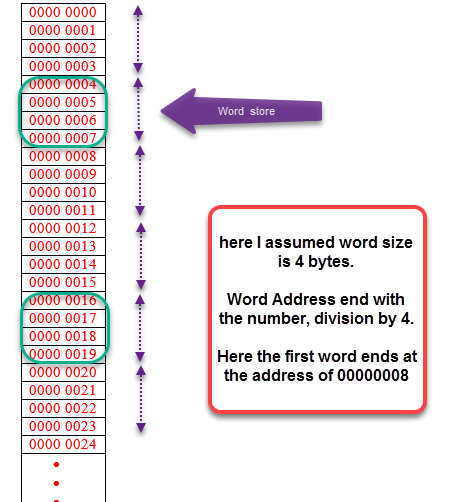
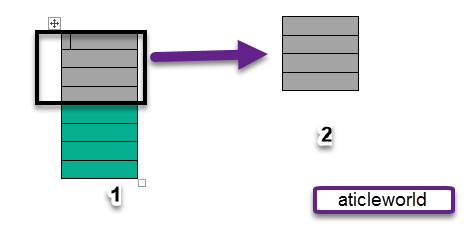
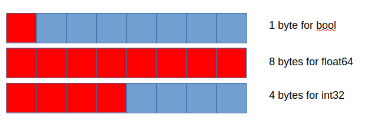
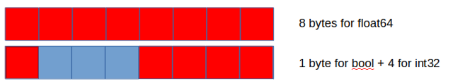

# Компиляция программы на C++

```c++
#include <stdio.h>

int main() {
  printf("123");
  
  return 0;
}
```

Компиляция:

```bash
gcc hello.c -o hello
```

Количество ассемблерных инструкций:

```bash
objdump -d hello | wc -l
```


# select / poll / epoll

https://habr.com/ru/company/infopulse/blog/415259/


# Runtime

https://dave.cheney.net/

https://blog.cloudflare.com/how-stacks-are-handled-in-go/

https://www.ardanlabs.com/blog/2018/08/scheduling-in-go-part1.html

https://morsmachine.dk/go-scheduler

https://rakyll.org/codegen/

https://www.youtube.com/watch?v=YHRO5WQGh0k

https://habr.com/ru/company/mailru/blog/358088/

http://m0sth8.github.io/runtime-1/#11


Runtime – это окружение, в котором выполняется наша программа. Код, который выполняется в нашей программе, но который мы сами не вызывали. *Go runtime* встроен в ваше *application* и работает для нас прозрачно.

- *Scheduler* (планировщик)
- сборщик мусора (TBD???)
- аллокатор памяти (TBD)


# Go Scheduler

## Основные понятия

*Go scheduler* использует следующую терминологию:

- **G**: goroutine
- **M**: OS thread (machine)
- **P**: processor

В Go – *M:N scheduler*. Необходимо выполнить *sheduling* **M** *goroutine*'s на **N** *OS thread*'ов, которые выполняются не более чем на GOMAXPROCS *processor*'ах. 

При запуске *Go program*'ы,  на каждое *virtual core*, обнаруженное на *host machine*, назначается *Logical Processor (P !!!!)*. Если у вас есть *processor* с несколькими *hardware thread*'s на одно *physical cores* (технология *hyper-threading*), каждый *hardware thread* будет виден как отдельное *virtual core*.

Например для ноутбука MacBook Pro:


Итак, в системе:

- один *processor* с 4 *physical core*'s.
- в отчете не указано количество *hardware thread*'s. При этом известно, что процессор Intel Core i7 поддерживает технологию *Hyper-Threading*, и на каждое *physical core* приходится 2 *hardware thread*'s. 
- Таким образом, *Go program*'а получит информацию, что доступно 8 *virtual core*'s для параллельного выполнения *OS Thread*'ов.

Чтобы вывести количество доступных *virtual* (логических) CPU's необходимо использовать функцию `runtime.NumCPU()`:

```go
package main

import (
	"fmt"
	"runtime"
)

func main() {
    // NumCPU возвращает число logical
    // CPU's доступных для использования текущим process'ом.
    fmt.Println(runtime.NumCPU())
}
```

В данном примере для MacBook Pro, результатом вызова функции `runtime.NumCPU()` будет значение `8`. Любая *Go program*, которую я запущу на компьютере, получит *8 P*.

Каждому *P* назначается *OS Thread* («*M*» !!!!). Буква «*М*» означает «машина». Этот *Thread* по-прежнему управляется *OS*, и *OS* по-прежнему отвечает за размещение *Thread*'а на *Core* для выполнения. Это означает, что когда я запускаю *Go program* на своей *machine*, у меня есть 8 *thread*'ов, доступных для выполнения моей работы, каждый из которых в отдельности прикреплен к *P*.

В каждой *Go program*'е изначально создается *initial Goroutine* (“*G*” !!!!), которая исполняет *Go program*'у. Подобно тому, как *OS Thread*'ы *context-switch*'атся с и на *Core*, *Goroutine*'s *context-switch*'атся с и на *M*.

В *Go scheduler*'е есть две *run queue*'s (очереди выполнения) – *Global Run Queue* (*GRQ*, глобальная очередь выполнения) и *Local Run Queue* (*LRQ*, локальная очередь выполнения). Каждому *P* присваивается *LRQ*, которая управляет *Goroutine*'s, привязанными для выполнения в *context*'е *P* (?что это значит?). Эти *Goroutine*'s извлекаются по очереди, чтобы сделать *context-switch* на и с *M*, привязанного к этому *P*. *GRQ* предназначен для *Goroutine*'s, которые еще не были привязаны к *P*. Существует процесс перемещения *Goroutine*'s из *GRQ* в *LRQ*.

Преимущество LRQ (по сравнению с GRQ) является распределенность и возможность масштабирования. Отсутствует глобальный для всех *P* – *mutex* и связанные с ним блокировки при *sheduling*'e *goroutine*. 

Ниже схема взаимоотношения всех этих компонентов.


Общие принципы:

- Каждому **M** должен быть назначен **P**
- **P** может не иметь **M** (вообще? скорее в *executing state*), если они находятся в *waiting state*. 
- В любой момент времени, существует не более GOMAXPROCS **P**.
- В любой момент времени, на каждом **P** может работать только один **M**. 
- При необходимости *scheduler* может создавать дополнительные **M**.


## Cooperating Scheduler

Связано с [cooperative multitasking](../OS.md#cooperative-multitasking) и [preemptive multitasking](../OS.md#preemptive-multitasking)

Задача *Go scheduler*'а — распределить *runnable goroutin*'ы по множеству *OS thread*'ов.

*OS scheduler* является *preemptive scheduler*. Вы не можете предсказать, что *scheduler* будет делать в какой-то момент времени. *OS kernel* (ядро ОС) принимает решения и они недетерминированы. Приложения, работающие поверх *OS*, не контролируют то, как выполняется *sheduling* внутри *kernel*. Для такого контроля есть только *synchronization primitive*'s, такие как *atomic* и *mutex*.

*Go scheduler* является частью *Go runtime*, а *Go runtime*, в свою очередь, встроен в ваше *application*. Поэтому *Go scheduler* работает в [*user space*](../OS.md#user-space) над *kernel*. На сегодня, *Go scheduler* реализован как *cooperative* (*non-preemptive*) *multitasking*. Это означает, что *scheduler*'у нужны четко определенные *user space event*'ы, которые происходят в *safe point*'ах в коде, чтобы принимать решения о *scheduling*'е.

При этом *Go cooperating scheduler* выглядит и ощущается как *preemptive*. Вы не можете предсказать, что собирается делать *Go scheduler*. Это связано с тем, что принятие решений для *Go cooperating scheduler*'а осуществляется *Go runtime*, а не разработчиком. Поэтому необходимо воспринимать *Go scheduler* как *preemptive scheduler*, поскольку *scheduler* недетерминирован.

## *Goroutine State*'s

Как и *Thread*'ы (подробнее про [thread state](../OS.md#thread-state)), *Goroutine*'s имеют те же три высокоуровневых *state*'s. Эти *state* влияют на управление *Go scheduler*'а этой *goroutine*.  *Goroutine* может находиться в одном из трех *state*'s:

- `waiting` (ожидающий) – это означает, что *goroutine* остановлена и ожидает (*waiting*) чего-то, чтобы продолжить работу. Это может быть *waiting* OS (*system call*) или *synchronization call* (*atomic, mutex*). Эти типы [latency](https://en.wikipedia.org/wiki/Latency_(engineering)) являются *root cause* низкого *performance*.
- `runnable` (готовый к выполнению) – означает, что *goroutine* нужно *time* на *M*, чтобы она могла выполнять свои *instruction*'s. При большом количество *goroutine*'s в таком состоянии, они будут вынуждены долго ожидать до момента получения *time*. Кроме того, количество *time*, которое будет получать каждая *goroutine*, будет сокращаться по мере того, как все больше *goroutine*'s будет соревноваться за время. Этот тип *scheduling latency* также может быть причиной низкого *performance*.
- `executing` (исполняющийся) – означает, что *goroutine* была помещена на *M* и выполняет свои *instruction*'s. 


## Context Switching

*Go scheduler*'у требуются четко определенные *user-space event*'ы, которые происходят в *safe point*'ах в коде, чтобы сделать *context switch*. Эти *event*'ы и *safe point*'ы находятся в местах *function call*'s. *Function call*'s имеют критическое значение для работоспособности *Go scheduler*'а. Для Go 1.11 или ниже, если вы запускаете какие-либо долгие циклы, которые не делают *function call*'s, это приведет к задержкам *Go scheduler*'а и GC. Критически важно, чтобы *function call*'s происходили в разумные сроки.

Предложен *[proposal](https://github.com/golang/go/issues/24543)* для Go 1.12, которое предполагает применение *preemptive* (*non-cooperative*) техник внутри *Go scheduler*'а, чтобы обеспечить *preemption* (вытеснение) долгих циклов.

Есть четыре класса *event*'ов, которые позволяют *scheduler*'у принимать решения о *scheduling*'е: 

- Использование `go` *statement* – для создания *goroutine*'s. 

  Как только новая *goroutine* создана, она дает *scheduler*'у возможность принять решение о *scheduling*'е.

- *Garbage collection*

  Поскольку GC работает с использованием собственного набора *goroutine*'s, эти *goroutine*'s требуют время на M для запуска. Это приводит к тому, что GC создает хаос в процессе *scheduling*'а. Однако *scheduler* понимает, что делает каждая *goroutine* и использует это знание в процессе *scheduling*'а. Например, делает *context-switching* с *goroutine*, которая взаимодействует с *heap*  во время GC, на *goroutine*, которая не взаимодействует с *heap* в это время. Когда GC работает, принимается множество решений по *scheduling*'у.

- *System call*'s

  Если *goroutine* делает *system call*, который приводит к блокировке *М*, *scheduler* может *context-switch off* эту *goroutine* с М и *context-switch on* новую *goroutine* на ту же самую *М*. Но иногда такой *context-switch* невозможен, и требуется новая М для продолжения выполнения *goroutine*'s, которые стоят в очереди к P. Далее это объясняется подробнее.

- *Synchronization* и *orchestration*

  Если вызов операций – *atomic*, *mutex* или *channel* – приведет к блокировке *goroutine*, *scheduler* может сделать *context-switch* на новую *goroutine*. Как только *goroutine* сможет снова запуститься, ее можно повторно поставить в очередь и, через какое-то время, произойдет *context-switch* на нее обратно.

Это не значит, что *scheduling* будет происходить каждый раз при наступлении каждого из этих событий. Это значит, что *scheduler* получит возможность *scheduling*'а при каждом из этих *event*'ов.

## Асинхронные *system call*'s

Когда OS умеет асинхронно обрабатывать *system call*, для более эффективной обработки *system call* можно использовать что-то вроде [network poller](https://golang.org/src/runtime/netpoll.go). Это достигается с помощью *kqueue* (MacOS), *epoll* (Linux) или *iocp* (Windows) в соответствующих ОС.

*Network* *system call*'s могут обрабатываться асинхронно многими ОС, которые мы используем сегодня. Именно отсюда *network poller* получил свое название, поскольку его основное назначение — обработка *network* операций. Используя *network poller* для *networking system call*'s, *scheduler* может не позволять *Goroutin*'ам блокировать **M** при выполнении *system call*'s. Это помогает сохранить доступность **M** для выполнения других *Goroutine*'s из **LRQ** (процессора **P**) без необходимости создания новой **M**. Это помогает снизить нагрузку на ОС по *scheduling*'у.

Пример:


*Goroutine* 1 (**G1**) выполняется на **M**, и еще 3 *goroutin*'ы (**G2, G3, G4**) ждут в LRQ, чтобы получить свое время на **M**. *Network poller* находится в *idle* и ничего не делает.


**G1** хочет выполнить *network system call*, поэтому **G1** перемещается в *network poller* и *network system call* обрабатывается асинхронно. Как только **G1** будет перемещена в *network poller*, **M** станет доступен для выполнения другой *Goroutine* из LRQ. В этом случае **G2** выполняет *context-switch* на **M**.


Когда асинхронный *network system call* завершается, и **G1** перемещается из *network poller*'а обратно в **LRQ** для **P**. Как только **G1** сможет сделать *context-switch back* на **M**, ее код продолжит выполняться. Большое преимущество – выполнение *network system call*'ов не требует дополнительных **M**. *Network poller* владеет *OS Thread*'ом и обрабатывает эффективный *event loop* (? что значит эффективный).

## Синхронные *system call*'s

Когда *Goroutine* делает *system call*, который невозможно выполнить асинхронно, *network poller* использовать нельзя, и *Goroutine*, которая делает *system call* блокирует **M**. Это плохо, но предотвратить это невозможно. Одним из примеров *system call*'а, который не может быть выполнен асинхронно, – *file system call*. Если вы используете **CGO **(программы на C внутри кода Go),  вызов *C function* также может заблокировать **M**.

Примечание. ОС Windows имеет возможность асинхронного выполнения *file-based system call*'s. Технически при работе в Windows можно использовать *network poller*.

Пусть выполняется синхронный *system call* (например, file I/O), который приводит к блокировке **M**.


**G1** делает синхронный *system call*, который блокирует **M1**.


*Scheduler* определяет, что **G1** вызвала блокировку **M**. В этот момент *scheduler* отсоединяет **M1** от **P** вместе с блокирующей **G1**, которая все еще подключена. Затем *scheduler* запускает новую **M2** (или использует существующую) для обслуживания **P**. В этот момент **G2** может быть выбрана из LRQ и для нее выполнен *context-switch* на **M2**. Если **M** уже существует (т.к. была создана ранее), этот переход происходит быстрее, чем создание нового **M**.


Блокирующий *system call*, который делала **G1**, завершается. В этот момент **G1** может вернуться в **LRQ** и снова обслуживаться **P**. **M1** не завершается и используется в будущем, когда повторяется аналогичный сценарий.

Таким образом, количество **M** (*thread*'ов) превышает количество *Core*'s.

## Work Stealing

В многопоточных вычислениях возникли две парадигмы *scheduling*'а:

- *Work sharing* (распределение работы) – когда один *processor* генерирует новые *thread*'ы, он пытается перенести (?) некоторые из них на другие *processor*'ы в надежде, что они будут использованы (*utilized*) *idle/underutilized* (недозагруженными) *processor*'ами.
- *Work-stealing* (кража работы) – *underutilized* (недозагруженный) *processor* активно ищет *thread*'ы другого  *processor*’а и «*steal*» некоторые из них.

Миграция thread'ов происходит реже при *work stealing*, чем при *work sharing*, т.к. в этом случае – когда у всех *processor*'ов есть работа, миграция *thread*'ов не выполняется. И как только появляется *idle processor*, предпринимается попытка *work stealing*.

В Go - *work-stealing scheduler*. Это помогает улучшать эффективность *scheduling*'а. Он был представлен в Go 1.1 и разработан Дмитрием Вьюковым.

При переходе **M** в *waiting state* – ОС сделает *context-switch* для **M** от **Core**. (???) Это означает, что **P** не может выполнить какую-либо работу, даже если *Goroutine* находится в *runnable state*, пока для **M** не будет выполнен *context-switch back* на *Core*. *Work stealing* также помогает сбалансировать *goroutin*'ы по всем **P**, чтобы работа лучше распределялась и выполнялась более эффективно.

Пример:


На рисунке, два **P**, обслуживающие четыре *goroutin*'ы каждый, и одна *goroutine* в **GRQ**. 

Допустим **P1** обработал все свои *goroutin*'ы.


Но есть *goroutin*'ы в *runnable state*, как в **LRQ** от **P2**, так и в **GRQ**. В этом случае **P1** делает *work stealing* по следующим правилам ([устарело](https://golang.org/src/runtime/proc.go), наверное):

```go
func schedule() {
    // только в 1/61 случаев проверяй GRQ на наличие G.
    // если не найдено, проверь LRQ
    // если не найдено,
    //     попытайся steal у других P's
    //     если нет, проверь GRQ
    //     если не найдено, poll network. 
}
```

Кажется, что *global queue* имеет более высокий приоритет над *local queue*, но периодическая проверка *global queue* время от времени важна, чтобы избежать *scheduling*'а **G** только из *local queue*, пока они там есть.

Согласно этим правилам, **P1** должен проверить **P2** на наличие *goroutine*'s в своем **LRQ** и взять половину того, что он найдет.


**P1** забрал половину *goroutine*'s у **P2** и выполняет их.

Если **P2** завершит обслуживание всех своих *goroutine*'s, он попытается *steal work* у **P1**. Допустим, что в **LRQ** у **P1** ничего не осталось.


*Sheduler*:

- проверить **LRQ** у **P1**, но не найдет там gotoutines
- далее он проверит **GRQ** и найдет там **G9**.


**P2** *steal* **G9** из **GRQ** и начинает выполнять работу. В итоге **M** всегда *busy* и не *idle*. (?) *Work stealing* может рассматриваться как *spinning* `M` (?)

## *Spinning thread*

Если *thread* завершил обработку *goroutine*'s, он не будет уничтожен. Система *spin* этот *thread* и сохраняет для дальнейшего использования. 

Хотя это кажется пустой тратой ресурсов, наоборот, это позволяет экономить ресурсы ОС. По сравнению с частым *preemption thread*'ов и частыми операциями создания и уничтожения, такой *thread* стоит гораздо дешевле.

## Пример

Представим *multi-threaded application*, написанное на C, в котором программа управляет двумя *OS Thread*'s, которые передают друг другу *message*'s туда-сюда друг другу.

**C** (*Core*) – это то же самое, что и **P** (*Processor*) в схемах выше.  


Для *Thread* 1 выполняется *context-switch* на *Core 1* (**C1**) и он исполняется. *Thread 1* отправляет *message* *thread*'у 2. Как конкретно отправляется *message* – не важно, внимание уделено – состоянию *thread*'ов во время выполнения приложения.


Как только *thread 1* завершит отправку *message*, ему теперь нужно дождаться ответа. Это значит, что для *Thread 1* будет выполнен *context-switch off* с *Core 1* и переведен в *waiting state*. Как только *Thread 2* будет уведомлен (как? прерывание?) о сообщении, он перейдет в *runnable state*. Теперь OS может выполнить *context switch* и запустить *Thread 2* на *Core 2* (**C2**). Затем *Thread 2* обрабатывает сообщение и отправляет новое сообщение обратно в *Thread 1*.



Теперь выполняется *context-switch off* для *Thread 2* и *context-switch on* для *Thread 1*, когда он получить сообщение от *Thread 2*. *Thread 2* переключается (*context-switch*) из *executing state* в *waiting state*, а *Thread 1* переключается (*context-switch*) из *waiting state* в *runnable state* и затем в *executing state* на *Core 3* (**C3**), что позволяет ему обработать и отправить обратно новое сообщение.

Все эти *context-switch*'и и изменения *state* требуют времени и снижают скорость выполнения работы. Каждый *context-switch* потенциально приводит к задержке около ~1000 *nanosecond* и, если CPU выполняет 12 *instruction* в *nanosecond*, то мы теряем ~12k *instruction*'s, которые могли бы быть исполнены во время *context switch*. Т.к. thread'ы переключаются между разными *core*'s, высока вероятность дополнительной задержки из-за *cache-line miss*.

Рассмотрим ту же ситуацию на примере *goroutine*'s и *go scheduler*'а.


На рисунке, 2 *goroutine*'s обмениваются сообщениями. Для **G1** выполняется *context-switch* на **M1**, который исполняется на *Core 1* (**C1**). **G1** переходит в *executing state* и отправляет сообщение к **G2**.


Как только **G1** завершит отправку сообщения, она будет *сontext-switch off* от **M1** (перемещена в *network poller* ) и переведена в *waiting state*. Как только **G2** будет уведомлена о сообщении, она перейдет в *runnable state*. Теперь *Go scheduler* может выполнить *context switch* и запустить **G2** на **M1**, который все еще работает на **C1**. **G2** обрабатывает сообщение и отправляет новое сообщение обратно в **G1**.


Когда сообщение, отправленное **G2**, будет принято **G1**:

- **G2** *context-switch* из *executing state* в *waiting state*
- **G1** *context-switch* из *waiting state* в *runnable state*, а затем в *executing state*, что позволяет ей обработать и отправить новое сообщение обратно.

Использование *goroutine*'s дает существенные преимущества. При использования *goroutine*'s для всей обработки используются одни и те же OS *thread*'ы и *core*'s. *OS thread* никогда не переходит в *waiting state* (прям никогда?). При использовании *goroutine*'s отсутствуют потери *instruction*'s, которые возникают из-за *context switch* при использовании *thread*'ов (не совсем отсутствуют, как ниже написано). Поэтому не нужно использовать *thread*'ов, больше чем *virtual core*'s.

Go превращает IO-блокирущую работу (на *application level*) в *CPU-bound* работу на *OS level* (что это значит?). Поскольку все *context switch* происходят на *application level*, они обходятся в ~200 *nanosecond* или ~2.4k *instruction*'s. *Scheduler* также помогает повысить эффективность использования *cache* и [NUMA](http://frankdenneman.nl/2016/07/07/numa-deep-dive-part-1-uma-numa) . 

## Concurrency

*Concurrency* означает выполнение «не по порядку». Взять набор *instruction*'s, которые выполняются последовательно, и найти способ выполнить их "не по порядку", но при этом получить тот же результат. Причем это должно иметь ценность – достаточный рост *performance* к затратам на сложность. В зависимости от проблемы, выполнение "не по порядку" может оказаться невозможным или даже не иметь смысла.

[Concurrency – это не тоже самое, что и parallelism](https://blog.golang.org/concurrency-is-not-parallelism). *Parallelism* означает выполнение двух или более *instruction*'s в одно и то же время. *Parallelism* возможен только в том случае, если у вас есть как минимум два *OS thread*'а,  два *Core*'s и две *Goroutine*'s, каждая из которых выполняет *instruction*'s независимо в отдельном *OS thread*'е.


На рисунке – двух *processor*'а (**P**), к каждому из которых прикреплен независимый *OS thread* (**M**), связанный с независимым *hardware thread*'ом (**Core**) (ну наверное это не прям *thread*). Две *Goroutine*'s (G1 и G2) выполняются в *parallel*, одновременно выполняя свои *instruction*'s в соответствующем *OS/hardware thread*'е. К каждому *processor*'у привязаны по три *Goroutine*'s (например, к **P1** – **G2**, **G3**, **G5**), которые по очереди совместно используют соответствующий *OS thread*. Эти *Goroutin*'ы работают *concurrently*, они *share* время на *OS thread*'е и выполняются без заранее определенного порядка.

## Виды рабочей нагрузки (workload)

Тип *workload*, который использует *goroutine*, позволяет понять – необходимо ли использовать *parallelism* для организации *concurrency*. Существует два типа *workload*'s:

- *CPU-Bound*. Это *workload*, который (почти?) никогда не создает такой ситуации, что *Goroutine*'s самостоятельно входит и выходит из *waiting state*. Эта *workload*, которая постоянно выполняет вычисления. Например, вычисление числа 𝞹 до *n*-й цифры – *CPU-Bound* задача.
- *IO-Bound*. Это *workload*, которая предполагается, что *Goroutine*'s постоянно самостоятельно переходят в *waiting state*. Примеры такой *workload* – запросе доступа к ресурсу по *network*, или выполнение *system call* в OS, или ожидание возникновения *event*'а. Например, *goroutine*, которая читает *file* – *IO-Bound*. Также в эту категорию можно включить *workload*, которая вынуждает *goroutine* переходить в *waiting state* по событиям синхронизации (*mutex*, *atomic*).

При *CPU-Bound workload* для организации *concurrency* необходимо использовать *parallelism*. Один *OS/hardware thread*, обрабатывающий множество *goroutine*'s неэффективен, поскольку *goroutine*'s не входят в *waiting state*. При создании большого количества *goroutine*'s, превышающего количество *OS/hardware thread*'ов, происходит снижение *performance* из-за роста затрат на *context switсh on* и *off* (на и с) *OS thread*'а. *Context switch* приводит к **"Stop The World"** ( ?реально прямо) для всей *workload*, *workload* не может выполняться во время *context switch*.

При *IO-Bound workload* для организации *concurrency* нет необходимости использовать *parallelism*. Один *OS/hardware thread* может эффективно обрабатывать множество *goroutine*'s, поскольку *goroutine*'s постоянно входят и выходят из *waiting state*. При создании большого количества *goroutine*'s, превышающего количество *OS/hardware thread*'ов, можно повысить *performance*, т.к. *context switсh on* и *off* (на и с) *OS thread*'а не приводит к **"Stop The World"**. Если *goroutine* входит в *waiting state*, другая *goroutine* начинает использовать этот *OS/hardware thread*, не позволяя ему *idle*.


https://www.ardanlabs.com/blog/2018/12/scheduling-in-go-part3.html

https://rakyll.org/scheduler/

[https://segmentfault.com/a/1190000040186074/en](https://vk.com/away.php?to=https%3A%2F%2Fsegmentfault.com%2Fa%2F1190000040186074%2Fen&cc_key=)


## Планировщик

Сердце программы, маленькая операционная система, который управляет работой *goroutine*'s. 

Т.е. по сути мы строим планировщик задач поверх планировщика задач ОС.

Основные концепции:

- у программиста есть только *goroutine*'s и нет *thread*'s ОС.
- запускается столько *thread*'s – сколько процессорных ядер (или можно специально настроить значение `GOMAXROCS`)
- распределеяют на эти *thread*'s – все *goroutine*'s, которые запускает программист

Основные термины:

- Machine (M) – Thread ОС
- Processor (P) – процессор
- Goroutine (G)

Связь между ними:


# Netpoller

https://morsmachine.dk/netpoller

Рассмотрим как Go обрабатывает *network I/O*.

В Go – все операции I/O являются блокирующими. Экосистема Go построена на идее, что вы пишете с блокирующим интерфейсом (тут не в смысле *interface* языка Go), а затем обрабатываете *concurrency* через *goroutine*'s и *channel*'s, а не через *callback*'s и *future*'s (что это?)

Примером может служить *HTTP server* в `net/http` *package*. Всякий раз, когда он принимает *connection*, он создает новую *goroutine* для обработки всех *request*'ов, которые будут приходить на этот *connection* (т.е. goroutine на каждый *connection*, а не на каждый *request*). Эта конструкция означает, что *request handler* может быть написан очень просто. Сначала сделай это, потом сделай это. К сожалению, использование блокирующего I/O, предоставляемого OS, не подходит для создания нашего собственного интерфейса блокирующего *I/O*.  При построении блокирующий I/O поверх блокирующего I/O от OS, мы бы порождали новый *thread* для каждого клиента, заблокированного на *syscall*. Это становится очень дорого, когда у вас есть 10 000 *client thread*'s, которые заблокированы на *syscall* и ожидают успешного завершения I/O операции.

Go решает эту проблему, используя асинхронные интерфейсы, которые предоставляет OS, но блокирует *goroutine*'s, которые выполняют I/O.


TODO!!!!


# Goroutine

Стандартные thread ОС – тяжелые и медленные, тяжело контролировать из программы. Goroutine также называются зелеными thread. Они как thread, только лучше.

Преимущества:

- контроль над выполнением асинхронных задач
- экономия ресурсов – goroutine занимает меньше 2Kb, а thread - около 2 Mb
- более эффективное переключение между задачами. Переключение между threads в ОС – очень сложный и медленный процесс.

*Goroutine* может начать выполняться на одном системной *thread*, а продолжить на другом.


# Alignment / padding

*Data structure alignment* (выравнивание структур данных) - способ размещения данных в памяти особым образом для ускорения доступа.. Она состоит из трех отдельных, но взаимосвязанных проблем: *data alignment* (выравнивание данных), *data structure padding* (отступ структур данных) и *packing* (упаковка).

CPU выполняют операции чтения и записи в память наиболее эффективно, когда данные *naturally aligned* (естественно выровнены). Это означает , что *data's memory address* является кратным *data size*. Например, в *64-bit architecture* данные могут быть *aligned*, если данные хранятся в четырех последовательных *byte*'s, а первый *byte* находится на *4-byte boundary* (границе). Архитектура определяет размер *word* (машинного слова), его размер равен 2^k.

*Alignment* - это всего лишь методы микрооптимизации, современные процессоры очень умны, и они знают, как обрабатывать *unaligned memory*, но в какой-то плохой ситуации процессору требуется несколько дополнительных циклов для получения *unaligned memory*. 

*Data alignment*  - это выравнивание элементов в соответствии с их *natural alignment*. Чтобы обеспечить *natural alignment*, может потребоваться вставить некоторый *padding* (отступ) между *structure element*'s или после последнего *structure element*. Например, на *32-bit machine* – *data structure*, содержащая *16-bit value*, за которым следует *32-bit value*, может иметь *16 bits of padding* между *16-bit value* и *32-bit value* для выравнивания *32-bit value* по *32-bit boundary*. В качестве альтернативы можно *pack* (упаковать) *structure*, опуская *padding*, что может привести к более медленному доступу, но сокращает потребление памяти на четверть.

При сохранении какого-то объекта в памяти может случиться, что некое поле, состоящее из нескольких байтов, пересечёт *natural boundary* для *word*'s в памяти. Некоторые модели процессоров не могут обращаться к данным в памяти, нарушающим границы *word*'s. Некоторые CPU могут обращаться к *невыровненным* данным дольше, нежели к данным, находящимся внутри целого *word* в памяти.

Хотя *data structure alignment* является фундаментальной проблемой для всех современных компьютеров, многие компьютерные языки и реализации компьютерных языков обрабатывают выравнивание данных автоматически. 

## Определение

*Memory address* `a` называется *n-byte aligned* (n-байтово выровнен), когда `a` кратно *n* байт (где *n* является степенью 2). *n-byte aligned address* имеет минимум log2(n) нулей в младших разрядах, когда выражен в двоичном виде.

Поэтому *alignment* всегда является числом-степенью 2 (1, 2, 4, 8, ...)

*Memory access* называется *aligned*, когда данные, к которым осуществляется доступ, имеют длину *n* *byte*'s и адрес элемента данных *n-byte aligned*. Когда *memory access* – *not aligned*, он называется *misaligned*.

В Go используется термин *required alignment*. Исходя из предыдущего определения, для элемент данных *required alignment* равен его размеру (но не для *struct*, смотреть ниже).

*Memory pointer*, который относится к примитивным данным, *n byte*'s длиной называется *aligned*, если он содержит только *address*'s, которые *n-byte aligned*, иначе он называется *unaligned*. *Memory pointer*, который ссылается на *data aggregate* (*data structure* или *array*) называется *aligned*, если каждый примитивный элемент данных в *aggregate* – *aligned*.

Alignment для разных type's и архитектур процессоров, которые чаще всего используются (возможно, в Go есть отличия). ??? Получается, что *alignment* не зависит от *architecture*, а зависит только от размера данных???

| **Data Type** | **32-bit (bytes)** | **64-bit (bytes)** |
| ------------- | ------------------ | ------------------ |
| char          | 1                  | 1                  |
| short         | 2                  | 2                  |
| int           | 4                  | 4                  |
| float         | 4                  | 4                  |
| double        | 8                  | 8                  |
| pointer       | 4                  | 8                  |


## Проблема

CPU обращается к *memory* по одному *memory word* за раз. Пока *memory word size* больше размера самого большого примитивного типа данных, поддерживаемого компьютером, *aligned access* всегда будет обращаться к одному *memory word*. Это может быть неверно для *misaligned data access*.

Пример *aligned data* для *32 bit system*:



Пример доступа к *aligned data*:



Пример доступа к *unaligned data*:


Если старший и младший байты в элементе данных не находятся в одном и том же *memory word*, компьютер должен разделить доступ к элементу данным на несколько *memory access*'s. Это требует множества сложных схем для выполнения *memory access*'s и их координации. 

Некоторые конструкции процессоров намеренно избегают такой сложности и вместо этого выполняют альтернативное поведение в случае *misaligned memory access*. 

Когда осуществляется доступ к одному *memory word*, операция является атомарной, то есть *memory word* целиком читается или записывается сразу, и другие устройства должны ждать завершения операции чтения или записи, прежде чем они смогут получить к нему доступ. Это может быть неверно для *unaligned access*'s к нескольким *memory word*'s, например, первое *word* может быть прочитано одним устройством, оба *word*'s записаны другим устройством, а затем второе *word* прочитано первым устройством, так что считанное значение не является ни исходным значением, ни обновленным значением. Хотя такие сбои случаются редко, их бывает очень сложно идентифицировать.

*Alignment* ускоряет доступ к памяти за счет генерации кода, который требует по одной инструкции для чтения и записи ячейки памяти. Без *alignment* мы можем столкнуться с ситуацией, когда процессору придется использовать две или более инструкции для доступа к данным, расположенным между адресами, кратными размеру *machine word*.

## Data structure padding (отступ структур данных)

Хотя компилятор обычно *allocate* отдельные элементы данных на *aligned boundary*'s, *data structure* часто содержат *member*'s с различными требованиями к *alignment*. Чтобы поддерживать правильное *alignment*, компилятор обычно вставляет дополнительные *unnamed data member*'s, чтобы каждый *member* был правильно *aligned*. Кроме того, *structure* в целом может быть *padded* последним *unnamed member*. Это позволяет каждой *structure* быть правильно *aligned* внутри *array*.

*Padding* вставляется только тогда, когда:

- за одним *member* следует другой *member* с более высокими требованиями к *alignment*
- или в конце структуры. 

Изменяя порядок *member*'s в *structure* можно изменить количество *padding*'s, необходимых для *alignment*. Например, если *member*'s сортируются по убыванию требований к *alignment*, потребуется минимальное количество *padding*'s. Требуемое минимальное количество *padding*'s всегда меньше максимального *alignment* в *structure*, т.е. размера максимального *member*. 

*Struct* сами по себе *aligned* и значение *alignment* для них равно размеру самого большого *member* в *structure*!!!! Или другими словами, *alignment* в *struct* должен быть таким же как *alignment*  для наиболее строгого (большого) *member*. В этом случае все *member* в *structure* могут быть *aligned* – от самого большого *member* до самого маленького. 

*Alignment* для *array type* равен *alignment* его *element type*.

Хотя C++ и Go не позволяет компилятору переупорядочивать *member*'s в *structure* для экономии места, другие языки могут это делать. 

### Вычисление *padding*

Ниже формулы для расчета *padding*, необходимого для *alignment* начала *data structure*:

```
padding = align - (offset mod align)
aligned = offset + padding
```

Например, имеем *4-byte aligned structure* и *offset* `0x59d`, тогда `padding = 3`. В этом случае *structure* будет начинаться с `0x5a0`, что кратно 4. 

## Struct in Go

Пусть имеем 64-битную архитектуру, размер *word* – *8 bytes*

Допустим объявлена *struct*:

```go
type myStruct struct {
  myBool   bool    // 1 byte
  myFloat float64  // 8 bytes
  myInt  int32     // 4 bytes
}
```

Посмотрим размер *instance* этой *struct* в памяти:

```go
a := myStruct{}
fmt.Println(unsafe.Sizeof(a)) // 24 bytes
```

Т.е. вместо 1 + 8 + 4 = 13 байт *struct* занимает в памяти 24 байта.

Т.к. в памяти она будет размещена следующим образом:



Оптимизировать *struct* можно, упорядочив *field*'s по их размеру (а значит и требованию к *alignment*):

```go
type myStructOptimized struct {
 myFloat float64 // 8 bytes
 myBool  bool    // 1 byte
 myInt   int32   // 4 bytes
}
```

(только здесь не совсем упорядочили почему-то).

Размер *instance* этой *struct* в памяти:

```go
b := myStructOptimized{}
fmt.Println(unsafe.Sizeof(b)) // ordered 16 bytes
```

Т.к. в памяти она будет размещена следующим образом:



### Struct alignment

Каждая *struct* целиком тоже *aligned* в памяти. Это означает, что *structure* в целом может быть *padded* последним *unnamed member*. Это позволяет каждой *structure* быть правильно *aligned* внутри *array* (дубль текста выше).

В Go используется термин *required alignment*. Значение *required alignment* (требуемого *alignment*) для *struct* равно размеру самого большого *member* в *structure*!!!! Или другими словами, *alignment* в *struct* должен быть таким же как *alignment*  для наиболее строгого (большого) *member*. В этом случае все *member* в *structure* могут быть *aligned* – от самого большого *member* до самого маленького, т.к. они все являются степень 2 (дубль выше).

Пример *struct* с *required alignment 8 byte*'s:

```go
type myStruct struct {
	myInt   int64   // 8 bytes
	myBool  bool    // 1 byte
}

func main() {
	a := myStruct{}
	fmt.Println(unsafe.Sizeof(a)) // 16 bytes
}

```


Изменив размер самого большого *field* в *struct* на *4 byte*, меняем и *required alignment* для *struct* на *4 byte*:

```go
type myStruct struct {
	myInt   int32   // 4 bytes
	myBool  bool    // 1 byte
}

func main() {
	a := myStruct{}
	fmt.Println(unsafe.Sizeof(a)) // 8 bytes
}

```


### 32-bit и 64-bit architecture 

Разница между *32-bit* и *64-bit architecture* следующая: в *32-bit architecture* – *word boundary*'s встречаются каждые 4 bytes, a в *64-bit architecture* – каждые 8 *bytes*.

Рассмотрим *struct*:

```go
type myStruct struct {
        a    uint32   // 4 bytes
        b    uint64   // 8 bytes
}

func main() {
	a := myStruct{}
	fmt.Println(unsafe.Sizeof(a))  // 16
}
```

Для *64 bit machine* адрес `uint64` *field* должен быть кратен 8 bytes. И поэтому *struct* будет выглядеть следующим образом и `size = 16 bytes`:

```go
type myStruct struct {
        a    uint32   // 4 bytes
        _    [4]byte  // padding added by compiler
        b    uint64   // 8 bytes
}
```

Для *32 bit machine* – *word boundary*'s встречаются каждые *4 bytes*, поэтому нет необходимости добавлять *padding*

```go
type myStruct struct {
        a    uint32   // 4 bytes
        b    uint64   // 8 bytes
}

func main() {
	a := myStruct{}
	fmt.Println(unsafe.Sizeof(a))  // 12
}
```

Таким образом, `uint64 ` *field* должны быть *aligned*: каждые *4 bytes* на *32 bit platform* и каждые *8 bytes* на *64 bit platform*.


## `unsafe` *package*

Функция [`unsafe.Alignof()`](packages/unsafe.md#alignof) возвращает *required alignment*:

- для *value* целиком (??? равен размеру, кроме составных типов, *struct*, *array*)
- для *field* внутри *struct*

```go
type myStruct struct {
	myInt   int64   // 8 bytes
	myBool  bool    // 1 byte
}

func main() {
	a := myStruct{}
	fmt.Println(unsafe.Alignof(a))        // 8
	fmt.Println(unsafe.Alignof(a.myInt))  // 8
	fmt.Println(unsafe.Alignof(a.myBool)) // 1
}
```

Функция [`unsafe.Offsetof()`](packages/unsafe.md#Offsetof) возвращает *offset* для *field* `x` внутри *struct*:

```go
type myStruct struct {
	myBool1  bool    // 1 byte
	myBool2  bool    // 1 byte
	myInt   int64    // 8 bytes
	myBool3  bool    // 1 byte
	myBool4  bool    // 1 byte
}

func main() {
	a := myStruct{}
	fmt.Println(unsafe.Offsetof(a.myBool1))  // 0
	fmt.Println(unsafe.Offsetof(a.myBool2))  // 1
	fmt.Println(unsafe.Offsetof(a.myInt))    // 8
	fmt.Println(unsafe.Offsetof(a.myBool3))  // 16
	fmt.Println(unsafe.Offsetof(a.myBool4))  // 17
}
```

