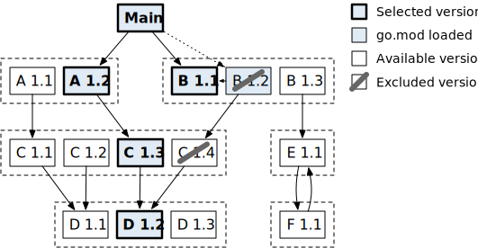

https://github.com/golang/go/wiki/Modules#daily-workflow


# Go modules

*Go modules* полностью заменяют старый подход с управлением зависимостями через `GOPATH`. 

Выделяют два режима работы:

- *module-aware mode* – режим с поддержкой *Go Modules*
- *GOPATH mode* – *legacy* режим с разрешением зависимостей через `GOPATH`

## Поддержка Go modules

Поддержка *module*'s включена прямо в `go` *command*'у. 

*Module-aware mode* включен автоматически, если:

- `go.mod` есть в текущем каталоге
- `go.mod` есть в любом родительском каталоге.

Также управлять *mode* можно с помощью `GO111MODULE` *environment variable*. Возможные значения:

- не задан или `GO111MODULE = auto` – включен ли *module-aware mode*, зависит от наличия файла `go.mod`  в текущем каталоге и родительских каталогах, как описано выше. 
- `GO111MODULE=on` – включен *module-aware mode*, `GOPATH` игнорируется
- `GO111MODULE=off` – включен *GOPATH mode*, возможности *Go modules* не используются. Зависимости ищет в каталоге `vendor` и `GOPATH`.

При *module-aware mode*:

- значение `GOPATH` *environment variable* не используется при поиске *dependency*'s
- загруженные *dependency*'s продолжают сохраняться в `GOPATH/pkg/mod`
- *command*'ы (*executable*'s) устанавливаются в `GOPATH/bin` (если `GOBIN` не установлена).

## Module

*Module* – набор связанных *package*'s, которые *released* (релизятся) вместе. *Module* – это единица обмена исходным кодом и *unit of versioning* (единица версионирования) (т.е. все *package*'s имеют версию, указанную в *module*). При версионировании используется *semantic version*.

*Module* содержит *package*'s в каталоге, содержащем файл `go.mod`, а также подкаталогах этого каталога, вплоть до следующего подкаталога, содержащего другой файл `go.mod` (если есть).

*Module* бывают:

- *executable* (исполняемый) – который содержит `package main`.
- *non-executable* ???

Даже если *module* изначально не опубликован в *repository* (*github*), желательно его сразу структурировать так, как будто он будет опубликован в *repository* (*github*).

*Repository*, как правило, содержит только один *module*, расположенный в корне репозитория (но может и несколько *module*'s). 

### Module path

*Module path* (путь к модулю) – префикс для *import path* для всех *package*'s внутри *module*. Объявляется в файле `go.mod`. 

```
module github.com/parshikovpavel/hello
```

*Module path* позволяет указать, где `go` *command* будет искать его его для загрузки. Т.е. `go` *command* при поиске некоторого *module* по его *module path* (например, `github.com/parshikovpavel/hello`) сделает запрос по соответствующему HTTPS URL-адресу (например, `https://github.com/parshikovpavel/hello`). Также по этому адресу будут считаны некоторые дополнительные метаданные из ответа HTML (популярные VCS хостинги автоматически присылают эти данные). 

Поэтому самый простой способ использовать и делиться *module* – указать *repository URL* в качестве *module path*. Поэтому принято, что если код хранится в некотором удаленном *repository*, то корень этого удаленного *repository* используется в качестве *module path*.  

## Package

Программы размещаются внутри *package*. 

*Package* – набор из *file*'s, размещенных в одном каталоге, которые компилируются вместе. `func`, `type`, `var` и `constant`, определенные в любом *file* некоторого *package* видны внутри всех других *file*'s этого же *package* (т.е. может быть несколько *file*'s в одном *package* !!!!).

В одном каталоге может находиться только один *package*. Однако есть исключение для unit test'ов, которые должны находиться в файлах `XXX_test.go` и пакете `package XXX_test` 

Подробно про `package` *clause* и `PackageName` ([1](#package-clause)).

### File

Язык Go оперирует в терминах *package*'s, а не файлов. То есть *package* можно разбить на любое количество файлов, и поместить в один каталог. Им всем необходимо задать одинаковое объявление `package`, и все они будут являться частями одного и же *package*, как если бы все их содержимое находилось в единственном файле.

Особенности:

- Несколько *file*'s могут принадлежать одному и тому же *package* (!!!! отличие от PHP). 
- Несколько file's могут содержать `package` *clause* с одним и тем же `PackageName`.
- *File name* никак не связано с `PackageName` (вообще никак, `PackageName` – *by conventional* последняя часть *import path* ([1](#выбор-packagename)), а file name не имеет вообще никакого отношения к *import path* и `PackageName`) (!!!!).

### Import path

*Import path* (путь импорта) – строка, используемая для импорта *package* (не *file*, а *package*). *Import path* = *module path* + подкаталог внутри модуля.

Если в *module* с *module path* `github.com/google/go-cmp` находится *package* в каталоге `cmp/`, то *import path* этого *package* - `github.com/google/go-cmp/cmp`. 

*Package*'s из *standard library* имеют короткие *import path* (нет *module path*), такие как `"fmt"` и `"net/http"`.


### `package` *clause*

Любой фрагмент программного кода должен быть включен в *package* (пакет).

Объявление `package` указывает, к какому *package* принадлежит файл. Все *file*'s с одним и тем же `PackageName` составляют *package* (т.е. несколько *file*'s могут входить в один *package* !!!!). 

`PackageName` – состоит из одной части, он содержит только последнюю часть *import path*, он не содержит `/` (!!!!).

Первый оператор в исходном файле Go должен быть:

```
PackageClause  = "package" PackageName .
PackageName    = identifier .
```

```go
package stack
```


### Выбор `PackageName`

*By convention*, последняя часть *import path* указывается в качестве `PackageName` (*"Last Segment" Convention*).

Например, для файла `github.com/parshikovpavel/hello/xxx/yyy.go` (у которого *import path* `github.com/parshikovpavel/hello/xxx`) указываем:

```go
// github.com/parshikovpavel/hello/xxx/yyy.go
package xxx
```

Но ничего не мешает не следовать этой *convention*. Например, указать `zzz` в качестве `PackageName`:

```go
// github.com/parshikovpavel/hello/xxx/yyy.go
package zzz

var Variable = "b"
```

Никаких проблем при *import*'е нет (здесь при *import*'е `PackageName` опущен, поэтому используется `PackageName` `zzz` из импортированного *package*) ([1](#import-decalration))

```go
// github.com/parshikovpavel/hello/main.go
package main
import (
    "fmt"
    "github.com/parshikovpavel/hello/xxx"
)
func main() {
    fmt.Println(zzz.Variable)
}
```

Т.е. `PackageName` в *qualified identifier* (здесь `zzz`) не обязан совпадать с последней частью в *import path* (когда `PackageName` в *import declaration* опущено) (здесь `xxx`). И `PackageName` в *qualified identifier* нужно искать соответствие среди `PackageName` в директивах `package` импортированных пакетов.


### `package main`

*Executable module* должен иметь `main` *package* с функцией `main()` , которая является точкой входа в программу. `main` *package* используется для создания *executable binary*. Выполнение программы начинается в  `main` *package* с вызова функции `main()`.

```go
package main

func main() {
	// ...    
}
```

Функция `main()` всегда не имеет аргументов и ничего не возвращает. Когда функция `main.main()` завершается, одновременно с ней завершается выполнение программы, и она возвращает операционной системе значение 0.

Также можно использовать функцию `init()`, которая выполняется перед функцией `main()`.


### `import` *declaration*

`import` позволяет импортировать *package*. Из этого импортированного *package* можно использовать только [*exported identifier*'s](#exported-identifier).

<pre>
ImportDecl       = "import" ( ImportSpec | "(" { ImportSpec ";" } ")" ) .
ImportSpec       = [ "." | <a href="#package-clause">PackageName</a> ] ImportPath .
ImportPath       = string_lit .  
</pre>


`PackageName` может быть:

1. указан, тогда `PackageName` в импортирующем файле может использоваться в *qualified identifier*'s для обращения к *exported identifier*'s из импортированного *package*. 
2. опущен, используется `PackageName` из импортированного *package*.
3. вместо `PackageName` указана точка `.`, exported identifier's будут доступны без се экспортируемые идентификаторы пакета, объявленные в [блоке](https://golang.org/ref/spec#Blocks) пакета этого [пакета,](https://golang.org/ref/spec#Blocks) будут объявлены в блоке файла импортируемого исходного файла и должны быть доступны без квалификатора.


Примеры:

- одна `ImportSpec`:

  ```go
  import "io"    // `ImportSpec`
  ```

- несколько `ImportSpec`:

  ```go
  import (
      "io"       // `ImportSpec`
      "bufio"    // `ImportSpec`
  )
  ```

  

Здесь указывается *import path* (не файла, а *package*).

Импортируемые пакеты можно не отделять друг от друга запятыми.

Смотреть *qualified identifier* ([1]())


## Порядок создания *executable module*

- Создать *repository* для *module*. Например, `https://github.com/parshikovpavel/hello`.

- Клонируем *repository*. При этом будет создан каталог `hello` в текущем каталоге.

  ```bash
  git clone https://github.com/parshikovpavel/hello
  ```

- заходим в каталог `hello` . 

  Инициализируем новый *module* с корнем в текущем каталоге. Для это создается файл `go.mod` в текущем каталоге.

  ```bash
  go mod init github.com/parshikovpavel/hello
  ```

  Содержимое файла:

  ```bash
  $ cat go.mod 
  module github.com/parshikovpavel/hello
  
  go 1.15
  ```

- Для *executable module* необходимо создать *file* (имя любое [1](#file)), входящий в [`package main`](#package-main) с функцией `main()`:

  ```go
  package main
  
  import "fmt"
  
  func main() {
  	fmt.Println("Hello!")
  }
  ```

- выполнить *build* и *install* программы:

  ```bash
  go install example.com/user/hello
  ```

  При этом *executable* помещается в соответствующий каталог ([1](#go-install))

## Порядок создания *package* внутри своего *module*

Пример создания `morestrings` (*package name*) *package* внутри `github.com/parshikovpavel/hello` (*module path*) *module* и использования его.

- Создаем каталог `morestring` (*package name*) для *package* внутри каталога c `hello` (*module name*) *module*:

  ```bash
  mkdir .../hello/morestring
  ```

- внутри каталога `../hello/morestring` размещаем файл (файлы) этого *package*. Имя (имена) файла могут быть любыми ([1](#file)). Например, имя файла – `reverse.go`. 

- Файл `reverse.go` внутри *package* должен иметь структуру:

  ```
  package morestrings // Указан <PackageName>
  
  func Name(...) ... { // Начинается с заглавной буквы
  	...
  }
  ```

  Все *exported identifier*'s ([1](#exported-identifier)), которые должны быть доступны из других *package*'s), как `Name`, должны быть начинаться с буквы в *Unicode upper case*.


## Pseudo-version

*Pseudo-version* – специально отформатированная [pre-release version]() , который кодирует информацию о конкретной *revision* в *repository*. Например, *pseudo-version* `v0.0.0-20191109021931-daa7c04131f5`.

*Pseudo-version* могут относиться к ревизиям, для которых не доступен *semantic version tag*. Их можно использовать для тестирования *commi*t'ов перед созданием *version tag*, например, в *development branch*.

Каждая *pseudo-version* состоит из трех частей:

- *base version prefix* (`vX.0.0` или `vX.Y.Z-0`) – либо является производным от *semantic version tag*, который стоит перед *revision*, либо `vX.0.0` – если такой *tag* отсутствует.
- *timestamp* ( `yyyymmddhhmmss`) – *UTC time*, когда *revision* была создана, *commit time*.
- *revision identifier* ( `abcdefabcdef`) – 12-символьный префикс *commit hash*

Эти формы придают *pseudo-version* два полезных свойства:

- *pseudo-version* с известными *base version* сортируются выше, чем эти *base version*, но ниже, чем другие *pre-release version* для более поздних *version*.
- *pseudo-version*'s с одинаковым *base version prefix* сортируются в хронологическом порядке.

### Релиз module'й (v2 или выше)

https://github.com/golang/go/wiki/Modules

Есть два альтернативных механизма для релиз *module*'й v2 или выше. 

Например нам над зарелизить `v3.0.0`. Есть два варианта:

1. **Major branch**: Изменить `go.mod` файл – записать `/v3` в конец *module path* в `module` *directive* (e.g., `module github.com/my/module/v3`). Изменить `import` *statement*'s внутри файлов этого module, дописать в конец `/v3` (e.g., `import "github.com/my/module/v3/mypkg"`). Пометить релиз tag'ом `v3.0.0`.

   Можно разместить *commit*'ы `v3.*.*` в отдельной *branch* `v3`. В этом случае *branch*'s можно развивать независимо can then proceed independently.

   Но создание новой *branch* *не* обязательно. Можно делать релиз и ставить *tag* `v3.0.0` прямо в *master*'е. 

   

2. **Major subdirectory**: Создать новую поддиректорию `v3` (e.g., `my/module/v3`) и разместить новый `go.mod` файл в этой поддиректории. *Module path* должен заканчиваться на `/v3`. Скопировать или переместить код в поддиректорию `v3`. Изменить `import` *statement*'s внутри файлов этого module, дописать в конец `/v3` (e.g., `import "github.com/my/module/v3/mypkg"`). Пометить релиз tag'ом `v3.0.0`.

   

 


# Файл `go.mod`

## `require` *directive*

`require` *directive* объявляет минимально (!!!) необходимую версию для данного *module-dependency* (подробней [link](#управление-версиями-versioning))

```
RequireDirective = "require" ( RequireSpec | "(" newline { RequireSpec } ")" newline ) .
RequireSpec = ModulePath Version newline .
```

### `indirect` комментарий

Определение *direct* и *indirect dependency* ([link](#glossary)).

`go` *command* автоматически добавляет комментарий `//indirect` к некоторым *dependency*:

- *Dependency*, для которой нет `import`  ни в одном из исходных файлов *main module*. И также для этих *dependency*'s нет `import` на нижележащих уровнях *dependency*'s.
- *Dependency*, для которой нет `import`  ни в одном из исходных файлов *main module*. Но для этих *dependency* ЕСТЬ (!) `import` на нижележащих уровнях *dependency*'s. Такой `require` может появиться, если *module-dependency* первого уровня импортирует *module-dependency* второго уровня, но не указывает это  в своем  `go.mod` файле, или вообще не имеет своего `go.mod` файла, поэтому эта *dependency* должна быть поднята на уровень выше.
- если указанная (в команде `go get`) версия *module* выше, чем та, которая требуется (транзитивно) другими *main module's dependency*'s (зависимостями основного модуля). Т.е. *indirect dependency*  требуется в более высокой *version*, чем подразумевается [*module graph*'ом](#glossary). Обычно это происходит после явного *upgrade* для некоторых *direct* или *indirect dependency*'s через `go get -u ./...` . ([подробнее](#upgrade)).


Пример:

```go
require golang.org/x/net v1.2.3

require (
    golang.org/x/crypto v1.4.5 // indirect
    golang.org/x/text v1.6.7
)
```


# Управление версиями (versioning)

https://research.swtch.com/vgo

Задача *version management* – получать воспроизводимые *build*'ы. Т.е. если я скажу вам попробовать последнюю *version* моей программы, я знаю, что вы получите не только последнюю *version* моего кода, но и те же самые *version* всех его зависимостей. Поэтому мы с вами сделаем *build* полностью эквивалентных *binaries*.

Важно!!! Если релизятся более новые версии *dependency*'s, `go` *command* не должна их использовать, пока ее не попросят.

Управление версиями в Go опирается на следующие принципы:

- *import compatibility rule*
- алгоритм *Minimal version selection*

## Import compatibility rule

Почти все боли в PMS's (*package management system*'s) вызваны попытками устранить *incompatibility* (несовместимость). Например, большинство PMS позволяют, чтобы *package* `B` требовал *package* `D@6` и *package* `C` требовал *package* `D@2`. Если вы пишете *package* `A` и хотите использовать *package*'s `B` и `C`, то вам не повезло: не существует единой версии `D`, которую можно было бы выбрать, чтобы `A`  сбилдить из `B` и `C`. И вы ничего не можете поделать: эти PMS's говорят, что такая ситуация допустима и они поощряют это. Т.е. дизайн таких PMS's неизбежно приводит к тому, что большие программы не будут *build*.

В Go используется следующее *правило совместимости импорта* (*import compatibility rule*) – если у старого *package* и нового *package* один и тот же *import path*, новый *package* должен быть *backwards compatible* со старым *package*. 

Т.е. когда требуется релиз *incompatible version*, создайте новый *package* с новым *import path*.

*Import compatibility rule* значительно упрощает использование *incompatible version*'s для *package*. Когда каждая *version* имеет свой *import path*, нет никакой двусмысленности в предполагаемой семантике данного `import` *statement*. Это упрощает понимание программ Go как для *developer*'s, так и *tool*'s.

Это делает систему экспоненциально проще.

## Использование *import compatibility rule* с *semantic versioning*

Допустим мы разрабатываем `my/thing` *module*.

Используем следующий подход:

- Используем *module path* `my/thing` для v0 (период *incompatibility,* когда ожидаются ломающие совместимость изменения и мы не защищены от них) и для v1 (первая *stable major version*).
- Когда пришло время выпустить новую *major version* v2, мы используем новый *module path* `my/thing/v2`, а старая *stable version* остается с именем  `my/thing`.


Объединение *import compatibility rule* с *semantic versioning* – мы называем *semantic import versioning* (семантическое версионирование импорта).

Поскольку каждая *major version* имеет отличный *import path*, данный *executable* может содержать по одному экземпляру каждой *major version*. Это позволяет частям большой программы независимо обновляться с v1 до v2.

## Minimal version selection (MVS)

Сегодня почти все PMS's используют *latest allowed version* (последнюю разрешенную версию, в соответствии с разрешениями в composer.json) каждой *dependency* и ее собственных *dependency*'s. При этом *version*'s фиксируются в *lock file*.

Недостатки такого подхода:

- *latest allowed version* быстро изменяется из-за публикации новых *version*'s. В итоге кто-то сегодня вечером зарелизил новую *version* какой-то *dependency*, а завтра та же последовательность команд, которую вы выполнили сегодня, даст другой результат.
- т.к. *dependency*'s обновляются автоматически на самую *latest version*, ошибки в *latest version* не затронут большого количества пользователей.

Go использует алгоритм, называемый *Minimal version selection* (MVS, выбор минимальной версии), чтобы выбрать множество версий *module*'s для использования при *building package*'s. MVS подробно описан в статье [Minimal Version Selection](https://research.swtch.com/vgo-mvs).

Алгоритм MVS предполагает, что *module*'s указывают только *minimal version* для своих *dependency*'s. 

MVS создает *build list* ([link](#glossary)) на выходе – список *module version*'s, используемых для сборки. Алгоритм MVS обеспечивает стабильность *build list* без использования *lock file* при любых операциях с *build list*. И действительно, повторяемость важнее автоматической загрузки последней версии. Поэтому другие PMS (*package management system*) имеют *lock* файл.


Всего возможно 4 операции над *build list*:

1. *Construct* текущий *build list*.
2. *Upgrade* все *module*'s до их *latest version*'s.
3. *Upgrade* один *module* до конкретной более новой *version*.
4. *Downgrade* один *module* до конкретной более старой *version*

Последние две операции хотя указывают один конкретный *module* для *upgrade* или *downgrade*, но для этого могут потребоваться операции с другими зависимыми *module*'s.

Преимущества MVS:

- *build list* не изменится завтра или через несколько дней, потому что значение никакой из *minimal allowed version* не может измениться.
- чтобы переопределить *minimal allowed version*, разработчики должны явно сказать – «теперь *minimal allowed version* – `Y`», и после этого PMS, используя MVS, решит, какую *version* использовать. 
- очень прост, требует всего лишь рекурсивного обхода графа, полная реализация MVC в Go занимает всего несколько сотен строк кода.

### *Construct* текущий *build list*

MVS оперирует *module graph*'ом ([подробнее про него в glossary](#glossary)). 

MVS начинается с [*main module*](#glossary) (специальной вершины в графе, не имеющей *version*) и проходит по графу, отслеживая самую высокую требуемую *version* каждого *module*. В конце обхода самые высокие требуемые *version*'s составляют *build list*: это *minimal version*'s, которые удовлетворяют всем требованиям (т.е. *minimal allowed version*, *oldest allowed version*, самые старые разрешенные версии).

Другими словами: Начать составлять *build list* с *main module*, затем последовательно добавлять к нему *build list*'s каждой *dependency*. Если *module* появляется в *build list* несколько раз, оставить только самую новую версию.

*Build list* можно просмотреть с помощью команды [`go list -m all`](#go-list-m). В отличие от других *dependency management system*'s, *build list* не сохраняется в `.lock` файле. MVS является детерминированным, и *build list* не изменяется при релизе новых версий зависимостей, поэтому MVS используется для вычисления *build list* в начале каждой команды *go modules*.

**<u>Пример:</u>**

- *main module*:

  ```go
  module XXX
  
  require A v1.2
  require B v1.2
  ```

- `module A` (v1.2):

  ```go
  module A
  
  require C 1.3
  ```

- `module B` (v1.2)

  ```go
  module B
  
  require C 1.4
  ```

и т.д.


MVS проходит по каждой *vertex*, выделенной синим цветом, и загружает `go.mod` файл для соответствующих *module version*'s. В конце обхода *graph*'а MVS возвращает *build list*, содержащий *version*'s, выделенные жирным шрифтом. Обратите внимание, что доступны более поздние *version*'s для `B` и `D` *module*'s, но MVS не выбирает их, поскольку никакие другие *module*'s не указывают их в `require`.

### Replacement (замена)

Содержимое *module*, (включая его `go.mod` файл) может быть заменено с помощью [`replace` *directive*](#replace-directive) в *main module*’s `go.mod` файле. `replace` *directive* может применяться к конкретной *module version* или ко всем *module version*'s.

`replace` *directive* изменяет [*module graph*](#glossary).

В примере ниже `C 1.4` был заменен на `R`. `R` зависит от `D 1.3` вместо `D 1.2`, поэтому MVS возвращает *build list*, содержащий `A 1.2`, `B 1.2`, `R` и `D 1.3`.


### Exclusion (исключение)

Конкретная *module version* может быть исключена с помощью  [`exclude` *directive*](#exclude-directive) в *main module*’s `go.mod` файле.

`exclude` *directive* изменяет [*module graph*](#glossary). Когда к *module version* применяется `exclude` *directive*, она удаляется из *module graph*, а `require` к ней перенаправляются на следующую более высокую *version*.

Рассмотрим пример ниже. К `C 1.3` была применена `exclude` *directive* (??? в *main module*’s `go.mod` файле). MVS будет действовать так, как если бы в `A 1.2` было указано `require C 1.4` (следующая более высокая *version*) вместо `require C 1.3`.


### Upgrade

1. *Upgrade* все *module*'s до их *latest version*'s.

   Выполнять алгоритм 1 (для *construct* текущий *build list*), только игнорировать *version*'s, указанные в `require` *directive*. Считать, что во всех `require` *directive*'s указана последняя *version* для *dependency*.

2. *Upgrade* один *module* до конкретной более новой *version*.

   Выполнить алгоритм 1 (*construct* исходный *build list*), а затем присоединить *build list* для новой *version* этого *module*. Если *module* появляется в *build list* несколько раз, оставить только самую новую версию.

Реализуется командой `go get`. Чтобы выполнить *upgrade*, `go` *command*'а изменяет *module graph* перед запуском MVS, добавляя *edge*'s из старых *version*'s к новым *version*'s.

Рассмотрим пример с *upgrade* всех *module*'s до их *latest version*'s. В примере ниже `B` может быть *upgrade* `1.2` → `1.3`, `C` –  `1.3` → `1.4`, а `D` –  `1.2` → `1.3`.


Чтобы сохранить результат *upgrade*, `go` *command*'а изменяет `go.mod` файл:

- повышает версии в `require` *statement*. В примере, изменится `require B 1.2` → `require B 1.3`

- добавляет `require ... // indirect` *statement* в *main module*’s `go.mod` файл, т.к. мы не можем изменять `go.mod` файлы других *module*'s и без этого *statement* эти *version* не были бы выбраны. 

  В примере, добавляет:

  ```
  require C 1.4 // indirect
  require D 1.3 // indirect
  ```

### Downgrade

- *Downgrade* один *module* до конкретной более старой *version*. Последовательно понижать *version* каждого *module* верхнего уровня (*top module*), которые ссылаются на эту *version* понижаемого (*downgraded*) *module*, пока *build list* для *top module* не перестанет ссылаться на новую *version* для *downgraded* *module*.

Реализуется командой `go get`. Чтобы выполнить *downgrade*, `go` *command*'а изменяет *module graph*, исключая *version*'s выше новой *downgraded version*. Также могут быть исключены *version*'s других *module*'s, которые зависят от уже исключенных *module version*'s. При *downgrade* в *main module* – *version* в `require` изменяется на предыдущую *version*, которая не была исключена. Если никакой другой предыдущей *version* нет, `require` *statement* удаляется (????).

В примере ниже, была обнаружена проблема в `C 1.4`, поэтому мы делаем *downgrade* на `C 1.3`. `C 1.4` исключен из *module graph*'а. `B 1.2` также исключается, так как для него требуется `C 1.4` или выше. В *main module*’s `go.mod` файле произошло изменение `B 1.2` → `B 1.1`.




# Module-aware commands

## `go get`

*Update* *dependency*'s в `go.mod` *file* для *main module*, а затем *build* и *install* их (соответственно *install executable module* в папку `GOPATH/bin`, если `GOBIN` не установлена [link](#поддержка-go-modules))

```bash
go get [-d] [-t] [-u] [-v] [-insecure] [build flags] [packages]
```

Флаги:

- `-u `– сделать *upgrade* для *module*'s, импортируемых *directly* или *indirectly by packages*, указанными в команде. *Upgrade* будет сделан к последней версии.
- `-d ` – делать *build* и *install* для *package*'s. Произойдет управление зависимостями только в `go.mod`. Использование `go get` без `-d` не рекомендуется (начиная с Go 1.17). В Go 1.18 `-d` всегда будет включен.

Примеры:

- получить нужную версию библиотеки:

  ```bash
  go get -d golang.org/x/text@v0.3.2
  ```

- обновить (update) все зависимости:

  ```bash
  go get -u -d ./...
  go mod tidy
  ```

  

Т.к. в директиве `require` в `go.mod` файле указывается минимально необходимая версия, то при выполнении команды `go get` версия может автоматически увеличиться из-за добавления новой зависимости.

https://github.com/golang/go/wiki/Modules#daily-workflow

### Как сделать *upgrade* и *downgrade* для *dependency*

Чтобы сделать *upgrade* для *dependency* к ее *latest version*:

```bash
go get example.com/package
```

Чтобы сделать *upgrade* для *dependency* и всех ее *dependency*'s к *latest version*:

```bash
go get -u example.com/package
```


## `go list -m`

```bash
go list -m [-u] [-retracted] [-versions] [list flags] [modules]
```

Флаг `-m` задает вывод списка *module*'s вместо списка *package*'s. 

В этом режиме аргументами `go list` могут быть:

- названия *module*'s
- паттерны *module*'s (содержащие `...` *wildcard*)
- [version queries](https://golang.org/ref/mod#version-queries)
- специальный шаблон `all`, который соответствует всем *module*'s в [build list](#glossary). 
- Если `modules` не указан, отображается [main module](#main-module) .

По умолчанию выводится *module path*, а затем информация о *version* и *replacement* (что это??? если есть). Например:

```bash
$ go list -m all
gopkg.in/fsnotify.v1 v1.4.7
gopkg.in/go-playground/assert.v1 v1.2.1
gopkg.in/go-playground/validator.v8 v8.18.2
```

Флаги:

- `-u` – добавляет информацию о доступных *upgrade*'s (обновлениях). Когда последняя версия данного модуля новее, чем текущая, устанавливает в поле `Module.Update ` информацию о более новом модуле. Метод  `Module.String()` указывает новой версии в скобках после текущей версии. 

  Пример:

  ```go
  $ go list -m -u all
  rsc.io/quote/v3 v3.1.0
  rsc.io/sampler v1.3.0 [v1.99.99]
  ```

- `-versions` – инициализирует поле `Module.Versions ` поле списком всех известных *module version*'s, упорядоченых в соответствии с семантическим версионнирование. При выводе указывается *module path* + список *version*, разделенных пробелами. 

  Пример:

  ```bash
  $ go list -m -mod=mod -versions ...
  github.com/AlekSi/pointer v1.0.0 v1.1.0
  github.com/BurntSushi/toml v0.1.0 v0.2.0 v0.3.0 v0.3.1 v0.4.0 v0.4.1
  ```

  


## `go mod`

Операции с *module*'s.

```
go mod <command> [arguments]
```

Перечень команд:

```
download    загрузить module's в локальный кеш
edit        редактировать go.mod из инструментов или скриптов
graph       напечатать граф требований для module
init        инициализировать новый module в текущей директории
tidy        добавить отсутствующие и удалить неиспользуемые module's
vendor      сделать копию dependency's в vendor
verify      верифицировать, что dependency's имеют ожидаемый контент (???)
why         объяснить, почему package's или module's требуется
```

## `go mod init`

Инициализирует новый *module* с корнем в текущем каталоге. Для это создается файл `go.mod` в текущем каталоге.

```bash
go mod init [modulePath]
```

- `modulePath` – *module path*.


## `go mod tidy`

```bash
go mod tidy [-e] [-v]
```

`go mod tidy` проверяет , что `go.mod` файл соответствует исходному коду в *module*. Он добавляет отсутствующие `require`, необходимые для сборки *package*'s и *dependency*'s текущего *module*, и удаляет `require` для тех *module*'s, которые не требуются ни для каких *package*'s. Команда также добавляет любые недостающие записи в `go.sum` и удаляет ненужные записи.

Флаги:

- `-e` – продолжать , несмотря на возникающие ошибки во время загрузки *package*'s.

- `-v` – печатать информацию об удаленных *module*'s на *standard error*.

`go mod tidy` рекурсивно загружает все *package*'s в main module ([link](#glossary)) и все *package*'s, которые импортируют *package*'s первого уровня и т.д.. 

После выполнения `go mod tidy`, каждый *module*, который предоставляет (*package*'s которого используются прямо или косвенно) один или несколько *package*'s:

- (1, прямо) имеет соответствующую ему `require` директиву в `go.mod` файле для *main module*
- (2, косвенно) имеет соответствующую ему `require` директиву внутри другого module более высокого уровня, который также включается через `require`. 

 `go mod tidy` также указывает номер последней версии для каждого недостающего *module* (см [запросов Версия](https://golang.org/ref/mod#version-queries) для определения `latest` версии).

 `go mod tidy` удаляет `require` *directive*'s для *module*'s, package's которых не используются прямо или косвенно.

`go mod tidy `также добавляет или удаляет `// indirect `комментарии к `require` *directive*'s ([link](#indirect-комментарий)).


Павел 8:26

create a directory for the package named $HOME/hello/morestrings, and then a file named reverse.go i

ReverseRunes function begins with an upper-case letter, it is exported, and can be used in other packages that import our morestrings package.

Let's test that the package compiles with go build
18 сентября
Павел
Павел 2:21

This won't produce an output file. Instead it saves the compiled package in the local build cache.

After confirming that the morestrings package builds, let's use it from the hello program

The go tool uses this property to automatically fetch packages from remote repositories.
Павел
Павел 8:41

When you run commands like go install, go build, or go run, the go command will automatically download the remote module and record its version in your go.mod file:
19 сентября
Павел
Павел 1:26

Module dependencies are automatically downloaded to the pkg/mod subdirectory of the directory indicated by the GOPATH environment variable. The downloaded contents for a given version of a module are shared among all other modules that require that version, so the go command marks those files and directories as read-only. To remove all downloaded modules, you can pass the -modcache flag to go clean
Павел
Павел 20:36

You write a test by creating a file with a name ending in _test.go that contains functions named TestXXX with signature func (t *testing.T). The test framework runs each such function; if the function calls a failure function such as t.Error or t.Fail, the test is considered to have failed.
Павел
Павел 21:15

Then run the test with go test:
20 сентября
Павел
Павел 13:36


https://golang.org/doc/tutorial/getting-started
Tutorial: Get started with Go - The Go Programming..
golang.org

Создайте каталог hello для ваше

$ go run hello.go

Visit pkg.go.dev and search for a "quote" package.
8 сентября
Павел
Павел 2:31

айдите и щелкните rsc.io/quoteпакет в
Павел
Павел 8:44

Вы можете использовать сайт pkg.go.dev, чтобы найти опубликованные модули, в

When your code imports packages from another module, a go.mod file lists the specific modules and versions providing those packages. That file stays with your code, including in

To create a go.mod file, run the go mod init command, giving it the name of the module your code will be in (here, just use "hello"):

$ go mod init hello
Павел
Павел 21:59

Run your code to see the message generated by the function you're calling.$ go run hello.go go: finding module for package rsc.io/quote go: found rsc.io/quote in rsc.io/quote v1.5.2 Don't communicate by sharing memory, share memory by communicating.
Павел
Павел 22:10

https://golang.org/doc/tutorial/create-module
Tutorial: Create a Go module - The Go Programming..
golang.org

Go code is grouped into packages, and packages are grouped into modules. Your package's module specifies the context Go needs to run the code, including the Go version the code is written for and the set of other modules it requires.
Павел
Павел 23:28

Create a greetings directory for your Go module source code

Start your module using the go mod init command to create a go.mod file.

Run the go mod init command, giving it the path of the module your code will be in. Here, use example.com/greetings for the module path — in production code, this would be the URL from which your module can be downloaded.

$ go mod init example.com/greetings go: creating new go.mod: module example.com/greetings
Example Domain
example.com
9 сентября
Павел
Павел 2:23

The go mod init command creates a go.mod file that identifies your code as a module that might be used from other code. The file you just created includes only the name of your module and the Go version your code supports. But as you add dependencies — meaning packages from other modules — the go.mod file will list the specific module versions to use

In Go, a function whose name starts with a capital letter can be called by a function not in the same package. This is known in Go as an exported name.
Павел
Павел 8:16

import ( "fmt" "example.com/greetings" ) func main() { // Get a greeting message and print it. message := greetings.Hello("Gladys") fmt.Println(message) }
Павел
Павел 8:50

Create a new module for this hello package.

From the command line at the hello directory, run the go mod init command
Павел
Павел 12:56

giving it the name of the module your code will be in (here, just use "hello").

$ go mod init hello

For production use, you’d publish your modules on a server, either inside your company or on the internet, and the Go command will download them from there. For now, you need to adapt the caller's module so it can find the greetings code on your local file system
Павел
Павел 13:10

To do that, make a small change to hello module’s go.mod file.

In the hello directory, open the go.mod file, change it so that it looks like the following, and save the file.module hello go 1.14 replace example.com/greetings => ../greetings
Example Domain
example.com

Here, the replace directive tells Go to replace the module path (the URL example.com/greetings) with a path you specify
Павел
Павел 14:07

n the hello directory, run go build to make Go locate the module and add it as a dependency to the go.mod file.$ go build go: found example.com/greetings in example.com/greetings v0.0.0-00010101000000-000000000000
Павел
Павел 15:12

ook at go.mod again to see the changes made by go build, including the require directive Go added.module hello go 1.14 replace example.com/greetings => ../greetings require example.com/greetings v0.0.0-00010101000000
Example Domain
example.com
Павел
Павел 22:45

To build the module, Go found the local code in the ../greetings directory, then added a require directive to specify that hello is dependent on (requires) example.com/greetings
Example Domain
example.com

To reference a published module, a go.mod file would omit the replace directive and use a require directive with a tagged version number at the end.
Павел
Павел 8:16

log.Fatal(err)
Павел
Павел 12:33

"math/rand"
Павел
Павел 21:08

rand.Seed(time.Now().UnixNano())

rand.Intn(len(formats))]
Павел
Павел 22:53

randomFormat starts with a lowercase letter, making it accessible only to code in its own package (in other words, it's not exported).

Use the math/rand package to generate a random number for selecting an item from the slice.

Add an init function to seed the rand package with the current time. Go executes init functions automatically at program startup, after global variables have been initialized.

11 сентября
Павел
Павел 22:55

initialize a map with the following syntax: make(map[key-type]value-type).

copy of the item's value. You don't need the index, so you use the Go blank identifier (an underscore) to ignore it.
12 сентября
Павел
Павел 11:10

Go's built-in support for unit testing makes it easier to test as you go. Specifically, using naming conventions, Go's testing package, and the go test command, you can quickly write and execute tests.
Павел
Павел 17:34

In the greetings directory, create a file called greetings_test.go.

Ending a file's name with _test.go tells the go test command that this file contains test functions.
Павел
Павел 22:31

import ( "testing" "regexp" )

Implement test functions in the same package as the code you're testing.
13 сентября
Павел
Павел 16:59

Test function names have the form TestName, where Name is specific to the test

, test functions take a pointer to the testing package's testing.T as a parameter. You use this parameter's methods for reporting and logging
вчера
Павел
Павел 8:21

The go test command executes test functions (whose names begin with Test) in test files (whose names end with _test.go). You can add the -v flag to get verbose output that lists all of the tests and their results.
Павел
Павел 8:44

go run command is a useful shortcut for compiling and running a single-file program, it doesn't generate a binary executable you can easily run again.

Ещё


15 сентября
Павел
Павел 8:12

Программы Go организованы в пакеты. Пакет представляет собой набор исходных файлов в той же директории, которые скомпилированы вместе. Функции, типы, переменные и константы, определенные в одном исходном файле, видны всем другим исходным файлам в том же пакете.

Репозиторий содержит один или несколько модулей. Модуль представляет собой набор связанных пакетов Go, которые выбрасываются вместе. Репозиторий Go обычно содержит только один модуль, расположенный в корне репозитория. В названном go.modтам файле объявляется путь к модулю : префикс пути импорта для всех пакетов в модуле. Модуль содержит пакеты в каталоге, содержащем его go.modфайл, а также подкаталоги этого каталога, вплоть до следующего подкаталога, содержащего другой go.modфайл (если есть).


# Legacy GOPATH

Код должен быть структурирован определенным образом.

Основные принципы:

- Весь код размещается в одном *workspace* (рабочей области). Большинство программистов на Go хранят *весь* *source code* и *dependency*'s в одном *workspace*. Местоположение *workspace* определяется через `GOPATH`
- *Worspace* содержит множество *repository*'s.
- Каждый *repository* содержит один или несколько *package*'s или *command*'s
- Каждый *package* состоит из одного или нескольких *source file*'s в одной *directory*.
- Путь к *directory* определяет *package*'s *import path* (путь импорта пакета).

*Workspace* должен содержать две *directory*'s в корне:

- `src` – с *source file*'s
- `bin` – с *binary file*'s.

Инструмент `go`  *build* и *install binary file*'s в каталог `bin`.

Каталог `src` содержит множество *repository*'s , каждый из которых хранит один или несколько *package*'s или *command*'s

Пример структуры *workspace*:

```
bin/
    hello                          # binary file
    outyet                         # binary file
src/
    github.com/golang/example/     # repository
        .git/                      
        hello/                     # command
            hello.go             
        outyet/                    # command
            main.go               
            main_test.go          
        stringutil/                # package
            reverse.go             
            reverse_test.go        
    golang.org/x/image/            # repository
        .git/                      
        bmp/                       # package
            reader.go              
            writer.go            
```

### Общий алгоритм импорта и использования package

Например, в *package* по адресу `github.com/user/stringutil` будет размещен файл `reverse.go` .

- создаем каталог для *package*:

  ```
  $GOPATH/src/github.com/user/stringutil
  ```

- размещаем в этом каталоге файл `reverse.go` (полный путь `github.com/user/stringutil/reverse.go`):

  ```go
  package stringutil // Название package
  
  // Функция в package
  func Reverse(s string) string {
  	// ...
  }
  ```

- используем этот *package* в другом файле `$GOPATH/src/github.com/user/hello/hello.go`.

  *Import path* – `github.com/user/stringutil`

  При использовании *function* из *package*, нужно обращаться в виде: `<package_name>.<func_name>`:

  ```go
  package main
  
  import (
    fmt
    "github.com/user/stringutil" // Тут указываем import path (не файл)
  )
  
  func main() {
  	fmt.Println(stringutil.Reverse("!oG ,olleH")) // <package_name>.<func_name>
  }
  ```

- Запуск *main package*:

  ```bash
  go run github.com/user/hello
  ```

### Import path

*Import path* (путь импорта) – строка, используемая для импорта *package* (не файла, а *package*). *Import path* соответствует местоположению *package* внутри *workspace* (в папке `src`) или в *remote repository* (удаленном репозитории).

*Package*'s из *standard library* имеют короткие *import path*, такие как `"fmt"` и `"net/http"`.

Для *package* можно выбрать любой произвольный *path*. Принято, что если код хранится в некотором удаленном *repository*, то необходимо использовать корень этого удаленного *repository* в качестве *base path*. 

Например, если код размещается в *repository*  `github.com/user`:

- путь к каталогу с *repository* – `$GOPATH/src/github.com/user`
- путь к каталогу с `hello` *package* – `$GOPATH/src/github.com/user/hello`.  *Package import path* – `github.com/user/hello`


# Glossary

- ***build list*** (список сборки) – Список *module version*'s, которые будут использоваться для команд сборки, таких как `go build`, `go list` или `go test`. *Build list* определяется из  *main module*’s `go.mod` файла и файлов в транзитивно требуемых *module*'s с использованием [minimal version selection](#minimal-version-selection-mvs). 
- ***main module*** – *module*, в котором вызывается команда  `go`. *Main module* определяется `go.mod` файлом в текущем или родительском каталоге.
- **module graph** – ориентированный *graph*, построенный на основе `go.mod` файлов, в корне которого находится *main module*. Каждая *vertex* в *graph* – *module version*, каждое *edge* – связывает *version*'s разных *module*'s в соответствии с  `require` *statement* в `go.mod` файле.  `replace` и `exclude` директивы в *main module’s* `go.mod` файле изменяют *module graph*. 

*Dependency* модуля может быть двух видов

- *Direct* - это *dependency*, для которой *module* делает `import` напрямую.
- *Indirect* – это *dependency*, для которой `import` выполняется другими, *direct dependency*'s. 