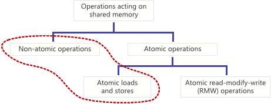

# *Atomic operation*

## Понятие *atomic operation*


Виды операций в shared memory:




*Operation*, действующая в *shared memory*, является **atomic**, если она завершается за один шаг относительно других *thread*'ов. Когда *atomic store* (сохранение) выполняется над *shared variable*, никакой другой *thread* не может наблюдать наполовину завершенную модификацию. Когда *atomic load* выполняется для *shared variable*, считывается целое значение в том виде, в котором оно появилось в определенный момент времени. *Non-atomic load* и *store* не дают таких гарантий.

Существует правило:

> Когда два *thread*'а работают с *shared variable* конкуретно, и одна из этих *operation*'s выполняет *write*, оба *thread*'а должны использовать *atomic operation* (или какую-то синхронизацию).

Если вы нарушите это правило и какой-либо *thread* будет использовать *non-atomic operation*, у вас будет то, что стандарт C++11 называет *data race* (является частью общего понятия *race condition*). Результатом *data race* будет «*undefined behavior*» (неопределенное поведение). Это приводит к *torn read* (прерванное чтение) и *torn write* (прерванная запись).

Операция с памятью может быть *non-atomic*:

- потому что она использует несколько *CPU instruction*'s, 
- даже при использовании одной *CPU instruction*
- потому что вы пишете переносимый код и просто не можете сделать предположение.

## *Non-Atomic* из-за множества *CPU Instruction*'s

Предположим, у вас есть 64-битная *variable*.

```c
uint64_t sharedValue = 0 ;
```

В какой-то момент вы присваиваете этой *variable* – *64-bit value*.

```
void storeValue ()
{
    sharedValue = 0x100000002 ;
}
```

Когда вы компилируете эту функцию под 32-bit x86 с использованием GCC, она генерирует следующий *machine code*.

```
$ cat test.s
        ...
        mov	DWORD PTR sharedValue, 2
        mov	DWORD PTR sharedValue+4, 1
        ret
        ...
```

Как видите,  *compiler* реализовал *64-bit assignment* с помощью двух отдельных *machine instruction*'s. Первая *instruction* устанавливает младшие *32 bit*'s в `0x00000002`, а вторая устанавливает старшие *32 bit*'s в `0x00000001`. Ясно, что эта *assignment operation* – *not atomic*. Если обращаться *concurrently* к `sharedValue` из разных *thread*'s:

- Если *thread*, вызывающий `storeValue()`, вытесняется между двумя *machine instruction*'s, он оставит значение `0x0000000000000002`в памяти - это **torn write**. Если другой *thread* прочитает `sharedValue`, он получит это некорректное значение, которое никто не намеревался хранить.
- Хуже того, если один *thread* вытесняется между двумя *instruction*'s, другой *thread* также модифицирует `sharedValue`, а затем продолжает изменение первый *thread*, это приведет к постоянному *torn write*: старшие 32 bit из одного *thread*, младшие 32 bit из другого.
- На *multicore* устройствах даже нет необходимости вытеснять один из *thread*'ов для *torn write*. Когда *thread* вызывает `storeValue()`, любой *thread*, выполняющийся на другом *core*, может читать `sharedValue` в момент, когда видна только половина изменения.

Конкурентный *read* из `sharedValue` приносит свои проблемы:

```c
uint64_t loadValue()
{
    return sharedValue;
}

$ cat test.s
        ...
        mov	eax, DWORD PTR sharedValue
        mov	edx, DWORD PTR sharedValue+4
        ret
        ...
```

*Compiler* реализовал операцию *read* с использованием двух *machine instruction*'s: первая – *read* младшие 32 *bit* в `eax`, а вторая - старшие 32 *bit* в `edx`. В этом случае, если *concurrent write* переменной `sharedValue` может произойти между двумя *instruction*'s, это приведет к **torn read**.

Эти проблемы не только теоретические. Если провести тестирование[Набор](http://mintomic.github.io/) тестов [Mintomic](http://mintomic.github.io/) включает вызываемый тестовый пример `test_load_store_64_fail`, в котором один *thread* делает *write* для *64-bit variable* с помощью простого *assignment operator*, а другой *thread* выполняет *read* из той же *variable*, сравнивая значения. На *multicore x86*, этот тест, как и ожидалось, постоянно терпит неудачу.

## *Non-Atomic* для одиночной *CPU Instruction*

*Operation* может быть *non-atomic*, даже если выполняется одной *CPU instruction*. Например, *ARMv7 instruction set* включает `strd` *instruction*, которая *store* содержимое двух *32-bit source register*'s в одно *64-bit value* в памяти.

```
strd r0, r1, [r2]
```

На некоторых CPU ARMv7 эта *instruction* – *non-atomic*. Когда CPU видит эту *instruction*, он фактически выполняет *два* отдельных . 

Другой пример – на x86 CPU, 32-bit `mov` *instruction* является *atomic*, если *operand* является *naturally aligned*, и *non-atomic* в противном случае. Другими словами, *atomic* гарантируется только тогда, когда *32-bit integer* находится по адресу, кратному 4. Если запустить тест на C++, который будет размещать `sharedInt` по *unaligned address*'s, то при *concurrently read/write* – тест будет *fail*. 

## Буферизация данных в CPU cache

Синхронизация представляет собой нечто большее, чем просто порядок выполнения нескольких *goroutine*; синхронизация также влияет на *memory*. В современном компьютере могут быть десятки процессоров, каждый из которых имеет собственный локальный *cache* данных из *main memory*. Для повышения эффективности, запись в *memory* буферизуется в пределах каждого процессора (CPU *cache*) и сбрасывается в *main memory* только по необходимости. Записи в *main memory* могут быть выполнены не в таком порядке, в каком они выполнялись записывающими *goroutine*. Такие примитивы синхронизации, как *channel operatation* и *mutex operation*, заставляют процессор выполнить сброс и зафиксировать все накопленные записи, так что результаты выполнения *goroutine* до этой точки гарантированно будут видимыми для *goroutine*'s, работающих на других процессорах (обеспечить *cache coherency*)

## *Go operation* являются *non-atomic by default*

??? В Go каждая *operation* является *non-atomic by default* ??? [Тут написано](https://go101.org/article/unofficial-faq.html#atomical-assignment), что даже простая *assignment operation* является *non-atomic* для стандартного Go компилятора, даже если размер присваиваемого *value* равен *machine word*.

```go
var a int64 = 1
```

Однако, на практике, известно, что для всех современных x86, x64 CPU – *32-bit integer assignment* является *atomic*, если *variable* – *naturally aligned*. Но при написании переносимых программ существует давняя традиция делать вид, будто мы не знаем ничего, кроме того, что нам говорят языковые стандарты. 

И в целом, поведение неопределено и не стоит полагаться ни на какой компилятор или архитектуру, т.к. поведение может отличаться от компилятор или архитектуры. Проще синхронизировать всех *reader*'ов и *writer*'ов. 

# `atomic`

[atomic](https://pkg.go.dev/sync/atomic@go1.17.5)

*Atomic operation* реализованы на *hardware level* (аппаратном уровне).


## Пример

Пример инкрементирования без использования *atomic operation*:

```go
func f(v *int, wg *sync.WaitGroup) {
	for i := 0; i < 3000; i++ {
		*v++
	}
	wg.Done()
}

func main() {
	v := 0
	var wg sync.WaitGroup
	wg.Add(2)
	go f(&v, &wg)
	go f(&v, &wg)
	wg.Wait()

	fmt.Println(v)
}
```

При каждом запуске выводятся разные неправильные результаты:

```bash
~/repos/localhost/go$ go run server.go
5108
~/repos/localhost/go$ go run server.go
4292
~/repos/localhost/go$ go run server.go
6000
~/repos/localhost/go$ go run server.go
3298
```


Тот же пример инкрементирования с использованием *atomic operation*:

```go
func f(v *uint64, wg *sync.WaitGroup) {
	for i := 0; i < 3000; i++ {
		atomic.AddUint64(v, 1)
	}
	wg.Done()
}

func main() {
	var v uint64 = 0
	var wg sync.WaitGroup
	wg.Add(2)
	go f(&v, &wg)
	go f(&v, &wg)
	wg.Wait()

	fmt.Println(v)
}
```


Хороший пример использования https://golangdocs.com/atomic-operations-in-golang-atomic-package

https://habr.com/ru/company/otus/blog/557312/