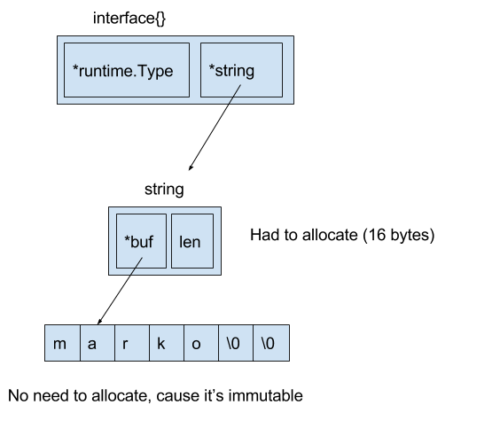
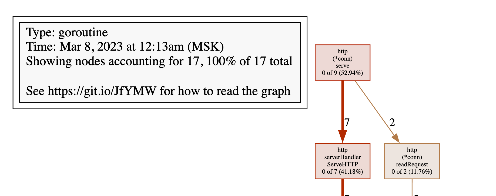
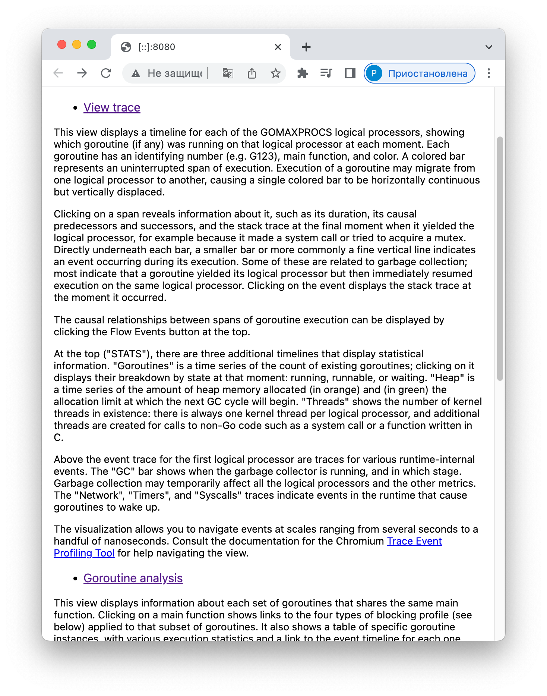
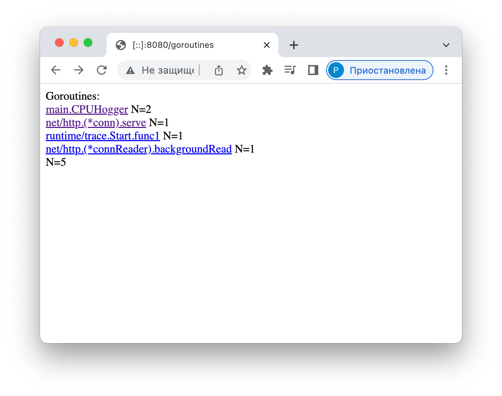
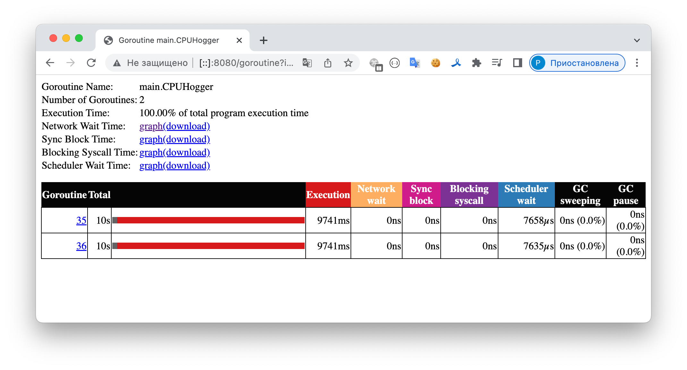
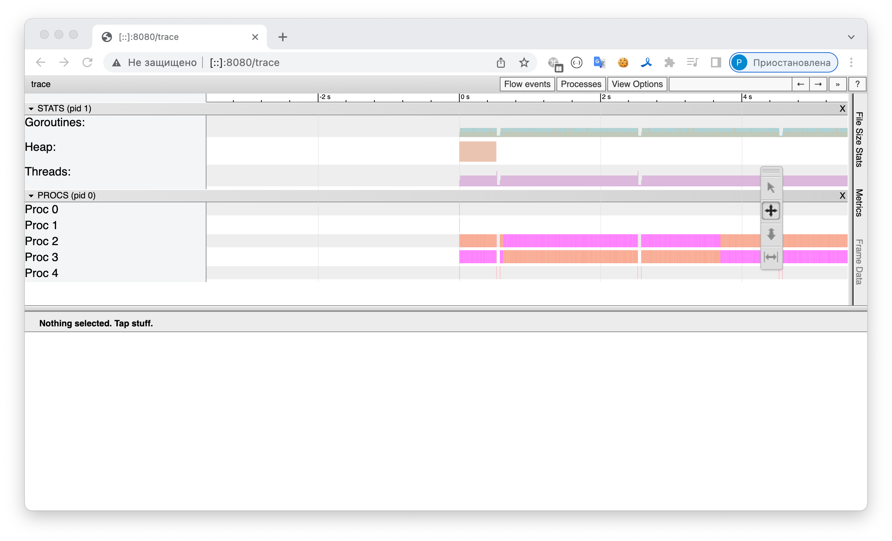

# Profiling

*Profiling* – это инструмент решения проблем, когда программа работает недостаточно быстро, использует слишком много памяти, неоптимально использует процессор.

pprof – инструмент профилирования.

Он позволяет посмотреть:

- память
- цепочки вызовов

## Профилирование процессора

*pprof* – встроенный в Go *profiler*, сделанный по образу и подобию *profiler*'а из набора утилит `gperftools` для C/C++. Написанный на Go аналог утилиты *pprof*, предназначенной для визуализации результатов профилирования, стал теперь основной версией и рекомендуется для визуализации как для Go, так и для C/C++.

### Принцип работы pprof

Современные OS реализуют принцип [preemptive multitasking](../Os.md#preemptive-multitasking).

По такому же принципу работает и *pprof*.

*Profiler* Go является *sampling* (семплирующим).  *Go runtime* просит OS посылать сигнал (*man setitimer*) с определенной периодичностью (по некоторой информации, 10 мс) и назначает на этот сигнал *handler*. *Handler* берет *stack trace* всех *goroutine*'s и другую дополнительную информацию, и записывает ее в буфер.

Рантайм Go останавливает выполнение каждые десять миллисекунд и записывает текущий стек вызовов всех работающих горутин.

А в конце, на основе того, как часто в *stack-trace*'ах встречаются разные функции, мы понимаем, какие из них использовали больше ресурсов процессора, а какие меньше.

Недостатки `pprof`:

- Каждый сигнал — это изменение *context*'а. А это очень дорого. Поэтому на текущий момент реалистично получить не более 500 сигналов в секунду. Стандартное значение в Go сейчас — 100 в секунду. Иногда этого мало.

Преимущества `pprof`:

- *Go runtime* обладает полной информацией о своем внутреннем устройстве. Внешние средства (например *Linux profiler*'ы) по умолчанию ничего не знают о *goroutine*'s. Для них существуют только *proccess*'ы и *thread*'ы.
- Благодаря низким накладным расходам `pprof` может использоваться в продакшне без каких-либо заметных потерь производительности.


*Pprof* можно запускать несколькими способами.

### Пример

Напишем два *benchmark*'а, каждый из которых N раз делает поиск *substring* `auctor` в *string*. Первый *benchmark* использует `regexp` *package*, а второй — `strings` *package*. 

```go
package perftest

import (
	"regexp"
	"strings"
	"testing"
)

var haystack = `Lorem ipsum dolor sit amet, consectetur adipiscing elit. Cras accumsan nisl et iaculis fringilla. Integer sapien orci, facilisis ut venenatis nec, suscipit at massa. Cras suscipit lectus non neque molestie, et imperdiet sem ultricies. Donec sit amet mattis nisi, efficitur posuere enim. Aliquam erat volutpat. Curabitur mattis nunc nisi, eu maximus dui facilisis in. Quisque vel tortor mauris. Praesent tellus sapien, vestibulum nec purus ut, luctus egestas odio. Ut ac ipsum non ipsum elementum pretium in id enim. Aenean eu augue fringilla, molestie orci et, tincidunt ipsum.
Nullam maximus odio vitae augue fermentum laoreet eget scelerisque ligula. Praesent pretium eu lacus in ornare. Maecenas fermentum id sapien non faucibus. Donec est tellus, auctor eu iaculis quis, accumsan vitae ligula. Fusce dolor nisl, pharetra eu facilisis non, hendrerit ac turpis. Pellentesque imperdiet aliquam quam in luctus. Curabitur ut orci sodales, faucibus nunc ac, maximus odio. Vivamus vitae nulla posuere, pellentesque quam posuere`

func BenchmarkSubstring(b *testing.B) {
	for i := 0; i < b.N; i++ {
		strings.Contains(haystack, "auctor")
	}
}

func BenchmarkRegex(b *testing.B) {
	for i := 0; i < b.N; i++ {
		regexp.MatchString("auctor", haystack)
	}
}
```

Запустим *benchmark* и посмотрим на результаты.

```bash
$ go test -bench=.
testing: warning: no tests to run
BenchmarkSubstring-8   	10000000	       194 ns/op
BenchmarkRegex-8       	  200000	      7516 ns/op
PASS
ok  	github.com/mkevac/perftest00	3.789s
```

Как и ожидалось – поиск через `regexp` *package* медленнее.

### Способы *profiling*'а

- параметр `-cpuprofile` для команды `go test`.
- запуск *profiler*'а вручную, используя функции `pprof.StartCPUProfile()` и `pprof.StopCPUProfile()`. Или попроще воспользоваться оберткой от *Dave Cheney* (https://github.com/pkg/profile), которая создаст за вас файл, будет писать в него и т.п.
- с помощью `net/http/pprof` *package*

#### *Profiling* через `-cpuprofile`

Для *profiling*'а запустим тот же самый *benchmark* с *flag*'ом `-cpuprofile cpu.out`:

```bash
$ go test -bench=. -cpuprofile cpu.out
```


При этом на выходе получаем 2 файла:

- *test binary* в `<pkg>.test` (как [описано](Testing.go#запуск-тестов) для флага `-c`). Он необходим для получения символов (?), дизассемблирования и т.д ([подробнее про flag'и](Testing.md#testing-flagи)). *Test binary* создается всегда, но без дополнительных флагов он создается во временной директории и удаляется сразу после выполнения *benchmark*'а. В случае же запуска с *profiling*'ом результирующий *test binary* не удаляется.
- *CPU profile* в файле `cpu.out` – с результатами *profiling*'а. 

Также во время работы *benchmark*'а отключим GC. Для этого установим значение *environment variable* `GOGC=off`. В этом случае *stack trace* для GC не будет мешать изучению *tracing*'а.

Кстати, отключение GC для недолго живущих скриптов и программ – иногда отличное нестандартное решение, которое может уменьшить время работы программы. 

Запустим только бенчмарк *BenchmarkRegex*:

```bash
$ GOGC=off go test -bench=BenchmarkRegex -cpuprofile cpu.out
testing: warning: no tests to run
BenchmarkRegex-8   	  200000	      6773 ns/op
PASS
ok  	github.com/mkevac/perftest00	1.491s
```

Для визуализации графа вызовов, воспользуемся утилитой pprof.

```
$ go tool pprof perftest.test cpu.out
```

Самым простым способом получить граф является команда `web`, которая автоматически сохраняет SVG-картинку во временную директорию и запускает браузер, чтобы ее показать.

```
(pprof) web
```

Возможно потребуется установить graphviz:

```bash
$ brew install graphviz
```

Если вы работаете на удаленном сервере, то этот вариант не пройдет. Варианты:

- прокинуть X-сервер, используя ключ -Y для SSH. В случае OSX, вам нужно будет установить X сервер XQuartz, чтобы прокидывание через SSH сработало.
- сохранить SVG-файл на диск командой `go tool pprof -svg ./perftest00.test ./cpu.out > cpu.svg`, скопировать его к себе на компьютер и там открыть.

После выполнения команды `web` получаем граф вызовов:


Изучая такой граф, в первую очередь нужно обращать внимание на толщину ребер (стрелочек) и на размер узлов графа (квадратиков). На ребрах подписано время: сколько времени данный узел или любой из ниже лежащих узлов находился в *stack-trace* во время *profiling*'а.

Пойдем по жирным стрелочкам с самого первого (верхнего) узла и дойдем до первой развилки.


Здесь показана основная функция `BenchmarkRegex()`. Внутри нее вызывается функция `regexp.MatchString()` (которая в коде на Go находится внутри цикла). 

Функция `regexp.MatchString()` включает в себя вызов двух функций:

- `regexp.Compile()`
- `regexp.(*Regexp).MatchString()`

Операции с регулярными выражения в чистом виде состоят из двух этапов:

- этап компиляции изначального строкового представления регулярного выражения в какой-то промежуточный вариант
- использование этого промежуточного варианта.

Напрашивается тривиальная оптимизация: делать компиляцию единожды, а не многократно.

Сделаем это:

```go
var pattern = regexp.MustCompile("auctor")

func BenchmarkRegex(b *testing.B) {
	for i := 0; i < b.N; i++ {
		pattern.MatchString(haystack)
	}
}
```

Запускаем *benchmark*:

```go
~/repos/localhost/go/perftest$ go test -bench=.
goos: darwin
goarch: amd64
pkg: paparshikov/perftest
cpu: Intel(R) Core(TM) i7-9750H CPU @ 2.60GHz
BenchmarkSubstring-12            2855308               405.0 ns/op
BenchmarkRegex-12                2433339               490.7 ns/op
PASS
ok      paparshikov/perftest    3.618s
```

*Performance* `BenchmarkRegex` ускорился на порядок и вплотную приблизился к `BenchmarkSubstring`.

Посмотрим на граф вызовов:


Из графа вызовов пропала ветка с `regexp.Compile()`. Компиляция выполняет один раз до запуска *benchmark*'а и не попала в граф (наверно, т.к. `regexp.Compile()` теперь не входит в состав `BenchmarkRegex` и время компиляции значительно ниже чем многократный запуск бенчмарка).

#### Profiling через функции

Можно запускать профайлер вручную, используя функции из пакета  [`runtime/pprof`](https://golang.org/pkg/runtime/pprof/) – `pprof.StartCPUProfile()` и `pprof.StopCPUProfile()`. Они предоставляют низкоуровневый API для профилирования. Немного проще воспользоваться удобной оберткой над этими функциями от Дейва Чейни (англ. *Dave Cheney*) (https://github.com/pkg/profile), которая создаст за вас файл, будет писать в него и т.п.

#### С помощью `net/http/pprof` *package*

Всё, что вам нужно для подключения профайлера, – импортировать `net/http/pprof` *package*. Он автоматически добавит *HTTP handler* для URL */debug/pprof*, и вы сможете профилировать работающую программу удаленно, используя тот же самый `go tool pprof`.

##### Пример 1

```go
package main

import (
	"net/http"
	_ "net/http/pprof"
)

func cpuhogger() {
	var acc uint64
	for {
		acc += 1
		if acc&1 == 0 {
			acc <<= 1
		}
	}
}

func main() {
	go http.ListenAndServe("0.0.0.0:8080", nil)
	cpuhogger()
}
```

В примере:

- импортировали `net/http/pprof`
- запустили *HTTP server* командой `http.ListenAndServe()`
- не создавали никаких *handler*'ов (через функции вроде `http.Handle()`)

Этого достаточно, чтобы использовать *profiler* во время работы программы.

*Profiler* необходимо запускать следующим образом:

```bash
$ go tool pprof http://localhost:8080/debug/pprof/profile?seconds=5
Fetching profile over HTTP from http://localhost:8080/debug/pprof/profile?seconds=5
Saved profile in /Users/paparshikov/pprof/pprof.samples.cpu.001.pb.gz
Type: cpu
Time: Dec 17, 2022 at 2:22am (MSK)
Duration: 5.12s, Total samples = 4.43s (86.55%)
Entering interactive mode (type "help" for commands, "o" for options)
(pprof) 
```

Мы просто передаем утилите `pprof` путь к *handler*'у, по которому «слушает» *profiler*. Дополнительно можно передать время работы *profiler*'а (по умолчанию 30 секунд).

Примеры работы команд:

- `web`
- `top`
- `list`

Подробнее в [Поддерживаемые команды](#поддерживаемые-команды)

```
(pprof) web
(pprof) top
4.99s of 4.99s total (  100%)
      flat  flat%   sum%        cum   cum%
     4.99s   100%   100%      4.99s   100%  main.cpuhogger
         0     0%   100%      4.99s   100%  runtime.goexit
         0     0%   100%      4.99s   100%  runtime.main
(pprof) list cpuhogger
Total: 4.97s
ROUTINE ======================== main.cpuhogger in /home/marko/goprojects/src/github.com/mkevac/pproftest/main.go
     4.97s      4.97s (flat, cum)   100% of Total
         .          .      6:)
         .          .      7:
         .          .      8:func cpuhogger() {
         .          .      9:	var acc uint64
         .          .     10:	for {
     2.29s      2.29s     11:		acc += 1
     1.14s      1.14s     12:		if acc&1 == 0 {
     1.54s      1.54s     13:			acc <<= 1
         .          .     14:		}
         .          .     15:	}
         .          .     16:}
         .          .     17:
         .          .     18:func main() {         
```

##### Пример 2

Предположим, вы разрабатываете совершенно новый микросервис, который принимает строку `str` и дополняет ее с левого края символами `chr` до заданной длины `len`. Пример обращения к микросервису:

```bash
$ curl "http://127.0.0.1:8080/v1/leftpad/?str=test&len=10&chr=*"
{"str":"******test"}
```

Сервис должен собирать статистику: 

- количество входящих запросов 
- продолжительность каждого запроса. 

Предполагается, что все собранные данные отправляются в агрегатор метрик (например, [StatsD](https://github.com/etsy/statsd)). Кроме того, сервису необходимо логировать параметры запроса: 

- URL, 
- IP-адрес
- User Agent.

###### Код сервиса

```go
// main.go
var statsd = &StatsD{
	Namespace:  "leftpad", // пространство имен для метрик, префикс
	SampleRate: 0.5,       // значение семплирования (для 0.5, данные будут отправляться каждый 2-й раз)
}

func init() {
	var f, err = ioutil.TempFile("", "leftpad.log")
	if err != nil {
		panic(err)
	}
	log.SetOutput(f)
}

func main() {
	http.HandleFunc("/v1/leftpad/", timedHandler("leftpad", leftpadHandler))
	log.Fatal(http.ListenAndServe(":8080", nil))
}
```


```go
//statsd.go
type StatsD struct {
	Namespace  string
	SampleRate float64
}

// Отправляет данные в socket (statsd)
func (s *StatsD) Send(stat string, kind string, delta float64) {
	buf := fmt.Sprintf("%s.", s.Namespace)
	trimmedStat := strings.NewReplacer(":", "_", "|", "_", "@", "_").Replace(stat) // Заменяет служебные символы (:|@) на _
	buf += fmt.Sprintf("%s:%f|%s", trimmedStat, delta, kind)                       // Пишет метрику в формате statsd <metricname>:<value>|<type>
	// Если указано значение семплирования <1 (например, при SampleRate = 0.5, данные будут отправляться каждый 2-й раз)
	// это значение подставляется к метрике в формате |@<sampleRate>
	if s.SampleRate != 0 && s.SampleRate < 1 {
		buf += fmt.Sprintf("|@%s", strconv.FormatFloat(s.SampleRate, 'f', -1, 64))
	}
	ioutil.Discard.Write([]byte(buf)) // Пока данные просто отбрасывает, позже необходимо писать в socket
}

// Разные типы метрик в соответствии с документацией https://github.com/statsd/statsd/blob/master/docs/metric_types.md
// с - simple counter
func (s *StatsD) Incr(stat string) {
	s.Send(stat, "c", 1)
}

// h - ?
func (s *StatsD) Histogram(stat string, value float64) {
	s.Send(stat, "h", value)
}

// ms - метрика времени (сколько что-то заняло времени)
func (s *StatsD) Timing(stat string, value time.Duration) {
	s.Send(stat, "ms", value.Seconds()*1000)
}
```


```go
// leftpad.go

// Функция, которая дополняет строку s до длины len с левого края символом char
func leftpad(s string, length int, char rune) string {
	for len(s) < length {
		s = string(char) + s
	}
	return s
}
```


```go
// handler.go

type leftpadResponse struct {
	Str string `json:"str"`
}

// Обертка для handler'а, которая считает время вызова и пишет его в лог и statsd
func timedHandler(name string, nextFunc http.HandlerFunc) http.HandlerFunc {
	return func(w http.ResponseWriter, r *http.Request) {
		start := time.Now()
		nextFunc(w, r)
		elapsed := time.Since(start)
		statsd.Timing(fmt.Sprintf("request.%s.timing", name), elapsed)
		statsd.Incr(fmt.Sprintf("request.%s.count", name))
		log.Printf("%s request took %v", name, elapsed)
	}
}

// handler
func leftpadHandler(w http.ResponseWriter, r *http.Request) {
	log.Printf("url %s\tip %s\tua %s", r.RequestURI, r.RemoteAddr, r.UserAgent())

	// вычитываем входные данные
	str := r.FormValue("str")
	length, err := strconv.Atoi(r.FormValue("len"))
	if err != nil {
		http.Error(w, err.Error(), http.StatusBadRequest)
		return
	}
	statsd.Histogram("request.str.len", float64(length))

	// по умолчанию chr = ' '
	chr := ' '
	if len(r.FormValue("chr")) > 0 {
		chr = []rune(r.FormValue("chr"))[0]
	}

	// пишем в response – header и тело
	w.Header().Set("Content-Type", "application/json; charset=utf-8")
	resp := leftpadResponse{Str: leftpad(str, length, chr)}
	enc := json.NewEncoder(w)
	if err := enc.Encode(resp); err != nil {
		http.Error(w, err.Error(), http.StatusInternalServerError)
		return
	}
}
```


```go
// main.go

package main

import (
	"io/ioutil"
	"log"
	"net/http"
	_ "net/http/pprof"  // Подключаем профайлер
)

var statsd = &StatsD{
	Namespace:  "leftpad", // пространство имен для метрик, префикс
	SampleRate: 0.5,       // значение семплирования (для 0.5, данные будут отправляться каждый 2-й раз)
}

func init() {
	var f, err = ioutil.TempFile("", "leftpad.log")
	if err != nil {
		panic(err)
	}
	log.SetOutput(f)
}

func main() {
	http.HandleFunc("/v1/leftpad/", timedHandler("leftpad", leftpadHandler))
	log.Fatal(http.ListenAndServe(":8080", nil))
}

```


Т.к. `package main` разбит на несколько файлов для запуска необходимо выполнить команды ([подробнее](https://stackoverflow.com/questions/28081486/how-can-i-go-run-a-project-with-multiple-files-in-the-main-package)):

```bash
$ go build
$ ./goprofex
```

Проверяем работу приложения:

```bash
$ curl -v "http://127.0.0.1:8080/v1/leftpad/?str=test&len=10&chr=*"
< HTTP/1.1 200 OK
< Content-Type: application/json; charset=utf-8
< Date: Sun, 26 Feb 2023 22:43:02 GMT
< Content-Length: 21
< 
{"str":"******test"}
```

```bash
$ curl -v "http://127.0.0.1:8080/v1/leftpad/?str=test&len=a&chr=*"
< HTTP/1.1 400 Bad Request
< Content-Type: text/plain; charset=utf-8
< X-Content-Type-Options: nosniff
< Date: Sun, 26 Feb 2023 22:42:24 GMT
< Content-Length: 42
< 
strconv.Atoi: parsing "a": invalid syntax
```


###### *Profiling* сервиса

Для *profiling*'а сервиса необходимо его нагрузить. 

Для этого вначале запускаем утилиту `ab` с большим количеством запросов (например, `10000000`):

```bash
ab -k -c 8 -n 10000000 "http://127.0.0.1:8080/v1/leftpad/?str=test&len=50&chr=*"
```

**Profiling CPU**

Одновременно запускаем `pprof`:

```bash
go tool pprof goprofex http://127.0.0.1:8080/debug/pprof/profile
```

(`goprofex` - это *binary*)

Далее аналогично [Пример 1](#пример-1)

Видим, что большую часть процессорного времени приложение затрачивает на ведение лога (`log.Printf()`) и сбор метрик (`statsD.Send()`).


Посмотрим на выполнение функции `leftpad()`:

```
ROUTINE ======================== main.leftpad in /Users/paparshikov/repos/localhost/goprofex/leftpad.go
      10ms      160ms (flat, cum)  0.16% of Total
         .          .      1:package main
         .          .      2:
         .          .      3:// Функция, которая дополняет строку s до длины len с левого края символом char
         .          .      4:func leftpad(s string, length int, char rune) string {
      10ms       10ms      5:   for len(s) < length {
         .      150ms      6:           s = string(char) + s
         .          .      7:   }
         .          .      8:   return s
         .          .      9:}
```

В виде ассемблера:

```
(pprof) disasm leftpad
Total: 98.69s
ROUTINE ======================== main.leftpadHandler
      10ms     13.75s (flat, cum) 13.93% of Total
         .          .    1279200: LEAQ 0xfffffed0(SP), R12                ;handlers.go:29
```

**Profiling memory**

Количество байт, аллоцированных в настоящий момент (но еще не освобожденных) ([подробнее флаги дальше](#пример-1)):

```bash
$ go tool pprof goprofex http://127.0.0.1:8080/debug/pprof/heap
File: goprofex
Type: inuse_space
(pprof) top
Showing nodes accounting for 4099.59kB, 100% of 4099.59kB total
Showing top 10 nodes out of 28
      flat  flat%   sum%        cum   cum%
 3075.38kB 75.02% 75.02%  3075.38kB 75.02%  runtime.allocm
  512.20kB 12.49% 87.51%   512.20kB 12.49%  runtime.malg
  512.01kB 12.49%   100%   512.01kB 12.49%  main.leftpad (inline)
         0     0%   100%   512.01kB 12.49%  main.leftpadHandler
         0     0%   100%   512.01kB 12.49%  main.timedHandler.func1
         0     0%   100%   512.01kB 12.49%  net/http.(*ServeMux).ServeHTTP
         0     0%   100%   512.01kB 12.49%  net/http.(*conn).serve
         0     0%   100%   512.01kB 12.49%  net/http.HandlerFunc.ServeHTTP
         0     0%   100%   512.01kB 12.49%  net/http.serverHandler.ServeHTTP
         0     0%   100%   512.56kB 12.50%  runtime.gopreempt_m
```

Количество объектов, аллоцированных за все время работы программы:

```bash
$ go tool pprof -alloc_objects goprofex http://127.0.0.1:8080/debug/pprof/heap
File: goprofex
Type: alloc_objects
(pprof) top
Showing nodes accounting for 21654853, 84.24% of 25704806 total
Dropped 59 nodes (cum <= 128524)
Showing top 10 nodes out of 46
      flat  flat%   sum%        cum   cum%
   8907722 34.65% 34.65%    8907722 34.65%  main.leftpad (inline)
   4495364 17.49% 52.14%    8556181 33.29%  main.(*StatsD).Send
   1941025  7.55% 59.69%    2170745  8.44%  fmt.Sprintf
   1310819  5.10% 64.79%    1310819  5.10%  strings.NewReplacer (inline)
    983053  3.82% 68.62%   15470647 60.19%  main.leftpadHandler
    971412  3.78% 72.40%     971412  3.78%  net/textproto.(*Reader).ReadMIMEHeader
    917521  3.57% 75.97%     917521  3.57%  strconv.FormatFloat
    776087  3.02% 78.99%     776087  3.02%  net/url.parseQuery
    688137  2.68% 81.66%   22388306 87.10%  main.timedHandler.func1
    663713  2.58% 84.24%     663713  2.58%  strings.(*Replacer).build
```


## Измерение *performance*

С помощью pprof мы можем найти узкое место. Для оценки его *performance* Но прежде чем приступать к оптимизации, необходимо разработать воспроизводимый способ измерения производительности интересующего нас кода.

### Утилита `ab`

Также смотреть [эталонное тестирование для MySQL](../Mysql.md#эталонное-тестирование)

Для измерения *performance* сервиса необходимо определить, сколько запросов в секунду он может обслуживать. Для измерения можно использовать утилиту ab – [Apache benchmarking tool](https://httpd.apache.org/docs/2.4/programs/ab.html) (идет в поставке с MacOS). ab обращается к одному URL адресу настолько быстро, насколько это возможно.

Пример измерения *performance*:

```bash
ab -k -c 8 -n 100000 "http://127.0.0.1:8080/v1/leftpad/?str=test&len=50&chr=*"
# -k   Включить постоянное HTTP-соединение (KeepAlive)
# -c   Количество одновременных запросов
# -n   Общее количество запросов, которое будет делать ab
```

Вывод:

```go
Server Software:        
Server Hostname:        127.0.0.1
Server Port:            8080

Document Path:          /v1/leftpad/?str=test&len=50&chr=*
Document Length:        61 bytes

Concurrency Level:      8
Time taken for tests:   4.783 seconds
Complete requests:      100000
Failed requests:        0
Keep-Alive requests:    100000
Total transferred:      20800000 bytes
HTML transferred:       6100000 bytes
Requests per second:    20909.55 [#/sec] (mean)
Time per request:       0.383 [ms] (mean)
Time per request:       0.048 [ms] (mean, across all concurrent requests)
Transfer rate:          4247.25 [Kbytes/sec] received

Connection Times (ms)
              min  mean[+/-sd] median   max
Connect:        0    0   0.0      0       0
Processing:     0    0   0.6      0      38
Waiting:        0    0   0.6      0      38
Total:          0    0   0.6      0      38

Percentage of the requests served within a certain time (ms)
  50%      0
  66%      0
  75%      0
  80%      1
  90%      1
  95%      1
  98%      1
  99%      1
 100%     38 (longest request)
```

### *Benchmark*

Утилита `ab` оценивает *performance* извне, выполняя запросы к *endpoint*'ам. Для оценки *performance* кода необходимо написать *benchmark* с помощью `testing` *package*. Для этого, как указано в [документации](Testing.md#benchmark), нужно создать функцию вида `func BenchmarkXxx(*testing.B`), которая запускает целевой код `b.N` раз (на [примере 2](#пример-2)):

```go
func BenchmarkStatsD(b *testing.B) {
    statsd := StatsD{
        Namespace:  "namespace",
        SampleRate: 0.5,
    }
    for i := 0; i < b.N; i++ {
        statsd.Incr("test")
    }
}
```

Чтобы создать *benchmark* для целиком *http handler*'а – необходимо использовать  [`net/http/httptest`](https://golang.org/pkg/net/http/httptest/) *package*:

- создать через `httptest.NewRequest()` – `http.Request`, который подходит для передачи в `http.Handler.ServeHTTP()` и `http.HandleFunc()`
- создать `httptest.ResponseRecorder` - который реализует `interface http.ResponseWriter` и записывает свои мутации для последующей проверки в тестах.

```go
func BenchmarkLeftpadHandler(b *testing.B) {
    r := httptest.NewRequest("GET", "/v1/leftpad/?str=test&len=50&chr=*", nil)
    for i := 0; i < b.N; i++ {
        w := httptest.NewRecorder()
        leftpadHandler(w, r)
    }
}
```

Еще примеры *benchmark*'ов для [Пример 2](#пример-2):

```go
func BenchmarkTimedHandler(b *testing.B) {
	r := httptest.NewRequest("GET", "/test", nil)
	h := timedHandler("test", func(w http.ResponseWriter, r *http.Request) {})
	for i := 0; i < b.N; i++ {
		w := httptest.NewRecorder()
		h(w, r)
	}
}
```

```go
func benchmarkLeftpad(b *testing.B, n int) {
	for i := 0; i < b.N; i++ {
		leftpad("test", n, '*')
	}
}

func BenchmarkLeftpad10(b *testing.B) {
	benchmarkLeftpad(b, 10)
}

func BenchmarkLeftpad50(b *testing.B) {
	benchmarkLeftpad(b, 50)
}
```

Запускаем бенчмарк:

```bash
$ go test -bench=. -benchmem
goos: darwin
goarch: amd64
pkg: goprofex
cpu: Intel(R) Core(TM) i7-9750H CPU @ 2.60GHz
(Название benchmark'а)     (количество итераций) (времени на итерацию) (объем allocation/op)  (allocation/op)
BenchmarkTimedHandler-12          144346              7003 ns/op            1696 B/op         42 allocs/op
BenchmarkLeftpadHandler-12        138723              8741 ns/op            3331 B/op         75 allocs/op
BenchmarkLeftpad10-12            6456182               184.3 ns/op            64 B/op          6 allocs/op
BenchmarkLeftpad50-12             675195              1737 ns/op            1504 B/op         46 allocs/op
BenchmarkStatsD-12               1000000              1011 ns/op             648 B/op         16 allocs/op
```

#### benchstat

https://pkg.go.dev/golang.org/x/perf/cmd/benchstat

`benchstat` вычисляет статистические оценки и A/B-сравнение для *Go benchmark*'ов. (мое. Здесь под A/B сравнением понимается – сравнение параметров *Go benchmark*'ов, путем многократных запусков одного и другого, возможно какого-то параллельного запуска, чтобы сделать сравнение статически достоверным и не зависящим от других параметров оборудования: нагрузки на CPU, память, запущенных приложений).

Использование:

```bash
benchstat [flags] inputs...
```

Каждый *input file* должен быть в формате *Go benchmark*, т.е. получен как *output* для `go test -bench `. Как правило, должно быть два (или более) *input file*'s для измерения до и после некоторого изменения (или серии изменений). Каждый *benchmark* следует запускать не менее 10 раз, чтобы собрать статистически значимую выборку результатов. Для каждого *benchmark*'а, `benchstat` вычисляет медиану и доверительный интервал для медианы. По умолчанию, если есть два или более *input file*'s, он сравнивает каждый *benchmark* в первом *file* с тем же *benchmark*'ом в каждом последующем *file* и сообщает, была ли статистически значимая разница, хотя его можно настроить для сравнения по другим параметрам.

**Пример**

Предположим, мы собираем результаты 10-кратного запуска набора *benchmark*'ов ДО изменения:

```
go test -run='^$' -bench=. -count=10 > old.txt
```

И 10-кратного запуска того же набора *benchmark*'ов ПОСЛЕ изменений:

```
go test -run='^$' -bench=. -count=10 > new.txt
```

Файл `old.txt` содержит:

```
goos: linux
goarch: amd64
pkg: golang.org/x/perf/cmd/benchstat/testdata
BenchmarkEncode/format=json-48         	  690848	      1726 ns/op
BenchmarkEncode/format=json-48         	  684861	      1723 ns/op
BenchmarkEncode/format=json-48         	  693285	      1707 ns/op
BenchmarkEncode/format=json-48         	  677692	      1707 ns/op
BenchmarkEncode/format=json-48         	  692130	      1713 ns/op
BenchmarkEncode/format=json-48         	  684164	      1729 ns/op
BenchmarkEncode/format=json-48         	  682500	      1736 ns/op
BenchmarkEncode/format=json-48         	  677509	      1707 ns/op
BenchmarkEncode/format=json-48         	  687295	      1705 ns/op
BenchmarkEncode/format=json-48         	  695533	      1774 ns/op
BenchmarkEncode/format=gob-48          	  372699	      3069 ns/op
BenchmarkEncode/format=gob-48          	  394740	      3075 ns/op
BenchmarkEncode/format=gob-48          	  391335	      3069 ns/op
BenchmarkEncode/format=gob-48          	  383588	      3067 ns/op
BenchmarkEncode/format=gob-48          	  385885	      3207 ns/op
BenchmarkEncode/format=gob-48          	  389970	      3064 ns/op
BenchmarkEncode/format=gob-48          	  393361	      3064 ns/op
BenchmarkEncode/format=gob-48          	  393882	      3058 ns/op
BenchmarkEncode/format=gob-48          	  396171	      3059 ns/op
BenchmarkEncode/format=gob-48          	  397812	      3062 ns/op
```

Файл `new.txt` содержит:

```
goos: linux
goarch: amd64
pkg: golang.org/x/perf/cmd/benchstat/testdata
BenchmarkEncode/format=json-48         	  714387	      1423 ns/op
BenchmarkEncode/format=json-48         	  845445	      1416 ns/op
BenchmarkEncode/format=json-48         	  815714	      1411 ns/op
BenchmarkEncode/format=json-48         	  828824	      1413 ns/op
BenchmarkEncode/format=json-48         	  834070	      1412 ns/op
BenchmarkEncode/format=json-48         	  828123	      1426 ns/op
BenchmarkEncode/format=json-48         	  834493	      1422 ns/op
BenchmarkEncode/format=json-48         	  838406	      1424 ns/op
BenchmarkEncode/format=json-48         	  836227	      1447 ns/op
BenchmarkEncode/format=json-48         	  830835	      1425 ns/op
BenchmarkEncode/format=gob-48          	  394441	      3075 ns/op
BenchmarkEncode/format=gob-48          	  393207	      3065 ns/op
BenchmarkEncode/format=gob-48          	  392374	      3059 ns/op
BenchmarkEncode/format=gob-48          	  396037	      3065 ns/op
BenchmarkEncode/format=gob-48          	  393255	      3060 ns/op
BenchmarkEncode/format=gob-48          	  382629	      3081 ns/op
BenchmarkEncode/format=gob-48          	  389558	      3186 ns/op
BenchmarkEncode/format=gob-48          	  392668	      3135 ns/op
BenchmarkEncode/format=gob-48          	  392313	      3087 ns/op
BenchmarkEncode/format=gob-48          	  394274	      3062 ns/op
```

Порядок строк в файле не имеет значения, за исключением того, что в выходных данных *benchmark*'и перечислены в порядке их появления.

Если мы запустим `benchstat old.txt new.txt`, он соберет результаты *benchmark*'ов и сравнит результаты ДО и ПОСЛЕ:

```bash
$ benchstat old.txt new.txt
goos: linux
goarch: amd64
pkg: golang.org/x/perf/cmd/benchstat/testdata
                      │   old.txt   │               new.txt               │
                      │   sec/op    │   sec/op     vs base                │
Encode/format=json-48   1.718µ ± 1%   1.423µ ± 1%  -17.20% (p=0.000 n=10)
Encode/format=gob-48    3.066µ ± 0%   3.070µ ± 2%        ~ (p=0.446 n=10)
geomean                 2.295µ        2.090µ        -8.94%
```

В таблице сравниваются два *input file*'s для каждого *benchmark*'а. Он показывает результаты по медиане и 95% доверительному интервалу для каждого *benchmark*'а ДО и ПОСЛЕ изменения, а также A/B сравнение под `vs base`. Сравнение показывает, что `Encode/format=json` работает на `17,20%` быстрее при `p=0,000` и 10 выборках из каждого *input file*. Значение `р` измеряет вероятность того, что любые различия были вызваны случайностью (т. е. шумом). В данном случае, крайне маловероятно, что разница между медианами была случайной. Для `Encode/format=gob` результат сравнения `~` означает, что `benchstat` не обнаружил статистически значимой разницы между двумя *input*'ами. В данном случае, `p=0.446`, что означает, что очень вероятно, что различия для этого *benchmark*'а случайны.

Обратите внимание, что «статистически значимые изменения» — это не то же самое, что «большие изменения»: при достаточном количестве данных с низким уровнем шума даже очень небольшие изменения можно отличить от шума и считать статистически значимыми. Конечно, обычно легче отличить большие изменения от шума.

Наконец, в последней строке таблицы показано среднее геометрическое (*geometric mean*) для каждого столбца, что дает общую картину того, как изменились *benchmark*'и. Пропорциональные изменения в среднем геометрическом отражают пропорциональные изменения в benchmark'ах. Например, если дано n *benchmark*'ов, если `sec/op` для одного из них увеличится в 2 раза, то среднее геометрическое `sec/op` увеличится в ⁿ√2 раз.


## *Memory profiling*

В Go runtime встроен учет использования памяти - т.е. он предназначения для *profiling*'а *heap*. Go умеет собирать информацию о выделениях памяти с определенной периодичностью. Эту периодичность можно задавать вручную, но по умолчанию она составляет 1 раз на 512 килобайт выделенной памяти.

*Memory profiling* можно запускать теми же способами, что и *processor profiling*:

- через `go test` с флагом `-memprofile` (пример 2)
- через прямые вызовы `runtime.MemProfile()`
- с помощью `net/http/pprof` (пример 1)

### Пример 1 (`net/http/pprof`)

Рассмотрим на примере варианта с `net/http/pprof`.

В программе 2 *goroutine*'s:

- одна – выделяет массивы `[]byte` и сохраняет их в массиве `var b [][]byte`. Т.е. она вызывает постоянный рост потребления памяти.
- другая – делает то же самое, но периодически присваивает `b = nil`. Т.е. она постоянно генерирует мусор для сборщика, но рост не вызывает.

```go
package main

import (
	"net/http"
	_ "net/http/pprof"
	"time"
)

func allocAndKeep() {
	var b [][]byte
	for {
		b = append(b, make([]byte, 1024))
		time.Sleep(time.Millisecond)
	}
}

func allocAndLeave() {
	var b [][]byte
	for {
		b = append(b, make([]byte, 1024))
		if len(b) == 20 {
			b = nil
		}
		time.Sleep(time.Millisecond)
	}
}

func main() {
	go allocAndKeep()
	go allocAndLeave()
	http.ListenAndServe("0.0.0.0:8080", nil)
}
```

Для *memory proifiling*'а необходимо использовать *endpoint*:

```bash
go tool pprof goprofex http://127.0.0.1:8080/debug/pprof/heap
```

Для *memory profiling* в `go tool pprof` используются параметры:

- `inuse_space` — количество байт, аллоцированных в настоящий момент (но еще не освобожденных), применяется по умолчанию;

- `inuse_objects` — количество объектов, аллоцированных в настоящий момент (но еще не освобожденных).

- `alloc_space` — количество байт, аллоцированных за все время работы программы;

- `alloc_objects` — количество объектов, аллоцированных за все время работы программы;

  

Как и ожидаемо, `inuse_space` показывает только функцию `allocAndKeep()`:

```bash
$ go tool pprof -inuse_space http://localhost:8080/debug/pprof/heap
Fetching profile over HTTP from http://localhost:8080/debug/pprof/heap
Saved profile in /Users/paparshikov/pprof/pprof.alloc_objects.alloc_space.inuse_objects.inuse_space.005.pb.gz
Type: inuse_space
Time: Dec 30, 2022 at 1:26am (MSK)
Entering interactive mode (type "help" for commands, "o" for options)
(pprof) top
Showing nodes accounting for 7687.39kB, 100% of 7687.39kB total
Showing top 10 nodes out of 16
      flat  flat%   sum%        cum   cum%
 5637.50kB 73.33% 73.33%  5637.50kB 73.33%  main.allocAndKeep
 1537.69kB 20.00% 93.34%  1537.69kB 20.00%  runtime.allocm
  512.20kB  6.66%   100%   512.20kB  6.66%  runtime.malg
         0     0%   100%  1025.12kB 13.34%  runtime.mcall
         0     0%   100%   512.56kB  6.67%  runtime.mstart
         0     0%   100%   512.56kB  6.67%  runtime.mstart0
         0     0%   100%   512.56kB  6.67%  runtime.mstart1
         0     0%   100%  1537.69kB 20.00%  runtime.newm
         0     0%   100%   512.20kB  6.66%  runtime.newproc.func1
         0     0%   100%   512.20kB  6.66%  runtime.newproc1
```

А параметр `alloc_space` показывает обе функции (`allocAndKeep()` и `allocAndLeave()`):

```go
$ go tool pprof -alloc_space http://localhost:8080/debug/pprof/heap
Fetching profile over HTTP from http://localhost:8080/debug/pprof/heap
Saved profile in /Users/paparshikov/pprof/pprof.alloc_objects.alloc_space.inuse_objects.inuse_space.006.pb.gz
Type: alloc_space
Time: Dec 30, 2022 at 1:47am (MSK)
Entering interactive mode (type "help" for commands, "o" for options)
(pprof) top
Showing nodes accounting for 27990.80kB, 100% of 27990.80kB total
Showing top 10 nodes out of 17
      flat  flat%   sum%        cum   cum%
15691.27kB 56.06% 56.06% 15691.27kB 56.06%  main.allocAndKeep
   10250kB 36.62% 92.68%    10250kB 36.62%  main.allocAndLeave
 1025.12kB  3.66% 96.34%  1025.12kB  3.66%  runtime.allocm
 1024.41kB  3.66%   100%  1024.41kB  3.66%  runtime.malg
         0     0%   100%   512.56kB  1.83%  runtime.mcall
         0     0%   100%   512.56kB  1.83%  runtime.mstart
         0     0%   100%   512.56kB  1.83%  runtime.mstart0
         0     0%   100%   512.56kB  1.83%  runtime.mstart1
         0     0%   100%  1025.12kB  3.66%  runtime.newm
         0     0%   100%  1024.41kB  3.66%  runtime.newproc.func1
```

### Пример 2 (неочевидный *memory allocation*)

```go
package main

import (
	"bytes"
	"fmt"
	"testing"
)

func BenchmarkPrint(b *testing.B) {
	var buf bytes.Buffer
	var s string = "test string"
	for i := 0; i < b.N; i++ {
		buf.Reset()
		fmt.Fprintf(&buf, "string is: %s", s)
	}
}
```

В примере, *benchmark*, в теле которого очищается буфер и заполняется с помощью функции `fmt.Fprintf()`.

Запустим *benchmark* и добавим флаг `-benchmem` для вывода количества *memory allocation* на одну *operation*.

```bash
$ go test -bench=. -benchmem
goos: darwin
goarch: amd64
pkg: paparshikov
cpu: Intel(R) Core(TM) i7-9750H CPU @ 2.60GHz
BenchmarkPrint-12       12368281 (количество итераций)          81.76 ns/op           16 B/op          1 allocs/op
PASS
ok      paparshikov     1.868s
```

Итак, в теле *benchmark*'а выполняется 1 *memory allocation* на *operation* размером в 16 байт.

Выведем *allocation profile* в файл с помощью флага `-memprofile`. 

```bash
$ go test -bench=. -memprofile=mem.out
```

При этом на выходе получаем 2 файла:

- *test binary* в `<pkg>.test` (как [описано](Testing.go#запуск-тестов) для флага `-c`)
- *allocation profile* в файле `mem.out`

Запустим `pprof` с флагом `-alloc_space` (количество байт, аллоцированных за все время работы программы):

```bash
$ go tool pprof -alloc_space paparshikov.test mem.out
...
(pprof)
```

и запустим команду `top`:

```
(pprof) top
...
      flat  flat%   sum%        cum   cum%
     231MB 98.30% 98.30%   232.51MB 98.94%  paparshikov.BenchmarkPrint
       2MB  0.85% 99.15%        2MB  0.85%  runtime.allocm
         0     0% 99.15%     1.50MB  0.64%  fmt.Fprintf
```

Функция `BenchmarkPrint()` выделила 232МБ памяти.

Посмотрим строки кода, в которых был *memory allocation*:

```
(pprof) list BenchmarkPrint
Total: 235.01MB
ROUTINE ======================== paparshikov.BenchmarkPrint in /Users/paparshikov/repos/localhost/go/server_test.go
     231MB   232.51MB (flat, cum) 98.94% of Total
         .          .      9:func BenchmarkPrint(b *testing.B) {
         .          .     10:   var buf bytes.Buffer
         .          .     11:   var s string = "test string"
         .          .     12:   for i := 0; i < b.N; i++ {
         .          .     13:           buf.Reset()
     231MB   232.51MB     14:           fmt.Fprintf(&buf, "string is: %s", s)
         .          .     15:   }
         .          .     16:}
```

Посмотрим, какие *memory allocation* были сделаны в функции `fmt.Fprintf()`:

```
(pprof) list fmt.Fprintf
Total: 235.01MB
ROUTINE ======================== fmt.Fprintf in /usr/local/opt/go/libexec/src/fmt/print.go
         0     1.50MB (flat, cum)  0.64% of Total
         .          .    198:// These routines end in 'f' and take a format string.
         .          .    199:
         .          .    200:// Fprintf formats according to a format specifier and writes to w.
         .          .    201:// It returns the number of bytes written and any write error encountered.
         .          .    202:func Fprintf(w io.Writer, format string, a ...any) (n int, err error) {
         .     1.50MB    203:   p := newPrinter()
         .          .    204:   p.doPrintf(format, a)
         .          .    205:   n, err = w.Write(p.buf)
         .          .    206:   p.free()
         .          .    207:   return
         .          .    208:}
```

> Возможно, будет ошибка и тогда нужно создать *symlink* на `libexec`
>
> ```bash
> ln -s /usr/local/opt/go/libexec libexec
> ```

Видим, что сама функция `fmt.Fprintf()` не производила *memory allocation* на 232МБ.

Посмотрим на *memory allocation* в диаземблированном виде функции `BenchmarkPrint()`:

```
 (pprof) disasm BenchmarkPrint
 ...
         .          .    10f50d0: JMP 0x10f5152                           ;server_test.go:12
         .          .    10f50d5: MOVQ CX, 0x38(SP)
         .          .    10f50da: NOPL                                    ;server_test.go:13
         .          .    10f50db: MOVQ $0x0, 0x8(AX)                      ;buffer.go:98
         .          .    10f50e3: MOVQ $0x0, 0x18(AX)                     ;buffer.go:99
         .          .    10f50eb: MOVB $0x0, 0x20(AX)                     ;buffer.go:100
         .          .    10f50ef: MOVUPS X15, 0x48(SP)                    ;server_test.go:14
         .          .    10f50f5: MOVL $0xb, BX
         .          .    10f50fa: LEAQ go.string.*+5865(SB), AX
     231MB      231MB    10f5101: CALL runtime.convTstring(SB)            ;paparshikov.BenchmarkPrint server_test.go:14
         .          .    10f5106: LEAQ runtime.rodata+54112(SB), CX       ;server_test.go:14
         .          .    10f510d: MOVQ CX, 0x48(SP)
         .          .    10f5112: MOVQ AX, 0x50(SP)
         .          .    10f5117: LEAQ go.itab.*bytes.Buffer,io.Writer(SB), AX
         .          .    10f511e: MOVQ 0x40(SP), BX
         .          .    10f5123: MOVL $0xd, DI
         .          .    10f5128: LEAQ 0x48(SP), SI
         .          .    10f512d: MOVL $0x1, R8
         .          .    10f5133: MOVQ R8, R9
         .          .    10f5136: LEAQ go.string.*+7641(SB), CX
         .          .    10f513d: NOPL 0(AX)
         .     1.50MB    10f5140: CALL fmt.Fprintf(SB)                    ;paparshikov.BenchmarkPrint server_test.go:14
...
```

Все 231МБ памяти выделила функция `runtime.convTstring`. Это связано с тем, что функция `fmt.Fprintf()` имеет следующий прототип:

```go
func Fprintf(w io.Writer, format string, a ...any) (n int, err error)
```

И требуется сделать *casting* `string` к `any` (т.е. `interface{}`). И в этом случае выделяется дополнительная память, чтобы организовать хранение `string` внутри `interface{}`:



- Под данные самой *string* аллоцировать память не нужно, т.к. *string* - *immutable*
- Нужно выделить память под структуру для хранения `*buf` и `len`.

Чтобы избавиться от преобразования `string` -> `interface{}`. Заменим функцию `fmt.Fprintf` на последовательную запись в буфер строк через функцию `Buffer.WriteString()`:

```go
package main

import (
	"bytes"
	"testing"
)

func BenchmarkPrint(b *testing.B) {
	var buf bytes.Buffer
	var s string = "test string"
	for i := 0; i < b.N; i++ {
		buf.Reset()
		buf.WriteString("string is: ")
		buf.WriteString(s)
	}
}
```

Повторно запускаем *benchmark* с флагом `-benchmem` для вывода количества *memory allocation* на одну *operation*:

```bash
$ go test -bench=. -benchmem
goos: darwin
goarch: amd64
pkg: paparshikov
cpu: Intel(R) Core(TM) i7-9750H CPU @ 2.60GHz
BenchmarkPrint-12       100000000               10.77 ns/op            0 B/op          0 allocs/op
PASS
ok      paparshikov     1.385s
```

Получаем 0 *allocation* и заодно код существенно ускорился.

### Пример 3 (неочевидный *memory allocation*)

В Go тип *string* включает в себя – *pointer* на данные и *length*. Поэтому конвертация `[]byte` -> `string` предполагает *memory allocation*. 

Однако такой *benchmark*:

```go
package main

import (
	"bytes"
	"testing"
)

func BenchmarkConvert(b *testing.B) {
	var buf bytes.Buffer
	var array = []byte{'m', 'a', 'r', 'k', 'o', 0}
	for i := 0; i < b.N; i++ {
		buf.Reset()
		s := string(array)
		buf.WriteString(s)
	}
}
```

показывает 0 *allocation*:

```bash
$ go test -bench=. -benchmem
goos: darwin
goarch: amd64
pkg: paparshikov
cpu: Intel(R) Core(TM) i7-9750H CPU @ 2.60GHz
BenchmarkConvert-12     150327775                8.003 ns/op           0 B/op          0 allocs/op
PASS
ok      paparshikov     2.277s
```

Т.е. если *variable* `s` не используется за пределами *function* (*do not escapes to heap*), то *memory* для нее выделяется в *stack*, а не в *heap*.

Чтобы заставить компилятор выделить эту *variable* в *heap*, объявим ее за пределами *function*:

```go
package main

import (
	"bytes"
	"testing"
)

var s string

func BenchmarkConvert(b *testing.B) {
	var buf bytes.Buffer
	var array = []byte{'m', 'a', 'r', 'k', 'o', 0}
	for i := 0; i < b.N; i++ {
		buf.Reset()
		s = string(array)
		buf.WriteString(s)
	}
}
```

В этом случае имеем 1 *allocation*:

```go
$ go test -bench=. -benchmem
goos: darwin
goarch: amd64
pkg: paparshikov
cpu: Intel(R) Core(TM) i7-9750H CPU @ 2.60GHz
BenchmarkConvert-12     61861683                19.52 ns/op            8 B/op          1 allocs/op
PASS
ok      paparshikov     2.478s
```

Используя `reflect` *package* можно вручную сконструировать `string`  из `[]byte`, не выделяя дополнительную память под переменную:

```go
func BytesToString(b []byte) string {
  // берем slice header (который содержит data, len, cap)
	bh := (*reflect.SliceHeader)(unsafe.Pointer(&b))
  // конструируем string header из них, не выделяя дополнительной памяти
	sh := reflect.StringHeader{bh.Data, bh.Len}
	return *(*string)(unsafe.Pointer(&sh))
}

func BenchmarkNoConvert(b *testing.B) {
	var buf bytes.Buffer
	var array = []byte{'m', 'a', 'r', 'k', 'o', 0}
	for i := 0; i < b.N; i++ {
		buf.Reset()
		s = BytesToString(array)
		buf.WriteString(s)
	}
}
```

 В этом случае никаких *allocation* нет и работает быстрее:

```go
$ go test -bench=. -benchmem
goos: darwin
goarch: amd64
pkg: paparshikov
cpu: Intel(R) Core(TM) i7-9750H CPU @ 2.60GHz
BenchmarkNoConvert-12           202380396                5.846 ns/op           0 B/op          0 allocs/op
PASS
ok      paparshikov     2.219s
```


## *Goroutine profiling*

Профилирование *goroutine*'s.

Команда:

```bash
go tool pprof goprofex http://127.0.0.1:8080/debug/pprof/goroutine
```

Результат команды `web`:



На графе показано количество горутин и стек их вызова.

## *Lock profiling*

Профайлер блокировок показывает, где в программе происходят задержки из-за *lock*'ов, вызванных такими объектами синхронизации, как *mutex* и *channel*.

Перед запуском профайлера блокировок необходимо в `main()` или `init()` вызвать функцию:

```go
runtime.SetBlockProfileRate(1)
```

чтобы включить каждый *lock event* в *profile*.

Запуск *profiling*'а:

```bash
$ go tool pprof goprofex http://127.0.0.1:8080/debug/pprof/block
(pprof) web
```


Функции `timedHandler()` и `leftpadHandler()` тратят много времени на *mutex* внутри `log.Printf()`. `log` *package* использует *mutex*, чтобы синхронизировать доступ к файлу, совместно используемому несколькими *goroutine*'s.


## Опции `go tool pprof`

```
$ go tool pprof -h
usage:

Produce output in the specified format.

   pprof <format> [options] [binary] <source> ...
   
   go tool pprof perftest.test cpu.out
   
Здесь:
* [binary] - *test binary* в формате `<pkg>.test`, который будет получен в результате команды `go test -bench=. ...`
* <source> - *profile*, который получен командой `go test -bench=.` с флагами вида `-cpuprofile` и `-memprofile`

Omit the format to get an interactive shell whose commands can be used
to generate various views of a profile

   pprof [options] [binary] <source> ...

Omit the format and provide the "-http" flag to get an interactive web
interface at the specified host:port that can be used to navigate through
various views of a profile.

   pprof -http [host]:[port] [options] [binary] <source> ...

Details:
  Output formats (select at most one):
    -callgrind       Outputs a graph in callgrind format
    -comments        Output all profile comments
    -disasm          Output assembly listings annotated with samples
    -dot             Outputs a graph in DOT format
    -eog             Visualize graph through eog
    -evince          Visualize graph through evince
    -gif             Outputs a graph image in GIF format
    -gv              Visualize graph through gv
    -kcachegrind     Visualize report in KCachegrind
    -list            Output annotated source for functions matching regexp
    -pdf             Outputs a graph in PDF format
    -peek            Output callers/callees of functions matching regexp
    -png             Outputs a graph image in PNG format
    -proto           Outputs the profile in compressed protobuf format
    -ps              Outputs a graph in PS format
    -raw             Outputs a text representation of the raw profile
    -svg             Outputs a graph in SVG format
    -tags            Outputs all tags in the profile
    -text            Outputs top entries in text form
    -top             Outputs top entries in text form
    -topproto        Outputs top entries in compressed protobuf format
    -traces          Outputs all profile samples in text form
    -tree            Outputs a text rendering of call graph
    -web             Visualize graph through web browser
    -weblist         Display annotated source in a web browser

  Options:
    -call_tree       Create a context-sensitive call tree
    -compact_labels  Show minimal headers
    -divide_by       Ratio to divide all samples before visualization
    -drop_negative   Ignore negative differences
    -edgefraction    Hide edges below <f>*total
    -focus           Restricts to samples going through a node matching regexp
    -hide            Skips nodes matching regexp
    -ignore          Skips paths going through any nodes matching regexp
    -intel_syntax    Show assembly in Intel syntax
    -mean            Average sample value over first value (count)
    -nodecount       Max number of nodes to show
    -nodefraction    Hide nodes below <f>*total
    -noinlines       Ignore inlines.
    -normalize       Scales profile based on the base profile.
    -output          Output filename for file-based outputs
    -prune_from      Drops any functions below the matched frame.
    -relative_percentages Show percentages relative to focused subgraph
    -sample_index    Sample value to report (0-based index or name)
    -show            Only show nodes matching regexp
    -show_from       Drops functions above the highest matched frame.
    -source_path     Search path for source files
    -tagfocus        Restricts to samples with tags in range or matched by regexp
    -taghide         Skip tags matching this regexp
    -tagignore       Discard samples with tags in range or matched by regexp
    -tagleaf         Adds pseudo stack frames for labels key/value pairs at the callstack leaf.
    -tagroot         Adds pseudo stack frames for labels key/value pairs at the callstack root.
    -tagshow         Only consider tags matching this regexp
    -trim            Honor nodefraction/edgefraction/nodecount defaults
    -trim_path       Path to trim from source paths before search
    -unit            Measurement units to display

  Option groups (only set one per group):
    granularity      
      -functions       Aggregate at the function level.
      -filefunctions   Aggregate at the function level.
      -files           Aggregate at the file level.
      -lines           Aggregate at the source code line level.
      -addresses       Aggregate at the address level.
    sort             
      -cum             Sort entries based on cumulative weight
      -flat            Sort entries based on own weight

  Source options:
    -seconds              Duration for time-based profile collection
    -timeout              Timeout in seconds for profile collection
    -buildid              Override build id for main binary
    -add_comment          Free-form annotation to add to the profile
                          Displayed on some reports or with pprof -comments
    -diff_base source     Source of base profile for comparison
    -base source          Source of base profile for profile subtraction
    profile.pb.gz         Profile in compressed protobuf format
    legacy_profile        Profile in legacy pprof format
    http://host/profile   URL for profile handler to retrieve
    -symbolize=           Controls source of symbol information
      none                  Do not attempt symbolization
      local                 Examine only local binaries
      fastlocal             Only get function names from local binaries
      remote                Do not examine local binaries
      force                 Force re-symbolization
    Binary                  Local path or build id of binary for symbolization
    -tls_cert             TLS client certificate file for fetching profile and symbols
    -tls_key              TLS private key file for fetching profile and symbols
    -tls_ca               TLS CA certs file for fetching profile and symbols

  Misc options:
   -http              Provide web interface at host:port.
                      Host is optional and 'localhost' by default.
                      Port is optional and a randomly available port by default.
   -no_browser        Skip opening a browser for the interactive web UI.
   -tools             Search path for object tools

  Legacy convenience options:
   -inuse_space           Same as -sample_index=inuse_space
   -inuse_objects         Same as -sample_index=inuse_objects
   -alloc_space           Same as -sample_index=alloc_space
   -alloc_objects         Same as -sample_index=alloc_objects
   -total_delay           Same as -sample_index=delay
   -contentions           Same as -sample_index=contentions
   -mean_delay            Same as -mean -sample_index=delay

  Environment Variables:
   PPROF_TMPDIR       Location for saved profiles (default $HOME/pprof)
   PPROF_TOOLS        Search path for object-level tools
   PPROF_BINARY_PATH  Search path for local binary files
                      default: $HOME/pprof/binaries
                      searches $name, $path, $buildid/$name, $path/$buildid
   * On Windows, %USERPROFILE% is used instead of $HOME

```


## Поддерживаемые команды

```
(pprof) help
  Commands:
    callgrind        Outputs a graph in callgrind format
    comments         Output all profile comments
    disasm           Output assembly listings annotated with samples
    dot              Outputs a graph in DOT format
    eog              Visualize graph through eog
    evince           Visualize graph through evince
    gif              Outputs a graph image in GIF format
    gv               Visualize graph through gv
    kcachegrind      Visualize report in KCachegrind
    list             Выводит source с подробностями для functions, соответствующих regexp
    pdf              Outputs a graph in PDF format
    peek             Output callers/callees of functions matching regexp
    png              Outputs a graph image in PNG format
    proto            Outputs the profile in compressed protobuf format
    ps               Outputs a graph in PS format
    raw              Outputs a text representation of the raw profile
    svg              Outputs a graph in SVG format
    tags             Outputs all tags in the profile
    text             Outputs top entries in text form
    top              Список функций, которые в процентном соотношении больше всего присутствовали в полученной выборке
    topproto         Outputs top entries in compressed protobuf format
    traces           Outputs all profile samples in text form
    tree             Outputs a text rendering of call graph
    web              Генерирует граф вызовов в формате SVG и открывает его в веб-браузере
    weblist          Display annotated source in a web browser
    o/options        List options and their current values
    quit/exit/^D     Exit pprof

  Options:
    call_tree        Create a context-sensitive call tree
    compact_labels   Show minimal headers
    divide_by        Ratio to divide all samples before visualization
    drop_negative    Ignore negative differences
    edgefraction     Hide edges below <f>*total
    focus            Restricts to samples going through a node matching regexp
    hide             Skips nodes matching regexp
    ignore           Skips paths going through any nodes matching regexp
    mean             Average sample value over first value (count)
    nodecount        Max number of nodes to show
    nodefraction     Hide nodes below <f>*total
    noinlines        Ignore inlines.
    normalize        Scales profile based on the base profile.
    output           Output filename for file-based outputs
    prune_from       Drops any functions below the matched frame.
    relative_percentages Show percentages relative to focused subgraph
    sample_index     Sample value to report (0-based index or name)
    show             Only show nodes matching regexp
    show_from        Drops functions above the highest matched frame.
    source_path      Search path for source files
    tagfocus         Restricts to samples with tags in range or matched by regexp
    taghide          Skip tags matching this regexp
    tagignore        Discard samples with tags in range or matched by regexp
    tagshow          Only consider tags matching this regexp
    trim             Honor nodefraction/edgefraction/nodecount defaults
    trim_path        Path to trim from source paths before search
    unit             Measurement units to display

  Option groups (only set one per group):
    cumulative
      cum              Sort entries based on cumulative weight
      flat             Sort entries based on own weight
    granularity
      addresses        Aggregate at the address level.
      filefunctions    Aggregate at the function level.
      files            Aggregate at the file level.
      functions        Aggregate at the function level.
      lines            Aggregate at the source code line level.
  :   Clear focus/ignore/hide/tagfocus/tagignore

  type "help <cmd|option>" for more information
```


## Примеры оптимизации

### Исключение в prod'е некоторых операций

Можно уменьшить количество операций, выполняемых в prod. Например, отключением логов определенного уровня на prod. При том что они продолжают писаться на staging. Тем самым убираются операции `log.Printf()` из [Примера 2](#пример-2)

### Использование буферизованного I/O

Использование буферизованного I/O позволяет сократить количество *system call*'s. Для реализации буферизованного I/O удобно использовать [bufio](https://golang.org/pkg/bufio/) *package*. Для [Примера 2](#пример-2) достаточно обернуть передаваемый логгеру объект `io.Writer` в `bufio.NewWriter` или `bufio.NewWriterSize`:

```go
func init() {
	var f, err = ioutil.TempFile("", "leftpad.log")
	if err != nil {
		panic(err)
	}
	log.SetOutput(bufio.NewWriterSize(f, 1024*16))
}
```

### Оптимизация строковых операций

#### Конкатенация строк

Например, конкатенация строк в цикле приводит к размещению в памяти новой строки.

```go
func leftpad(s string, length int, char rune) string {
    for len(s) < length {
        s = string(char) + s
    }
    return s
}
```

Самый простой вариант в данном случае – функция [`string.Repeat()`](https://golang.org/pkg/strings/#Repeat):

```go
func leftpad(s string, length int, char rune) string {
    if len(s) < length {
        return strings.Repeat(string(char), length-len(s)) + s
    }
    return s
}
```

Лучший вариант – использование структуры [`bytes.Buffer`](https://golang.org/pkg/bytes/#Buffer):

```go
func leftpad(s string, length int, char rune) string {
    buf := bytes.Buffer{}
    for i := 0; i < length-len(s); i++ {
        buf.WriteRune(char)
    }
    buf.WriteString(s)
    return buf.String()
}
```

#### Другие операции со строками

Рассмотрим пример оптимизации функции:

```go
func (s *StatsD) Send(stat string, kind string, delta float64) {
    buf := fmt.Sprintf("%s.", s.Namespace)
    trimmedStat := strings.NewReplacer(":", "_", "|", "_", "@", "_").Replace(stat)
    buf += fmt.Sprintf("%s:%s|%s", trimmedStat, delta, kind)
    if s.SampleRate != 0 && s.SampleRate < 1 {
        buf += fmt.Sprintf("|@%s", strconv.FormatFloat(s.SampleRate, 'f', -1, 64))
    }
    ioutil.Discard.Write([]byte(buf)) // TODO: Write to a socket
}
```

- Нужно аналогично предыдущему примеру заменить `fmt.Sprintf()`, `+` -> структуру `bytes.Buffer`  с методами `Buffer.WriteString()`/`Buffer.WriteByte()`.

- Функция не должна каждый раз создавать новый экземпляр `Replacer`, он может быть объявлен как глобальная переменная или как часть структуры `StatsD`.
- Если замените `strconv.FormatFloat(s.SampleRate, 'f', -1, 64)` на `strconv.AppendFloat(make([]byte, 0, 24), s.SampleRate, 'f', -1, 64)`, то сохраняем результат в буфере на стеке (`make([]byte, 0, 24)`) и избегаем выделения памяти в *heap*.

Результат:

```go
func (s *StatsD) Send(stat string, kind string, delta float64) {
        buf := bytes.Buffer{}
        buf.WriteString(s.Namespace)
        buf.WriteByte('.')
        buf.WriteString(reservedReplacer.Replace(stat))
        buf.WriteByte(':')
        buf.Write(strconv.AppendFloat(make([]byte, 0, 24), delta, 'f', -1, 64))
        buf.WriteByte('|')
        buf.WriteString(kind)
        if s.SampleRate != 0 && s.SampleRate < 1 {
            buf.WriteString("|@")
            buf.Write(strconv.AppendFloat(make([]byte, 0, 24), s.SampleRate, 'f', -1, 64))
        }
        buf.WriteTo(ioutil.Discard) // TODO: Write to a socket
    }
```

Это уменьшает количество выделений памяти с 14 до одного и примерно в четыре раза ускоряет вызов `Send`:

```bash
BenchmarkStatsD-12               5725125               206.0 ns/op            64 B/op          1 allocs/op
```

### Другие общие принципы оптимизации

- Не логировать без необходимости ([ранее](исключение-в-prodе-некоторых-операций)).
- Использовать буферизованный I/O, если выполняете много последовательных операций I/O ([ранее](#использование-буферизованного-i-o)).
- Избегать выделений памяти в *heap* (нагрузка на GC) 
- Для небольших структур использовать передачу параметров *by value*, а не *by pointer* (??? выделение в *stack*, а не в *heap*)
- Заранее *allocate memory* под *map* и *slice*, если известен размер (чтобы избежать *reallocate*).
- Если приложение широко использует JSON, то использовать генераторы функций *marshaling/unmarshaling JSON*. Например, библиотека [easyjson от Mail.ru](https://github.com/mailru/easyjson) – позволяет выполнять *marshal/unmarshal Go struct*'ур в JSON без использование *reflection* за счет генерации функций *marshaling/unmarshaling JSON*. В тестах производительности *easyjson* превосходит стандартный `encoding/json` *package* в 4-5 раз
- В горячих местах любая операция может привести к значительному снижению производительности.

# trace

https://pkg.go.dev/cmd/trace

Go поддерживает *tracing*. При включении *tracing*'а, *Go runtime* записывает в файл – всё, что делает, и то, что происходит с *goroutin*'ами и *thread*'ами.

Некоторые из записываемых *event*'ов ([полный список в исходниках](https://cs.opensource.google/go/go/+/refs/tags/go1.19.4:src/runtime/trace.go;l=23)):

- *wait* на *channel*
- старт после *wait* на *channel*
- *lock*'и
- *system call*'s и т.д.

Файл с *trace* можно визуализировать в браузере. Для этого используется тот же самый пакет, что и в Chrome для визуализации загрузки веб-страницы.

## Локальный *tracing*

Пример получения и визуализации трасировки работы программы в браузере https://www.ardanlabs.com/blog/2019/07/garbage-collection-in-go-part3-gcpacing.html

Для трассировки необходимо добавить в файл:

```go
03 import "runtime/trace"
04
05 func main() {
06     trace.Start(os.Stdout)
07     defer trace.Stop()
```

Программа выводит *trace* на `os.Stdout`. Его необходимо перенаправить в файл:

```bash
$ go build
$ time ./trace > t.out
Searching 4000 files, found president 28000 times.
./trace > t.out  2.67s user 0.13s system 106% cpu 2.626 total
```

Для просмотра *trace* необходимо выполнить:

```
$ go tool trace t.out
```

Выполнение этой команды запускает браузер Chrome с интерфейсом для визуальной трассировки:


## *Tracing* по сети через `net/http/pprof` *package*

Импортируем `net/http/pprof` *package*, который автоматически добавит *HTTP handler* для URL `/debug/pprof`. Это позволит получить *tracing* удаленно (аналогично как [описано для *profiling*'а](с-помощью-net-http-pprof-package)).

Пусть программа в 2 *goroutin*'ах инкрементирует счетчик и делает перерывы на 50мс каждые 2с.

```go
package main

import (
	"net/http"
	_ "net/http/pprof"
	"time"
)

func CPUHogger() {
	var acc uint64
	t := time.Tick(2 * time.Second)
	for {
		select {
		case <-t:
			time.Sleep(50 * time.Millisecond)
		default:
			acc++
		}
	}
}

func main() {
	go CPUHogger()
	go CPUHogger()
	http.ListenAndServe("0.0.0.0:8181", nil)
}
```

Запустим программу и воспользуемся утилитой trace, чтобы увидеть, как эта программа работает.

Соберем *trace* за 10 секунд через *curl* с *endpoint*'а `/debug/pprof/trace`. Будьте внимательны: если ваша программа очень сильно нагружена и *runtime* постоянно что-то делает, то вы сможете собрать данные за 1-3 секунды максимум. К сожалению, визуализатор Chrome и JavaScript больше данных просто не потянут:

```bash
curl http://localhost:8181/debug/pprof/trace?seconds=10 -o trace.out
```

Визуализируем *trace* с помощью утилиты `go tool trace`:

```bash
go tool trace -http "0.0.0.0:8080" ./tracetest trace.out
```

> Здесь необязательные параметры:
>
> - `-http` – по какому адресу будет доступна информация для браузера
> - `./tracetest` - путь к *binary* (не знаю зачем?)

Откроется браузер с таким окном:



Нажмем на `Goroutine analysis`, чтобы посмотреть на работающие *goroutin*'ы:



`main.CPUHogger` исполняют 2 *goroutin*'ы. 

Если нажмем на ссылку, получим более подробные данные о том, на что тратили время *goroutin*'ы:



Если нажмем на ссылку `View trace`, то получим визуализацию *tracing*'а:



Видим, что в работают 2 процессора, и что *goroutin*'ы иногда перепрыгивают с процессора на процессор, и что раз в 2 секунды *goroutin*'ы спят  50 миллисекунд, как и написано в коде.


