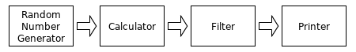
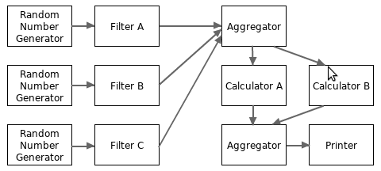

## Определение

Одна из основных проблем *concurrent programming* – корректный доступ к *shared variable*.  При разработке на Go рекомендуется передавать *shared variable* по *channel*.

*Rob Pike* сказал: не коммуницируйте через разделяемую память, разделяйте память посредством коммуникации  (don't communicate by sharing memory, share memory by communicating).

Т.е. есть два способа взаимодействия в *concurrent programming*:

- *communicate by sharing memory* – это традиционные техники *concurrency synchronization*, такие как *mutex* для защиты *shared memory* от *data races*. 
- *share memory by communicating* – через *channel*. В итоге, доступ к конкретной ячейке памяти имеет только одна *goroutine*. *Race condition* не может произойти *by design*.

*Channel* предоставляет механизм для взаимодействия конкурентных *goroutine*'s с помощью отправки (через [send statement](../Lang.md#send-statement)) и получения (через [receive operator](../Lang.md#receive-operator)) значений указанного *element type*. Значение *uninitialized channel*  равно `nil`.

<pre>
ChannelType = ( "chan" | "chan" "<-" | "<-" "chan" ) <a href="#array-type">ElementType</a> .  
</pre>

Опциональный оператор `<-`  указывает *channel direction*. При объявлении указывается `ElementType`, по *channel* могут пересылаться значения только этого *type*.

Обозначим *element type* – `T`. Есть *bi-directional* и *single-directional channel types*.

- *bidirectional channel type* для *send* и *receive* значений

  ```go
  chan T
  ```

- *send-only channel type*. Компилятор не позволяет делать *receive* значений из такого *channel*.

  ```go
  chan<- T
  ```

- *receive-only channel type*. Компилятор не позволяет делать *send* значений в такой канал.

  ```go
  <-chan T 
  ```

Значение *bidirectional channel type* `chan T` может быть преобразовано в *send-only type* `chan<- T` и в *receive-only type* `<-chan T` с помощью *assignment statement* ([link](../Lang.md#assignment)) или с помощью *explicit conversion* ([link](../Lang.md#conversion)). Но не наоборот.

```go
var a chan int

b := (<-chan int)(a)  // OK
c := (chan<- int)(a)  // OK

d := (chan int)(b)    // Error
e := (chan int)(c)    // Error
```

Для создания инициализированного *channel value* необходимо использовать функцию [`make`](../Lang.md#make) :

```go
make(t Type, capacity IntegerType) Type
make (chan int, 100)
```

У каждого *channel value* есть *capacity*. Он задает вторым аргументом функции `make()`. Второй аргумент является необязательным, и его значение по умолчанию равно 0.

Различают:

- *unbuffered channel* – *channel*, у которого *capacity* равен 0 или не указан (в это случае, также равен 0). Коммуникация будет произойдет только тогда, когда и *sender*, и *receiver* готовы. Этот канал сразу и пуст (*empty*) и полон (*full*).

* *buffered channel* – *channel*, у которого указан ненулевой *capacity*. Коммуникация пройдет без блокировки, если *buffer* не полный (для [send statement](../Lang.md#send-statement)) или не пустой (для [receive operator](../Lang.md#receive-operator)).
* `nil`  – *zero value* для *channel type*, *channel* никогда не готов к коммуникации.

Один и тот же *channel* может использоваться в [send statement](../Lang.md#send-statement), [receive operator](../Lang.md#receive-operator) и вызовах *built-in* функций `cap()`и `len()` любым количеством *goroutine*'s без синхронизации. 

*Channel* действуют как FIFO (*first-in-first-out*) *queue*. Т.е., если одна *goroutine* отправляет значения по *channel*, а вторая *goroutine* получает их, значения будут получены в том порядке, как они были отправлены.

## Buffered и unbuffered channel

По сути буферизация *channel*, если channel имеет достаточную *capacity*, влияет только на поведение *sender*. 

- Если *channel* достаточной *capacity*, то *sender* не будет "залипать" в момент *send*. 
- *Receiver* в любом случае будет ждать, пока в *channel* не появится *value*. И не важно *channel* – *buffered* или *unbuffered*.


## Операции над *channel*

Над *channel* можно выполнять пять операций.

Все эти операции синхронизированы, поэтому для безопасного выполнения этих операций не требуется никаких дополнительных синхронизаций.

### `close()`

```go
func close(c chan<- Type)
```

`close()` *send* в *channel* специальное *close-value*, которое говорит "по этому *channel* данные больше поступать не будут". *Channel* должен быть *bidirectional* или *send-only* (для *receive-only channel* нельзя делать `close()`  в соответствии с сигнатурой функции). 

#### Почему выбрасывается *panic* при *send* или *close* в *closed channel*

У функции `close()` не совсем правильное название, там ничего не закрывается.

Важно!!!: сделать `close()` для *channel* – это НЕ то же самое, что сделать `close()` для *file*. Это НЕ способ высвобождения ресурсов, это механизм синхронизации *sender*'а и *receiver*'ов. 

Важно!!!: Проще всего думать о вызове `close()`, как о *send* специального *close-value*, которое говорит "по этому *channel* данные больше поступать не будут". Можно считать, что мы получаем это *close-value* через *receive operator* в *tuple assignment*:

```go
var x, ok = <-ch
```

Поэтому запрещено делать *close* на *closed channel*, т.к. туда уже отправлено специальное *close-value* что данные не будут поступать, и это вызывает *panic*.

Делать `close()` необходимо только тогда, когда нужно сообщить *receiver*'ам, что все данные были отправлены, больше данных поступать не будет и они могут выйти из *blocking state*. Например, если *receiver*'s ждут состояния *close*, чтобы завершить `for-range` цикл для *receiver*'а. Или необходимо сделать [1-N notification]().

Т.к. вызов `close()` приводит к *send* в *channel* специального *close-value* ("по этому *channel* больше данных поступать не будет"):

- *send* на *closed channel* вызывает *panic*. Т.к. вы делаете *send* после того как уже отправили *close-value*, а значит никаких больше *value* в *channel* отправлять нельзя.
- `close()` должен вызываться только *sender*'ом (т.к. он делает *send*). *Receiver* не должен этого делать, он только *receive value*'s. Вы не можете с помощью *receiver*'а сделать *send* специального *close-value* в *channel*, чтобы сигнализировать *sender*'у прекратить *send*. На стороне *receiver*'а можно только получать специальное *close-value*.

В соответствии с этой логикой, делать `close()` имеет смысл только при наличии единственного *sender*'а или если несколько *sender*'ов как-то взаимодействуют друг с другом (например, через *third-party goroutine*, которая получает сигнал и делает `close()`). Т.к. непонятно как несколько *goroutine*'s могут знать, что больше никакие *value*'s не могут быть *send* в *channel* и делать для него `close()`, если они не взаимодействуют? Поэтому ситуация, когда делаете *send* и при этом не знаете *closed channel* или нет – является признаком ошибки в программе.

*Close* для *nil channel* также вызывает *panic*. 

Нет необходимости делать `close()` для каждого *channel*, с которым больше не выполняются никакие операции. Это нормально – вообще никогда не делать *close* и оставлять *channel* открытым навсегда.

Ресурсы *channel*, который *garbage collector* определит как недостижимый, будут освобождены вне зависимости от того, был вызван `close()` или нет (в отличии от работы с файлами, для них обязательно делать в конце работы `close()`).  Это произойдет после удаления всех *reference*'s на *channel*.


После *receive* любых ранее *sent value*'s из *closed channel* `c`, вызов *receive operator* из `c` будет успешным без *blocking*, возвращая *zero value* для *channel element type*. При использовании *closed channel* в *tuple assignment*:

```go
x, ok := <-c  // ok = false
```

получаем `ok = false`.


### Send statement

*Send statement* отправляет *value* в *channel*. 

```go
SendStmt = Channel "<-" Expression .
Channel  = Expression .
```

```go
ch <- v // отправляем значение v в канал ch
ch <- 3 // отправляем значение 3 в канал ch
```

- *channel expression* должно быть [channel type](types/channel.md)
- *channel* должен быть *bidirectional* или *send-only*
- тип *value*, которое будет sent (`Expression`), должно быть [assignable](#assignability) к *channel's element type*.

Коммуникация блокируется до тех пор пока *send* не может быть выполнено:

- *Send* в *unbuffered channel* может быть выполнен, если *receiver* готов
- *Send* в *buffered channel* может быть выполнен, если в *buffer*'е есть место. 
- *Send* в *closed channel* вызывает *panic*
- *Send* в `nil` *channel* приводит к *block forever*.

### Receive operator

*Receive operator* возвращает *value*, *received* из *channel* `ch`.

```go
<-ch
```

- `ch` должно быть [channel type](types/channel.md)
- *channel* должен быть *bidirectional* или *receive-only*
- тип возвращаемого значение – *channel's element type*.

Особенности:

- *Receive operator* блокируется до тех пор пока *value* не станет доступно
- *Receive* из `nil` *channel* приводит к *block forever*.
- *Receive* из *closed channel* будет всегда выполнено немедленно, возвращая вначале ранее *sent value*'s, а затем *element type's zero value*

```go
v1 := <-ch
v2 = <-ch
f(<-ch)
<-ch  // ждать, пока не будет получено value (???) и отбросить его
```

*Receive operator* может использоваться в *tuple assignment* и *declaration*:

```go
x, ok = <-ch
x, ok := <-ch
var x, ok = <-ch
var x, ok T = <-ch
```

- `ok` – *boolean value*, которое сообщает, была ли успешна коммуникация
  - `ok = true` – если *received value* было доставлено в результате успешного *send statement* 
  - `ok = false` – если это *zero value*, сгенерированное потому что *channel* – *closed* и *empty*.

Вместо *receive operator* можно использовать [цикл `for-range`](#цикл-for-range)

*Receive operator* может использоваться в *receive operation*. Например:

```go
x = <-c + 1
```

### `cap` и `len`

#### `cap()`

```go
cap(ch)
```

Возвращает *capacity of channel buffer*. Для *nil channel* возвращает ноль. 

#### `len()`

```go
len(ch)
```

Возвращает *length of channel buffer* – текущее количество элементов в *channel buffer*. Т.е. которые уже были успешно *sent* в *channel*, но еще не были *received*.

Для *nil channel* возвращает ноль. 

#### Использование `cap()` и `len()`

На практике функции `cap()` и `len()` используются редко. Причины:

- функция `len()` используется редко, т.к. *channel length* мог измениться сразу после вызова функции `len()`. 
- функция `cap()` используется редко, т.к. *channel capacity* часто известен или не важен.

## Internals

Каждый *channel* состоит из 3 *queue*'s:

- *receiving goroutine queue* – очередь *goroutine*'s, все (!!!) из которых находятся в состоянии *block* и ожидают возможности *receive*. Обычно FIFO. Представляет собой *linked list* без ограничения размеров.
- *sending goroutine queue* – очередь *goroutine*'s, все (!!!) из которых находятся в состоянии *block* и ожидают возможности *send*. Обычно FIFO. Представляет собой *linked list* без ограничения размеров. *Value*, которое пытается *send* каждая *goroutine* также сохраняется в *queue*.
- *value buffer queue* – очередь буфера значений. Всегда FIFO. Это *circular queue* – кольцевая очередь, кольцевой буфер (в конец ее пишут, а из начала читают, последний элемент замкнут с первым). Его *size* равна *channel capacity*.

Каждый *channel* содержит *mutex* для исключения *data race* по всем операциям.

### Внутренняя реализация основных операций

Разделим *channel*'s на три типа:

- *nil channel*
- *non-nil, closed channel*
- *non-nil, not-closed channel*

Следующая таблица суммирует поведение для всех операций и типов *channel*'s.

| Operation   | Nil Channel   | Closed channel           | Non-nil, not-closed channel |
| ----------- | ------------- | ------------------------ | --------------------------- |
| **Close**   | panic         | panic                    | success (C)                 |
| **Send**    | block forever | panic                    | block or success (B)        |
| **Receive** | block forever | success, never block (D) | block or success (A)        |

Для пяти *case*'s (без символов в скобках) – поведение очевидно:

- *Close* для *nil channel* и уже *closed channel* приводит к *panic* в текущей *goroutine*.
- *Send* в *closed channel* также приводит к *panic* в текущей *goroutine*.
- *Send* и *receive* из *nil channel* приводит к *block forever*.


#### (A) *Receive* из *non-nil, not-closed channel*

*Receiving goroutine* `R` вначале *acquire mutex*, относящийся к этому *channel*. Затем выполняет следующие шаги, пока не будет выполнено одно из условий.

- Если *value buffer queue* – не пуст, это значит что *receiving goroutine queue* – пуст. Тогда *goroutine* `R` делает *receive value* из *value buffer queue* и продолжает находится в *running state* (*non-blocking operation*). Если при этом *sending goroutine queue* – не пуст, очередная *sending goroutine* будет взята из *sending goroutine queue*, ее *value* будет помещено в *value buffer queue*, она переходит в *running state* (выходит из *blocking state*). 
- Если это *unbuffered channel*, *value buffer queue* – пуст, и *sending goroutine queue* – не пуст. *Sending goroutine* извлекается из *sending goroutine queue*, *receiving goroutine* `R` получает *value* которое пыталась отправить *sending goroutine*. *Sending goroutine* переходит в *running state* (выходит из *blocking state*). *Receiving goroutine* `R` продолжает находится в *running state* (*non-blocking operation*).
- Если *value buffer queue* и *sending goroutine queue* – пусты, *goroutine* `R` будет помещена в *receiving goroutine queue* и перейдет в *blocking state* (*blocking operation*). Она вернется в *running state*, когда другая *goroutine* сделает *send* в *channel*.

#### (B) *Send* в *non-nil, not-closed channel*

*Sending goroutine* `S` вначале *acquire mutex*, относящийся к этому *channel*. Затем выполняет следующие шаги, пока не будет выполнено одно из условий.

- если *receiving goroutine queue* – не пуст, это значит что *value buffer queue* – пуст. Тогда *receiving goroutine* извлекается из *receiving goroutine queue*. *Sending goroutine* `S`  отправляет *value* этой *receiving goroutine*, которая переходит из *blocking* в *running state*. *Sending goroutine* `S` продолжит находиться в *running state* (*non-blocking operation*).
- Если *receiving goroutine queue* – пуст; и *value buffer queue* – не полон; в этом случае *sending goroutine queue* – так же пуст. *Sending goroutine* `S` отправляет *value* в *value buffer queue* и продолжает находиться в *running state* (*non-blocking operation*).

- Если *receiving goroutine queue* – пуст; и *value buffer queue* – полон. Тогда *sending goroutine* `S` будет помещена в *sending goroutine queue* и перейдет в *blocking state* (*blocking operation*). Она снова вернется в *running state*, когда другая *goroutine* сделает *receive* из *channel*.

#### (C) Close для Non-nil, not-closed channel

*Goroutine* вначале *acquire mutex*, относящийся к этому *channel*. Затем выполняет следующие шаги, пока не будет выполнено одно из условий.

- Если *receiving goroutine queue* – не пуст; в этом случае *value buffer queue* – пуст, из *receiving goroutine queue* извлекаются поочереди *receiving goroutine*'s, каждая получает *zero value* (и второе значение `false`) и переходит в *running state*.
- Если *sending goroutine queue* – не пуст, из *sending goroutine queue* извлекаются поочереди *sending goroutine*'s, каждая бросает *panic* из-за отправки в *closed channel*. Поэтому необходимо избегать конкурентных операций *send* и *close* на одном и том же *channel*. Когда включена [go command's data race detector option](https://golang.org/doc/articles/race_detector.html) (`-race`), конкурентные операции *send* и *close* могут быть определены в *run time* и выброшена *panic*.

После того как *channel* стал *closed*, значения из *value buffer queue* – продолжат там оставаться. Как они извлекаются описано в  (D).

#### (D) *Receive* из *Closed channel*

Значения могут быть *receive* из *value buffer queue* из *closed channel*. Значения извлекаются из *closed channel*, как обычно, с помощью *receive operator*. 

- если значения есть в *value buffer queue*: возвращаемые значения из *receive operator* – *value*, `true`. 
- если значения закончились в *value buffer queue*: возвращаемые значения из *receive operator* – *zero value*,  `false`.


### *Values* передаются по *channel* путем *copy by value*

Когда *value* передается из одной *goroutine* в другую, оно будет скопировано как минимум один раз. Если *value* помещается в *value buffer queue*, то в процессе передачи будет сделано две копии:

1. *value* будет скопировано из *sending goroutine* в *value buffer queue*
2. *value* будет скопировано из *value buffer queue* в *receiving goroutine queue*. 

Подобно *assignment* (*copy by value*) происходит копирование только [direct part](https://go101.org/article/value-part.html#about-value-copy).

### Размер *channel element type*

Размер *channel element type* должен быть меньше, чем `65536`. Однако, как правило, мы не должны создавать *channel* с большим размером *element type*, чтобы избежать слишком больших затрат на копирование в процессе передачи *value*'s между *goroutine*'s. Поэтому, если размером *element type* слишком велик, лучше использовать вместо него *pointer element type*, чтобы избежать затрат на копирование больших значений.


### *Garbage collector* для *channel* и *goroutine*

На *channel* ссылаются все *goroutine*'s в *sending* и *receiving goroutine queue*, поэтому, если ни одна из *queue*'s не пуста, *channel* не может быть собран *garbage collector*'ом. Также если *goroutine* находится в *blocking state* и в *sending* или *receiving goroutine queue*, то *goroutine* также не может быть собрана *garbage collector*'ом. Т.е. *goroutine* может быть собрана *garbage collector*'ом, только когда она уже завершилась.


## *Send statement* и *receive operator* как *simple statement*

*Send statement* и *receive operator* являются [*simple statement*](../Lang.md#statement). *Receive operator* также является *expression*. Поэтому они могут быть использованы в некоторых местах *control flow statement* (`if`, `for`, ...)

Пример, использования send statement и receive operator в заголовке цикла `for`:

```go
package main

import (
	"fmt"
	"time"
)

func main() {
	c := make(chan uint64)  // unbuffered channel
	go func() {
		var x, y uint64 = 0, 1
		for ; y < 100; c <- y {  // send число фибоначи в channel 
			x, y = y, x+y        // суммируем числа фибоначи до 100
		}
		close(c)
	}()

	for x, ok := <-c; ok; x, ok = <-c { // receive число фибоначи из channel
		time.Sleep(time.Second)         // пока ok = true
		fmt.Println(x)
	}
}
```

## Цикл `for-range`

Цикл [`for-range`](../Lang.md#с-range-clause) можно использовать для итеративного *receive value*'s из *channel*. Цикл завершается, когда *channel* будет *close* и после этого его *value buffer queue* станет пустой. Как указано в документации к [`for-range`](../Lang.md#с-range-clause), можно использовать только одну *iteration variable* для записи *received value*.

```go
for v := range ch {
	// use v
}
```

это эквивалентно:

```go
for {
	v, ok = <-ch
	if !ok {
		break
	}
	// use v
}
```

-  *channel* должен быть *bidirectional* или *receive-only*
- для *nil channel* – цикл *block forever*

Можно не указывать `ExpressionList` и `IdentifierList`:

```go
// очистить channel, receive все value's
for range ch {}

// tick каждую 1 секунду
for range time.Tick(time.Second) {
  // ..
}
```


## `select` statement

`select` *statement* специально разработан для *channel*. `select` *statement* определяет, который из множества возможных [send statement](#send-statement) (`SendStmt`) и [receive statement](#receive-operator) (`RecvStmt`) будет выбран для исполнения. `select` *statement* похож на `switch` *statement*, но все блоки `case` могут содержать только *send statement* и *receive statement*.

---

<pre>
SelectStmt = "select" "{" { CommClause } "}" .
CommClause = CommCase ":" StatementList .
CommCase   = "case" ( <a href="#send-statement">SendStmt</a> | RecvStmt ) | "default" .
RecvStmt   = [ ExpressionList "=" | <a href="Lang.go#constant-declaration">IdentifierList</a> ":=" ] RecvExpr .
RecvExpr   = Expression .  
</pre>

---

`RecvStmt` и `SendStmt`, которые идут за `case` *keyword*, дальше будут называться *case operation*.  Соответствующие им `StatementList` будут называться *case branch*.

Смысл `ExpressionList`  и `IdentifierList`:

- `ExpressionList` – уже объявленные переменные
- `IdentifierList` – новые переменные, идентификаторы

Особенности:

- в отличии от `switch/case`, между `select` и `{` – никаких *expression* и *statement* быть не может

- В `RecvStmt` можно использовать 1 или 2 *variable*'s в присвоении.
- Можно использовать [short variable declaration](#Lang.md#short-variable-declaration).
- `RecvExpr` должен быть [*receive operation*](#receive-operator) (можно заключать в скобки `()`)

- может быть не более одного `default` *case*, и он может появляться в любом месте *case list*.
- внутри `case` *branch* нельзя использовать `fallthrough` *statement*


Примеры использования `select / case`:

```go
var a []int
var c, c1, c2, c3, c4 chan int
var i1, i2 int
select {
case i1 = <-c1:
	print("received ", i1, " from c1\n")
case c2 <- i2:
	print("sent ", i2, " to c2\n")
case i3, ok := (<-c3):  // то же самое что и: i3, ok := <-c3
	if ok {
		print("received ", i3, " from c3\n")
	} else {
		print("c3 is closed\n")
	}
case a[f()] = <-c4:
	// то же самое что и:
	// case t := <-c4
	//	a[f()] = t
default:
	print("no communication\n")
}

for {  // send random sequence of bits to c
	select {
    case c <- 0:  // обратите внимание: нет statement, не происходит fallthrough, (???) no folding of cases
	  case c <- 1:
	}
}

select {}  // block forever

```


### Порядок выполнения

Выполнение `select` *statement* происходит в следующем порядке:

1. Для всех *case operation*'s необходимо вычислить:

   - *channel* в *receive statement*
   - *channel* в *send statement*
   - правая часть *send statement* (*expression*, которое будет потом *send*)

   Каждое значение вычисляется один раз, в том порядке как они записаны в *select statement*. 

   Результатом вычислений соответственно будут:

   - *channel*'s для *receive*
   - *channel*'s для send
   - результаты вычисления *expression* (некоторое *value*) для *send*. 

   Поэтому в процессе этих вычислений могут произойти *side effect*'s (например, изменения значений переменных) , и они не зависят от того какая из *case branch*'s будет выбрана для исполнения (т.к. эти вычисления происходят до ее выбора).

   *Expression*'s в левой части `RecvStmt`  (т.е. в *short variable declaration* и *assignment*) на этом шаге не вычисляются (мое! но и как они могут быть вычислены, если еще непонятно какой из *case operation* будет выполняться).

2. Составить список из *case branch*'s в случайном порядке для выбора на (Шаг 5). *default branch* всегда помещается в конец списка. *Channel*'s могут повторяться в разных *case operation*'s.

3. Отсортировать все *channel*'s, задействованных в *case operation*'s, чтобы на следующем шаге избежать *deadlock* (с другими *goroutine*'s!!!) (мое: т.е. учесть порядок других *goroutine*'s в *sending goroutine queue* и *receiving goroutine queue* этих *channel*). Пусть `N`- количество задействованных *channel*'s в *case operation*'s. В первых `N` *channel*'s отсортированного результата не должно быть повторяющихся *channel*'s, их порядок назовем *channel lock order*.

4.  *acquire mutex* для всех задействованных *channel*'s в соответствии с *channel lock order*, полученном на предыдущем шаге

5. выбирать *branch*'s в случайном порядке, полученном на (Шаг 2):

   1. если это *case branch* и ее *case operation* – *send* в *closed channel*: *release mutex* для всех *channel*'s в соответствии с обратным *channel lock order* и бросить *panic*. Перейти к (Шаг 12).
   2. если это *case branch* и ее *channel operation* – *non-blocking*, выполнить *channel operation* и *release mutex* для всех *channel*'s в соответствии с обратным *channel lock order*, затем выполните соответствующую *case branch*. *Channel operation* может перевести другую *goroutine* из *blocking state* в *running state*. Перейти к (Шаг 12).
   3. если это *default branch*, то *release mutex* для всех *channel*'s в соответствии с обратным *channel lock order*, затем выполните *default branch*. Перейти к (Шаг 12).

   (Если дошли до сюда, то значит *default branch* отсутствует, и все *case operation*'s являются *blocking*).

6. поместить текущую *goroutine* (??? вместе с информацией соответствующей *case branch*) в *receiving* или *sending goroutine queue* каждого задействованного *channel* в каждой *case operation*. Текущая *goroutine* может быть помещена в *queue* одного и того же *channel* несколько раз, так как *channel* в *case operation*'s может повторяться.

7. перевести текущую *goroutine* в *blocking state* и *release mutex* для всех *channel*'s в соответствии с обратным *channel lock order*.

8. ждать в *blocking state*, пока другая *channel operation* в другой *goroutine* не разбудит текущую *goroutine*, ...

9. текущая *goroutine* пробуждается другой *channel operation* в другой *goroutine*. Это может быть:

   - *close operation* – всегда пробуждает текущую *goroutine*
   - *send/receive operation* – должна существовать *case operation*, взаимодействующая с ней путем передачи *value*. 

   В результате, текущая *goroutine* будет исключена из *receiving/sending goroutine queue* этого *channel*.

10. *acquire mutex* для всех задействованных *channel*'s в соответствии с *channel lock order*

11. исключить текущую *goroutine* из *receiving/sending goroutine queue* каждого задействованного *channel* в каждой *case operation*. Перейти к (Шаг 5).

12. Done


Общие выводы:

- `select` *statement* без каких-либо *case/default branch*'s (`select{}`) переводит текущую *goroutine* в *blocking state forever*.
- *goroutine* может находится сразу в *sending* и *receiving goroutine queue* нескольких *channel*'s одновременно. И даже *goroutine* может находится в *sending* и *receiving goroutine queue* одного *channel* одновременно (мое: при этом она не может получить *value* сама у себя, т.к. может выполнена только одна *channel operation*).
- будет исполнена только одна *case branch*


### Примеры

[смотреть в примерах](#примеры-для-select-statement)


# Примеры

## Пример 1

Одна *goroutine* отправляет другой значение 9 по *unbuffered channel* `c`. 

*Main goroutine* блокируется до получения по `done` *channel*.

```go
package main

import (
	"fmt"
	"time"
)

func main() {
	c := make(chan int) // unbuffered bidirectional channel
	go func(ch chan<- int, x int) {
		// ch – send-only channel

		time.Sleep(time.Second)

		// Send 9 и блокироваться до тех пор пока другая goroutine не сделает receive
		ch <- x*x
	}(c, 3)

	done := make(chan struct{}) // unbuffered bidirectional channel

	go func(ch <-chan int) {
		// Блокируется до тех пор пока 9 не будет receive
		n := <-ch

		fmt.Println(n) // 9

		time.Sleep(time.Second)

		// struct{}, чтобы разблокировать main
		done <- struct{}{}
	}(c)

	// Блокируется до тех пор, пока не будет отправлено struct{}
	<-done

	fmt.Println("bye")
}
```

## Пример 2

Пример использования *buffered channel*.

```go
package main

import "fmt"

func main() {
	c := make(chan int, 2) // buffered channel
  
  // Send 3 и 5
	c <- 3
	c <- 5
  
  // Close channel
	close(c)
	fmt.Println(len(c), cap(c)) // 2 2

  // Receive 3
	x, ok := <-c
	fmt.Println(x, ok) // 3 true
	fmt.Println(len(c), cap(c)) // 1 2

  // Receive 5
	x, ok = <-c
	fmt.Println(x, ok) // 5 true
	fmt.Println(len(c), cap(c)) // 0 2

  // Receive из closed channel
	x, ok = <-c
	fmt.Println(x, ok) // 0 false

  // Receive из closed channel
	x, ok = <-c
	fmt.Println(x, ok) // 0 false

	fmt.Println(len(c), cap(c)) // 0 2

  // Close для closed channel
	close(c) // panic!

  // Send в closed channel
	c <- 7 // panic!
}
```


## Пример 3

Все *goroutine*'s ставятся в *receiving goroutine queue* и переходят в *blocking state*. Затем *main goroutine* делает `send "referee"` и одна из *goroutine* (первая в *queue*) переходит в *running state*, выводит строку `referee`, делает `send "<playerName>"` и разблокирует следующую *goroutine* в *receiving goroutine queue*, а сама становится в конец этой очереди.

```go
package main

import (
	"fmt"
	"time"
)

func main() {
	var ball = make(chan string) // unbuffered channel
	kickBall := func(playerName string) {
		for {
			// receive значение, которое отправляет goroutine с другим playerName
			fmt.Println(<-ball, "kicked the ball.")

			time.Sleep(time.Second)

			// переходит в blocking state при send своего playerName
			ball <- playerName
		}
	}
	go kickBall("John")
	go kickBall("Alice")
	go kickBall("Bob")
	go kickBall("Emily")

	// send "referee"
	ball <- "referee"

	// unbuffered nil channel для блокировки
	var c chan bool
	<-c               // block forever
}
```


## Future/Promises

Конструкции *future*, *promise* и *delay* в некоторых языках программирования формируют стратегию вычисления, применяемую для параллельных вычислений. С их помощью описывается объект (*promise*), к которому можно обратиться за результатом (*future*), вычисление которого может быть не завершено на данный момент. *Promise* — это функция, которая присваивает значение (*future*). *Future* — возвращаемое значение асинхронной функции *promise*. 

Это позволяет отделить значение (*future*) от процесса самого вычисления (*promise*), что позволяет запустить несколько процессов вычислений параллельно. 

### Реализация через возврат *receive-only channel* из функции

```go
package main

import (
	"time"
	"math/rand"
	"fmt"
)

// Promise -  функция выполняет долгую работу по генерации числа int32
// При этом она возвращает receive channel, в который будет отправлено вычисленное значение (future)
func longTimeRequest() <-chan int32 {
	r := make(chan int32)

	go func() {
		// Некоторая долгая обработка
		time.Sleep(time.Second * 3)
		r <- rand.Int31n(100)
	}()

	return r
}

// функция, которая использует вычисленные значения (futures)
func sum(a, b int32) int32 {
	return a + b
}

func main() {
  // Получение двух promises - channel's для получения значений
  // Процесс вычислений будет запущен параллельно, но самих значений еще нет
	a, b := longTimeRequest(), longTimeRequest()
  
  // Использование двух значений, которые будут вычислены в будущем (future)
  // receive operations будут заблокированы до тех пор пока send operation не будет выполнена для 
  // соответствующего channel (процесс вычислений идет параллельно)
  // На вычисления будет затрачено 3 секунды, а не 6 секунд как при параллельных вычислениях
	fmt.Println(sum(<-a, <-b)) 
}
```

### Реализация через передачу send-only channel в качестве аргумента

- через 2 *unbuffered channel*'s':

  ```go
  package main
  
  import (
  	"time"
  	"math/rand"
  	"fmt"
  )
  
  // функция выполняет долгую работу и принимает send-only channel как аргумент
  func longTimeRequest(r chan<- int32)  {
  	time.Sleep(time.Second * 3)
  	r <- rand.Int31n(100)
  }
  
  func sum(a, b int32) int32 {
  	return a + b
  }
  
  func main() {
  	// два unbuffered channel
  	ra, rb := make(chan int32), make(chan int32)
  	go longTimeRequest(ra)
  	go longTimeRequest(rb)
  
  	// когда в оба channel будет отправлено value, goroutine снова перейдет в running state
  	fmt.Println(sum(<-ra, <-rb))
  }
  ```

- через 2 *buffered channel*'s.

  Можно вместо *unbuffered channel*'s использовать *buffered channel*'s любого размера, т.к. они тоже блокируются до операции *send*:

  ```go
  // ...
  // любой размер, например, 100. Наиболее эффективный размер в примере - 1.
  a, rb := make(chan int32,100), make(chan int32,100)
  // ...
  ```

- через 1 *buffered channel*'s

  Можно обойти одни *buffered channel* размером – минимум 2. В него будут класть *value*'s обе *goroutine*:

  ```go
    // ... 	
    r := make(chan int32, 2)
  	go longTimeRequest(r)
  	go longTimeRequest(r)
  
  	fmt.Println(sum(<-r, <-r))
  ```

## Получение первого ответа, остальные ответы – отбрасываем (first response win)

### Из одного *channel*

#### Без `select`

Запускаем несколько *goroutine*'s (например, запрос за одним файлом на несколько серверов). Используем только первый ответ, другие, более медленные, отбрасываем.

Без `select` необходимо создать *buffered channel* размером - с количество *goroutine*'s, чтобы *goroutine*'s не залипли.

```go
package main

import (
	"fmt"
	"time"
	"math/rand"
)

func source(num int, c chan<- int) {
	// Засыпает на 1s/2s/3s.
	time.Sleep(time.Duration(rand.Intn(3) + 1) * time.Second)
	c <- num
}

func main() {
	// необходимо использовать buffered channel размером - с количество goroutine's
	// чтобы goroutine's не залипли
	c := make(chan int, 5)
  
  // запускаем 5 goroutine (равно channel capacity) 
	for i := 0; i < cap(c); i++ {
		go source(i, c)
	}
	// используем только первый response
	rnd := <- c
	fmt.Println(rnd)
}
```

#### С  *try/send* через `select`

В этом варианте добавляется `select` *statement*, который работает как *try/send*. Это позволяет уменьшить размер *channel* до 1. *Goroutine*'s не залипают, а просто скипают *send*.

```go
func source(num int, c chan<- int) {
	// Засыпает на 1s/2s/3s.
	time.Sleep(time.Duration(rand.Intn(3) + 1) * time.Second)
	select {       // try/send value
	case c <- num: // send value
	default:       // если не получается, то пропускаем отправку
	}
}

func main() {
	// можно использовать buffered channel размером 1,
	// т.к. достаточно send value только для 1 goroutine
	// другие просто пропустят send value с помощью try/send
	c := make(chan int, 1)
  
  // запускаем 5 goroutine
	for i := 0; i < 5; i++ {
		go source(i, c)
	}
	
	rnd := <- c // используем только первый response

	fmt.Println(rnd)
	time.Sleep(5 * time.Second)
	fmt.Println(runtime.NumGoroutine()) // проверяем, что goroutine's не залипли, активна только 1 main goroutine
}

```

### Из нескольких *channel*

Используем `select` *statement*, чтобы ожидать по *receive* сразу из нескольких *channel*. При этом будет исполнена одна *case operation* и соответствующая ей *case branch* – для первого ответа (*first response win*).

```go
// функция возвращает channel - источник value
func source() <-chan int {
	// необходим buffered channel, чтобы goroutine не залипла
	c := make(chan int, 1)
	go func() {
		time.Sleep(time.Duration(rand.Intn(3)+1) * time.Second)
		c <- rand.Int()
	}()
	return c
}

func main() {
	var rnd int
	// Блокируем goroutine, пока не произойдет receive по одному из channel
	select{
	case rnd = <-source():
	case rnd = <-source():
	case rnd = <-source():
	}
	fmt.Println(rnd)
}
```


## Передача notification/signal (без передачи данных)

Используется, когда необходимо через *channel* уведомить о каком-то событии, но при этом не требуется передавать какую-либо информацию. Лучшее решение – использовать *empty struct* `struct{}` в качестве *element type*, т.к. размер *empty struct* равен нулю, *send/receive* будет только изменять счетчик в *channel* без выделения памяти, копирования элементов и так далее. Использование для этой цели других *type*'s, например *boolean type*, приведет к большему потреблению памяти ([подробней про *empty struct*](struct.md#empty-struct)).

### 1-to-1 notification

Рассмотрим примеры блокировки/разблокировки *goroutine* через 1-to-1 *notification*:

- *running goroutine* делает *send*, *blocking goroutine* делает *receive*. 

  *Running goroutine* вместо *send* может делать *close* (это удобней для *1-N notification*, как описано [ниже](#1-to-n-notification-через-close))

  ```go
  func main() {
  	done := make(chan struct{}) // может быть buffered или unbuffered,
                                // это влияет только на sender, будет он залипать на send или нет,
                                // если receiver не готов
  
  	go func() {
  		time.Sleep(time.Second)
  		// Отправить notification о завершении
  		done <- struct{}{}
  	}()
  
  	<- done // ожидание notification
  }
  ```

- наоборот, *running goroutine* делает *receive*, *blocking goroutine* делает *send*. Используется реже. *Channel* должен быть *unbuffered*.

  ```go
  func main() {
  	done := make(chan struct{}) // должен быть unbuffered
  
  	go func() {
  		time.Sleep(time.Second)
  		// Сделать receive
  		<-done
  	}()
  
  	done <- struct{}{} // ожидать на send
  }
  ```

### Множественные *notification*

Это *notification*'s, которые передают от 1 *goroutine* к N *goroutine*'s, и наоборот

#### Ожидание всех *notification*

Это ситуация, когда мы должны *send notification*'s всем N *goroutine*'s или *receive noitification*'s от всех N *goroutine*'s.

##### 1-to-N и N-to-1 notification через send/receive

- *1-N notification* – *1 main goroutine* делает *send* к *N child goroutine*'s, которые заблокированы на *receive*. Чаще всего реализуется другим способом – через *close channel* ([ниже](#1-to-n-notification-через-close))
- N-1 notification – *N child goroutine*'s делают *send* к *1 main goroutine*, которая заблокирована на *N receive operator*'s. Чаще всего реализуется другим способом – через `sync.WaitGroup`.

```go
type T = struct{}

func worker(id int, ready <-chan T, done chan<- T) {
	<-ready // N child goroutines заблокированы на receive от 1 main goroutine (1-to-N)
	fmt.Println("Worker#", id, " starts.")

	time.Sleep(time.Second * time.Duration(id+1))

	fmt.Println("Worker#", id, " job done.")
	done <- T{} // N child goroutines делают send к 1 main goroutine (N-to-1)
}

func main() {
	ready, done := make(chan T), make(chan T) // unbuffered channels

	go worker(0, ready, done)
	go worker(1, ready, done)
	go worker(2, ready, done)

	// 1 main goroutine делает send в N child goroutines (1-to-N)
	ready <- T{}; ready <- T{}; ready <- T{}

	// 1 main goroutine ждет на receive из N child goroutines (N-to-1)
	<-done; <-done; <-done
}
```


##### 1-to-N notification через *close*

Применение:

- Используется наиболее часто для 1-N *notification*. Т.к. *close channel* приводит к возможности *receive* без блокировки любого количества *channel*, которые выполняют *receive*, эта операция более удобна и компактна в коде. 
- можно использовать для 1-1 *notification*

В примере из [предыдущего раздела](#1-to-N-и-N-to-1-notification-через-send-receive), мы можем заменить три операции *send* `ready <- struct{}{}` одной операцией  `close(ready)`.

```go
type T = struct{}

func worker(id int, ready <-chan T, done chan<- T) {
	<-ready // N child goroutines заблокированы на receive от 1 main goroutine (1-to-N)
  ...
}

func main() {
  ...

	// 1 main goroutine делает close и дает возможность receive для N child goroutines (1-to-N)
	close(ready)

	...
}
```

Проверить, были ли уже сделан *close* для *channel* можно через [*try/receive* из *closed channel*](#try-receive-из-closed-channel)

#### Ожидание одного *notification*

Если не нужно ждать всех notification от нескольких goroutine's, а достаточно одной noitification, то нужно использовать приемы из раздела [получение первого ответа, остальные ответы – отбрасываем (first response win)](#получение-первого-ответа-остальные-ответы–отбрасываем-first-response-win))


## Использование *channel* как *lock* (*mutex*, *semaphore*)

### *Channel* как *mutex*

*One-capacity buffered channel* может быть использован как *mutex*.

Есть два подхода:

- *lock* через *send*, *unlock* через *receive*:

  ```go
  func main() {
  	// Capacity должен быть 1
  	mutex := make(chan struct{}, 1)
  	counter := 0
  
  	increase := func(done chan<- struct{}) {
  		mutex <- struct{}{} // lock
  		counter++           // совместный доступ к shared variable
  		<-mutex // unlock
  
  		done <- struct{}{}
  	}
  
  	done := make(chan struct{})
  	go increase(done)
  	go increase(done)
  
  	<-done; <-done
  }
  ```

- *lock* через *receive*, *unlock* через *send*:

  ```go
  func main() {
  	// Capacity должен быть 1
  	mutex := make(chan struct{}, 1)
  	mutex <- struct{}{}       // эта строка необходима, чтобы инициализировать mutex
  
  	counter := 0
  
  	increase := func(done chan<- struct{}) {
  		<-mutex                // lock
  		counter++              // совместный доступ к shared variable
  		mutex <- struct{}{}    // unlock
  
  		done <- struct{}{}
  	}
  
  	done := make(chan struct{})
  	go increase(done)
  	go increase(done)
  
  	<-done; <-done
  }
  ```

### *Channel* как *semaphore*

Если *channel capacity* равен `N`, то его можно рассматривать как *semaphore* размером `N`. 

Пример использования *semaphore*:

- *rate limiter*, для ограничения максимального количества *request*'ов

Варианты реализации:

- *acquire* через *send*, *release* через *receive*

  ```go
  func main() {
  	semaphore := make(chan struct{}, 10)  // semaphore capacity - 10
  	var wg sync.WaitGroup
  
  	var worker = func(id int) {
  		defer wg.Done()                 // завершение goroutine
  
  		semaphore <- struct{}{}         // попытка acquire semaphore через send в channel
  
  		fmt.Println("Worker#", id, " starts.")
  		time.Sleep(time.Duration(rand.Intn(3) + 1) * time.Second)
    	fmt.Println("Worker#", id, " job done.")
  
  		<-semaphore                     // release semaphore
  	}
  
  	wg.Add(50)                    // запускаем 50 goroutine
  	for i := 0; i < 50; i++ {
  		go worker(i)
  	}
  	wg.Wait()
  }
  ```

- *acquire* через *receive*, *release* через  *send* 

  Пример с пулом номеров в *channel*:

  ```go
  func worker(numbers chan int) {
  	number := <- numbers        // acquire число через receive, берет из пула
  	log.Print("acquire number #", number)
  	time.Sleep(time.Second * time.Duration(rand.Intn(3) + 1))
  	log.Print("-- release number #", number)
  	numbers <- number           // release число через send, возвращает в пул
  }
  
  func main() {
  	// всего в пуле (channel) будет 10 чисел
  	numbers := make(chan int, 10)
  	// заполняем channel десятью числами
  	for i := 0; i < cap(numbers); i++ {
  		numbers <- i
  	}
  
  	for i := 0; i < 50; i++ {
  		go worker(numbers)
  	}
  
  	select {}
  }
  ```

## Ограничение

#### Ограничение по количеству worker'ов в момент времени (ограничение пиков/всплесков, peak/burst-limiter)

Чтобы реализовать ограничение по количеству worker'ов в момент времени, необходимо использовать *channel* как *semaphore*, чтобы ограничить количество worker'ов. Чтобы скипать те *worker*'ы, который выходят за лимит, необходимо избавиться от блокировок через *try/send*.

```go
func main() {
	semaphore := make(chan struct{}, 10)  // semaphore capacity - 10

	var worker = func(id int) {
		log.Print("Request #", id, " starts")
		time.Sleep(time.Duration(rand.Intn(3) + 1) * time.Second)
		log.Print("Request #", id, " done.")

		<-semaphore                     // release semaphore
	}

	for i := 0; ; i++ {
		time.Sleep(100 * time.Millisecond)
		select {
		case semaphore <- struct{}{}:         // попытка acquire semaphore через send в channel
			go worker(i)                      // запуск worker'а
		default:                              // если попытка неудачная - skip request
			log.Print("Request #", i, " skipped")
		}
	}
}
```

#### Ограничение по количеству *worker*'ов за период времени (rate limiter)

*Rate limiter* с помощью `time.Ticker` хорошо работает для скоростей до десяти операций в секунду.

Самый простой вариант – вставить *receive* из `time.Tick()` прямо внутрь цикла обработки, чтобы *goroutine*'s на обработку запускались каждые `rateLimit` мсек. Это по сути все равно, что вставить `time.Sleep()`.

```go
const rateLimit = time.Second / 10  // 10 вызовов в секунду

func handle(i int) {
	fmt.Println(i)
}

func main() {
	tick := time.Tick(rateLimit)

	for i := 0; ; i++ {
		<-tick  // лимитирует вызовы handle()
		go handle(i)
	}
}
```

#### Объединение *burst limiter* и *rate limiter*

Этот вариант - ограничивает и количество запросов за период, и допускаем всплески запросов.

Это позволяет разрешить ситуации, когда запросы поступают неравномерно, и какое-то время может не быть запросов, а потом они приходят пачкой. Можно сделать *buffered сhannel* `throttle` с некоторым *capacity* N. Тогда если долго не было запросов, то в *channel* `throttle` попадет N *element*'ов. И когда запросы снова придут, будет обработано сразу N запросов.

```go
const rateLimit = time.Second / 2  // 2 запроса в секунду (лимит rate)
const burstLimit = 5               // всплеск до 5 запросов (лимит burst)

// функция-handler запросов
func handle(i int) {
	fmt.Println(i)
}


func main() {
	// channel, который будет позволять делать burst
	throttle := make(chan struct{}, burstLimit)

	go func() {
		ticker := time.Tick(rateLimit) // запускает ticker с частотой rateLimit
		for range ticker {
			throttle <- struct{}{}     // send элемент в channel `throttle`
		}
	}()

	time.Sleep(10 * time.Second)
	// после задержки в 10 сек будет обработано сразу 5 запросов
	for i := 0; ; i++ {
		<-throttle  // а затем запросы будут обрабатываться с частотой 1/2 сек
		go handle(i)
	}
}
```


## Пул *goroutine*, которые выбирают значения из *channel*

*10 worker*'ов обрабатывает *50 request*'ов из пула с помощью `for/range` и обрабатывает их.

```go
func worker(requests <-chan int, id int) {  // worker, который обрабатывается requests
	for c := range requests {               // выбирает очередной request
		log.Print("++ worker #", id, " starts the request #", c)
		time.Sleep(time.Second * time.Duration(1 + rand.Intn(3)))
		log.Print("-- worker #", id, " finishes the request #", c)
	}
}

func main() {
	requests := make(chan int)
	for i := 0; i < 10; i++ {  // стартует 10 воркеров
		go worker(requests, i)
	}

	for i := 0; i < 50; i++ {  // заполняет channel - 50 requests
		requests <- i
	}
}
```

## Пинг-понг (обмен числом через *channel*)

Запускается 2 *worker*'а, которые генерят *random value* и пересылают его через *channel*.

```go
func worker(name string, c chan int) {
	for {
		value := <- c                        // receive value из channel

		fmt.Println(name, " <- ", value)
		value = rand.Intn(100)
		fmt.Println(name, " -> ", value)
		
		c <- value                          // send random value в channel

		time.Sleep(time.Second)
	}
}

func main() {
	c := make(chan int)
	go worker("A:", c)
	go worker("B:", c)

	c <- 1

	select{}
}
```


## *Channel type* как *element type* другого *channel*

Можно использовать *channel type* как *element type* другого *channel*. В примере, у *channel* `chan chan<- int` – element type `chan<- int`.

```go
package main

import "fmt"

func main() {
	n := 0

	channels := make(chan chan<- int) // channel, элементы которого имеют тип chan<- int


	go func() { // запускаем goroutine
		for channel := range channels { // берем очередной элемент (который имеет тип chan<- int)
			if channel == nil {         // если это nil
				n++
			} else {
				channel <- n            // если это channel, то делаем send в него n
			}
		}
	}()

	for i := 0; i < 10; i++ {  // отправляем 10 раз в channel значение nil, тем самым инкрементируем `n`
		channels <- nil
	}

	result := make(chan int, 1)
	channels <- result         // отправляем в channel – значение-channel
	fmt.Println(<-result)      // читаем из этого channel значение `n`
	                           // выводит `10`
}
```


## Примеры для `select` *statement*

### Пример вызова *default branch*

В программе обе *case operation*'s – *blocking operation*, выполняется `default` *branch*.

```go
package main

import "fmt"

func main() {
	var c chan struct{} // nil channel
	select {
	case <-c:             // blocking operation
	case c <- struct{}{}: // blocking operation
	default:
		fmt.Println("Печатает это")
	}
}
```

### Несколько *non-blocking case operations*

В программе обе *case operation*'s – *non-blocking* (шаги 5.1. и 5.2. алгоритма). Поэтому 50/50 будет выбрана или одна или другая *case branch*.

```go
package main

func main() {
	c := make(chan struct{})
	close(c)
	select {
	case c <- struct{}{}:  // send в closed channel, non-blocking operation, шаг 5.1. алгоритма
		// будет брошена panic, если будет выбран этот case
	case <-c: // receive из closed channel, non-blocking operation, шаг 5.2. алгоритма
		// ничего не прозойдет, если будет выбран этот case
	}
}
```

### Пустой `select{}` *block*

Если `select{}` *block* пуст – то текущая *goroutine* переходит в *blocking state* навсегда. Как правило, `select{}` используется для предотвращения завершения *main goroutine* и всей программы.

```go
func do() {
	// ...
}

func main() {
	go do()
	go do()
	select{}
}
```


### *try* `select` *block*

#### *try/send* и *try/receive*

`select` *block* с одной `default` *branch* и только одной `case` *branch* называется *try-send* или *try-receive*, в зависимости от того какая выполняется *case operation* (*send* или *receive*). 

*try-send* и *try-receive* `select` *block* никогда не блокируются.

Программа с двумя функциями:

- `trySend()` – попытаться отправить в *channel*, в случае неуспеха – ничего не делать
- `tryReceive()` – попытаться получить из *channel*, в случае неуспеха вернуть `-`

```go
package main

import "fmt"

func main() {
	c := make(chan string, 2) // buffered channel
  
  // функция, которая делает попытку send в channel
  // если попытка неуспешна (channel полон) - ничего не делает
	trySend := func(v string) {
		select {
		case c <- v:
		default: // выполняет default, если channel - полон.
		}
	}
  
  // функция, которая делает попытку receive из channel
  // если попыта неуспешна (channel пуст) – возвращает "-"
	tryReceive := func() string {
		select {
		case v := <-c: return v
		default: return "-" // выполняет default, если channel - пуст.
		}
	}
  
	trySend("Hello!") // успешно send
	trySend("Hi!")    // успешно send
	trySend("Bye!")   // channel полон, неуспешно send, но не переходит в blocking state.

  fmt.Println(tryReceive()) // Hello! (успешно receive)
	fmt.Println(tryReceive()) // Hi!    (успешно receive)
  fmt.Println(tryReceive()) // -      (неуспешно receive)
}
```

*Try/receive* и *try-send* `select` блоки специально оптимизируются компилятором, поэтому они очень эффективны.


#### 

#### *try/receive* из *closed channel*

Предположим, что *channel* используется только для *notification* через *close* и в него не выполняется *send*. Тогда так можно проверить без блокировки, получена ли *notification* через *close* или нет ([тут подробней](#1-to-n-notification-через-close)). 

```go
func IsClosed(c chan<- T) bool {
	select {
	case <-c:
		return true
	default:
	}
	return false
}
```

Проверка выполняется через *try/receive*, т.к. *receive* из *closed channel* всего успешен и никогда не блокируется.


### Приоритизация case operation

Если необходимо приоретизировать (гарантировать, что наверняка будет выполнена) какой-то из *case operation* необходимо использовать сразу два `select` *statement*. (пример показан в разделе [M *receiver*'ов, N *sender*'ов, любой из них – инициатор *close*]())

Варианты записи:

- в *default branch*

  ```go
  			select {
          case _ := <- priorCh:  // приоритетная case operation
              return
          default:
              select {
              case _ := <- priorCh: // приоритетная case operation
                  return
              case usualCh <- r:    // неприоритетная case operation
              }
          }
  ```

- два `select` друг за другом:

  ```go
  select {
    case _ := <- priorCh:  // приоритетная case operation
    return
    default:
  }
  
  select {
    case _ := <- priorCh: // приоритетная case operation
    	return
    case usualCh <- r:    // неприоритетная case operation
  }
  ```

В этом случае будет гарантировано первой проверена приоритетная *case operation*.


## Коммуникация по таймеру

### Notification по таймеру

Отправка *notification* через как-то интервал времени реализуется аналогично *1-to-1 notification* (и [в том разделе](#1-to-1-notification), как раз показано на примере *notification* по таймеру).  Соответствующая операция (*send* или *receive*) вызывается через интервал времени.

Пример функции, которая работает аналогично [`time.After()`](../packages/time.md#after):

```go
package main

import (
	"fmt"
	"time"
)

func AfterDuration(d time.Duration) <- chan struct{} {
	c := make(chan struct{}, 1)
	go func() {
		time.Sleep(d)
		c <- struct{}{}
	}()
	return c
}

func main() {
	<- AfterDuration(time.Second)
	fmt.Println("Hello!")
	<- AfterDuration(time.Second)
	fmt.Println("Bye!")
}
```


### Timeout на коммуникацию

Иногда необходимо установить *timeout* на операции *send/receive*. Особенно это важно, когда на коммуникацию может потребоваться много времени или коммуникация вообще "залипнет". В таких случаях мы должны вернуть *error message* по таймауту, а не ожидать бесконечно. 

Установить *timeout* на *send/receive* операцию можно с помощью `select` *statement*. 

```go
// функция с задержкой возвращает ответ в channel
func doRequest(c chan<- int)  {
	time.Sleep(10 * time.Second)
	c <- 1
}

func main() {
	c := make(chan int)
	// запускает в goroutine длительный запрос
	go doRequest(c)

	select {
	case data := <-c:                   // если мы успеваем сделать receive из channel `c`
		log.Println("Data:", data)
	case <-time.After(5 * time.Second): // если не успеваем, то делаем receive из `time.After()`
		log.Println("timeout")
	}
}
```

### Ticker

*Ticker* реализует абсолютно такую же функциональность, что и  `time.Tick()` и `time.NewTicker()`. 

Здесь используется *channel* с  `cap = 1`. Поэтому, если *receiver* не готов, то мы вначале кладем `Time` в *channel*, а потом просто скипаем *tick*. Для того чтобы скипать *tick* – используем *try/send*.

```go
func Tick(d time.Duration) <-chan time.Time {
	// channel с cap=1
	c := make(chan time.Time, 1)
	go func() {
		for {
			time.Sleep(d)
			select {
			case c <- time.Now(): // кладем Time
			default:              // если channel полон, то скипаем tick
			}
		}
	}()
	return c
}

func main() {
	t := time.Now()
	c := Tick(5 * time.Second)
	fmt.Println((<-c).Sub(t), time.Since(t))      // 5s, 5s
	time.Sleep(12 * time.Second)
	fmt.Println((<-c).Sub(t), time.Since(t))      // 10s, 17s – receive старый tick, который произошел в 10s
	fmt.Println((<-c).Sub(t), time.Since(t))      // 20s, 20s
}
```


## Построение потоков данных (data flow)

Построим приложение для обработки потока данных. За каждый этап обработки потока данных отвечает некоторый *module*. Каждый *module* запускает один или несколько *worker*'ов (*goroutine*'s), которые конкурентно обрабатывают данные на этом этапе. 

Примеры действий, которые могут выполняться на отдельных этапах:

- генерация данных (*generation*) – *producer-only module*
- агрегация данных (*aggregation*)
- разделение данных (*division*) 
- композиция данных (*composition*). Например, сложение.
- декомпозиция данных (*decomposition*)
- дублирование данных (*duplication*)
- обработка данных (*calculation*)
- фильтрация данных (*filtering*)
- потребитель данных – *consumer-only module*

*Worker* может получать данные из нескольких других *module*'s (*input*) и отправлять данные нескольким другим модулям (*output*). 

Все module делятся на:

- *Producer-only module* – *module*, который только *send* данные другим *module*'s, но никогда не *receive* данные от других *module*'s.
- *Consumer-only module* – *module*, который только *receive* данные только от других *module*'s, но никогда не *send* данные другим модулям
- *Module*, которые является и *consumer* и *producer*

Соединенные между собой *module*'s образуют *data flow system*.

### Генерация данных (*generation*)

Примеры генерации данных:

- загрузка файла
- чтение базы данных
- сканирование Интернета.
- сбор метрик
- генерация случайных чисел.

Пример – генератор случайных чисел:

```go
func RandomGenerator() <-chan int {
	c := make(chan int)
	go func() {
		for {
			c <- rand.Intn(100)
		}
	}()
	return c
}
```

По сути `RandomGenerator()` – это [future/promise](#future-promise) с многократным извлечением данных.

### Агрегация данных

*Data aggregation module* объединяет несколько *data stream*'s в один *stream*.

Рассмотрим несколько вариантов реализации *Aggregator*'а, который *receive* данные из нескольких *channel* и *send* их в один *channel*:

-  Запускаем для каждого *input channel* отдельную *goroutine*:

  ```go
  func Aggregator(inputs ...<-chan int) <-chan int {
  	out := make(chan int)
  	for _, in := range inputs {
  		// запускаем для каждого input channel отдельную goroutine
  		// которая будет receive из него value
  		// и сразу send его в output channel
  		go func(in <-chan int) {
  			for {
  				out <- (<-in) // <=> out <- <-in
  			}
  		}(in)
  	}
  	return out
  }
  ```

- Если количество *input channel*'s мало, то можно вместо нескольких *goroutine*'s использовать `select` *statement*, который позволяет поставить одну *goroutine* сразу в несколько *queue*'s.

  ```go
  func Aggregator(input1, input2 <-chan int) <-chan int {
  	out := make(chan int)
  	go func() {
  		for {
  			select {
  			case a := <-input1:
  				out <- a
  			case a := <-input2:
  				out <- a
  			}
  		}
  	}()
  	return out
  }
  ```

Но обе эти реализации не обрабатывают ситуацию, когда был сделан *close* для одного из *input channel*'s.

Пример реализации, в которой обрабатывается:

- ситуация *close* каждого из *input channel*
- когда все *input channel*'s – *closed*, *output channel* – также *close*

Это переделанный (вариант 1) с *goroutine*, как сделать (вариант 2) с `select` – не знаю):

```go
func Aggregator(inputs ...<-chan int) <-chan int {
	output := make(chan int)
	var wg sync.WaitGroup
	for _, in := range inputs {
		wg.Add(1)
		go func(in <-chan int) {
			defer wg.Done()
			// В цикле receive value's до тех пор
			// пока channel не будет close
			for x := range in {
				output <- x
			}
		}(in)
	}
	go func() {
		wg.Wait()

		// когда все goroutine's завершились, close output
		close(output)
	}()
	return output
}
```


### Разделение данных

*Data division module* работает противоположно *data aggregation module*. 

Каждый *worker* берет *value*'s из *input channel* и пересылает в один из нескольких *output channel*'s. 

Также как для *data aggregation* можно использовать два варианта реализации:

- с несколькими *goroutine*'s:

  ```go
  func Divisor(input <-chan int, outputs ...chan<- int) {
  	for _, out := range outputs {
  		go func(o chan<- int) {
  			for {
  				o <- (<-input) // <=> o <- <-input
  			}
  		}(out)
  	}
  }
  ```

- с `select` *statement* (пример TODO)

### Data composition

*Data composition* соединяет несколько *values* из различных *input channel*'s в одно *value* для *output channel*.

Например, *receive value* из `input1` и *value* из `input2`, находим сумму и *send* ее в `output`.

```go
func Composer(in1, in2 <-chan int) <-chan int {
	output := make(chan int)
	go func() {
		for {
			a := <- in1
			b := <- in2
			output <- a + b
		}
	}()
	return output
}
```

### Data decomposition

*Data decomposition* – процесс, обратный *data composition*. *Decomposition module receive* одно *value* из *input channel* и расщепляет его на несколько *value*'s и *send* их в несколько *output channel*'s.

Например, *receive* значение `x` из *input channel*, получить из него `x^2`, `x^3`, ..., и *send* их в несколько *output channel*'s.

Пример TODO!!!

### Дублирование данных

*Data duplication* – *receive* одно *value* из *input channel* и *send* его сразу во все *output channel*'s.

```go
func Duplicator(in <-chan int) (<-chan int, <-chan int) {
  out1 := make(chan int)
  out2 := make(chan int)
	go func() {
		for x := range in {
			out1 <- x
			out2 <- x
		}
	}()
	return outA, outB
}
```

### Обработка данных

*Data calculation* и *analysis module* – *receive value* из *input channel*, преобразовать его и *send* в *output channel*.

Пример: возводить в квадрат *value* из *input channel* и *send* его в *output channel*.

```go
func Calculator(in <-chan int) <-chan int {
  out = make(chan int)
	
	go func() {
		for x := range in {
			out <- x * x
		}
	}()
	return out
}
```

### Фильтрация данных

*Data filtering module* – отбрасывает некоторые *value*'s из *input channel*.

Пример: отбрасывать все нечетные числа:

```go
func Filter(in <-chan int) <-chan int {
  out := make(chan int)

  go func() {
		for x := range in {
			if x % 2 == 0 {
				out <- x
			}
		}
	}()
	return out
}
```

### Потребитель данных

*Consumer-only module*, последний *module* в *data flow system*.

Пример: *module*, который печатает каждое *value* из *input channel*:

```go
func Printer(input <-chan int) {
	for x := range input {
		fmt.Println(x)
	}
}
```

### Сборка *data flow system*

Используем описанные выше *module*'s, чтобы собрать несколько *data flow system* (систему потока данных). Сборка *data flow system* - это просто создание нескольких *module*'s и связывание их между собой.

#### Пример 1

Линейный *pipeline* (конвейер):

```go
func main() {
	Printer(
		Filter(
			Calculator(
				RandomGenerator(),
			),
		),
	)
}
```



#### Пример 2

Ориентированный граф:

```go
func main() {
	filterA := Filter(RandomGenerator())
	filterB := Filter(RandomGenerator())
	filterC := Filter(RandomGenerator())
	filter := Aggregator(filterA, filterB, filterC)
	calculatorA := Calculator(filter)
	calculatorB := Calculator(filter)
	calculator := Aggregator(calculatorA, calculatorB)
	Printer(calculator)
}
```



## Паттерны *close* для *channel*

### Функция `isClosed()`

Встроенной функции `isClosed()` (функция для проверки того, *closed channel* или нет) – нет. Но даже если бы эта функция была, она была бы не очень полезна, как и встроенная функция `len()` для получения текущего количества *value*'s, хранящихся в *channel buffer*. Причина – в том, что состояние *channel* могло измениться сразу после вызова функции. Возвращенное значение может уже не отражать текущий статус *channel*. 

- мы можем точно прекратить делать *send* в *channel*, если `isClosed () == true`
- но мы НЕ можем делать *close* или *send* в *channel*, если  `isClosed () == false`

#### Проверка *isClosed* для *close-only channel*

Для проверки закрыт ли `isClosed()`  для *close-only channel* (в который мы не делаем *send* и *receive*, могут использоваться для [1-to-N notification через *close*](#1-to-N notification через *close*)) можно использовать [*try/receive* из *closed channel*](#try-receive-из-closed-channel):

```go
func IsClosed(c chan<- T) bool {
	select {
	case <-c:
		return true
	default:
	}
	return false
}
```

Проверка выполняется через *try/receive*, т.к. *receive* из *closed channel* всего успешен и никогда не блокируется.

### Принцип закрытия *channel*'а

Принцип закрытия *channel*'а (*channel closing principle*):

- если у *channel* один *sender*, то делать *close* с его стороны и не делать *close* со стороны *receiver*'a 
- если у *channel* несколько *sender*'s, то вообще не делать *close* для *channel*

[Подробнее про необходимость делать `close()`](#close)


Принцип закрытия *channel*'а гарантирует, что никакая *goroutine* не сделает *send* или *close* для *closed channel*.

### *Close channel* с защитой через `recover`

Самый простой вариант – не организовывать никакую сложную логику, а использовать [`recover()`](../Lang.md#recover) для остановки *panicking*. 

Пример функции для перехвата *panic* при *close* уже *closed channel*:

```go
func SafeClose(ch chan int) (wasPanic bool) {
	defer func() {
		if recover() != nil {
			// Return value может быть изменено
			// в defer function
			wasPanic = true
		}
	}()

	close(ch)   // panic, если `ch` – closed
	return false // wasPanic = false
}

func main() {
	ch := make(chan int)
	fmt.Println(SafeClose(ch)) // false

	// тут ch – уже closed

	fmt.Println(SafeClose(ch)) // true
}
```

Пример функции для перехвата *panic* при *send* в уже *closed channel*:

```go
func SafeSend(ch chan int, value int) (wasPanic bool) {
	defer func() {
		if recover() != nil {
			// Return value может быть изменено
			// в defer function
			wasPanic = true
		}
	}()

	ch <- value   // panic, если `ch` – closed
	return false // wasPanic = false
}

func main() {
	ch := make(chan int, 2)
	fmt.Println(SafeSend(ch, 1)) // false

	close(ch)

	fmt.Println(SafeSend(ch, 1)) // true
}
```

???? Это решение через `recover()` может привести к *race condition*. 

### С использованием `sync` *package*

- используя [`sync.Once()`](#sync-once)

  ```go
  type Channel struct {
  	C    chan int
  	once sync.Once
  }
  
  func NewChannel() *Channel {
  	return &Channel{C: make(chan int)}
  }
  
  func (ch *Channel) SafeClose() {
  	ch.once.Do(func() {
  		fmt.Println("close")
  		close(ch.C)
  	})
  }
  
  func main() {
  	ch := NewChannel()
  
  	ch.SafeClose() // close
  
  	ch.SafeClose() // ничего
  	ch.SafeClose() // ничего
  }
  ```

- используя `sync.Mutex`

  ```go
  type Channel struct {
  	C      chan int
  	closed bool
  	mutex  sync.Mutex
  }
  
  func NewChannel() *Channel {
  	return &Channel{C: make(chan int)}
  }
  
  func (c *Channel) SafeClose() {
  	c.mutex.Lock()
  	defer c.mutex.Unlock()
  	if !c.closed {
  		close(c.C)
  		c.closed = true
  	}
  }
  
  func (c *Channel) IsClosed() bool {
  	c.mutex.Lock()
  	defer c.mutex.Unlock()
  	return c.closed
  }
  
  func main() {
  	c := NewChannel()
  
  	c.SafeClose()  // происходит закрытие
  
  	fmt.Println(c.IsClosed()) // true
  
  	c.SafeClose() // ничего не происходит
  }
  ```

??? Использование `sync` *package* все равно оставляет возможность *race data*, когда одновременно в разных *goroutine*'s выполнятся *close* (функция `SendClose()`) и *send operation* (т.е. *send* и *close* должны выполняться в одной *goroutine*). Мое: возможно, в этом случае данные во время *send* с конкурентным *close* будет записаны в *channel* с ошибкой ([смотри тут](../packages/atomic.md#atomic-operation)). Хотя такая гонка данных обычно не причиняет никакого вреда.


### Разновидности *close channel*

Все предыдущие способы с использованием отдельной функции `SafeSend()` имеют недостаток – их нельзя использовать в *case operation* внутри `select` *statement*.

Рассмотрим разные варианты синхронизации *goroutine*'s через *channel*'s, когда отправляется сигнал с *close-value*, которое говорит "по некоторому *channel* данные больше поступать не будут":

- M *receiver*'s, 1 *sender*
- 1 *receiver*, N *sender*'s
- M *receiver*'s, N *sender*'s

#### M *receiver*'s, 1 *sender*. 1 *sender* – инициатор *close*

Самый простой и стандартный вариант, который следует *channel closing principle*. 1 *sender* говорит "по этому *channel* данные больше поступать не будут" путем выполнения *close* на этом же *channel*.

```go
func main() {
	const MaxNumber = 100
	const NumReceivers = 10

	wgReceivers := sync.WaitGroup{}
	wgReceivers.Add(NumReceivers)

	dataCh := make(chan int)

	// sender
	go func() {
		for {
			value := rand.Intn(MaxNumber)

			if  value == 99 {
				// Единственный sender может сделать close
				// в любое время безопасно
				close(dataCh)
				return
			} else {
				dataCh <- value
			}
		}
	}()

	// receiver's
	for i := 0; i < NumReceivers; i++ {
		go func() {
			defer wgReceivers.Done()

			// receive до тех пор пока dataCh не будет close
			// и все значения из value buffer queue будут выбраны
			for value := range dataCh {
				log.Println(value)
			}
		}()
	}

	wgReceivers.Wait()
}
```

#### 1 *receiver*, N *sender*'s. 1 *receiver* – инициатор *close*

1 *receiver* говорит *sender*'ам «прекратите делать *send*», выполняя *close* на отдельном *channel*.

Мы не можем позволить *receiver*'у сделать *close*, т.к. это нарушает *channel closing principle*. Но мы можем позволить *receiver*'у сделать *close* на отдельном *channel* `stopCh`, чтобы сделать [1-N notification через close](1-n-notification-через-close) к *sender*'ам, которые через `select` перестанут делать *send*. При этом для `stopCh` *channel* мы придерживаемся *channel closing principle*. Основной *channel*  `dataCh` здесь не *close* ([и его *close* не обязательно](#close)).

```go
func main() {
	const MaxNumber = 100
	const NumSenders = 10

	wg := sync.WaitGroup{}
	wg.Add(1 + NumSenders)

	dataCh := make(chan int)

	// stopCh – отдельный дополнительный channel для 1-N notification
	// На нем *receiver*  выполняет 1-N notification через close
	// к *sender*'ам
	stopCh := make(chan struct{})


	// sender'ы
	for i := 0; i < NumSenders; i++ {
		go func() {
			defer wg.Done()
			for {
				// Делает send в dataCh
				// Но прекращает его делать, если stopCh был close
				select {
				case dataCh <- rand.Intn(MaxNumber):
				case <- stopCh:
					return

				}
			}
		}()
	}

	// receiver
	go func() {
		defer wg.Done()

		for value := range dataCh {
			if value == 99 {
				// *Receiver*  выполняет 1-N notification через close
				// к *sender*'ам
				close(stopCh)
				return
			}

			log.Println(value)
		}
	}()

	wg.Wait()
}
```


#### M *receiver*'ов, N *sender*'ов, любой из них – инициатор *close*

Это самая сложная ситуация. 

- Мы не можем позволить ни одному *sender*'у или *receiver*'у сделать *close* для *data channel* `dataCh`. 

- Мы не можем позволить ни одному *sender*'у или *receiver*'у сделать *close* для *additional channel* `stopCh`. Т.к. здесь требуется *N-N notification*.

В этих двух случаях будет нарушаться *channel closing principle*. 

Однако мы можем ввести роль *moderator*'а, чтобы сделать *close* для *additional channel* `stopCh`. Т.е., по сути, свести все к *1-N notification*.

В итоге у нас 3 *channel*'s:

- `dataCh` – *data channel*.  
- `toStop` – *channel* для *notification* к *moderator* о необходимости *close* для `stopCh`. Это – обязательно *buffered channel* c `capacity=1`, чтобы не пропустить *notification* в блоке *try/send* до того как *moderator* перейдет к *receive*. Используется *N-1 notification* и прием из [Получение первого ответа, остальные ответы – отбрасываем (first response win) через try/send]()
  - его *sender*'ы – все *sender*'ы и *receiver*'ы для `dataCh`
  - его *receiver* – moderator.
- `stopCh` – *channel* для *notification* от *moderator*'а ко всем *channel*'ам (*sender*'ам и *receiver*'ам) о необходимости завершить работу. Используется [1-N notification через close]().
  - его *sender* – *moderator*
  - его *receiver*'ы – все *sender*'ы и *receiver*'ы для `dataCh`

Т.е. используется:

- *N-1 notification* от *sender*'ов и *receiver*'ов к *moderator*'у
- *1-N notification* от *moderator*'а к *sender*'ам и *receiver*'ам

Программа ниже завершается, если:

- какой-либо *sender* получил значение `0`
- какой-либо *receiver* получил значение `MaxNumber-1`

```go
func main() {
	const MaxNumber = 100
	const NumReceivers = 10
	const NumSenders = 10

	wg := sync.WaitGroup{}
	wg.Add(NumSenders + NumReceivers + 1)

	// 3 описанных выше channel's
	dataCh := make(chan int)
	toStop := make(chan string, 1)
	stopCh := make(chan struct{})

	// moderator
	go func() {
		defer wg.Done()
		stoppedBy := <-toStop
		log.Println("stopped by", stoppedBy)
		close(stopCh)
	}()

	// senders
	for i := 0; i < NumSenders; i++ {
		go func(id string) {
			defer wg.Done()
			for {
				value := rand.Intn(MaxNumber)

				// если сгенерирован 0, то sender посылает notification к moderator,
				// используется try/send, т.к. `toStop` capacity = 1
				// а moderator выбирает только одно value и goroutine может залипнуть
				//
				// если бы `toStop` capacity был равен numSenders+numReceivers,
				// то можно было бы не использовать try/send
				if value == 0 {
					select {
					case toStop <- "sender#" + id:
					default:
					}
					return
				}

				// Проверяем
				select {
				// получена ли notification от moderator'а о необходимости завершить работу
				case <- stopCh:
					return

				// если нет, то продолжаем делать send в data channel
				//
				// Даже если stopCh был closed by moderator'ом и по stopCh отправлена notification
				// мы можем продолжать делать send value некоторое количество раз
				// (в теории, даже бесконечно), т.к. case branch's выбираются случайно.
				// Если это недопустимо, то нужно ранее дополнительно сделать try/receive из stopCh
				case dataCh <- value:
				}
			}
		}(strconv.Itoa(i))
	}

	// receivers
	for i := 0; i < NumReceivers; i++ {
		go func(id string) {
			defer wg.Done()

			for {
				// Проверяем
				select {
				// получена ли notification от moderator'а о необходимости завершить работу
				case <- stopCh:
					return

				// если нет, то продолжаем делать receive из data channel
				//
				// Даже если stopCh был closed by moderator'ом и по stopCh отправлена notification
				// мы можем продолжать делать receive value некоторое количество раз
				// (в теории, даже бесконечно), т.к. case branch's выбираются случайно.
				// Если это недопустимо, то нужно ранее дополнительно сделать try/receive из stopCh
				case value := <-dataCh:

					// если receiver получил значение MaxNumber-1, то он посылает notification к moderator, 
					// используется try/send, т.к. `toStop` capacity = 1
					// а moderator выбирает только одно value и goroutine может залипнуть
					//
					// если бы `toStop` capacity был равен numSenders+numReceivers,
					// то можно было бы не использовать try/send
					if value == MaxNumber-1 {
						select {
						case toStop <- "receiver#" + id:
						default:
						}
						return
					}

					log.Println(value)
				}
			}
		}(strconv.Itoa(i))
	}

	wg.Wait()
}
```

 Даже если `stopCh` был *closed by moderator*'ом и по `stopCh` отправлена *notification* к *sender*'ам (*receiver*'ам), мы можем продолжать делать *send* (*receive*) некоторое количество раз (в теории, даже бесконечно), т.к. *case branch*'s выбираются случайно. Если это недопустимо, то нужно ранее дополнительно сделать try/send (*try/receive*) из `stopCh`. Например:

```go
				select {
				case <- stopCh:
					return
				default:
				}
```


#### M *receiver*'s, 1 *sender*. N *third-party goroutine*'s – инициаторы *close*

Странный кейс. По идее можно сделать как в предыдущем варианте – [M *receiver*'ов, N *sender*'ов, любой из них – инициатор *close*](). Но тут *third-party goroutine* – делает *send* в `toStop` *channel* и потом блокируется на *receive* из `stopCh` *channel*.  Потом *sender* делает *close* для `dataCh` (он может это сделать, т.к. *sender* один) и `stopCh`. По *close* `dataCh` завершаются все *receiver*'s. По *close* `stopCh` разблокируются все *third-party goroutine*'s.

```go
func main() {
	rand.Seed(time.Now().UnixNano())
	log.SetFlags(0)

	const Max = 100000
	const NumReceivers = 100
	const NumThirdParties = 15

	wgReceivers := sync.WaitGroup{}
	wgReceivers.Add(NumReceivers)

	// канал данных
	dataCh := make(chan int)

	// канал, в который third-party goroutine отправляет stop signal
	// с помощью функции stop() – sender'у
	toStop := make(chan struct{})

	// канал, по которому sender отправляет stop signal – third-party goroutin'ам
	stopCh := make(chan struct{})

	// Функция stop() может быть вызвана
	// несколько раз безопасно
	stop := func() {
		select {
		// отправляем signal на stop – sender'у
		case toStop<-struct{}{}:
			<-stopCh
		case <-stopCh:
		}
	}

	// third-party goroutines
	for i := 0; i < NumThirdParties; i++ {
		go func() {
			r := 1 + rand.Intn(3)
			time.Sleep(time.Duration(r) * time.Second)
			stop()
		}()
	}

	// sender
	go func() {
		defer func() {
			close(stopCh)
			close(dataCh)
		}()

		for {
			select{
			case <-toStop: return
			case dataCh <- rand.Intn(Max):
			}
		}
	}()

	// receivers
	for i := 0; i < NumReceivers; i++ {
		go func() {
			defer wgReceivers.Done()

			for value := range dataCh {
				log.Println(value)
			}
		}()
	}

	wgReceivers.Wait()
}
```

#### M *receiver*'ов, N *sender*'ов, делаем *close* для отправки сигнала к *receiver*'ам

Во всех предыдущих решениях при наличии N *sender*'ов , мы не делали *close* для `dataCh`, т.к. в случаее N sender'ов это привело бы к нарушению *channel closing principle*. 

Но если требуется сделать *close* для `dataCh` , чтобы отправить сигнал к *receiver*'ам, что отправка данных окончена. В таких случаях мы можем перевести ситуацию с N отправиелями в ситуацию с одним отправителем, используя средний канал. У среднего канала есть только один отправитель, поэтому мы можем закрыть его вместо закрытия исходного канала данных.


@Sreram у вас может быть несколько каналов вместо нескольких авторов на одном канале. а затем закройте каждый канал. на принимающей стороне вы можете использовать выбор, чтобы выбрать из каждого канала, когда они будут готовы (https://stackoverflow.com/questions/34897843/why-does-go-panic-on-writing-to-a-closed-channel)


https://go101.org/article/channel-use-cases.html

https://habr.com/ru/post/490336/

https://medium.com/rungo/anatomy-of-channels-in-go-concurrency-in-go-1ec336086adb

https://www.velotio.com/engineering-blog/understanding-golang-channels


https://dave.cheney.net/2013/04/30/curious-channels

https://golang.org/doc/effective_go#channels


https://habr.com/ru/post/308070/

https://golangbot.com/channels/

https://russianblogs.com/article/3267763547/


# CSP channel


