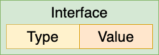
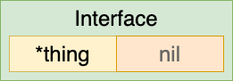
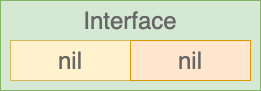

TODO: Подумать, удовлетворяет ли `nil` типу `interface` (вроде удовлетворяет любому интерфейсу).

`interface`  – описывает некоторый *method set*. Значение *uninitialized variable* с типом *interface* – `nil`.

`interface` является абстрактными типом и не позволяет создавать его экземпляры.

`interface` лежит в основе *duck typing*, поддерживаемой в Go (аналогично реализовано в Python). Для того чтобы конкретный `type` удовлетворял *interface*'у, достаточно (!!!) чтобы он имел реализацию *method*'ов, определяемых *interfacе*'ом. Т.е. не требуется формально определять связь между `interface` и конкретным `type`. `type` будет автоматически удовлетворять всем `interface`'s, методы которых он реализует.

Как правило, компилятор Go на этапе компиляции (статически) проверяет, реализует ли *type* указанный *interface*. Однако если один *interface type* преобразуется в другой *interface type*, то Go делает проверку во время выполнения (динамически). Если преобразование недопустимо, т.к. *value type*, храняющий в *interface value*, не соответствует *interface type*, в который оно преобразуется, - программа завершится c *runtime error*.

Если некоторый *type* реализует *interface*, то и *pointer* на этот *type* также реализует *interface* (есть проблемка с *reciever*'ами [1](#приведение-value-и-pointerа-к-interfaceу)). Поэтому нет никакого смысла создавать pointer на *interface*. 

Удовлетворяющий `interface` конкретный `type` может быть приведен к нему и подставляться в те места кода, где требуется этот `interface`. 

```
InterfaceType      = "interface" "{" { ( MethodSpec | InterfaceTypeName ) ";" } "}" .
MethodSpec         = MethodName Signature .
MethodName         = identifier .
InterfaceTypeName  = TypeName .
```

 В определении *interface*'а могут:

- явно указываться спецификации *method*'ов (`MethodSpec`). Слово `func` перед `MethodName` не пишется!!!

  ```go
  interface {
  	Read([]byte) (int, error)
  }
  ```

- или указываться имена других *interface*'ов, методы которых будут встроены в этот *interface* (`InterfaceTypeName`). `A` называется *embedded* (встроенным) *interface*'ом в `B` ([link](#embedded-interface))


*Method set interface*'а – это объединение явно указанных *method*'ов и *method*'ов *embedding interface*'s.

Если в коде указана переменная с *interface type*, это значит, что исходное значение было приведено к этому *interface type*, т.е. теперь к переменной нужно обращаться так, что она является именно этим *interface* (подробнее как хранится *interface* [1](#internal)).

```go
func Do(i interface{B()}) {
	// Здесь переменная i является interface type
}
```

*Interface type* может быть реализован *struct type* с привлечением его *promoted field*:

```go
type I interface {
	F()
}

type S1 struct {}

func (m S1) F() {}

type S2 struct {
	S1
}

func main() {
	s2 := S2{S1{}}

	var s I
	s = s2 // OK
}
```

В *interface type* как правило не указывают названия аргументов для *method*'ов, т.к. в соответствии с *type identity* ([link](#type-identity)) названия аргументов *method*'ов не учитываются для проверки идентичности типов.

### Embedded interface

```go
type A interface {}
type B interface {
	A
}
```

`B`'s method set – *union* из:

- `B`’s явно объявленных *method*'ов 
- `B`’s *embedded interface*'s.

```go
type Reader interface {
	Read(p []byte) (n int, err error)
	Close() error
}

type Writer interface {
	Write(p []byte) (n int, err error)
	Close() error
}

// ReadWriter's methods – Read(), Write() и Close().
type ReadWriter interface {
	Reader  // включает Reader's methods в ReadWriter's method set
	Writer  // включает Writer's methods в ReadWriter's method set
}
```

 [TODO!!!](https://golang.org/ref/spec#Interface_types) 

### Empty interface `interface{}`

Все *type*'s удовлетворяют и могут быть приведены к *empty interface* (пустой интерфейс), т.к. он не требует от `type` реализации ни каких методов:

```go
interface{}
```

Например, *function*, которая в качестве аргумента может принимать значения любого *type* (т.к. значения любого *type* удовлетворяют и могут быть приведены к `interface{}`)

```go
func do(v interface{}) {
   // ...
}
```

Это аналогично:

```go
var v interface{} = a
```

Часто ошибочно говорят, что переменная `v`  может быть любого типа, что неправильно. Все значения в Go имеют только один *static type*. *Static type* для переменной `v` – `interface{}`, т.е. при присвоении значения будет выполнено преобразование типа в `interface{}` (подробнее как хранится *interface* [1](#internal)). А *type* переменной `a`, который вложена в *interface*, называется *dynamic type* (или *underlying type*???).


*Empty interface* может использоваться для ссылки на значение любого `type` (подобно `void*` в C++)

Таким образом, объявление *slice*, к элементам которого могут быть приведены значения любых `type`:

```go
type Stack []interface{}
```


### Internal

#### Interface value

Рассмотрим тип:

```go
type Binary uint64

func (i Binary) String() string {
    return strconv.Uitob64(i.Get(), 2)
}

func (i Binary) Get() uint64 {
    return uint64(i)
}
```

Пусть рассматривается 32-*bit* машина. Т.е. в результате присвоения для переменной `uint64`  выделяется два 32-*bit word*:

```go
b := Binary(200)
```


Если объявить интерфейс:

```go
type Stringer interface {
    String() string
}
```

и привести переменную к типу этого интерфейса:

```go
s := Stringer(b)
```

При таком приведении `Binary` *type* становится *underlying type* для `Stringer` *interface* (??? правильный термин *underlying*). 


Т.е. значение будет представлено в виде структуры, состоящей из двух *word*:

- *pointer* на  *interface table* или *itable* (в коде на C называется `ITab`). *itable* относится к *interface type* (`Stringer`), а не к к *dynamic type* (`Binary`). В начале *Itable* расположена информация о типе (*type(Binary)*), затем – список *pointer*'ов на *method*'s. *itable* для интерфейса `Stringer`, в который вложен тип `Binary`, содержит только *pointer*'ы на *method*'ы *underlying* типа (`Binary`), которые определены в интерфейсе `Stringer` (метод `String`). *Pointer*'s на те *method*'s, которые отсутствуют в интерфейсе `Stringer` (`Binary.Get()`), отсутствуют в этой *itable*. 

  Конкретная *itable* специфична для пары – *value type* и *interface type*. Такая *itable* построена только один раз и закеширована для каждой пары *types*.

- *pointer* на *underlying* данные. Это будет копия исходных данных из переменной `b`, т.к. выполнялось присваивание. В *interface structure* хранится только *pointer*, сами данные размещаются в *heap*.

Упрощенно, можно представить, что *interface* хранит *type* и *underlying value*:



`Value` и `Type` также называют *dynamic*, т.к. они могут содержать разные значения во время выполнения программы.

Это можно изучить *builtin function* `println()`:

```go
	var s string = "syz"
	var i interface{} = &s

	println(&s)  // 0xc000044768
	println(i)   // (0x1062060,0xc000044768)  
  						 // Хранит pointer на itable и значение &s
```

Т.е. *interface variable* по сути является контейнером, в который вкладываются *underlying* данные.

Чтобы проверить, какой *type* находится внутри *interface variable* `s` (например, при использовании `s.(Binary)`), считывается значение `s.tab->type`.

При вызове `s.String()` генерируется код вида `s.tab->fun[0](s.data)`, т.е. в функцию в качестве первого аргумента передается *pointer* на данные.

Т.е. при вызове *method*'а для *interface type*: загрузить адрес *itable*, загрузить конкретный элемент из *itable* и вызвать его.

#### Примеры

##### *Slice* из *interface*

Если определен `interface`:

```go
type Animal interface {
    ...
}
```

и *type*'s, которые удовлетворяют этому *interface*: `Dog`, `Cat`, `Liama`. 

Тогда можно переменные этих *type*'s поместить в один *slice* с типом `Animal`:

```go
animals := []Animal{Dog{}, Cat{}, Llama{}}
```

Внутри `animals` *slice* каждый элемент имеет `Animal` type, но разные элементы могут иметь разные *underlying type*'s (`Dog`, `Cat`, `Llama`).

##### Преобразование `[]T` в `[]interface{}`

Преобразовать `[]T` в `[]interface{}` напрямую через присвоение невозможно, т.к. это – *slice*'s со значениями разных *type*'s:

```go
names := []string{"stanley", "david", "oscar"}
var vals []interface{}

vals = names // Ошибка!!! Cannot use 'names' (type []string) as type []interface{}
```

Такое преобразования можно сделать, пройдя по всему *slice* и выполняя автоматическое приведение каждого элемента отдельно:

```go
names := []string{"stanley", "david", "oscar"}
vals := make([]interface{}, len(names))
for i, v := range names {
  vals[i] = v
}
```

#### Приведение *value* и *pointer*'а к *interfac*'у

В *interface variable* может быть сохранено:

- *value* для *underlying type*. В этом случае *underlying* данные в структуре интерфейса – это самое *value*
- *pointer* на *value*. В этом случае *underlying* данные в структуре интерфейса – это *pointer* (`&value`).

Т.е. если некоторый *type* реализует *interface*, то и *pointer* на этот *type* также реализует *interface*. Поэтому нет никакого смысла создавать *pointer* на *interface*. 

Это можно изучить *builtin function* `println()`:

```go
	var s string = "syz"
	var i interface{} = &s

	println(&s)  // 0xc000044768
	println(i)   // (0x1062060,0xc000044768)  
  						 // Хранит pointer на itable и pointer на data
```


И через *value* и через *pointer* можно вызывать *method*'ы, т.к. `*T` включает *method set* для `*T` и `T` ([1](#method-set)), а для `T` может выполняться автоматическое приведение к `*T` ([1](#автоматическое-приведение-pointer-value-и-value-pointer)).

```go
package main

/* Интерфейс Animal */
type Animal interface {}

/* Структура Cat */
type Cat struct {}

func main() {
  var a Animal = Cat{} // OK, тип выводится как {main.Animal | main.Cat}
	var b Animal = &Cat{} // OK, тип выводится как {main.Animal | *main.Cat}
}
```

Сохранение в *interface variable* для *type*'s с разными видами *reciever*'ов (*value reciever*, *pointer reciever*) в *method*'ах:

- Для тех *type*'s, у которых *method*'ы принимают *value reciever*. 

  В *interface variable* можно сохранять как *value*, так и *pointer*. Т.к. *method set* любого *pointer type*  `*T` – множество всех его *method*'s, объявленных с *receiver type* `*T` или `T`  ([1](#method-set)).

  ```go
  /* Интерфейс Animal */
  type Animal interface {
  	Speak()
  }
  
  /* Структура Cat */
  type Cat struct {}
  
  /* Method принимает value reciever */
  func (c Cat) Speak() {
  	fmt.Print("Meow")
  }
  
  
  func main() {
  	// Приводим структуру Cat к интерфейсу Animal
  	var a Animal = Cat{} // OK. Сохранение value
    var b Animal = &Cat() // OK. Сохранение pointer'а
  }
  ```

  Т.е. *method* `func (c Cat) Speek()`  включен как в *method set* для `Cat`, так и в *method set* для `*Cat`.

- Для тех *type*'s, у которых *method*'ы принимают *pointer receiver*.

  В *interface variable* можно передать только *pointer*, но не *value*. Т.к. *method set* для любого типа `T` содержит все *method*'ы, объявленные с *receiver type* `T` (но не содержит *method*'ы с *receiver type* `*T`).

  ```go
  /* Интерфейс Animal */
  type Animal interface {
  	Speak()
  }
  
  /* Структура Cat */
  type Cat struct {}
  
  /* Method с pointer reciever */
  func (c *Cat) Speak() {
  	fmt.Print("Meow")
  }
  
  
  func main() {
  	var a Animal = &Cat{} // OK. Сохранение pointer'а
  	var b Animal = Cat{} // Error: Cat does not implement Animal (Speak method has pointer receiver)
  }
  ```

  Т.е. *method* `func (c *Cat) Speek()` включен в *method set* для `*Cat`, но не включен в *method set* для `Cat`.

- Для *struct type* с *promoted method* действует специальные правила при разных сочетаниях (*promoted by pointer* и *promoted by value*; *receiver by value* и *receiever by pointer*) ([link](#struct-type))

TODO!!!! Почитать еще тут [link](https://stackoverflow.com/questions/23044855/what-is-the-reason-golang-discriminates-method-sets-on-t-and-t/23046811#23046811)

#### *Pointer* на *interface*

Технически можно создать *pointer* на *interface*, но обычно в этом нет смысла, т.к. и *value* и *pointer* некоторого *type* можно привести к типу *interface* (не *pointer*)

Через *pointer* на *interface* нельзя вызвать *method*'ы *underlying type*. *Pointer* на *interface* вообще не имеет методов, поэтому вызов *method*'а через *pointer* на *interface* всегда неверен.

```go
type Animal interface {
	Speak()
}

type Cat struct {}

func (c Cat) Speak() {}

func main() {
	var a Animal = Cat{}
	p := &a  // Создание pointer'а на interface
	p.Speak()  // Error! p.Speak undefined (type *Animal is pointer to interface, not interface)
}
```

*Pointer* на *interface*:

- можно присвоить переменной с этим *interface type* для `interface{}` (пустого *interface*)

- нельзя присвоить – для непустых interface

  ```go
  type Empty interface {}
  type Nonempty interface {F()}
  
  func f (empty Empty, nonempty Nonempty) {
  	var a Empty = &empty        // OK
  	var b Nonempty = &nonempty  // Error. Cannot use &nonempty (type *Nonempty) as type Nonempty
  }
  ```

  

- 


#### Построение *itable*

Для каждого *concrete type* (например, `Binary`) создается своя *method table* (аналог *itable*) (как она выглядит??? она создается, наверное, в одном экземпляра для каждого *concrete type*). Эта *method table* содержит список *method*'ов, который реализует этот *specific type*.

Аналогично, для кажого *interface type* (например, `Stringer`) создается своя *method table*, которая содержит его список *method*'ов.

Во время выполнения программы автоматически создается *itable*, путем сопоставления *interface type's method table* и *concrete type's method table*. Полученная *itable* кешируется, чтобы ее не вычислять повторно.

#### Оптимизации

(1) Если выполняется присваивание к пустому *interface{}*, без *method*'ов:

```go
any := (interface{})(b)
```

тогда вместо *pointer* на *itable*, в *value* хранится *pointer* непосредственно на *type*:


(2) Если определен *type*:

```go
type Binary32 uint32
```

В этом случае значение для 32-*bit machine* помещается в одном 32-*bit word*. 

Тогда если привести переменную этого *type* к *interface* `Stringer`:

```go
b32 := Binary32(300)

s32 := Stringer(b32)
```

то данные будут хранится непосредственно в *interface value* и не нужно их размещение в *heap*:


На этом рисунке данные используются напрямую `Binary32.String` (? `s32.data`), т.к. данные встроены прямо в *interface value*. На 1 рисунке выше, данные использовались через разыменование *pointer*'а `*Binary.String` (`*s32.data`). 

(3) Если `b32` приводится к пустому *interface{}*, то можно использовать обе оптимизации (1) и (2):


### nil interface

#### *concrete value* равно `nil`

Пусть *concrete value* (*underlying* данные) внутри *interface* равно `nil`.

```go
type I interface {
	M()
}

type T struct {
	S string
}

func (t *T) M() {
	fmt.Printf("(%v, %T)\n", t, t) // (<nil>, *main.T)
}

func main() {
	var (
		i I
		t *T
	)

	i = t
	fmt.Printf("(%v, %T)\n", i, i) // (<nil>, *main.T)  
	i.M()
  fmt.Print(i == nil) // false
}
```

Как видим:

- *method* будет вызываться с `receiver = nil`.
- хотя  `concrete value = nil`, само *interface value* `i != nil`.

Пример, как это выглядит в памяти:



Пример проблемы:

```go
func main() {
	err := doSomething()
	if err != nil { // err != nil
		// ...
	}
}
func doSomething() error {
	var p *MyError
	
	// ...
	
	return p // p == nil
}
```

Из функции возвращаем кастомный *error* со значением `nil`. Т.к. он приводится к `interface error` в итоге оказывается, что `err != nil` ВСЕГДА!

Правильная реализация:

```go
func doSomething() error {
  {
    // ...
    return &MyError{"error"} 
  }
	
	return nil
}
```


## *interface* равен `nil`

Если *interface* равен `nil`, то он не содержит:

- ни *value*
- ни *concrete type*

Вызов *method*'а на `nil` *interface* вызывает *panic: runtime error*, т.к. указатель на *itable* отсутствует (`nil`?) и непонятно какой *concrete method* вызывать.

```go
type I interface {
	M()
}

func main() {
	var i I

	fmt.Printf("(%v, %T)\n", i, i) // (<nil>, <nil>)

	i.M() // panic: runtime error: invalid memory address or nil pointer dereference
}
```

В памяти:



Т.е. *interface* равен `nil` только в том случае, если *Value* и *Type* пусты.

