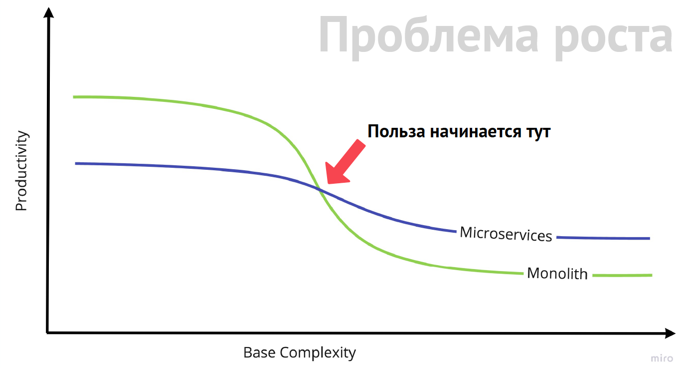

# Правила построения архитектуры

Основные правила надежности:

- использовать проверенные технологии
- сбор бэкапов
- мониторинг (профилирование), измерять все аспекты работы системы.  

Архитектура должна развиваться постепенно в соответствии с нагрузкой.

Правило 95 процентиля: стоит пренебречь 5% пользователей (использующих нестандартные браузеры, нестандартные файлы для загрузки, имеющих большие объемы данных), чтобы не усложнять архитектуру и отладить ее под большинство пользователей.

Для для большинства предметных областей (соцсети, ...), за исключением банковских систем, часто можно пожертвовать стопроцентной надежностью:

- потерять немного данных
- уйти в downtime.

Это позволяет снизить нагрузку на систему, упростить архитектуру, снизив стоимость системы в ущерб надежности.

# Мониторинг (профилирование)

Также [Observability](Observability.md)

Типы мониторинга:

- Мониторинг серверов – мониторинг серверного железа и серверного ПО

- Мониторинг на уровне приложения – как работают подсистемы самого приложения, как они взаимодействуют с внешними сервисами

- мониторинг на уровне бизнес-логики – метрики по бизнес-объектам (сколько сделана заказов, сколько оставлено комментариев...)

Мониторинг включает

- сбор метрик

- сбор логов, ошибок

- трейсинг сообщений между сервисами в микросервисной архитектуре

Мониторинг решает проблемы:

- Расследование инцидентов

- Прогнозирование нагрузки

Основные внешние метрики проекта:

- RPS;

- время обработки запроса (включая перцентили);

- количество используемой памяти.

## Инструменты мониторинга

Виды инструментов мониторинга:

- *SaaS* (*software as a service*) – клиенту предоставляется внешний сервис для мониторинга, который полностью обслуживается другой стороной:
  - New Relic

- *Self-hosted* решение:

  - *Zabbix*

  - *Grafana*

### Внутренние метрики

Общие метрики:

- время ответа сервиса

- RPS к сервису


База данных:

- количество записей в таблицах


Очереди сообщений:

- длина очереди


- время нахождения сообщения в очереди


Memcached:

- соотношение hit/miss;


- топ нагруженных ключей;


- все внутренние метрики, которые отдаёт команда stats.


# Расчеты метрик

### Метрики памяти

Количество памяти, требуемое некоторому многопроцессному (или многопоточному) приложению (Apache, nginx, MySQL) определяется по формуле:


​                                 

  

Общее количество памяти ограничено доступной на сервере оперативной памятью. 

Если известно количество доступной на сервере памяти, то можно определить максимально возможное количество воркеров из предыдущей формулы:

  

### Метрики для RPS

Самый простейший случай, который можно посчитать, – один воркер обрабатывает только один запрос (Apache, MySQL). Nginx может на одном воркере обрабатывать несколько запросов.

Пусть на одном воркере обрабатывается только один запрос. 

Если известно количество параллельных воркеров ( в соответствии с ограничениями памяти, производительностью процессора, I/O) и среднее время выполнения запроса, то можно узнать максимально возможную RPS (более формально, называется законом Литтла ([1](https://ru.wikipedia.org/wiki/%D0%97%D0%B0%D0%BA%D0%BE%D0%BD_%D0%9B%D0%B8%D1%82%D1%82%D0%BB%D0%B0))

```
RPS = <количество_воркеров> / <среднее_время_обработки_запроса>
```

Из формулы можно выразить количество воркеров, которые требуется для того чтобы выдержать нужную нагрузку RPS:

```
<количество_воркеров> = RPS × <среднее_время_обработки_запроса>
```


### Неравномерность RPS в течении дня

Для нагруженного сайта критически важно не суточное число запросов, а мгновенное. 10 млн суточных хитов (динамики) – это 116 запросов в секунду при совершенно равномерном распределении за сутки.

Нагрузка будет распределена равномерно в том случае, если все пользователи географически размазаны равномерно по часовым поясам. 

 Однако, чаще всего пользователи сосредоточены в каких-то конкретных часовых поясах и  характерным является 16 нагруженных часов с двумя/тремя пиками нагрузки (развлекательные ресурсы, fishki.net) или 50-100-200 рывков по 300-700% хитов на фоне тех же 16 часов среднего трафика (электронные сми).

### Примеры расчетов

#### Расчет количества памяти для поддержания нагрузки с нужным RPS на веб-сервере

Исходные условия:

·  веб-сервер Apache, который обрабатывает один запрос в одном воркере

·  нагрузка 500 RPS

·  время обработки запроса 40-100 мсек (у нас 40мсек). Для справки: у сложного фреймворка время обработки запроса 80-100 мсек, для легкого запроса время обработки 40-50 мсек. 

·  накладные расходы Apache на один воркер составляют 10 Мб

·  примем количество памяти, требуемое для ядра Apache, равным 0.

Найдем объем памяти для работы Apache:

  

  

  

#### Расчет количества памяти, потребляемого MySQL

Память, требуемую для ядра, составляют следующие кеши:

·  Пул буферов InnoDB innodb_buffer_pool_size. Подробнее Параметр innodb_buffer_pool_size

·  Буфер ключей MyISAM key_buffer. Подробнее Конфигурирование

·  Кеш запросов (Qcache) query_cache_size. Подробнее Конфигурационные параметры

Память, требуемая для каждого воркера, складывается из:

·  read_buffer_size — кэш под полные сканы таблиц (sequential scan);

·  read_rnd_buffer_size — кэш используется для какой-то специфической  Multi-Range Read optimization при сортировке;

·  sort_buffer_size — кэш, в котором выполняется сортировка результатов;

·  thread_stack — размер стека треда;

·  join_buffer_size — кэш, используемый при соединениях (JOIN).

Максимальное количество воркеров определяется директивой max_connections. 

Поэтому максимально потребляемую память можно рассчитать по формуле, написанно выше:

# Типы трафика

Для каждого типа трафика требуется свое аппаратное решение и программное решение, которое учитывает особенности этого трафика. 

При использовании HTTPS требуется более мощный процессор для работы с шифрованными данными.

Основные типы трафика:

- динамический HTML (dynamic)


- запросы к API – короткий запрос и короткий ответ, важны малые задержки на ответ (*latency*)


- cтатика (*static*) – большой объем ответа, задержки не очень чувствительны для пользователя, важна высокая скорость передачи данных (*сhannel capacity*).


- upload от пользователя – большой объем запроса, также высокая скорость передачи данных (сhannel capacity).


- 


# Алгоритм масштабирования приложения

Масштабирование любого Web приложения — это постепенный процесс, который включает:

1. Анализ нагрузки через мониторинг.

2. Определение наиболее подверженных нагрузке участков.

3. Вынесение таких участков на отдельные узлы и их оптимизация.

Этапы развития архитектуры по мере нарастания нагрузки:

1. На одном сервере *nginx*, *PHP-FPM* (*Apache*) и БД

2. Вынесение БД на отдельный сервер

3. Вынесение *nginx* на отдельный узел, проксирование запросов к скриптам на *PHP-FPM* (*Apache*) и отдача статики непосредственно nginx. Сервер PHP обычно называют бекендом.

4. Организация нескольких бэкэндов за *nginx*, т.к. PHP начинает тормозить всю систему. *Nginx* умеет балансировать нагрузку между ними. Для этого необходимо выделить список бекендов в `upstream` и использовать его в конфигурации. Можно использовать веса бекендов, если какие-то из них мощнее, чем другие.

5. Кэширование. Например, для хранения сессий. Memcache может быть представлен в виде кластера серверов с *consistent hashing*. 

Этапы развития БД при масштабировании: 

- репликация для масштабирования чтения 


- функциональное секционирование. Например, для системы блогов разбить данные на три части: пользователи, сообщения и комментарии. Их можно поместить на разные *nod*'ы (вначале это может быть один узел, а потом *master-slave*), а соединение таблиц выполнять на уровне приложения. 


- шардирование. Например, секционирование сообщений и комментариев (т.к. их больше и они длиннее) по идентификатору пользователя, узел можно организовать в топологии мастер-мастер для надежности. 


# Типы ресурсов

- Процессор


- Память (RAM)


- Disk IO


- Сеть

# Постоянные соединения

Это один из способ ускорения приложения. Постоянные соединения можно организовать между разными частями архитектуры. 

Преимущества:

- Постоянное открытие новых соединений нагружает процессор в системе и генерирует дополнительный служебный трафик. 

Недостатки:

- Хотя выбор соединения из пула требует также времени на сброс состояния  
- Может образовываться слишком много соединений с MySQL. На сервере должно быть доступно открытие большого количества потоков (в MySQL переменная `thread_cache`)

Примеры организации постоянных соединений:

- между бэкэндом и базой ([1](PHP.md#постоянные-соединения))
- между nginx и бэкэндами ([1](Nginx.md#keepalive))
- между браузером и веб-сервером ([1](HTTP.md#постоянное-соединение-keep-alive))

# Способы ускорения

## Программный

База данных:

- Убрать мусорные запросы, типа выбор требуемой базы данных перед каждым запросом. Если требуется менять базы, то можно писать полное именя базы перед таблицей. Убрать команду `SET NAMES UTF8`, которая в любом случае не нужна (она не изменяет кодировку в клиентской библиотеке, а воздействует только на сервер). Кодировку нужно настроить по умолчанию на сервере.

- Настроить индексирование БД ([1](Mysql.md#index))
- Выполнить профилирование системы (запросы к базе данных, кода) и оптимизировать узкие места
- если выполняются группы запросов к базе данных, то можно их запаковать в транзакцию ([1](#ускорение-группы-операций-через-транзакции))
- закрывать соединения с БД, если они не нужны, чтобы освобождать потоки MySQL

Другое:

- Использовать gzip сжатие
- отключить ненужные модули в службах (Apache, PHP)
- постоянные соединения ([1](#постоянные соединения))
- использовать кеширование на всех уровнях (приложение, *in-memory*, БД, браузер)
- не использовать *apache* или ставить перед ним *nginx*.

## Архитектурный

- *Scaling* ([1](#scaling))

Начинают с программной оптимизации. Однако существует точка сокращения отдачи, когда каждая следующая программной оптимизация требует все больше усилий и дает все менее заметный результат, хотя сложность приложения при этом быстро возрастает. В этом случае переходят к *scaling*'у.

# Scaling

*Scaling* (масштабирование системы) – применяется, если 

- один узел не справляется с нагрузкой на чтение или на запись. Происходит снижение производительности – в виде замедления обработки запросов, большего потребления процессора, ввода/вывода, роста конкуренции между запросами.
- данных так много, что они не помещаются в *storage* на один сервер
- *working set* очень большой, данные и индексы не помещаются в память одного сервера.

Виды *scaling*'а:

- *Scaling up* (масштабирование по вертикали, вертикальное масштабирование) 
- *Scaling out* (масштабирование по горизонтали) (существует много разновидностей).
- *Scaling back* (масштабирование наоборот) – удалить или заархивировать данные, которые используются редко или не используются вовсе.

Как правило, начинают с *Scaling up*, т.к. этот вид масштабирования не требует существенного изменения архитектуры. Другие техники *scaling*'а требует существенного усложнения архитектуры. 

Следствия этого:

- перед проектированием системы нужно оценить, с какой нагрузкой придется иметь дело. Если оценка завышена, то будет зря потрачено некоторое время на разработку, а если занижено, то возросшая нагрузка застанет вас врасплох. При этом нужно учитывать не среднюю, а ожидаемую пиковую нагрузку. Приложение должно ее выдерживать.
- перед решением проблем с нагрузкой необходимо выбрать наиболее дешевый из двух подходов:
  - выполнить *Scaling up* и не тратить деньги на время разработчиков и перепроектирование архитектуры
  - выполнить *Scaling* с изменением архитектуры и сэкономить на железе

## Scaling up

*Scaling up* (масштабирование по вертикали, вертикальное масштабирование) – покупают более мощные серверы. 

Имеет смысл для того, чтобы выиграть время и переделать архитектуру системы. Работает в течение некоторого времени, но лишь до тех пор, пока масштаб приложения не превысит критическую отметку. В какой-то момент наращивание мощности оборудования становится неприемлемым из финансовых соображений. Существует некий диапазон аппаратных решений с оптимальным соотношением цены и производительности. За пределами этого диапазона находится в основном специализированное и, соответственно, более дорогое оборудование.

### MySQL

MySQL не слишком хорошо масштабируется по вертикали, поскольку его трудно заставить эффективно использовать несколько процессоров и дисков. Для текущих версий MySQL пределом является 8 ЦП и 14 дисков. В схеме с репликацией имеет смысл усилить подчиненный сервер, т.к. поток репликации на подчиненном сервере не может толком задействовать несколько процессоров и дисков.

Обычно приложения, работающие на одном сервере, сначала упираются в ограничения при чтении, особенно при обработке сложных запросов. Такие запросы внутри MySQL функционируют в однопоточном режиме и если не хватает памяти и данные не помещаются в кеше, то возникает интенсивное обращения к дискам.

## Scaling out

*Scaling out* (масштабирование по горизонтали) – распределяет работу между несколькими узлами.

Под узлом  (репликасет, node) понимается функциональная единица. Это может быть:

- в простейшем случае один сервер


- *master*-*master* в режиме *active*-*passive*

- *master* и много *slav*'ов

Варианты:

- Большое количество чтения:
  - Кеширование ([1](#кеширование)). Имеет смысл, если на 20% данных приходится 80% нагрузки. 
    
    Примеры кеширования:
    
    - кеширование статических страниц или статических блоков страниц в nginx ([1](#кеширование-ответов-fastcgi-в-nginx))
    - использование распределенных кеширующих систем: memcached ([1](Memcached.md))
    
  - Репликация ([1](Mysql.md#replication)). 
- Большое количества записи:
  
  - Шардирование ([1](Sharding.md)) – масштабирование записи и чтения 
  - Функциональное секционирование

### Функциональное секционирование

Функциональное секционирование, или разделение обязанностей означает, что под разные задачи выделяются разные узлы. Например, можно разделить данные на серверах для OLTP- и OLAP-запросов. В более общем смысле, на каждом узле хранятся данные, необходимые конкретному приложению. Например, отделяются данные новостного раздела, форума, технической поддержки, базы знаний и т. д. Однако рано или поздно какое-нибудь приложение или функциональная область разрастется слишком сильно, и тогда придется искать другую стратегию.

## Scaling back

*Scaling back* (масштабирование наоборот) – архивировать и удалять информацию, ставшую ненужной, чтобы убрать данные с сильно нагруженного OLTP-сервера. Это могут быть данные:

- к которым редко обращаются. 
- для которых явно установлен *Expiration_time*

Архивированные данные можно хранить в отдельных таблицах и обращаться к ним через представления или даже полностью переместить на другой сервер. Например, в Badoo неактивные пользователи перемещаются на «кладбище».

Наличие связей между данными может усложнить архивирование и удаление. Хорошо спроектированная программа архивирования сохраняет логическую согласованность. В процессе масштабирования приходится на время идти на нарушение ограничений внешних ключей при перемещении связных данных.

Данные переносятся в архив в фоне, отдельным демоном. Он работает в моменты низкой загрузки серверов.

После переноса данных в архив можно:

- при обращении к ним выдавать ошибку

- Зачастую можно убрать значительно больше данных, если процедура архивирования дополняется стратегией извлечения информации из архива (разархивирование). Если вход невозможен из-за отсутствия пользователя, то программа посмотрит, нет ли такого пользователя в архиве (в badoo, на «кладбище»), и если есть, то извлечет его оттуда и продолжит выполнение процедуры входа.

Можно не перемещать пользователя из архива, а использовать его данные прямо оттуда, это позволяет отделить активные данные от неактивных (разделить таблицу `users` на `active_users` и `inactive_users`). Это повышает эффективность использования кэша (активные пользователи не вытесняются из кеша массой неактивных) и позволяет применять для активных и неактивных данных различные аппаратные и программные архитектуры (память и диск, HDD и SSD).

В InnoDB единицей кэширования является страница. Если на одной странице умещается 100 пользователей и только 10% всех пользователей активны, то с точки зрения InnoDB каждая страница будет «горячей», и тем не менее 90% данных на странице – пустая трата памяти.

Можно использовать встроенный механизм секционирования таблиц.

Наиболее универсальный механизм разделения данных на горячие – по времени, т.к. недавние данные наверняка будут гораздо активнее более старых. Новые значения поступают на «активный» узел, в котором очень много памяти и быстрые диски. Старые данные уходят на узлы с большими, но сравнительно медленными дисками. Это реализуется через динамическое секционирование, например, указанием в таблице пользователей: 

```mysql
CREATE TABLE users ( 
	user_id int unsigned not null, 
	shard_new int unsigned not null, 
	shard_archive int unsigned not null, =]
	archive_timestamp timestamp, 
	PRIMARY KEY (user_id) 
);
```

# Кеширование

<u>Требования к кэшируемым данным:</u>

- большое количество запросов на чтение


- малое количество вариантов кешируемых данных (например, результаты поиска нет смысла кешировать)


- редкие изменения (инвалидация)


Согласно закону Парето 20/80 – 80% запросов приходятся на 20% данных. И задача стоит выявить эти 20% данных и разместить их в кеше, в быстрой памяти.

Кеширование можно также рассматривать, как один из способов снизить *time cost* в обмен на *space cost* ([1](Algorithm.md#space-time-trade-off)). 

Результат работы функции может быть закеширован только в том случае, если функция обладает *ссылочной прозрачностью* (*referentially transparent*); то есть, если вызов функции имеет тот же эффект, что и просто возврат результата этой функции (я думаю, это связано с нульпотентностью).

<u>Расчет накладных расходов:</u>

Кэширование не всегда полезно, т.к. с кэшированием связаны определенные накладные расходы: 

- необходимо проверить наличие данных в кэше и обслужить запрос оттуда в случае попадания. 

- необходимо поместить данные в кэш или сделать их недействительными.

- усложняется логика работы приложения


Кэширование полезно лишь в том случае, когда:

```
Стоимость обслуживания с кешем < Стоимость обслуживания без кеша
```

- Стоимость обслуживания без кэша – это стоимость генерации данных при каждом запросе. 

- Стоимость обслуживания с кэшем:

  *C<sub>с кэшем</sub> = С<sub>проверки </sub>+ p<sub>непопадания </sub>× С<sub>генерации</sub> + p<sub>попадания </sub>× С<sub>выборки из кэша</sub>*

  p<sub>попадания </sub> называется hit, p<sub>непопадания</sub> – miss. 

Как правило, эффективность работы системы кеширования оценивают по *hit ratio*. Считается, что если *hit>95%* - отлично, *hit<80* – плохо.

<u>Типы кешей по активности:</u>

Кэши можно подразделить на пассивные и активные:

-  Запрашивая что-то из пассивного кэша, вы либо получаете результат, либо сообщение «такого у меня нет» (пример *memcached*). 
- Активный кэш передает поступивший запрос какой-то другой части приложения, которая и генерирует затребованный результат. Затем кэш сохраняет его и возвращает запросившей программе (пример - *nginx* с модулем кэширования). Активные кэши являются прозрачными и скрывают логику проверки, генерации и сохранения. Активные кэши строятся поверх пассивных.

<u>Недостатки:</u>

Кеширование иногда маскирует проблемы в системе, которые в обычные периоды времени (*cache hit ratio* высокий) не заметны. Но при нарастании нагрузки чаще выполняется инвалидация кеша, большее количество потоков занято перегенерацией кеша и система падает из-за того, что значительно вырастает время обработки одного запроса, не хватает потоков для обработки всех запросов ([1](#расчеты метрик)).

<u>Паттерн реализации кеширования в PHP:</u>

Кеширование может вручную явно прописываться в каждую функцию.

```php
function getData()
{
    if (false === ($data = $memcache->get($key))) {
        $data = calculate();
        $memcache->set($key, $data);
    }

    return $data;
}
```

Но по сути процедура кеширования является сквозной функциональностью (cross cuting concern). Поэтому более удобны механизмы автоматического кеширования, когда исходная функция вызывает внутри стандартного шаблона кеширования. Для это могут быть использованы стандартные паттерны (*decorator*, *observer*) или библиотеки АОП ([1](Design.md#аспектно-ориентированное-программирование-аоп))

## Уровни кеширования

Существует много уровней кэширования. Кэширование производится на всем пути следования, включая браузер пользователя. 

Чем ближе кэш к клиенту, тем больше ресурсов в нем хранится и тем он эффективнее, но тем сложнее выполнять его инвалидацию. 

Уровни кеша:

- кеш в браузере и в сети
- кеш между веб-сервером и браузером
- кеш на время запроса в памяти воркера
- кеш в локальной разделяемой памяти
- распределенный in-memory кеш
- кеширование в БД в *in-memory storage*
- кеширование в БД в дисковых *storage*
- кеши на диске

Каждому типу кэша присущи свои характеристики, например размер и задержка.

### Кэширование в БД в дисковых storage

Возможны следующие виды:

- Встроенные кеши MySQL (пул буферов InnoDB, кэш ключей MyISAM, кэш уровня ОС, *query cache*)


- Управляемые пользователем кэширующие таблицы. Кэширующие таблицы существуют дольше, чем большинство кэшей на уровне приложения, поскольку они не исчезают при перезапуске сервера, персистентны.


### Кеширование в БД в in-memory storage

Реализуется через таблицы в *MEMORY storage*. Хотя данные будут очищены после перезагрузки сервера – схемы таблиц будут сохраняться. 

Преимущества:

- поддерживает SQL


- хранением данных в памяти


* создания индексов на основе хеш-таблицы

Недостатки:

- проигрывает более простым методам доступа CRUD, типа Memcached.

### Кеш на время запроса в памяти воркера

Данные кешируются в памяти одного воркера на протяжении обработки одного запроса (как правило, в статической переменной PHP). Принцип работы также называется мемоизация (*memoization*) — сохранение результатов выполнения функций для предотвращения повторных вычислений. 

Реализации функции строится по следующему алгоритму:

- если функция ранее не вызывалась, то она вызывается и результат её выполнения сохраняется в переменную;


- если функция вызывалась, используется сохранённый результат.

```php
function get_name_from_id($user_id) {
    static $name;
    if (!isset($name[$user_id])) {
        $name[$user_id] = $db->select('...'); // Выбрать из базы данных 
    }
    return $name[$user_id];
} 
```

### Кэш в локальной разделяемой памяти

Недостатки:

- локальны
- требуют согласования между несколькими узлами

Библиотеки для реализации – `shmop`, `shm`. 

Примеры применения: 

- таблица шардирования

### Распределенный in-memory кэш

Примеры: 

- memcached. 
- redis

Преимущества:

- Не нужно проблемы согласования, возникающие, когда одна и та же информация локально кэшируется в разных местах.

Недостатки:

- Время задержки выше, чем у локальных
- выше конкуренция, чем у локальных

### Кэши  на  диске

Недостаток:

- Медленные 

Применение:

- объекты, не помещающиеся в памяти
- статическое содержимое: 
  - предварительно сгенерированные изображения, tn-ки ([1](#создание-обработанных-картинок-tnок))
  - статические страницы ([1](#кеширование-статических-страниц)). 
  - сохранить массив данных в  `.js` файл, и сослаться на него в html. `.js` будет закешировано в браузере. Сброс кеша выполняется изменением файла и сменой версии файла в `.html`. 

Периодически запускаемый скрипт может реализовывать любую стратегию управления кешем: 

- TTL (удаление файлов, созданных более N минут назад)
- ограничения размера кэша (LRU, с учетом времени последнего доступа, MRU, LFU).

#### Кеширование статических страниц

Можно генерировать статические страницы и кешировать их на диске. Можно использовать любую стратегию, по аналогии с созданием обработанных картинок (tn'ок) ([1](#создание-обработанных-картинок-tnок))

Необходимо подобрать формат для имени статических страниц, который позволит при запросе серверу *Nginx* проверить наличие статической страницы в папке для запрашиваемого URI.

Если вся страница не является полностью статической, то можно хотя бы закешировать в статические файлы отдельные ее части. Для сборки страницы целиком из статических блоков необходимо применить технологию включения на стороне сервера (*server-side include – SSI*).

### Кеш в браузере и в сети

Это кеши, которые встроены в браузер и находятся между веб-сервером и браузером в сети (*proxy cache, gateway cache*). Наиболее эффективный тип кеша, т.к. находится близко к клиенту. Однако наиболее сложный для инвалидации, поэтому в него необходимо желательно помещать только статические данные (например, изображения).

Преимущества использования:

- Уменьшение времени получения контента в браузере. Важно для клиента.


- снижение сетевого трафика. Для клиента – в случае *browser cache*, для сервера – в случае любых *cache* в сети.


Управление кешированием выполняется с помощью заголовков ответа HTTP ([1](HTTP.md#для-управления-кешированием)). Исторически заголовки кэшировании относились лишь к браузеру клиента, но сегодня следует учитывать их влияние на промежуточные точки в соединении.

#### Freshness и validation

*Fresh* (свежий) контент – контент, у которого установлено время истечения (`Expires`) или другой заголовок (`Cache-Control`), контролирующий время жизни, и он еще не истек. *Fresh* контент берется непосредственно из кэша, без взаимодействия с сервером-источником этого контента.

*Valid* (валидный) контент – контент, который уже устарел, т.е. *non-fresh*, но прошедший процесс *validation* (валидации) на сервере, который подтвердил, что контент актуален и соответственно не требует повторной загрузки на клиент. 

Процесс *validation* для *non-fresh* закешированного контента заключается в дополнении запроса специальными заголовками-валидаторами (`If-Modified-Since`, `If-None-Match`). Если контент браузера актуален, то сервер может его не возвращать, а ответить заголовком `304 Not modified`. Такой запрос называют условным, т.к. процесс его обработки зависит от условия.

#### Browser cache

*Browser cache* (кэш браузера) располагается на компьютере клиента, управляется браузером. Браузер один раз за сессию (текущем сеансе) проверяется *content freshness*, при необходимости выполняет *validation* его или загружает. 

#### Proxy cache

*Proxy cache* (прокси-кэш) – кеш на прокси-сервере в сети, обслуживающем множество клиентов. Запрошенные одним клиентом контент будет сохранен в кеше и может отдаваться другим клиентам. 

#### Gateway Cache

Gateway Cache (кэш-шлюз, reverse proxy cache, реверсивные прокси-кэши). Используются для снижения нагрузки на сервер. Включают в себя балансировщик нагрузки. 

Примеры:

- *nginx* (хорошая статья https://habr.com/ru/post/428127/)

- *Content Delivery (Distribution) Network* (*CDN*, сеть доставки (дистрибуции) содержимого) — географически распределённая сетевая инфраструктура, позволяющая оптимизировать доставку и дистрибуцию *content*'а пользователям. При правильной настройке, CDN передаёт *content* клиентам через самый быстрый и ближайший к нему сервер. 

  Бонус: если вдруг падают сервера, CDN отдает данные из кэша так, что пользователи этого могут и не заметить.

#### Алгоритм работы кеша

1. Проверяется *freshness content*'а. 

2. Если *content* является устаревшим, серверу-источнику будет предложено проверить его *validity*, для того чтобы не загружать *content* целиком заново. 

3. Если *content* – *non-fresh* и *non-valid* – он загружается. 

4. Если заголовки ответа сообщают кэшу не сохранять ответ, он не сохранит.

5. Если в ответе нет информации о *freshness content*'а (`Expires` или `Cache-Control`) и не присутствует *validator* (`Last-Modified` или `ETag`), контент считается некэшируемым.

6. Иначе контент кешируется. HTTPS кешируется также как и HTTP.

#### Стратегия кэширования

Динамический контент как правило не кешируется выставлением заголовка:

```http
Cache-Control: max-age=0, no-cache, no-store
```

Однако иногда динамический контент не меняется какое-то время. В этом случае контент можно закешировать в браузере, если пользователь обращается к странице несколько раз, либо на промежуточных прокси-серверах.

Приемы:

- Если ресурс необходимо перекешировать, то его нужно переименовать, добавив к имени  увеличивающийся номер версии, временной ярлык, хэш.


- Один и тот же контент должен быть доступен по одному URL-адресу


- Динамический контент имеет смысл кешировать, если он статичен некоторое время и зависит только от URL-адреса. Отправку заголовков кеширования и валидацию по запросу (`If-None-Match`) должен обеспечивать скрипт на сервере. 


- Контент, который зависит от куков, информации об аутентификации или от какого-то другого внешнего фактора, нельзя кешировать. 


- Можно сделать динамический контент статическим, т.е. выгрузить его содержимое в файл при очередном изменении и переложить кеширование на веб-сервер.


- Запросы `POST` не кешируются большинством кэшей


- Если требуется на закешированную страницу поставить счетчик, то возможные варианты:
  - Скриптом дергать счетчик и отправлять данные для подсчета (URL).
  - Разместить на кешированной странице **некешируемый** *zeropyxel*, URL страницы можно получить из параметров запроса к *zeropyxel* или из заголовка `Referer`.

- Если хочется кешировать страницы, индивидуальные для каждого пользователя, можно с помощью заголовка `Cache-Control` указать, что требуется проводить *validation* *content*' а при каждом запросе с помощью заголовка (обязательно нужно использовать также `ETag`)

  ```http
  Cache-Control: public, no-cache
  ```

  В запросе на валидацию вместе с заголовком `If-None-Match` будут переданы куки с аутентификацией пользователя. В скрипте можно решить по данным в сессии пользователя: вернуть контент целиком или `304 Not Modified`.

- Если на странице есть элементы, отображение которых отличается для разных пользователей, можно их загружать скриптом с помощью технологии AJAX.


## Типы кешей по уровню обработки

Чем глубже обработка данных перед кэшированием, тем больше времени удается сэкономить при попадании в кэш. Однако чем глубже обработка, тем эти возможности более гибко использовать эти данные.

Уровни (по убыванию глубины обработки):

- готовый HTML – самая глубокая обработка, но самый негибкий для изменений.

  Примеры применения:

  - для страницы гостевого пользователя, которая для всех гостей одинакова

  - в случае maintenance и failure

- блоки в HTML.
- промежуточные данные для формирования HTML

## Cache invalidation

*Cache invalidation* (инвалидация кеша) – это компромисс между полнотой, избыточностью и сложностью этой процедуры. 

Полнота инвалидации — насколько часто в кеше будут содержаться грязные данные. 

Избыточность – как часто кеш будет инвалидироваться без необходимости.

Говорят, что в программировании есть только две по-настоящему сложные задачи: 

- придумывание названий 
- *cache invalidation*

### Инвалидация по времени

Выполняется установкой времени жизни кэша (TTL). Вместе с кэшированным объектом хранится момент истечения срока хранения.

Удаление может выполнять:

- сама система кеширования
- ручной фоновый процесс
- в момент обращения запроса. 

Гарантирует, что сразу после изменения данных кеш грязен. Время, которое кеш остаётся грязным, мы можем легко ограничить, уменьшив время жизни (что в свою очередь сократит процент попаданий). Т.е. при ↓ TTL – полнота инвалидации улучшается, а избыточность ухудшается. Подходит для редко изменяющихся данных или для которых требования к актуальности не критичны.

### Инвалидация по событию

Если кэширование устаревших данных неприемлемо, то необходимо сразу *invalidate* данные в процессе, которые их изменяет. 

Возможны два варианта:

- отложенная генерация. Помечать во всех инвалидируемых ключах, что данные недействительны, грязные, что их нужно перегенерировать в момент чтения


- генерация в запросе. Сразу обновить данные во всех ключах, которые стали *invalid*. 


Желательно обновление кеша производить в фоновом режиме, не связанном с запросами пользователей. Недостаток фонового обновления: 

- усложнение кода
- на каждый кешируемый объект требуется написать инвалидирующий код. 

Есть попытки встроить инвалидирующий код прямо в библиотеку работы с запросами, т.е. отслеживать какие запросы кешировались и при изменении этих данных инвалидировать этот кеш, например, кешируется запрос:

```mysql
SELECT ...
...
where category_id=2 and published=true
```

на все изменяющие запросы, попадающие под это условие делаем *cache invalidation*.

#### Тегированный кеш

Инвалидация при записи очень накладна.  

Применяется версионирование объектов:

- вместе с объектом сохраняется его *version*, которая изменяется вместе с изменением объекта.

   ```
  'key': [
      'data': <данные>
      'version': <версия>
  ]
  ```

- либо *version* выносится в отдельный объект – *tag*. *Tag*  – это некоторое имя и связанная с ним *version*:

  ```
  '<tag_name>': <version>
  ```

  Такой кеш называется тегированным. 

Группа объектов – объекты, связанные и зависящие от *version* некоторого общего объекта (либо имеющие один общий *tag*).

Такую технику можно использовать:

- В кеше (memcached)
- Для кеширующих таблиц в БД. *Version*'s можно хранить в БД или в кеше.

<u>Структура *version*</u>

В качестве *version* можно использовать монотонно возрастающие числа, но это может привести к некорректному поведению при условии возможной потери ключей.

В качестве *version* удобнее использовать *timestamp* (с достаточной точностью, например, до миллисекунд). Тогда увеличение версии тэга будет всегда давать новую, бóльшую версию, даже в случае потери предыдущей версии. Версия тэга формируется на бекендах, их системные часы должны быть синхронизованы (без этого не будет работать и другая функциональность, например, корректное вычисление срока годности кэшей с коротким временем жизни),

Использование текущего времени в качестве версии тэга даёт еще одно преимущество в ситуации, когда БД проекта устроена по схеме мастер-слейв репликации. При изменении исходного объекта в БД мы изменяем версию тэга, связанного с ним (записываем туда текущее время, то есть время изменения). В другом процессе мы обнаруживаем, что кэш устарел, то есть его надо перестроить, перестроение – это читающий запрос (SELECT), который необходимо отправить на слейв-сервер БД, но в силу задержек репликации слейв-сервер еще мог не получить актуальную версию объекта в БД, в результате мы кэш сбросили, но при его перестроении снова закэшировали старый вариант объекта, что неприемлемо. Можно использовать версию тэга при решении вопроса, на какой сервер БД отправить запрос: если разница между текущим временем и версией какого-либо тэга кэша меньше некоторого интервала, определяемого максимальной задержкой репликации, мы отправляем запрос на мастер-сервер БД вместо слейва.

<u>Преимущество:</u> 

- при изменении *version* одного объекта (*tag*'а) происходит *invalidation* всей группы связанных объектов. 
- операции пересчета группы связанных объектов «размазываются» по времени.

<u>Примеры:</u>

Лента постов связана с группой постов, которые в ней отображаются. При изменении одного поста должны измениться все выборки, где этот пост встречается.  

Например, в ленте содержатся два поста `post1` и `post2`. Выделим для них в кеше теги `tag1` и `tag2`:

```
"tag1': <timestamp>
'tag2': <timestamp>
```

При кешировании ленты, запишем в кеш кроме данных самой ленты, текущие (на момент создания кэша) версии тэгов `tag1` и `tag2` (вместе со сроками годности для решения «проблемы стаи собак»)

```
[
	срок годности: 2008-11-07 21:00 
	data: [ … ] 
	tags: [ 
		tag1: 25 
		tag2: 63 
	] 
]
```

При получении кэша мы считаем его валидным, если текущие версии тэгов `tag1` и `tag2` равны версиям, записанным в кэше. Таким образом, если мы изменяем (увеличиваем) версию тэга `tag1`, все кэши, связанные с этим тэгом, которые были построены ранее, перестанут быть валидными (т.к. в них записана меньшая версия тэга `tag1`).  

<u>Недостатки:</u>

Использование такой схемы тэгирования увеличивает количество запросов к *memcached*, т.к. нам необходимо для каждого кэша получать *version*'s его *tag*'s. Накладные расходы можно сократить за счет использование *multi-get* запросов *memcached*.

## Техники

### Кэширование иерархий объектов

Зачастую удобней кешировать не полную выборку из всех таблиц, а данные из связанных таблиц разместить в отдельных кешах и ссылаться на них по первичному ключу. 

<u>Пример:</u> при кешировании ленты можно кешировать только список первичных ключей постов, а сами посты хранить в отдельном кеше. 

<u>Преимущество:</u>

- позволяет не дублировать описание постов в нескольких кешах. 


- позволяет легко выполнять инвалидацию кешей с отдельными постами, изменение поста не требует пересмотра всех кешей, где он хранится. 


Недостатки: 

- требуется несколько запросов в кеш на одну выборку, однако можно реализовать в два запроса: 

  - выбрать ленту постов с массивом `post_ids`
  - сделать `multi_get` в *memcached* с указанием `post_ids`

- возможны проблемы нарушения согласованности данных в кеше, т.к. лента постов и отдельные посты в кеше могут правиться независимо. Например, может измениться дата поста таким образом, что она перестанет попадать в ленту постов за определенный день, однако лента постов еще не удалена из кэша. Если такая ситуация неприемлема, то можно воспользоваться версионированием постов ([1](#инвалидация-при-чтении)) и хранить версии постов в ленте постов. 

### Прогрев кеша

При неправильном распределении нагрузки возможна ситуация чрезмерного охлаждения кеша и поэтому:

- при работе через *in-memory* кеш - привести к попаданию большого количества запросов в  БД. Особенность in-memory кешей в том, что мы можем программно управлять TTL ключа.
- при работе с БД – к большому объему I/O, т.к. данные не были закодированы в памяти (например, в *buffer pool*)

Причем кеш может охладиться как из-за протухания одного очень популярного ключа, так и из-за одновременного протухания большого количества множества ключей. Это может произойти, если:

- выгружен свежий «популярный» функционал на холодный кеш


- (*in-memory*) множество ключей стартовали в одно и то же время и имеют одинаковый срок жизни. После истечения срока жизни ключей все запросы пользователей придут в базу и положат ее.


Основной способ решения заключается в поддержании кеша все время в горячем состоянии. Для это нужно «размазать» по времени протухание кеша и соответственно нагрузку на БД. Добиться этого можно несколькими способами:

- плавным включением нового функционала. Для этого новый функционал выкатывается включённым на небольшую часть пользователей и постепенно количество пользователей увеличивается. В это случае решаются обе проблемы: (1) кеш прогревается постепенно и (2) ключи пользователей будут протухать также постепенно.


- (*in-memory*) разным временем жизни разных элементов набора данных. Этот вариант технически более простой, т.к. функционал может быть включен на всех пользователей сразу. Однако система должна быть в состоянии выдержать пик, который наступит при выкатке всего функционала. Идея заключается в умножении время жизни кэша на случайный множитель. Например, в примере ниже на значение `0.95 ÷ 1.05`:

  ```php
  $random_factor = rand(950, 1050) / 1000;
  $random_ttl = $ttl * $random_factor;
  ```

- ручной или автоматический прогрев кеша. 


  - Для БД – путем повторения запросов на чтение.
  - Для *in-memory* – путем запуска скриптов, которые предварительно закешируют данные.


###  Горячий ключ

#### Горячий ключ на чтение

Как правило, статистика обращений на чтение к ключам в кеше соответствует степенному распределению (и также в принципе, закону 20/80), т.е. большинство обращений идет к небольшому количеству ключей. 

<u>Проблема</u>: имеется один неделимый ключ, на который идет такое большое количество запросов на чтение, что он перегружает свой кеш-сервер (примеры таких популярных ключей: количество просмотров за день, количество зарегистрированных пользователей). Даже при использовании кластеризации в *memcached* ([1](Memcached.md# кластеризация-в-memcached-consistent-hashing)) атомарный ключ невозможно разделить по нескольким серверам и все запросы к нему будут идти на один сервер.

<u>Решение</u>: единственный способ снизить нагрузку на ключ – это задублировать этот ключ на разных кеширующих серверах. 

Самый простой, ручной вариант – писать этот ключ во все кеширующие сервера сразу. Это идеально подходит, если этот ключ может обновлять сразу на всех серверах фоновым процессом. Так как ключ лежит сразу на всех серверах, то его можно выбирать multi_get запросом вместе с другими ключами.

Если используется автоматическое *consistent hashing* , то можно реализовать автоматическое размазывание кеша. Для этого задублируем ключ, добавив к его названию число. Например, из одного ключа `name` получим 10 ключей [`name0`,… ,`name10`]. В каждый из этих ключей запишем одни и те же данные.  Т.к. эти ключи имеют разные название, при *consistent hashing* они будут распределены между разными серверами и соответственно нагрузка также разделиться между разными серверами.

Подбирая количество дублирующихся ключей, можно найти компромисс между преимуществами и недостатками. Много дублей – усиливает недостатки (расход памяти, проблемы с консистентностью), мало дублей – снижает преимущества (нагрузка недостаточно размазывается по серверам). 

<u>Недостаток:</u> 

- больший расход памяти под дублирующиеся ключи. Эта задача пример классического *space-vs-time tradeoff*.


- нужно синхронизировать значение этого ключа на разных серверах


#### Горячий ключ на запись

При совместном доступе приложений к единственной строке БД (ключу *memcached*) с горячим счетчиком возникают блокировки. Например, счетчик общей посещаемости сайта. Единственная строка (ключ) становится глобальным *mutex*'ом для любой транзакции, которая обновляет счетчик. Транзакции оказываются сериализованными. 

Варианты увеличения уровня конкуренции:

- Шардирование ключа. 

  Для распределения нагрузки по записи в одну строку БД (ключ *memcache*) можно воспользоваться шардированием ключа, Например, инкрементируется не один счетчик, а 10 тысяч ключей, при этом получение значения счетчика предполагает `multi_get` всех ключей и сложение в коде. 

  Для БД, обновление случайной строки.

  ```mysql
  INSERT INTO hit_counter (cnt) 
  VALUES (1) 
  WHERE slot = RAND() * 100 
  ON DUPLICATE KEY UPDATE cnt = cnt + 1
  ```

- Если не требуется значительная точность, то можно инкрементировать счетчики с вероятностью, например, `1/10`, снижая нагрузку на кеш в такое же количество раз. При чтении значения счетчика необходимо умножить результат на коэффициент вероятности, получая значение близкое к реальному. 

## Шардирование данных

Если кеширующая система начинает не помещаться по своим требованиям в пределы одного сервера, то вам необходимо воспользоваться приемами масштабирования кеша. Как правило, между ключами отсутствуют связи и поэтому шардирование данных может быть реализованы без существенного усложнения архитектуры. Могут использоваться любые подходы шардирования ([1](Sharding.md)).  При этом достигаются те же преимущества и особенности ([1](Sharding.md#общие-принципы)). Часто применяют простое детерминированное распределение с функцией хеширования по модулю или консистентного хеширования.

<u>Переработать:</u>

Связано с [1](Sharding.md#выбор-ключа-секционирования)

 *выбор сервера на основе хеша ПЕРВИЧНОГО ключа может работать плохо.* Для этого для выбора сервера нужно использовать не ПЕРВИЧНЫЙ ключ, а какой-то другой параметр, к которому нужно будет применить один из описанных подходов. Нельзя сказать, что это будет за параметр, поскольку это зависит от вашей модели данных.

В нашем случае почти все кэшируемые данные относятся к одному пользователю, поэтому мы используем User ID в качестве параметра шардирования данных в кэше. Благодаря этому у нас получается распределить данные более-менее равномерно. Кроме того, мы получаем бонус — возможность использования `multi_get` для загрузки сразу нескольких разных ключей с информацией о юзере (что мы используем в предзагрузке часто используемых данных для текущего пользователя). Если бы положение каждого ключа определялось динамически, то невозможно было бы использовать `multi_get` при таком сценарии, так как не было бы гарантии, что все запрашиваемые ключи относятся к одному серверу.

# High Availability

Доступность (*availability*) - доля времени, в течение которого приложение может отвечать на запросы. Измеряется в «девятках»; так, «пять девяток» 99.999% времени, то есть время простоя составляет примерно пять минут в год.

Высокая доступность в системе гарантируется избыточностью и в случае выхода сервера из строя, подключением резервного. Каждое следующее увеличение степени доступности, как правило, обходится дороже предыдущего, т.е. отношение доступности к потраченным усилиям и стоимости нелинейно. 

Самый важный принцип в деле обеспечения высокой доступности – выявить и устранить точки отказа в системе за счет избыточных ресурсов в системе. Избыточность системы может принимать две формы: 

- запасная пропускная способность


- дублирование компонентов. Пример – поднять реплику, и при падении *master*'а поднять уровень *slav*'а до *master*'а.


При этом не нужно загружать компоненты «под завязку», поскольку в этом случае у вас остается запас для поддержания требуемой производительности при возрастании нагрузки или отказе некоторых компонентов.

*Failover* – переключение на резервный сервер при отказе основного. 

*Failback* – возврат на основной сервер. 

*Degrade mode* – Режим работы с ухудшенными характеристиками при распределении нагрузки вышедшего из строя сервера по другим серверам.

# Причины проблем

- Клиенты при подключении видят ошибку:

  - Скорее всего веб-сервер уперся в ограничение памяти или в ограничение количества *worker*'ов. Например, Apache создал большое количество процессов в режиме *keepalive* (постоянные соединения) и пока эти соединения не закроются, под новые *worker*'ы не хватает памяти. 

    


# Балансирование нагрузки

Балансировка нагрузки (*load balancing*) — механизм распределения запросов между несколькими серверами с целью:

- оптимизации использования ресурсов
- сокращения времени обслуживания запросов
- горизонтального масштабирования
- обеспечения отказоустойчивости (резервирования).

## Использование балансировщика

Балансировщик нагрузки (*load balancer*) — машина или программа, основная функция которой — определить на какой сервер послать запрос. Балансировщики могут быть сконфигурированы в отличии от DNS-балансирования. 

Примеры балансировщиков: 

- Nginx
- HAProxy
- Cisco CSS

Преимущества:

- Умеют периодически отслеживать доступность бэкендов и удалять из пула недоступные серверы. 


- Умеют перебирать по порядку бекенды, пока не найдет доступный бекенд ([1](Webserver.md#модуль-upstream))


Недостатки программных балансировщиков:

- представляют собой единую точку отказа и в случае падения балансировщика – падает вся система. Должны дублироваться


- при наращивании нагрузки и горизонтальном масштабировании становятся узким местом в системе. Трафик упрется в производительность и полосу пропускания узла, на котором размещен *load balanсer*. 


Способ решения этих проблем – применение DNS-балансировки.

## DNS-балансировка

<u>Принцип работы:</u> 

- DNS сервер (возможно даже установленный у нас) отдает несколько IP по одному доменному имени. 
- Клиент выбирает случайным образом один из IP адресов. 
- По «закону больших чисел» нагрузка равномерно размазывается по нескольким узлам.

В случае если выбранный браузером IP адрес не отвечает по 80 порту, то после истечения таймаута, браузер прозрачно для пользователя выбирает другой IP и делает запрос на него. 

<u>Понятие TTL.</u> 

Для DNS-записи в авторитетном DNS-сервере (*authoritative*) устанавливается параметр TTL (Time to live). Когда неавторитетный DNS-сервер получает в результате опроса у авторитетного DNS-сервера какую-то DNS-запись, он кеширует ее на время, указанное в TTL. При разрешении имени для той же DNS-записи с помощью кеширующего неавторитетного DNS-сервера до истечения срока действия TTL, кеширующий DNS-сервер будет отвечать ранее закэшированной DNS-записью, а не снова получать ее от авторитетного DNS-сервера.

Время задаётся в секундах, типичное значение составляет 86 400 секунд, то есть 24 часа. Это означает, что при изменении записи DNS, вплоть до 24 часов после изменения, DNS-серверы по всему миру могут выдавать старые данные из кеша, пока он не будет обновлён. Более короткие TTL могут сильно нагрузить авторитетный DNS-сервер и имеют смысл на случай изменения адреса критически важных сервисов.

Администратор кэширующего DNS-сервера может установить жесткий TTL, который не будет зависеть от TTL авторитетного DNS. Поэтому установка TTL на авторитетном DNS-сервере не может гарантировать, что все кеширующие DNS-серверы будут иметь новые DNS-записи после истечения срока действия TTL

<u>Ограничения.</u> 

Ответ от DNS сервера приходит по протоколу UDP в пакете размером 512 байт. В зависимости от количества служебных данных максимальное количество IP адресов при DNS-балансировке находится в диапазоне 4-25 штук. Как правило балансируют 4-6 адресов.

<u>Преимущества:</u>

- низкая стоимость балансировки, т.к. не требуется никакого программного/аппаратного обеспечения


- отсутствует единая точка отказа.

## Комбинация

Как правило, перед бекендами размещают несколько балансировщиков (минимум два) для load balancing и надежности (исключения точки отказа). Нагрузку между балансировщиками балансируют с посмощью DNS-балансировки.

# Apache

<u>Стоит ли включать в архитектуру Apache?</u> 

Есть мнения за и против. 

Нюансы:

- Apache жрет много ресурсов


- единственное преимущество перед PHP-FPM – файлы `.htaccess`


- по подсчетам Apache дополнительно съедает 200-500Мб ([1](#расчет-метрик)) и процессорное время. Но если честно, то и PHP-FPM жрет память и процессорное время.


# Проблемы множества бекендов

Когда один бекенд с PHP не справляется с нагрузкой, добавляют еще несколько бекендов и распределяют нагрузку между ними каким-либо методом балансирования нагрузки. Помимо снижения нагрузки на один бекенд, это повышает отказоусточивость системы – при выходе из строя любого бекенда, остальные бекенды могут взять на себя его нагрузку.

При переходе к распределенной обработке запросов на множестве бекендов архитектура приложения должна быть перестроена. Результат обработки запроса не должен зависеть от того, на каком сервере он обработан (в пределе *stateless*-код, но так не бывает, чтобы код вообще без состояния).

## Проблема обработки файлов

При наличии нескольких бекендов возникает проблема синхронизации файлов при одновременной их обработке с нескольких бекендов. 

Варианты решения:

- с центральным сервером. Все запросы загрузки и обработки файлов направляются балансировщиком на один бекенд (`adm`). С этого же сервера файл после изменения отправляется на сервера статики, откуда раздается клиентам. Если он нужен на других серверах динамики, то его можно синхронизировать через `rsync`.


- отказаться от локального хранения файлов и хранить файлы в облаке. Наиболее популярны распределенные файловые хранилища с протоколом S3 (например, Amazon S3, Ceph)


## Проблема обработки сессий

Если на одном бекенде в локальной памяти поднята сессия, а следующий запрос балансировщик отправил на другую машину, то новая машина не будет видеть данную сессию. 

Варианты решения:

- постоянство сессий (*session persistence*) или липкость (*stickiness*).

  Nginx как балансировщик поддерживает несколько механизмов, позволяющих управлять балансировкой, и отправлять следующий запрос на ту же ноду, что и предыдущий ([1](Webserver.md#методы-балансировки)):
  - `ip_hash`
  - `hash`
  - `sticky session` (в коммерческой версии).

  Недостаток: балансировщик, который и так является узким местом системы, занят еще и обработкой состояния о том, какой запрос каким сервером обрабатывается.

- Хранить сессии в распределенной кеширующей системе (база данных, memcached). Не имеет значения, на какой из бекендов приходит запрос.

  Преимущество: 

  - не нагружает балансировщик

  

# Взаимодействие с внешним сервисом

Бекенды всегда взаимодействуют с тяжелыми внешними сервисами: 

- базы данных (MySQL)
- поисковые движки (Sphinx). 

В SOA-архитектуре вообще выделены отдельные внешние сервисы под каждую задачу. И в любой момент времени один из сервисов может начать тупить.

Еще более опасно, если обращение идет к стороннему внешнему сервису в сети с непредсказуемым временем исполнения. Например, так:

```php
$data = file_get_content("https://path/to/resource");
```

Если не предусмотрена защита от тупки такого внешнего сервиса, в результате тупки возникает каскадный отказ системы:

- ↑ вырастает время выполнения одного запроса


- ↑ вырастает количество активных воркеров


- бекенд упирает в максимальное количество воркеров


- новые запросы, даже не связанные с тупящим ресурсом, перестают обрабатываться


Способы диагностики проблемы: 

- профилирование через какой-то инструмент, показывающий запросы к внешним ресурсам (newrelic, zabbix?)


- просмотр сетевых соединений через unix-утилиты (netstat, tcpdump)


В зависимости от типа сервиса, взаимодействие с сервисом может выполняться:

- асинхронно (гораздо проще)


- синхронно (сложнее)


## Асинхронная обработка

Более простой вариант, т.к. тяжелое взаимодействие с сервисом можно выполнить в фоновом процессе. Применение любого вида асинхронной обработки сразу снимает проблему, однако не для каждого сервиса это подходит. Например, асинхронно невозможно обращаться к базе данных.

Способы решения проблемы: 

- если данные <u>только читаются</u> и <u>редко изменяются</u>, то их можно закешировать


- если данные <u>отправляются в сеть</u>, то это нужно делать асинхронно через Message Queue. 


### Особенности использования cron

Связано с [1](Memcached.md#фоновое-перестроение-по-cron)

Обработку тяжелых запросов можно выполнять асинхронно с запуском по времени через `cron`.

Необходимо следовать советам:

- в `cron` помещать вызов PHP через CLI, и ни в коем случае не делать обращение к скрипту через веб-сервер. Т.к. это забирает ресурсы веб-сервера и уменьшает количество доступных воркеров.


- внимательно следить за временем выполнения скриптов с отключенным лимитом времени `set_time_limit(0)`, т.к. запрос может подвиснуть и жрать ресурсы системы


- нужно ставить блокировки на повторный запуск процедуры в `cron` до завершения предыдущего запуска. Варианты решения:
  - утилита `setlock` запускает другую программу и одновременно создает `lock`-файл, который служит мьютексом и защищает от повторного запуска
  - критическая секция в memcached

## Синхронная обработка

Синхронная обработка используется, если критично обращаться к ресурсу <u>в контексте запроса</u>.

Способы решения:

- самый простой способ, ставить просто таймаут.

- замаскировать проблему с сервисом – не показывать тот блок на странице, за который этот сервис отвечает. Как только запросы к сервису начнут проходить, блок на странице снова отобразиться. Некоторые сервисы критичны для всего сайта (например, база данных, кеши), в случае их падения пользователю необходимо вывести понятную ошибку (типа, мы в курсе и чиним).
- *Сircuit brеaker*

#### Сircuit brеaker 

Гораздо эффективнее между удаленным сервисом и бекендом разместить *circuit breaker* – проксю, которая бы вырубала тупящий сервис при срабатывании какого-нибудь условия. 

*Circuit breaker* может быть реализован как:

- модуль в коде на PHP


- отдельно стоящий демон, который проксирует через себя запросы.


Для *Circuit breaker* задаются порог предупреждения (*warning threshold*) и порог отключения (*disable threshold*). Когда количество тормозящих воркеров достигает *disable threshold* (например, 10%) *circuit brеaker* перестает отправлять запросы к сервису и сразу отдаёт бекендам ошибку, как будто бы сервис лежит. После этого воркер бекенда может отправить запрос на резервный сервис (например, на другой *slave DB*).

Время от времени *Circuit breaker* автоматически пропускает запрос от какого-нибудь воркера, чтобы посмотреть, не ожил ли всё-таки сервис. Если он отвечает адекватно, то мы снова включаем его в работу.


# Хранение статики

Для хранения статики можно использовать:

- облачный storage – самый простой и дешевый по организации вариант. Чаще всего используется Amazon S3.

- коробочное решение

- хранить у себя в кластере

- сеть хранения данных (Storage Area Network, SAN) — подключеник внешних устройств хранения данных (дисковые массивы, оптические приводы) к серверам таким образом, чтобы операционная система распознала подключённые ресурсы как локальные.

## Хранение статики в своем кластере

Берем кластер из нескольких машин для хранения изображений. 

Применяем схему с *virtual shard*'ами. Организуем два *mapping*'а: 

- картинка → `vshard`. Один из вариантов: хранить всех картинки одного пользователя в одном *vshard*, для этого нужно отображать `user_id` → `vshard`. Можно использовать любые способы задания [*sharding function*](). 
- `vshard` → реальный `shard` (физический узел). Если количество `vshard` и `shard` небольшое, то это отображение может задаваться статически вручную ([table function](#Sharding.md#динамическое-недетерминированное-table-function)).

Для серверов статики обычно характерен небольшой объем входящего трафика, при большом объеме исходящего трафика. Поэтому необходимо масштабировать чтение статики.

Часто имеет место следующий *case*: только что залитые фотки очень горячие, а через какой-то момент времени они перестают запрашиваться. Они составляют небольшой горячий *dataset* (рабочее множество). Этот *case* соответствует ситуации, когда оптимально применение [кеширования]().

*Photocache* – отдельная машина с быстрыми SSD дисками, которая кеширует картинки и при *miss* перенаправляет запросы в *storage*. Для этого на *photocache* установлен *nginx*, который делает `proxy_pass` на *storage* при *miss*.

Общая схема запроса картинки: пользователь → *photocache* → *storage*.  

В photocache все картинки разделены на:

- *hot cache* – папка, в которой хранятся активно запрашиваемые картинки
- *cold cache* – папка, в которую переносятся картинки из *hot cache*, после того как снижается количество *request*’ов к ним. 

В *photocache* *nginx*  ведет `access.log`. В фоне работает *demon*, который считает статистику по доступу к картинкам. На основе статистики *demon* перемещает картинку между cach'ами или удаляет. 

Жизненный цикл картинки в *photocache*:

- картинка попадает в *hot cache*
- при снижении количества запросов картинки перемещаются из *hot cache* в *cold cache*.
- при снижении количества запросов картинки удаляются из *cold cache*.

 

<u>Высокая доступность</u>

Если требуется высокая доступность, то необходимо устранить точки отказа. 

Для данной архитектуры:

- пустой резервный *photocache*, который включается в работу и прогревается при отказе одного из *photocach*'ей.
- дублирование всех *storag*'ей. При этом основной и резервный *storage* могут работать параллельно на чтение (аналогично *replication*). Дублирование картинок выполняется в фоновом процессе.

Для обработки фоновых задач (обработка картинка, копирование на резервный *storage*) следует использовать *Message broker*.

## Особенности картинок

<u>Выбор формата:</u>

- `jpg` – с потерей качества, для сложных изображений, для фотографий
- `webs` – лучше `jpg`, но поддерживается не всеми браузерами
- `png` – без потери качества, для иконок
- `gif` – кодирование по палитре, поддержка анимации

<u>Структура для хранения:</u>

Необходимо использовать древовидную структуру из папок. Это позволит избежать ограничение на количество файлов в каталоге и тормозов системы при работе с такими каталогами. 

Нужно разделить для удобства все картинки по типам: `avatars`, `posts`, `comments`. 

Внутри этих папок наиболее удобно делить файлы в соответствии с бизнес логикой. Например, хранить в виде: `./yyyy/mm/dd/123.jpg`. Так проще удалять старые картинки и делать инкрементальный бекапы.

<u>Порядок загрузки изображения</u>

- уменьшить размер до минимально допустимого, чтобы не хранить огромные фотографии

- удалить метаданные

- преобразовать в дополнительные форматы (`.webp`). 

  При запросе пользователя, необходимо выполнить проверку поддержку `.webp` браузером и в зависимости от этого отдать `.webp` или `.jpg`:

  ```nginx
  server {
  	...
  	location ~* ^/.+\.(jpg|jpeg)$ {
  	  if ($http_accept ~* "webp")    {
  	      rewrite (.+) $1.webp;
  	  }
  	}
  ...
  }
  ```

## Создание обработанных картинок (tn'ок)

На *storag*'ах и *photocash*'ах  простаивает CPU, т.к. основная нагрузка на сеть и на диски. Поэтому CPU может быть загружен созданием обработанных картинок (например, генерацией *thumbnail*'s):

- генерацией *tn*'ок
- перекодирование изображений в более компактные форматы (webp или progressive jpeg)
- resize, crop, накладывание watermark.

Способы создания *tn*'ок.

<u>1 подход</u>

С хранением (кешированием) *tn*'ок для всех картинок. Генерация выполняется в момент загрузки  или после загрузки в фоне. 

Имеет смысл:

- если все изображения примерно одинаково горячие
- не ограничены в объеме storag'ей
- CPU storag'ей не справляют с нагрузкой по генерации thumbnails на каждый request

Особенности:

- ↑ *data size*, ↓ *CPU load*. 
- Ограничены некоторым набором размеров (*tn*'ок) 
- Длительный процесс генерации, если требуются новые *tn*'ки

<u>2 подход</u>

Не генерировать thumbnails заранее и не хранить их в storage. Генерация выполняется налету, в момент *request*'а. 

Имеет смысл:

- если все изображения примерно одинаково горячие
- ограничены в объеме storag'ей
- CPU storag'ей справляют с нагрузкой по генерации thumbnails на каждый request

Особенности:

- ↓ *data size*, ↑ *CPU load*.  
- достаточно иметь несколько *tn*-ок (маленькую, среднюю и большую), а для остальных размеров делать *resize*. 
- можем получить любой точный размер, который запрошен в URL. Это особенно актуально для мобильных версий с невысокой скоростью интернет.
- добавление новых размеров не требует процедуры генерации *tn*-ок для всех картинок.

<u>3 подход</u>

Гибридный подход. С генерацией *tn*'ок в момент первого *request* и кешированием картинки в файловой системе. Объединение преимуществ двух предыдущих подходов. 

- меньше *data size*, чем в 1 случае, и меньше *CPU load*, чем во 2 случае 
- загрузка CPU только в момент генерации *tn*'ки в первый раз
- добавление новых размеров не требует процедуры генерации *tn*-ок для всех картинок.
- сброс кеша осуществляется простым удаление файла.

Имеет смысл:

- если требуется гибко управлять набором закешированных *thumbnails*
- если есть горячие и холодные *thumbnails*

Желательно перед добавлением новой *tn*'ки "прогреть" кеш – запустить генерацию *tn*'ок на небольшом количестве *request*'ов.

Особенно важно избежать "проблемы стаи собак" (dog-pile effect, так же cache stampede) – когда множество запросов будет сделан к одним и тем же "горячим" thumbnails, который в тот момент еще не будут закешированы. Дополнительно, эту проблему можно решить, используя распределенную блокировку через memcache, чтобы одну картинку генерировал только один request, а остальные ожидали его окончания.

<u>Разновидности 3 подхода</u>

Будем генерировать *thumbnails* в момент первого *request*, но кеширование выполнять по какому-то условию. Например:

* если по статистике *thumbnail* запрашивается часто (требуется сбор статистики)
* если *thumbnail* генерируется для свежей фотографии и скорее всего будет горячим.

 Преимущества:

- меньше *data size*, чем в 4 случае, при правильном условии

Способы генерации:

- Наиболее быстро это делает Nginx+LuaJIT.
- с помощью PHP

<u>Технологии для реализации</u>

Nginx:

- как веб-сервер для отдачи статики, если она уже закеширована на диске. Проверяется через `try_files`.
- как *reverse proxy*, который взаимодействует с бекендами, которые генерируют *thumbnails*

Модули nginx:

- `ngx_http_image_filter_module` – для ресайза изображений
- `ngx_http_proxy_module` или `ngx_http_fastcgi_module` – для кеширования

Для ресайза фотографий:

- *Nginx*+*Lua*
- PHP+GD
- *Imagemagick*     


# Интересные задачи и фишки

## Badoo


#### Надежность хранения

##### RAID

Можно использовать аппаратное дублирование даннх через RAID массивы. 

Минусы подхода:

·  задержки при восстановлении поврежденных данных. Например, на восстановление диска из RAID5.

·  в RAID5 скорость чтения/записи равна скорости самого медленного диска

·  система дисков жестко связана. Если глючит один диск – глючит вся система.

##### Ручная репликация статики

Удобней использовать ручную репликацию статики на несколько серверов. 

Плюсы:

·  отдельные узлы для хранения независимы, при выходе из строя узла системы остается доступной

·  нагрузку гораздо проще горизонтально масштабировать

Информация о синхронизируемых фото размещается в очереди, например, через mysql. Т.к. теперь фото читается с основного диска, как пользователями, так и backup разделом. Ставим перед ними буферный диск небольшого размера SSD. Фото вначале попадает в буфер, а потом по event из очереди копируется на основной и backup раздел.

Фотографии лучше делать immutable, не переписывая измененные фото, а создавая новые файлы без хранения версий. 

Возможно использование распределенных файловых хранилищ – ceph + s3 api, minio.

Файлы должны раскладываться на диске по папкам двух уровней вложенности, чтобы преодолеть ограничение на количество файлов в папке. 

### Версионирование API 

Хороший API всегда версионирован. И если нарушается обратная совместимость, то меняется мажорная версия, например, 1.0.0., 2.0.0 и т.д.

Однако у этого подхода есть ряд недостатков:

·  Любое существенное изменение функционала требует инкрементации мажорной версии, причем в старшей мажорной версии должны быть реализованы изменения всех младших, хотя хотелось бы чтобы разные изменения не зависили друг от друга. Например поэтому нельзя выкатить клиент с функциональностью старшей версии без реализованной функциональности младшей версии.

·  Не всем клиентам нужен одинаковый функционал (например, не все разрешают работать с камерой из браузера), поэтому не для всех клиентов мобильных устройств нужно учитывать появление новой версии

·  изменения протокола под AB тесты не соответствуют версиям основных изменений, это отдельное несовместимое изменение протокола. Т.е. протокол зависит не от версии клиента или версии API, а от внутренних настроек.

Лучший вариант – идентифицировать отдельно каждого клиента и предлагать ему такие данные, которые соответствуют его типу. Первый способ – передавать при каждом запросе клиента на сервер тип клиента и его версию. Однако этот способ очень сложен в поддержке если много различных улучшений и тогда объект на сервер, отвечающий за версионность очень сильно разрастается. Также нужно согласовывать между клиентом и сервером, что клиент поддерживает на данный момент в какой версии, а что перестал поддерживать, нельзя выкинуть функционал из клиента без согласования с сервером.

Версионирование – это решение проблемы изоляции функционала (поддерживаемого от неподдерживаемого). Поэтому идея алгоритма следуюшая: клиент на старте отправляет на сервер набор тех фич, которые он хочет поддерживать, сервер делает проверку этих фич на доступность данному клиенту и отвечает ему отфильтрованным списком допустимых фич и клиент после этого включает нужные фичи. Плюсы подхода:

·  старые клиенты не знают про новые фичи и не запрашивают их

·  можно распараллелить разработку клиента и сервера, т.к. клиент запрашивает только те фичи, которые он поддерживает

·  можно собирать статистику по использованию клиентами фич и выкинуть неиспользуемые вообще

·  можно на сервере переключать функциональность для двух групп при AB тестировании

·  можно протестировать фичу на небольшой группе пользователей, не усложняя архитектуру системы (не добавляя индексы например), и при успешности фичи можно ее допилить для highload.

Минусы:

·  избыточное количество передаваемых данных и обработки на сервере, особенно для постоянно используемых всеми фич.

·  количество фич постоянно растет, каждая мелкая правка – это фича. Способы решения: удалять неиспользуемые фичи, удалить фичи которые используют уже все клиенты, force update принудительно обновить старые клиенты когда там мало пользователей.

### Ручная репликация данных между бекендами

В Badoo вручную реализована репликация данных между бекендами. Репликация может быть реализована двумя способами:

·  синхронный

·  асинхронный

Наиболее эффективный – асинхронный способ, работающий в режиме eventual consistency. Для того чтобы не возникало проблем с несогласованностью данных на бекендах при обработке нескольких запросов одного пользователя, применяются sticky-сессии. Это гарантирует, что все запросы одного пользователя идут на один бекенд.

# Микросервисы

Микросервисы – функциональная декомпозиция системы.

## Преимущества

- удобная работа для больших команд
- простая архитектура, новые участники быстро погружаются в разработку
- быстрый и простой ci/cd
- легкая масштабируемость приложения
- низкая связанность и возможность быстрого внедрения новых технологий
- легкая Graceful degradation. Если упало что-то одно, то не падает все.
- Можно понять качество каждой команды (сервиса) по потреблению ресурсов (памяти кеша, ЦПУ)



## Недостатки

- Требуется больше ресурсов (запросы в сеть, серверов)
- Сложность отладки
- Требуется больше людей
- Много сервисов - много грязной работы по их обслуживанию (подъем версий Go)


## Что нужно выносить

- то, что меняется очень часто и требуется изменять как можно быстрее. Повышается time to market. Это самый правильный путь.
- то что легко выносится и слабо зацеплено с остальным функционалом
- на то, что приходится наибольшая нагрузка

## Когда использовать


Примеры вынесения частей кода в микросервис:

- код, который не связан с *request* и выполняет в *cron* что-то в фоне. Например:
  - отправка писем из очереди
  - обращение к внешним сервисам
  - *suggest* в списке

Требования к сервисам в микросервисной архитектуре:

- они должны быть максимально изолированы от других сервисов. Вплоть до своей БД.

Применяемые техники:

- *Null object pattern*. Это *design pattern*.

  Проблема: Если маленький сервис (например, сервис с возвратом блока текущего пользователя) отказывает, то это может привести к каскадному отказу всей системы. В этом случае необходимо, чтобы вместо результата работы сервиса было подставлено какое-то *default* значение.

  Решение: Возвращаемое значение является не конкретным экземпляром класса, а *interface*. Существует две реализации этого interface: реализация с полным корректным содержанием, которая возвращается когда сервис работает, и реализация по умолчанию, которая возвращается когда сервис не работает.

- *Circuit breaker*

- *Health checker* – проверка работоспособности сервиса. Сервис должен проверить работоспособность всех зависимых подсервисов и после этого вернуть OK.

## Принципы микросервисной архитектуры

- На каждый микросервис – своя база данных
- каждая служба должна иметь лишь небольшой набор обязанностей (SRP)
- graceful degradation - если что-то упало, то все не деградирует
- приложение должно использовать шаблон Saga . Сервис публикует событие при изменении его данных. Другие службы используют это событие и обновляют свои данные. 

## Проблемы в микросервисной архитектуре

- service discovery - найти сервис, который должен обслуживать запросы. есть централизованный registry с данными о сервисах

## Трассировка

*Distributed tracing*, также называемая распределенной трассировкой запросов, - это метод, используемый для профилирования и мониторинга приложений, особенно созданных с использованием микросервисной архитекту. Распределенная трассировка помогает точно определить, где происходят сбои и что вызывает снижение производительности.

### AV

Используются два инструмента:

- *OpenTracing* ([1](https://opentracing.io/specification/)) – это набор из:
  - *API specification*, независимая от *vendor*'а
  - *framework*'s и *library*'s в которых реализована *specification*
- Jaeger UI ([1](https://www.jaegertracing.io/)) – для визуализации 

Для работы tracing'а сервис должен пробрасывать специальные заголовки, например:

```
X-Request-Id
```

"Проброс" означает, что если в сервис пришел HTTP-запрос с указанным header'ом, то его необходимо добавить ко всем исходящим HTTP-запросам (без каких либо изменений).

### Общее

При логировании таймингов отдельных операций в лог-файл в микросервисной архитектуре, как правило, сложно понять что привело к вызову этих операций, отследить последовательность действий или смещение во времени одной операции относительно другой в разных сервисах.

Для удобства используются инструменты трассировки. 

Трассировка позволяет:

1. Найти узкие места в производительности как внутри одного сервиса, так и во всем дереве выполнения между всеми участвующими сервисами. Например:

   - Много коротких последовательных вызовов между сервисами, например, на геокодинг или к базе данных.
   - Долгие ожидания ввода вывода, например, передача данных по сети или чтение с диска.
   - Долгий парсинг данных.
   - Долгие операции, требующие cpu.
   - Участки кода, которые не нужны для получения конечного результата и могут быть удалены, либо запущены отложенно.

2. Наглядно понять в какой последовательности что вызывается и что происходит когда выполняется операция.

   

   Видно что, например, Запрос пришел в сервис WS -> сервис WS дополнил данные через сервис R -> дальше отправил запрос в сервис V -> сервис V загрузил много данных из сервиса R -> сходил в сервис P -> сервис Р еще раз сходил в сервис R -> сервис V проигнорировал результат и пошел в сервис J -> и только потом вернул ответ в сервис WS, при этом продолжая в фоне вычислять что-то еще.

   Без такого трейса или подробной документации на весь процесс очень сложно понять, что происходит, первый раз взглянув на код, да и код разбросан по разным сервисам и скрыт за кучей бинов и интерфейсов.

3. Сбор информации о дереве исполнения для последующего отложенного анализа. На каждом этапе выполнения в трейс можно добавить информацию, которая доступна на данном этапе и дальше разобраться какие входные данные привели к подобному сценарию. Например:

   - ID пользователя
   - Права
   - Тип выбранного метода
   - Лог или ошибка исполнения

4. Превращение трейсов в подмножество метрик и дальнейший анализ уже в виде метрик.

Основными понятиями в спецификации OpenTracing являются Trace, Span, SpanContext, Carrier, Tracer.

- Trace. Это временной интервал, в течение которого выполнялся один или несколько Span'ов, связанных между собой одним идентификатором traceId. Span'ы так же могут быть связаны между собой ссылками двух оcновных типов. **ChildOf** это обычная связь родитель — потомок. Она говорит о том, что для завершения родительского span'a требуется завершение дочернего. Связь **FollowsFrom** говорит лишь о том, что родительский span запустил другой span, но на завершение текущего он не влияет.
- **Span**. Это основная и минимальная единица информации в спецификации OpenTracing. Span описывает интервал во времени, в котором происходила работа. Например, вызов функции, которая делает запрос в БД за данными, можно описать как span, сохранив в нем необходимую информацию. При создании интервала обязательным полем является имя (например название функции), также неявно в Span записывается timestamp создания интервала и идентификатор spanId. Каждый интервал содержит traceId, если span является дочерним, то в него записывается traceId родительского интервала, если родительского spana'а нет, генерируется новый. Когда функция завершила свою работы, у объекта span мы должны вызвать метод finish. Этот метод запишет в Span timestamp завершения работы, а так же отправит получившийся span в Трассировщик (если это предусмотренно конкретной реализацией). 
- **SpanContext**. Это объект, описанный в спецификации OpenTracing, который содержит информацию, необходимую для связывания span'ов между собой при межсервисном взаимодействии. Контекст содержит идентификаторы traceId, spanId, а также любую информацию вида key:value, которую мы хотим передавать между микросервисами. 
- **Tracer**. Это конкретная имплементация спецификации OpenTracing, которая непосредственно предоставляет методы по созданию span'ов, генерации идентификаторов, создания контекстов и отправку завершенных интервалов на хранение в трассировщик (distributed tracing system) например **Jaeger** 

В трассировке есть понятие спан, это аналог одного лога, в консоль. У спана есть:

- Название, обычно это название метода который выполнялся
- Название сервиса, в котором был сгенерирован спан
- Собственный уникальный ID
- Какая-то мета информация в виде key/value, которую залогировали в него. Например, параметры метода или закончился метод ошибкой или нет
- Время начала и конца выполнения этого спана
- ID родительского спана

Каждый спан отправляется в collector спанов для сохранения в базу для последующего просмотра как только он завершил свое выполнение. В дальнейшем можно построить дерево всех спанов соединяя по id родителя. При анализе можно найти, например, все спаны в каком-то сервисе, которые заняли больше какого-то времени. Дальше, перейдя на конкретный спан, увидеть все дерево выше и ниже этого спана.


Есть общий стандарт *Opentracing*, который описывает как и что должно собираться, не привязываясь трассировкой к конкретной реализации в каком-либо языке. 

Имплементации Opentracing:

- Jaeger . 

Он состоит из нескольких компонент:


- Jaeger-agent — локальный агент, который обычно стоит на каждой машине и в него логируют сервисы на локальный дефолтный порт. Если агента нет, то трейсы всех сервисов на этой машине обычно выключены
- Jaeger-collector — в него все агенты посылают собранные трейсы, а он кладет их в выбранную БД
- База данных — предпочтительная у них cassandra, но у нас используется elasticsearch, есть реализации еще под пару других бд и in memory реализация, которая ничего не сохраняет на диск
- Jaeger-query — это сервис который ходит в базу данных и отдает уже собранные трейсы для анализа
- Jaeger-ui — это веб интерфейс для поиска и просмотров трейсов, он ходит в jaeger-query


Отдельным компонентом можно назвать реализацию opentracing jaeger под конкретные языки, через которую спаны отправляются в jaeger-agent.

Каждый сервис собирает тайминги и доп.инфу в спаны и скидывает их в рядом стоящий jaeger-agent по udp. Тот, в свою очередь, отправляет их в jaeger-collector. После этого трейсы доступны в jaeger-ui. 

Традиционное решение — присваивать транзакции (логу) на входе в систему уникальный ID. Затем этот ID (контекст) пробрасывается через всю систему по цепочке вызовов внутри сервиса или между сервисами

В качестве хранилища трассировок Jaeger может использовать **Cassandra**, **Elasticsearch** а также просто хранить трейсы в памяти, что удобно для тестов. 

## Шина данных

Преимущества:

- развязывание клиентов и серверов. Один высоконагруженный сервис развязывается от клиентов, что позволяет его ненагружать, сокращать количество клиентов. Клиенты которым нужна дополнительныя информация, могут самостоятельно обратиться снова к серверу.
- Отличичие шины от очереди:
  - Из очереди сообщения вычитываются навсегда, а из шины сообщения вычитываются многократно
  - Из шины данных сообщения вычитываются по порядку, шина данных 
- At least once delivery, нужно организовывать идемпотентность


# Kubernetes

Kubernetes – система для автоматического развертывания, масштабирования и управления контейнезированными приложениями.

Pod – наименьший блок для развертывания

Pod состоит из:

- одного или нескольких контейнеров
- хранилища (storage, DB)
- 

Написан на Go.

Компоненты:

- `etcd` – решает "задачу рюкзаков". Берет сервисы из очереди и раскладывает их по нодам так, чтобы нагрузка была размазана наилучшим образом. 
- `kubelet` – запускает сервис на nod'е.

## 