Читать:

- https://learn.microsoft.com/en-us/azure/architecture/patterns/circuit-breaker


Про контейнеризацию смотреть [docker](Docker.md)

## Монолит

Монолит - подход к проектированию системы, которая структурируется в виде единого развертываемого компонента. Для языка Go – это единый исполняемый файл. Для PHP, Ruby, NodeJS – это единое дерево каталогов с исходным кодом. 

Преимущества (все что написано ниже, только для небольших проектов):

- просто разрабатывать – все приложение в одном проекте
- легко изучить всю структуру проекта
- легко деплоить: вы разворачиваете одно приложение — прозрачно, когда и какие features были зарелижены
- простота тестирования — требуется протестировать один изолированный компонент
- хорошая утилизация железа

Недостатки:

- единая БД, которая является бутылочном горлышком
- плохо масштабируется. Требования к ресурсам разных программных модулей конфликтуют между собой. Некоторым компонентам (кеш) требуется memory, другим (обработка изображений) - CPU. Поскольку эти компоненты входят в одно и то же приложение, приходится идти на компромисс при выборе серверной конфигурации
- невозможность быстро внедрять новые технологии - фреймворки, БД, языки программирования. Стек технологий устаревает.Переписать все монолитное приложение, слишком дорого и рискованно.
- сильная связность кода, которая приводит к *Big Ball of Mud pattern*'у (большой ком грязи)
- большое приложение сложно тестировать
- сложно локализовать проблему. Небольшая ошибка в одном модуле (например, утечка памяти) приводит к общему сбою приложения. Приходится привлекать много инженеров, чтобы понять причину.

Проблемы монолита приводят к *monolithic hell* (монолитный ад).

Все современные крупные компании – Amazon, Netflix, ebay – стартовали как монолит. Причины выбора монолита на первом этапе:

- отсутствуют проблемы, которые решает микросервисная архитектура
- применение микросервисной архитектуры замедляет и усложняет разработку

Но со временем они выросли из монолитной архитектуры. Причины перехода к микросервисам:

- рост кодовой базы, чрезмерная сложность приложения. Сложность растет экспоненциально. Кодовая база плохо поддается пониманию, разработчик начинает нарушать стройную архитектуру приложения, каждое изменение усложняет код и делает его еще менее понятным.
- рост числа программистов. Когда компактная команда разработчиков превращается в несколько scrum-команд, каждая из которых работает над конкретной функциональной областью.
- усложнение администрирования такой системы
- рост *time to market*:
  - Единая кодовая база требует лишних взаимодействий и коммуникаций
  - Сборка кода занимает много времени. Более того, из-за своей величины приложение долго запускается
- увеличение времени на *ci/cd*:
  - сложно мержить код
  - в момент релиза – сложно тестировать и стабилизировать кодовую базу
  -  Код настолько сложен, а эффект от внесенного изменения так неочевиден, что разработчикам и серверу непрерывной интеграции (Continuous Integration, CI) приходится выполнять весь набор тестов. Некоторые участки системы даже требуют ручного тестирования. Кроме того, значительное время затрачивается на диагностику и исправление причин проваленных тестов

## Микросервисы

Микросервисная архитектура – стиль проектирования, который разбивает приложение на отдельные слабо связанные сервисы с ограниченными функциями (обязанностями, контекстом). Разбиение приложения на микросервисы - это его функциональная декомпозиция.

Сервис — это мини-приложение, реализующее узкоспециализированные функции, такие как управление заказами, управление клиентами и т. д. Сервисы обладают API, которые служат непроницаемым барьером

На рисунке показано, как:

- приложение разбито на сервисы
- каждый сервис запущен в несколько экземпляров

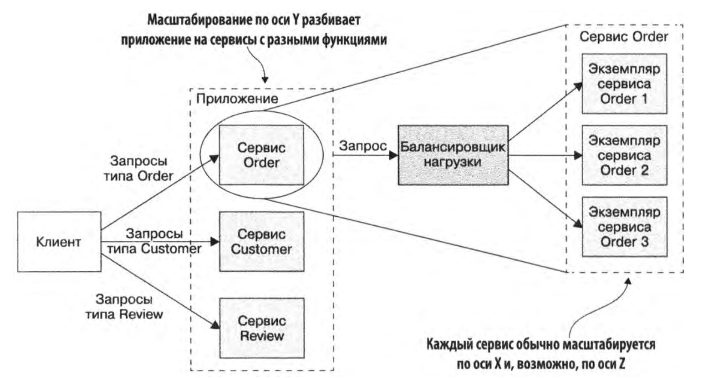

### Преимущества

Преимущества микросервисов:

- снижение *time to market* – количество времени для выпуска продукта или фичи
- удобная работа для больших команд, автономное обслуживание сервисов
- простое обслуживание сервисов
- простая архитектура и код сервисов, новые участники быстро погружаются в разработку
- быстрый и простой ci/cd, независимый от других сервисов и команд *deploy* сервисов.
- легкая масштабируемость приложения
- независимое масштабирование отдельных сервисов, каждый сервис можно масштабировать на специфичном для него оборудовании (*CPU, memory*)
- низкая зацепленность сервисов и команд. Сервис может обслуживать небольшая скрам-команда.
- Отказоустойчивость, высокая доступность, легкая Graceful degradation. Если упало что-то одно, то не падает все.
- сервисы изолированы, утечка памяти в одном сервисе не влияет на другие
- Можно понять качество каждой команды (сервиса) по потреблению ресурсов (памяти кеша, ЦПУ)
- проще внедрять новые технологии (фреймворки, языки программирования)
- проще использовать разные технологии и искать под них разнообразных разработчиков
- легко тестировать отдельные микросервисы. Т.к. сервисы маленькие – написание тестов упрощается, а их выполнение занимает меньше времени.
- в монолитной архитектуре в каждом container'е необходимо иметь полный перечень всего служебного ПО – statsd. nginx, supervisor и т.д. И нужно масштабировать весь контейнер целиком. В микросервисах можем масштабировать только нужный микросервис.

**Закон Конвея** – любая организация, которая разрабатывает систему, вынуждена создавать проекты, структура которых является копией структуры связей внутри организации. И микросервисная архитектура отражает структуру связей в компании (между командами, юнитами, кластерами).


## Недостатки

- Требуется больше ресурсов – нагрузка на сеть, больше серверов
- Сложность при проектировании архитектуры – сложно разделить систему на сервисы. Если неправильно декомпозировать систему - получаем распределенный монолит – набор сильно связанных сервисов. 
- Сложность отладки
- Сложность интеграционного тестирования (сервисов между собой)
- Требуется больше людей
- Сложность администрирования: много репозиториев, много сервисов, требуется платформа для их общего контроля – подъем версий Go, версии библиотек, количество используемых ресурсов
- Проблемы с распределенными данных:
  - поддержка консистентности данных, необходимость использовать саги
  - сбор распределенных данных из разных сервисов
- Мало инструментов для разработки, IDE ориентированы на монолит (тут закончил)
- нужно быть готовым к недоступности части сервисов *partition tolerance*, справляться с высоким *latency* сервисов
- необходимо организовать взаимодействие по сети между сервисами, а не просто вызов функций
- если изменение затрагивает несколько сервисов, то необходимо выработать план «выкатывания» обновлений. В монолите все компоненты релизятся атомарно.


## Что нужно выносить

- то, что меняется очень часто и требуется изменять как можно быстрее. Повышается time to market. Это самый правильный путь.
- то что легко выносится и слабо зацеплено с остальным функционалом
- на то, что приходится наибольшая нагрузка

## Когда использовать

Примеры вынесения частей кода в микросервис:

- код, который не связан с *request* и выполняет в *cron* что-то в фоне. Например:
  - отправка писем из очереди
  - обращение к внешним сервисам
  - *suggest* в списке

Требования к сервисам в микросервисной архитектуре:

- они должны быть максимально изолированы от других сервисов. Вплоть до своей БД.

Применяемые техники:

- *Null object pattern*. Это *design pattern*.

  Проблема: Если маленький сервис (например, сервис с возвратом блока текущего пользователя) отказывает, то это может привести к каскадному отказу всей системы. В этом случае необходимо, чтобы вместо результата работы сервиса было подставлено какое-то *default* значение.

  Решение: Возвращаемое значение является не конкретным экземпляром класса, а *interface*. Существует две реализации этого *interface*: реализация с полным корректным содержанием, которая возвращается когда сервис работает, и реализация по умолчанию, которая возвращается когда сервис не работает.

- *Circuit breaker*

- *Health checker* – проверка работоспособности сервиса. Сервис должен проверить работоспособность всех зависимых подсервисов и после этого вернуть OK.

## Принципы микросервисной архитектуры

- На каждый микросервис – своя база данных
- каждая служба должна иметь лишь небольшой набор обязанностей (SRP)
- graceful degradation - если что-то упало, то все не деградирует
- приложение должно использовать шаблон Saga . Сервис публикует событие при изменении его данных. Другие службы используют это событие и обновляют свои данные. 
- *Design for failure* — т.к. необходимо разрабатывать код для распределенной системы, составные элементы которой взаимодействуют через сеть. А сеть ненадежна по своей природе. Сеть может просто отказать, может работать плохо, может вдруг перестать пропускать какой-то тип сообщений, потому что изменились настройки файрвола. 

## Общая архитектура микросервисного приложения

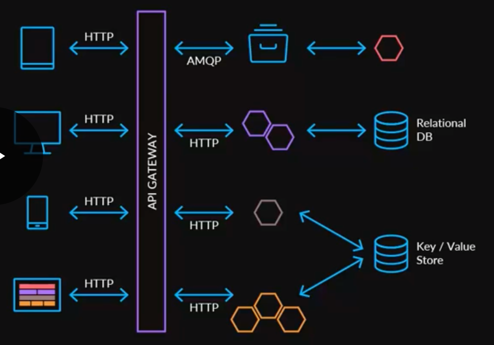


Другой вид архитектуры с монолитом, сервисами и SSR:


Api-gateway встречает трафик. Api-composition сервисы за ним, далее Brief сервисы.

SSR (server side rendering service) на Node.js вместо шаблонов Twig, чтобы иметь возможность переиспользовать скрипты на стороне браузера пользователя при SPA-переходах (Single page application). SSR получает данные из API монолита и других сервисов. SSR – отдавал страницу при первом входе пользователя.

## Проблемы в микросервисной архитектуре

- service discovery - найти сервис, который должен обслуживать запросы. есть централизованный registry с данными о сервисах

## Трассировка

*Distributed tracing*, также называемая распределенной трассировкой запросов, - это метод, используемый для профилирования и мониторинга приложений, особенно созданных с использованием микросервисной архитекту. Распределенная трассировка помогает точно определить, где происходят сбои и что вызывает снижение производительности.

### AV

Используются два инструмента:

- *OpenTracing* ([1](https://opentracing.io/specification/)) – это набор из:
  - *API specification*, независимая от *vendor*'а
  - *framework*'s и *library*'s в которых реализована *specification*
- Jaeger UI ([1](https://www.jaegertracing.io/)) – для визуализации 

Для работы tracing'а сервис должен пробрасывать специальные заголовки, например:

```
X-Request-Id
```

"Проброс" означает, что если в сервис пришел HTTP-запрос с указанным header'ом, то его необходимо добавить ко всем исходящим HTTP-запросам (без каких либо изменений).

### Общее

При логировании таймингов отдельных операций в лог-файл в микросервисной архитектуре, как правило, сложно понять что привело к вызову этих операций, отследить последовательность действий или смещение во времени одной операции относительно другой в разных сервисах.

Для удобства используются инструменты трассировки. 

Трассировка позволяет:

1. Найти узкие места в производительности как внутри одного сервиса, так и во всем дереве выполнения между всеми участвующими сервисами. Например:

   - Много коротких последовательных вызовов между сервисами, например, на геокодинг или к базе данных.
   - Долгие ожидания ввода вывода, например, передача данных по сети или чтение с диска.
   - Долгий парсинг данных.
   - Долгие операции, требующие cpu.
   - Участки кода, которые не нужны для получения конечного результата и могут быть удалены, либо запущены отложенно.

2. Наглядно понять в какой последовательности что вызывается и что происходит когда выполняется операция.

   

   Видно что, например, Запрос пришел в сервис WS -> сервис WS дополнил данные через сервис R -> дальше отправил запрос в сервис V -> сервис V загрузил много данных из сервиса R -> сходил в сервис P -> сервис Р еще раз сходил в сервис R -> сервис V проигнорировал результат и пошел в сервис J -> и только потом вернул ответ в сервис WS, при этом продолжая в фоне вычислять что-то еще.

   Без такого трейса или подробной документации на весь процесс очень сложно понять, что происходит, первый раз взглянув на код, да и код разбросан по разным сервисам и скрыт за кучей бинов и интерфейсов.

3. Сбор информации о дереве исполнения для последующего отложенного анализа. На каждом этапе выполнения в трейс можно добавить информацию, которая доступна на данном этапе и дальше разобраться какие входные данные привели к подобному сценарию. Например:

   - ID пользователя
   - Права
   - Тип выбранного метода
   - Лог или ошибка исполнения

4. Превращение трейсов в подмножество метрик и дальнейший анализ уже в виде метрик.

Основными понятиями в спецификации OpenTracing являются Trace, Span, SpanContext, Carrier, Tracer.

- Trace. Это временной интервал, в течение которого выполнялся один или несколько Span'ов, связанных между собой одним идентификатором traceId. Span'ы так же могут быть связаны между собой ссылками двух оcновных типов. **ChildOf** это обычная связь родитель — потомок. Она говорит о том, что для завершения родительского span'a требуется завершение дочернего. Связь **FollowsFrom** говорит лишь о том, что родительский span запустил другой span, но на завершение текущего он не влияет.
- **Span**. Это основная и минимальная единица информации в спецификации OpenTracing. Span описывает интервал во времени, в котором происходила работа. Например, вызов функции, которая делает запрос в БД за данными, можно описать как span, сохранив в нем необходимую информацию. При создании интервала обязательным полем является имя (например название функции), также неявно в Span записывается timestamp создания интервала и идентификатор spanId. Каждый интервал содержит traceId, если span является дочерним, то в него записывается traceId родительского интервала, если родительского spana'а нет, генерируется новый. Когда функция завершила свою работы, у объекта span мы должны вызвать метод finish. Этот метод запишет в Span timestamp завершения работы, а так же отправит получившийся span в Трассировщик (если это предусмотренно конкретной реализацией). 
- **SpanContext**. Это объект, описанный в спецификации OpenTracing, который содержит информацию, необходимую для связывания span'ов между собой при межсервисном взаимодействии. Контекст содержит идентификаторы traceId, spanId, а также любую информацию вида key:value, которую мы хотим передавать между микросервисами. 
- **Tracer**. Это конкретная имплементация спецификации OpenTracing, которая непосредственно предоставляет методы по созданию span'ов, генерации идентификаторов, создания контекстов и отправку завершенных интервалов на хранение в трассировщик (distributed tracing system) например **Jaeger** 

В трассировке есть понятие спан, это аналог одного лога, в консоль. У спана есть:

- Название, обычно это название метода который выполнялся
- Название сервиса, в котором был сгенерирован спан
- Собственный уникальный ID
- Какая-то мета информация в виде key/value, которую залогировали в него. Например, параметры метода или закончился метод ошибкой или нет
- Время начала и конца выполнения этого спана
- ID родительского спана

Каждый спан отправляется в collector спанов для сохранения в базу для последующего просмотра как только он завершил свое выполнение. В дальнейшем можно построить дерево всех спанов соединяя по id родителя. При анализе можно найти, например, все спаны в каком-то сервисе, которые заняли больше какого-то времени. Дальше, перейдя на конкретный спан, увидеть все дерево выше и ниже этого спана.


Есть общий стандарт *Opentracing*, который описывает как и что должно собираться, не привязываясь трассировкой к конкретной реализации в каком-либо языке. 

Имплементации Opentracing:

- Jaeger . 

Он состоит из нескольких компонент:


- Jaeger-agent — локальный агент, который обычно стоит на каждой машине и в него логируют сервисы на локальный дефолтный порт. Если агента нет, то трейсы всех сервисов на этой машине обычно выключены
- Jaeger-collector — в него все агенты посылают собранные трейсы, а он кладет их в выбранную БД
- База данных — предпочтительная у них cassandra, но у нас используется elasticsearch, есть реализации еще под пару других бд и in memory реализация, которая ничего не сохраняет на диск
- Jaeger-query — это сервис который ходит в базу данных и отдает уже собранные трейсы для анализа
- Jaeger-ui — это веб интерфейс для поиска и просмотров трейсов, он ходит в jaeger-query


Отдельным компонентом можно назвать реализацию opentracing jaeger под конкретные языки, через которую спаны отправляются в jaeger-agent.

Каждый сервис собирает тайминги и доп.инфу в спаны и скидывает их в рядом стоящий jaeger-agent по udp. Тот, в свою очередь, отправляет их в jaeger-collector. После этого трейсы доступны в jaeger-ui. 

Традиционное решение — присваивать транзакции (логу) на входе в систему уникальный ID. Затем этот ID (контекст) пробрасывается через всю систему по цепочке вызовов внутри сервиса или между сервисами

В качестве хранилища трассировок Jaeger может использовать **Cassandra**, **Elasticsearch** а также просто хранить трейсы в памяти, что удобно для тестов. 

## Шина данных

Преимущества:

- развязывание клиентов и серверов. Один высоконагруженный сервис развязывается от клиентов, что позволяет его ненагружать, сокращать количество клиентов. Клиенты которым нужна дополнительныя информация, могут самостоятельно обратиться снова к серверу.
- Отличичие шины от очереди:
  - Из очереди сообщения вычитываются навсегда, а из шины сообщения вычитываются многократно
  - Из шины данных сообщения вычитываются по порядку, шина данных 
- At least once delivery, нужно организовывать идемпотентность


## Протокол коммуникации между сервисами

- самый простой вариант REST
- gRPC более оптимальный –  это бинарный протокол и передается меньше данных, также удобнее следить за контрактами сервисов


# Жизненный цикл разработки сервиса

- Коммитим, пушим
- Запускается CI
- Тесты
- Собираем контейнер с сервисом
- пушим в реджистри
- Деплоим на стейдж и потом на прод.


# Конфигурирование сервисов

В av для конфигурирования используется синтаксис app.toml (например, `replica = 5`), в других компаниях синтаксим helm/values.yaml (тоже `replicas: 6`)


## Взаимодействие между микросервисами

Можно выделить 4 способа взаимодействия между системами:

1. передача файлов – одна система публикует файл, а другая получает его из общего хранилища. Можно использовать, если требуется передача больших файлов
2. общая база данных – обе системы подключаются к общей базе данных. Подойдет, если выносим логику из одного сервиса в другой.
3. RPC (удаленный вызов процедур) 
4. Обмен сообщениями. 

(1) и (2) – плохо масштабируются и приводят к побочным эффектам.

### RPC

Одна система вызывает методы у другой системы напрямую. Это синхронное взаимодействие – сервис вызывает метод другого сервиса, ожидает от него получить ответ за небольшой период времени, ожидая от него ответ (приостанавливает свою работу или параллельно совершая другие запросы), а затем обрабатывает результат. Используется, когда бизнес-логика требует синхронного взаимодействия – для продолжения выполнения необходимо дождаться всех вызовов, которые мы сделали к другим сервисам.

RPC обычно проще обмена сообщения и выглядит для приложения, как обычный вызов функции, которая находится в другом пакете.

Недостатки:

- сервис может быть недоступен и надо подумать, что делать в этом случае при синхронном обмене (GD, fallback)
- не всегда можно масштабировать, особенно если запросов много и они медленные
- tight coupling  – повышенная связность, клиент знает кого вызывает, сервер предоставляет конкретное API. Если перемещаем логику из одного сервиса в другой, то должны явно переключить всех клиентов на новый сервис. 

 AV: brief

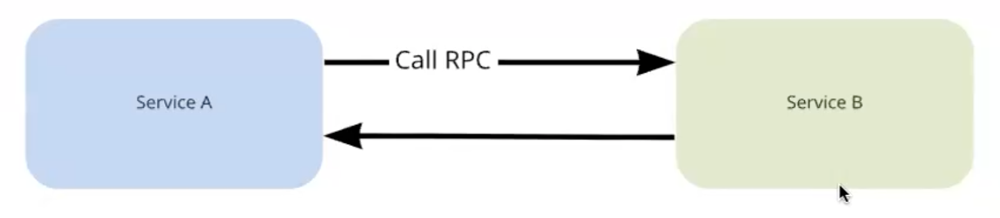

Взаимодействие точка-точка – точно известен сервис-источник и сервис-получатель запроса.

Используются легковесные протоколы:

- REST
- gRPC

### Обмен сообщениями

Асинхронный способ обмена – предполагает, что отсылаем сообщение через общую шину данных, не знаем кто будет получателем и не ждем результата обработки сообщений. 

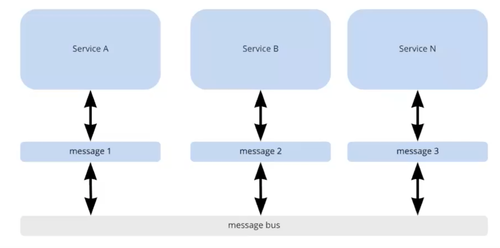

Преимущества:

- может быть несколько получателей и несколько источников для message
- систему легко масштабировать

Недостатки:

- сложнее чем RPC, если требуется двухсторонний обмен

Возможны варианты реализации

- Databus – взаимодействие между сервисами. Особенности:
  - позволяет публиковать и читать сообщения любому клиенту и сервису
- Queues – взаимодействие в рамках одного сервиса

### Паттерны обмена сообщениями

#### Взаимодействие между двумя сервисами

Пример реализации через *databus* – *service* `А` отправляет *message* в *service* `B` через Databus.

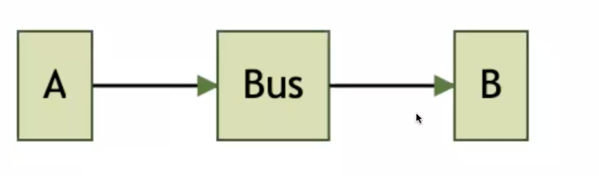

Ошибкой является проектировать *message* так, что оно подходит только для одно конкретного *service* `B`. И никто больше не может его использовать, т.к. в. нем есть уникальные данные и поля для *service* `B`. В итоге к получению message не может подключиться никакой другой *service*. Если действительно нужно вызывать какой-то определенный сервис и сообщение не предполагает получения несколькими *service*'s, то лучше сделать RPC-вызов, RPC-вызов будет сделан в конкретную систему.

#### Состав message

В *databus* обычно жесткий лимит на размер *message*, т.к. предполагается что *service*'s обмениваются не самими данными, а идентификаторами этих данных:

```
message OrderPaid {
  id string `Уникальный идентификатор заказа`
}
```

Сообщения – это *event*'ы о том, что с некоторой сущностью с `id` произошли изменения. Best practice – оставлять в *message* только самые минимально необходимые поля (в идеале, только `id` сущности), чтобы *service*-получатель мог получить по `id` сущности все необходимые дополнительные данные о ней из *service*-источника. (как в примере badoo, когда девушка меняла свой возраст и  если изменение возраста отправлялось прямо в *message*, то это приводило к несогласованности данных в *service*'s. Решение – получения данных всегда от *service*-источника).

Преимущества:

- *service*-получатель не зависит от порядка *message*'s. Ему не нужно думать – а актуальны ли сейчас те данные, которые пришли в *message* или нет. Они всегда получают актуальные данные из *service*-источника – *source of truth* (источника правды).
- *service*-источник не всегда знает, какие данные необходимы *service*-получателю. Разным *service*'s - получателям нужны разные *model data*. Если эти *service*'s-получатели сами забирают нужные данные, то они сами могут определить – что им получать и откуда.

#### Одно событие или разные

Есть два подхода. Необходимо учесть преимущества и недостатки подходов и выбрать тот, который подходит в нужном случае.

1. Вариант 1. Разные *message*'s в *databus* для каждого события в системе.

   ```
   message OrderPaid {  // заказ оплачен
     id int
   }
   
   message OrderCreated {  // заказ создан
     id int
   }
   
   message OrderDelivered {  // заказ доставлен
     id int
   }
   ```

   Преимущества:

   - все получатели могут подписать только на нужные им события. Например, если какому-то *service* нужно знать, когда заказ оплачен, он может подписаться только на *message* `OrderPaid`. И тогда ему придется обрабатывать меньше *message*'s, т.к. только они будут в соответствующем *topic*'е.

   Недостатки:

   - сложно построить последовательность отправки событий. Если *service* читает разные *message*'s, ему придется делать это из разных *topic*'ов. И это необходимо учесть в логике *service*. Например, событие `OrderPaid` он может прочитать раньше, чем событие `OrderCreated` (заказ создан).  
   - может со времен появляться дополнительные *message*'s. И множество таких *message*'s будет очень большим.

2. Вариант 2. Одно *message* для всех событий в системе. Событие – заказ обновлен, а уже внутри него конкретный `event` с описанием события.

   ```
   message OrderUpdated {  // заказ обновлен
     id int
     event string          // событие, которое произошло
   }
   ```

   Недостатки

   - поток ненужных *message*'s, если нам нужны только некоторые *event*'ы. Если нужен только `OrderPaid`, то нужно читать все *message*'s.

   Преимущества:

   - *service*-получателю проще построить порядок *message*'s
   - легко добавлять новые типы *message*'s.


#### Несколько *service*'s-отправителей публикуют один и тот же тип *message*

Это возможно

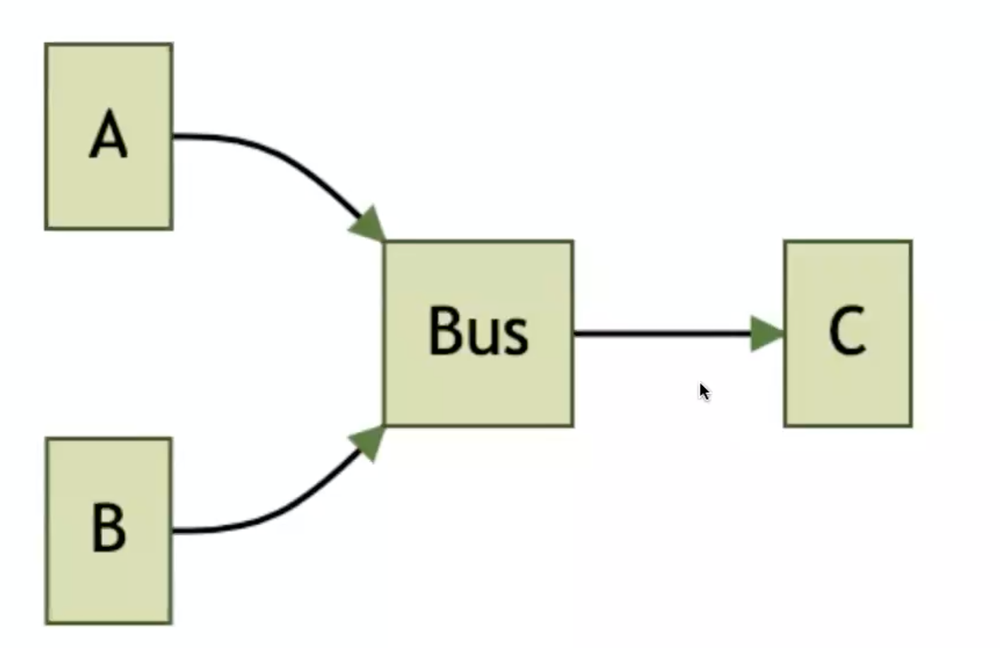

Этот подход стоит использовать только при миграции логики из *service* `A` в *service* `B`.

Недостатки:

- у одного *message* есть несколько *source of truth*. И когда *service*-получатель захочет получить дополнительные данные, непонятно в какой *service* обращаться.
- нужно поддерживать эквивалентность схем *message type* в разных *service*'s

Лучше если *service*'s публикуют похожие по смыслу, но разные *message type*. 

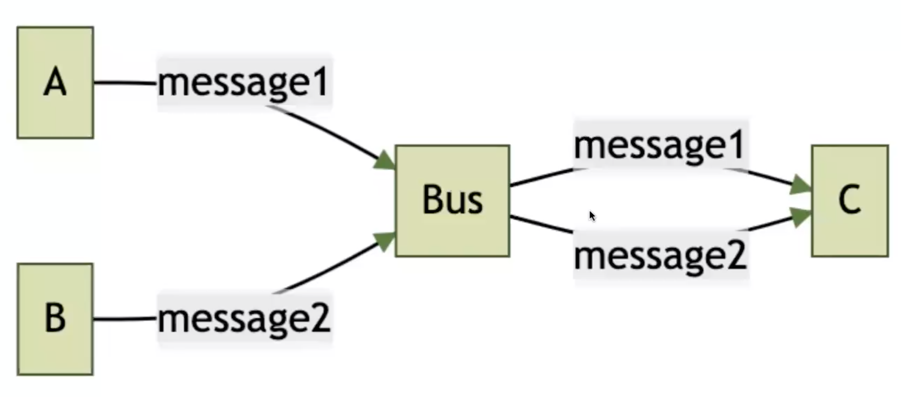

#### Двусторонний обмен сообщениями

*Service* A отсылает через *databus* *message* в *service* B и хочет, чтобы *service* B сообщал о результатах обработки.

Есть два варианта:

- *service* B сообщает о результатах через RPC

- *service* B сообщает о результатах через *Databus*

  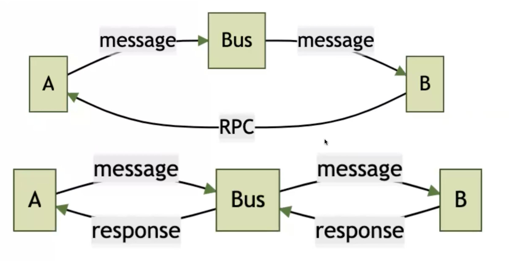

  Чтобы *service B* мог доставить *response* до источника (*service A*) он должен получить в исходном сообщении некоторый `operationId`, с которым потом вернет *response* в *databus*:

  ```go
  message Request {
    operationId int
  }
  
  message Response {
    operationId int
  }
  ```

  *Service A* не знает ничего о *Service A* и просто отправляет *response* с тем же `operationId`.

#### ACK и NACK

В результате обработки необходимо вернуть:

- `ACK` – успешная обработка, acknowledgment. *Message* не будет больше доставлено сервису повторно (за исключением случая, если используется стратегия at least once delivery). Необходимо отсылать, когда выполнили все необходимые изменения. 
- `NACK` – неуспешная обработка, negative acknowledgment. Используется, когда *message* не может быть обработан повторно. *Message* получит повторно тот же самый или другой *consumer*.

#### Defer

Существуют отложенные очереди. Во время обработки *message* может быть принято решение отложить его обработку. Например, если оно не может быть обработано сейчас (недоступна БД, внешний сервис). 

При возврате `DEFER` в зависимости от конфигурации:

-  *message* перекладывается в другую, отложенную очередь.
- если отложенной очереди нет, то кладется в конец текущей очереди и доставляется после всех остальных *message*'s. Повторная доставка *message* будет осуществлена только через некоторый период времени.  

Можно ретраить *message* через `DEFER`. При этом можно ограничить количество ретраев (например, через `deferCount`).

#### Dead letter queue (DLQ)

Иногда *message* не может быть очень долго доставлено, оно все время попадает в следующую отложенную очередь с большей задержкой. Самую последнюю очередь с наибольшей задержкой в доставке называют *Dead letter queue* (DLQ). *Dead letter queue* (DLQ) является финальной отложенной очередью, из нее *message*'s не обрабатываются по стандартному флоу. На эту очередь вешаются метрики, алерты. В случае проблем *Dead letter queue* может начать быстро разрастаться. Необходимо предусмотреть API для изучения этой очереди и ее очистки. В этом случае при получении алерта можно разобраться с причинами разрастания *Dead letter queue* (DLQ).

#### Поведение при проблемах в обработке *message*'s

- сделать сообщению `ACK`, если оно неважно или нет смысла его дальше обрабатывать. Сообщение будет потеряно навсегда
- сделать сообщению `NACK`, оно будет доставлено повторно
- делать сообщению `DEFER`, пока оно не будет доставлено в *Dead letter queue*, с которым разбираться отдельно.
- делать сообщению `DEFER`, пока не будет достигнуто максимальное количество ретраев.

#### Гарантии доставки

- Чаще всего гарантия доставки at least once delivery
- Порядок доставки *message*'s не гарантируется

#### Работа с at least once delivery

##### Идемпотентность

TODO!!!

##### Дедупликация *message*'s в consumer'e

Дедупликация – возможность *consumer*'а понимать, что этот *message* уже был обработан. 

Реализовать это можно, используя `id` внутри *message*, чтобы определять – был *message* уже обработан или нет. Можно использовать какое-то искусственное поле или время публикации (*timestamp*)

Алгоритм дедупликации:

- получаем *message* `m1` и сохраняем в БД для соответствующей сущности признак `proccessed`. Например, для Order сохраняем признак того, что уже приходило сообщение на оплату.
- когда приходит *message* `m1` повторно, мы понимаем дупликацию по данным в БД и просто скипаем его.

#### Обработка нарушений порядка доставки *message*'s

Причина нарушения порядка доставки – использование нескольких партиций, через которые *message*'s попадают к *consumer*'у. Партиции используются для ускорения обмена и масштабирования. 

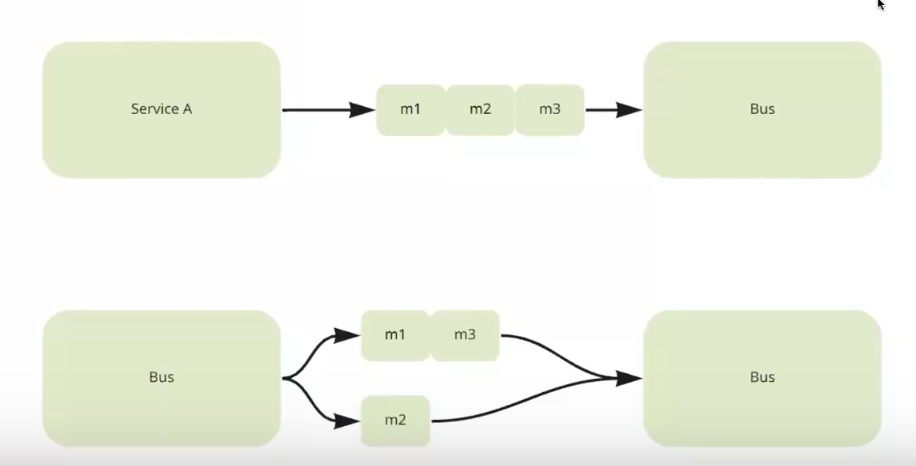

В итоге *message*'s могут выбраны из партиций в другом порядке. Например, m2-m1-m3.

Стратегии обработки нарушения порядка:

- сделать обработку, не зависящей от порядка доставки. Т.е. означает добиться коммутативности операций над сущностью. 

  Основной прием – не передавать информацию о сущности в самом *message*, а включать в *message* только `id` сущности и `event` (событие, что произошло с сущностью). Все необходимые данные о сущности выбираем из сервиса-source-of-truth. И в зависимости от текущего состояния сущности мы и определяем, как обрабатывать `event` (выполнять обработку или нет, или выполнять как-то по-особенному)

- если *message*'s должны иметь порядок. Тогда можно сделать "костыль", добавить в *message* – инкрементальный `id` порядка, который будет определять порядок *message*'s. По этому `id` *consumer* может у себя восстановить порядок сообщений. 

  ```
  message Message {
    operationId int `Идентификатор операции`
    sequenceId int `Идентификатор порядка`
  }
  ```

  Пример:

  При обработке каждого очередного сообщения происходит сравнение его `sequenceId` с `last_seq`. *Message*'s `m1` и `m2` приходят в нужном порядке и они обрабатываются. *Message* `m4` приходит перед `m3` и оно перекладывается в отложенную очередь через `defer`. Ждем получения *message* `m3`. После того как *message* `m3` было обработано, из отложенной очереди извлекается `m4`.

  


# Pattern

## Виды pattern'ов

### *Communication pattern*'ы

- *Communication style* – какой механизм IPC (interprocess communication) используется:

  - *Messaging* (обмен сообщениями)
  - *Remote procedure call* (удаленный вызов процедур)
  - Domain-specific (предметно-ориентированные шаблоны)

  Все 3 паттерна - альтернативы

- *Discovery*. Каким образом *client* узнает IP-адрес *service instanc*'а, чтобы, например, выполнить *HTTP request*?
  - Альтернативы 1:
    - *Client-side discovery* (обнаружение на стороне клиента)
    - *Server-side discovery* (обнаружение на стороне сервера)
  - Альтернативы 2:
    - *Self registration* (саморегистрация)
    - *3rd-party registration* (сторонняя регистрация)
  - *Service registry* (реестр сервисов) . Альтернативы 1 - предшественники, альтернативы 2 - преемники
- Надежность (*reliability*). Как обеспечить надежное взаимодействие между сервисами с учетом того, что некоторые из них могут быть недоступны?
  
  - *circuit breaker*
- Транзакционный обмен сообщениями (*transactional messaging*). Как следует интегрировать отправку *message*'s и *event publishing* с  *database transaction*'s, которые обновляют *business data*?
  - *Transactional outbox*
  - его преемники:
    - *Transaction log tailing* (отслеживание лога транзакций)
    - *Polling publisher* (опрашивающий издатель)
- Внешний API. Каким образом *client*'ы взаимодействуют с *servic*'ами?
  - *api-gateway*
  - *backend for frontend* (BFF)

### Паттерны *data consistency* для реализации *transaction management*

Каждый *service* имеет собственную *database* (*database per service*). Поэтому для обеспечения *data consistency* нужно использовать паттерн *Saga*. 

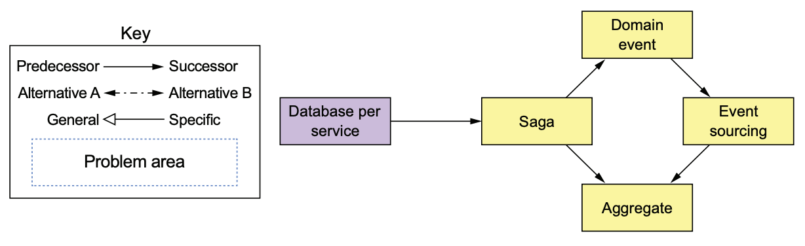

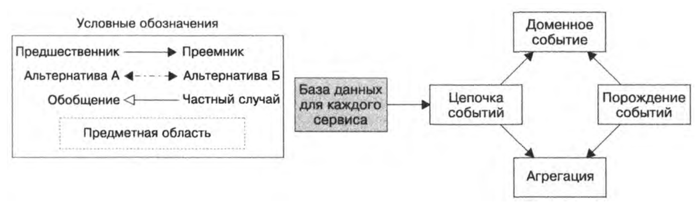

### Паттерны запрашивания (*quering*) данных

Паттерны для запросов, которые должны объединять информацию, принадлежащую нескольким *servic*'ам. 

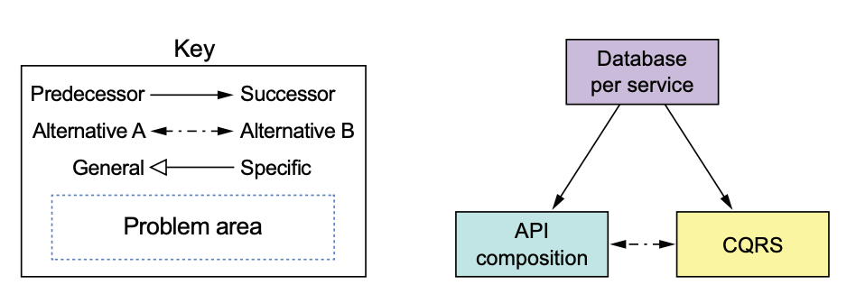

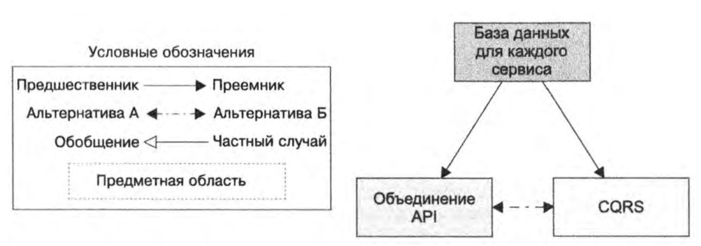

- Паттерн *API composition* – обращается к API одного или нескольких *servic*'ов и агрегирует результаты
- CQRS (command query responsibility segregation, командные запросы с разделением ответственности) – хранят одну или несколько копий данных и позволяют легко к ним обращаться.

### Паттерны *service deployment*

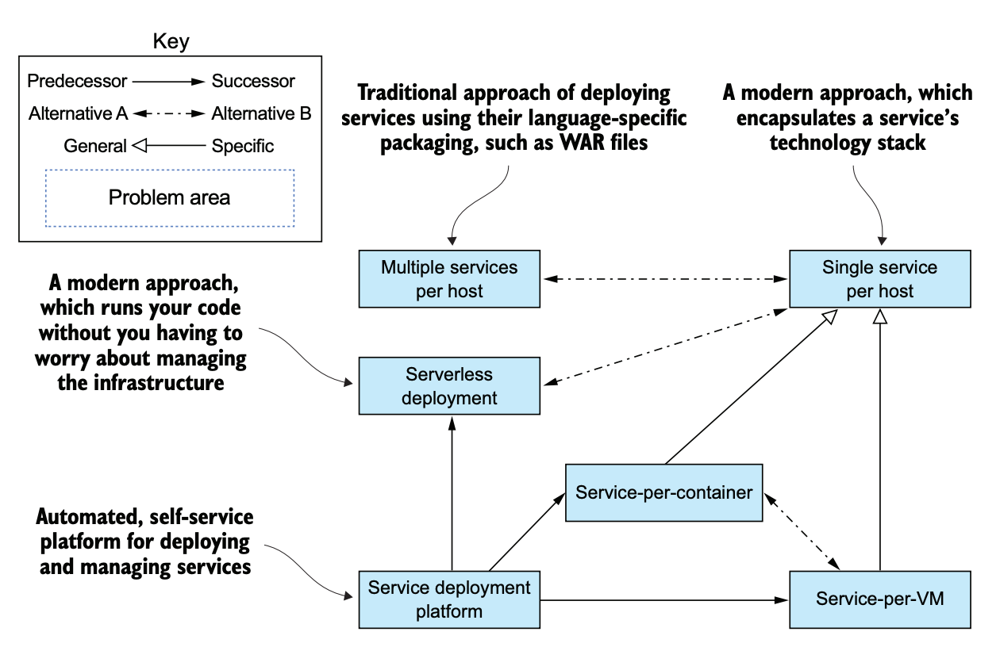

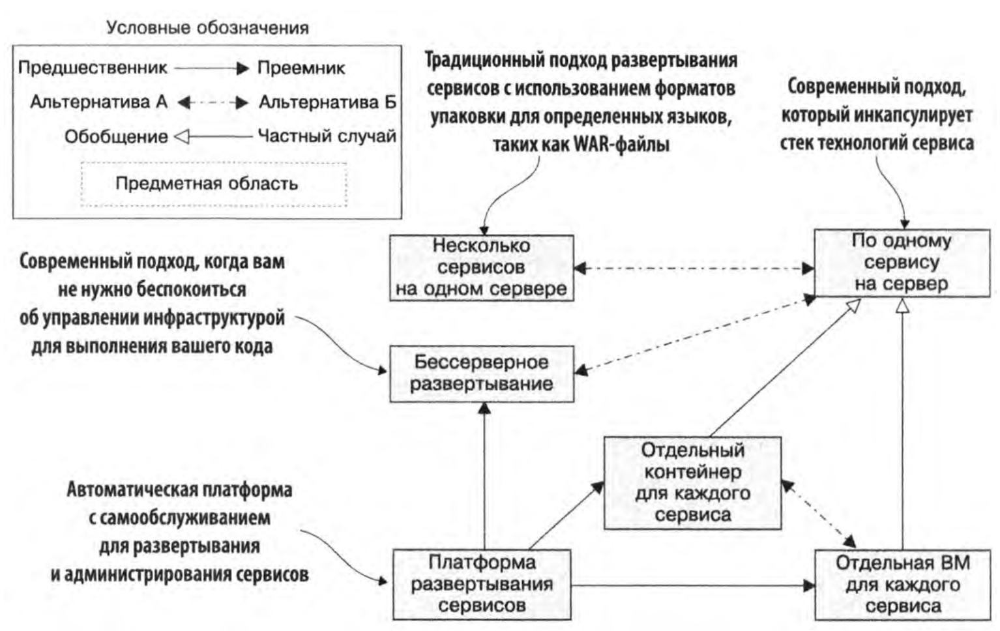

### Паттерны *observability*

- *Health check API* – создание *endpoint*'а, который возвращает *health* для *service*.
- *Log aggregation* – Логгирование *servic*'ов и запись *log*'ов на централизованном *logging server* с поддержкой *searching* и *alerting*.
- *Distributed tracing* – Назначаем каждому *request*'у *unique ID* (*request ID*) и отслеживаем его перемещение между *servic*'ами
- Отслеживание *exception* (sentry?) – отправляем информацию об *exception*'ах соответствующему *servic*'у, который отправляет *alert*'ы разработчикам и отслеживает разрешение каждого *exception*'а
- *Application metric*'и
- *Audit logging* – логгирование действий пользователей

### Паттерны *security*

Аутентификацию пользователей обычно выполняет *API gateway*, который затем должен передать информацию о пользователе, например ID и роли, необходимому *servic*'у. Часто для этого применяют паттерн *Access token*, такой как JWT (JSON Web token). 

## Декомпозиция сервисов

Разделение на сервисы - это функциональная декомпозиция.

Если сервисы часто взаимодействуют – они сильно зацеплены и мы получили распределенный монолит

При выборе архитектуры следует учитывать:

- функциональные требования. Часто могут быть реализованы разными архитектурами, даже плохими
- нефункциональные требования (качество обслуживания): масштабируемость, надежность, *maintainability, testability*, *deployability*.

Подходы к декомпозиции:

- по бизнес-процессам (сервис заказов или доставки товаров)
- по доменам (сервис биллинг, мессенджер, твит, пользователь)
- по действию, use case (сервис регистрации)
- по ресурсам (сервис объявлений)

**Пример декомпозиции:**

- `Order` — управляет заказами
- `Delivery` — управляет доставкой заказов из ресторана клиентам
- `Restaurant` — хранит информацию о ресторанах
- `Kitchen` — отвечает за подготовку заказов
- `Accounting` — управляет биллингом и платежами


## Транзакционный обмен сообщениями

*Servic*'у часто нужно публиковать *message* как часть *transaction*, обновляющей *database*. Например, *service* может публиковать *domain event*, когда обновляет или создает *business entity*. Обновление *database* и отправка *message* должны происходить в пределах одной *transaction*, иначе *service* может обновить *database* и, например, упасть до того, как *message* будет отправлено. Если не выполнять эти две операции атомарно, такая проблема может оставить систему в неконсистентном состоянии.

Традиционный подход – использование *distributed transaction*, которые охватывают *database* и *message broker*. Но *distributed transaction* — неудачное решение для современных приложений. Кроме того, они не поддерживаются во многих современных *message broker*'ах, таких как Apache Kafka.

### Transactional outbox

Cвязано c [распределенные транзакции](Sharding.md#распределенные-транзакции)

смотреть: Ричардсон Микросервисы

#### Context

В логике *service* иногда требуется обновить *database* и отправить *message/event*. Например, *service*, участвующий в [saga](https://microservices.io/patterns/data/saga.html) должен атомарно обновить *database* и отправить *message/event*. Аналогично, *service*, который публикует [domain event](https://microservices.io/patterns/data/domain-event.html) должен атомарно обновлять [aggregate](https://microservices.io/patterns/data/aggregate.html) и публиковать *event*.

*Service* должна атомарно обновлять *database* и отправлять *message*, чтобы избежать неконсистентности данных и ошибок. Однако нецелесообразно использовать традиционные *distributed transaction* (2PC), которые охватывают *database* и *message broker*. *Message broker* может не поддерживать 2PC. 

Но без использования 2PC:

- отправка *message* во время выполнения *transaction* – не *reliable*. Нет гарантии, что *transaction* будет *commit*. 
- отправка *message* после *transaction commit*. Нет гарантии, что *service* не упадет перед отправкой *message*.

Кроме того, *message*'s должны отправляться *message broker*'у в том порядке, в котором они были отправлены *servic*'ом. Например,  [aggregate](https://microservices.io/patterns/data/aggregate.html) обновляется последовательностью *transaction*'s `T1`, `T2`и т.д. Эти *transaction*'s могут быть выполнены одним и тем же *service instance* или различными *service instance*'s. Каждая *transaction* публикует соответствующий *event*: `T1 -> E1`, `T2 -> E2` и т.д. Так как `T1`предшествует `T2`, *event* `E1` должен быть опубликован до `E2`.

#### Problem

Как *reliably/atomically* обновлять *database* и отправлять *message/event*?

#### Forces

- 2PC – не подходит
- Если происходит *transaction commit* – *message* должен быть отправлен. Иначе, если происходит *transaction rollback*, *message* НЕ должен быть отправлен.
- *Message*'s должны отправляться *message broker*'у в том порядке, в котором они были отправлены *servic*'ом. Этот порядок должен быть сохранен для нескольких *service instance*'s, которые обновляют один и тот же *aggregate*.

#### Solution

Используем *database table* в качестве временной *message queue*. *Service*, отправляющий *message*, содержит *outbox table* (`OUTBOX`). В рамках *local transaction*, которая изменяет бизнес-объекты (`ORDER` *table*), *service* шлет *message*'s, вставляя их в `OUTBOX` *table*. Поскольку это *local ACID transaction* – атомарность гарантируется.

`OUTBOX` *table* играет роль временной *message queue*. *Message Relay* — это компонент, который читает `OUTBOX` *table* и публикует *message*'s в *message broker*. 

Аналогичный подход можно применять и к некоторым *NoSQL database*'s. Каждый *business entity*, хранящийся в виде *record* в *database*, содержит *attribute* с *list of message*'s, которые нужно опубликовать. Обновляя этот *business entity*, *service* добавляет в *list* новое *message*. Это атомарная операция, поскольку она выполняется за одну *database operation*. Трудность такого подхода для *NoSQL database* связана с проблемой поиска *business entity*'s, которые содержат *message*'s для публикации.

Существует несколько способов реализации *Message relay* – доставки *message* от *database* к *message broker*:

- *Polling publisher pattern*
- *Transaction log tailing pattern*

TODO!!!

https://microservices.io/patterns/data/saga.html

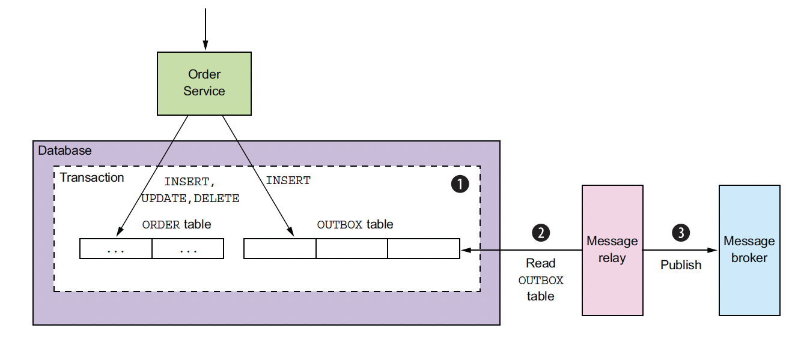


#### Result context

Возможные проблемы:

- *Message Relay* может опубликовать *message* более одного раза. Например, он может упасть после публикации *message*, но до того, как в `OUTBOX` был зафиксирован факт публикации. После перезапуска *Message Relay* снова опубликует *message*. Поэтому *consumer* должен быть *idempotent*. Например, путем отслеживания *Message ID*, которые он уже обработал (есть проблема с генерацией уникальных *Message ID* в распределенной системе).


#### Related patterns

- [Saga](#распределенная-транзакция-saga) и [Domain event](https://microservices.io/patterns/data/domain-event.html) *pattern*'ы create используют этот *pattern*.
- [Event sourcing](https://microservices.io/patterns/data/event-sourcing.html) – альтернативное решение
- Есть два *pattern*'а для реализации *Message relay*:
  - [Transaction log tailing](https://microservices.io/patterns/data/transaction-log-tailing.html) pattern
  - [Polling publisher](https://microservices.io/patterns/data/polling-publisher.html) pattern


## Распределенная транзакция

### Context

#### Межсервисные транзакции

Вы применили *pattern* [Database per Service](https://microservices.io/patterns/data/database-per-service.html). Каждый *service* имеет свою *database*. Однако некоторые *transaction*'s охватывают несколько *service*'s. Например, в интернет-магазине есть ручка `createOrder()`.  При ее вызове нужно провести изменения в сервисах `Consumer`, `Order`, `Kitchen` и `Accounting`.

Например, у *customer*'ов (клиентов) есть кредитный лимит. Приложение должно гарантировать, что новый *order* не превысит кредитный лимит *customer*'а. Поскольку *Order*'s и *Customer*'s находятся в разных *database*'s, принадлежащих разным *service*'s, приложение не может просто использовать *local ACID transaction*.


#### Тразакции между шардами

При правильно выбранной схеме шардирования распределенные транзакции должны выполняться редко, поскольку они всегда недешевы. 

Для одной базы данных проблема консистентности решается через транзакции, которые поддерживаются СУБД. Распределенные транзакции не могут быть выполнены легко, с сохранением свойств ACID. В результате база данных может перейти в некосистентное состояние

### Problem

Как реализовать *transaction*, которая охватывает несколько *service*'s.

### Solution

Варианты решения:

- предполагать, что сбои невозможны
- Двухфазный коммит, ХА-транзакции
- Автоматическая проверка согласованности
- Критическая секция и мьютекс в распределенной памяти
- Согласованные в конечном счете транзакции (eventually consistent)
  - 1 пример (кажется, это event sourcing)
  - 2 пример (хреновый паттерн, с шареной таблицей `transactions`)
  - Saga

#### Предполагать, что сбои невозможны

Часто можно смириться с некоторой неконсистентью данных в случае некоторых временных сбоев. 

Преимущество: простота. Недостаток: недовольство пользователей некорректностью данных.

#### Двухфазный коммит, ХА-транзакции

Распределенные (XA) транзакции позволяют распространить некоторые ACID свойства вовне подсистемы хранения и даже вовне базы данных посредством механизма двухфазной фиксации (Two-phase commit protocol, 2PC).

Недостатки:

- чтобы распределенную транзакцию можно было зафиксировать, доступными должны быть все вовлеченные в нее сервисы. Доступность системы — это произведение доступности всех участников транзакции. Если в распределенной транзакции участвуют два сервиса с доступностью 99,5 %, общая доступность будет 99 %, что намного меньше. Каждый дополнительный сервис понижает степень доступности.

  

В MySQL существует два вида XA-транзакций.

**Внутренние XA-транзакции.** Транзакции, выполняемые в таблицах различных подсистем хранения. В роли еоординатора выступает сервер MySQL.

**Внешние XA-транзакции**. Сервер MySQL может быть участником распределенной транзакции, но не может ей управлять. 

Архитектура системы внешних распределенных транзакций включает:

·  Несколько менеджеров ресурсов (Resource Manager, RM) – распределенные экземпляры MySQL с возможностью локальных транзакций.

·  Один координатор транзакций (Transaction Manager, TM) – координирует распределенную транзакцию, взаимодействуя с RM, которые обрабатывают ветви (branches) распределенной транзакции. Это клиентская программа, которая подключается к RM. 

**Недостаток 2****PC:** 2PC protocol является блокирующим. Кроме того, строгие гарантии, которые он предоставляет, зачастую не нужны. Например, если допустить что пользователи не могут видеть состояние счета других пользователей, то нет ничего страшного, что данные на один счет зачисляться немного позже, чем спишутся с другого. 

##### Процесс коммита

Фаза 1. Координатор транзакции просит всех RM подготовиться к коммиту. Каждый RM должен сохранить требуемые от его ветви действия в надежное хранилище. RM сигнализирует TM о готовности ко 2 фазе.

Фаза 2. TM сообщает всем RM требуется совершить commit или rollback. Если все RM сигнализируют о готовности к commit, то все ветви коммитятся. Если какая-то ветвь сигонализирует о невозможности commit, то все ветви откатываются. 

Команды начинаются с ключевого слова XA, и во многих из них требуется значение xid – идентификатор транзакции. Значения xid генерируются TM (приложением) и должны быть глобально уникальными. Все команды транзакции должны содержать одинаковое значение xid.

Команда XA RECOVER возвращает список XA транзакций на сервере в состоянии PREPARED (gtrid – глобальный идентификатор транзакции, bqual – идентификатор ветви (branch qualifier). Для примера программы ниже:

mysql> XA RECOVER;

+----------+--------------+--------------+----------------------------+

| formatID | gtrid_length | bqual_length | data            |

+----------+--------------+--------------+----------------------------+

|    1 |      26 |      0 | tx-5abb8001d61997.65176918 |

+----------+--------------+--------------+----------------------------+

##### Состояния XA транзакции

\1.  Старт транзакции в состоянии ACTIVE:

XA START 'xatest';

\2. Исполняются команды SQL,составляющие транзакцию. В конце исполняется команда XA END, которая помещает транзакцию в состояние IDLE.

INSERT INTO tabl (value) VALUES (1);

XA END 'xatest';

\3. Для транзакции в состоянии IDLE возможны вариант:

o вызвать XA PREPARE и поместить транзакцию в состояние PREPARED. Команда XA RECOVER будет выводить значение xid транзакции в своем выходе.

XA PREPARE 'xatest';

o вызвать XA COMMIT ... ONE PHASE, которая за одну фазу делает prepared и сразу commit. Транзакция в этом случае завершается.

\4. Для транзакции в состоянии PREPARED исполняется команда XA COMMIT или XA ROLLBACK.

XA COMMIT 'xatest';

##### Пример реализации

**function** wait() {
   **echo** **"Sleep. Press enter...****\n****"**;
   gets(***STDIN\***);
 }
 */\* Соединение с Resource Manager \*/
\* **class** MysqlConnect
 {

   **protected** **$link** = **null**;

   **public function** __construct($host, $database, $username, $password)
   {
     $this->**link** = **new** mysqli($host, $username, $password, $database);
   }

   **public function** query($query)
   {
     $this->**link**->query($query) **or die**(**"ERROR: "** . $this->**link**->**error**);
   }


 }

 */\* Класс с логикой Transaction Manager \*/
\* **class** TransactionManager
 {
   **protected** **$connections** = **array**();

   **protected** **$lastTxId** = **null**;

   **public function** __construct($connections)
   {
     $this->**connections** = $connections;
   }

   **public function** query($query)
   {
     **foreach** ($this->**connections** **as** $connection) {
       $connection->query($query);
     }
   }

   **protected function** getTxIdent()
   {
     **return** *uniqid*(**"tx-"**, **true**);
   }

   **public function** txBegin()
   {
     $tid = $this->getTxIdent();
     $this->**lastTxId** = $tid;
     **foreach** ($this->**connections** **as** $connection) {
       $connection->query(**"XA START '**{$tid}**'"**);
     }
   }

   **public function** txCommit()
   {
     $tid = $this->**lastTxId**;
     **foreach** ($this->**connections** **as** $connection) {
       $connection->query(**"XA END '**{$tid}**'"**);
       $connection->query(**"XA PREPARE '**{$tid}**'"**);
     }

     wait();
     
     **foreach** ($this->**connections** **as** $connection) {
       $connection->query(**"XA COMMIT '**{$tid}**'"**);
     }

   }

   **public function** txRollback()
   {
     $tid = $this->**lastTxId**;
     **foreach** ($this->**connections** **as** $connection) {
       $connection->query(**"XA END '**{$tid}**'"**);
       $connection->query(**"XA RALLBACK '**{$tid}**'"**);
     }
   }

 }

 $c1 = **new** MysqlConnect(**"localhost"**, **"test"**, **"root"**, **"root"**);
 $c2 = **new** MysqlConnect(**"localhost"**, **"test"**, **"root"**, **"root"**);

 $manager = **new** TransactionManager([$c1, $c2]);
 $manager->txBegin();

 $c1->query(**"INSERT INTO tabl (value) VALUES (1)"**);
 $c2->query(**"INSERT INTO tabl (value) VALUES (2)"**);

 $manager->txCommit();

#### Автоматическая проверка согласованности

Можно подготовить сценарий, который будет периодически запускаться и проверять согласованность информации в разных секциях. 

#### Критическая секция и мьютекс в распределенной памяти

Организовать критическую секцию для монопольного доступа к изменяемым данным с целью изоляции транзакции и отката ее в случае неудачи. Распределенная синхронизация может быть организована через мьютекс в распределенной памяти, например, в *memcached* через атомарную операцию `add` (аналог *compare and set, CAS*). 

Недостаток: плохо масштабируется.

#### Согласованные в конечном счете транзакции (eventually consistent)

Подробнее [eventually consistent]()

##### 1 пример

В системе ведется учет денег пользователей на счетах, для этого имеется таблица `account`:

```mysql
CREATE  TABLE `account` (
  `account_id` INT NOT NULL AUTO_INCREMENT ,
  `balance` DECIMAL(19,2) NOT NULL ,
PRIMARY KEY (`account_id`) );
```

Шардинг выполнен по `account_id`. Счета распределены по нескольким физически распределенным *nod*'ам. Перевод денег между счетами пользователей требует организации распределенной транзакции.

Пусть требуется перевести 10 рублей со счета `accountA` на счет `accountB`, хранящиеся на шардах `SA` и `SB` соответственно. Для незаметности временного рассогласования данных на двух шардах желательно, чтобы каждый пользователь читал данные только из одного шарда.

###### Для идемпотентных и коммутативных операций

Операция 

```mysql
UPDATE account SET balance = balance + 10
```

не является идемпотентной.

Ее можно преобразовать к идемпотентному виду следующими способами:

Xранить в каждом шарде лог транзакций в виде таблицы:

```mysql
CREATE TABLE `transaction_log` (
  `transaction_log_id` INT NOT NULL AUTO_INCREMENT,
  `transaction_id` INT NOT NULL,   -- Что данная транзакция уже применялась
  `account` INT NOT NULL,          -- Account к которому применяется
  `value` decimal(19,2) DEFAULT NULL,  -- на сколько изменить   
  PRIMARY KEY (`transaction_log_id`),
  UNIQUE INDEX `transaction_id_unique` (`transaction_id` ASC) -- Уникальный индекс
); 
```

При каждом обновлении значения, делать по этой таблице  `SELECT sum(value) FROM transactions_log…` и полученное значение обновлять в таблице `account` через `UPDATE account SET balance = concrete_balance ...`.

Либо вообще не хранить значение `balance` в таблице `account` и получает его подсчетом из таблицы `transaction_log`  (подход с неизменяемыми данными из [Перебалансировка](#Перебалансировка)). 

Коммутативность: для примера с балансом – обработка коммутативная. Неважно в каком порядке изменять `balance`, от перемены мест слагаемых ничего не меняется.

Пример некоммутативности: событие – установить пользователю значение возраст `user.age=XXX`. Если порядок событий меняется, то вместо последнего значения возраста, установленного в одном *spot*'е, у пользователя может быть установлено предпоследнее значение возраста. Данные неконсистентны. Преобразование к коммутативному виду: вместо указания в событии конкретного `age`, которое надо установить, нужно кидать событие, что `age` у `user_id` изменился. *Spot* при получении такого события должен залезть в spot-первоисточник и проверить текущее значение `age`. В результате по получении такого события `age` всегда будет соответствовать `age` в другом *spot*'е.

Алгоритм следующий:

1. Создать единую для всех таблицу *transaction*:

   ```mysql
   CREATE TABLE `transaction` (
     `transaction_id` int(11) NOT NULL AUTO_INCREMENT,
     `state` enum('created','committed','failed') NOT NULL -- Состояние транзакции,
     `accountA` int(11) NOT NULL                           -- Account откуда,
     `accountB` int(11) NOT NULL                           -- Account куда,
     `value` decimal(19,2) DEFAULT NULL                    -- Сколько перевести,
     PRIMARY KEY (`transaction_id`)
   ) ENGINE=InnoDB DEFAULT CHARSET=utf8
   
   ```

   При старте транзакции в таблицу заносим полную информацию о транзакции: откуда и куда нужно перевести, сколько перевести и ставим `state=created`. Эта таблица может использоваться для переноса задач в очередь сообщений (описано ниже).

2. Каждый шард добавляем таблицу с логом примененных транзакций

   ```mysql
   CREATE  TABLE `transaction_log` (
     `transaction_log_id` INT NOT NULL AUTO_INCREMENT ,
     `transaction_id` INT NOT NULL ,      -- Что данная транзакция уже применялась
     PRIMARY KEY (`transaction_log_id`) ,
     UNIQUE INDEX `transaction_id_unique` (`transaction_id` ASC) -- Уникальный индекс
   ); 
   
   ```

   В шарде *S<sub>A</sub>* запускаем локальную транзакцию (все изменения в одной транзакции!!!), в рамках которой выполняем:

   - Вставляем в лог транзакций запись, о применяемой транзакции. Если эта транзакция уже применялась, то будет нарушение уникального индекса и транзакция откатится без применения:

     ```mysql
     INSERT INTO `transaction_log` VALUES (:transaction_id)
     ```

   - Выполняем изменение баланса в таблице `account`

   - Фиксируем локальную транзакцию

3. Аналогично в шарде *S<sub>B</sub>* выполняем локальную транзакцию, со вставкой в таблицу `transaction_log` и изменением баланса таблице `account`.

4. Меняем статус транзакции на `commited`:

   ```mysql
   UPDATE transaction SET state='commited' WHERE transaction_id = :transaction_id
   ```

   

Шаги (2) и (3) могут выполняться параллельно. Если выполнение кода прервется на шаге (2), (3) или (4), «транзакцию» должен докатить специальный служебный процесс. Это возможно по той причине, что операции (2) и (3) идемпотентны — их повторное выполнение приводит к тому же результату. Если пользователь читает данные только из одного бакета, с его точки зрения данные всегда консистентны (нет временной неконсистентности).

Вместо служебного процесса можно использовать асинхронную обработку в *Message broker*, особенно в случае если шаги 2-4 невозможно выполнить из-за временной недоступности шарда *S<sub>B</sub>*. Для этого в очередь помещаются номера транзакций, ожидающих выполнения, шаги 2-4 выполняет асинхронно *consumer*.

Если операцию невозможно докатить из-за недоступности одного из шардов, служебный процесс или *consumer* из *Message broker* должен откатить все выполненные на шардах изменения (или сделать «сторно») и в таблице `transaction` указать статус транзакции `failed`. 

В итоге система в незначительное время будет находиться в неконсистентном состоянии, что является платой за неиспользование блокирующих механизмов. Можно в таблице `account` сделать пометку, что «эти данные станут видны в момент времени `time() + T`».

###### Без требования идемпотентности

В соответствии с  алгоритмом из документации Mongo, CouchDB… (подробное описание http://rystsov.info/2012/09/01/cas.html). 

Отличия от предыдущего:

- не требует идемпотентности операций, т.к. транзакция фиксируется атомарно


- в случае сбоя докатка и откат транзакции выполняет не служебным процессом, а в процессе чтения данных


Необходимо создать таблицу транзакций:

```mysql
CREATE TABLE `transaction` (
  `transaction_id` int(11) NOT NULL AUTO_INCREMENT,
  `state` enum('created','committed','failed') NOT NULL,-- Состояние транзакции
  `version` int(11) NOT NULL,                           -- Версия транзакции
  PRIMARY KEY (`transaction_id`)
)
```

Изменить в каждом шарде структуру таблицы `account`:

```mysql
CREATE TABLE `account` (
  `account_id` int(11) NOT NULL AUTO_INCREMENT,
  `balance` decimal(15,2) NOT NULL,
  `updated` decimal(15,2) DEFAULT NULL,
  `transaction_id` int(11) DEFAULT NULL,
  `version` int(11) NOT NULL,
  PRIMARY KEY (`account_id`)
)
```

Во время транзакции поле `updated` содержит добавляемое к `balance` значение, поле `transaction_id` – *id* транзакции, по которой выполняется изменение.

В каждую таблицу добавлено поле `version`, для того чтобы в промежутке между чтением и записью в таблицу не возникло *race condition*. После чтения строки из таблицы значение `version` сохраняется в скрипте и при `UPDATE version` указывается в условии `WHERE` и одновременно инкрементируется. Если `version` была изменена, то `UPDATE` не изменит содержимое строки, о чем будет сигнализировать значение количества обработанных строк (функция `PDOStatement::rowCount`).

Возможны 3 состояния строки в таблице `account`:

1. *clean* (`updated IS NULL AND transaction_id IS NULL`) строка только создана или операция завершилась.

2. *dirty uncommitted* (`updated IS NOT NULL AND transaction_id IS NOT NULL`, и в таблице `transaction` состояние `state='created'`) – возникли проблемы, изменения необходимо докатить (или откатить).

3. *dirty committed* (`updated IS NOT NULL AND transaction_id IS NOT NULL`, и в таблице `transaction` состояние `state=’committed’`) – транзакция зафиксирована, но служебные данные не очищены

Алгоритм выполнения транзакции:

1. `INSERT` в таблицу `transaction` со значением `state='created'`

2. `UPDATE` в таблицу `account` для счета `accountA` с указанием `updated=-$value`, `transaction_id=$transaction_id`

3. `UPDATE` в таблицу `account` для счета `accountB` с указанием `updated=$value`, `transaction_id=$transaction_id`

4. `UPDATE` в таблицу `transaction` c указанием `state='committed'`

5. `UPDATE` в таблицах `account` для счетов `accountA` и `accountB` в шардах *S<sub>A</sub>* и *S<sub>B</sub>* с указанием `balance = balance + updated`, `updated = null`, `operation_id=null`

6. `DELETE` в таблице `transaction`

Шаги 1-3 подготавливают операцию, указывают в поле `updated` будущие изменения в случае успеха операции.

Шаг 4 – ключевой, на этом атомарном шаге операция переводится в состояние `commited` и все изменения считаются примененными.

Шаги 5-6 выполняются уже после подтверждения изменений и применяют локальные изменения к `account`, а затем транзакция удаляется. Шаги 5-6 могут быть также выполнены в момент чтения, как описано ниже.

Алгоритм чтения из таблицы `account`:

1. Чтение строки из таблицы

2. Проверить состояние строки

   - *clean* – строка корректна и дополнительных действий не требуется

   - *dirty committed* – требуется выполнить шаги 5-6 предыдущего алгоритма, чтобы применить локальные изменения к `account` и `transaction`

   - *dirty uncommitted* – возникла проблема, транзакцию нужно откатить (либо просигнализировать о проблеме и поместить в очередь задачу для попытки накатить повторно). (2021 год: тут вообще вопрос, потому что откатить нельзя, а вдруг эта транзакция еще находится в состоянии до 4 шага, тут надо рассматривать разные кейсы конкурентности).

     Порядок отката транзакции:

     1. `UPDATE` в таблице `transaction` с указанием `state='failed'`
     2. `UPDATE` в таблицах `account` для счетов `accountA` и `accountB` в шардах *S<sub>A</sub>* и *S<sub>B</sub>* с указанием `updated = null`, `operation_id = null`
     3. Строка в итоге находится в состоянии до выполнения операции

Недостаток этого алгоритма:

- необходимость организовать специальную процедуру чтения данных из таблиц `users` и `transactions`. Алгоритм чтения должен учитывать в каком из 3 состояний находится запись в таблице.
- таблица `transactions` находится в одном экземпляре, она может стать узким местом. По сути она является центральной точкой коммита транзакции и мы не получаем чисто распределенную транзакцию. При каждом чтении строки в состояниях *dirty commited* и *dirty uncommited* (!!!!) мы должны ходить в таблицу `transaction`, что очень дорого.

Указанные шаги алгоритма могут выполняться асинхронно с использованием *Message broker*. В этом случае в алгоритм добавляются шаги по чтению сообщения из очереди и, по завершении, удалению сообщения из очереди. При падении скрипта после создания операции (1 шаг) и до ее фиксации (5 шаг) строки останутся в состоянии *dirty uncommitted*, изменения будут откачены, а сообщение останется в очереди и операция будет создана повторно.

##### 2 пример

Из badoo2020

### Saga

Реализовать *transaction*, которая охватывает несколько *service*'s, можно с помощью *pattern*'а *Saga*. 

*Saga* - это последовательность *local transaction*'s. Каждая *local transaction* обновляет *database* и публикует *message* по завершению *local transaction*, чтобы запустить следующую *local transaction* в *Saga*. Это инициирует следующий *saga step*. Завершение одной  запускает следующую *local transaction*. 

Асинхронная передача *message*'s гарантирует выполнение всех *saga step*'s, даже если один или несколько *service*'s оказываются недоступными (*unavailable*). *Message broker* буферизирует *message* до того момента, когда его можно будет доставить.

В sag'е выделяют:

- прямые *transaction* (*forward transaction*) – которые выполняют позитивный сценарий *sag*'и
- компенсирующие *transaction* (*compensating transaction*)

Если *local transaction* терпит неудачу из-за нарушения бизнес-ограничений, то *Saga* выполняет серию компенсирующих *transaction*'s, которые отменяют изменения, сделанные предыдущими *local transaction*'s.

#### Компенсирующие *transaction*'s

Для *Saga* нельзя сделать автоматический `ROLLBACK`, т.к. на каждом *saga step*'е выполняется *commit* изменений в *local database*. Например, в случае проблем с *authorize card* на четвертом *saga step*'е приложение должно вручную *rollback* изменения, сделанные на предыдущих трех *saga step*'s. Вы должны реализовать компенсирующие *transaction*'s (*compensating transaction*'s)

Допустим, `(n + 1)`-я *transaction* в *saga* завершилась неудачно. Необходимо *rollback* действия предыдущих `n` *transaction*'s. 

Каждый из *step*'ов *T<sub>i</sub>* имеет свою компенсирующую транзакцию *C<sub>i</sub>*, которая отменяет действия *T<sub>i</sub>*. Чтобы отменить действия первых `n` *step*'ов,

*saga* должна выполнить последовательность компенсирующих *transaction*'s *С<sub>i</sub>* в обратном порядке. Например, если в последовательности *T<sub>1</sub>*, ..., *T<sub>n</sub>* , *step* *T<sub>n+1</sub>* терпит неудачу, то необходимо выполнить последовательность компенсирующих *transaction*'s *С<sub>i</sub>*, ..., *С<sub>1</sub>* в обратном порядке.


Механика запуска компенсирующих *transaction*'s *С<sub>i</sub>* аналогична запуску основных *transaction*'s *T<sub>i </sub>*. Завершение *С<sub>i</sub>* должно запускать исполнение *С<sub>i-1</sub>*.

 Не все всякий *step*'ы требует компенсирующих *transaction*'s. Это относится к:

- операциям чтения (в примере `Verify consumer`)
- операциям, начиная с поворотной *transaction* (в примере `Authorize card`).

#### Координация *sag*'и

Необходимо выбрать механизм, который будет координировать логику *sag*'и – отвечать за последовательность выполнения прямых и компенсирующих *transaction*'s.

Пусть *saga* запущена некоторой операцией (например, `createOrder()`). 

Координирующая логика должна:

- выбрать первого участника
  - запустить у этого участника – *local transaction*.
  - когда *local transaction* завершится, перейти к следующему *step*'у ->
- выбрать следующего участника 
  - и т.д. 
- ...
- до тех пор, пока *saga* не выполнит все *step*'ы

Если какая-либо *local transaction* допускает *fail*, то координирующая логика должны выполнить последовательность компенсирующих *transaction*'s.

TODO!!!


в обратном порядке. Координирующую логику можно структурировать следующими

способами.

□ Хореография — распределение принятия решений и упорядочения действий

между участниками повествования, которые в основном общаются, обмениваясь

событиями.

□ Оркестрация — централизация координирующей логики повествования в виде

класса-оркестратора. Оркестратор отправляет участникам повествования командные

сообщения с инструкциями, какие операции нужно выполнить.


#### Saga и ACID

Saga не поддерживает полноценно все принципы ACID:

- isolation – точно не поддерживают!
- Atomicity – ??
- Consistency – ???
- Durability – ???

Это приводит к появлению *concurrency anomaly*'s (аномалий конкурентности). Однако это часто допустимо, т.к. многие системы обеспечивают *eventually consistent*.

Для ослабления или устранения *concurrency anomaly*'s приложение должно использовать *countermeasure* (контрмеры)

#### Пример

Допустим необходимо реализовать операцию `createOrder()` (создать заказ). 

Эта *saga* состоит из следующих *local transaction*. (`Txn = transaction`). 

ВАЖНО!!! Здесь сразу же в момент запроса создается сущность в каком-то состоянии (`APPROVAL_PENDING`, `CREATE_PENDING`,...). И на последующих *saga step*'ах это состояние может меняться (на `APPROVED`, ...)

1. Сервис `Order` – *create order* в состоянии `APPROVAL_PENDING`.

2. Сервис `Consumer`  – *verify*, может ли *consumer* размещать *order*'s.

3. Сервис `Kitchen` – *create ticket* с состоянием `CREATE_PENDING`.

4. Сервис `Accounting` – *authorize consumer's credit card*.

5. Сервис `Kitchen` – меняет состояние *ticket* на `AWAITING_ACCEPTANCE`.

6. Сервис `Order` – меняет состояние *order* на `APPROVED`.

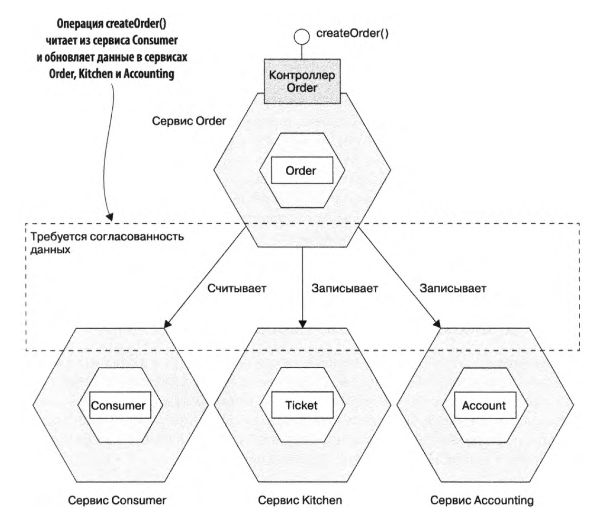

Первая *local transaction* инициируется внешним запросом `createOrder()`. Остальные пять *local transaction*'s запускаются после завершения предыдущей.

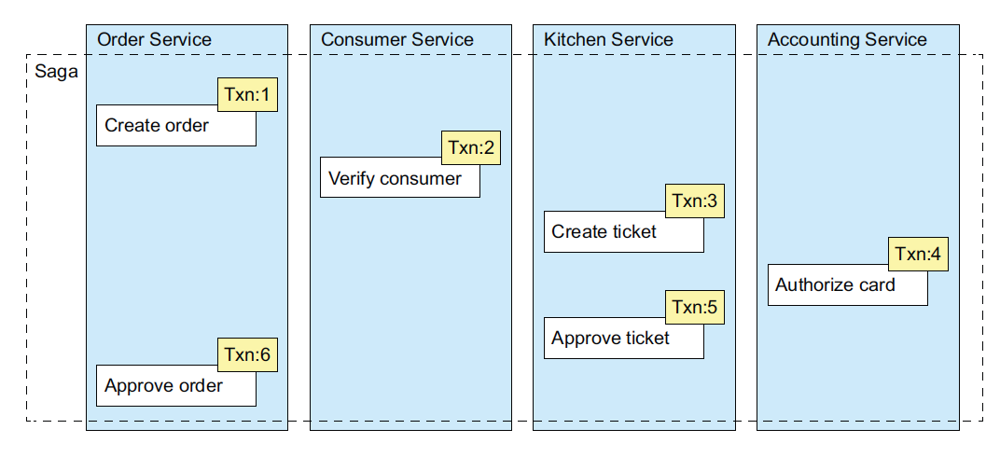

##### Компенсирующие *transaction*'s

*Saga* для операции `createOrder()` может *fail*'ится по разным причинам:

1. В сервисе `Consumer` – некорректная информация о *consumer*'е, или *consumer* не имеет права создавать *order*'ы.
2. В сервисе `Kitchen` – некорректная информация о ресторане, или ресторан не в состоянии принять *order*.
3. В сервисе `Accounting` – невозможность выполнить *authorize card*.

В таблице показаны основные *transaction*'s и компенсирующие *transaction*'s:

| Step | Сервис       | Transaction        | Компенсирующая *transaction*                              | Описание                     |
| ---- | ------------ | ------------------ | --------------------------------------------------------- | ---------------------------- |
| 1    | `Order`      | `createOrder()`    | `rejectOrder()`                                           | компенсируемая *transaction* |
| 2    | `Consumer`   | `verifyConsumer()` | – (не требуется, т.к. это читающая *transaction*)         |                              |
| 3    | `Kitchen`    | `createTicket()`   | `rejectTicket()`                                          | компенсируемая *transaction* |
| 4    | `Accounting` | `authorizeCard()`  | – (не требуется, т.к. это некомпенсируемая *transaction*) | поворотная *transaction*     |
| 5    | `Kitchen`    | `approveTicket()`  | – (не требуется, т.к. это некомпенсируемая *transaction*) | повторяемая *transaction*    |
| 6    | `Order`      | `approveOrder()`   | – (не требуется, т.к. это некомпенсируемая *transaction*) | повторяемая *transaction*    |

Пример последовательности *step*'ов при *fail*'е на шаге `authorizeCard()`:

```
createOrder() -> verifyConsumer() -> createTicket() -> authorizeCard() -> rejectTicket() -> rejectOrder()
```

При этом на каждом *step*'е изменяется статус какой-то сущности:

1. Сервис `Order`. Создает *Order* с `state = APPROVAL_PENDING`.
2. Сервис `Consumer`. Делает проверку *consumer*'а
3. Сервис `Kitchen`. Создает *Ticket* с `state = CREATE_PENDING`.
4. Сервис `Accounting`. Происходит *fail*.
5. Сервис `Kitchen`. Меняет для *Ticket* `state =  CREATE_REJECTED`.
6. Сервис `Order`. Меняет для *Order* `state = REJECTED`.


### У каждого сервиса своя БД

Преимущества:

- изолированная разработка БД, не нужно координировать свои действия с разработчиками других сервисов. 
- изолированное выполнение запросов, запросы одного сервиса в его БД не блокируют запросы другого сервиса в другую БД


## Ключ идемпотентности

Ключ идемпотентности - это рандомная строка, например. uuid. К каждому запросу клиент добавляет ключ идемпотентности в header'е. При повторе запрос запускаем с тем же ключом идемпотентности. Ключ идемпотентности сохраняем вместе с заказом. При повторных запросах проверяем, что были заказы с указанным ключом идемпотентности, и тогда больше не повторяем действия и сразу возвращаем результат обработки запроса. Клюс идемпотентности формируется клиентом и для одного и того же запроса - он одинаковый.


## Api-composition

Внутренний сервис рейтингов – хранит в базе рейтинг пользователей.

А внешний front-end сервис (api-composition) должен просто перепрокинуть ответ из внутреннего сервиса


## Api-gateway

Api-gateway решает следующие задачи:

- routing, куда направить пользовательский трафик, по URI определяет в какой сервис должен уйти request
- логи, мониторинг, error rate. Позволяют собирать метрики и логи по все системе. Позволяет верхнеуровнево наблюдать за всей системой. Особенно важно для микросервисной архитектуры, когда каждый сервис собирает логи в своем формате.
- Авторизация. В сервисе не нужно разбирать сессионную cookie и JWT токен. Это сделает api-gateway и спроксирует запрос с добавленными заголовками X-UserId и X-SessionId, которым можно доверять. Также фильтруются заголовки в запросе и убираются те, которые пользователь не имеет права выставить. 
- Firewall – умеет блокировать фрод и парсеров. 
- Размещение общей логики для всех приложений (часть этого Авторизация). Например, история переходов пользователей, определение часового пояса пользователя (прокидывается заголовок X-User-Timezone). 

Самый быстрый вариант - Nginx + Lua.

Его функции:

- принимает пользовательский трафик
- сбрасывает логи в sentry и clickhouse
- работает с сессиями и файерволом
- работает с некоторыми сервисами, например, user-online
- проксирует запросы на api-composition сервисы, которые формируют *response*
- далее request перенаправляется внутренним сервисам (brief)
- проксирует запросы на ssr-сервисы. Эти сервисы получают данные из *api-composition* (получается что ssr используется только при первой загрузке SPA). На frontend'е данные асинхронно получаяются через API вызовы в api-composition сервисы.

API-gateway нельзя назвать мини-монолитом, он выступает тонким прокси без возможности реализации бизнес-логики.

Чтобы избежать каскадного падения, отдельные пулы воркеров обслуживаются каждый route.

Используя правила афинити, можно положить api-gateway на каждую ноду (??? чтобы эта реплика обслуживала запросы этой ноды)

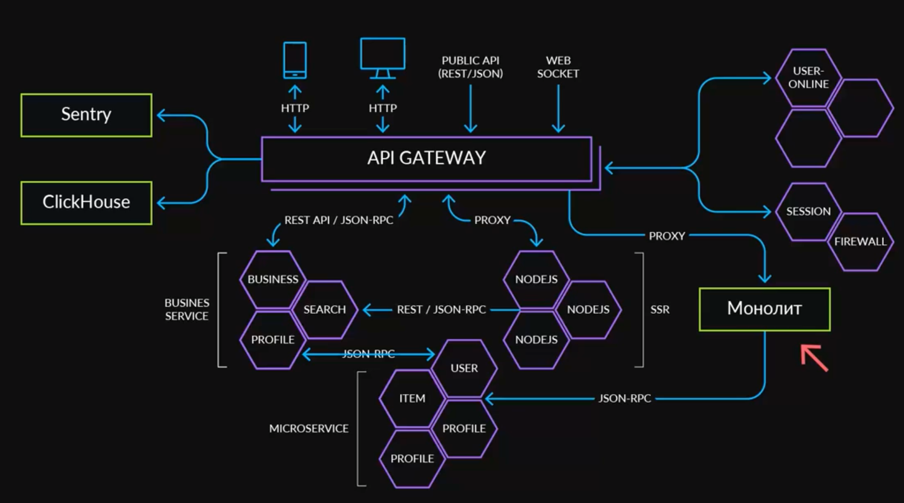

## Статьи

Сервис саг в Авито https://habr.com/ru/company/oleg-bunin/blog/418235/

Хореографическая сага https://habr.com/ru/company/karuna/blog/582808/

Перевод статьи из microservices.io https://habr.com/ru/post/427705/

видео про применение паттерна saga https://www.youtube.com/watch?v=xDuwrtwYHu8

ozon про оркестрируемую сагу https://habr.com/ru/company/ozontech/blog/590709/


## Выбор ключа идемпотентности

Если дублируются сущности в БД, то могут быть ретраи со стороны клиентов, в этом причина.

Чтобы их побороть надо добавить идемпотентность:

- выдавать ошибку, если уже есть такой твит
- использовать ключ идемпотентности (таймстемп????)


https://habr.com/ru/company/yandex/blog/442762/


