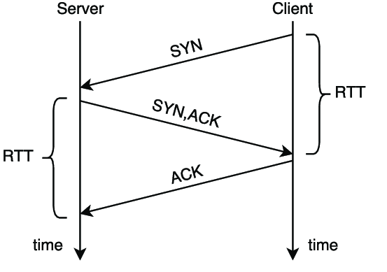

# Round trip

**Round-trip delay** (**RTD**) или **round-trip time** (**RTT**) – количество времени, которое требуется для отправки *network packet*'а, + количество времени, которое требуется для *acknowledgement* о получении этого *network packet*.  RTT также известен как **ping time** и может быть определен с помощью `ping` *command*.

[End-to-end delay](https://en.wikipedia.org/wiki/End-to-end_delay) или **one-way delay** (**OWD**) – это время, необходимое для прохождения *network packet*'а в одном направлении, которое часто приблизительно равно половине RTT.

Т.е. RTT = 2*OWD

