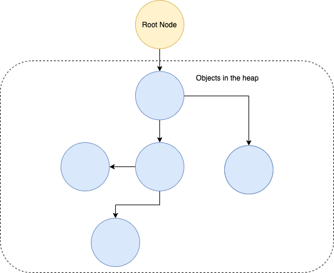

# Stack

https://gribblelab.org/teaching/CBootCamp/7_Memory_Stack_vs_Heap.html

*Stack* – это область памяти, в которой хранятся временные переменные, созданные каждой функцией (включая функцию `main()`). *Stack* – LIFO структура). 

Вызов одной функции из другой функции помещает (*push*) в *stack* новый *frame*, который будет содержать *value*'s этой новой функции и так далее. 

Когда функция завершается, ее *stack frame* (содержащий все *value*'s, помещенные (*pushed*) этой функцией в стек) удаляется. После освобождения этой части *stack*'а, память становится доступной для других переменных *stack*'а.

Преимущества использования *stack*'а:

- не нужно самостоятельно управлять памятью (не нужно вручную делать *allocate* и *free*)
- т.к. CPU эффективно управляет *stack memory*, чтение и запись переменных в *stack* происходит очень быстро.
- данные в *stack*'е доступны локально, в пределах *local scope*. 
- существует ограничение (зависит от ОС) на размер переменных, которые могут быть размещены в *stack*'е.
- 

# Heap

*Heap* - это область памяти, которая в С++ не управляется автоматически. В С++ память в *heap* выделяется явно с помозью `malloc()`. После выделения памяти, ее необходимо явно освободить с помощью `free()`. Иначе произойдет *memory leak* (утечка памяти). 

В отличие от *stack*'а, *heap* не имеет ограничений размера (кроме очевидных физических ограничений вашего компьютера). 

Когда программист определяет объект, который помещается в *heap*, выделяется необходимый объем *memory* и возвращается *pointer* на него. Память *heap* немного медленнее для *read/write* потому что для доступа к памяти в *heap* необходимо использовать *pointer*'ы.

В отличие от *stack*'а, *variable*, созданная в *heap*, доступна любой функции в любом месте вашей программы. *Variable* в *heap* по сути глобальна по своему охвату.

*Heap* — это граф, где объекты– это *node*'s, а *pointer*'ы между объектами – ребра. На объекты в *heap* может ссылаться код или другие объекты в *heap*. 

(картинка мне непонятна, т.к. что за Root node?  Это наверно *pointer* на некую сложную структуру в *heap* (например, на *struct*), через который мы можем вытащить все другие объекты в *heap* (например, поля *struct*).

# *Stack* и *heap* в Go

https://medium.com/eureka-engineering/understanding-allocations-in-go-stack-heap-memory-9a2631b5035d

https://stackoverflow.com/questions/10866195/stack-vs-heap-allocation-of-structs-in-go-and-how-they-relate-to-garbage-collec

https://segment.com/blog/allocation-efficiency-in-high-performance-go-services/

https://stackoverflow.com/questions/28484976/storing-a-pointer-to-a-stack-value-golang

https://stackoverflow.com/questions/38234487/returning-a-pointer-on-stack

