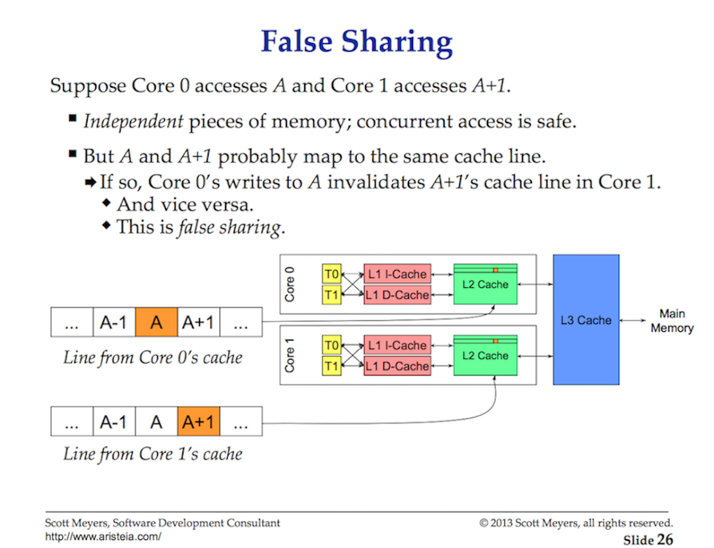

# Memory

Программа использует следующие виды *memory*:

- область для загрузки *bytecode*
- *stack*
- *heap*


## Stack

https://gribblelab.org/teaching/CBootCamp/7_Memory_Stack_vs_Heap.html

*Stack* – это:

- область памяти, в которой хранятся временные (локальные) переменные, созданные каждой функцией (включая функцию `main()`)
- ипользуется для *static memory allocation*

Работает по принципу *stack*'а (LIFO). Вызов одной функции из другой функции помещает (*push*) в *stack* новый *frame*, который будет содержать *value*'s этой новой функции и так далее. Каждый раз, когда функция объявляет новую *variable*, она *pushed* в самый верхний блок *stack*'а. 

Когда функция завершается, ее *stack frame* (содержащий все *value*'s, помещенные (*pushed*) этой функцией в *stack*) удаляется. После освобождения этой части *stack*'а, память становится доступной для других переменных *stack*'а.

Особенности:

- *Multi-thread* приложения часто имеют *stack* для каждого *thread*'а.

- Типичными данными, которые хранятся в *stack*'е, являются:

  - *local variable*'s (*value*)
  - *pointer*'ы
  - *function frame*.

- при переполнении происходит *stack overflow error* (ошибка переполнения стека)

  

Преимущества использования *stack*'а:

- не нужно самостоятельно управлять памятью (не нужно вручную делать *allocate* и *free*), не нужно выполнять GC
- т.к. CPU эффективно управляет *stack memory*, чтение и запись переменных в *stack* происходит очень быстро.
- данные в *stack*'е доступны локально, в пределах *local scope*. 

Недостатки:

- любые данные, хранящиеся в *stack*'е, должны быть *finite* (ограниченный по размеру, размер данных известен во время компиляции) и *static*.

- существует ограничение (зависит от ОС) на размер переменных, которые могут быть размещены в *stack*'е.

- не поддерживает динамическое выделение памяти

- размер *stack*'а ограничен по сравнению с *heap* (который ограничен только размером *memory*)

  

  


TODO!!!

- https://deepu.tech/memory-management-in-programming/


## Heap

*Heap* - это:

- область памяти, которая не управляется автоматически
- используется для *dynamic memory allocation*
- в отличие от стека, программе необходимо искать данные в *heap* с помощью *pointer*'ов

Особенности:

- *Heap* шарится между *thread*'ами приложения (а также между *goroutine*'s приложения).
- при недостатке памяти возникает *out of memory* ошибка (может запустится GC).

В С++ память в *heap* выделяется явно с помощью `malloc()`. После выделения памяти, ее необходимо явно освободить с помощью `free()`. Иначе произойдет *memory leak* (утечка памяти). 

Когда программист определяет объект, который помещается в *heap*, выделяется необходимый объем *memory* и возвращается *pointer* на него. 

В отличие от *stack*'а, *variable*, созданная в *heap*, доступна любой функции в любом месте вашей программы. *Variable* в *heap* по сути глобальна по своему охвату.

*Heap* — это граф, где объекты– это *node*'s, а *pointer*'ы между объектами – ребра. На объекты в *heap* может ссылаться код или другие объекты в *heap*. 


Преимущества:

- динамическое выделение памяти
- В отличие от *stack*'а, *heap* не имеет ограничений размера (кроме очевидных физических ограничений вашего компьютера). 
- Как правило, нет ограничений на размер значения, которое может храниться в *heap*.

Недостатки:

- *heap* сложнее управлять из-за ее динамической природы. Справиться с этой сложностью помогают решения по автоматическому управлению памятью (GC).
- память *heap* немного медленнее для *read/write* потому что для доступа к памяти в *heap* необходимо использовать *pointer*'ы.

В *heap* помещаются:

- глобальные переменные
- *reference* типы (*object, string, map, ...*)

- 

## *Stack* и *heap* в Go

Место хранения variable (stack или heap) не влияет на семантику программы. Однако влияет на ее эффективность.

Go (в отличии от многих языков c GC) предпочитает *allocate* объекты в *stack*'е, поэтому большая часть объектов оказывается там. В Go у каждой *goroutine* есть *stack*, и, когда это возможно, Go будет *allocate* объекты в этом *stack*'е. Когда это возможно, компилятор будет *allocate variable*, которая является локальной для *function* в *stack frame* этой *function*. 

Компилятор Go пытается доказать, что *variable* не используется вне *function* и не "убегает" (*escape*) за ее пределы, используя *escape analysis*. Если компилятор может определить время жизни *variable*, то он размещает ее в *stack*'е, а не в *heap*. 

Однако, если компилятор не может доказать, что на *variable* не остаются *reference* после возврата из *function*, компилятор должен *allocate variable* в *heap*. Если время жизни *variable* неизвестно, она будет размещена в *heap*.  Кроме того, если *local variable* очень велика, может иметь смысл хранить ее в *heap*, а не в *stack*'е. Если *local variable*, объявленная в функции, *allocate* в *heap*, мы можем сказать, что *variable escape* (убегает) в *heap*. 

Пример:

```go
type myStruct struct {
  value int
}

var testStruct = myStruct{value: 0}

func addTwoNumbers(a int, b int) int {
  return a + b
}
func myFunction() {
  testVar1 := 123
  testVar2 := 456
  testStruct.value = addTwoNumbers(testVar1, testVar2)
}
func someOtherFunction() {
  // some other code
  myFunction()
  // some more code
}
```

Будем считать, что это часть работающей программы (??? библиотека). Потому что если бы этот код – был целой программой, то компилятор Go оптимизировал бы ее и разместил *variable*'s в *stack*'е. 

Итак:

1. Переменной `testStruct` присваивается значение и она помещается в *heap*.

2. При вызове `myFunction()` выполняется *push* в *stack* нового *stack frame*. Переменные `testVar1` и `testVar2` сохраняются в этом *stack frame*.

3. При вызове `addTwoNumbers()` выполняется *push* в *stack* нового *stack frame* с двумя аргументами `a` и `b`.

4. Когда завершается выполнение функции `addTwoNumbers()`, результат возвращается в функцию `myFunction()`, для *stack frame* функции `addTwoNumbers` выполняется *pop* из *stack*'а, соответствующий блок *memory* освобождается.

5. Обращаемся по адресу переменной `testStruct` в *heap*, и изменяем значение поля `value`

6. Когда завершается выполнение функции `myFunction()`, аналогично, для *stack frame* выполняется *pop* и *memory* освобождается. 
7. Переменная `testStruct` остается в *heap* до тех пор, пока не произойдет *garbage collection*.

Переменная `testStruct` осталась лежать в *heap*, и без специального анализа *Go runtime* не знает, нужна ли она еще. Чтобы понять это Go использует *garbarge collector*.

Можно запустить `go build -gcflags -m`, чтобы увидеть, какие *local variable*'s будут *escape* в *heap* во время выполнения.


Если для *variable* извлекается адрес с помощью оператора `&` или выделяется память для нового значения с помощью `make` или `new`, то она обычно размещается в *heap*. Однако базовый *escape analysis* распознает некоторые случаи, когда такие *variable* не будут жить после возврата из функции и могут находиться в *stack*'е (в отличии от C++, там всегда в *heap*).

Пример:

```go
func foo(a []string) {
      fmt.Println(len(a))
}

func main() {
      foo(make([]string, 8))
}
```

В этом примере `make([]string, 8)` выделяет память в *stack*'е. 

Можете использовать команду `go build -gcflags -m`, чтобы увидеть результаты escape-анализа:

```bash
go build -gcflags -m
./server.go:10:10: make([]string, 8) does not escape
```

Еще один пример, где *pointer* `X` не *escape*:

```go
type X struct {v int}

func foo(x *X) {
    fmt.Println(x.v)
}

func main() {
    x := &X{1}
    foo(x)
}

go build -gcflags=-m
./main.go:7: foo x does not escape
./main.go:12: main &X literal does not escape
```

*Escape analysis* гораздо хуже работает, когда появляются интерфейсы:

```go
// Пример 1
type Fooer interface {
      foo(a []string)
}

type FooerX struct{}

func (FooerX) foo(a []string) {
      fmt.Println(len(a))
}

func main() {
      a := make([]string, 8) // make([]string, 8) escapes to heap
      var fooer Fooer
      fooer = FooerX{}
      fooer.foo(a)
}
```

```go
// Пример 2
func foo(a interface{}) string {
      return a.(fmt.Stringer).String()
}

func main() {
      foo(make([]string, 8)) // make([]string, 8) escapes to heap
}
```

Еще детали:

- если поле *struct value* – *escape* в *heap*, то *struct value* целиком – также *escape* в *heap*.
- 

Передача *pointer/value* (расширить и в отдельный раздел):

- для небольших *struct*, которые вам не нужно изменять, предпочтительно использовать передачу *by value*, а не *by pointer*.
- для больших *struct* дешевле передать *by pointer*, чем скопировать всю *struct* и передать её *by value*.


https://medium.com/eureka-engineering/understanding-allocations-in-go-stack-heap-memory-9a2631b5035d

https://stackoverflow.com/questions/10866195/stack-vs-heap-allocation-of-structs-in-go-and-how-they-relate-to-garbage-collec

https://segment.com/blog/allocation-efficiency-in-high-performance-go-services/

https://stackoverflow.com/questions/28484976/storing-a-pointer-to-a-stack-value-golang

https://stackoverflow.com/questions/38234487/returning-a-pointer-on-stack


# OS scheduler

OS scheduler (планировщик ОС)

Задача *thread*'а — последовательно выполнять назначенный ему набор *machine instruction*'s. Выполнение продолжается до тех пор, пока не останется *instruction*'s для выполнения *thread*'а. *Thread* – это путь исполнения.

Каждая *program*'а, которую вы запускаете, создает *Process*, а каждому *Process*'у — начальный *Thread*. *Thread*'ы имеют возможность создавать больше *Thread*'ов. Все эти разные *Thread*'ы работают независимо друг от друга, и решения по планированию принимаются на уровне *Thread*'ов, а не на уровне *Process*'ов (??? т.е. они сами конкурируют за ресурсы). *Thread*'ы могут работать *concurrent* (по очереди на одном ядре) или *parallel* (одновременно на разных ядрах). *Thread*'ы также поддерживают свой собственный *state*, чтобы обеспечить безопасное, локальное и независимое выполнение их инструкций.

*OS scheduler* отвечает за то, чтобы *core*'s не простаивали, если есть *Thread*'ы, которые могут выполняться. Это также должно создать иллюзию того, что все *Thread*'ы, которые могут выполняться, выполняются одновременно. В процессе создания этой иллюзии *scheduler* должен запускать раньше *Thread*'ы с более высоким приоритетом. Тем не менее, *Thread*'ы с более низким приоритетом не могут быть полностью лишены времени выполнения. 

## Выполнение инструкций

[Program counter](https://en.wikipedia.org/wiki/Program_counter) (PC, instruction pointer, IP, счетчик команд) позволяет *Thread*'у отслеживать следующую *instruction* для выполнения. В большинстве процессоров IP указывает на следующую *instruction*, а не на текущую.


Рассмотрим следующую программу:

```go
package main

func main() {
	example(make([]string, 2, 4), "hello", 10)
}

//go:noinline
func example(slice []string, str string, i int) error {
	panic("Want stack trace")
}
```

Она выводит *stack trace* программы Go:

```
/usr/local/opt/go/libexec/bin/go build -o ...
panic: Want stack trace

goroutine 1 [running]:
main.example({0xc000044730, 0x2, 0x4}, {0x1065e6e, 0x5}, 0xa)
        /Users/paparshikov/repos/localhost/go/server.go:9 +0x27                      <- Здесь
main.main()
        /Users/paparshikov/repos/localhost/go/server.go:4 +0x52                      <- И здесь

/*  Вызов:
    main.example(make([]string, 2, 4), "hello", 10)
    Значения в hex: (0xc000044730, 0x2, 0x4, 0x106abae, 0x5, 0xa)
    
    Slice Value:      0xc000044730, 0x2, 0x4
    String Value:     0x106abae, 0x5    // pointer на byte's и length
    Integer Value:    0xa
*/

```

В конце каждой строки стоят шестнадцатеричные числа (`+0x27` и `+0x52`).

Посмотрим на *objdump* функции `example()`:

```bash
$ go tool objdump -S -s "main.example" ./server
TEXT main.example(SB) /Users/paparshikov/repos/localhost/go/server.go
func example(slice []string, str string, i int) error {
  0x1054000             493b6610                CMPQ 0x10(R14), SP      
  0x1054004             7622                    JBE 0x1054028           
  0x1054006             4883ec18                SUBQ $0x18, SP          
  0x105400a             48896c2410              MOVQ BP, 0x10(SP)       
  0x105400f             488d6c2410              LEAQ 0x10(SP), BP       
        panic("Want stack trace")
  0x1054014             488d0545430000          LEAQ runtime.rodata+16960(SB), AX               
  0x105401b             488d1d7e180200          LEAQ runtime.buildVersion.str+16(SB), BX        
  0x1054022             e8f962fdff              CALL runtime.gopanic(SB)                        
  0x1054027             90                      NOPL                                           <--- Здесь IP(+0x27)                                        
func example(slice []string, str string, i int) error {
  0x1054028             e8f3cfffff              CALL runtime.morestack_noctxt.abi0(SB)  
  0x105402d             ebd1                    JMP main.example(SB)
```

Эти числа представляют *offset* для IP от вершины соответствующей функции. Значение IP `+0x27` – это следующая *instruction*, которую *Thread* выполнил бы внутри функции `example()`, если бы программа не бросила `panic()`. Т.е. она на `0x27` байтов ниже начальной *instruction* для функции. Эта *instruction* (IP) помечена стрелкой в *objdump*. 

*Instruction* перед IP –  это та *instruction*, которая выполнялась. В *objdump* – это вызов *panic* (`CALL runtime.gopanic(SB)`).

Значение IP `+0x52` – это следующая *instruction* внутри функции `main()`, которая была бы выполнена, если бы управление вернулось к этой функции. 

## Thread State

*Thread State* (состояние *thread*'а) – определяет роль *scheduler*'а в отношении *thread*'а. *Thread* может находиться в одном из трех *state*'s:

- `waiting` (ожидающий) – *thread* остановлен и ожидает (*waiting*) чего-то, чтобы продолжить. Например, из-за ожидание *hardware* (*disk, network*), *operating system* (*system call*), *synchronization call* (*atomic, mutex*). Эти типы *scheduling* [latency](https://en.wikipedia.org/wiki/Latency_(engineering)) (задержек планирования) являются основной причиной для низкого *performance*.
- `runnable` (готовый к выполнению) –  *thread*'у требуется время на ядре, чтобы он мог выполнять назначенные ему *machine instruction*. Если у вас много *thread*'ов, которым нужно время, то *thread*'ы должны ждать дольше, чтобы получить время. Кроме того, индивидуальное количество времени, которое получает каждый конкретный *thread*, сокращается, поскольку большее количество *thread*'ов конкурирует за время. Этот тип *scheduling latency* также может быть причиной низкого *performance*.
- `executing` (исполняющийся) –  *thread* размещен на ядре и выполняет свои *machine instruction*. Т.е. исполняется приложение. Работа, связанная с приложением, ведется.

## Типы работ

Существует два типа работ, которую может выполнять *thread*:

- **CPU-Bound** – работа, которая никогда не создает ситуации, когда *thread* может быть помещен в состояние `waiting`. Это работа, которая заключается в постоянном выполнении вычислений. Например, *thread*, вычисляющий число **π** (пи) до n-ой цифры, будет *CPU-Bound*.
- **IO-Bound** – работа, которая заставляет *thread* входить в состояние `waiting`. Это работа, которая заключается в запросе доступа к ресурсу по *network* или совершении *system call* в *operating system*. Например, *thread*, которому необходимо получить доступ к *database*, будет *IO-Bound*. Также можно считать, что *synchronization event* (*mutexes, atomic*), которые заставляют заставляет *thread* входить в состояние `waiting`, можно также рассматривать как часть этой категории.

## Context Switching

В ОС (Linux, Mac, Windows) используется *preemptive scheduler* (упреждающий планировщик) (подробнее смотреть [preemptive multitasking]())

Это значит:

- невозможно предсказать, какие *thread*'ы в какой момент времени будут *run*. Приоритеты *thread*'ов вместе с событиями (например, получение данных по *network*) делают невозможным определение того, что *scheduler* выберет для выполнения и когда.

- вы никогда не должны писать код, основанный на некотором предполагаемом поведении, которое вам посчастливилось встретить, но которое не гарантируется каждый раз. Можно подумать, что если что-то случается некоторым образом 1000 раз, то это гарантированное поведение. Вы должны управлять синхронизацией и оркестрацией *thread*'ов, если вам нужен детерминизм в вашем приложении.

Физический акт *swapping*'а *thread*'ов на *core* называется *context switch* (переключение контекста). *Context switch* происходит, когда :

- *scheduler pull off* (вытесняет) *executing thread* (состояние `executing`) с *core*. Он может вернуться в состояние `runnable` (если он все еще может быть *run*) или в состояние `waiting` (если он был вытеснен из-за *IO-Bound*).
- *scheduler* заменяет его на *runnable thread* (состояние `runnable`). Этот *thread* (который был взят *run queue*) переходит в состояние `executing`. 

Выполнять *context switch* дорого, потому что на это требуется время. *Latency* во время *context switch* зависит от различных факторов и обычно составляет от ~1000 до ~1500 наносекунд . Учитывая, что *hardware* обычно выполняет около 12 *instruction*'s в наносекунду на *core*, *context switch* может стоить вам от ~12k до ~18k *instruction*'s, т.е. мы получаем существенный *overhead*.

Если программа выполняет *IO-Bound* работу, то ей необходим *context switch*. Как только *thread* переходит в состояние `waiting`, его место занимает другой *thread* в состоянии `runnable`. Это позволяет *core* всегда выполнять работу.

Если программа выполняет *CPU-Bound* работу, то *context switch* – вреден для нее. *Context switch* останавливает выполнение работы, в том время как *thread* может выполнять работу и не входит в состояние `waiting`. 

## Принцип работы *scheduler*'а

Если процессоры имеет только одно *core*, то принцип планирования очень прост:

- в один момент времени может выполняться только один *thread*.
- необходимо определить *scheduler period* – например, 1000 мс (1 секунда)
- будем выполнять все *thread*'ы в состоянии `runnable` в течение *scheduler period*'а. Допустим у нас есть 10 *thread*'ов. Возьмем *scheduling period* (1000 мс) и разделим его на количество *thread*'ов (10), которые необходимо выполнить. То есть каждый *thread* получает по 100 мс. 

Но если у вас много *thread*'ов (например, 1000), то процент времени, который вы тратите на *context switch*, будет очень большим по сравнению с количеством времени, которое вы будете тратить на работу приложения. Т.е. нужно установить ограничение, насколько малым может быть квант времени *thread*'а. Например, установим минимальный квант времени *thread*'а в 10 мс и запустим 1000 *thread*'ов, тогда *scheduler period* необходимо увеличить до 10000 мс (10 секунд). Но это также значит, что если каждый *thread* полностью использует свой квант времени, то для однократного запуска всех *thread*'ов потребуется 100 секунд.

На самом деле, это немного упрощенный взгляд на мир. Есть еще много вещей, которые *scheduler* должен учитывать при принятии решений. Когда запущено много *thread*'ов и выполняется *IO-Bound* работа, то возникает больше хаоса и недетерминированного поведения. А это означает увеличение времени на *scheduling* и выполнение.

## Соотношение числа *core*'s и *thread*'ов

Необходимо найти баланс между количеством *core* и количеством *thread*'ов, чтобы получить наилучшую *throughput* (пропускную способность). В других языках (C++) используют *thread pool* (пулы потоков). В Go в этом нет необходимости, что значительно упрощает разработку многопоточных приложений.

Например, при написании кода на C++ и C# для Windows NT обязательным при написании многопоточного приложения было использование *IOCP thread pool*'ов. IO Completion Port (порт завершения ввода-вывода) – очередь событий ядра, из которой извлекаются и в которую добавляются сообщения об операциях I/O. Когда над файлом инициируется асинхронная операция I/O, то после ее завершения соответствующая запись добавляется в *port*. Для обработки результатов используется *thread pool*, количество которых выбирается пользователем. Когда *thread* присоединяют к *pool*'у, он извлекает из очереди один результат операции и обрабатывает его. Если на момент присоединения очередь пуста, то *thread* засыпает до тех пор, пока не появится сообщение для обработки.

Вам необходимо было самостоятельно выяснить, сколько нужно *thread pool*'ов и сколько *thread*'ов внутри каждого *thread pool*'а, чтобы максимизировать *throughput* (пропускную способность) для заданного числа *core*'s.

При написании веб-сервисов, взаимодействующих с *database*, было определено, что 3 *thread*'а на *core* давало наилучшую *throughput* в *Windows NT*. 3 *thread*'а на *core* минимизировали затраты на *context switch* и максимально увеличивали время выполнения на *core*'s. При создании *IOCP Thread pool*'а я учитывал, что надо начинать с минимум 1 *thread*'а и максимум 3 *thread*'ов для каждого *core*, которые есть на *host machine*.

При использовании 2 *thread*'ов на *core*, для выполнения приложения потребовалось бы больше времени, потому что образовалось бы *idle time*, когда приложение могло бы выполняться. При использовании 4 *thread*'ов на *core*, выполнение приложения также заняло бы больше времени, потому что было бы больше задержек на на *context switch*. Соотношение в 3 *thread*'а на *core*, по какой-то причине, всегда было наиболее эффективно для NT.

Что делать, если ваш сервис выполняет много разных видов работы? Это может создать разные и непоследовательные *latency* (задержки). Возможно, это также создает множество различных *system-level event*'ов, которые необходимо обрабатывать. Может оказаться невозможным найти магическое соотношение, которое работает все время для всех различных рабочих нагрузок. При использовании *thread pool*'ов бывает очень сложно найти правильную согласованную конфигурацию.

## Cache Line

Доступ к данным из основной *memory* сопряжен с такой высокой *latency* (от 100 до 300 *clock cycles* (тактов)), что *processor*'ы и *core*'s  имеют локальные *cache*'s, чтобы хранить данные рядом с *hardware thread*'s, которым они нужны. Доступ к данным из *cache*'s обходится гораздо дешевле (от ~3 до ~40 *clock cycle*'s) в зависимости от *cache*, к которому обращаются. Сегодня одним из аспектов производительности является то, насколько эффективно вы можете передавать данные в *processor*, чтобы уменьшить эти *latency* доступа к данным. При написании *multithread* приложений, изменяющих состояние, необходимо учитывать механику *caching system*.


Обмен данными между *processor*'ом и *main memory* осуществляется с помощью *cache line*'s. [*Cache line*](#cache-entry) — это 64-байтовый блок *memory*, которым обмениваются *main memory* и *caching system*. Каждому *core* предоставляется собственная копия необходимой ему *cache line*, т.е. каждый *core* оперирует своей копией *value* (а не *pointer*'ом на одно *value*). Вот почему мутации (изменение) *memory* в многопоточных приложениях могут привести к проблемам с *performance*.

Когда несколько *thread*'ов, работающих параллельно, обращаются к одному и тому же *value* или даже к *value*'s, расположенным рядом друг с другом, они будут обращаться к одной и той же *cache line*. *Thread*, работающий на любом *core*, получит свою собственную копию (почему собственную, они не делятся между *thread*'ами на одном *core*?) той же *cache line*.



Если один *thread* на данном *core* вносит изменения в свою копию *cache line*, то с помощью магии *hardware* все остальные копии той же *cache line* должны быть помечены как *dirty*. Когда *thread* читает или пишет в *dirty cache line*, требуется доступ к *main memory* (от ~100 до ~300 *clock cycles*), чтобы получить новую копию *cache line*. Чем больше core's, тем больше *latency* при обмене данными между ними. Еще хуже, когда в системе несколько *processor*'ов, возникает дополнительная *latency* при обмене данными между процессорами. *Memory* станет узким местом, а *performance* упадет. Необходимость поддерживать согласованность данных во множестве cashe'й называется *cache-coherency problem* (проблема когерентности кеша). 

Также существует проблема [false sharing](#false-sharing) (ложное совместное использование ресурсов).


# Cache entry

Данные передаются между *memory* и *cache* блоками *fixed size* (как правило, 64 байта), которые называются *cache line* (строка кеша) или *cache block* (блок кеша). Когда *cache line* копируется из *memory* в *cache*, создается *cache entry*. *Cache entry* включает в себя:

- скопированные данные
- запрошенная *memory location* (ячейка памяти, называемая *tag*) (??? тот *location*, откуда были взяты данные)

Когда *processor*'у необходимо прочитать или записать в *memory location*, он сначала проверяет наличие соответствующей *cache entry*. *Cache* проверяет содержимое запрошенной *memory location* во всех *cache line*'s, которые могут содержать этот *address*. Если *processor* обнаруживает, что *memory location* находится в *cache*, происходит *cache hit*. Если *processor* не находит *memory location* в *cache*, происходит *cache miss*. В случае *cache hit*, *processor* немедленно (??? что значит немедленно, сразу) считывает или записывает данные в *cache line*. При *cache miss*, *cache allocate* новую *entry* и копирует данные из *main memory*, затем выполняется запрос из содержимого *cache*.


# False sharing

*False sharing* (ложное совместное использование ресурса) – зависимость на ресурс между *core*'s' в системах с распределенными когерентными *cache*'ами, снижающая производительность. Когда *core* обращается к данным, которые не изменяются другими *core*'s, но эти данные находятся внутри одной *cache line* с данными, которые были изменены, *caching system* требует перезагрузить всю *cache line*, несмотря на отсутствие логическая необходимость. *Caching system* не знает, по какой причине *cache line* стала *dirty*, и вынуждает *core* нести *cache overhead*, аналогичный как и при *true sharing* (реальном совместном использовании ресурса).


# Coroutine

*Coroutine* (*сопрограмма*) — компонент компьютерной программы, который взаимодействует с другими такими же компонентами по принципу [*cooperative multitasking*](#cooperative-multitasking) (кооперативной многозадачности, *non-preemptive multitasking*, невытесняющей многозадачности): компонент приостанавливается в определённой точке, сохраняя полное состояние (включая [*call stack*](https://en.wikipedia.org/wiki/Call_stack) (стек вызовов) и [*program counter*](https://en.wikipedia.org/wiki/Program_counter) (счётчик команд)), и передаёт управление другому, тот, в свою очередь, выполняет задачу и передаёт управление обратно, сохраняя свои стек и счётчик. *Coroutine* являются средством обеспечения «легковесной» программной *multithreading* (многопоточности). В том смысле, что могут быть реализованы без использования механизмов *[context switch](https://en.wikipedia.org/wiki/Context_switch)* для ОС.

## Сравнение с

### Subroutine

*Subroutine* (подпрограмма, *function*, функция) – последовательность [*program instruction*'s](https://en.wikipedia.org/wiki/Instruction_(computer_science)), которая выполняет определенную задачу и упакована как единый блок. 

*Coroutine* являются развитием *subroutine* (функций). При вызове *subroutine* выполнение начинается с самого начала, и как только происходит выход из *subroutine*, она завершается. *Subroutine instance* (один экземпляр)  может быть вызван только один раз и не сохраняет *state* между вызовами. 

Напротив, *coroutine* имеет:

- стартовую точку входа
- размещённые внутри *coroutine* последовательность выходов и следующих за ними точек входа. Эти места в коде отмечаются командой [yield](#yield). При этом происходит переход к другой *coroutine*, а затем возврат к точке, где был произведен *yield* в исходной *coroutine*. Таким образом, *coroutine instance* сохраняет *state*; одновременно может быть несколько *instance*'s данной *coroutine*. *Coroutine* может может получать *control* несколько раз


### Thread'ы

*Coroutine* похожи на [*thread*](https://en.wikipedia.org/wiki/Thread_(computing))'ы. Однако *coroutine* поддерживают [*cooperative*  (*non-preemptive*) *multitasking*](#cooperative-multitasking), тогда как *thread*'ы поддерживают *preemptive multitasking*. 


# Виды Multitaskong

## Cooperative multitasking

*Cooperative multitasking* (кооперативная многозадачность, *non-preemptive multitasking*, невытесняющая многозадачность) – тип [*multitasking*](https://en.wikipedia.org/wiki/Computer_multitasking), при котором ОС никогда не инициирует [context switch](https://en.wikipedia.org/wiki/Context_switch) с *running process*'а (исполняющегося) на другой *process*. Вместо этого, чтобы обеспечить *concurrency*, *process*'ы периодически добровольно [*yield control*](#yield) (уступают управление), когда *idle* или логически [*blocked*](https://en.wikipedia.org/wiki/Blocking_(computing)) (*blocked* — это *process*, ожидающий какого -либо *[event](https://en.wikipedia.org/wiki/Event_(computing))*'а, такого как доступность [*resource*](https://en.wikipedia.org/wiki/Resource_(computer_science)) ресурса или завершение [*I/O operation*](https://en.wikipedia.org/wiki/I/O_operation)). Этот тип *multitasking* называется *cooperative*, потому что все программы должны кооперироваться, чтобы схема *scheduling*'а работала.

В этом случае [*scheduler*](https://en.wikipedia.org/wiki/Process_scheduler) называется *cooperative scheduler*, и его роль ограничена запуском *process*'ов и предоставлением им возможности добровольно вернуть *control*.

Поскольку *cooperative multitasking* система полагается на то, что каждый *process* регулярно уступает время другим *process*'ам в системе, одна плохо спроектированная программа может потреблять все время процессора для себя, например, выполняя сложные вычисления или [*waiting*](https://en.wikipedia.org/wiki/Busy_wait). Это приведет к [*зависанию*](https://en.wikipedia.org/wiki/Hang_(computing)) (*hang*) всей системы.

*Cooperative multitasking* позволяет значительно упростить реализацию приложений, поскольку их выполнение никогда не прерывается неожиданно *scheduler*'ом.

## Preemptive multitasking

Для того чтобы обеспечить работу нескольких *proccess*'ов одновременно, большинство OS реализуют *preemptive multitasking* (вытесняющую многозадачность). *Proccess*'у выделяется определенный временной промежуток и конкретный *processor*, на котором он работает. По истечении этого времени OS вытесняет *proccess* и запускает на его месте другой, если есть готовый к запуску.

Прерывание реализовано следующим образом – OS просит железо посылать ей сигнал с определенной периодичностью и назначает на этот сигнал обработчик. Когда сигнал приходит, *processor* останавливает все, что в данный момент работает на нем, и запускает заданный обработчик. В этом обработчике OS может вытеснить текущий процесс и заменить его другим (или сделать что-то другое).


https://en.wikipedia.org/wiki/Preemption_(computing)#PREEMPTIVE

TODO!!!


# Space

OS разделяет [*virtual memory*](https://en.wikipedia.org/wiki/Virtual_memory) на *user space* (пространство пользователя) и *kernel space* (пространство ядра). Это разделение необходимо, чтобы обеспечить [*memory protection*](https://en.wikipedia.org/wiki/Memory_protection) (*защиту памяти*) и *hardware protection* от вредоносного или ошибочного поведения *software*.

## User space

*User space* — это область *memory*, в которой выполняются [*application software*](https://en.wikipedia.org/wiki/Application_software) (прикладное ПО) и некоторые *driver*'s.

Термин *user space* (или *userland*) относится ко всему коду, который выполняется вне *OS kernel*. *User space* обычно относится к различным программам и библиотекам , которые OS использует для взаимодействия с *kernel*: *software*, которое выполняет I/O, манипулирует объектами файловой системы , *application software* и т. д.

Каждый *proccess* в *user space* обычно работает в своем собственном *[virtual memory](https://en.wikipedia.org/wiki/Virtual_memory) space*, если это явно не разрешено, не может получить доступ к *memory* других *process*'ов. Это основа [*memory protection*](https://en.wikipedia.org/wiki/Memory_protection) в современных ОС и строительный блок для [разделения привилегий](https://en.wikipedia.org/wiki/Privilege_separation)  Имея достаточные *privilege*'s, *process*'s могут запросить у *kernel*, отобразить (смапить) часть *memory space* другого *process*'а на свой собственный, как в случае с *debugger*'ами. 

## Kernel space

*Kernel space* строго зарезервировано для запуска привилегированного *OS kernel*, расширений *kernel* и большинства *device driver*'ов.

Примеры компонентов внутри Linux, которые запускаются в различных *mode* (*space*):


# Yield

*Yield* (уступка) – это действие во время *multithreading*'а, которое заставляет процессор отказаться от *control* над текущим *running thread*'ом и отправить его в конец *running queue* с тем же *[scheduling](https://en.wikipedia.org/wiki/Scheduling_(computing)) priority*.

