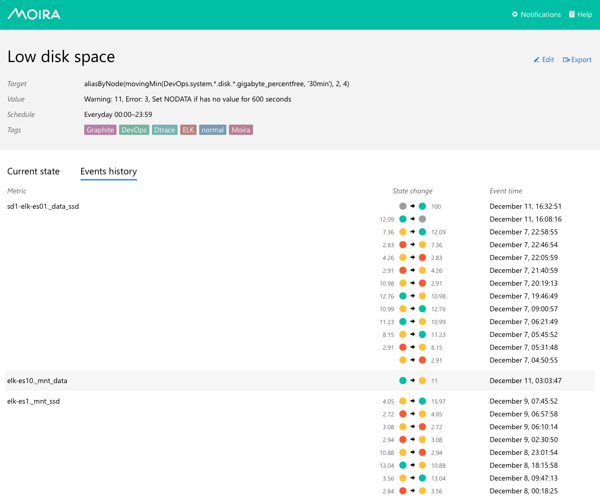
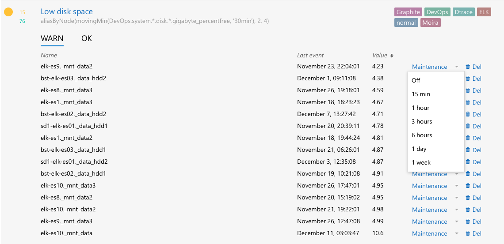

Мониторинг состоит из частей:

- сбор метрик
- хранение
- визуализация
- алертинг

Graphite – использует очень простой протокол. Конектишься на порт Graphite и отправляешь строку в формате:

```
<path> <value> [timestamp]
moira.checkers.error.description 0.0
```

- `<path` – метрика, записанная в виде пути. Как правило, в формате `<имя проекта>.<имя сервиса>....`

У Graphite удобный API, который позволяет использовать:

- pattern, со звездочкой `moira.checkers.error.*`
- использовать функции `sumSeries()`


https://ish-ar.io/observability/

# Общая архитектура

https://logz.io/blog/prometheus-vs-graphite/

https://laptrinhx.com/monitoring-and-alert-system-using-graphite-and-cabot-176261188/

https://wikitech.wikimedia.org/wiki/Graphite

Система мониторинга состоит из следующих компонентов. Каждый из этих компонентов может быть реализован несколькими готовыми *tool*'s, которые можно скопоновать вместе.

1. Collector (сборник) – инструмент для сбора метрик от компонентов и *service*'s

   - collectd
   - statsd

2. Forwarding  (пересылка) – инструмент для агрегирования метрик, полученных от различных *service*'s и их маршрутизации на разные *storage backend*'s

   Примеры:

   - Carbon (???)
   - carbon-relay-ng – Это carbon, написанный на Go. Он лучше масштабируется и держит большую нагрузку. Он используется для forwarding'а *metric*'s в InfluxDB

3. Visualization (визуализация) – создания графиков и визуализация *metric*'s

   Примеры:

   - Grafana 

4. API's – backend, который предоставляет API для запроса *metric* для *dashboard*'s и *alerting system*'s

   - Graphite
   - graphite-api

5. *Storage backends* – *database* для хранения *time-series metrics*

   Примеры:

   - InfluxDB - это *database*, написанная на Go, в основном для хранения *time-series metric data*. 

6. *Monitoring*, *alerting* – система проверки *metric*'s и отправки *alert*'s (*notification*'s). 


# Graphite

Graphite выполняет две функции:

1. Хранение числовых *time-series* данные 
2. Отображение графиков из этих данных по запросу

Graphite - это хорошо масштабируемая система реального времени для построения графиков. Приложение собирает числовые *time-series* данные и отправляет их в бэкэнд *Graphit*'а (*carbon*), который хранит данные в специализированной базе данных. Затем данные могут быть визуализированы через веб-интерфейс *Graphit*'а.

## *Placeholder*'ы для *metric*

https://graphite.readthedocs.io/en/latest/render_api.html#graphing-metrics

## Функции

https://graphite.readthedocs.io/en/latest/functions.html

### `alias()`

```
alias(seriesList, newName)
alias(Sales.widgets.largeBlue,"Large Blue Widgets")
```

Принимает одну *metric* или *wildcard seriesList* и строку в кавычках. Печатает строку вместо *metric name* в легенде.


### `aliasByNode()`

```
aliasByNode(seriesList, *nodes)
```

Принимает *seriesList* и применяет *alias*, полученный из одной или нескольких частей *“node”* целевого *name* или *tags*. Индексы node's начинаются с 0.

Каждая *node* может быть целым числом, указывающим на *node* в *series name*, или строкой, идентифицирующей *tag*.


### `aliasSub()`

```
aliasSub(seriesList, search, replace)
```

Применят для *series names* регулярное выражение из `search` и делает замену на `replace`.


### `consolidateBy()`

Полезно:

- чтобы отображать правильные *total* по метрикам в *graphana*, когда нужно сделать `sum`
- когда нужно, чтобы *graphite* не усреднял значения во временных интервалах.

```
consolidateBy(seriesList, consolidationFunc)
```

```
aliasByNode(consolidateBy(env.$env.apps.services.adv-credit-broker.sravni.*.*, 'sum'), 6, 7)
```


Принимает одну *metric*, *wildcard seriesList* и *consolidation function name*.

Допустимые имена функций: `‘sum’`, `‘average’/’avg’`, `‘min’`, `‘max’`, `‘first’` & `‘last’`.

Когда строится график, ширина которого в пикселях меньше, чем количество точек данных для построения графика, Graphite объединяет значения, чтобы предотвратить перекрытие линий. Функция `consolidateBy()`  изменяет функцию консолидации со значения по умолчанию `‘average’` на одно из `‘sum’`, `‘max’`, `‘min’`, `‘first’`, или `‘last’`.


### `exclude()`

```
exclude(seriesList, pattern)
exclude(servers*.instance*.threads.busy,"server02")
```

- `seriesList` – *metric* или *wildcard seriesList*
- `pattern` – *regular expression* в двойных кавычках. 

Исключает *metric*'s, соответствующие *regular expression*.

<u>Пример:</u>

Исключение ручки `_info`:

```
exclude(..., '_info_GET')
```


### `fallbackSeries()`

```
fallbackSeries(seriesList, fallback)
```

Принимает *wildcard seriesList* и вторую *fallback metric*'у. Если *wildcard seriesList* не соответствует ни одной *series* (отсутствуют *series*), рисуется *fallback metric*'а.

Пример:

```
fallbackSeries(server*.requests_per_second, constantLine(0))
```

Рисует *metric*'у `constantLine(0)`, когда отсутствуют *series*'s подходящие под *wildcard* `server*.requests_per_second`.

Отличие от `transformNull()`: работает, когда вообще нет никаких series's. В этом случае рисуется *fallback metric*'а.

### `movingAverage()`

Отображает скользящее среднее *metric*'и (или *metric*) за фиксированное количество прошлых *point*'s или *time interval* для каждой точки на графике.

```
movingAverage(seriesList, windowSize, xFilesFactor=None)
```

- `seriesList` – одна *metric*'а или *wildcard seriesList* (подстановочный? наверное паттерн)
- `windowSize` – число N *datapoint*'s или строка с временным периодом, например, `'1hour'` или `'5min'`  ([формат строки с интервалом](https://graphite.readthedocs.io/en/latest/render_api.html#from-until)). Отображает среднее значение предыдущих точек данных для каждой точки на графике.`from / until`
- `xFilesFactor` – сколько точек в *window* должно быть *non-null* , чтобы вывод рассматривался как *valid*.

```
&target=movingAverage(Server.instance01.threads.busy,10)
&target=movingAverage(Server.instance*.threads.idle,'5min')
```

AV: используется для сглаживания графика за счет усреднения значений за некоторое количество точек (задается число) или период (задается временной интервал).


### `movingSum()`

Отображает скользящей суммы *metric*'и (или *metric*) за фиксированное количество прошлых *point*'s или *time interval* для каждой точки на графике.

```
movingSum(seriesList, windowSize, xFilesFactor=None)
```

- `seriesList` – одна *metric*'а или *wildcard seriesList* (подстановочный? наверное паттерн)
- `windowSize` – число N *datapoint*'s или строка с временным периодом, например, `'1hour'` или `'5min'`  ([формат строки с интервалом](https://graphite.readthedocs.io/en/latest/render_api.html#from-until)). Отображает среднее значение предыдущих точек данных для каждой точки на графике.
- `xFilesFactor` – сколько точек в *window* должно быть *non-null* , чтобы вывод рассматривался как *valid*.

<u>Пример:</u>

Используется, чтобы убрать разрывы в графике

```
&target=movingSum(Server.instance01.threads.busy,10)
&target=movingSum(Server.instance*.threads.idle,'5min')
```

Похоже на [`summarize()`](#summarize). Разобраться в чем разница.


### `sortByMaxima(seriesList)`

```
sortByMaxima(seriesList)
sortByMaxima(server*.instance*.memory.free)
```

- `seriesList` – *metric* или *wildcard seriesList*.

Сортирует список *metric*'s в порядке убывания *maximum value* за выбранный период времени. 


### `sum()` и `sumSeries()`

Сложить *metric*'s вместе и вернуть сумму в каждой точке данных.

```
sum(*seriesLists)
sumSeries(*seriesLists)
```


### `summarize()`

TODO!!!


### `transformNull()`

```
transformNull(seriesList, default=0, referenceSeries=None)
```

Принимает *metric* или *wildcard seriesList* и заменяет *null* значения –*default* значением (по умолчанию `0`) . 

- `referenceSeries` – *metric* или *wildcard series list*, который определяет, какие *time intervals nulls* должны быть заменены. Если указано, nulls заменяются только в тех интервалах, где non-null найдены для того же *interval* в любой из `referenceSeries`.  (не понял как работает, кажется бесполезно)

Важное отличие от fallbackSeries – если нет никаких metric (series) во временном диапазане – то выводится `No data`. Т.е. нечего трансформировать из Null в 0. Но зато если данные есть, то они трансформируются в 0, и *fallback series* не выводится. 

# Graphana

Данные складываюся в Graphite аггрегированные, с интервалом в 30 секунд. Т.е. один блок данных - это метрика за 30 секунд (????).

## Проблема с average

Если есть проблема с расчетом *average* – это может быть связано с тем, что в расчет попадают значения `null`, которые рассматриваются как `0` (*zero*).

Можно поиграться с настройкой `Null value` (важно – результат изменения показывается в легенде только после перезагрузки страницы).

Возможные варианты:

- `null as zero` – значение `null` заменяется на `0` (`zero`)

- `null` – ничего не делать со значением `null`. При этом на большинстве графиков остается разрыв между предыдущими и последующими
  точками данных .

- `connected` – предыдущее и последующее ненулевые значения соединяются прямой линией, позволяя избежать разрывов в графике. 

## AV

 Графики отрисовываются javascript'ом из точек на клиенте и требуют ресурсов клиента. Graphana выполняет downsampling на клиенте – т.е. рисует не каждую точку, а тольке некоторые. Т.е. graphite отдает весь набор точек, а graphana отображает только некоторые из них. 

Есть поле maxDataPoint и если его поставить в 0, то graphana будет отображать все точки. Это важно для построения статистики. Если по графикам рассчитывается total, avg, то необходимо поставить `maxDataPoint = 0`, чтобы отключить downsampling.


# Метрики

## Пример организации метрик для web-сервиса:

 ```
apps
    services
        email-sender
            service-email-sender01
                api
                    send_POST
                        request_time
                            200
                                count
                                max
                                mean
                                ...
                            400
                            404
                            500
                        custom_timer1
                        custom_timer2
                        custom_counter1
                        custom_counter2
                received_emails
                received_fake_emails
            sender
                service-email-sender01
                    sent_mails
            fake_emails_extractor
                service-email-sender01
                    fetched_email_addresses
 ```

где

- apps - общий префикс для приложений
- email-sender - проект
- receiver - приложение
- service-email-sender01 - hostname контейнера
- realty_predict - название контроллера (хэндлера)
- request_time - стандартное поддерево для всех сервисов - хранит время обработки запросов с разбивкой по http статусам ответов
- 200, 400, ... - время обработки запросов с соответствующим кодом ответа
- count,max,mean - стандартные агрегации brubeck для таймеров
- custom_metric1,... - другие метрики


## Таблица

| Метрика                                                      | Описание                 |
| ------------------------------------------------------------ | ------------------------ |
| apps.services.rec-mordor.service.api.*.request_time.500.count | Кол-во ошибочных ответов |
| apps.services.rec-mordor.service.api.api1mainitems_GET.request_time.200.count | Кол-во успешных ответов  |
| movingAverage(apps.services.rec-mordor.service.api.api1mainitems_GET.request_time.200.percentile.98,  '1m') | Время успешного ответа   |


| Метрика                |  Тип   | Описание                                                     |
| :--------------------- | :----: | :----------------------------------------------------------- |
| api.*_*.request_time.* | timing | Общее время (мс) обработки всех endpoint'ов с их кодами ответов |

service api request_time


# Идеи по мониторингу

- Если запрос падает по таймауту, то можно завести метрику на размер обрабатываемых данных. Чтобы потом следить количество ошибок в разрезе количества обрабатываемых данных. Например:
  - количество ключей при multiget из кеша
  - количество картинок при выборе url'ов из image-storage (как в search).


# Moira

https://moira.readthedocs.io/en/latest/user_guide

Moira – *real-time alerting tool*, работающий на данных из *Graphite*.

Особенности:

- Moira имеет свой собственный, не зависящий от *graphite* – *cache* для недавних данных.
- поддержка всех функций Graphite
- *tag*'s для *trigger*'s и *subscription*'s
- разные *notification channel*'s из коробки: slack, email,...
- *throttling* – если один из ваших trigger's начинает отправлять более 10 *notification*'s в час, Мойра ограничивает этот *trigger* одним *message* в 30 минут. *Alert*'ы от этого *trigger*'а объединяются и не теряются - просто упаковываются в один *notification*.

## Мой глоссарий

- Alert (trigger) – это то, что описано в интерфейсе Moira (см. простой пороговый trigger)
- *Metric* – это название *metric*'и, которая приходит в *graphite*. Если в *trigger* используется *wildcard series*, то одному *trigger*'у может соответствовать несколько *metric*. По каждой metric'е состояние мониторится отдельно, у каждой metric'и свое состояние и каждая metric'а выводится отдельной строкой на странице trigger'а. Можно удалить неиспользуемую metric'у через web-интерфейс, как описано [здесь](#состояния-триггеров).
- *Notification* – само сообщение, которое отправляется по какому то из *notification channel*'s (slack, email,...)
- *Event* – событие срабатывания *trigger*'а, происходит при переходе из одного *state* в другое
- *State* – состояние, в котором может находится *trigger* (??? *metric*'а в *trigger*'е)

## Trigger

### Simple mode

Допустим, необходимо для метрики `DevOps.my_server.hdd.freespace_mbytes` осуществлять действия:

- отправить email при значении `<50000`
- отправлять push на телефон при значении `<1000`

Пример *trigger*'а в *simple mode*:


Для *trigger*'а можно указать несколько *metric*'s (target's). В *target*'s можно использовать любые *graphite function*'s. В *simple mode* необходимо установить хотя бы один *threshhold*: `WARNING` или `ERROR`, но можно и оба. 

Опции:

-  `Pending interval` – ждать указанное время (в секундах) между первым обнаружением нового состояния *trigger*'а и срабатыванием *alert*'а.

### Advanced mode

Иногда *simple mode* для создания *trigger*'а не обеспечивает достаточной гибкости для вашей задачи.

Например, вы можете захотеть получать *notification*, когда для 5% пользовательских запросов RT (response time) > 1 sec И RPM > 100. Обычно для этого используются две отдельные *metric*'и:

1. `Nginx.requests.process_time.p95` – 95-й процентиль для RT (response time)
2. `Nginx.requests.count` - RPM

Такой *alert* можно реализовать только в *advanced mode*:


Здесь вы можете использовать любое выражение с синтаксисом [govaluate](https://github.com/Knetic/govaluate/blob/master/MANUAL.md). В *expression* можно использовать предопределенные константы:

- `t1`, `t2`, ... – значения заданных *target*'s
- `OK`, `WARN`, `ERROR`, `NODATA` – *state*'s, которые могут быть результатом вычисления *expression*.
- `PREV_STATE` – равно ранее установленному *state* и позволяет предотвратить частые изменения *state*

Только `T1` *target* может обозначать несколько *metric*'s (??? т.е. в нем могут использоваться шаблоны со  `*`, `{}`, ...). `T2`, `T3`,… должны обозначать одну *metric*'у. Moira вычислит *expression* отдельно для каждой *metric*'и в `T1`.

Любые некорректные *expression* приведут *trigger* к *state* `EXCEPTION`.

### Template

Moira поддерживает template для включения данных их metric'и или trigger'а в текстовый вывод (в description???). Для шаблонизации используется [*package* `html/template`](https://pkg.go.dev/html/template) Информацию о том, как программировать сами шаблоны, смотрите в [документации.](https://golang.org/pkg/html/template/)

Можно использовать следующие переменные:

```
Trigger { Name }
Events [] {
	Metric
	MetricElements []string
	Timestamp
	Value
	State
}
```

Пример:

```
https://grafana.yourhost.com/some-dashboard{{ range $i, $v := .Events }}{{ if ne $i 0 }}&{{ else }}?{{ end }}var-host={{ $v.Metric }}{{ end }}
```


## Tag

У *trigger*'ов есть *tag*'и. *Subscription* привязывается не к конкетному *trigger*'у, а к *tag*'у. Это позволяет не указывать *delivery channel* для каждого *trigger*'а отдельно, достаточно его указать для *tag*'а.

## Delivery channel

Добавление *delivery channel* (канал доставки):


## Subscription

*Subscription* – связывает *trigger* (через *tag*'s) с *delivery channel*.

Добавление *subscription* (подписка):


В *subscription* необходимо добавить *tag*'s, чтобы получать уведомления от *trigger*'s с этими *tag*'s.

Правило матчинга: *notification* будет отправлено, если *trigger* содержит **ВСЕ** выбранные *tag*'s.

Например, если есть *subscription* c *tag*'s: `["DevOps", "Moira-duty"]`, то мы будем получать уведомления только для trigger с тегами `["DevOps", "Moira-duty"]`, и не будем получать уведомления для trigger с тэгом `["DevOps"]`.

Настройки:

- `Send notifications when triggers degraded only` – уведомления будут отправлены только для следующих переходов состояний:
  - `OK` → `WARN`
  - `OK` → `ERROR`
  - `OK` → `NODATA`
  - `WARN` → `ERROR`
  - `WARN` → `NODATA`
  - `ERROR` → `NODATA`

- `Do not send WARN notifications` – следующие переходы состояний будут игнорироваться:
  - `OK` → `WARN`
  - `WARN` → `OK`

AV: Причем у tag'а `ERROR` особое поведение. `ERROR` системный и добавляется к триггеру "налету", когда метрика в триггере переходит в состояние `ERROR`.

Пример:

в trigger'е указано:

```
service-geo-resolver
MONAD
```

будут срабатывать *alert*'ы, у которых есть *trigger*'ы:

```
service-geo-resolver
MONAD
ERROR (обязательно ли?? может нет??)
```

MONAD = MONitoring All Day

https://www.youtube.com/watch?v=_MJdtHbiXPE&feature=emb_logo

https://moira.readthedocs.io/en/latest/gsoc.html


## Состояния триггеров

Moira поддерживает зафиксированный перечень состояний триггеров. Каждое состояние имеет конкретный смысл, которого нужно придерживаться.

- `OK` – это базовое состояние, в котором все *trigger*'ы должны проводить большую часть своего времени. Точно так же, как вы оставляете свои автотесты зеленым, вы должны сохранять *trigger*'ы зелеными.

- `WARN` – состояние означает, что вы должны что-то сделать, чтобы предотвратить `ERROR` в будущем. Например, вам стоит заказать дополнительное оборудование у своего поставщика или запланировать оптимизацию кода в следующей итерации. Здесь вы можете настроить менее навязчивые *delivery channel*'s, например email.

  *Metic*'s могут находиться в таком состоянии в течение нескольких дней или даже недель.
  
- `ERROR` – это критическое состояние, требующее немедленного вмешательства. Ваш центр обработки данных горит. Все процессы приложения остановлены. На сервере базы данных не осталось места на диске для обработки транзакций на миллион долларов. Эти уведомления достаточно важны, чтобы разбудить вас по ночам. Здесь вам следует настроить более навязчивые каналы доставки, такие как Pushover.

  Метрики не должны находиться в таком состоянии более нескольких часов.

  Moira будет отправлять вам напоминания каждые 24 часа, если некоторые из ваших показателей останутся в этом состоянии.

- `NODATA` – это состояние означает, что Moira в течение некоторого времени не получала *data point*'s (значения) для *metric*'и. Также смотреть [Состояние `NODATA`](#состояние-nodata) . Это состояние считается в Moira таким же плохим, как `ERROR` (потому что на самом деле это может быть `ERROR` - мы не получаем никаких данных, поэтому мы не знаем точно). Это может быть даже хуже, чем `ERROR`, потому что пользователи часто игнорируют metric'и в этом состоянии и оставлять их висеть в этом состоянии в веб-интерфейсе, что значительно увеличивает шанс пропустить что-то действительно важное. Вам следует удалять старые неиспользуемые *metric*'и из Moira, когда они перестают предоставлять *data point*'s. 

  Удаление *metric*'и в состоянии `NODATA` в web-интерфейсе:

  

  Вначале в состоянии `NODATA` находится каждая *metric*'а. Вы получите один *notification* `NODATA → OK`, когда прибудет первая *data point*.

  *Moira* будет отправлять вам reminder's (??? напоминания) каждые 24 часа, если некоторые из ваших *metric* останутся в этом *state*.

  Мойра установит *state* `NODATA` только для известных *metric*'s, то есть для *metric*, которые отправили Moira хотя бы одну *data point*.


## Настройка метрик для алертинга

Если *trigger* очень часто и без необходимости переключается между *state*'s `OK`→ `ERROR` → `OK`, то можно сгладить проблему с использование функций *graphite*.

- Если на графиках наблюдаются пики или провалы, которые приводят к ненужным переключениям *state*'s, можно уменьшить эти пики с помощью `movingAverage()` или `movingMedian()`.


- Если необходимо установить алерты на значения за какой-то интервал времени (например, сумму за 10-минут), а не на отдельные значения, используйте `movingSum()` (и вроде `summarize()`)
- Если вам нужны нули вместо пропущенных точек данных, используйте `transformNull()` (у меня почему-то не работает, пишет все рано `NODATA`, проверить). Также `keepLastValue()` полезно при работе с недостающими точками.

- Избегайте функций, которые скрывают *metric*'и, например `averageAbove` скрывает *metric*'и со значением ниже опреленного. Moira не считает, что скрытые *metric*'и находятся в состоянии `NODATA`. Вместо этого Moira сохраняет последнее *state*, которое было у *metric*'и, когда она была видна. (странно, я думал по логике, что метрика не видна и должна быть в состоянии `NODATA`. Интересно, как Moira понимает, что *metric*'а скрыта).

- пишут, что `transformNull(Metric, 0)` приводит к тому, что все не пришедшие точки в таком случае будут оценены как 0, на что сработает алерт.
  Иначе, будет отсутствие данных с состоянием `NODATA` (оно обрабатывается отдельно, как описано [здесь](#состояние-nodata)). Я проверял - у меня все равно приходит состояние `NODATA`.


## *Schedule* (расписание)

Moira предоставляет два способа определения разрешенных *time interval*'s для *notification*'s.

### *Schedule* для *Subscription*

*Schedule* для *Subscription* позволяет указать – когда отправляются *notification* по этой *subscription* (связка между *trigger* и *delivery channel*, [link](#subscription)). 

Важно!!! Если *event* произойдет за пределами этого периода, вы получите *notification* как только период начнется (для примера – 08:00 Monday). Так что *notification* не теряется, вы просто получате его позже. При этом *event* на странице `Event history` отображается именно в то время, когда оно произошло (см. [страницы Current state и Event history](#страницы-current-state-и-event-history) ).


### *Schedule* для *Trigger*

*Schedule* для *Trigger* позволяет указать – когда работает этот *trigger*. В остальные периоды времени он не работает и отключен!!!

Полезно, если система себя ведет иначе в какие-то периоды времени. Например, ночью падает нагрузка и можно сделать дневной *trigger*. Например, сделаем trigger, который будет алертить c 08:00 по 18:00, когда нагрузка падает меньше 50rpm.


Никакие *event*'ы не будут происходить для этого *trigger*'а вне времени просмотра. Не будут отправлять *notification*'s, а страница *event history* будет пустой.

## Страница *Current State*

Moira показывает *current state* (текущее состояние), *current value* и время последнего *event*'а для каждой отдельной *metric*'и, соответствующей *trigger*'у.


## Страница Event History

На этой странице вы можете увидеть хронологически отсортированный список *event*'ов для каждой отдельной  *metric*'и. Каждый *event* включает время, старые и новые значения. Обратите внимание, что левое (старое) значение берется из предыдущего *event*'а и не представляет значение *metric*'и непосредственно перед *event*'ом.




## Throttling

*Throttling* - отличительная и дискуссионная особенность Moira. Если вы испытываете задержку или какое-либо другое странное поведение *notification*'s, скорее всего, это из-за *throttling*'а.

Чтобы понять *throttling*, представьте себе два *trigger*'а:

- Отправить *notification*, если *CPU load* на любом из ваших серверов превышает 75%.
- Отправить *notification*, если в вашей серверной комнате возник пожар.

Если вы получите массу *notification*'s о *CPU load*, вы удалите их все сразу и, вероятно, не заметите, что одно из этих писем было о пожаре в вашей серверной.

Итак, проблема в том, что один неправильно настроенный *trigger* все портит, забрасывая ваш почтовый ящик ненужными *notification*'s. Moira предоставляет механизм защиты, называемый throttling. Простые правила:

1. Если *trigger* отправляет более 10 *notification*'s в 1 час, ограничить этот *trigger* 1 *notification* в 30 минут.
2. Если *trigger* отправляет более 20 *notification*'s в 3 часа, ограничить этот *trigger* 1 *notification* в 1 час.

Это работает так:

- Первое *notification* доставляется немедленно.
- Второе *notification* доставляется немедленно.
- …
- Десятое *notification* доставляется немедленно, и вы получаете предупреждение: «Пожалуйста, исправьте вашу систему или настройте этот *trigger*, чтобы генерировать меньше *event*'s».
- Следующие *notification*'s задерживаются, поэтому вы получаете одно *notification* каждые 30 минут / 1 час. Ничего не потеряно, вы просто получаете одно *notification* с пачкой *event*'s. Каждое *notification* содержит предупреждение: «Пожалуйста, исправьте вашу систему или настройте этот *trigger*, чтобы генерировать меньше *event*'s».

Мойра будет включать и выключать *throttling* автоматически в зависимости от частоты *event*'s.

### Отключение *throttling*

TODO!!!

## Состояние `NODATA`


Если по *metric*'е не приходит никаких данных, то следующая настройка *trigger*'а определяет то, как он будет себя вести: 


В данном случае, если Moira не получает данные более 600 секунд, она установит *trigger*'у состояние `NODATA` для этой *metric*'и.

Здесь вы можете установить любое другое состояние или изменить время задержки. Например, иногда отсутствие данных означает отсутствие ошибок (об ошибках сигнализирует какая-то другая метрика). Тогда нужно установить здесь значение `ОК`.

## Maintenance

*Maintenance* - это способ отключить *trigger* или какую-то конкретную *metric*'у для *trigger*'а. Эта функция полезна для отключения *alert*'ов, во время выполнения каких-то плановых работ, например, при переносе сервера из одного дата-центра в другой. Перед началом работ – отключаем *trigger*'ы, после завершения работ – включаем. 



После включения режима *maintenance* – Moira отключает отслеживание изменений *state*'s в течении этого периода. За этот период *notification* будет отправлен  по каждой *metric*'е, состояние которой до и после *maintenance* будет различным.


## `alert.yaml`

[1](http://stash.msk.avito.ru/projects/PYTHON/repos/alert-autoconf/browse/README.md) [2](https://cf.avito.ru/display/BD/Moira)

Файл конфигурации состоит из двух блоков:

- Настройка триггеров (triggers)
- Настройка контактов для оповещения (alerting)

В файле конфигурации обязятельно должен присутствовать блок контактов.

Блок триггеров состоит из следующих полей:

```
---
version: "1"                  # Версия пакета "1" или "1.1"
prefix: "any-string-"         # Аналог namespace для имён триггеров и тегов в moira,
                              # дополняет triggers[].name, triggers[].tags[] и alerting[].tags
                              # (только для version: "1.1")

# Блок триггеров
triggers:
  - name: Trigger_1           # Имя триггера
    targets:                  # Список метрик
      - stats.timers.service.rec-collab.service.avito-dev.api.rec_rec_POST.request_time.404.mean
      - stats.timers.service.rec-collab.service.avito-dev.api.rec_rec_POST.request_time.404.mean
    desc: Test description 1  # Описание триггера
    dashboard: "http://mntr.avito.ru/grafana/d/000000596/graphite-clickhouse?panelId=17&fullscreen"
                              # Ссылка на конкретную панель дашборда в Grafana (http://mntr.avito.ru/grafana)
    is_pull_type: true        # Ходить за данными в Graphite, не используя внутреннее хранилище Moira. По умолчанию False. лучше использовать is_pull_type: true  для всех случаев
    pending_interval:0        # Сколько времени должен триггер находится в новом состоянии, перед тем как Мойра отправит по нему нотификацию (триггер её поменяет???)
    warn_value: 15            # Выполнить рассылку со статусом 'Warning', если значение графика будет меньше указанного
    error_value: 10           # Выполнить рассылку со статусом 'Error', если значение графика будет меньше указанного

                              # (Если значение поля error_value больше или равно warn_value, то алгоритм оповещения
                              #  будет следующий:
                              #  Выполнить 'Warning' или 'Error' - если значение метрики больше указанного
                              # )

    ttl: 600                  # Количество секунд, через которое метрика перейдёт в состояние указанное в ttl state при отсутствии значений
    ttl_state: OK             # OK | WARN | ERROR | NODATA | DEL
                              # все состояния здесь - http://moira.readthedocs.io/en/latest/user_guide/efficient.html
       
    tags:                     # Группа для оповещения
      - service 1
      - "cluster-{cluster}"   # Динамическая подстановка имени кластера
                              # (строки, в которых используется {cluster}, рекомендуется оборачивать в кавычки, чтобы парсер yaml не ругался)


    parents:                  # Список родительских триггеров (необязательно)
      - name: "DC shutdown"   # Ссылка на родителя — это его имя и набор тэгов
        tags:
        - datacenters
        - global
      - name: "autoconf maintenance"
        tags:
        - autoconf

    expression: "(t1 > 10) ? ERROR : ((t2 > 4) ? WARN : OK)"
                              # Ввод выражения.
                              # Поддерживает синтаксис govaluate и graphite. (t1, t2, tN - в порядке, указанном в targets)
                              # Подробнее - http://moira.readthedocs.io/en/latest/user_guide/advanced.html

                              # (По приоритету выше, чем warn_value && error_value )
    time_start: "12:30"       # Время начала применения данного триггера
    time_end: "23:59"         # Время окончания применения данного триггера
    day_disable:              # Дни, в которых данная настройка игнорируется (list)
      - Tue                   # Возможные значения:
                              #   Mon, Tue, Wed, Thu, Fri, Sat, Sun

    saturation:                        # Настройка насыщений
     - type: "cmdb-maintainer-tag"     # Тип насыщения, полный список в http://stash.msk.avito.ru/projects/DO/repos/service-fan/browse/saturators/const.go
       fallback: "fallback-tag"        # Фоллбек (необязательно, зависит от типа насыщения)
     - type: "sample-saturation"
       parameters:                     # некоторые насыщения принимают параметры
         animal: cow                   # список параметров и их значение зависят от конкретного типа насыщения
         sound: moo

  - name: Trigger_2
    targets:
      - movingAverage(apps.services.{cluster}.monitoring.modules.worker.*.handleMessage.time.count, 2)
    dashboard: mntr.avito.ru/grafana/d/000000596/graphite-clickhouse?panelId=17&fullscreen
    is_pull_type: true
    ttl: 60
    ttl_state: ERROR
    expression: "t1 <= 0.3 || t1 > 5 ? ERROR : OK"
    tags:
      - sms
      - mail
      - slack


# Блок оповещения
alerting:
  - tags:                            # Список тегов, задействованных в описании триггеров
      - service 1                    # Достаточно совпадения одного тега с тегом триггер
    time_start: "12:30"              # Время начала применения
    time_end: "23:50"                # Время окончания применения
    day_disable:                     # Дни, в которых данная настройка игнорируется
      - Tue
    contacts:                        # Список доступных контактов
      - type: mail                   # тип оповещения. Возможно указать следующие значения:
                                     # mail, send-sms, slack, twilio sms, twilio voice
        value: qwe@qwe.qwe           # значение контакта. Текст в оле нужно заключтиь в кавычики,
                                     # если используются спец-символы #,@,+ и т.д.

  - tags:
      - service 1
      - service 2
    contacts:
      - type: mail
        value: qwe@qwe.qwe
      - type: mail
        value: qwe@qwe.qwe

  - tags:
      - service 1
      - service 2
      - service 3
    contacts:                    # Список допустимых типов контакта
      - type: mail
        value: qwe@qwe.qwe
      - type: send-sms
        value: '+71234567891'
      - type: mail
        value: qwe@qwe.qwe
      - type: pushover
        value: test
      - type: slack
        value: '#chat-name'
      - type: twilio sms
        value: tw_sms
      - type: twilio voice
        value: tw_vioce
```

### Свойства триггеров по умолчанию

Триггерам можно задавать свойства по умолчанию в зависимости от тэгов. Например:

```
defaults:
  - condition:      # условие
      tags:         # сейчас поддерживается только `tags`: список тэгов
        - "MONAD"
        - hardware  # все триггеры с тэгами MONAD и hardware (одновременно)
    values:         # значения по умолчанию
      parents:      # сейчас поддерживается только `parents`
        - tags:     # всем триггерам, подходящим под условие, добавляется этот родитель (если его ещё нет)
          - global
          name: 'global parent'
```


