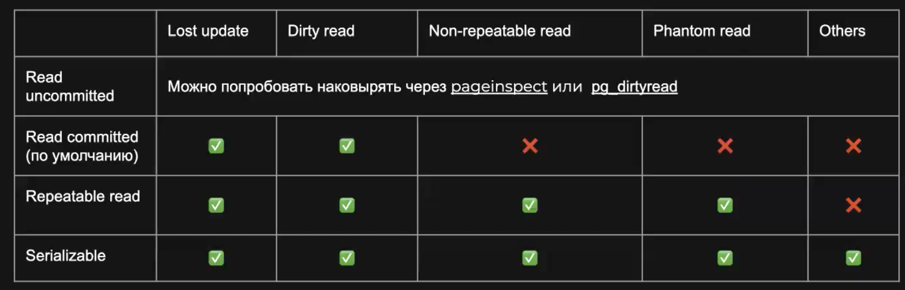

advisory locks


# Установка

Установка:

```bash
brew install postgresql
```

Запуск сервера:

```bash
brew services start postgresql
```


# Подключение

Посмотреть список баз данных и их владельцев:

```bash
$ psql -l
                                 List of databases
   Name    |    Owner    | Encoding | Collate | Ctype |      Access privileges      
-----------+-------------+----------+---------+-------+-----------------------------
 postgres  | paparshikov | UTF8     | C       | C     | 
 template0 | paparshikov | UTF8     | C       | C     | =c/paparshikov             +
           |             |          |         |       | paparshikov=CTc/paparshikov
 template1 | paparshikov | UTF8     | C       | C     | =c/paparshikov             +
           |             |          |         |       | paparshikov=CTc/paparshikov
(3 rows)
```

Подключение к Postgres:

```bash
psql -U paparshikov -d postgres
```

```bash
psql -U postgres -d master -h127.0.0.1 -p5433
psql -U postgres -d master -h10.21.14.48 -p5432
```


# Язык определения данных

PostgreSQL содержит одну или несколько именованных *database*'s. *Database* содержит одну или более именованных *schema*'s , которые содержат разные именованные объекты:

- *table*'s
- *data type*'s
- *function*'s
- *operator*'s. 

Одно и то же имя объекта может использоваться в разных *schema*'s без конфликтов; например, `schema1`и `myschema` может содержать таблицы с именами `mytable`. Т.е. *schema* образует пространство имен.

В отличие от баз данных,пользователь может получить доступ к объектам в любой из *schema*'s в *database*, к которой он подключен (т.е. ему не нужно переключаться между *schema*'s, как между *database*'s). 

Причины использования *schema*'s:

- Несколько пользователей используют разные *schema*'s в одной *database* и не мешают друг другу.
- Структурировать объекты *database* в логические группы, чтобы сделать их более управляемыми.

Создание *schema*:

```
CREATE SCHEMA myschema;
```

Доступ к объектам в *schema* нужно получать через *qualified name*, состоящее из *schema name* и *table name*, разделенных точкой:

```
schema.table
```

Возможен еще более общий синтаксис:

```
database.schema.table
```

, но это не имеет смысла, т.к. в настоящее время `database` должно совпадать с *database name*, к которой вы подключены.

По умолчанию, все объекты (включая *table*'s) автоматически помещаются в *schema* с именем `public`. Каждая новая *database* содержит *schema* `public`. Таким образом, это эквивалентно:

```
CREATE TABLE products ( ... );
```

```
CREATE TABLE public.products ( ... );
```

Посмотреть список *schema*'s в *database*:

```bash
# \dn
      List of schemas
    Name     |    Owner    
-------------+-------------
 public      | paparshikov
 schema_name | paparshikov
(2 rows)

```


## `RETURNING` *clause*

`RETURNING` *clause* используется, чтобы получить ID вставленной записи. 


# Изучение schema

Вывести все *table* в текущей *schema*:

```sql
\dt
```

# psql

*psql* - интерактивный терминал PostgreSQL

## *Meta-Command*'s

Команды в *psql*, которые начинаются с незакавыченной обратной косой черты `\` , являются *psql meta-command*'ой, которая обрабатывается самим *psql*. Эти команды делают *psql* более удобным для администрирования или написания скриптов. *Meta-command*'ы часто называют *slash* или *backslash command*'ы.

Определены следующие *meta-command*'ы

### `\x`

```
\x [ on | off | auto ]
```

Устанавливает или переключает режим форматирования развернутой таблицы (*expanded table*). 

- `auto` – PSQL автоматически подгоняет записи по ширине экрана:
  - Если запись может уместиться в ширину экрана; psql использует обычное форматирование.
  - Если запись **не** умещается по ширине экрана; psql использует *expanded mode*.

Пример:

```sql
select * from dda where u_id=24 and dda_is_deleted='f';
-[ RECORD 1 ]-------------------
dda_id             | 1121
u_id               | 24
ab_id              | 10304
```


# 3. Advanced Features

## 3.4. Transaction

*Transaction* определяется набором SQL-команд, окружённым командами `BEGIN` и `COMMIT`. *Transaction* должна выглядеть так:

```
BEGIN;
UPDATE accounts SET balance = balance - 100.00
    WHERE name = 'Alice';
-- ...
COMMIT;
```

Если в процессе выполнения *transaction* мы решим, что не хотим *commit*'ить её изменения (например, потому что оказалось, что баланс Алисы стал отрицательным), мы можем выполнить команду `ROLLBACK` вместо `COMMIT`, и все наши изменения будут отменены.

Postgres отрабатывает каждый *SQL statement* как *transaction*. Если вы не вставите команду `BEGIN`, то каждый отдельный *statement* будет неявно окружён командами `BEGIN` и `COMMIT` (в случае успешного завершения). 

Группу *statement*'ов, окружённых командами `BEGIN` и `COMMIT` называют *transaction block*.


# 5. Data Definition

## 5.4. Constraint

### Имя для constraint

*Constraint*'у можно присвоить имя. Это улучшит сообщения об ошибках и позволит вам ссылаться на этот *constraint*, когда вам понадобится изменить его. Сделать это можно так:

```sql
CREATE TABLE products (
    product_no integer,
    name text,
    price numeric CONSTRAINT positive_price CHECK (price > 0)
);
```

То есть, чтобы создать *named constraint*, напишите ключевое слово `CONSTRAINT`, а за ним идентификатор и собственно *constraint definition*. (Если вы не определите *constraint name* таким образом, система выберет для него имя за вас.)

*Table constraint*'ам можно присваивать *name* так же, как и *column constraint*:

```sql
CREATE TABLE products (
    product_no integer,
    name text,
    price numeric,
    CHECK (price > 0),
    discounted_price numeric,
    CHECK (discounted_price > 0),
    CONSTRAINT valid_discount CHECK (price > discounted_price)
);
```


### 5.4.2. Not-Null Constraints

`NOT NULL` *constraint* просто указывает, что *column*'у нельзя присваивать значение `NULL`. Пример синтаксиса:

```sql
CREATE TABLE products (
    product_no integer NOT NULL,
    name text NOT NULL,
    price numeric
);
```

*Constraint* `NOT NULL` всегда записывается как *column constraint* и функционально эквивалентно созданию *check constraint* `CHECK (column_name IS NOT NULL)`, но в PostgreSQL явное *constraint* `NOT NULL` работает более эффективно. 

Естественно, для *column*'а можно определить больше одного *constraint*'а. Для этого их нужно просто указать одно за другим:

```sql
CREATE TABLE products (
    product_no integer NOT NULL,
    name text NOT NULL,
    price numeric NOT NULL CHECK (price > 0)
);
```

Порядок здесь не имеет значения, он не обязательно соответствует порядку проверки ограничений.

Для *constraint*'а `NOT NULL` есть и обратный: *constraint* `NULL`. Оно значит, что столбец может иметь значение `NULL` (это поведение *by default*). *Constraint* `NULL` отсутствует в стандарте SQL (оно было добавлено в Postgres только для совместимости с некоторыми другими СУБД.) Однако некоторые пользователи любят его использовать, так как оно позволяет легко переключать *constraint*'ы в скрипте. Например, вы можете начать с:

```sql
CREATE TABLE products (
    product_no integer NULL,
    name text NULL,
    price numeric NULL
);
```

и затем вставить ключевое слово `NOT`, где потребуется.

При проектировании баз данных чаще всего большинство столбцов должны быть помечены как `NOT NULL`.


### 5.4.4. Primary Key

```sql
PRIMARY KEY (column constraint)
PRIMARY KEY ( column_name [, ... ] ) [ INCLUDE ( column_name [, ...]) ] (table constraint)
```


*Primary Key Constraint* означает, что образующий его *column* или группа *column*'s может быть *unique identifier* для строк в таблице. Для этого требуется, чтобы значения были одновременно *unique* и НЕ `NULL`. 

Следующие две таблицы позволяют вставлять одни и те же данные, но они не эквивалентны. 

```sql
CREATE TABLE products (
    product_no integer UNIQUE NOT NULL,
    name text,
    price numeric
);
```

```sql
CREATE TABLE products (
    product_no integer PRIMARY KEY,
    name text,
    price numeric
);
```

*Primary key* может включать несколько *column*; синтаксис похож на запись *unique constraint*:

```sql
CREATE TABLE example (
    a integer,
    b integer,
    c integer,
    PRIMARY KEY (a, c)
);
```

При добавлении *primary key* автоматически создаётся уникальный *B-tree index* для *column* или группы *column*'s, перечисленных в *primary key*, и данные столбцы помечаются как `NOT NULL`.

Таблица может иметь максимум один *primary key*. При этом, *unique* и *not-null constraint*, которые функционально почти равнозначны *primary key*, может быть сколько угодно, но назначить *primary key* можно только один. Теория реляционных баз данных говорит, что *primary key* должен быть в каждой *table*. В PostgreSQL такого жёсткого требования нет, но обычно лучше ему следовать.

*Primary key* определяет дефолтные целевые *column*'s для *foreign key*'s, ссылающихся на эту *table*.

Опциональное `INCLUDE` *clause* добавляет к этому *index*'у один или несколько *column*'s, составляющих просто «*payload*»: для них уникальность не будет требоваться, и искать значения в них по данному индексу нельзя. Однако их содержимое может быть получено при *index-only scan*. Заметьте, что хотя ограничение по *included column*'s не контролируется, оно всё же зависит от них. Как следствие, некоторые операции с этими столбцами (например, `DROP COLUMN`) могут повлечь каскадное удаление индекса и ограничения.


### 5.4.5. Foreign Key

Синтаксис (из [`CREATE TABLE`](#create-table)):

```sql
REFERENCES reftable [ ( refcolumn ) ] [ MATCH matchtype ] [ ON DELETE referential_action ] [ ON UPDATE referential_action ] (column constraint)
FOREIGN KEY ( column_name [, ... ] ) REFERENCES reftable [ ( refcolumn [, ... ] ) ] [ MATCH matchtype ] [ ON DELETE referential_action ] [ ON UPDATE referential_action ] (table constraint)
```

*Foreign key constraint* указывает, что значения в *column* должны соответствовать значениям в некоторой *row* другой *table*. Это называется *ссылочной целостностью* (*referential integrity*) двух связанных *table*'s. 

Пусть у вас есть таблица `products`:

```sql
CREATE TABLE products (
    product_no integer PRIMARY KEY,
    name text,
    price numeric
);
```

Давайте предположим, что у вас есть *table* с заказами этих продуктов. Мы хотим, чтобы в *table* `orders`  содержались только заказы действительно существующих продуктов. Поэтому мы определим в ней *foreign key constraint*, ссылающееся на таблицу `products`:

```sql
CREATE TABLE orders (
    order_id integer PRIMARY KEY,
    product_no integer REFERENCES products (product_no),
    quantity integer
);
```

С таким *constraint*'ом создать *order* с non-`NULL` значением `product_no`, отсутствующим в таблице `products`, будет невозможно.

В такой схеме таблицу `orders` называют *подчинённой* таблицей (*referencing*), а `products` — *главной* (*refferenced*). Соответственно, *column*'s называют так же подчинённой (*referencing*) и главной (*refferenced*).

Предыдущую команду можно сократить так:

```sql
CREATE TABLE orders (
    order_id integer PRIMARY KEY,
    product_no integer REFERENCES products,
    quantity integer
);
```

то есть, если опустить список *column*'s, *foreign key* будет неявно связан с *primary key* главной таблицы.

*Foreign key constraint*'у можно назначить *name* стандартным способом ([смотреть здесь](имя-для-constraint)). Примеры:

```sql
-- как column constraint
create table if not exists public.bank_details
(
    id                      bigserial primary key,
    passport_id             bigint not null CONSTRAINT FK_bank_details_passport_id REFERENCES public.passport (id),
);

-- как table constraint
create table if not exists public.bank_details
(
    id                      bigserial primary key,
    passport_id             bigint not null,
    CONSTRAINT FK_bank_details_passport_id FOREIGN KEY (passport_id) REFERENCES public.passport (id)
);
```


*Foreign key* также может ссылаться на группу *column*'s. В этом случае его нужно записать в форме *table constraint*. Например:

```sql
CREATE TABLE t1 (
  a integer PRIMARY KEY,
  b integer,
  c integer,
  FOREIGN KEY (b, c) REFERENCES other_table (c1, c2)
);
```

Естественно, число *column*'s и их типы в *constraint* должны соответствовать друг другу.

Иногда имеет смысл задать в *foreign key constraint* одну и ту же главную и подчиненную *table*; тогда он называется *self-referential foreign key* (*ссылающийся на себя*). Например, если вы хотите, чтобы *row*'s таблицы представляли *node*'s древовидной структуры, вы можете написать

```sql
CREATE TABLE tree (
    node_id integer PRIMARY KEY,
    parent_id integer REFERENCES tree,
    name text,
    ...
);
```

Для *top-level node* `parent_id` будет равен `NULL`, в то время как записи с `parent_id`, отличным от `NULL`,  будут ссылаться только на существующие *row*'s таблицы.

*Table* может содержать несколько *foreign key constraint*'s. Это полезно для связи *table*'s в отношении *many-to-many*. Скажем, у вас есть *table*'s `products` и `orders`, но вы хотите, чтобы один *order* мог содержать несколько *products* (что невозможно в предыдущей схеме). Для этого вы можете использовать такую схему:

```sql
CREATE TABLE products (
    product_no integer PRIMARY KEY,
    name text,
    price numeric
);

CREATE TABLE orders (
    order_id integer PRIMARY KEY,
    shipping_address text,
    ...
);

CREATE TABLE order_items (
    product_no integer REFERENCES products,
    order_id integer REFERENCES orders,
    quantity integer,
    PRIMARY KEY (product_no, order_id)
);
```

#### Действия при изменении *row* в главной таблице

*Foreign key* запрещают создание *order* (*row* в подчиненной *table*), не относящихся ни к одному *product* (*row* в главной *table*).

При изменении значений в главной *table*, могут производиться определённые действия с *row*'s в подчиненной *table*. 

- `ON DELETE` *clause* задаёт действие, производимое при удалении некоторой *row* в главной *table*.
- `ON UPDATE` *clause* задаёт действие, производимое при изменении значения в *referenced column* в главной *table*. Если *row* изменена, но это изменение не затронуло *referenced column*, никакое действие не производится. 

Для каждого *clause* возможные следующие варианты действий:

- `NO ACTION`

  Вариант по умолчанию. Выдать ошибку, показывающую, что при *delete* или *update* произойдёт нарушение *foreign key constraint*. Для *deferred constraint* ошибка произойдёт в момент проверки *constraint*'а, если *referencing row*'s еще будут существовать. 

- `RESTRICT`

  Выдать ошибку, показывающую, что при *delete* или *update* произойдёт нарушение *foreign key constraint*. Этот вариант подобен `NO ACTION`, но эта проверка будет *non-deferrable* (не откладываемая). Т.е.  `NO ACTION` позволяет сделать проверку *deferred* до некоторого момента в транзакции, а `RESTRICT` — нет.)

- `CASCADE`

  *Delete* все соответствующие *row*'s в главной *table*, либо *update* значения в *referencing column* на новые значения в *referenced column*, соответственно.

- `SET NULL`

  Установить *referencing column* в `NULL`.

- `SET DEFAULT`

  Установить в *referencing column* значение `DEFAULT`. (Если эти значения не равны `NULL`, во главной *table* должна быть соответствующая *row*; в противном случае операция завершится ошибкой)

Если *referenced column*'s меняются часто, будет разумным добавить индекс для *referencing column*'s, чтобы действия по обеспечению ссылочной целостности, связанные с *foreign key constraint*, выполнялись более эффективно.

Пример:

```sql
CREATE TABLE order_items (
    product_no integer REFERENCES products ON DELETE RESTRICT,
    order_id integer REFERENCES orders ON DELETE CASCADE,
    quantity integer,
    PRIMARY KEY (product_no, order_id)
);
```

#### Индексы и быстродействие

*Referenced column* в главной *table* должен являться или *primary key* или иметь *unique constraint*. 

Таким образом, для *referenced column* всегда будет существовать *index* (определённый соответствующим *primary key* или *unique constraint*), а значит проверки, что *referencing row* имеет соответствие, будут выполняться эффективно. 

Так как команды `DELETE` для *row*'s главной *table* или `UPDATE` для *referenced column* потребуют просканировать подчинённую *table* и найти *row*'s, ссылающиеся на старые значения, полезно будет иметь *index* и для *referencing column* тоже. Но это нужно не всегда, и создать соответствующий *index* можно по-разному, поэтому объявление *foreign key constraint* не создаёт автоматически *index* по *referencing column*.


# 6. Data Manipulation

## 6.4. Возврат данных из изменённых строк

Иногда бывает полезно получать данные из модифицируемых *row*'s в процессе их обработки. Это возможно с использованием `RETURNING` *clause*, которое можно задать для команд `INSERT`, `UPDATE` и `DELETE`. Применение `RETURNING` позволяет обойтись без дополнительного запроса к базе для сбора данных и это особенно ценно, когда как-то иначе трудно получить изменённые строки надёжным образом.

В предложении `RETURNING` допускается то же содержимое, что и в *output list* команды `SELECT` (см. [Раздел 7.3](https://postgrespro.ru/docs/postgresql/9.5/queries-select-lists)). Оно может содержать имена *column*'s целевой таблицы команды или значения выражений с этими столбцами. Также часто применяется краткая запись `RETURNING *`, выбирающая все *column*'s целевой таблицы по порядку.

В команде `INSERT` данные, выдаваемые в `RETURNING`, образуются из *row* в том виде, в каком она была вставлена. Это не очень полезно при простом добавлении, так как в результате будут получены те же данные, что были переданы клиентом. Но это может быть очень удобно при использовании вычисляемых *default value*. Например, если в таблице есть  [`serial`](https://postgrespro.ru/docs/postgresql/9.5/datatype-numeric#datatype-serial) *column*, в котором генерируются *unique identifier*'s, команда `RETURNING` может возвратить ID, назначенный новой *row*:

```
CREATE TABLE users (firstname text, lastname text, id serial primary key);

INSERT INTO users (firstname, lastname) VALUES ('Joe', 'Cool') RETURNING id;
```

Предложение `RETURNING` также очень полезно с `INSERT ... SELECT`.

В команде `UPDATE` данные, выдаваемые в `RETURNING`, образуются новым содержимым изменённой *row*. Например:

```
UPDATE products SET price = price * 1.10
  WHERE price <= 99.99
  RETURNING name, price AS new_price;
```

В команде `DELETE` данные, выдаваемые в `RETURNING`, образуются содержимым удалённой *row*. Например:

```
DELETE FROM products
  WHERE obsoletion_date = 'today'
  RETURNING *;
```

Если для *target table* заданы *trigger*'ы (см. [Главу 36](https://postgrespro.ru/docs/postgresql/9.5/triggers)), в `RETURNING` выдаются данные из *row*, изменённой *trigger*'ами. Таким образом, `RETURNING` часто применяется и для того, чтобы проверить содержимое *column*'ов, изменяемых *trigger*'ами.


# 8. Data Types

## 8.1. Numeric Types

*Numeric types* включают двух-, четырёх- и восьмибайтные *integers*, четырёх- и восьмибайтные *floating-point numbers*, а также десятичные числа с задаваемой точностью. Все эти типы перечислены в Таблице 8.2:

| Имя                | Размер     | Описание                                                     | Диапазон                                              |
| ------------------ | ---------- | ------------------------------------------------------------ | ----------------------------------------------------- |
| `smallint`, `int2` | 2 байта    | *small-range integer*                                        | -32768 .. +32767                                      |
| `integer`, `int4`  | 4 байта    | типичный выбор для *integer*                                 | -2147483648 .. +2147483647                            |
| `bigint`, `int8`   | 8 байт     | *large-range integer*                                        | -9223372036854775808 .. 9223372036854775807           |
| `decimal`          | переменный | вещественное число с фиксированной указанной пользователем точностью | до 131072 цифр до десятичной точки и до 16383 — после |
| `numeric`          | переменный | вещественное число с фиксированной указанной пользователем точностью | до 131072 цифр до десятичной точки и до 16383 — после |
| `real`             | 4 байта    | вещественное число с переменной нефиксированной точностью    | точность в пределах 6 десятичных цифр                 |
| `double precision` | 8 байт     | вещественное число с переменной нефиксированной точностью    | точность в пределах 15 десятичных цифр                |
| `smallserial`      | 2 байта    | small integer с autoincrement'ом                             | 1 .. 32767                                            |
| `serial`           | 4 байта    | integer с autoincrement'ом                                   | 1 .. 2147483647                                       |
| `bigserial`        | 8 байт     | large integer с autoincrement'ом                             | 1 .. 9223372036854775807                              |

### 8.1.1. Integer Types

Типы `smallint`, `integer` и `bigint` хранят целые числа, то есть числа без дробной части, имеющие разные допустимые диапазоны. Попытка сохранить значение, выходящее за рамки диапазона, приведёт к ошибке. В PostgreSQL существуют псевдонимы для этих имен типов: `int2`, `int4` и `int8`. Число байтов отражается в имени типа.

Чаще всего используется тип `integer`, как наиболее сбалансированный выбор ширины диапазона, размера и быстродействия. Тип `smallint` обычно применяется, только когда крайне важно уменьшить размер данных на диске. Тип `bigint` предназначен для тех случаев, когда числа не умещаются в диапазон типа `integer`.

В SQL определены только типы `integer` (или `int`), `smallint` и `bigint`. Имена типов `int2`, `int4` и `int8` выходят за рамки стандарта, хотя могут работать и в некоторых других СУБД.

В отличие от MySQL, PostgreSQL не поддерживает *unsigned integer type*'s.

### 8.1.4. Serial Types

Типы данных `smallserial`, `serial` и `bigserial` не являются настоящими типами, а представляют собой просто удобное средство для создания столбцов с уникальными идентификаторами (подобное свойству `AUTO_INCREMENT` в некоторых СУБД). В текущей реализации запись:

```sql
CREATE TABLE tablename (
    colname SERIAL
);
```

эквивалентна следующим командам:

```plsql
CREATE SEQUENCE tablename_colname_seq AS integer;
CREATE TABLE tablename (
    colname integer NOT NULL DEFAULT nextval('tablename_colname_seq')
);
ALTER SEQUENCE tablename_colname_seq OWNED BY tablename.colname;
```

То есть при определении такого типа создаётся *integer column* со значением по умолчанию, извлекаемым из *sequence generator*. Чтобы в столбец нельзя было вставить `NULL`, в его определение добавляется ограничение `NOT NULL`. (Во многих случаях также имеет смысл добавить для этого столбца ограничения `UNIQUE` или `PRIMARY KEY` для защиты от ошибочного добавления дублирующихся значений, но автоматически это не происходит.) Последняя команда определяет, что *sequence* «принадлежит» *column*, так что она будет удалена при удалении *column* или *table*.

Чтобы вставить в столбец `serial` следующее значение *sequence*, ему нужно присвоить *default value*. Это можно сделать, либо исключив его из списка *column*'s в операторе `INSERT`, либо с помощью ключевого слова `DEFAULT`.

Типы:

- имена типов `serial` и `serial4` равнозначны: они создают столбцы `integer`. 
- имена типов `bigserial` и `serial8` равнозначны, они создают столбцы `bigint`. Тип `bigserial` следует использовать, если за всё время жизни таблицы планируется использовать больше чем 2^31 значений. 
- имена типов `smallserial` и `serial2` равнозначны, они создают столбец `smallint`.


## 8.3. Character Type

*Character type*'s, доступные в Postgres:

| Название                             | Description                                            |
| ------------------------------------ | ------------------------------------------------------ |
| `character varying(n)`, `varchar(n)` | строка переменной длины, с указанным лимитом на размер |
| `character(n)`, `char(n)`            | строка фиксированной длины, дополненная пробелами      |
| `text`                               | строка неограниченной переменной длины                 |

SQL определяет два основных *character type*'s: `character varying(n)` и `character(n)`, где `n` – положительное число. Оба эти типа могут хранить текстовые строки длиной до `n` символов (не байт, что важно для многобайтовых кодировок). Попытка сохранить в столбце такого типа более длинную строку приведёт к ошибке, если только все лишние символы не являются пробелами (тогда они будут усечены до максимально допустимой длины). (Это несколько странное исключение продиктовано стандартом SQL.) Если длина сохраняемой строки оказывается меньше объявленной, значения типа `character` будут дополняться пробелами; а тип `character varying` просто сохранит короткую строку.

При попытке явно привести значение к типу `character varying(n)` или `character(n)`, часть строки, выходящая за границу в `n` символов, удаляется, не вызывая ошибки. (Это также продиктовано стандартом SQL.)

Записи `varchar(n)` и `char(n)` являются синонимами для `character varying(n)` и `character(n)` соответственно. Типу `character` без указания *length* соответствует `character(1)`. Если же *length* не указывается для `character varying`, этот тип будет принимать строки любого размера. Это поведение является расширением PostgreSQL.

Помимо этого, PostgreSQL предлагает тип `text`, в котором можно хранить строки любой *length*. Хотя тип `text` не описан в стандарте SQL, его поддерживают и некоторые другие СУБД SQL.

Значения типа `character` физически дополняются пробелами до `n` символов и хранятся, а затем отображаются вместе с ними. Однако при сравнении двух значений типа `character` дополняющие пробелы считаются незначащими и игнорируются. С *collation*'s, где пробельные символы являются значащими, это поведение может приводить к неожиданным результатам. При приведении значения `character` к другому *character type* дополняющие пробелы отбрасываются. Заметьте, что конечные пробелы **имеют значение** в типах `character varying` и `text`, когда используется проверка по *pattern*'у, например, в `LIKE` и *regular expression*.

Какие именно символы можно сохранить в этих типах данных, зависит от того, какой *character set* был выбран при создании базы данных. Однако символ с кодом 0 (иногда называемый NUL) сохранить нельзя, вне зависимости от выбранного *character set*. 

Для всех *character type*'s: для хранения короткой *string* (до 126 байт) требуется дополнительный 1 байт плюс размер самой *string*, включая дополняющие пробелы для типа `character`. Для строк длиннее требуется не 1, а 4 дополнительных байта. Система может автоматически сжимать длинные *string*, так что физический размер на диске может быть меньше. Очень длинные *string* переносятся в отдельные таблицы, чтобы они не замедляли работу с другими столбцами. В любом случае максимально возможный размер *string* составляет около 1 ГБ. (Допустимое значение `n` в объявлении типа данных меньше этого числа. Это объясняется тем, что для *multibyte character encoding* каждый символ может занимать несколько байт. Если вы желаете сохранять *string* без определённого лимита *length*, используйте типы `text` или `character varying` без указания *length*, а не задавайте какое-либо большое максимальное значение).

### Производительность

Тип `varchar` без указания типа *length* эквивалентен типу `text`, производительность этих типов одинаковая. Единственное преимущество указания *length* для типа `varchar` – состоит в том, что PostgreSQL выдаст ошибку, если вы попытаетесь вставить в *column* `VARCHAR(n)` строку, содержащую более `n` символов .

В отличие от других СУБД, в PostgreSQL нет разницы в производительности между этими тремя типами, не считая большего размера для типа с дополняющими пробелами (`char`) и нескольких *CPU cycle*'s для проверки длины при сохранении *string* в *column* с ограниченной *length*. Хотя в некоторых СУБД тип `character(n)` работает быстрее других, в Postgres это не так; на деле `character(n)` обычно оказывается медленнее остальных типов из-за большего размера данных и более медленной сортировки. В большинстве случаев вместо него лучше применять `text` или `varchar`. Поскольку дополнение значений пробелами для типа `character(n)` на практике почти не востребовано.

Под капотом все типы используют библиотеку `varlena`( [ссылка](http://www.varlena.com/varlena.php) ).

Выводы этой [статьи](http://www.depesz.com/index.php/2010/03/02/charx-vs-varcharx-vs-varchar-vs-text/):

> - `char (n)` - занимает слишком много места при работе со значениями короче `n` (дополняет их `n`) и может привести к незначительным ошибкам из-за добавления конечных пробелов, плюс проблематично изменить *limit*
> - `varchar (n)` - изменить *limit* проблематично (требуется *exclusive lock* при изменении таблицы)
> - `varchar` - как *text*
> - `text` - для меня победитель:
>   - потому что у него нет проблем с изменением *limit*'а
>   - потому что у него имя, короче чем `varchar`

## 8.5. Date/Time Types

PostgreSQL поддерживает следующие типы: 

| Имя                                       | Размер   | Описание                               | Наименьшее значение | Наибольшее значение | Точность      |
| ----------------------------------------- | -------- | -------------------------------------- | ------------------- | ------------------- | ------------- |
| `timestamp [ (p) ] [ without time zone ]` | 8 bytes  | дата и время (без часового пояса)      | 4713 до н. э.       | 294276 н. э.        | 1 microsecond |
| `timestamp [ (p) ] with time zone`        | 8 bytes  | дата и время (с часовым поясом)        | 4713 до н. э.       | 294276 н. э.        | 1 microsecond |
| `date`                                    | 4 bytes  | дата (без времени суток)               | 4713 до н. э.       | 5874897 н. э.       | 1 day         |
| `time [ (p) ] [ without time zone ]`      | 8 bytes  | время суток (без даты)                 | 00:00:00            | 24:00:00            | 1 microsecond |
| `time [ (p) ] with time zone`             | 12 bytes | время дня (без даты), с часовым поясом | 00:00:00+1559       | 24:00:00-1559       | 1 microsecond |
| `interval [ fields ] [ (p) ]`             | 16 bytes | временной интервал                     | -178000000 лет      | 178000000 лет       | 1 microsecond |

Стандарт SQL требует, чтобы тип `timestamp` был эквивалентен `timestamp without time zone` (время без часового пояса), и PostgreSQL следует этому. Для краткости `timestamp with time zone` можно записать как `timestamptz`; это расширение PostgreSQL.

Типы `time`, `timestamp` и `interval` принимают необязательное значение точности *`p`*, определяющее, сколько знаков после запятой должно сохраняться в секундах. По умолчанию точность не ограничивается. Допустимые значения *`p`* лежат в интервале от 0 до 6.

Тип `interval` дополнительно позволяет ограничить набор сохраняемых *field*'s следующими фразами:

```
YEAR
MONTH
DAY
HOUR
MINUTE
SECOND
YEAR TO MONTH
DAY TO HOUR
DAY TO MINUTE
DAY TO SECOND
HOUR TO MINUTE
HOUR TO SECOND
MINUTE TO SECOND
```

Если указаны и *`fields`*, и точность *`p`*, указание *`fields`* должно включать `SECOND`, так как точность применима только к секундам.

### 8.5.1. Ввод Date/Time

Значения даты и времени принимаются практически в любом разумном формате, включая ISO 8601, SQL-совместимый, традиционный формат POSTGRES и другие. В некоторых форматах порядок day, month и year во вводимой дате неоднозначен и поэтому поддерживается явное определение формата. Для этого предназначен параметр [DateStyle](https://postgrespro.ru/docs/postgrespro/14/runtime-config-client#GUC-DATESTYLE). Когда он имеет значение `MDY`, выбирается интерпретация месяц-день-год, значению `DMY` соответствует день-месяц-год, а `YMD` — год-месяц-день.

#### 8.5.1.1. Date

Допустимые значения типа `date`.

| Пример     | Описание                                                 |
| ---------- | -------------------------------------------------------- |
| 1999-01-08 | ISO 8601; 8 января в любом режиме (рекомендуемый формат) |
| ...        |                                                          |

#### 8.5.1.2. Time

Допустимые вводимые значения типов *time*: 

| Пример         | Описание |
| -------------- | -------- |
| `04:05:06.789` | ISO 8601 |
| `04:05:06`     | ISO 8601 |
| `04:05`        | ISO 8601 |
| ...            |          |


#### 8.5.1.3. Даты и время

Допустимые значения типов *timestamp* состоят из записи *date* и *time*, после которого может указываться *time zone* и необязательное уточнение `AD` или `BC` (до нашей эры и наша эра). 

Таким образом:

```
1999-01-08 04:05:06
```

и

```
1999-01-08 04:05:06 -8:00
```

допустимые варианты, соответствующие стандарту ISO 8601. В дополнение к этому поддерживается распространённый формат:

```
January 8 04:05:06 1999 PST
```

Значения `timestamp with time zone` внутри всегда хранятся в UTC (Universal Coordinated Time, Всемирное скоординированное время или время по Гринвичу, GMT). Вводимое значение, в котором явно указан часовой пояс, переводится в UTC с учётом смещения данного часового пояса. Если во входной строке не указан часовой пояс, подразумевается часовой пояс, заданный системным параметром [TimeZone](https://postgrespro.ru/docs/postgrespro/14/runtime-config-client#GUC-TIMEZONE) и время так же пересчитывается в UTC со смещением `timezone`.

Когда значение `timestamp with time zone` выводится, оно всегда преобразуется из UTC в текущий часовой пояс `timezone` и отображается как локальное время. Чтобы получить время для другого часового пояса, нужно либо изменить `timezone`, либо воспользоваться конструкцией `AT TIME ZONE` (см. [Подраздел 9.9.4](https://postgrespro.ru/docs/postgrespro/14/functions-datetime#FUNCTIONS-DATETIME-ZONECONVERT)).


### 8.5.2. Вывод Date/Time

В качестве выходного формата типов даты/времени можно использовать один из четырёх стилей: ISO 8601, SQL (Ingres), традиционный формат POSTGRES (формат date в Unix) или German. По умолчанию выбран формат ISO. (Стандарт SQL требует, чтобы использовался именно ISO 8601. Другой формат называется «SQL» исключительно по историческим причинам.)

Стили вывода Date/Time:

| Style Specification | Description            | Example                      |
| ------------------- | ---------------------- | ---------------------------- |
| `ISO`               | ISO 8601, SQL standard | `1997-12-17 07:37:16-08`     |
| `SQL`               | traditional style      | `12/17/1997 07:37:16.00 PST` |
| ...                 |                        |                              |

```sql
SELECT '2016-09-12'::date;
date
------------
2016-09-12
(1 строка)
```

Используем другой формат ввода, но формат вывода остается тот же самый, поскольку мы его не изменяли: 

```sql
SELECT 'Sep 12, 2016'::date;
date
------------
2016-09-12
```


### 8.5.3. Time Zone

Все значения *date* и *time* с *timezone* представляются внутри в UTC, а при передаче клиентскому приложению они переводятся в *local time*, при этом *timezone* по умолчанию определяется параметром конфигурации [TimeZone](https://postgrespro.ru/docs/postgrespro/14/runtime-config-client#GUC-TIMEZONE).

Таким образом, наличие  `WITH TIME ZONE ` или `WITHOUT TIME ZONE` не влияет на то, как хранятся значения; это влияет на то, как они интерпретируются.

Ни один из  `timestamp with time zone `и `timestamp without time zone` не хранят информацию о часовом поясе вариантов не хранит часовой пояс (или смещение), несмотря на то, что предполагают названия. Оба типа — `timestamp` и `timestamptz` — занимают один и тот же объем 8 байтов.  Разница заключается в интерпретации хранимых данных (и в предполагаемом приложении), а не в самом формате хранения:

- `TIMESTAMP WITHOUT TIME ZONE` хранит *local* datetime. *time zone* не указан. Следовательно, PostgreSQL не выполняет преобразование, связанное с *timezone*, при вводе или выводе. Если значение было введено в базу данных как `'2011-07-01 06:30:30'`, то независимо от того, в каком *timezone* вы отображаете его позже, оно все равно будет указывать год 2011, месяц 07, день 01, 06 часов, 30 минут и 30 секунд (в некотором формате). Кроме того, любое *offset* или *timezone*, указанный вами во входных данных, игнорируется PostgreSQL, поэтому `'2011-07-01 06:30:30+00'`и `'2011-07-01 06:30:30+05'`являются такими же, как и просто `'2011-07-01 06:30:30'`. 
- `TIMESTAMP WITH TIME ZONE` сохраняет точку на временной шкале UTC. Она зависит от вашей *timezone*. Входные данные внутренне конвертируются в UTC, и именно так они сохраняются. Для этого должно быть известен offset, поэтому, когда ввод не содержит явного offset или timezone (например, `'2011-07-01 06:30:30'`), предполагается, что он находится в текущем timezone сеанса PostgreSQL, в противном случае используется явно указанное *offset* или *timezone* (как в `'2011-07-01 06:30:30+05'`). Вывод отображается преобразованным в текущий *timezone* сеанса PostgreSQL. 

На практике при принятии решения о том, какой из этих двух типов — `timestamp` или `timestamptz` — использовать, необходимо учитывать, требуется ли значения, хранящиеся в таблице, приводить к местному часовому поясу или не требуется. Например, в расписании авиарейсов указывается местное время как для аэропорта отправления, так и для аэропорта прибытия. Поэтому в таком случае нужно использовать тип `timestamp`, чтобы это время не приводилось к текущему часовому поясу пользователя, где бы он ни находился. 

Из двух этих типов данных чаще используется `timestamptz`.

Особенности интерпретации:

- Если *time zone* является частью значения, значение может отображаться как *local time* в клиенте.
- Без *time zone* как части значения, часовым поясом по умолчанию является UTC, поэтому он отображается для этого часового пояса.

Поведение различается в зависимости как минимум от трех факторов:

- Настройка *timezone* в клиенте.
- Тип данных (т.е. `WITH TIME ZONE` или `WITHOUT TIME ZONE`)
- При вводе указана ли определенная *timezone*.


Пример:

```sql
foo=> SET TIMEZONE TO 'Japan';
SET
foo=> SELECT '2011-01-01 00:00:00'::TIMESTAMP;
      timestamp      
---------------------
 2011-01-01 00:00:00
(1 row)

foo=> SELECT '2011-01-01 00:00:00'::TIMESTAMP WITH TIME ZONE;
      timestamptz       
------------------------
 2011-01-01 00:00:00+09
(1 row)

foo=> SELECT '2011-01-01 00:00:00+03'::TIMESTAMP;
      timestamp      
---------------------
 2011-01-01 00:00:00
(1 row)

foo=> SELECT '2011-01-01 00:00:00+03'::TIMESTAMP WITH TIME ZONE;
      timestamptz       
------------------------
 2011-01-01 06:00:00+09
(1 row)
```


Time zone может задаваться следующими способами:

- полное название часового пояса, например `America/New_York`. 
- Аббревиатура часового пояса, например `PST`. 
- Помимо аббревиатур и названий часовых поясов Postgres Pro принимает указания часовых поясов в стиле POSIX, как описано в [Разделе B.5](https://postgrespro.ru/docs/postgrespro/14/datetime-posix-timezone-specs). Этот вариант обычно менее предпочтителен, чем использование именованного часового пояса.


## 8.12. Тип UUID

Тип данных `uuid` сохраняет универсальные уникальные идентификаторы (Universally Unique Identifiers, UUID), определённые в [RFC 4122](https://tools.ietf.org/html/rfc4122), ISO/IEC 9834-8:2005 и связанных стандартах. (В некоторых системах это называется GUID, глобальным уникальным идентификатором.) Этот идентификатор представляет собой 128-битное значение, генерируемое специальным алгоритмом, практически гарантирующим, что этим же алгоритмом оно не будет получено больше нигде в мире. Таким образом, эти идентификаторы будут уникальными и в распределённых системах, а не только в единственной базе данных, как значения генераторов последовательностей.

UUID записывается в виде последовательности шестнадцатеричных цифр в нижнем регистре, разделённых знаками минуса на несколько групп, в таком порядке: группа из 8 цифр, за ней три группы из 4 цифр и, наконец, группа из 12 цифр, что в сумме составляет 32 цифры и представляет 128 бит. Пример UUID в этом стандартном виде:

```
a0eebc99-9c0b-4ef8-bb6d-6bb9bd380a11
```

Postgres Pro также принимает альтернативные варианты: цифры в верхнем регистре, стандартную запись, заключённую в фигурные скобки, запись без минусов или с минусами, разделяющими любые группы из четырёх цифр. Например:

```
A0EEBC99-9C0B-4EF8-BB6D-6BB9BD380A11
{a0eebc99-9c0b-4ef8-bb6d-6bb9bd380a11}
a0eebc999c0b4ef8bb6d6bb9bd380a11
a0ee-bc99-9c0b-4ef8-bb6d-6bb9-bd38-0a11
{a0eebc99-9c0b4ef8-bb6d6bb9-bd380a11}
```

Выводится значение этого типа всегда в стандартном виде.

Как можно сгенерировать UUID в PostgreSQL, описывается в [Разделе 9.14](https://postgrespro.ru/docs/postgrespro/14/functions-uuid).


## 9.27. System Administration Function

### 9.27.10. Functions для управления advisory lock

Подробнее про [advisory lock](#1335-advisory-locks)

Все эти *function*'s предназначены для оперирования *lock*'ами *resourc*'ов, определяемых приложением и задаваемых одним 64-bit или двумя *32-bit key*'s (заметьте, что пространства этих *key*'s не пересекаются). Если конфликтующую *lock* с тем же *resource identifier*'ом уже удерживает другой *session*, эти *function* либо дожидаются освобождения *resourc*'а, либо возвращют `false`, в зависимости от вида *function*. *Lock* могут быть как *shared* так и *exclusive* — *shared lock* не конфликтует с другими *shared lock*'ами того же *resource*, но конфликтует с *exclusive lock*'ами. *Lock*'и могут быть взяты на *session level* (тогда они удерживаются до момента освобождения или до завершения *session*. Не рекомендуются, т.к. *session* берутся и возвращаются в пул случайным образом) и на *transaction level* (тогда они удерживаются до конца текущей *transaction*, освободить их вручную нет возможности. Существует ограничение на количество одновременно открытых *transaction*). Когда поступает несколько запросов на *session-level lock*, они накапливаются, так что если один *resource identifier* был *lock* три раза, должны поступить три запроса на *unlock*, чтобы *resource* был разблокирован до завершения сеанса.

**Functions для управления advisory lock**

| Функция                                                      | Описание                                                     |
| ------------------------------------------------------------ | ------------------------------------------------------------ |
| `pg_advisory_xact_lock ( key bigint ) → void`<br/>`pg_advisory_lock` ( *`key1`* `integer`, *`key2`* `integer` ) → `void` | Получает *exclusive transaction-level advisory lock*, ожидая её, если это необходимо. |
| `pg_advisory_xact_lock_shared` ( *`key`* `bigint` ) → `void`<br/> `pg_advisory_xact_lock_shared` ( *`key1`* `integer`, *`key2`* `integer` ) → `void` | Получает *shared transaction-level advisory lock*, ожидая её, если это необходимо. |
| `pg_try_advisory_xact_lock` ( *`key`* `bigint` ) → `boolean`<br/> `pg_try_advisory_xact_lock` ( *`key1`* `integer`, *`key2`* `integer` ) → `boolean` | Получает *exclusive transaction-level advisory lock*, если она доступна. То есть эта функция либо немедленно получает *lock* и возвращает `true`, либо сразу возвращает `false`, если получить её нельзя. |
| `pg_try_advisory_xact_lock_shared` ( *`key`* `bigint` ) → `boolean`<br/> `pg_try_advisory_xact_lock_shared` ( *`key1`* `integer`, *`key2`* `integer` ) → `boolean` | Получает *shared transaction-level advisory lock*, если она доступна. То есть эта функция либо немедленно получает *lock* и возвращает `true`, либо сразу возвращает `false`, если получить её нельзя. |
|                                                              |                                                              |


## 8.6. Boolean Type

В PostgreSQL есть стандартный SQL-тип `boolean`. Тип `boolean` может иметь следующие состояния: «true», «false» и третье состояние, «unknown», которое представляется SQL-значением NULL.

**Таблица 8.19. Логический тип данных**

| Имя       | Размер | Описание                  |
| --------- | ------ | ------------------------- |
| `boolean` | 1 байт | состояние: true или false |

*Boolean constant* могут представляться в SQL-запросах следующими ключевыми словами SQL: `TRUE`, `FALSE` и `NULL`.

Функция ввода данных типа `boolean` воспринимает следующие строковые представления состояния «true»:

- `true`
- `yes`
- `on`
-   `1`

и следующие представления состояния «false»:

- `false`
- `no`
- `off`
- `0`

Также воспринимаются уникальные префиксы этих строк, например `t` или `n`. Регистр символов не имеет значения, а пробельные символы в начале и в конце строки игнорируются.

Функция вывода данных типа `boolean` всегда выдаёт `t` или `f`, как показано в [Примере 8.2](https://postgrespro.ru/docs/postgresql/10/datatype-boolean#DATATYPE-BOOLEAN-EXAMPLE).

**Пример 8.2. Использование типа `boolean`**

```
CREATE TABLE test1 (a boolean, b text);
INSERT INTO test1 VALUES (TRUE, 'sic est');
INSERT INTO test1 VALUES (FALSE, 'non est');
SELECT * FROM test1;
 a |    b
---+---------
 t | sic est
 f | non est

SELECT * FROM test1 WHERE a;
 a |    b
---+---------
 t | sic est
```


Ключевые слова `TRUE` и `FALSE` являются предпочтительными (соответствующими стандарту SQL) для записи логических констант в SQL-запросах. Но вы также можете использовать строковые представления, которые допускает синтаксис строковых констант, описанный в [Подразделе 4.1.2.7](https://postgrespro.ru/docs/postgresql/10/sql-syntax-lexical#SQL-SYNTAX-CONSTANTS-GENERIC), например, `'yes'::boolean`.

Заметьте, что при анализе запроса `TRUE` и `FALSE` автоматически считаются значениями типа `boolean`, но для `NULL` это не так, потому что ему может соответствовать любой тип. Поэтому в некоторых контекстах может потребоваться привести `NULL` к типу `boolean` явно, например так: `NULL::boolean`. С другой стороны, приведение строковой константы к логическому типу можно опустить в тех контекстах, где анализатор запроса может понять, что буквальное значение должно иметь тип `boolean`.

# 11. Indexes

## 11.1. Introduction

Индексы:

- ускоряют поиск
- увеличивают нагрузку на БД

Создать индекс для столбца `id` таблицы `test1` можно с помощью следующей команды:

```sql
CREATE INDEX test1_id_index ON test1 (id);
```

Имя индекса `test1_id_index` может быть произвольным, главное, чтобы оно позволяло понять, для чего этот индекс.

Для удаления индекса используется команда `DROP INDEX`. 

Когда индекс создан, никакие дополнительные действия не требуются: система сама будет обновлять его при изменении данных в таблице и сама будет использовать его в запросах, где, по её мнению, это будет эффективнее, чем сканирование всей таблицы. Вам, возможно, придётся только периодически запускать команду `ANALYZE` для обновления статистических данных, на основе которых планировщик запросов принимает решения. 

Индексы могут быть полезны также при выполнении команд `UPDATE` и `DELETE` с условиями поиска. Кроме того, они могут применяться в поиске с соединением. То есть, индекс, определённый для столбца, участвующего в условии соединения, может значительно ускорить запросы с JOIN.

Создание индекса для большой таблицы может занимать много времени. По умолчанию Postgres позволяет параллельно с созданием индекса выполнять чтение (операторы `SELECT`) таблицы, но операции записи (`INSERT`, `UPDATE` и `DELETE`) блокируются до окончания построения индекса. Для production среды это ограничение часто бывает неприемлемым. Хотя есть возможность разрешить запись параллельно с созданием индексов, при этом нужно учитывать ряд оговорок — они описаны в подразделе [Неблокирующее построение индексов](https://postgrespro.ru/docs/postgrespro/14/sql-createindex#SQL-CREATEINDEX-CONCURRENTLY).

После создания индекса система должна поддерживать его в состоянии, соответствующем данным таблицы. С этим связаны неизбежные накладные расходы при изменении данных. Таким образом, индексы, которые используются в запросах редко или вообще никогда, должны быть удалены.

## 11.2. Index Types

Postgres поддерживает несколько типов *index*'ов: B-tree, Hash, GiST, SP-GiST, GIN и BRIN. Для разных типов *index*'ов применяются разные алгоритмы, которые хорошо работают с разными типами запросов. По умолчанию команда [`CREATE INDEX`](#create-index) создаёт *B-tree index*, эффективные в большинстве случаев. Выбрать другой тип *index*'а можно, написав название типа *index*'а после ключевого слова `USING`. Например, создать *Hash index* можно так:

```sql
CREATE INDEX name ON table USING HASH (column);
```

### 11.2.1. B-Tree

*B-tree* могут обрабатывать проверки на равенство и диапазоны с данными, которые можно отсортировать в некотором порядке. *PostgreSQL query planner*  может задействовать *B-tree index*, когда индексируемый *column* участвует в сравнении с одним из следующих операторов:

```
<   <=   =   >=   > 
```

При обработке конструкций, представимых как сочетание этих операторов, например `BETWEEN` и `IN`, так же может выполняться поиск по *B-tree index*'у. Кроме того, такие индексы могут использоваться и в условиях `IS NULL` и `IS NOT NULL` по индексированным *column*'ам.

*Optimizer* может использовать *B-tree index*'ы в запросах с *pattern matching operator*'ами `LIKE` и `~`, если этот *pattern* определяется константой и он привязан к началу строки — например, `col LIKE 'foo%'` или `col ~ '^foo'`, но не `col LIKE '%bar'`. Но если ваша база данных использует не *C locale*, для поддержки индексирования запросов с *pattern matching operator*'ами вам потребуется создать *index* со специальным классом операторов; см. [Раздел 11.10](https://postgrespro.ru/docs/postgrespro/14/indexes-opclass). *B-tree index*'ы можно использовать и для `ILIKE` и `~*`, но только если шаблон начинается не с алфавитных символов, то есть символов, не подверженных преобразованию регистра.

*B-tree index*'ы могут также применяться для получения данных, отсортированных по порядку. Это не всегда быстрее простого сканирования и сортировки, но иногда бывает полезно.

## 11.8. Partial Index

*Partial index* — это *index*, который строится по подмножеству строк таблицы, определяемому условным выражением (оно называется *predicate* для *partial index*). Такой *index* содержит записи только для строк, удовлетворяющих *predicat*'у. *Partial index*'ы довольно специфичны, но в ряде ситуаций они могут быть очень полезны.

### Исключение из индекса распространенных значений

Позволяют избежать индексирования распространённых значений. Так как при поиске распространённого значения (такого, которое содержится в значительном проценте всех строк) индекс всё равно не будет использоваться, хранить эти строки в индексе нет смысла. Исключив их из индекса, можно уменьшить его размер, а значит и ускорить запросы, использующие этот индекс. Это также может ускорить операции изменения данных в таблице, так как индекс будет обновляться не всегда. Возможное применение этой идеи проиллюстрировано в [Примере 11.1](https://postgrespro.ru/docs/postgresql/10/indexes-partial#INDEXES-PARTIAL-EX1).

 TODO!!!

...

### Partial Unique Index

Предположим, что у нас есть таблица с результатами *test*'ов. Мы хотим, чтобы для каждого сочетания `subject` и `target` была только одна запись c `success = true` (успешная попытка), а с `success = false (неудачных попыток) могло быть много. Вот как можно этого добиться:

```sql
CREATE TABLE tests (
    subject text,
    target text,
    success boolean,
    ...
);

CREATE UNIQUE INDEX tests_success_constraint ON tests (subject, target)
    WHERE success;
```

Это подход будет особенно эффективным, когда `success = false` (неудачных попыток) будет намного больше, чем удачных. Также можно потребовать, чтобы в столбце допускался только один `NULL`, создав *unique partial index* с ограничением `IS NULL`.

...

# 13. Concurrency Control



## Уровни изоляции

#### Read uncommited

уровня *Read uncommited* не существует в PostgreS. Его можно включить, но поведение будет как на уровне *Read commited*.

#### Read commited

Используется в как уровень изоляции по умолчанию из соображений производительности

Для каждого оператора в транзакции используется свой *snapshot*

Из-за того что *snaphot* в рамках оператора возможны аномалии *non-repeatable read* и *phantom read*

При возникновении конфликтов конкурентного обновления *transaction* ожидает завершения конкурентной *transaction* и при необходимости перечитывает заблокированные строки (несогласованное чтение)

#### Repeatable read

Для каждого оператора в транзакции используется *snaphot*, созданный **первым оператором** в транзакции

При возникновении конфликтов конкурентного обновления ожидает завершения конкурентной транзакции, и в случае ее фиксации завершается с ошибкой сериализации доступа

Требует от приложения “перезапуска” транзакции при ошибках сериализации доступа


на уровне изоляции *Repeatable read* также не имеем *Phantom read* за счет использования *snapshot*'ов, не видим в *snapshot*'е, данных, которые появились после старта *transaction*.


## 13.3. Explicit Locking

### 13.3.5. Advisory Locks

https://habr.com/ru/company/tensor/blog/488024/

https://www.postgresql.org/docs/14/explicit-locking.html

https://www.postgresql.org/docs/14/functions-admin.html#FUNCTIONS-ADVISORY-LOCKS

https://postgrespro.ru/docs/postgrespro/14/functions-admin

https://postgrespro.ru/docs/postgresql/12/explicit-locking

*Advisory Locks* (рекомендательные блокировки).

Принципиальное отличие *advisory lock* от «обычных» *table/row/page -level lock* заключается в следующем:

- Блокировка произвольного идентификатора.

  «Обычные» блокировки в PG всегда привязаны к конкретному объекту БД (*table*, *row*, *page* данных) и *session* (*connection*, ее обслуживает некоторый *proccess* на бекенде с конкретным *proccess ID*). *Advisory lock* — тоже к *session* (и еще к *transaction*), но вместо реального объекта — абстрактный `key` (идентификатор), который можно задать как `(bigint)` или как `(integer, integer)`.

  Привязка каждой *lock* к *session* означает, что «прибив» ее *proccess* в PostgreSQL через `pg_terminate_backend(pid)` или корректно завершив соединение с клиентской стороны, можно избавиться от всех наложенных ей *lock*'s.


#### CAS-проверка возможности *obtain lock* (захвата блокировки)

При CAS ([Compare-and-Set](https://ru.wikipedia.org/wiki/Сравнение_с_обменом)) два шага:

1. проверка возможности *obtain lock* 
2. и сам *obtain lock* 

проходят как одна атомарная операция, и между ними заведомо никто не может «вклиниться».

CAS реализуется функциями [`pg_try_advisory_....`](#92710)

То есть если делать это неатомарно:

- сначала делаете проверочный запрос к [pg_locks](https://postgrespro.ru/docs/postgresql/12/view-pg-locks), смотрите на результат, 
- потом решаете накладывать или нет *lock*

Никто не гарантирует, что между этими операциями никто не успеет занять нужный вам *resource*. 


#### Не-захват без исключений и ожиданий


«Обычные» блокировки существуют в модели ***«Если уж ты попросил блокировку — то жди. Если не захотел ждать (`NOWAIT`, `statement_timeout`, `lock_timeout`) — вот тебе исключение»***. Этот подход сильно мешает внутри транзакции, потому что тогда приходится или реализовывать блок `BEGIN-EXCEPTION-END` для обработки, или откатывать (`ROLLBACK`) транзакцию.

Единственный способ избежать такого поведения — использовать конструкцию `SELECT ... SKIP LOCKED`, появившуюся с версии 9.5. К сожалению, при таком способе варианты «вообще не было, что блокировать» и «было, но уже заблокировано» становятся неразличимы.

Рекомендательные же блокировки, вызываемые **try**-функциями, просто возвращают `TRUE/FALSE`.

> Не путайте `pg_advisory_lock` и `pg_***try***_advisory_lock` — первая функция таки **будет ждать**, пока не получит блокировку, а вторая — просто сразу вернет `FALSE` при невозможности захвата «прямо сейчас».


#### Блокировки в рамках транзакции и за ними


Как я упомянул выше, блокировки объектов «привязаны» к процессу и существуют только в рамках выполнения текущей транзакции в нем. Даже просто так наложить — не удастся:


```
LOCK TABLE tbl;
-- ERROR:  LOCK TABLE can only be used in transaction blocks
```


Соответственно, при завершении транзакции все наложенные ей блокировки снимаются. В отличие от них, advisory locks изначально были спроектированы с возможностью **удержания блокировки и за рамками транзакции**:


```
SELECT pg_advisory_lock(1);
SELECT * FROM pg_locks WHERE pid = pg_backend_pid() AND locktype = 'advisory';
```


```
-[ RECORD 1 ]------+--------------
locktype           | advisory
database           | 263911484
relation           |
page               |
tuple              |
virtualxid         |
transactionid      |
classid            | 0 <-- аргумент int4 #1 или верхняя половина int8
objid              | 1 <-- аргумент int4 #2 или нижняя половина int8
objsubid           | 1
virtualtransaction | 416/475768
pid                | 29264
mode               | ExclusiveLock
granted            | t
fastpath           | f
```


Но уже с версии 9.1 появились **xact**-версии [advisory-функций](https://postgrespro.ru/docs/postgresql/12/functions-admin#FUNCTIONS-ADVISORY-LOCKS) позволяющие реализовать поведение «обычных» блокировок, автоматически снимающихся при завершении наложившей их транзакции.


# 51. System Catalogs

## 51.74. `pg_locks`

*View* `pg_locks` даёт доступ к информации о *lock*'ах, удерживаемых активными *process*'ами на сервере баз данных. Подробнее *lock*'и рассматриваются в [Главе 13](№13-concurrency-control).

```sql
SELECT * FROM pg_locks
```


# SQL Commands

## `ALTER TABLE`

`ALTER TABLE` – изменить *definition* для *table*

```sql
ALTER TABLE [ ONLY ] name [ * ]
    action [, ... ]
ALTER TABLE [ ONLY ] name [ * ]
    RENAME [ COLUMN ] column TO new_column
ALTER TABLE name
    RENAME TO new_name
ALTER TABLE name
    SET SCHEMA new_schema

where action is one of:

    ADD [ COLUMN ] column data_type [ COLLATE collation ] [ column_constraint [ ... ] ]
    DROP [ COLUMN ] [ IF EXISTS ] column [ RESTRICT | CASCADE ]
    ALTER [ COLUMN ] column [ SET DATA ] TYPE data_type [ COLLATE collation ] [ USING expression ]
    ALTER [ COLUMN ] column SET DEFAULT expression
    ALTER [ COLUMN ] column DROP DEFAULT
    ALTER [ COLUMN ] column { SET | DROP } NOT NULL
    ALTER [ COLUMN ] column SET STATISTICS integer
    ALTER [ COLUMN ] column SET ( attribute_option = value [, ... ] )
    ALTER [ COLUMN ] column RESET ( attribute_option [, ... ] )
    ALTER [ COLUMN ] column SET STORAGE { PLAIN | EXTERNAL | EXTENDED | MAIN }
    ADD table_constraint [ NOT VALID ]
    ADD table_constraint_using_index
    VALIDATE CONSTRAINT constraint_name
    DROP CONSTRAINT [ IF EXISTS ]  constraint_name [ RESTRICT | CASCADE ]
    DISABLE TRIGGER [ trigger_name | ALL | USER ]
    ENABLE TRIGGER [ trigger_name | ALL | USER ]
    ENABLE REPLICA TRIGGER trigger_name
    ENABLE ALWAYS TRIGGER trigger_name
    DISABLE RULE rewrite_rule_name
    ENABLE RULE rewrite_rule_name
    ENABLE REPLICA RULE rewrite_rule_name
    ENABLE ALWAYS RULE rewrite_rule_name
    CLUSTER ON index_name
    SET WITHOUT CLUSTER
    SET WITH OIDS
    SET WITHOUT OIDS
    SET ( storage_parameter = value [, ... ] )
    RESET ( storage_parameter [, ... ] )
    INHERIT parent_table
    NO INHERIT parent_table
    OF type_name
    NOT OF
    OWNER TO new_owner
    SET TABLESPACE new_tablespace

and table_constraint_using_index is:

    [ CONSTRAINT constraint_name ]
    { UNIQUE | PRIMARY KEY } USING INDEX index_name
    [ DEFERRABLE | NOT DEFERRABLE ] [ INITIALLY DEFERRED | INITIALLY IMMEDIATE ]
```

- `ADD COLUMN [ IF NOT EXISTS ]`

  Эта форма добавляет в таблицу новый *column*, с тем же синтаксисом, что и [`CREATE TABLE`](https://postgrespro.ru/docs/postgresql/10/sql-createtable). Если указано `IF NOT EXISTS` и столбец с таким именем уже существует, это не будет ошибкой.


## `CREATE INDEX`

```sql
CREATE [ UNIQUE ] INDEX [ CONCURRENTLY ] [ [ IF NOT EXISTS ] name ] ON [ ONLY ] table_name [ USING method ]
    ( { column_name | ( expression ) } [ COLLATE collation ] [ opclass [ ( opclass_parameter = value [, ... ] ) ] ] [ ASC | DESC ] [ NULLS { FIRST | LAST } ] [, ...] )
    [ INCLUDE ( column_name [, ...] ) ]
    [ WITH ( storage_parameter [= value] [, ... ] ) ]
    [ TABLESPACE tablespace_name ]
    [ WHERE predicate ]
```

Примеры:

Создание B-tree index'а:

```sql
CREATE INDEX client_vacancies_client_id_idx ON client_vacancies USING btree (client_id);
```

Создание *unique B-tree index*'а по столбцу `title` в таблице `films`:

```sql
CREATE UNIQUE INDEX title_idx ON films (title);
```

Создание *unique B-tree index*'а по столбцу `title` с неключевыми столбцами `director` и `rating` в таблице `films`:

```sql
CREATE UNIQUE INDEX title_idx ON films (title) INCLUDE (director, rating);
```


## `CREATE TABLE`

`CREATE TABLE` — создать таблицу.

```
CREATE [ [ GLOBAL | LOCAL ] { TEMPORARY | TEMP } | UNLOGGED ] TABLE [ IF NOT EXISTS ] table_name ( [
  { column_name data_type [ COMPRESSION compression_method ] [ COLLATE collation ] [ column_constraint [ ... ] ]
    | table_constraint
    | LIKE source_table [ like_option ... ] }
    [, ... ]
] )
[ INHERITS ( parent_table [, ... ] ) ]
[ PARTITION BY { RANGE | LIST | HASH } ( { column_name | ( expression ) } [ COLLATE collation ] [ opclass ] [, ... ] ) ]
[ USING method ]
[ WITH ( storage_parameter [= value] [, ... ] ) | WITHOUT OIDS ]
[ ON COMMIT { PRESERVE ROWS | DELETE ROWS | DROP } ]
[ TABLESPACE tablespace_name ]

CREATE [ [ GLOBAL | LOCAL ] { TEMPORARY | TEMP } | UNLOGGED ] TABLE [ IF NOT EXISTS ] table_name
    OF type_name [ (
  { column_name [ WITH OPTIONS ] [ column_constraint [ ... ] ]
    | table_constraint }
    [, ... ]
) ]
[ PARTITION BY { RANGE | LIST | HASH } ( { column_name | ( expression ) } [ COLLATE collation ] [ opclass ] [, ... ] ) ]
[ USING method ]
[ WITH ( storage_parameter [= value] [, ... ] ) | WITHOUT OIDS ]
[ ON COMMIT { PRESERVE ROWS | DELETE ROWS | DROP } ]
[ TABLESPACE tablespace_name ]

CREATE [ [ GLOBAL | LOCAL ] { TEMPORARY | TEMP } | UNLOGGED ] TABLE [ IF NOT EXISTS ] table_name
    PARTITION OF parent_table [ (
  { column_name [ WITH OPTIONS ] [ column_constraint [ ... ] ]
    | table_constraint }
    [, ... ]
) ] { FOR VALUES partition_bound_spec | DEFAULT }
[ PARTITION BY { RANGE | LIST | HASH } ( { column_name | ( expression ) } [ COLLATE collation ] [ opclass ] [, ... ] ) ]
[ USING method ]
[ WITH ( storage_parameter [= value] [, ... ] ) | WITHOUT OIDS ]
[ ON COMMIT { PRESERVE ROWS | DELETE ROWS | DROP } ]
[ TABLESPACE tablespace_name ]

where column_constraint is:

[ CONSTRAINT constraint_name ]
{ NOT NULL |
  NULL |
  CHECK ( expression ) [ NO INHERIT ] |
  DEFAULT default_expr |
  GENERATED ALWAYS AS ( generation_expr ) STORED |
  GENERATED { ALWAYS | BY DEFAULT } AS IDENTITY [ ( sequence_options ) ] |
  UNIQUE index_parameters |
  PRIMARY KEY index_parameters |
  REFERENCES reftable [ ( refcolumn ) ] [ MATCH FULL | MATCH PARTIAL | MATCH SIMPLE ]
    [ ON DELETE referential_action ] [ ON UPDATE referential_action ] }
[ DEFERRABLE | NOT DEFERRABLE ] [ INITIALLY DEFERRED | INITIALLY IMMEDIATE ]

and table_constraint is:

[ CONSTRAINT constraint_name ]
{ CHECK ( expression ) [ NO INHERIT ] |
  UNIQUE ( column_name [, ... ] ) index_parameters |
  PRIMARY KEY ( column_name [, ... ] ) index_parameters |
  EXCLUDE [ USING index_method ] ( exclude_element WITH operator [, ... ] ) index_parameters [ WHERE ( predicate ) ] |
  FOREIGN KEY ( column_name [, ... ] ) REFERENCES reftable [ ( refcolumn [, ... ] ) ]
    [ MATCH FULL | MATCH PARTIAL | MATCH SIMPLE ] [ ON DELETE referential_action ] [ ON UPDATE referential_action ] }
[ DEFERRABLE | NOT DEFERRABLE ] [ INITIALLY DEFERRED | INITIALLY IMMEDIATE ]

and like_option is:

{ INCLUDING | EXCLUDING } { COMMENTS | COMPRESSION | CONSTRAINTS | DEFAULTS | GENERATED | IDENTITY | INDEXES | STATISTICS | STORAGE | ALL }

and partition_bound_spec is:

IN ( partition_bound_expr [, ...] ) |
FROM ( { partition_bound_expr | MINVALUE | MAXVALUE } [, ...] )
  TO ( { partition_bound_expr | MINVALUE | MAXVALUE } [, ...] ) |
WITH ( MODULUS numeric_literal, REMAINDER numeric_literal )

index_parameters in UNIQUE, PRIMARY KEY, and EXCLUDE constraints are:

[ INCLUDE ( column_name [, ... ] ) ]
[ WITH ( storage_parameter [= value] [, ... ] ) ]
[ USING INDEX TABLESPACE tablespace_name ]

exclude_element in an EXCLUDE constraint is:

{ column_name | ( expression ) } [ opclass ] [ ASC | DESC ] [ NULLS { FIRST | LAST } ]
```

`CREATE TABLE` создаёт новую, изначально пустую *table* в текущей базе данных. Владельцем таблицы будет пользователь, выполнивший эту команду.

Если задано *schema name* (например, `CREATE TABLE myschema.mytable ...`), *table* создаётся в указанной *schema*, в противном случае — в текущей. 

Параметры:

- `IF NOT EXISTS`
  Не считать ошибкой, если отношение с таким именем уже существует. В этом случае будет выдано замечание. Заметьте, что нет никакой гарантии, что существующее отношение как-то соотносится с тем, которое могло бы быть создано.

- `NOT NULL` - [смотреть](#5-4-2-not-null-constraints)


## `INSERT`

`INSERT` — создает новые *row*'s в *table*.

```sql
[ WITH [ RECURSIVE ] with_query [, ...] ]
INSERT INTO table_name [ AS alias ] [ ( column_name [, ...] ) ]
    [ OVERRIDING { SYSTEM | USER } VALUE ]
    { DEFAULT VALUES | VALUES ( { expression | DEFAULT } [, ...] ) [, ...] | query }
    [ ON CONFLICT [ conflict_target ] conflict_action ]
    [ RETURNING * | output_expression [ [ AS ] output_name ] [, ...] ]

where conflict_target can be one of:

    ( { index_column_name | ( index_expression ) } [ COLLATE collation ] [ opclass ] [, ...] ) [ WHERE index_predicate ]
    ON CONSTRAINT constraint_name

and conflict_action is one of:

    DO NOTHING
    DO UPDATE SET { column_name = { expression | DEFAULT } |
                    ( column_name [, ...] ) = [ ROW ] ( { expression | DEFAULT } [, ...] ) |
                    ( column_name [, ...] ) = ( sub-SELECT )
                  } [, ...]
              [ WHERE condition ]
```

`INSERT` добавляет *row*'s в *table*. Эта команда может вставить одну или несколько *row*'s, указанных через *value expression*, или ноль или более строк, возвращенных через *query*.

*Value*, получаемые от предложения `VALUES` *clause* или *query*, связываются с явно или неявно определённым списком *column*'ов слева направо.

Если *expression* для любого *column*'а не соответствует типу данных, то будет сделана попытка привести тип к нужному.

### Выводимая информация

В случае успешного завершения `INSERT` возвращает метку команды в виде

```
INSERT oid count
```

- `count` – количество добавленных или изменённых *row*'s. 
- `oid` – всегда содержит 0 (раньше было по другому...).

Если команда `INSERT` содержит `RETURNING` *clause*, её результат будет похож на результат `SELECT` *statement* (с теми же *column*'s и *value*'s, что содержатся в списке `RETURNING`), вычисленный по *row*'s, добавленных или изменённых этой командой.

### Примеры

Добавление одной *row* в таблицу `films`:

```go
INSERT INTO films VALUES
    ('UA502', 'Bananas', 105, '1971-07-13', 'Comedy', '82 minutes');
```

Добавление нескольких *row*'s с использованием многострочного синтаксиса `VALUES`:

```go
INSERT INTO films (code, title, did, date_prod, kind) VALUES
    ('B6717', 'Tampopo', 110, '1985-02-10', 'Comedy'),
    ('HG120', 'The Dinner Game', 140, DEFAULT, 'Comedy');
```

Добавление одной *row* в таблицу `distributors` и получение последовательного номера:

```
INSERT INTO distributors (dname) VALUES ('XYZ Widgets')
   RETURNING did;
```

## `SELECT`

`SELECT`, `TABLE`, `WITH` — получить *row*'s из *table* или *view*

```sql
[ WITH [ RECURSIVE ] with_query [, ...] ]
SELECT [ ALL | DISTINCT [ ON ( expression [, ...] ) ] ]
    [ * | expression [ [ AS ] output_name ] [, ...] ]
    [ FROM from_item [, ...] ]
    [ WHERE condition ]
    [ GROUP BY [ ALL | DISTINCT ] grouping_element [, ...] ]
    [ HAVING condition ]
    [ WINDOW window_name AS ( window_definition ) [, ...] ]
    [ { UNION | INTERSECT | EXCEPT } [ ALL | DISTINCT ] select ]
    [ ORDER BY expression [ ASC | DESC | USING operator ] [ NULLS { FIRST | LAST } ] [, ...] ]
    [ LIMIT { count | ALL } ]
    [ OFFSET start [ ROW | ROWS ] ]
    [ FETCH { FIRST | NEXT } [ count ] { ROW | ROWS } { ONLY | WITH TIES } ]
    [ FOR { UPDATE | NO KEY UPDATE | SHARE | KEY SHARE } [ OF table_name [, ...] ] [ NOWAIT | SKIP LOCKED ] [...] ]

where from_item can be one of:

    [ ONLY ] table_name [ * ] [ [ AS ] alias [ ( column_alias [, ...] ) ] ]
                [ TABLESAMPLE sampling_method ( argument [, ...] ) [ REPEATABLE ( seed ) ] ]
    [ LATERAL ] ( select ) [ AS ] alias [ ( column_alias [, ...] ) ]
    with_query_name [ [ AS ] alias [ ( column_alias [, ...] ) ] ]
    [ LATERAL ] function_name ( [ argument [, ...] ] )
                [ WITH ORDINALITY ] [ [ AS ] alias [ ( column_alias [, ...] ) ] ]
    [ LATERAL ] function_name ( [ argument [, ...] ] ) [ AS ] alias ( column_definition [, ...] )
    [ LATERAL ] function_name ( [ argument [, ...] ] ) AS ( column_definition [, ...] )
    [ LATERAL ] ROWS FROM( function_name ( [ argument [, ...] ] ) [ AS ( column_definition [, ...] ) ] [, ...] )
                [ WITH ORDINALITY ] [ [ AS ] alias [ ( column_alias [, ...] ) ] ]
    from_item [ NATURAL ] join_type from_item [ ON join_condition | USING ( join_column [, ...] ) [ AS join_using_alias ] ]

and grouping_element can be one of:

    ( )
    expression
    ( expression [, ...] )
    ROLLUP ( { expression | ( expression [, ...] ) } [, ...] )
    CUBE ( { expression | ( expression [, ...] ) } [, ...] )
    GROUPING SETS ( grouping_element [, ...] )

and with_query is:

    with_query_name [ ( column_name [, ...] ) ] AS [ [ NOT ] MATERIALIZED ] ( select | values | insert | update | delete )
        [ SEARCH { BREADTH | DEPTH } FIRST BY column_name [, ...] SET search_seq_col_name ]
        [ CYCLE column_name [, ...] SET cycle_mark_col_name [ TO cycle_mark_value DEFAULT cycle_mark_default ] USING cycle_path_col_name ]

TABLE [ ONLY ] table_name [ * ]
```

### `FROM` Clause

Параметры:

- *`join_type`*

  Один из следующих вариантов:

  - `[ INNER ] JOIN`
  - `LEFT [ OUTER ] JOIN`
  - `RIGHT [ OUTER ] JOIN`
  - `FULL [ OUTER ] JOIN`
  - `CROSS JOIN`

  Для  `INNER` и `OUTER` необходимо указать *join type*, а именно одно из предложений `NATURAL`, `ON join_condition` или `USING (join_column [, ...])`. Для `CROSS JOIN` ни одно из этих *clause* не допускается.

  `JOIN` *clause* объединяет два элемента списка `FROM`, которые мы для простоты дальше будем называть «таблицами», хотя на самом деле это может быть любой объект, допустимый в качестве элемента `FROM`. Для определения порядка вложенности при необходимости следует использовать скобки. В отсутствие скобок предложения `JOIN` обрабатывается слева направо. В любом случае `JOIN` связывает элементы сильнее, чем запятые, разделяющие элементы в списке `FROM` (что это значит???)

  `CROSS JOIN` и `INNER JOIN` формируют простое декартово произведение, то же, что можно получить, указав две таблицы на верхнем уровне `FROM`, но ограниченное возможным условием соединения. Предложение `CROSS JOIN` равнозначно `INNER JOIN ON (TRUE)`, то есть, никакие строки по условию не удаляются (т.е. это полное декартово произведение). Эти типы соединений введены исключительно для удобства записи, они не дают ничего такого, что нельзя было бы получить, используя просто `FROM` и `WHERE`

  `LEFT OUTER JOIN` возвращает все строки ограниченного декартова произведения (т. е. все объединённые строки, удовлетворяющие условию соединения) плюс все строки в таблице слева, для которых не находится строк в таблице справа, удовлетворяющих условию. Строка, взятая из таблицы слева, дополняется до полной ширины объединённой таблицы значениями `NULL` в столбцах таблицы справа. Заметьте, что для определения, какие строки двух таблиц соответствуют друг другу, проверяется только условие самого предложения `JOIN`. Внешние условия проверяются позже.

  `RIGHT OUTER JOIN`, напротив, возвращает все соединённые строки плюс одну строку для каждой строки справа, не имеющей соответствия слева (эта строка дополняется значениями `NULL` влево). Это предложение введено исключительно для удобства записи, так как его можно легко свести к `LEFT OUTER JOIN`, поменяв левую и правую таблицы местами.

  `FULL OUTER JOIN` возвращает все соединённые строки плюс все строки слева, не имеющие соответствия справа, (дополненные значениями NULL вправо) плюс все строки справа, не имеющие соответствия слева (дополненные значениями NULL влево).

- `ON join_condition`

  Задаваемое `join_condition` представляет собой выражение, выдающее значение типа `boolean` (как в предложении `WHERE`), которое определяет, какие строки считаются соответствующими при соединении.

- `USING ( join_column [, ...] ) [ AS join_using_alias ]`

  Предложение вида `USING ( a, b, ... )` представляет собой сокращённую форму записи `ON left_table.a = right_table.a AND left_table.b = right_table.b ...`. Кроме того, `USING` подразумевает, что в результат соединения будет включён только один из пары равных столбцов, но не оба.

- `NATURAL`

  `NATURAL` представляет собой краткую запись `USING` со списком, в котором перечисляются все столбцы двух таблиц, имеющие одинаковые имена. Если одинаковых имён нет, указание `NATURAL` равнозначно `ON TRUE`.


## `UPDATE`

`UPDATE` — обновляет *row*'s в *table*

```sql
[ WITH [ RECURSIVE ] with_query [, ...] ]
UPDATE [ ONLY ] table_name [ * ] [ [ AS ] alias ]
    SET { column_name = { expression | DEFAULT } |
          ( column_name [, ...] ) = [ ROW ] ( { expression | DEFAULT } [, ...] ) |
          ( column_name [, ...] ) = ( sub-SELECT )
        } [, ...]
    [ FROM from_item [, ...] ]
    [ WHERE condition | WHERE CURRENT OF cursor_name ]
    [ RETURNING * | output_expression [ [ AS ] output_name ] [, ...] ]
```

`UPDATE` изменяет *value*'s указанных *column*'s во всех *row*'s, удовлетворяющих `condition`. В `SET` *clause* должны указываться только те *column*'s, которые будут изменены; *column*'s, не изменяемые явно, сохраняют свои предыдущие *value*'s.

Изменить *row*'s в *table*, используя информацию из других *table*'s в *database*, можно двумя способами: 

- применяя *sub-select*
- или указав дополнительные *table*'s в `FROM` *clause*. Выбор предпочитаемого варианта зависит от конкретных обстоятельств.

`RETURNING` *clause* указывает, что команда `UPDATE` должна вычислить и возвратить новое *value*'s для каждой фактически изменённой *row*. Вычислить в нём можно любое выражение с *column*'s целевой таблицы и/или *column*'s других *table*'s, упомянутых во `FROM`. При этом в выражении будут использоваться новые (изменённые) *value*'s из *table's columns*. Синтаксис `RETURNING` аналогичен *output list* в `SELECT`.

### Параметры

- `with_query`

  `WITH` *clause* позволяет задать один или несколько *subquery*'s, на которые затем можно ссылаться по *name* в `UPDATE` *query*. Подробнее об этом см. [Раздел 7.8](https://postgrespro.ru/docs/postgrespro/14/queries-with) и [SELECT](https://postgrespro.ru/docs/postgrespro/14/sql-select).

- `table_name`

  *Table name* (возможно, дополненное *schema*), *row*'s которой будут изменены. Если перед `table_name` добавлено `ONLY`, соответствующие *row*'s изменяются только в указанной *table*. Без `ONLY` *row*'s будут также изменены во всех *table*'s, унаследованных от указанной (??? что это значит). При желании, после `table_name` можно указать `*`, чтобы явно обозначить, что операция затрагивает все дочерние *table*'s.

- `alias`

  Псевдоним для *target table*. Когда указывается *alias*, он полностью скрывает фактическое *table name*. Например, в запросе `UPDATE foo AS f` все последующие части оператора `UPDATE` должны обращаться к *target table* по имени `f`, а не `foo`.

- TODO!!!

- `sub-SELECT`

  `SELECT` *sub-query*, выбирающий столько выходных *column*'s, сколько перечислено в предшествующем ему списке *column*'ов в круглых скобках `()` (`( column_name [, ...] )`). *Sub-query* должен выбирать не более одной *row*. Если *sub-query* выбирает одну *row*, то ее *value*'s присваиваются целевым *column*'ам; если *sub-query* возвращает пустой результат, то целевым *column*'ам присваивается `NULL`. Этот *sub-query* может использовать предыдущие *value*'s текущей изменяемой *row* в *table*.

- `from_item`

  *Table expression*, позволяющее в `WHERE` *condition* и *update expression* обращаться к *column*'ам из других *table*'s. В нём используется тот же синтаксис, что и в [`FROM`](https://www.postgresql.org/docs/14/sql-select.html#SQL-FROM) *clause* в `SELECT` *statement*; например, вы можете определить *alias* для *table name*. 

  *Target table* не нужно повторять в `from_item`. Это имеет смысл, только если вы хотите определить *self-join* (в этом случае  *table* должна использоваться с *alias*'ом).

- `condition`

  *Expression*, которое возвращающает значение типа `boolean`. Изменены будут только те стоки, для которых *expression* возвращает `true`.

- ...

- `output_expression`

  *Expression*, который будет вычисляться и возвращаться командой `UPDATE` после изменения каждой *row*. В этом *expression* можно использовать любые *column name*'s из таблицы `table_name` или *table*'s, перечисленных в списке `FROM`. Чтобы получить все *column*'s, необходимо написать `*`.

- *`output_name`*

  *Name* для *column*, который будет возвращен.


### Выводимая информация

В случае успешного завершения, `UPDATE` *command* выводит:

```bash
UPDATE <count>
```

Здесь `<count>` обозначает количество изменённых *row*'s, включая row's, которые соответствовали `condition`, даже если *value*'s в них не были изменены (т.к. эти *value*'s уже имели такое значение). Т.е. `count` равно количеству *row*'s, которые соответствуют `condition`.

Если `UPDATE` *command*'а содержит `RETURNING` *clause*, её результат будет похож на результат `SELECT` *statement*. Он будет содержать *column*'s и *value*'s из `RETURNING`, выбранных для *row*'s, изменённых этой командой (т.е. тех, которые соответствуют `condition`)

### Замечания

Когда присутствует `FROM` *clause*, *target table* по сути *join*'ится с *table*'s, перечисленными в `from_item` списке, и каждая выходная *row* этого *join* представляет *update operation* для *target table*. При использовании `FROM` *clause*, вы должны обеспечить, чтобы *join* выдавало максимум одну выходную *row* для каждой *row*, которую нужно изменить. Другими словами, *target row* не должна *join*'иться с более чем одной *row* из других *table*'s. Если это условие нарушается, только одна из *join row*'s будет использоваться для *update the target row*, но какая именно, предсказать нельзя.

Из-за этой неопределённости надёжнее ссылаться на другие *table*'s только в *sub-select*'ах, хотя такие запросы часто хуже читаются и работают медленнее, чем *join*.

### Примеры

Изменение слова `Drama` на `Dramatic` в столбце `kind` таблицы `films`:

```sql
UPDATE films SET kind = 'Dramatic' WHERE kind = 'Drama';
```

Изменение значений *temperature* и сброс уровня осадков (*precipitation*) к *default value* в одной *row* таблицы `weather`:

```sql
UPDATE weather SET temp_lo = temp_lo+1, temp_hi = temp_lo+15, prcp = DEFAULT
  WHERE city = 'San Francisco' AND date = '2003-07-03';
```

Выполнение той же операции с получением изменённых записей:

```sql
UPDATE weather SET temp_lo = temp_lo+1, temp_hi = temp_lo+15, prcp = DEFAULT
  WHERE city = 'San Francisco' AND date = '2003-07-03'
  RETURNING temp_lo, temp_hi, prcp;
```

Такое же изменение с применением альтернативного *column-list syntax* (блок `( column_name [, ...] ) = [ ROW ] ( { expression | DEFAULT } [, ...] )`):

```sql
UPDATE weather SET (temp_lo, temp_hi, prcp) = (temp_lo+1, temp_lo+15, DEFAULT)
  WHERE city = 'San Francisco' AND date = '2003-07-03';
```

Увеличение *sales count* для менеджера (*salesperson*), занимающегося компанией Acme Corporation, с применением `FROM` *clause*:

```sql
UPDATE employees 
  SET sales_count = sales_count + 1 
  FROM accounts
  WHERE accounts.name = 'Acme Corporation'
  AND employees.id = accounts.sales_person;
```

Выполнение той же операции, с использование *sub-select*'а в `WHERE` *clause*:

```sql
UPDATE employees 
  SET sales_count = sales_count + 1 
  WHERE id = (
      SELECT sales_person 
      FROM accounts 
      WHERE name = 'Acme Corporation'
  );
```

Изменение *contact_first_name* и *contact_last_name* в таблице `accounts` в соответствии с данными в таблице `salesmen`:

```sql
UPDATE accounts 
    SET (contact_first_name, contact_last_name) = (
        SELECT first_name, last_name 
        FROM salesmen
        WHERE salesmen.id = accounts.sales_id
    );
```

Такой же результат можно получить, применив *join*:

```sql
UPDATE accounts 
    SET contact_first_name = first_name,
        contact_last_name = last_name
    FROM salesmen 
    WHERE salesmen.id = accounts.sales_id;
```

Однако если `salesmen`.`id` — не уникальный ключ, второй запрос может давать непредсказуемые результаты, тогда как первый запрос гарантированно выдаст ошибку, если найдётся несколько записей с одним `id`. Кроме того, если соответствующая запись `accounts`.`sales_id` не найдётся, первый запрос запишет в поля имени NULL, а второй вовсе не изменит строку.

Обновление статистики в сводной таблице в соответствии с текущими данными:

```
UPDATE summary s SET (sum_x, sum_y, avg_x, avg_y) =
    (SELECT sum(x), sum(y), avg(x), avg(y) FROM data d
     WHERE d.group_id = s.group_id);
```

Попытка добавить новый продукт вместе с количеством. Если такая запись уже существует, вместо этого увеличить количество данного продукта в существующей записи. Чтобы реализовать этот подход, не откатывая всю транзакцию, можно использовать точки сохранения:

```
BEGIN;
-- другие операции
SAVEPOINT sp1;
INSERT INTO wines VALUES('Chateau Lafite 2003', '24');
-- Предполагая, что здесь возникает ошибка из-за нарушения уникальности ключа,
-- мы выполняем следующие команды:
ROLLBACK TO sp1;
UPDATE wines SET stock = stock + 24 WHERE winename = 'Chateau Lafite 2003';
-- Продолжение других операций и в завершение...
COMMIT;
```

Изменение столбца `kind` таблицы `films` в строке, на которой в данный момент находится курсор `c_films`:

```
UPDATE films SET kind = 'Dramatic' WHERE CURRENT OF c_films;
```


# Приемы

Проверить, существует ли строка с `id=12`:

```sql
select exists(select 1 from contact where id=12)
```

