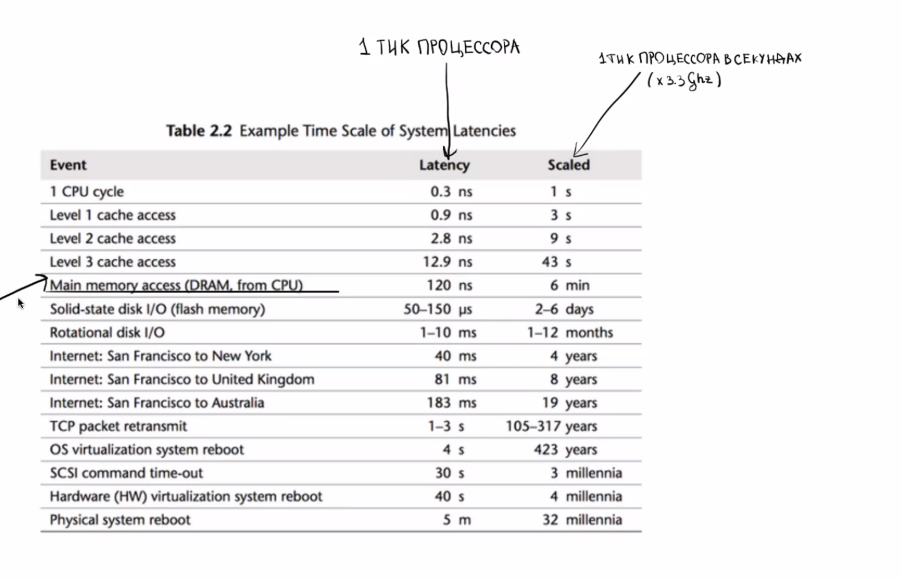
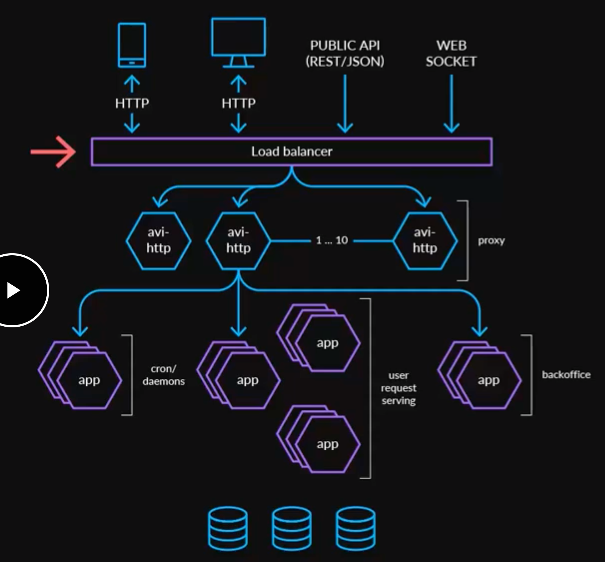

**Взять ручку и листок!!!!**

Материал:

- Grokking the system design interview (https://www.educative.io/courses/grokking-the-system-design-interview/m2yDVZnQ8lG, есть копия в папке tricks
- Высоконагруженные приложения. Программирование, масштабирование, поддержка | Клеппман Мартин
- https://leetcode.com/discuss/general-discussion/125038/system-design-interview-prep
- https://engineering.videoblocks.com/web-architecture-101-a3224e126947
- https://bege13mot.github.io/grokking/#caching
- https://github.com/donnemartin/system-design-primer


https://www.amazon.com/dp/B08CMF2CQF/

Схема тяжело читается, поэтому есть несколько предложений:

- почитать [про system design](https://www.amazon.com/System-Design-Interview-insiders-Second/dp/B08CMF2CQF) и там хорошие примеры отображения дизайна систем
- пошатать формат, еще раз скажу про фомат ревью через [документ](https://review.firstround.com/making-engineering-team-communication-clearer-faster-better), так это чильно легче обсуждать и вопросы собираются асинхронно 

**First Round Review**

**[Making Engineering Team Communication Clearer, Faster, Better](https://review.firstround.com/making-engineering-team-communication-clearer-faster-better)**

Derek Parham specializes turning engineers into great communicators. Here's the framework he used to do it at both Google and on the Hillary Clinton campaign. (Not automatically expanded because 3 MB is too large. You can [expand it anyway](https://assets.proof.pub/2056/firstround%2Fe2fyrJATTIqYvUVMx9js_GettyImages-673125655.jpg) or [open it in a new window](https://assets.proof.pub/2056/firstround%2Fe2fyrJATTIqYvUVMx9js_GettyImages-673125655.jpg).)





Основной принцип: архитектура может построена разными способами и нет единственно верного подхода. Везде есть свои плюсы и минусы.


# Общее

Проектирование системы состоит из шагов.

## Выяснение требований

Вопросы о дизайне открытые, и у них нет ОДНОГО правильного ответа. 

Поэтому важно задавать вопросы, чтобы:

- найти точный масштаб проблемы.
- понять на каких частях системы сосредоточиться 

### Нагрузка

- Сколько пользователей будут использовать систему?
- Количество read/write на пользователя?
- Количество read/write на систему (получается, это (1) * (2))
  - нужно уточнение. RPS не равномерно распределяется в течении дня ([1](#метрики-для-rps))

- RPS на систему
- 


Это очень важное требования, т.к. от него зависит, например:

- требуется ли решать проблему dog pile effect
- какие требования к тем сервисам, в которые мы ходим (внутренним сервисам, сервисам сторонних партнеров)

### Функциональные требования

Проговорить словами, что будет делать система!!!

- что размещать на сервисе (твиты, посты, комментарии, тексты)?
- что получают в ответ от сервиса (URL адрес)
- что могут делать пользователи на сервисе (create, read)
- что происходит в момент *create* и *read*
- необходимо ли размещать большой контент или медиа в *entity* (большой текст, фото, видео)
- необходимо ли отдельно загружать/скачивать медиа (фото, видео)
- ограничение размера *entity* (размера URL, размера текста)
- можно ли задавать `expiration_time`, удаляются ли entity автоматически через некоторое время.
- можно ли задавать `custom_entity_hash`, `custom_URL`
- пользователи
  - какие типы пользователей (usergroup), группы пользователей, (гости, зарегистрированные, админы)
  - сколько пользователей
  - ограничение доступа к entity для пользователей
  - как задается ограничение пользователей к entity (дискреционная система, мандатная, матрица доступа)
  - как связаны пользователи (подписки, чаты)
  - статус-онлайн
  - кошелек пользователя
  - регистрация / авторизация (смс)
  - профиль
- личные сообщения
  - одиночные чаты
  - групповые чаты
- комментарии
- паблишер постов
- генерация пользовательского контента
- геотаргетинг
- реклама
- теги
- категории
- suggestion
- подписка на контент (посты, теги, категории, сообщения), пользователей (follow), сообщества.
- избранные *entity*
- теги
- Похожий контент (посты (20М+), комментарии (35M+)), статика (картинки, видео), пользователи (2M+),
- поиск похожего контента для устранения дублирования (фото, видео,)
- необходимо ли разрабатывать интерфейс (???)
- требуется ли поиск
  - полнотекстовый
  - по названиям
  - по тегам
- требуются ли какие-то ленты с *entity*'s (лента новостей друзей, общие ленты новостей сайта )
- какие сортировки в лентах (hot, best, recent, trend)
- требуются ли блоки с *hot entity*'s (лучшие новости, топ пользователи)
- рассылка уведомлений  в веб-интерфейс, браузеры, телеграмм, мобильные приложения, push уведомлений в ios и android (ios – технология APN, android – технология GCM).
- как будем бороться со злоупотреблениями (антиспам, большое количество запросов от пользователя/IP)
- почтовые рассылки
- антиспама, автобана, автоматической фильтрации ненормативной лексики.
- жалобы (пост, коммент, пользователь)
- избранное (`favorite`)

Дополнительные требования:

- какие дополнительные настройки у *entity*:
  - выбор *custom ID* для *entity*
  - *expiration time* для *entity*

### Нефункциональные требования:

- требуемое время генерации страницы
- перцентили времени ответа
- задержка получения *entity* (сообщений, лент)
- *durability*, почему и как нужно обеспечить
- *high availability*, почему нужно и как обеспечить
- непредсказуемость генерации *entity ID*
- соотношение *consistency - availability*

### Дополнительные требования

- Нужны ли сводные аналитические отчеты? Какие? Мониторинг?
- Доступ через REST API для сторонних сервисов

### Артефакт на выходе

- список собранных требований

## Определение API системы

Позволяет:

- установить точный контракт, ожидаемый от системы.
- более точно формулирования требования к системе (входные и выходные данные)

Входные данные определяются на основе раздела функциональные требования!!!:

- смотреть [Построение data model](#построение-data-model)

Выходные данные:

- для `create` – URL на *entity* (`string`)
- для `delete ` – статус `OK`, `Error`

Выходные данные для сервисов:

- разные коды HTTP:
  - 200 OK 
  - 201 Created
  - 301 Moved Permanently 
  - 302 Redirect
  - 400 Bad Request 
  - 401 Unauthorized 
  - 403 Forbidden — запрещен доступ из-за ограничений
  - 404 Not found
  - 500 Internal Server Error 
  - 504 Gateway Timeout 

Типичные методы:

- `create`, `post`, 
- `read`, `get`
- `search`
- `update`
- `delete`
- `generate` (сгенерировать ленту)
- `mark` (пометить как какой-то статус, *favorite*, *moderate*,..)
- `setPermission` (установить права на entity)

Особенности работы:

- как будем бороться со злоупотреблениями (антиспам, большое количество запросов от пользователя/IP)

### REST

Методы:

- `GET /<entity>` – получить список сущностей (`SELECT`)
- `GET /<entity>/<id>` – получить сущность с конкретным `id` (`SELECT`)
- `POST /<entity` – создать новую сущность (`INSERT`)
- `PUT /<entity>/<id>` – обновить сущность целиком (`UPDATE`)
- `PATCH /<entity>/<id>` – частично обновить сущность (`UPDATE`) 
- `DELETE /<entity>/<id>` – удалить сущность с `<id>`

Можно использовать вложенные методы:

- `GET /<entity>/<entity_id>/comments` – получить комментарий из сущности
- `GET /<entity>/<entity_id>/comments/<comment_id>` – получить комментарий с `<comment_id>` из сущности

Дополнительные параметры запроса:

- `GET /tickets?sort=-priority` – сортировка

Способы сериализации:

- `json`
- `xml`
- `yaml`

Сегмент пути должен быть в нижнем регистре и разделен дефисами.

```
/customer-details/{customer-id}
```

Необходимо избегать косой черты в конце.

Документирование API:

- swagger

### Версионирование API

Необходимо обязательно версионирование API,  чтобы не ломать обратную совместимость:

- есть кейсы, которые не ломают совместимость (например добавляются новые поля в API)
- емть кейсы когда совместимость ломается (что-то убираем из ответа API)

### Внутреннее API

- RPC ([1](Microservice.md#rpc))
- gRPC


## Оценка характеристик системы

### Типы ресурсов

- Процессор


- Память (RAM)


- Disk IO


- Сеть

### Оценка нагрузки

- Задаем соотношение `создание_entity : чтение_entity` (например, `1:100`) Определяем пишущая или читающая нагрузка.

- Задаем RPM (*Request per month*) для `создание_entity`

- Считаем RPM для `чтение_entity`:

  ```
  чтение_entity_в_месяц = создание_entity_в_месяц * (создание_entity : чтение_entity)
  ```

- Считаем RPS для `создание_entity` и `чтение_entity`:

  ```
  создание_entity_в_секунду = создание_entity_в месяц / (30 * 24 * 3600)
  чтение_entity_в_секунду = чтение_entity_в_месяц / (30 * 24 * 3600)
  ```

### Оценки Entity

Задаем количество лет `хранить_лет`, в течении которых будем хранить *entity*'s. 

Задаем `размер_entity`:

- Если нет внешних объектов (фото, тексты), то `размер_entity` считается по размеру записи в БД
- Если есть внешние объекты (фото, тексты), то учитываем их размер, нужно оценить средний размер *entity*. Для внешних объектов можно задать: каждый 5-й содержит фото, каждый 10-й видео.
- Превью для внешних объектов.

Общее количество entity:

```
общее_количество_entity = создание_entity_в_месяц * 12 месяцев * хранить_лет
```


Размер `entity_id`:

```
размер_entity_id = log (общее_количество_entity)
```


### Оценка storage

Нужно отдельно посчитать *entity* и медиа в *entity*

Считаем общий размер *storage*:

```
размер_storage = общее_количество_entity * размер_entity
```

Количество серверов под storage:

```
количество_серверов_под_storage = размер_storage / (размер диска сервера)
```


### Оценка *network bandwidth* (пропускная способность сети)

Нужно отдельно посчитать трафик на *entity* и медиа в *entity*

- входящий трафик (*incoming traffic*)

  ```
  входящий_трафик = создание_entity_в_секунду * размер_entity
  ```

- исходящий трафик (*outgoing traffic*)

  ```
  исходящий_трафик = чтение_entity_в_секунду * размер_entity
  ```

### Оценка скорости чтения / записи на диск

```
скорость чтения = исходящий_трафик / количество_серверов
```

```
скорость записи = входящий_трафик / количество_серверов
```


### Оценка memory cache (кеша в памяти)

Согласно правилу 80-20, 20% *entity*'s генерируют 80% трафика, необходимо кэшировать эти 20% горячих entity's.

Размер *memory cache* для кэширования горячих *entity*'s в течении 24 часов (или можно несколько суток):

```
размер_memory_cache = чтение_entity_в_день * размер_entity * 20%
```


 

- количество серверов
- как часто надо перегенерировать *secondary information* (блоки, ленты) 

- 

- 


## Построение data model

В MongoDB можно хранить `array` в документах!!!

На этом шаге нужно посчитать размер *Entity*. 

В БД хранится только метаинформация, большие данные (статика, тексты) выносятся в облако.

Типичные объекты:

- 

- общие
  - `id`, `hash`, `session_id` 
  - `date` или `timestamp ` (дата)
    - `creation_date`
    - `expiration_date` (время протухания)
  - `location` (местоположение)
    - `latitude` (широта)
    - `longitude` (долгота) 

- `User` 
  - `user_id`
  -  `name`
  -  `email`
  -  `registration_date`
  -  `last_activity`
  -  `birthday`
  -  `age`
- `Entity` 
  - `entity_id`
  - `entity_hash`
  - `custom_entity_hash`,  `custom_URL`  (заданный пользователем)
  - `user_id`
  - `name ` или `title`
  - `category`
  - `description` 
  -  `content`  или `data` (контент)
  - `path_to_file` 
  - `image`, `video`
  -   (для NoSQL) `[user_ids]` с разрешением на доступ
  - рейтинг
    - `likes ` (лайки)
    - `dislikes` (дизлайки)
    - `rates` (рейтинг)
    - `views` количество просмотров
- `Media`, `Photo`, `Video`
  - `offset` (смещение) (для API, не БД)
  - `codec`
  - `resolution`
  - `size`
  - `preview`
- `Comment`
  - `text`
  - `user_id`
  - `entity_id`
  - `time`
  - `media` (`photo`, `video`)
- `Tag`
- `UserFollow` (подписки)
- `Favorite` (избранное)
- `Permissions` (имеющиеся разрешения)
  - `permission_id`
  - `permission_name`
- `User_permissions`  (разрешения пользователей на отдельные `entity`)
  - `user_id`
  - `permission_id`
  - `entity_id`
- `User_groups` (типы пользователей по правам)
- `adv` (реклама)
- `mail` (почтовые сообщения)
- `ban` (баны)
- `block_cache` (блоки в кеше)
- `category` (категории)
- `community` (сообщества)
- `complaint` (жалоба)
- `gallery` (галереи)
- `post` (пост)
- `notification` (уведомления)
- `subscribe` (подписка)
- `wallet` (кошелек)

### Выбор СУБД

Аргументы в пользу документно-ориентированной NoSQL (Mongo):

- хранятся большое количество строк
- между сущностями мало связей
- легко выполняется, встроенное шардирование
- можно вкладывать в документ массивы сущностей `{ user_photos: [ {....}, {...}] }`

Необходимо выбрать СУБД

- NoSQL
- RDBMS (MySQL, Postgres)

 Выбор *Storage* для хранения статики:

- HDD
- SDD

### Оценка storage под БД

Аналогично [Оценка storage](#оценка-storage)

- `unsigned int` – 4 байта (4,2 млрд), 8 байт
- `date`
  - `datetime` – 8 байт
  - `timestamp` – 4 байт

- `string` (1 байт или 1-3 байта на символ)
  - `name` – 20 байт
  - `email` – 32 байт
- вещественные
  - `float` (4 байт)
  - `double` (8 байт)
  - `decimal` – отдельно требуется место под целую и дробную часть, каждые 9 цифр - 4 байта. Все что больше 9 цифр, упаковывается в 1-4 байта. 

Отдельно считается каждая таблица

## Алгоритм работы

### Генерация внешнего `entity_hash`

Также [Генерация глобально уникальных идентификаторов](Sharding.md#генерация-глобально-уникальных-идентификаторов)

Варианты:

- использовать свойства Entity для получения `entity_hash` (например, `URL` или `name`). 

  Недостаток: предсказуемость `entity_hash`.

- генерировать `entity_hash` от случайных значений.

  Недостаток: возможные дубликаты ключей

- Использовать сервис генерации ключей (KGS), которая заранее генерирует множество `entity_hash` и сохраняет их в базе данных (назовем ее key-DB). Backend'ы берем один из уже сгенерированных *hash*'ей и используем его. А лучше берет сразу пачку *hash*'ей.

  Можно посчитать – сколько место будут занимать все заранее сгенерированные хеши:

  ```
  место_на_диске = количество_хешей * размер_хеша
  ```

  

  Преимущества: нет дубликатов, они проверяются заранее.

Для получения `entity_hash` необходимо рассчитать каким-то образом *hash*:

- MD5. Хеш содержит 128 бит (16 байт) и обычно представляется как последовательность из 32 шестнадцатеричных цифр

  ```
  MD5("md5") = 1BC29B36F623BA82AAF6724FD3B16718
  ```

  

- SHA256

А затем *binary hash* необходимо представить в виде набора отображаемых символов, которые допустимо использовать в URL. Например, с помощью:

- base64 ([AZ, az, 0-9] «-» «.»)  (1 символ - 6 бит)

На основе основания кодировки рассчитываем количество возможных хешей:

```
количество_хешей = 64 ^ количество_символов_в_хеше
```

Можно рассчитать нужное `количество_символов_в_хеше`

`количество_символов_в_хеше` = *log <sub>64</sub>* `общее_количество_entity`

### Генерация лент из данных нескольких шард

- медленный. Сервер собирает данные из нескольких шард. Например, для формирования ленты в 100 фото, он собирает по 100 фото для каждого подписанного друга, сортирует их и выбирает лучшие 100.
- постоянно генерировать для каждого пользователя таблицу `UserNewsFeed`. Для этого выделить отдельные сервера генерации лент

### Авторизация

Варианты реализации авторизации:

- использовать *api gateway* для авторизации.
- реализовать на стороне приложения (???jwt токены)


## Фронтенд

Способы получения с backend данных:

- для сообщений
- для лент

Способы:

- pull. Клиенты сами перезагружают страницу.
- push. сервер сам отправляет новые данные пользователям
  - websocket
  - long pooling для тех, у кого websocket не работает (старый браузер, сидят за прокси). Если сервер не имеет новой информации для клиента при получении опроса, вместо отправки пустого ответа сервер держит запрос открытым и ожидает, пока информация ответа станет доступной. Как только у него появляется новая информация, сервер немедленно отправляет клиенту ответ HTTP/S, завершая открытый запрос HTTP/S.

Если используется websocket соединение, то нужно посчитать сколько серверов требуется, чтобы держать коннекты:

```
количество_серверов = количество_подключений_в_один_момент / 50 000
```

При потере соединения, браузер должен автоматически переподключаться.

## High-level design (стандартная архитектура)


Нужно нарисовать блок-схему из 5-6 блоков, представляющих основные компоненты системы.

При построении архитектуры важно рассмотреть различные подходы, их плюсы и минусы, понять trade-off (компромиссы).

Основные компоненты архитектуры.

### Архитектура монолитного приложения




### Датацентры

Можно релизить приложение в несколько датацентров и кластеров в них.Это обеспечивает доступность приложения в случае выхода одно из ДЦ из строя.


### Load balancing

(точка отказа, дублируется)

Где использовать балансировку:

- между клиентами и *application server*'ами
  - *Front Load Balancer*. Перед *backend*'s размещается несколько программных балансировщиков в виде *nginx* на отдельном узле. 
  - DNS-балансировка. Для балансировки нагрузки на программные балансировщики *nginx*. Про DNS подробней
- между *application server*'ами и *database server*'ами
- между *application server*'ами и *cache server*'ами

Алгоритмы балансировки:

- Round-robin
- Least Connection – с наименьшим количеством соединений
- Least Response Time – с наименьшим временем ответа
- Least Bandwidth – с наименьшим объемом трафика
- Weighted Round Robin – взвешенный Round Robin
- IP Hash – по IP
- sticky session

### Avi-http (nginx)

Сервера с nginx реверс-прокси. 

Задачи:

- терминируем SSL 
- применяем правила маршрутизации трафика в зависимости от домена в пользовательском запросе. Например:
  - для каких-то доменов сразу отдаем статику
  - для каких-то доменов статику отправляем в ceph
  - для внутренних доменов, контролируем доступ по IP адресу пользователя
  - какие-то запросы проксируем на *backend*'ы. Можем распределять трафик на разные бекенды в зависимости от домена. Это позволяет разделить бекенды на пулы – например, пул с backoffice (админкой), user-request serving (на картинке показано). Это позволяет в случае деградации приложения, не тянуть за собой деградацию других пулов – админки, ...
    - Для PHP: *nginx* проксирует запросы к `*.php` на PHP-FPM (*Apache*). В итоге *Nginx* сам поддерживает большое количество `keep-alive` соединений небольшим количеством воркеров за счет эффективной архитектуры. До *Apache* долетает лишь малое количество очень коротких по времени проксированных запросов от nginx. Ответ *Apache* вычитывается в буфер *nginx* и отдается с требуемой клиентом скоростью.


### Backend (web application server)

*backend*'s (*web application servers*) для обработки *dynamic requests*'s. 

*backend*'s можно разделить на группы (отдельные на схеме), в зависимости от типа нагрузки:

- *write* (как у нас `adm1` для записи статики, сохранениям комментов) – т.к. загрузка это тяжелая операция и если поступает много операций write, то пользователи не смогу *read*
- *read*

### Конфигурирование серверов

Для простоты конфигурирования nginx может использоваться Puppet. Puppet — это инструмент для управления инфраструктурой, в котором в виде манифестов можно описать, что должно стоять на сервере и с какими конфигурациями. После того как меняются манифесты, они автоматически применяются на нудный пул серверов nginx, с помощью puppit agent'ов, которые инсталлированы на всех серверах.

### Cron/daemons

Выводятся на отдельные сервера, т.к. выполняются долго, могут течь по памяти и при этом не затрагивают основное приложение.


### Облако (статика, storage)

Варианты реализации:


- собственная система статики. Статика (картинки, видео) и динамика (php-скрипты) разносятся по разным серверам. Запросы к API-приложения, которые обрабатываются серверами динамики, небольшие по размеру и должны выполняться очень быстро. Запросы к статике, наоборот, тяжелые и для них не требуется значительная оперативность. Поэтому для них требуется разная конфигурация серверов по процессору и памяти. Если статика и динамика расположены на одном сервере, тяжелые запросы к статике начнут тормозить легкие оперативные запросы к API.
- Часто статика выносится в облако (Amazon S3), для того чтобы использовать готовую реализацию хранения и обработки статики.

Собственная система:

- *durability*, дублирование данных на разных серверах
- шардирование статики по серверам

### CDN

Нужна всем проектам со статикой. Можно обойтись своей системой хранения статики.

CDN запрашивает файл у серверов статики, а затем кэшировать его локально и передавать запрашивающему пользователю.

### База данных

База данных вынесена на отдельный сервер. 

Если есть внешние объекты (тексты, фото), то здесь хранятся *Entity Metadata* (так пишется на схеме)

Тип БД:

- MySQL
- PostgreSQL
  - перед ним ставится PgBouncer

Вопросы:

- каким образом масштабировать базу данных:
  - масштабировать не нужно, все влезает в одну БД. Не позволяет наращивать масштаб системы, имеет ограничение по RPS.
  - репликация. **В архитектуре replicas**. Выбираем для масштабирования по *read*. Не позволяет наращивать масштаб системы, имеет ограничение по RPS по write. Есть сервер с master DB и несколько slave DB, на которые осуществляется репликация.
    - существует лаг репликации
    - есть кейсы, когда лаг не критичен
  - шардирование ([смотри ниже](#шардирование))
  - партиционирование
  - scale back? (*удаление неиспользуемых entity*'s) В архитектуре **Сервис переноса в архив**. Возможно хранить `expiration_time`. Смотреть [Scaling back](Highload.md#scaling-back)
  - при чтении можно использовать агрегирование данных (параллельные походы в разные инстансы бд) – scatter/gather
- каким образом проиндексировать данные. Кластерный ключ определяет порядок хранения данных и возможность размещения горячих данных вместе.
- ленты с большими смещения `OFFSET` ()
  - покрывающие индексы
  - ограничение количества страниц
  - переделано с `OFFSET` на условие `id>`
  - транзакционный (InnoDB) и нетранзакционный движок
- геораспределение данных при наличии нескольких ДЦ – если данные для ленты readonly и их можно дублировать по всем ДЦ и регионам. Трейдофф, что жертвуем местом на диске, но получаем более высокую скорость ответа для пользователей
  - Как мигрировать данные между дц? C помощью триггеров
- в микросервисной архитектуре у каждого сервиса своя БД

#### Шардирование

Также [шардирование](Sharding.md)

Усложняет архитектуру системы.

Вопросы:

- Подсистема роутинга запросов к шардированной БД. Координатор (coordinator), умный клиент, прокси.
- виды шардирования
  - вертикальное шардирование
  - горизонтальное шардирование
- выбор ключа шардирования – идентификатор важной сущности (чаще всего `user_id` или `entity_id`) важно, при этом этот обработка данных одного самого активного идентификатора (самого активного пользователя) должна влезать на сервер. 
- выбор функции шардирования:
  - фиксированное – плохо, неравномерно
  - *consistent hashing*  – лучше, позволяет гибко!!! управлять распределением слотов по шардам, путем задания параметров для формулы *consistent hashing*
  - динамическое – еще лучше, но нужно хранить где-то отображение
- дублирование данных в shard'ах. 
  - Например сообщения можно хранить сразу на shard'ах обоих пользователей. Или хранить в отдельном кластере с диалогами.
- [генерация глобально уникальных идентификаторов]()
- ВАЖНО!!! что делать с горячими *user*'ами , которые много твитят или подписываются на множество людей? Использовать кеширование (смотреть [горячие фотографии](Highload.md#хранение-статики-в-своем-кластере), смотреть [горячие ключи](Highload.md#горячие-ключи), [расчёт степени теплоты секций](Sharding.md#новые-данные-на-выбранные-сервера-new-data-on-selected-servers)). Считать степень теплоты секции и когда она перегревается прекращать туда запись.
- Подсистема исполнения распределенных транзакций, согласованных в конечном счете, используется единая очередь транзакций, транзакции реализованы как идемпотентные и коммутативные (для этого извлекаем сообщение о событии из исходном шарда).
- postgres умеет автоскейлиться в облаке

На основе [оценки storage под БД]() можно посчитать количество шардов:

```
количество_шард = размер_БД / размер шарда (лучше с запасом)
```

#### Важно corner cases

- Возможны проблемы с согласованностью в распределенной среде

- Проблема с горячими пользователями, имеющими много подписчиков.

### Кеш

Какие виды кешей использовать.

- Система распределенного кеширования в памяти (memcached, redis) вынесена на отдельный сервер с большим количеством оперативной памяти.

  Современный сервер может иметь 256 ГБ памяти, количество требуемых серверов:

  ```
  количество_серверов = размер_memory_cache / 256 ГБ
  ```

- в разделяемой памяти *application server*, shared memory, расширение `shmop`
- в базе данных (кеширующие и сводные таблицы)
- на диске (статика, превью)
- в сети, реверс прокси nginx
- а браузере, заголовки `Cache-Control`, `ETag`, `If-None-Match`, `Vary`


В микросервисной архитектуре – отдельный сервис (recomendations) для кэша данных.


Особенности:

- включить в архитектуру реплики для кешей
- использовать *sharding* через *consistent hashing*
- *dog pile effect*
- критическая секция
- инвалидация ключей на основе тегирования
- Реализация счетчиков, с шардированием ключей на чтение и на запись

#### Алгоритм вытеснения из кеша

Необходимо выбрать алгоритм вытеснения кеша (также [1](Algorithm.md#алгоритмы-вытеснения-из-кеша)). Все методы требуют использования структуры, для сбора статистики по использованию ключей.

- Least recently used (LRU, наименее недавно используемый) – в первую очередь вытесняются записи, неиспользованные дольше всех. 

- Most Recently Used (MRU, наиболее недавно использовавшийся): в первую очередь вытесняется последний использованный элемент. Полезны, когда чем старше элемент, тем больше обращений к нему происходит.


- Least-Frequently Used (LFU, наименее часто используемый) – подсчитывает, как часто используется элемент. Те элементы, обращения к которым происходят реже всего, вытесняются в первую очередь.

Кроме того можно учитывать: 

- Хранить дольше данные, которые дороже получать.


- Вытеснять быстрее записи большого размера, т.к. это позволит сохранить несколько записей поменьше. 

#### Как обновлять кэш

- синхронно в записью в БД пушить в кэш – плохо
- (любые стратегии инвалидации)
- асинхронно – данные объявления передавать через очередь, либо кидать просто какие-то id в очередь

### Очереди

Очереди для того, чтобы хранить фоновые тяжелые задачи

- синхронизация статики (rsync картинок)
- обработка видео и аудио
- отправки смс
- отправки уведомлений в браузер и моб приложения, мобильные устройства

 Для их поддержки нужны:


  - *Message broker*'s (часто Rabbit MQ, или просто БД)

  - *backend*'s, которые взаимодействуют с *message broker*'s и выполняют фоновые тяжелые задачи. Это часто группы backend's, каждая из которые выполняет некоторую специфичную задачу и соответствующим образом под нее сконфигурирована. Например, для обработки видео требуется быстрый CPU, а для отправки сообщений – быстрый *network*.

  *Message broker* и эти бекенды размещают на отдельных серверах. 

Очереди могут использоваться для перекладывания данных из одного сервиса в другой. Например лента с постами может храниться в отдельном сервисе с отдельной БД, которая будет наполняться логической репликацией из сервиса постов. Для логической репликации можно использовать kafka connect, которая перекладывает изменения в БД в kafka. kafka connect читает бинарный лог изменений данных.

Паттерны при работе

- cqrs
- event sourcing
- transactional outbox


[Про очереди читать здесь](Microservice.md#обмен-сообщениями)

### Поиск

Поисковый движок: 

- Apache Solr
- Sphinx
- ElasticSearch

При поиске в них индексируются данные из основного хранилища

### ElasticSearch

Общий принцип индексации данных в ElasticSearch:

- пишем данные в исходную БД и параллельно в kafka
- читаем сообщения из kafka в ElasticSearch
- делаем запросы в ElasticSearch

ElasticSearch позволяет:

- выполнять поиск данных
- выполнять пагинацию данных при выборках 

### Размещение разных компонентов на одном узле

Нормальная практика, когда на одном узле сразу размещаются несколько компонентов, которые используют разный профиль нагрузки. Например, search утилизирует на узле весь CPU, а память утилизируется Database.

### Авторизация

-  oauth
- JWT токен

https://ru.wikipedia.org/wiki/JSON_Web_Token

https://habr.com/ru/post/340146/

https://vc.ru/dev/106534-jwt-kak-bezopasnyy-sposob-autentifikacii-i-peredachi-dannyh


## Монолит и микросервис

Необходимо выбрать:

- монолитная
- микросервисная архитектура

Вопросы:

- какой размер команды? Если большой - микросервисы

[Преимущества микросервисов](Microservice.md)

 

набор сервисов (микросервисная архитектура). Они могут быть:


  - внешние (сторонние), например, отправка писем
  - внутренние (собственные), например на Go

      - кодировка фото/видео
      - генерация превью (фото, видео)
      - генерация лент для пользователей в шардах
    - почтовые рассылки
    - рассылка уведомлений  в веб-интерфейс, браузеры, телеграмм, мобильные приложения, push уведомлений в ios и android (ios – технология APN, android – технология GCM).
    - смс-уведомления
    - поиска похожего контента для устранения дублирования (фото, видео)

Для сервисов три столпа:

- мониторинг
- логирование
- трасировка

Из трейсеров:

-  Jaeger (Go)
- Zipkin (Java)

Автоматизация развертывания:

- kubernetes (k8s) – дает возможность автоскейла
  - на какую метрику смотреть при масштабировании подов в k8s:
    - response time (найти порог response time, после которого повышать число подов), 
    - потребление cpu, 
    - памяти
    - throughput

Архитектура сервисов:

- Api Gateway


#### Сервис персональных данных

Персональные данные должны хранится в одном месте в системе, т.к. пользователь может потребовать удалить персональные данные.

Персональные данные должны быть удалены по требованию пользователя 30 дней, поэтому их можно хранить с TTL 30 дней без особых заморочек.

Данные помещаются в Personal data service и возвращается их id и hash, рассчитанный из данных. По hash мы можем не зная самих данных всегда определить:

- сколько экземпляров данных с таким hash хранится
- есть ли уже экземпляры данных с таким hash
- найти все экземпляры данных с таким hash


#### Что нужно продумывать в microservice architecture:

- Graceful degradation
- Retry's
- Fallback – если недоступен один сервис, переключится на другой. Если недоступна одно хранилище, переключиться на другое.
- Распределенные транзакция - паттерн saga

- Api gateway – для маршрутизации входящих запросов. 

  Варианты реализации api-gateway:

  - написать самому на go


#### Docker и K8S

[link](docker.md)

#### Примеры сервисов

- item – для хранения *item*'ов 
- recommendations - это отдельный сервис, который хранит в кеше списки item'ов. Снимает нагрузку с сервиса item


- потоковая обработка данных (стримминг). Реализуется Apache Kafka. Собирает поток событий из системы (лайки, публикации, комментарии) и подготавливает их и агрегирует, чтобы дальше они могли быть удобно визуализированы. Например, сколько лайков было ставлено за последний час. То же самое можно сделать и с базой данный, но Kafka позволяет обрисовывать данные из скользящего окна за последний час/день (и т.д.) и не нагружает базу данных.
- хранилище данных – для сбора событий и построения сложных аналитических отчетов. Реализация – Hadoop. Он хранит огромное количество данных, мы запускаемм Map-Reduce и он агрегирует эти данные из хранилища.

### Test и Deployment

- Непрерывная интеграция с помощью Jenkins
- тестирование
- развертывание приложения
- деплой:
  - green-blue
  - канарейка

## Выявление и устранение bottlenecks (узких мест)

Вопросы:

- Точки отказа (*point of failure*) среди компонентов архитектуры? Устраняются за счет избыточности компонентов.
  
  Необходимо дублировать все сервисы
  
  - служба генерации *hash*'ей
  
- Потеря данных устраняется за счет избыточного хранения данных.

  Необходимо сделать replica's (для БД, кешей) для всех данных, чтобы при выходе из строя одного из них выдержать нагрузку. 

## Observability

- Мониторинг компонентов архитектуры
  - самописное в СУБД
  - ELK-стек –  для анализа логов
  - Prometheus + Grafana
  - Zabbix 
  - newrelic
  - след оповещения
- логирование
- визуализации статистики
- алертинг, оповещения когда критические компоненты выходят из строя или их производительность снижается.
  - по количеству 400/500
  - доля ошибок к общему числу запросов
  - по response time
  - смотреть графики -1 день, -1 неделя для сравнения показателей
- трейсинг:
  - opentracing
  - jaeger
  - 

Мониторить:

- cpu
- ram
- rps
- latency
  - перцентили
- errors:
  - количество 404
  - количество 500
- сервера, 
- кэши, 
- БД
- балансировщики
- очереди
  - Количество событий в очереди
  - Количество сообщений, которые он вычитывает
  - время хранения сообщений, 
  - лаги и репликации консумеров
  - количество откладывания сообщений
  - dead letter queue
- подсистем приложения, 
- бизнес-метрик
  - проблемы с загрузкой картинок со сторонних серверов. Мы написали утилиту, которая периодически проверяет доступность картинок, время их загрузки
  - Лайки
  - Кол-во *entity*
  - Рассылки
  - Регистрации, авторизации
  - Переходы из соцсетей, поисковиков
  - время генерации 
  - число активных юзеров
  - количество новых твито

## Гео распределенность

- 


# Построение команд

Отдельные команды:

- продуктовая команда
- для БД
- для инфраструктуры

# Решение задач 

- Как ускорить задачу “скачать 100 урлов”? 

  Это i/o-bound задача, для ее решения можно использовать асинхронные запросы.

- Как ускорить задачу “проскорить 100 наборов данных”? 

  Это cpu-bound задача. Для решения неоходимо использовать потоки или процессы. 


# По результатам коммитетов

- нужно всегда указывать NFR сервисов
- RT сервисов оценивается исходя из NFR сервисов, от которых зависим
- При построении цепочки зависимостей сервисов и оптимизации запросов к сервисам (отсутствие повторяющихся запросов к одному сервису, оптимизаци графа зависимостей) – через graphQL
- вопрос версионирования. Виджеты страницы должны версионироваться. API должен версионироваться.
- если нужно зарелизить новую версию на фронтенде – то:
  1. делаешь бекенд, который умеет работать со старой и новой версией
  2. переводишь фронтенд на новые рельсы
  3. спиливаешь старый бекенд
- если нужно зарелизить новую версию App:
  1. нужно поддерживать код для старых и новых версий приложений
  2. когда становится мало клиентов на старых версиях, мы старую версию спиливаем.


# Требования к ответам

- Описывает работоспособную и масштабируемую систему
- Думает про потенциальные проблемы, предлагает решения
- Может объяснить, в чем преимущества и недостатки монолита и микросервисов и какую архитектуру выберет для своего решения
- Может обосновать выбор СУБД
- Слышал про шардирование и репликацию и может объяснить, как это работает
- Понимает, что при решардинге могут быть проблемы
- Может  обосновать выбор системы кеширования и где она может потребоваться
- Думает про оптимизацию своего решения на основе новых данных
- Знает что такое балансировщик и может «на пальцах» объяснить как он работает
- Имеет опыт работы с production highload решениями
- Сам «ведет» беседу, по своей инициативе узнает требования бизнеса. Если бизнес чего-то не знает, делает разумные допущения
- Собирает функциональные и нефункциональные требования к системе
- Думает про корнер-кейсы, предлагает решения
- Обосновывает свои решения цифрами и фактами (может посчитать расчетную нагрузку, соотнести ее с типичной capacity подсистемы, учитывает пиковые колебания нагрузки)
- Понимает, на какие допущения в архитектуре можно пойти
- Понимает, как устроена или может быть устроена геораспределенная система, как разложить данные и избежать гонок
- Понимает или думает о том как избежать единой точки отказа
- Учитывает особенности и слабые места конкретных продуктов (субд/брокеры/балансировщики)


# Rate-limit

Представь, что ты администрируешь сайт интернет-магазина. В его адрес постоянно приходит много запросов. Тебе необходимо сделать rate limit, а именно установить чёткий лимит запросов в минуту, после которого клиенту придёт ошибка, а не страница. Как это будешь делать?

Требования, которые ожидаются к уточнению:

- Как идентифицировать клиента - через IP-адрес
- Как быстро должно выполняться решение - < 100 ms
- приложение, для которого выполняется rate-limit должно горизонтально масштабироваться? - да, у нас N серверов с сайтом
- Какие есть ограничения по памяти / CPU - ограничений не накладываем
- Как балансируются запросы - round-robin

- Запрос может прийти на любой из серверов 
- Текущее количество запросов по клиенту одинаково для всех серверов 
- Как минимизировать утилизацию сети


Варианты решения:

- прокси-прослойка в приложении и локальный кэш.
- отдельный сервис:
  - Система защиты выделена в отдельный сервис, пропускающий запрос
  - go proxy service/microservice
  - Проработано несколько механизмов синхронизации данных
  - общий key-value кэш, например, Redis, MongoDB
  - Система защиты распределённая, CAP-ограничения
- балансировщик
  - nginx, envoy, 
  - 


- 
- stateless vs statefull
- proxy?
- load-balance и разные алгоритмы балансировки
- всевозможные оптимизации для уменьшения нагрузки сети?
- какие негативные последствия?


# Проектирование twitter

- Масштабирование БД
  - 
- кеш
  - инвалидация
- горячие множества
- архитектура
  - связь между ДЦ по vpn
  - балансировщики nginx-haproxy-nginx_factscgi
  - входящий балансер терминирует ssl
  - днс-балансировка, но она медленно растекается по днсам

- хранение статики
  - cdn
  - оригиналы
- метрики
  - RPS общий
  - RPS по критичным API
  - тайминги и rps запросов в БД 
  -  медиана и перцентили

Архитектура:


Важные моменты:

- DNS, CDN – как отдельные сущности
- Auth service - сервис авторизации
- User service - сервис пользователей
- Tweet service - сервис хранения твитов, сущностей предметной области
-  Timeline service – сервис для денормализация данных. Там храним ленту для конкретного пользователя:
  - Message queue - для информирования timeline service о новых твитах в tweet service
- WebSockets Push service – сервис отправки пушей о сообщениях
- 


 Идемпотентность