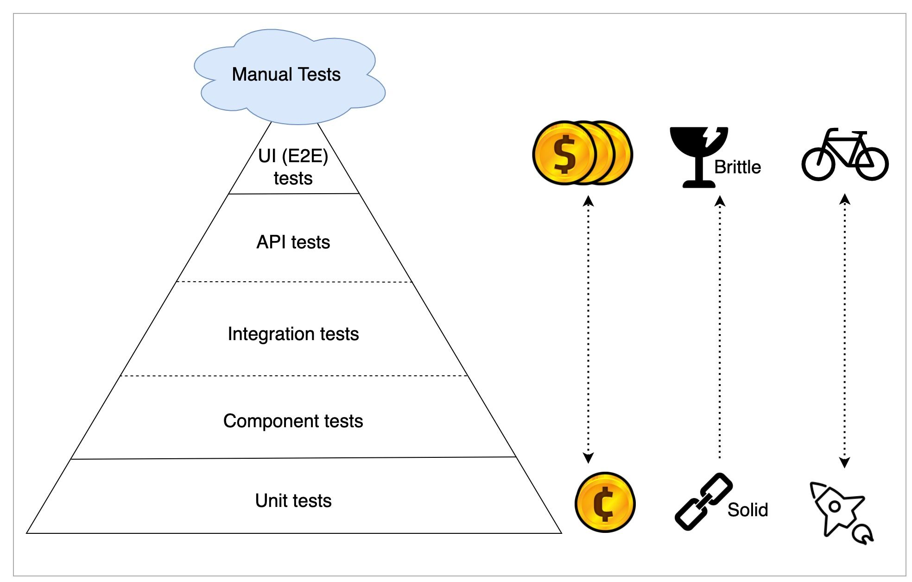
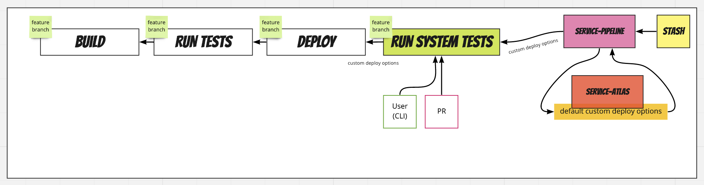

Типы тестов в Ozon: https://habr.com/ru/company/oleg-bunin/blog/585766/

# Разработка через тестирование (test-driven development, TDD) 

Предполагает повторение очень коротких циклов разработки:

·  пишется тест, покрывающий нужную функциональность

·  пишется код, который позволит пройти тест

В этом отличие от обычного цикла разработки, когда тесты пишутся после того, как код уже написан.

Разработка через тестирование тесно связана с принципами KISS (подробнее KISS (keep it simple, stupid, будь попроще, дурачок)) иYAGNI (подробнее YAGNI (You aren't gonna need it, вам это не понадобится)), так как при разработке через тестирование пишется только тот код, который необходим для прохождения теста.

Минусы:

·  требуется написать большее количество кода,

Плюсы:

·  заставляет разработчика сфокусироваться на функциональных требованиях до написания кода. 

·  Заставляет разработчика писать тесты, не позволяя переходить к реализации следующей функциональности, не протестировав существующую.

·  время, затрачиваемое на отладку, снижается многократно;

·  уменьшается количество ошибок в коде;

·  препятствует появлению хронических и дорогостоящих ошибок, приводящих к длительной и утомительной отладке в дальнейшем.

·  позволяют производить рефакторинг кода без риска его испортить

·  Уверенность в том, что изменения не нарушат существующую функциональность, придает уверенность разработчикам и увеличивает эффективность их работы.

·  увеличение связности

·  уменьшение зацепления. Достигается за счет обязательного использования DIP для изоляции модулей и реализации в соответствии с интерфейсами mock-объектов. Также пишутся чистые функции (подробнее Чистота функции)

·  Unit-тесты могут использоваться в качестве примера использования модуля, т.е. документации. Соответственно тесты всегда поддерживаются в актуальном состоянии, в отличии от документация и комментариев, которые могут устаревать.

# Виды тестирования

Тут хорошо тесты расписаны (картинка оттуда же): https://blog.getmason.io/test-pyramid/

## Пирамида тестирования

Пирамида тестирования задает правила группировок тестов по уровням их проверок и скорости выполнения. Также она дает представление о том, какое количественное соотношение должно быть между этими группами.

Пирамида (от наименьших по количеству, наиболее дорогих к наибольшим по количеству, дешевым):

- [manual](#manual)
- [e2e тестирование (end-to-end)](#e2e-тестирование-end-to-end)
- [интеграционные тесты]()
- [компонентные UI тесты (на client-side)](#компонентные-ui-тесты-на-client-side)
- [Unit тестирование](#unit-тестирование)

Рассмотрим на примере web shop.

## Unit тестирование

Unit тестирование (модульное тестирование) – проверка работоспособности обособленного модуля (или группы модулей). Т.е. ключевой момент –изолировать отдельные модули и показать, что по отдельности эти модули работоспособны. Этот тип тестирования обычно выполняется программистами.

Особенности:

- Быстрые. 
- Надежные. Т.к. нет никаких зависимостей.
- Простые. Позволяют быстро найти место, где произошла ошибка. 

Недостатки:

- не проверяют бизнес-сценарии, а только логику кода
- требуют постоянного переписывания при изменениях в коде

Ограничения модульного тестирования

- бесполезно для обнаружения ошибок интеграции модулей. Для этого требуется интеграционное тестирование. 

- бесполезно при тестировании производительности. Для этого используется нагрузочное тестирование.

  

<u>Пример:</u>

Unit тесты проверяют функционал конкретного модуля (чаще всего, класса).

## Компонентные UI тесты (на client-side)

Тестирования уже самого интерфейса приложения. Мокаются все зависимости на *server-side* и тестируются компоненты на *client-side*.

## Интеграционное тестирование

Проверяют взаимодействие между частями системы, например:

- *microservice* – *microservice*
- *frontend* – *backend*
- *backend* – *DB*

Часть зависимостей может мокаться. Например, мокаются зависимости в *microservice* через *hoverfly*.

Преимущества:

- более устойчивы к рефакторингу, чем unit тесты.
- больший охват функционала одним тестом

Недостатки:

- писать сложнее, чем unit тесты
- сложнее найти ошибку
- не покрывают бизнес-сценарий полностью

<u>Пример:</u>

- Работает ли правильно "Корзина", состоящая, в свою очередь, из 10 классов (предварительно проверенных модульными тестами)
- Работает ли "Корзина" при взаимодействии frontend-backend и т.д. 

## e2e тестирование (end-to-end) (??? системные тесты)

Сквозное тестирование. Тест через взаимодействие с элементами UI без всяких *mock*'ов. Т.е. это тесты с использование реальных сборок Front и Back и баз данных.

Т.е. они похожи на интеграционные тесты, но проверяют систему целиком. Воздействуют на систему через ее самые внешние интерфейсы и проверяют ожидаемую реакцию системы через эти же интерфейсы. 

Недостатки:

- Самые долгие автоматизированные тесты.
- Очень нестабильны
- Трудно поддерживать

Преимущества:

- Покрывают полностью бизнес-сценарий. Дают уверенность, что пользователь все видит правильно. Проверив один E2E тест, можно быть уверенным в результатах работы всей логики приложения на всех уровнях архитектуры
- Проверяет интеграцию компонентов на всех уровнях архитектуры.

<u>Пример:</u>

- Тест, который генерирует набирает email и отправляет его. Тест успешен, если email пришел в IMAP ящик.

## Manual

Ручные тесты, которые невозможно покрыть автотестами.

## Особые виды тестирования 

### Регрессионное тестирование

Регрессионное тестирование(regression testing, от лат. regressio — движение назад) — тестирование, направленное на обнаружение ошибок в уже протестированных участках исходного кода. Такие ошибки называются регрессионными ошибками (англ. regression bugs).

## Мнение AV

API тесты - в тесте дергаем ручку, проверяем ответ на соответствие схеме. API тест может быть как E2E / системным тестом (с настоящими сервисами-зависимостями), так и изолированным (с замоканными зависимостями)

Если при этом никакие зависимости не замоканы - e2e тест

А если замоканы, то это интеграционный тест

Тестирование бэкенда/сервисов происходит по такому формату:

- Run System Tests = Run e2e, т.е. при деплое сервисов запускаются e2e тесты
- Run Test. В Run Tests могут запускаться любые тесты, для которых не нужен полноценный деплой в окружение dev/staging. Для бэкенда это могут быть интеграционные тесты с заглушками сервисов-зависимостей или unit тесты. Эти тесты часто лежат в одной репе с сервисом (но это необязательно)

# Тестовый «двойник» (test double)

Тестовый «двойник» (сымитированный объект)– это общий термин для обозначения объектов, заменяющих реальные объекты. Тестовые «двойники» выглядят и ведут себя как реальные объекты, но на самом деле являются их упрощенной фиктивной реализацией. 

Задача тестового «двойника» – протестировать компонент максимально изолированно от содержащей его системы, за счет этого упростить тестирование. Для этого тестовый «двойник» имитирует контекст тестируемого класса.

Применение тестового «двойника» опрадано, если:

·  для тестирования требуется воспроизводить какие-то состояния компонента (например, сетевую ошибку, ответ внешнего сервиса, некоторое значение текущего времени);

·  компонент медленно работает(например, сложно инициализировать перед тестом [базу данных](https://en.wikipedia.org/wiki/Database) с полным набором данных; внешний сервис может отвечать по сети очень медленно);

·  компонент еще не существует или необходимо протестировать еще не реализованное поведение.

Примеры компонентов требующих создания тестовых «двойников»:

·  базы данных

·  внешние веб-сервисы

·  компонент текущего времени (для иммитации некоторого момента в системе)

Написание компонентов, которые допускают модульное тестирование, требует решение двух задач:

·  Везде, где требуется доступ к внешним ресурсам, должен быть объявлен интерфейс, через который этот доступ будет осуществляться (принцип инверсии зависимостей).

·  Интерфейс должен иметь две реализации. Первая – настоящая реализация с доступом к ресурсу, и вторая – тестовый «двойник». Т.е. тестовый «двойник» должен предоставлять тот же API, что и реальный компонент. В итоге клиент не знает, взаимодействует ли он реальным компонентом или тестовым двойником».

После замены тестовых «двойников» на реальные объекты необходимо дополнительно протестировать их взаимодействие с модулем. Однако эти тесты называются интеграционными, а не модульными.

Тестовые «двойники» можно создавать вручную без каких-либо библиотек. Т.е. в случае stub – класс должен выдавать жестко заданные значения, в случае mock – проверять ожидания. Однако удобней использовать библиотеки для тестирования (PHPUnit), которые «на лету» изучая класс и создают дочерний класс, замещающий его методы.

#### Типы тестовых двойников

У разных авторов противоречивые классификации. 

Выделяют следующие типы тестовых двойников. Они различаются по сложности функционирования.

·  Dummy [ˈdʌmɪ] (манекен) – это объекты, с пустыми методами. Используются, чтобы подставлять их в список параметров, но на самом деле к этим объектам никогда обращаться не будут. PHPUnit по умолчанию создает Dummy-объект с пустыми методами.

·  Stub [stʌb] (заглушка), stubbing (подмена) –-объект, методы которых всегда возвращает одни и те же, жестко запрограммированные значения. Значения входных параметров игнорируются.

·  Fake (фальшивки) – работающая реализация двойника объекта, но имеющая упрощения, которые делают его непригодным для применения в production. Например, использование InMemory Database без персистентности, вместо персистентной Database. 

·  Spy [spaɪ] (шпионы) являются заглушками (stub), которые регистрируют информацию о вызовах. Например, выводят в лог сообщения вроде «Объект person сохранен» или «Сообщение было отправлено». 

·  Mock [mɔk] («объект-пародия», «объект-имитация», «подставной объект»), mocking (подстановка, имитация) – объекты, для которых настраиваются ожидания. Ожидания – вызовы с параметрами, которые mock-объекты ожидают получить. Исключение выбрасывает если: объект получил вызов, с параметрами который не ожидал, или получил не все ожидаемые вызовы. 

Возможные варианты mock:

o  дополняет ожиданиями оригинальную реализацию

o  выступает как stub, т.е. заменяет оригинальную реализацию заглушками, и дополняет заглушки ожиданиями

### BDD (behavior-driven development)

Расширение подхода TDD к разработке и тестированию, при котором особое внимание уделяется поведению системы/модуля в терминах бизнеса(заказчика). Как правило, такие тесты иллюстрируют и тестируют различные сценарии, которые интересны непосредственно клиенту системы. В связи с этим при составлении таких тестов часто используется фреймворки, обладающие синтаксисом, обеспечивающим читаемость тестов не только программистом, но и представителями заказчика.

# Нагрузочное тестирование

Цель:

- Оценка масштабируемости сервиса при увеличении кол-ва инстансов и/или выделяемых им ресурсов;
- профилирование и оптимизация производительности приложения под контролируемой нагрузкой;

## Типы

Смотреть Readme.md

### Закрытая нагрузка

TODO!!!

#### Открытая нагрузка

TODO!!!

## Стратегии тестирования

# Мокирование в микросервисной архитектуре

## Hoverfly

Hoverfly - это инструмент моделирования API с открытым исходным кодом. Используя Hoverfly, вы можете создавать симуляции API, от которых зависит ваше приложение.

- Заменять реальные API симуляциями.

- Моделировать сетевую задержку, случайные сбои или ограничения скорости 

- Экспортировать, делиться, редактировать и импортировать API симуляций

  